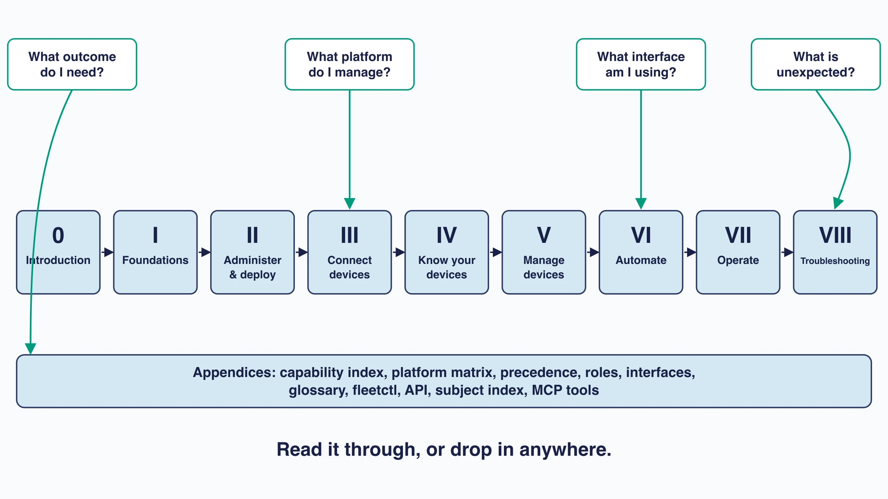

# How to use this manual

This is a complete guide to running Fleet. It is written for the people who operate it: endpoint administrators, infrastructure administrators, security engineers, IT teams, and anyone working alongside them.

It is built to be read two ways. Front to back, it explains how Fleet is designed to work and why, for anyone new Fleet it or planning a rollout or a migration to it. Opened at a single page, it gives you exact settings, commands, platform limitations , or explanations of why something failed - great for general reference or troubleshooting.

<!-- HERO IMAGE: A Cloud City scene, Fleet's own illustration system. Landscape 16:9.

     Several islands float at different heights against a wide, open, pale sky. Each island
     carries one or two small glass-like domed structures. A waterfall falls from the
     underside of the largest island and dissipates into cloud below it. Two swans glide
     through open air between islands. The islands are clearly separate, and thin light
     bridges or paths connect a few of them, so the composition reads as independent places
     that nonetheless belong to one city.
    
     Fleet brand palette only: pale sky in off-white #F9FAFC grading to lighter blue #E8F1F6
     and light blue #D3E8F3; island and structure linework in #192147; secondary detail and
     shadow in #515774 and #8B8FA2; at most one small #009A7D Fleet Green accent, if anything.
     Flat vector illustration, soft and calm, generous whitespace, no gradients beyond the
     sky, no drop shadows, no logo, no watermark, and no text anywhere in the image.
    
     Why this image: Cloud City is Fleet's symbol of openness and clarity, described as
     islands that are each independent yet interoperable as a whole. That is a fair picture
     of a managed estate, which is what this manual is about, so the image carries meaning
     rather than filling space. -->

## Where to start

**If you are evaluating Fleet or deploying it for the first time:**

- Begin with [What Fleet is](../01-foundations/1.1-what-fleet-is.md), then work through Part II to stand the service up and Part III to get devices connected. That is the shortest path from nothing to a working deployment.

**If you are designing fleets, labels, or administration boundaries:**

- Start with [Hosts, fleets, labels, and targeting](../01-foundations/1.3-hosts-fleets-labels.md). These are the decisions that are cheap now and awkward later, so they repay the time. Follow with the Part II administration chapters, then Part VI when you want it all in version control.

**If you already run an estate and want to get more from it**:

- Part IV covers reading device state and Part V covers changing it. Those two parts are the day-to-day of Fleet.

**If you are automating:**

- Part VI covers GitOps, the REST API, and fleetctl. Each feature chapter also has its own automation notes for the specifics.

**If you are administering the service itself:**

- Start with [The Fleet server](../01-foundations/1.6-the-fleet-server.md) for the architecture, then Part VII for upgrades, backups, availability, and monitoring.

**If something is broken right now:**

- Go straight to Part VIII and begin with the diagnostic method. It is written to narrow a vague symptom down to one failing channel before you start reading logs, which is faster than it sounds.

<!-- DIAGRAM: A map of the manual. Landscape 16:9, flat vector, off-white background, #192147 text, pale blue fills (#E8F1F6 or #D3E8F3) and a single Fleet Green (#009A7D) accent used sparingly.
     A horizontal spine runs left to right with nine labelled stops: "0 Introduction",
     "I Foundations", "II Administer & deploy", "III Connect devices", "IV Know your devices",
     "V Manage devices", "VI Automate", "VII Operate", "VIII Troubleshooting". Thin arrows
     connect them in sequence. Beneath the spine, a wide flat bar spanning its full width
     labelled "Appendices: capability index, platform matrix, precedence, roles, interfaces,
     glossary, fleetctl, API".
     Above the spine, four curved arrows drop in from the top, each landing on a different
     stop and each labelled with a question: "What outcome do I need?" landing on the
     appendices bar; "What platform do I manage?" landing on III Connect devices; "What
     interface am I using?" landing on VI Automate; "What is unexpected?" landing on
     VIII Troubleshooting.
     Caption underneath: "Read it through, or drop in anywhere."
     Large crisp legible type, no logo, no watermark, no drop shadows. Must be readable at
     half page width. -->

## Four kinds of material, and how to spot them

Every feature chapter carries four kinds of information:

 **Explanation** tells you why Fleet behaves the way it does. It is at the opening of a chapter, along with the diagrams.

 **How-to** tells you how to carry out a task. Prerequisites, steps, and how to confirm it worked.

 **Reference** tells you what a specific setting, field, command, or status means. Exact values, precedence rules, and limits. Most of it lives in the appendices, linked to from the chapter.

 **Troubleshooting** tells you why the result you expected did not arrive. Each chapter carries a short pointer into Part VIII, which owns the diagnostic material.

## Indexes

Fleet is easier to work with when you can start from the question you actually have rather than the one the table of contents expects. Four indexes will each get you to the same canonical page from a different direction.

If you know **the outcome you want**, such as installing software or rotating a recovery key, the [capability index](../09-appendices/a.1-capability-index.md) maps outcomes to chapters.

If you know **the device type** and want to know what is possible on it, the [platform capability matrix](../09-appendices/a.2-platform-capability-matrix.md) answers questions like what Fleet can do on Android.

If you know **the tool you are working in**, the [interface index](../09-appendices/a.5-interface-index.md) tells you whether something is reachable through GitOps, the API, fleetctl, or only the UI.

If you know **the symptom**, Part VIII is organised by what is failing rather than by feature.

## Version notes are part of the content

Every chapter records the Fleet release it was verified against, and how. Behaviour changes between releases, particularly API fields, GitOps YAML, fleetd update mechanics, operating system support, and which capabilities are in which plan.

A chapter that says it was verified at a release means someone checked it there. A chapter that says it is unverified means exactly that, and is worth treating with more caution than the ones carrying a release stamp.

When updating the manual for a new release:

1. Review the release notes and the relevant source changes for every affected feature.
2. Update the chapter's `verified_against`, `verified_on`, and `verified_source`.
3. Record a version boundary wherever a reader on an older release needs different guidance.
4. Leave the explanation alone where the product model did not actually change.

## Conventions

- **Fleet** capitalised is the product or the company. **fleet** lowercase is the scoping construct that older material and parts of the API still call a team. **Fleet** capitalised at the beginning of a sentence could be either. In those cases, clarifying information will be provided.
- A **report** is the saved, runnable osquery query object you create in Fleet; running one ad hoc is a **live report**. Fleet renamed these from "query" and "live query" in release 4.82.0. osquery, the database, and Redis kept the older word, so **query** still appears throughout Part VIII where it correctly names osquery's mechanism rather than Fleet's object. See [a.6](../09-appendices/a.6-glossary-and-release-compatibility.md).
- Commands, API fields, YAML keys, filenames, and configuration values appear in `code formatting`.
- Platform differences are called out where they change a decision you have to make, not everywhere they exist.
- Links into Part VIII are deliberate handoffs to diagnostic material. They are not a substitute for the explanation, which stays in the feature chapter.
