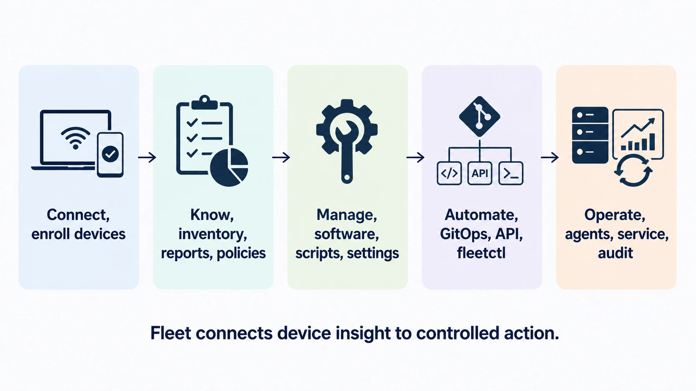

# What Fleet is

 Fleet brings device management, vulnerability detection, and software delivery together in one platform. It gives IT and security teams a shared place to understand their devices, improve their condition, and follow the results. You can use it to prepare a new laptop, respond to a vulnerable application, maintain a configuration, or gather evidence for a security review.

The problem Fleet addresses is familiar: the same computer can appear in an inventory system, a patching tool, a security report, and a support ticket, with someone responsible for joining the information together. Fleet connects that work around the device itself. The software you discover, the policy you check, and the change you deliver become parts of a workflow you can follow.

<!-- SCREENSHOT: SS-0.2-01 | Fleet’s Hosts page
     PURPOSE: Give the product overview a concrete view of the devices an administrator manages.
     PREPARE: Use a populated demo deployment with macOS, Windows, Linux and mobile hosts; choose realistic fictional hostnames and a mix of online/offline devices.
     CAPTURE: Capture the Hosts list with platform icons, hostnames, online indicators, and the fleet column visible. Keep the active fleet scope and filter/search controls in view.
     FRAME: One wide screenshot of the table and filter bar; include enough rows to show variety without a full-page scroll.
     EDITION: 4.91; reuse for 4.90 only when the visible controls and wording match
     PRIVACY: Use demo names and non-sensitive data; exclude tokens, passwords, keys, and personal identifiers.
     FILENAME: ss-0.2-01.png
-->

## One tool for a mixed-platform workplace

A workplace can have Macs and Windows laptops, Linux workstations and servers, mobile devices, and Chromebooks. Each platform brings its own management conventions. Fleet gives administrators a common place to work across that mix, with shared ways to organize devices, control administrative access, inspect their state, and automate supported changes.

Fleet provides multi-platform MDM for Apple devices, Windows, and Android, alongside agent-based management for macOS, Windows, and Linux and inventory visibility for ChromeOS. It uses each platform’s management facilities while bringing the work into one interface. You can support a broader range of devices without building a separate administrative practice around every operating system.

For a new colleague, this can mean preparing the right applications and settings for their computer. For an IT team managing several departments, it can mean organizing devices into fleets with clear responsibilities and configuration. For a security team, it can mean investigating devices across operating systems from a common starting point. The platform chapters explain the capabilities and requirements for each device type when you are ready to plan the details.

## Turn vulnerability information into a plan

A vulnerability feed becomes useful when you can connect a published problem to the software your organization actually has. Fleet automatically ingests vulnerability data and matches it against supported software and operating-system inventory. That brings vulnerability findings into the same environment you use to investigate hosts and manage their software.

You can move from a finding to the affected versions and devices, understand the size of the work, and decide where to focus. When a browser vulnerability is announced, for example, you have a place to identify the computers reporting that browser version and prepare the update. As devices report their new state and vulnerability processing runs again, you can follow the remaining exposure.

This connection helps make vulnerability management part of ongoing administration. Security staff can identify the devices that need attention, and IT staff can work from that information when arranging a change. [Software and vulnerabilities](../04-know-your-devices/4.4-understand-software-and-vulnerabilities.md) explains the coverage and how to interpret the findings.

## Spend less time packaging and chasing app updates

Keeping applications current involves repeated work: finding the right installer, preparing its installation steps, checking a new version, and getting it to the right devices. Fleet’s extensive maintained-app catalog takes on much of that preparation for macOS and Windows. It includes familiar applications such as Chrome, Firefox, Slack, and Zoom, with installation metadata and scripts maintained for you.

You can add those applications to your software library and make them available for deployment or self-service. With patch policies configured, Fleet can check whether a maintained app is current and request an update when a device needs one. You choose the targets and the rollout approach, then follow the installation results. The [Fleet-maintained apps guide](https://fleetdm.com/guides/fleet-maintained-apps) describes the catalog and its maintenance process.

Your software library can also include custom packages and applications from supported platform stores. That gives you room for the tools your organization depends on, including software specific to your own environment. A maintained catalog reduces recurring packaging work, while custom deployment options let you handle the applications that need your own instructions.

<!-- IMAGE-OK: assets/1.1-fleet-management-lifecycle.webp
     NOTE: reviewed 2026-08-24 and kept. The tint is right: the five stages stay
     distinguishable while the solid navy icons carry the weight, and Operate no longer reads
     as a support desk. Prompt retained for regeneration; do not delete.
     PROMPT: Fleet management lifecycle
Create a polished landscape 16:9 flat vector diagram for an enterprise endpoint-management
manual. On a off-white (#F9FAFC) background, show a single horizontal five-stage lifecycle with five
equal rounded panels and thin right-pointing arrows between them. Use #192147 text and
pale blue fills (#E8F1F6 or #D3E8F3) and a single Fleet Green (#009A7D) accent used sparingly. The panels read: "Connect: enroll devices";
"Know: inventory, reports, policies"; "Manage: software, scripts, settings";
"Automate: GitOps, API, fleetctl"; and "Operate: agents, service, audit". Give the five stage panels the five Fleet dot
colours as fills, in order, #5CABDF, #3AEFC4, #63C740, #C98DEF, #FAA669, with #192147 text on
top, since this is the diagram that introduces the shape of the whole manual and it should
look like Fleet. Include the caption: "Fleet connects device insight to controlled action." Use large, crisp, legible
typography; simple line icons; no logo, watermark, or drop shadows.
     PALETTE. Two sets, doing different jobs.
     STRUCTURE, the Fleet Black ramp and neutrals: #192147 for the most important marks,
     #515774 for ordinary labels, #8B8FA2 and #C5C7D1 for secondary structure, #E2E4EA for
     grouping bands, #F9FAFC background, #D3E8F3 and #E8F1F6 for quiet fills. All text stays
     in this set; do not tint type.
     THE FLEET DOTS, the six accent colours taken from Fleet's own logo mark: #5CABDF sky
     blue, #3AEFC4 mint, #63C740 green, #C98DEF lavender, #FAA669 apricot, #D66C7B rose.
     Fleet Green #009A7D sits alongside them. These are soft and pastel, so they work as
     fills with #192147 text on top.
     STRENGTH. Use a dot colour at full strength only for small marks: an arrow, a chip, a
     single filled icon, a rule. Over any large area, use it at roughly a 20 to 25 percent
     tint, so a panel reads as tinted rather than painted. Five large panels at full
     saturation looks like a children's infographic, not a technical manual. And do not
     colour a panel that has no content in it; colour has to carry meaning, and an empty
     coloured box is just noise.
     HOW TO USE THE DOTS. One colour per category, used consistently within the image, to
     fill or stroke the things a reader genuinely has to tell apart. Take only as many as
     there are categories; do not spread all six across four items to look lively. If nothing
     in the picture needs distinguishing, use none of them and let the structure set carry it.
     GIVE IT WEIGHT. At least one element should be a solid filled shape rather than an
     outline, so the composition has an anchor. Vary stroke weight so the primary flow is
     visibly heavier than the scaffolding around it.
     Never invent a colour outside these two sets. Flat vector, generous whitespace, no
     gradients, no drop shadows, no 3D or photorealistic icons, no logo, no watermark.
     Legible at half page width.
     NOTE: "Fleet" here is a software product for managing computers. Never draw vehicles,
     cars, vans, trucks, ships or aircraft. Never use an em-dash in rendered text. -->

## Built to work with your existing tools

Fleet’s API-first approach makes integration a central part of how you use the product. Its REST API gives custom tooling access to device data and management actions, while fleetctl provides a command-line interface for administration and automation. GitOps lets you keep supported configuration in version control, review changes with colleagues, and apply them through a repeatable process.

You can connect Fleet to the systems where your organization already works. Send device results or administrative activity to a logging platform. Let an external automation tool respond to a policy failure. Build an internal portal that uses Fleet data, or connect device-management work to an approval process you already trust. The API, logging destinations, and automation options give you several ways to make those connections.

That flexibility is especially useful when a standard integration cannot express the workflow you need. You can start with an interactive task in Fleet, learn what a successful result looks like, and then put the repeatable parts into your own tools. [The REST API](../06-automate-fleet/6.3-use-the-fleet-rest-api.md) and [integrations](../06-automate-fleet/6.5-integrations-webhooks-and-external-workflows.md) chapters explain those paths.

## Security evidence as part of daily administration

IT and security often need to answer related questions about the same device. Is it configured correctly? Is required software present? Does it meet an encryption requirement? Who requested the last change, and what happened afterward? Fleet brings inventory, policies, management actions, and activity records into a connected system that helps both groups work toward the answer.

Policies give you repeatable checks against device requirements. Reports help you investigate and collect information. Software and configuration tools let you act on what you find, while the relevant activity records and device results help you follow the work. For audit preparation, you can use that evidence to demonstrate device controls and investigate exceptions as part of the same administration process.

Consider an encryption requirement. An administrator needs to enable the appropriate setting and follow the device’s progress. A security reviewer needs evidence that the control is in place and a way to identify devices that still need attention. Fleet supports both sides of that job, helping you build audit evidence as you maintain the devices people use every day.

## Start with a useful outcome

Fleet is a strong fit when you want to bring a mixed device environment into a common operating practice, connect security findings to management work, and retain the freedom to build your own integrations. You can use managed hosting or run the Fleet service yourself, depending on how your organization wants to operate it.

A first project might be replacing a manual software-update process, improving inventory visibility, or preparing computers for new colleagues. Choose a concrete outcome, try it with a small set of devices, and use what you learn to plan the next step. [How to use this manual](0.3-how-to-use-this-manual.md#where-to-start) points you to those workflows and includes a local preview for exploring Fleet.

The full product spans Free and Premium features, with software management and several advanced controls in Premium. The [platform capability matrix](../09-appendices/a.2-platform-capability-matrix.md) puts platform support and licence requirements beside each capability so you can assess the setup your project needs.
