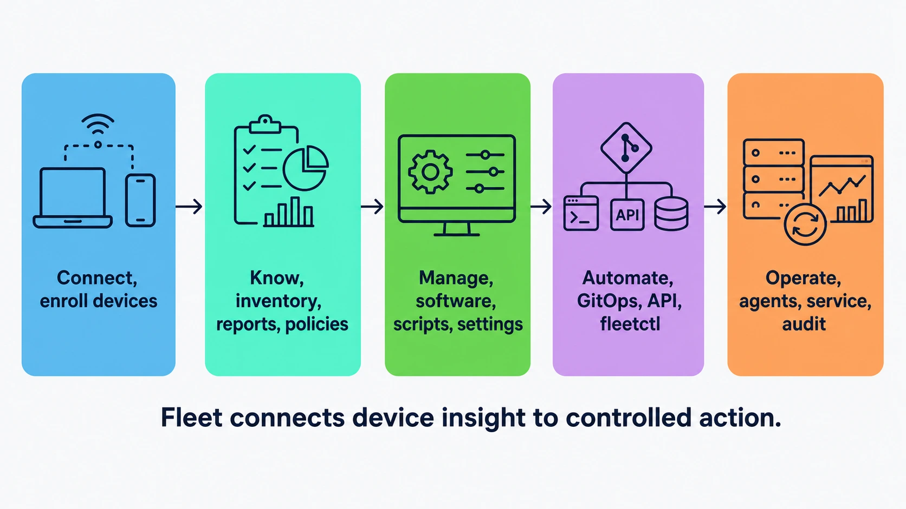

# What Fleet is

Fleet helps you see the state of the devices you manage and change them in controlled, auditable ways. Many organizations split those jobs between an inventory tool and mobile device management (MDM); Fleet gives both jobs one device record and one control plane.

Keeping those two tools in agreement is work in itself. Fleet's premise is that they are two halves of one job, and that both get easier when the thing reporting the state and the thing changing it share a single view of every device.

That framing explains part of the shape of this manual. Fleet has a reading half, covered in Part IV, and a writing half, covered in Part V. It also has work that belongs to neither: identity and authorization, enrollment, audit, and running the service itself, which are Parts II, III, VI and VII.

## What does Fleet do?

 Fleet is built to answer four practical questions:

1. **What is on this device, and what was its state when it last reported?**
2. **Which devices need a configuration, remediation, or software change?**
3. **How can we make and audit that change across the estate?**
4. **Did the device actually receive and apply it?**

Fleet reads device data through **osquery**, its query engine; runs agent-side work through **fleetd**, the installed agent bundle; and uses the device-management protocols available on each operating system for profiles and device commands.

Fleet answers the first question with host vitals, software inventory, and reports, run live or on a schedule. Ask what version of a browser is installed across a large estate and a live report goes out to the hosts that are online and returns what they say.

**A host's vitals, inventory, policy results and stored report rows are the latest thing that host told Fleet, not the present truth about the machine.** Configuration you set is different: a profile or a policy is stored because you wrote it, and it is current by definition. And Fleet does keep a little genuine history, for host uptime and for vulnerabilities, where a change appends rather than overwrites. The distinction sounds pedantic until an offline laptop shows a browser version it stopped running three weeks ago. Fleet stores a timestamp alongside what it holds, from the host's last-seen time down to the fetch time on an individual report row, and reading that timestamp next to the value is part of using the product rather than a refinement on top of it.

**What Fleet keeps of a scheduled report is the latest result, not a history.** Three separate behaviours hide behind that sentence, and conflating them is how estates end up with no retained data at all:

| Behaviour | What it does | What turns it off |
|---|---|---|
| Report storage | Keeps the newest result per host per query, replacing that host's previous rows, so the report page shows the latest answer per host and never a trend | The server-wide `discard_reports_data` setting, which also **deletes** the rows already stored; the report's own `discard_data`; a report that is not snapshot logging; and two separate row caps. **There are two, and only one is configurable**: a fixed per-host threshold of 1000 rows, above which that host stores nothing at all, and a configurable estate-wide `report_cap` that trims across hosts and sets the clipped marker ([4.2](../04-know-your-devices/4.2-run-queries-and-reports.md)). **Once a report is marked clipped, treat both its coverage and its freshness as unknown** |
| Result forwarding | Sends results outward to the configured result-log destination, which is where any long-term history has to live | **Automations being off for that query**, which is how a query starts life: the column defaults to off, so a query forwards nothing until someone turns it on |
| Activity audit | Records administrative actions on the server, on its own independent settings | Its own separate configuration |

The trap is the middle row. Configuring a log destination is not the same as sending reports to it: the destination is set once for the server, and each query decides for itself whether its results are forwarded. Log delivery is not the only route to a history, incidentally, since the REST API will return the stored report rows and you can export them periodically yourself; it is the route that scales without you writing the exporter. Note that `fleetctl` is not that route: `fleetctl report` runs a fresh live report and `fleetctl get reports` lists definitions, and neither returns the stored rows. If you want the log route, you need both settings, and [2.8](../02-administer-and-deploy-fleet/2.8-activity-audit-logs-and-log-delivery.md) covers the delivery machinery those settings drive.

<!-- SCREENSHOT: The Hosts page, which is the product's front door and the fastest way to
     make this chapter concrete. Show a populated list of a few dozen hosts across mixed
     platforms, with the online indicator, hostname, platform icon and fleet column all
     visible. Use realistic hostnames rather than test1 and test2, and no real serial
     numbers. Crop to the table and the filter bar above it, leaving out browser chrome.
     No highlight; the point is simply what the surface looks like. -->

The second question is the one that decides whether the first was worth asking. Knowing that four hundred devices are out of date matters only if you can describe *which* four hundred in terms Fleet can act on. That is what labels, policies, fleets, and vulnerability data are for: turning an observation into a defined set of devices.

The third question is where Fleet changes something. Software, scripts, configuration profiles, MDM commands, OS settings, and disk-encryption workflows all deliver work to the devices the second question identified.

**The fourth question exists because the third one does not answer it.** A change passes through distinct states on its way to a device: you write it down, Fleet works out which devices it applies to, the device is told, the device acts, and something confirms it. How many of those are visible, and when the audit entry lands among them, depends on the path.

An MDM command you send by hand writes its activity when Fleet successfully queues it. A configuration profile writes its activity when you store the desired state, and a reconciler works out the per-device commands afterwards. An Android profile does not use Fleet's device-command queue at all: Fleet patches a policy at Google and later checks the policy version the device reports.

What holds across all of them is the thing worth carrying: **the audit entry records that Fleet accepted your instruction, not that a device did anything with it.** A command can sit queued for days waiting for a check-in, or be delivered and refused, with a clean audit entry the whole time. Part VIII is largely the discipline of telling those states apart, and this manual tries never to let "Fleet says it did it" stand in for "the device did it".

Two more layers sit underneath. **Automation** through GitOps, fleetctl, the REST API, policy automations, and integrations makes the work reviewable and repeatable rather than clicked through by hand. **Operation** covers what it takes to run the service itself: agent channels, update controls, audit history, logs, and server maintenance.

The rest of this manual follows that progression. Connect devices, understand them, manage them, automate the work, and operate the service.

**Verification is not a sixth stage, which is why you will not find one in the picture below.** The fourth question is answered by going back round: you manage, and then you *know* again, and the gap between what you asked for and what the devices report is where the answer lives. So the loop from Manage to Know is doing double duty, carrying both the ordinary flow of the book and the check that a change actually landed. Part IV is where reading is covered and Part V where changing is, and the fourth question is the reason those two parts are read together rather than in sequence.

<!-- IMAGE-OK: 1.1-fleet-management-lifecycle.webp
     NOTE: reviewed 2026-08-24 and kept. The tint is right: the five stages stay
     distinguishable while the solid navy icons carry the weight, and Operate no longer reads
     as a support desk. Prompt retained for regeneration; do not delete.
     PROMPT: Fleet management lifecycle
Create a polished landscape 16:9 flat vector diagram for an enterprise endpoint-management
manual. On a off-white (#F9FAFC) background, show a single horizontal five-stage lifecycle with five
equal rounded panels and thin right-pointing arrows between them. Use #192147 text and
pale blue fills (#E8F1F6 or #D3E8F3) and a single Fleet Green (#009A7D) accent used sparingly. The panels read: "Connect: enroll devices";
"Know: inventory, reports, policies"; "Manage: software, scripts, settings";
"Automate: GitOps, API, fleetctl"; and "Operate: agents, service, audit". Give the five stage panels the five Fleet dot
colours as fills, in order, #5CABDF, #3AEFC4, #63C740, #C98DEF, #FAA669, with #192147 text on
top, since this is the diagram that introduces the shape of the whole manual and it should
look like Fleet. Include the caption: "Fleet connects device insight to controlled action." Use large, crisp, legible
typography; simple line icons; no logo, watermark, or drop shadows.
     PALETTE. Two sets, doing different jobs.
     STRUCTURE, the Fleet Black ramp and neutrals: #192147 for the most important marks,
     #515774 for ordinary labels, #8B8FA2 and #C5C7D1 for secondary structure, #E2E4EA for
     grouping bands, #F9FAFC background, #D3E8F3 and #E8F1F6 for quiet fills. All text stays
     in this set; do not tint type.
     THE FLEET DOTS, the six accent colours taken from Fleet's own logo mark: #5CABDF sky
     blue, #3AEFC4 mint, #63C740 green, #C98DEF lavender, #FAA669 apricot, #D66C7B rose.
     Fleet Green #009A7D sits alongside them. These are soft and pastel, so they work as
     fills with #192147 text on top.
     STRENGTH. Use a dot colour at full strength only for small marks: an arrow, a chip, a
     single filled icon, a rule. Over any large area, use it at roughly a 20 to 25 percent
     tint, so a panel reads as tinted rather than painted. Five large panels at full
     saturation looks like a children's infographic, not a technical manual. And do not
     colour a panel that has no content in it; colour has to carry meaning, and an empty
     coloured box is just noise.
     HOW TO USE THE DOTS. One colour per category, used consistently within the image, to
     fill or stroke the things a reader genuinely has to tell apart. Take only as many as
     there are categories; do not spread all six across four items to look lively. If nothing
     in the picture needs distinguishing, use none of them and let the structure set carry it.
     GIVE IT WEIGHT. At least one element should be a solid filled shape rather than an
     outline, so the composition has an anchor. Vary stroke weight so the primary flow is
     visibly heavier than the scaffolding around it.
     Never invent a colour outside these two sets. Flat vector, generous whitespace, no
     gradients, no drop shadows, no 3D or photorealistic icons, no logo, no watermark.
     Legible at half page width.
     NOTE: "Fleet" here is a software product for managing computers. Never draw vehicles,
     cars, vans, trucks, ships or aircraft. Never use an em-dash in rendered text. -->

## Fleet in your environment

 Fleet is not intended to be the only system you run. In addition to Fleet, you should also consider:

Your **identity provider** stays the source of truth for who people are, but Fleet keeps its own account for each administrator regardless. Without just-in-time provisioning, sign-on works only for an email the IdP asserts *and* Fleet already holds as an SSO-enabled user. With it, which is Fleet Premium, Fleet creates the account from the assertion during that first login. Either way Fleet ends up holding the account, and roles, sessions and API tokens live there. Plan for Fleet-side provisioning, role assignment, deprovisioning and at least one break-glass account that does not depend on the IdP ([2.5](../02-administer-and-deploy-fleet/2.5-identity-providers-sso-scim-and-role-sync.md), [2.6](../02-administer-and-deploy-fleet/2.6-user-accounts-roles-and-service-identities.md)).

**Configuration-management tools** keep the ground they already hold. Headless Linux servers are the clearest case, since Fleet has no MDM channel to them and an existing configuration management tool already owns their system configuration. Fleet can observe a machine it does not configure.

**SIEMs, data lakes, and security tooling** are good places to store and analyze the data Fleet generates, and that is where longer retention, correlation and response belong, because Fleet's own storage is built around latest-known state rather than history. It does keep a little of its own, for host uptime and vulnerabilities, which is not enough to plan a retention obligation around.

**There is no single "send it all somewhere" switch, though**, and expecting one is how estates end up with a destination that receives less than they think. Report results and status logs go to the osquery log plugins; the administrative activity stream goes to an independent audit plugin, which is Premium and off by default; and forwarding a given report's results is a per-query decision on top of both ([2.8](../02-administer-and-deploy-fleet/2.8-activity-audit-logs-and-log-delivery.md)).

**Apple MDM, Windows OMA-DM, and the Android Management API** are the platform-native management protocols, and Fleet speaks them rather than replacing them. When Fleet applies a configuration profile to a Mac, it composes the profile and hands it to Apple's management channel; the device's own MDM client is what actually applies it. That division shapes a great deal of this book, and the section below says which half is which.

**IT asset systems** stay the authority for procurement, financial ownership, contracts and lifecycle. Fleet contributes the device facts, as of each host's last report, and leaves that business record alone.

Be careful with the tidy version of this split, that the asset system holds expected state and Fleet holds actual state, because Fleet holds a good deal of expected state too: the configuration profiles and device settings you write are desired state waiting to be applied. Policies are not in that category, incidentally, and it is worth not lumping them in: a policy is a yes/no question Fleet asks the host, producing a pass or fail rather than a change, though an automation can be attached to react to a failure. Fleet also carries device-to-person mapping, and a host can have an assigned end user from your identity provider or a custom email attached directly. The line is about which system is authoritative for the commercial record, not about which one is allowed to know who uses a laptop.

The effect is that Fleet slots into an existing operating model while giving endpoint teams a common view of hosts and the work being done to them.

## What Fleet can do on each platform

 Fleet aims for a consistent administrative experience across platforms, and it can only ever use the mechanism each operating system actually offers. Under the hood, Windows, Android, Linux, macOS and iOS have wildly different deployment paths, and Fleet bridges them into a single interface.

**When a capability is missing for a platform, work through these checks, of which the operating system is only the first.** They are not a complete set, and the last two are not platform properties at all:

1. **The OS offers no mechanism.** Linux has no MDM to speak to, so there are no configuration profiles for it.
2. **Fleet has not implemented it at this release.** The Chrome extension answers live reports but does not upload scheduled results, which is a boundary in Fleet's code rather than in ChromeOS.
3. **Your edition does not include it.** Fleet Premium gates a great many features individually. Where Fleet does return an explicit licence error, which it does for the gates named later in this chapter, trying the operation and reading the error rules this out cheaply. What can hide it is the interface, which may simply not offer a control rather than offering one that refuses.
4. **The host has not met the prerequisite.** A capability that needs MDM enrollment or a particular fleetd version is absent until that is true rather than unsupported.
5. **Something above the host has switched it off.** Scripts are the clearest case: a global `scripts_disabled` server setting refuses every script run before any host is consulted, and your own role has to permit the action besides. Neither is a platform limit or a host state, and both present as the capability simply not working.

Earlier drafts of this manual assumed the first explanation by default, and were repeatedly wrong. Where a chapter knows which of these applies, it says so.

Two paths reach a Mac or a Windows PC, and it matters which one a piece of work travels:

| Device class | Device-data path | Agent action path | Platform-management path |
|---|---|---|---|
| macOS | fleetd and osquery | Orbit: scripts, installer-based software, fleetd updates | Apple MDM: profiles, MDM commands, App Store apps via the Volume Purchasing Program (VPP) |
| Windows | fleetd and osquery | Orbit: scripts, installer-based software, fleetd updates, **and lock, which is a script here rather than an MDM command** | Windows device management (OMA-DM): profiles, MDM commands, wipe |
| Linux | fleetd and osquery | Orbit: scripts, installer-based software, disk-encryption (LUKS) key escrow, lock and wipe as scripts | **none** |
| iOS / iPadOS | MDM-reported inventory | **none** | Apple MDM: profiles, commands, App Store apps via the Volume Purchasing Program (VPP) |
| Android | Android Management API (AMAPI)-reported inventory | A narrow Fleet app for certificate delivery only | Android Management API: policy, managed applications |
| ChromeOS | Fleetd for Chrome, a force-installed extension | **none** | **none**; Google Admin manages the Chromebook |

macOS, Windows, and Linux run fleetd, so they get the full osquery reading surface. iOS, iPadOS, and Android do not run fleetd at all, and most of what Fleet knows about them arrives through the management protocol. Not all of it: an Apple Business Manager sync can create a pending host row before the device has ever spoken to Fleet, so a record existing is not proof that a device checked in ([1.2](1.2-how-fleet-reaches-a-device.md), [3.5](../03-connect-devices/3.5-enroll-ios-and-ipados-devices.md)).

**Disk encryption on macOS crosses all three paths and belongs in no single column.** Turning FileVault on and escrowing the first key are delivered in an MDM profile; **osquery** is what retrieves the encrypted recovery key; and when a key has to be rotated, **Orbit** runs Escrow Buddy and osquery retrieves the new one. A FileVault problem therefore needs all three checked, and the usual "which column is this" question does not resolve it.

**Read the middle column before diagnosing a failed script or a failed package install.** Those are Orbit's work and need a working agent; the MDM command queue has nothing to do with them, and neither does MDM enrollment. Reaching for `fleetctl get mdm-commands` on a script that never ran is an entirely wasted afternoon.

**This table is not an edition promise.** Fleet Premium's gates are individual validations spread across features rather than one rule, and the shape is not intuitive: fleets themselves are Premium, software installation is Premium, scripts exist on Free but fleet-scoped execution does not, configuration profiles gate separately again for fleet scope and label scope, and gate their *contents* independently of that, and MDM commands carry gates specific to particular commands. Using a Fleet variable in a configuration profile needs Premium on **Apple and Windows**, from one shared check, with Apple applying further per-variable and certificate validation on top of that gate rather than in place of it. **Android is a third profile platform and does not work that way**: it accepts supported Fleet variables on Free, and gates particular profile *content* instead, currently `systemUpdate`. Each feature chapter states its own gate. **[a.2](../09-appendices/a.2-platform-capability-matrix.md) collects them in one place**, so use the matrix for the platform, licence, and prerequisite answer, then return to the owning chapter for the procedure.

The platform chapters in Part III cover enrollment and prerequisites. Feature chapters call out the platform differences that change an administrator's decision, and [a.2 Platform capability matrix](../09-appendices/a.2-platform-capability-matrix.md) carries the full per-feature breakdown, per platform, with the licence and prerequisites beside each answer.

## The main components, and what each one does

 Think of Fleet as a control plane with several device-side executors, each with one job. What follows describes the ones that carry most of the work rather than an exhaustive list: ChromeOS's extension and Android's narrow certificate app are device-side executors too, and both are covered where their platforms are.

One piece of vocabulary first, because the names overlap. **fleetd is a bundle, not a program.** What you install on a macOS, Windows or Linux host is fleetd, and it contains osquery, Orbit, and Fleet Desktop when the package was built with it. Fleet's own architecture documentation calls Desktop an optional component of the agent, which is the accurate framing: it is inside the bundle and it is a packaging choice. So osquery and Orbit are parts of fleetd rather than alternatives to it, and a sentence about "fleetd and osquery" is describing a container and one of its contents.

**ChromeOS gets a different artifact with a confusingly similar name.** *Fleetd for Chrome* is a browser extension, not a build of the bundle: no Orbit, no osqueryd, no Fleet Desktop, and **no native fleetd bundle**. Something is still installed, though: the extension has to be force-installed onto the Chromebook through Google Admin, which is a step in your Google console rather than in Fleet, and which stays Google's to manage afterwards. Its service worker enrolls against Fleet and answers live reports from its own virtual tables; scheduled reports are not available on ChromeOS at this release ([3.6](../03-connect-devices/3.6-enroll-android-and-chromeos-devices.md)).

**osquery** observes. It turns a running machine into something you can query, so Fleet can ask a question of an entire estate at once instead of crawling it one host at a time.

**Orbit** acts. It manages osquery's version and configuration, and handles the host-side work osquery has no business doing: installing software, running scripts, updating fleetd itself.

**Fleet Desktop** talks to the person. Some work needs a human in the loop, whether that is showing someone why their laptop is failing a policy or letting them install an approved application themselves.

**The OS MDM client** applies platform-native management, and the split here is worth stating precisely. The *client* is the operating system's: Apple and Microsoft wrote it, it ships with the device, and Fleet cannot change how it behaves. The *server* is Fleet's, and it is a substantial piece of the product: enrollment, profile and command construction, the command queue, and result handling are all Fleet's own code. "Fleet does not implement MDM" would be wrong. Fleet implements the half that runs in the data centre and depends entirely on the half that runs on the device.

**The Fleet service** holds the desired state, receives results, and coordinates the rest.
