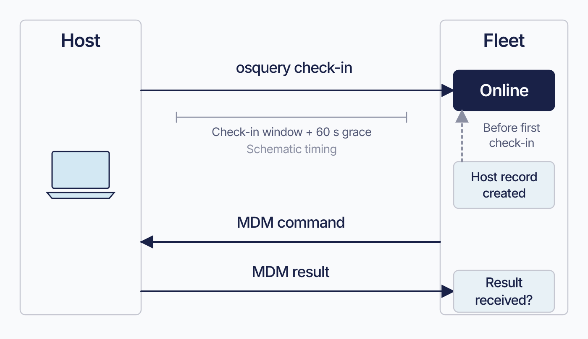

# How Fleet reaches a device

Fleet brings reporting and management together even when the work travels through different connections. A Mac might answer a report, install an application, and receive a configuration profile through three different components. Knowing which component carries each task helps you prepare the device and follow the result.

Fleet uses the channels each platform provides. macOS and Windows can run both the **fleetd** agent bundle and the operating system’s **MDM** client. Linux uses fleetd. Apple mobile devices and Android use their management channels; ChromeOS uses a browser extension.

**On a host running fleetd**, query and inventory work belongs to **osquery**, host-side management work belongs to **Orbit**, and profiles and MDM commands belong to the operating system's **MDM** client.

On ChromeOS, the extension answers distributed queries from its own virtual tables. iOS, iPadOS, and Android supply inventory through their management channels.

A fully enrolled Mac or Windows computer has several connections to Fleet, each on its own schedule. Some can work while others fail. Diagnose the channel that carries the requested work.

## The host-side bundle

 **fleetd** is the name of Fleet's host-side bundle and installer package. On macOS, Windows, and Linux the bundle contains three coordinated components:

1. **Orbit** is the component the operating system starts, and the one that starts everything else. It handles enrollment, keeps the bundle updated, and carries out host-side work: running scripts, installing software, updating fleetd itself. It runs as `orbit`, or `orbit.exe` on Windows.

2. **osquery** answers live reports, returns scheduled results, and supplies host vitals and software inventory. It runs as `osqueryd`. It is an independent open-source project that Fleet configures and communicates with.

3. **Fleet Desktop** provides the menu bar item, My Device link, and associated dialogs. Its `fleet-desktop` process runs during a logged-in desktop session. It is optional: include it with `--fleet-desktop` when building the package ([3.8](../03-connect-devices/3.8-manage-fleetd-orbit-and-updates.md)). Orbit also has its own user prompts, described below.

The operating system’s service manager starts Orbit, which starts osquery and, when included, Fleet Desktop.

On Windows, ending Orbit in Task Manager can leave `osqueryd` running and holding its database lock. Windows has no `SIGTERM`. Orbit therefore kills pre-existing `osqueryd` processes at startup before reading host information. If startup fails, check for an orphaned process that might still be holding the lock ([8.4](../08-troubleshooting/8.4-host-side-investigation.md)).

<!-- SCREENSHOT: SS-1.2-01 | Agent versions on a host
     PURPOSE: Connect fleetd’s component names to a real device record.
     PREPARE: Use a demo Mac or Windows host with fleetd enrolled and component versions populated.
     CAPTURE: Open host details and capture the Agent section showing the reported Orbit/fleetd and osquery versions, along with any Fleet Desktop version the release exposes. Preserve the UI’s actual labels.
     FRAME: Crop to Agent and a small amount of host header; use a readable scale and no unrelated tabs.
     EDITION: 4.91; reuse for 4.90 only when the visible controls and wording match
     PRIVACY: Use demo names and non-sensitive data; exclude tokens, passwords, keys, and personal identifiers.
     FILENAME: ss-1.2-01.png
-->

`fleetd` names the installed bundle. Its processes are `orbit`, `osqueryd`, and, optionally, `fleet-desktop`.

ChromeOS uses **Fleetd for Chrome**, a browser extension running as a service worker. It includes none of the three bundle processes.

<!-- IMAGE-OK: assets/1.2-fleetd-bundle.webp
     NOTE: reviewed 2026-08-24 and kept. Solid green Orbit box anchors the picture, the two
     supervised processes sit beneath it in pale blue, and the chain of custody is obvious at
     a glance. Prompt retained; do not delete.
     PROMPT: One large rounded rectangle labelled "Host". Inside it, a box at the top
     spanning the width labelled "Orbit (fleetd)", and two smaller boxes side by side below
     it labelled "osqueryd" and "fleet-desktop". Two arrows point down from Orbit to those
     two, each labelled "starts and supervises". Outside the Host rectangle on the left, a
     box labelled "Service manager (launchd, Service Control Manager, systemd)" with one
     arrow into Orbit labelled "starts and restarts". The two lower boxes use the #D3E8F3 fill. Give the Orbit box a
     solid #009A7D fill with white text, because it is the one the operating system starts and
     the one everything else hangs off. Do not colour-code the two lower boxes against each
     other; they are peers.
     Caption: "The service manager starts Orbit. Orbit starts everything else."
     PALETTE. Two sets, doing different jobs.
     STRUCTURE, the Fleet Black ramp and neutrals: #192147 for the most important marks,
     #515774 for ordinary labels, #8B8FA2 and #C5C7D1 for secondary structure, #E2E4EA for
     grouping bands, #F9FAFC background, #D3E8F3 and #E8F1F6 for quiet fills. All text stays
     in this set; do not tint type.
     THE FLEET DOTS, the six accent colours taken from Fleet's own logo mark: #5CABDF sky
     blue, #3AEFC4 mint, #63C740 green, #C98DEF lavender, #FAA669 apricot, #D66C7B rose.
     Fleet Green #009A7D sits alongside them. These are soft and pastel, so they work as
     fills with #192147 text on top.
     STRENGTH. Use a dot colour at full strength only for small marks: an arrow, a chip, a
     single filled icon, a rule. Over any large area, use it at roughly a 20 to 25 percent
     tint, so a panel reads as tinted rather than painted. Five large panels at full
     saturation looks like a children's infographic, not a technical manual. And do not
     colour a panel that has no content in it; colour has to carry meaning, and an empty
     coloured box is just noise.
     HOW TO USE THE DOTS. One colour per category, used consistently within the image, to
     fill or stroke the things a reader genuinely has to tell apart. Take only as many as
     there are categories; do not spread all six across four items to look lively. If nothing
     in the picture needs distinguishing, use none of them and let the structure set carry it.
     GIVE IT WEIGHT. At least one element should be a solid filled shape rather than an
     outline, so the composition has an anchor. Vary stroke weight so the primary flow is
     visibly heavier than the scaffolding around it.
     Never invent a colour outside these two sets. Flat vector, generous whitespace, no
     gradients, no drop shadows, no 3D or photorealistic icons, no logo, no watermark.
     Legible at half page width.
     NOTE: "Fleet" here is a software product for managing computers. Never draw vehicles,
     cars, vans, trucks, ships or aircraft. Never use an em-dash in rendered text. -->


## Which component owns which kind of work

 On macOS, Windows, and Linux, identify the component responsible for the work:

**osquery** handles live reports, scheduled results, host vitals, software inventory, and file carves.

**Orbit** handles agent enrollment, scripts, installer-based software delivery, fleetd updates, setup, and supported disk-encryption workflows.

**The OS MDM client** handles profiles, MDM commands, managed apps, and supported device actions. Fleet prepares the instruction; the operating system carries it out.

Lock and wipe use different mechanisms by platform:

| | Lock | Wipe |
|---|---|---|
| macOS | MDM command | MDM command |
| Windows | **A script over the agent**, gated on Windows MDM being configured *and* scripts being enabled on the host | MDM command |
| Linux | A script over the agent | A script over the agent |

Windows lock requires Windows MDM to be configured and Orbit to execute the script. Fleet refuses the request if the host has reported scripts disabled; otherwise it queues the work for the agent. Every action in this table requires Fleet Premium ([3.4](../03-connect-devices/3.4-enroll-linux-devices.md)). Eligible company-owned Android wipe is the Free exception outside this table ([3.6](../03-connect-devices/3.6-enroll-android-devices.md)).

**Fleet Desktop** provides My Device, Self Service, and menu bar dialogs.

Orbit prompts directly for a Linux LUKS passphrase through `zenity` or `kdialog`. That workflow works without Fleet Desktop.

Start a live-report investigation with osquery, an agent-delivered install investigation with Orbit, and a profile-delivery investigation with MDM.

For ChromeOS live reports, inspect the extension and its virtual tables. For stale iPhone inventory, inspect MDM.

## The five channels

 A fully enrolled Mac or Windows computer uses five families of traffic for management work. Each has its own owner and schedule, which gives you a way to follow a request through the system. A sixth family carries the end user’s session when Fleet Desktop is installed.

The separate **device-authenticated API** uses `device/...` paths and a per-host token. This lets a user open My Device without a Fleet account. Fleet Desktop is its main consumer, but Orbit initializes the client and manages the token even when Desktop is omitted. macOS setup also uses this API.

The matrix below identifies the management channels available on each platform.

Each channel has its own diagnostic evidence, but channels can share processes and credentials. The three osquery channels use one `osqueryd` process and one node key; losing that process stops all three.

The following five management families are also the diagnostic categories used in [8.1](../08-troubleshooting/8.1-diagnostic-method.md). The device-authenticated API is listed separately.

| Channel             | Carries | Typical cadence |
| ------------------- | ------------------------------------------------------------ | ------------------------------------------------------- |
| osquery distributed | Live reports and host-detail queries | `distributed_interval`, which Fleet's default agent options set to 10 seconds |
| osquery config TLS  | The query schedule and the `agent_options.config` block, which is osquery's own configuration. Orbit's settings, including `command_line_flags` and `update_channels`, travel on channel 4 instead | `config_refresh`, which fleetd passes to osquery as 60 seconds |
| osquery logger TLS  | Query results                                                | `logger_tls_period`, defaulting to 10 seconds           |
| Orbit API           | Scripts, software, setup experience, agent configuration, and host-side workflows | 30-second configuration poll plus request/response work |
| MDM protocol        | Profiles, MDM commands, managed apps, and most lock and wipe operations | Platform-specific push or poll               |

osquery uses separate endpoints for distributed queries, configuration, and outward result logging. File carving adds an endpoint on hosts that use it. Orbit’s configuration poll and work requests use the Orbit API.

MDM timing depends on the platform. Apple uses a push to wake the device, which decides when to respond. Windows polls on an interval Fleet can configure. Fleet can also ask a capable fleetd host to open an OMA-DM session when work is waiting.

A proxy or content filter can block one osquery endpoint while the others remain reachable.

Some work depends on more than one channel. Orbit wakes Windows MDM between relaxed polls, so queued commands can wait hours if Orbit stops working ([8.9](../08-troubleshooting/8.9-windows-mdm-diagnostics.md)). Synchronous scripts also require a host Fleet considers online; stale osquery check-ins can therefore prevent that Orbit work from starting.

<a id="which-families-a-platform-actually-has"></a>

### Supported channels by platform

 Use the platform’s available channels to decide what evidence to collect. The table identifies which connections exist on each kind of device.

| Platform | osquery distributed | osquery config | osquery logger | Orbit API | MDM | Families |
|---|---|---|---|---|---|---|
| macOS, fully enrolled | yes | yes | yes | yes | Apple MDM | 5 |
| Windows, fully enrolled | yes | yes | yes | yes | OMA-DM | 5 |
| Linux | yes | yes | yes | yes | **none** | 4 |
| macOS or Windows, agent only | yes | yes | yes | yes | not enrolled | 4 |
| macOS or Windows, MDM only | **no** | **no** | **no** | **no** | yes | 1 |
| iOS / iPadOS | **no** | **no** | **no** | **no** | Apple MDM | 1 |
| Android | **no** | **no** | **no** | **no** | AMAPI and Pub/Sub | 1, plus the narrow certificate app |
| ChromeOS | **the extension answers this** | **no** | **no** | **no** | **none** | 1, and narrower than it looks |

The ChromeOS extension uses Fleet’s enroll, distributed-read, and distributed-write endpoints. It answers live reports from its own virtual tables. It has no config-fetch or logger-upload path, so scheduled reports are unavailable.

A successful ChromeOS live report demonstrates that the extension is responding. Use the channel count to choose an investigation path; it does not describe the platform’s full feature set ([3.7](../03-connect-devices/3.7-enroll-chromeos-devices.md)).

<!-- IMAGE-OK: assets/1.2-five-channels.webp
     REDONE 2026-08-30: regenerated so the five families are scoped to a fully enrolled Mac or Windows host, described as diagnosed separately (not failing independently), with the 10-second distributed default. Reviewed and accepted.
     WHY-WAS-REDO:
     WHY: the rendered caption still says "Five channels. They fail independently" and arrow 1 still says "every 10 to 30 seconds". The chapter has withdrawn both: five is the count for a fully enrolled Mac or Windows computer only, the families are separately diagnosable rather than independent, and Fleet's default distributed_interval is 10 seconds. Corrected prompt below.
     Until it is regenerated, the paragraph under the image scopes it in words. The reviewer
     that originally said to leave this asset alone retracted that once the prose changed.
     Earlier note, reviewed 2026-08-24 and kept. Rebuilt from the earlier composition as asked:
     the host and server read as devices again, the arrows reach both ends, and one brace now
     spans arrows 1 to 3 for osqueryd rather than three separate ones. One blemish accepted
     rather than chased: the word "Orbit" sits against the laptop's lower edge. It is legible,
     and five rounds of regeneration have shown that re-rendering to fix a small thing tends
     to break a larger one. Prompt retained for regeneration; do not delete.
     PROMPT: Landscape 16:9 technical diagram. A simple generic computer on the left
     labelled "Host", and a simple server on the right labelled "Fleet server". Draw the
     Host as a flat #192147 outline. Make the Fleet server a solid #192147 shape with its
     label in #F9FAFC, so it is the composition's anchor. No shading or perspective.

     Above the diagram, place the scope label "A fully enrolled Mac or Windows computer"
     in #515774. Between Host and Fleet server, draw five horizontal arrows stacked
     vertically. Every arrow must visibly reach both endpoints. Above each arrow, top to
     bottom: "1. osquery distributed", "2. osquery config TLS", "3. osquery logger TLS",
     "4. Orbit API", "5. MDM protocol". Below each, smaller #515774 text: "live reports
     and host-detail queries; Fleet default: 10 seconds", "query schedule and agent
     options; fleetd sets 60 seconds", "query results; outbound; Fleet default: 10
     seconds", "installs, scripts, encryption keys; 30-second config poll plus
     request/response", "profiles and MDM commands; Apple push, Windows poll".

     On the Host side, use one brace spanning arrows 1 to 3 labelled "one osqueryd
     process". Label arrow 4 "Orbit" and arrow 5 "OS MDM client". Arrow 3 has one
     arrowhead pointing from Host to Fleet server. Arrows 1, 2, 4 and 5 are
     double-headed. Arrowheads describe the carried information, not which side opens
     the network connection.

     Use one Fleet dot colour per traffic family, in order: #5CABDF, #3AEFC4, #63C740,
     #C98DEF, #FAA669. Apply these colours only to the arrow strokes and arrowheads.
     Also vary line weight and dash pattern enough that the rows remain distinguishable
     without colour. The colours distinguish the five named families only. They do not
     mean separate processes, credentials or failure domains. Do not render the words
     "independent", "fail independently", "universal", "exhaustive", "all" or "always",
     and do not add an equivalent claim. Band the five rows with alternating #F9FAFC and
     #E8F1F6 so they read as one stack. Do not add other endpoint rows.

     Caption: "Five traffic families on a fully enrolled Mac or Windows computer. They
     are diagnosed separately."
     PALETTE. Two sets, doing different jobs.
     STRUCTURE, the Fleet Black ramp and neutrals: #192147 for the most important marks,
     #515774 for ordinary labels, #8B8FA2 and #C5C7D1 for secondary structure, #E2E4EA for
     grouping bands, #F9FAFC background, #D3E8F3 and #E8F1F6 for quiet fills. All text stays
     in this set; do not tint type.
     THE FLEET DOTS, the six accent colours taken from Fleet's own logo mark: #5CABDF sky
     blue, #3AEFC4 mint, #63C740 green, #C98DEF lavender, #FAA669 apricot, #D66C7B rose.
     Fleet Green #009A7D sits alongside them. These are soft and pastel, so they work as
     fills with #192147 text on top.
     STRENGTH. Use a dot colour at full strength only for small marks: an arrow, a chip, a
     single filled icon, a rule. Over any large area, use it at roughly a 20 to 25 percent
     tint, so a panel reads as tinted rather than painted. Five large panels at full
     saturation looks like a children's infographic, not a technical manual. And do not
     colour a panel that has no content in it; colour has to carry meaning, and an empty
     coloured box is just noise.
     HOW TO USE THE DOTS. One colour per category, used consistently within the image, to
     fill or stroke the things a reader genuinely has to tell apart. Take only as many as
     there are categories; do not spread all six across four items to look lively. If nothing
     in the picture needs distinguishing, use none of them and let the structure set carry it.
     GIVE IT WEIGHT. At least one element should be a solid filled shape rather than an
     outline, so the composition has an anchor. Vary stroke weight so the primary flow is
     visibly heavier than the scaffolding around it.
     Never invent a colour outside these two sets. Flat vector, generous whitespace, no
     gradients, no drop shadows, no 3D or photorealistic icons, no logo, no watermark.
     Legible at half page width.
     NOTE: "Fleet" here is a software product for managing computers. Never draw vehicles,
     cars, vans, trucks, ships or aircraft. Never use an em-dash in rendered text.
     NOTE: "Fleet" here is a software product for managing computers. Never draw vehicles,
     cars, vans, trucks, ships or aircraft. Never use an em-dash in rendered text.
     PROMPT REWRITTEN 2026-08-27 by the independent reviewer against the corrected prose.
     It found eight defects in the author's hand-edited version, including a caption still
     claiming the five families "fail separately" (the three osquery rows share one process),
     a 30-second cadence wrongly attached to installs and scripts generally, and two
     contradictory colour instructions. Do not hand-edit this prompt; send it back for review.
-->


The diagram shows a fully enrolled Mac or Windows computer. Use the matrix for other configurations.

## What “online” tells you

 The online indicator helps you judge whether Fleet has heard from a host recently. Fleet marks the host online when its last-seen time falls within the shorter of two reported intervals, plus a 60-second grace period. Those intervals are `distributed_interval` and the configuration-refresh interval.

Last-seen normally comes from an osquery check-in. Before the first check-in, Fleet uses the time the host record was created, so a newly created record can show online during the grace period even though the device has not yet contacted Fleet.

The online window uses the shorter of the host’s reported intervals, plus the grace period. For the config interval, Fleet reads `config_tls_refresh`, falling back to `config_refresh` when the first flag is absent. These are names from different osquery versions for the same setting. fleetd sets `config_refresh` to 60 seconds and leaves `config_tls_refresh` unset.

How an osquery version reports an unset flag can affect the interval Fleet calculates. That agent behaviour is unverified here: the resulting window may be the grace period alone or the grace period plus a check-in interval. Read the host’s reported flags when exact timing matters.

<!-- SCREENSHOT: SS-1.2-02 | Online status and last-seen time
     PURPOSE: Show which visible fields describe contact freshness.
     PREPARE: Use an established demo host that has checked in successfully. Have an offline host available for an optional comparison frame.
     CAPTURE: Capture the online indicator and the last-seen timestamp together in host details. If a tooltip supplies the exact time, capture it open. A second frame may show the same area for the offline host.
     FRAME: Keep both fields in one frame wherever possible; do not imply that the indicator proves an MDM command succeeded.
     EDITION: 4.91; reuse for 4.90 only when the visible controls and wording match
     PRIVACY: Use demo names and non-sensitive data; exclude tokens, passwords, keys, and personal identifiers.
     FILENAME: ss-1.2-02.png
-->

Both intervals are osquery options under `agent_options.config.options`. Changes apply at the next configuration refresh without restarting osquery:

```yaml
agent_options:
  config:
    options:
      config_refresh: 60
      distributed_interval: 30
```

osquery runtime options and startup flags belong at different levels:

| Under `agent_options.config` | Directly under `agent_options` |
|---|---|
| osquery's **runtime** configuration, passed through to osquery more or less as written: `options`, `decorators`, schedules | osquery's **startup** flags, as `command_line_flags`, plus settings Fleet itself acts on such as `update_channels`, `extensions` and `script_execution_timeout` |

`distributed_interval` belongs under `agent_options.config.options`; `command_line_flags` belongs directly under `agent_options`. Check the nesting when a value appears to be ignored.

Lowering `distributed_interval` speeds live-report pickup. The shorter of the two reported intervals controls the online window, so changing the larger one affects that window only if it becomes the smaller value. Raising the smaller interval reduces check-in traffic and extends how long a check-in counts as current. Balance responsiveness against network traffic.

Any authenticated osquery request refreshes last-seen, including configuration, distributed-query, and logger traffic. A host that keeps fetching configuration or uploading buffered results can therefore appear online while its distributed endpoint is failing. If a live report fails, investigate that channel even when the online indicator is present ([8.1](../08-troubleshooting/8.1-diagnostic-method.md)).

Check MDM and Orbit through their own work status. A host may answer a live report while an MDM command waits for check-in; an MDM-enrolled device can report enrollment before fleetd is installed. Inspect the evidence for the requested action.

<!-- IMAGE-OK: assets/1.2-online-evidence-boundary.webp
     QUESTION: What evidence does the Online badge actually provide?
     PROMPT: DIAGRAM: Draw one host with two independent paths to Fleet: Recent osquery check-in,
     and MDM command and result. Only the osquery path feeds an Online indicator; the MDM path has
     its own Result received? question with no causal arrow from Online. Under the osquery path
     place a compact freshness bracket labelled Check-in window + 60 s grace, explicitly schematic
     rather than a measured timeline. Add a small dotted alternative input Host record created,
     labelled Fallback before first check-in. Avoid a universal numeric check-in interval and avoid
     presenting enrollment status as channel health.
     TERMINOLOGY: Fleet is the product, server, or company. Host groups are lowercase
     fleet/fleets, even in titles and node labels. Do not call those groups teams. Preserve
     exact code/API identifiers; do not render these terminology instructions as image text.
     DESIGN: Flat vector technical diagram. Fleet is software for managing computers; draw no
     vehicles. Use Inter labels and Roboto Mono identifiers. At 1400 px source width use 48 px
     titles, 36 px body labels, and at least 28 px secondary text; scale proportionally. Check at
     720 px reading width and intended print size. Use a 32 px spacing grid, at least 24 px node
     padding, and consistent corner radii. Center short node names; left-align multiline
     explanations. Never shrink text to fit. Use #F9FAFC background, #192147 headings and primary
     connectors, #515774 text, #8B8FA2 secondary connectors, #C5C7D1 borders, and #D3E8F3 or #E8F1F6
     quiet fills. Use #5CABDF and #C98DEF for named categories, #3AEFC4 for labelled positive
     outcomes, #D66C7B for labelled failures, and #FAA669 for labelled cautions. Tint large panels
     to 20 to 25 percent; full strength is for small marks. Keep text navy or slate, or off-white on
     a navy anchor. Never rely on colour alone. Use one arrowhead shape, consistent stroke weights,
     box-edge termination, and labelled branches and return paths. Keep connectors clear of text. No
     gradients, shadows, decorative icons, logo, watermark, em-dashes, or slogan footer. Render only
     the specified reader-facing labels. Choose orientation to fit the relationship, not a default
     poster. Keep captions outside the artwork. If labels crowd, split the figure before shrinking
     them. Keep editable SVG when the production method supports it.
     NOTE: Reviewed and installed 2026-09-09 in the live 4.91 and frozen 4.90 editions.
     Checked against the chapter and its version-specific evidence during the editorial pass.
     The surrounding text retains technical qualifications and accessible explanation.
     SOURCE: research/visual-reviews/part-0-1/assets/1.2-online-evidence-boundary.svg
-->


## Where there is no agent at all

 Phones, tablets, and Chromebooks use different management and inventory paths from computers running fleetd. Plan their enrollment and daily work around those available paths.

| Platform | Orbit | osquery | Fleet Desktop | MDM | Management path |
|---|---|---|---|---|---|
| macOS | yes | yes | optional | Apple MDM | Full bundle plus MDM |
| Windows | yes | yes | optional | OMA-DM | Full bundle plus MDM |
| Linux | yes | yes | optional | **none** | Orbit and osquery only |
| iOS / iPadOS | **no** | **no** | **no** | Apple MDM | MDM protocol only |
| Android | **no** | **no** | **no** | AMAPI | AMAPI, plus a force-installed narrow-scope Fleet app |
| ChromeOS | **no** | **no** | **no** | none | Chrome extension |

**iOS and iPadOS use MDM for device actions.** They have no Orbit polling loop, step-by-step setup display, scripts, osquery vitals, or Fleet Desktop. Software delivery is limited to App Store and in-house apps.

A host record can appear before an iPhone or iPad completes enrollment. Apple Business sync can create a `Pending` host, and an enrollment link can create a record from the device’s serial, product, and UDID before MDM enrollment begins ([3.5](../03-connect-devices/3.5-enroll-ios-and-ipados-devices.md)). Use the enrollment status to distinguish that initial record from a device ready for management.

**Linux uses osquery and Orbit.** Fleet escrows keys for hosts that report LUKS encryption; it cannot enable LUKS. A host encrypted after enrollment becomes eligible once it reports its encrypted state ([3.4](../03-connect-devices/3.4-enroll-linux-devices.md)).

**Android has neither fleetd nor osquery.** Management is Google's Android Management API: Fleet pushes policies and managed apps to it, and device events return over a Google Cloud subscription.

Set the Android server URL before enrollment. Fleet uses that URL when creating the subscription’s push endpoint, and Google must be able to reach it. Fleet rejects `localhost` and loopback addresses when enabling Android.

Keep the Android server URL stable after enrollment. Fleet accepts a later well-formed `server_url` change and resynchronizes Apple enrollment profiles, but it leaves Google’s push endpoint at the old address. Google continues sending events there, and this release has no established supported recovery procedure for the mismatch ([2.12](../02-administer-and-deploy-fleet/2.12-bind-android-enterprise.md)).

Fleet’s Android app enrolls and delivers certificates into the device keystore. Certificate-template creation requires Premium. The app supplies no inventory, reports, or scripts.

**ChromeOS runs the extension and nothing else**, configured with a Fleet URL and an enroll secret, and the Fleet URL must present a valid TLS certificate.

## How the agent updates itself

 Orbit updates itself, osquery, and Fleet Desktop directly from the update repository. Updates can continue while the Fleet server is unreachable. Blocking repository access stops version updates.

Each component tracks its own **update channel**, a pointer to an artifact in the update repository. You can follow `stable` or `edge`, or use a literal version string to pin that component to a particular release.

Channels are set when a package is built, and can be changed centrally afterwards through agent options, which is a Fleet Premium capability:

```yaml
agent_options:
  update_channels:
    orbit: stable
    osqueryd: '5.10.2'
    desktop: edge
```

That combination puts agent versions under your control:

| You want | Set the channel to |
|---|---|
| Track the current agent | `stable`, which is also what an omitted component means |
| Validate the next agent before it reaches stable | `edge`, on a small fleet |
| Hold a known-good version while investigating a regression | the literal version, for example `'5.10.2'` |
| Roll back a bad agent across the estate | the literal previous version |
| Upgrade osquery without touching Orbit | **not** the `osqueryd` key alone: an omitted component is normalised to `stable`, so a block naming only `osqueryd` silently moves Orbit and Desktop to `stable` too. Name every component you want to keep where it is |

Central update-channel configuration overrides the values compiled into a package, including a change to an older version. You can therefore roll back without building another installer. Hosts pick up the configuration on their next poll and restart the affected components. Polls are thirty seconds apart with a healthy server and can back off to five minutes after sustained failures ([3.8](../03-connect-devices/3.8-manage-fleetd-orbit-and-updates.md)).

These are fleet-level agent options. Use a separate fleet for an update-channel pilot, as described in [1.3](1.3-hosts-fleets-labels.md).

When a version pin is finished, write `stable` explicitly: removing `update_channels` leaves the existing selection in place. If a configured channel does not exist, its lookup fails and is logged on the host. Fleet’s interface shows the resulting version stagnation, so check the host log to identify the failed lookup.

Fleet uses `edge` for an agent under validation and `stable` for the current published agent. Channel contents are update-repository state, so inspect them before a rollout. Use a small fleet for early validation.

## Rolling out the agent and MDM separately

 You can introduce fleetd and Fleet MDM separately, in either order. This gives you a gradual rollout path: begin with the capabilities you need first, then add the other channel when you are ready.

| What the host has | You get | You do not get |
|---|---|---|
| fleetd, no MDM | Live and scheduled reports, vitals, software inventory, scripts, Orbit-driven software installs, LUKS escrow on Linux (Premium), and **lock and wipe on Linux** (Premium), which Fleet runs as scripts rather than as MDM commands | Profiles, MDM commands, App Store apps. Wipe on macOS and Windows, and lock on macOS, which do require MDM |
| MDM, no fleetd | Profiles, MDM commands, App Store apps, wipe, lock **except on Windows**, where the lock runs as a script over the agent and therefore cannot complete without one (Premium throughout, with one free exception), and inventory on the platforms where MDM supplies it | Reports, scripts, Orbit installs, and inventory on platforms that depend on the agent for it |
| Both | The union of what that platform, enrollment type, configuration and edition allow | |

You can install fleetd through an existing MDM provider or package tool while Fleet MDM enrollment proceeds separately.

Verify both agent and MDM operation during rollout.

Several licence gates cut across that table. Every lock operation Fleet offers is Premium. Every wipe is Premium too, with a single exception: wiping an eligible company-owned Android device is available on Free, and Free's wipe implementation rejects every other platform ([3.6](../03-connect-devices/3.6-enroll-android-devices.md)). Disk encryption, including the LUKS escrow in the first row, is Premium: Free refuses to turn `enable_disk_encryption` on at all. **Software is Premium on both paths**, uploaded installers delivered by Orbit and App Store or managed apps delivered over MDM alike, so a Free deployment gets the reporting rows of that table and very little of the acting.

What an MDM-enrolled host without an agent can still tell you depends entirely on the platform. On iOS and iPadOS there is no agent at all, and on Android there is only the narrow certificate app described above, so Fleet builds the host record from what the management channel reports and those hosts are visible and inventoried without one. On macOS and Windows, where fleetd is the normal source of inventory, an MDM-only host appears in Fleet and stays thin: enrolled, reachable by command, and largely silent about what is on it.

<a id="what-only-fleet-desktop-can-do"></a>

## Fleet Desktop and user prompts

 Fleet Desktop is fleetd's main end-user-facing surface, and the only one with a persistent presence. It carries the My Device link, Self Service, and the dialogs that need a human answer, including the macOS MDM migration prompt.

Linux disk-encryption escrow can prompt for the user's LUKS passphrase, and that prompt is Orbit's. It goes through `zenity` or `kdialog` and does not involve Fleet Desktop at all. So a Linux host without Fleet Desktop can still escrow.

**Whether a dialog tool is required depends on which escrow path the host takes**, and there are two:

| Host | Path | Needs `zenity` or `kdialog` |
|---|---|---|
| snapd-managed TPM-backed full-disk encryption, as on recent Ubuntu | Orbit escrows the recovery key through the snapd socket, silently | **No.** The dialog is best-effort, used only to warn on failure |
| Everything else with LUKS | Orbit prompts for the passphrase and adds a key slot | **Yes**, and its absence is fatal to escrow |

Both paths require `cryptsetup`, which Orbit checks first. Establish which escrow path a host uses before investigating a missing dialog tool ([3.4](../03-connect-devices/3.4-enroll-linux-devices.md)).

Fleet Desktop requires a logged-in desktop session. It does not run while the host is at the login window.

Include Fleet Desktop for fleets whose users need its functions. Omit it from headless server packages.

## Edge cases and precedence

 **Orbit cannot reach Fleet.** Its configuration poll backs off from 30 seconds to a maximum of five minutes. The first success restores the normal interval. osquery runs separately and can still answer live reports when its own endpoints remain reachable. Network errors are logged sparingly, so log volume does not measure the severity of the outage.

Queued work follows each feature’s expiry and cancellation rules. There is no verified retention guarantee here covering every script, install, command, and result. osquery buffering and timestamp replay also depend on its configuration.

**Enrollment fails.** Orbit makes up to six attempts, with delays of roughly 10, 20, 40, 80, and 160 seconds. `FLEETD_SILENCE_ENROLL_ERROR` suppresses one retry-notice line; each failed attempt is still logged at ordinary info verbosity ([8.2](../08-troubleshooting/8.2-log-surfaces.md)).

**An update fails.** Repeated failures trigger a 24-hour pause for that artifact. Publishing a different version avoids that artifact’s pause; restarting Orbit clears its in-memory retry state.

**A failing target stops the update pass.** Orbit checks itself, then osquery, then Desktop when installed. A lookup or update error ends that pass, so a failing Orbit target prevents the other components from being checked. Investigate the first failing target when several component versions stop advancing ([3.8](../03-connect-devices/3.8-manage-fleetd-orbit-and-updates.md)).

**Updates partially succeed.** A newer Orbit and older osquery can run together during an update.

**A configured channel does not exist.** The host logs a lookup failure, and the error ends that update pass before later targets are checked. Inspect the host log when versions stop advancing; it identifies the invalid channel more directly than the version shown in Fleet.

**osquery startup flags.** Omitting `command_line_flags` leaves the current file unchanged. An explicit empty value clears it and restarts osquery. Reapplying an unchanged value causes no write or restart.

Building a package without supplying a flag file blanks an existing one. This is the opposite of the agent-options behaviour above. If you maintain osquery flags locally, always pass the flag file when packaging.

**An agent directory is restored onto different hardware on macOS.** Orbit reads the live hardware UUID through a temporary osquery database and compares it with the UUID stored on disk. A mismatch clears enrollment state and exits, allowing a fresh enrollment with the new hardware identity.

Automatic hardware-identity recovery is macOS-only in 4.90.0. On Windows and Linux, an image made from an already-enrolled machine still carries that host’s enrollment state. Remove the agent state as part of the imaging procedure before using the image on other devices ([3.3](../03-connect-devices/3.3-enroll-windows-devices.md), [3.4](../03-connect-devices/3.4-enroll-linux-devices.md)).

The half-enrolled state: MDM enrolled, no agent. Agent installation can fail after MDM enrollment succeeds. The host can receive and acknowledge MDM commands while agent-dependent vitals, scripts, and software delivery remain unavailable. Check both paths when MDM enrollment is On but agent reports are missing ([8.4](../08-troubleshooting/8.4-host-side-investigation.md)).

**Fleet Desktop with no desktop session.** Orbit retries and logs that it is skipping the start. Nothing else is affected: Orbit and osquery are fully functional at the login window, while Self Service and My Device are not.

## Where to troubleshoot this

 The narrowing question for anything agent-shaped is **which channel**.

| Question | Go to |
|---|---|
| Which channel is failing, and is this host talking at all | [8.1](../08-troubleshooting/8.1-diagnostic-method.md) |
| Is the agent running and enrolled, and what does its state say | [8.4](../08-troubleshooting/8.4-host-side-investigation.md) |
| The agent keeps restarting, and I want to know whether that is expected | [8.4.2](../08-troubleshooting/8.4-host-side-investigation.md#three-restarts-that-are-normal) |
| Which log holds this, and how do I raise verbosity | [8.2](../08-troubleshooting/8.2-log-surfaces.md) |
| MDM says enrolled and nothing checks in | [8.4](../08-troubleshooting/8.4-host-side-investigation.md) |
| Reachability and the certificate chain | [8.5](../08-troubleshooting/8.5-fleetctl-debug.md) |
| Agent state from a host you cannot reach directly | [8.7](../08-troubleshooting/8.7-live-query-introspection.md) |
| The MDM channel, independent of the agent | [8.8](../08-troubleshooting/8.8-apple-mdm-diagnostics.md), [8.9](../08-troubleshooting/8.9-windows-mdm-diagnostics.md), [8.10](../08-troubleshooting/8.10-android-diagnostics.md) |

