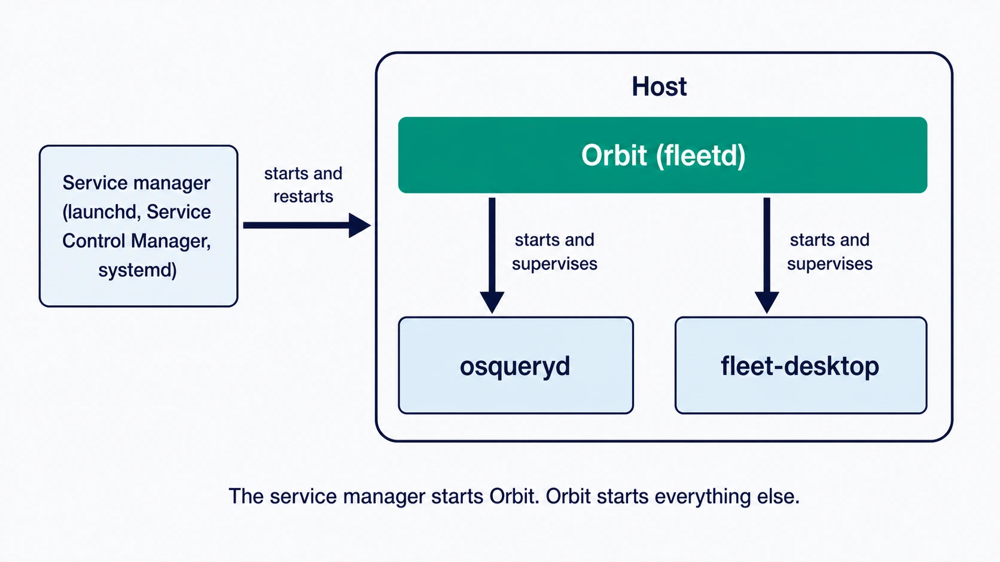
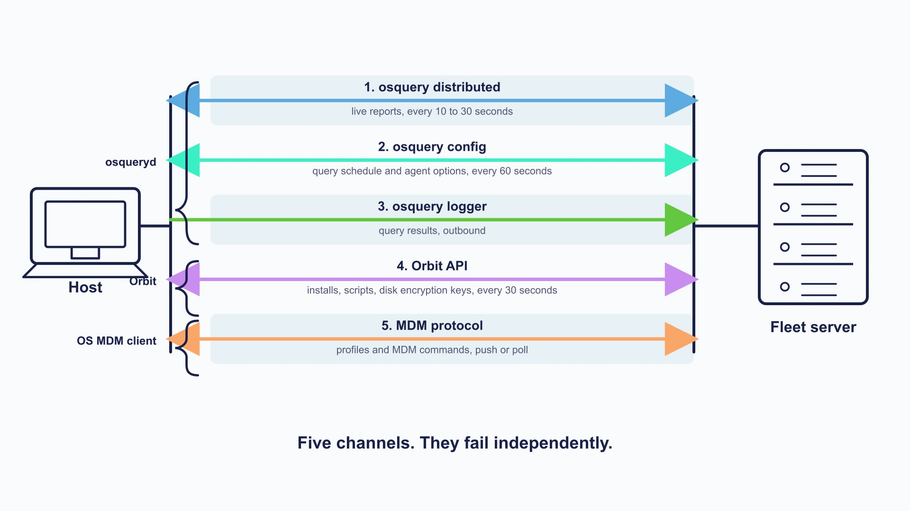

# How Fleet reaches a device

Fleet reaches devices through whatever mechanism each platform makes available. On macOS, Windows and Linux there is an agent path, the **fleetd** bundle. On the platforms that support it, the operating system's own **MDM** client provides a second and separate management path. Some platforms have both, some have one, and which ones have which is the substance of this chapter.

This model is useful because it makes Fleet's behaviour easy to reason about. **On a host running fleetd**, query and inventory work belongs to **osquery**, host-side management work belongs to **Orbit**, and profiles and MDM commands belong to the operating system's **MDM** client.

That qualifier is doing real work, and this chapter comes back to it repeatedly. On ChromeOS a browser extension answers Fleet's ordinary distributed queries with no osqueryd anywhere on the device. On iOS, iPadOS and Android there is no osquery at all, and the host record and its inventory are built from what the management channel reports. The ownership rule is a map of a fleetd host, not of Fleet.

One assumption causes a particular kind of confusion, and Part VIII returns to it repeatedly: that a device is either "connected to Fleet" or not. It is not one connection. On a fully enrolled Mac or Windows computer it is several, running on their own schedules, and a device can be perfectly healthy on some and silent on others at the same moment.

## The host-side bundle

 **fleetd** is the name of Fleet's host-side bundle and installer package. On macOS, Windows, and Linux the bundle contains three coordinated components:

1. **Orbit** is the one that matters most, because it is the one the operating system starts and the one that starts everything else. It handles enrollment, keeps the bundle updated, and carries out host-side work: running scripts, installing software, updating fleetd itself. It runs as `orbit`, or `orbit.exe` on Windows.

2. **osquery** is the reading half. It answers live reports, returns scheduled results, and supplies host vitals and software inventory. It runs as `osqueryd`. Fleet did not write osquery; it is an independent open-source project that Fleet configures and talks to, which is why so much of Fleet's query behaviour follows osquery's rules rather than Fleet's.

3. **Fleet Desktop** is the part an end user usually sees: the menu bar item, the My Device page, and the dialogs that belong to those surfaces. It is not the only thing fleetd can put on screen, as the Linux escrow prompt below shows. It runs as `fleet-desktop`, and only when someone is logged in, since there is nothing for it to do otherwise. **It is the one optional component**, included when the package is built with `--fleet-desktop`, so a host can be running fleetd and not have it at all ([3.7](../03-connect-devices/3.7-manage-fleetd-orbit-and-updates.md)).

The chain of custody runs one way. The operating system's service manager starts Orbit, and Orbit starts the other two. That makes Orbit the first thing to check and the reason it gets its own attention in Part VIII.

**Treat that as the supervision model rather than as an invariant.** Killing Orbit does not reliably take its children with it, most visibly on Windows, where there is no `SIGTERM` and ending the process in Task Manager can leave `osqueryd` orphaned and still holding the lock on its database. Orbit knows this: at startup it kills every pre-existing `osqueryd` process it can find before it tries to read host information, precisely because an orphan would otherwise block it. So "Orbit is not running" does not prove "osquery is not running", and an orphaned `osqueryd` is a real thing to look for when a host will not start cleanly ([8.4](../08-troubleshooting/8.4-host-side-investigation.md)).

<!-- SCREENSHOT: Host details page, the Agent section, where the bundle described above
     becomes something the reader can actually see. Show the Orbit, osquery and Fleet
     Desktop versions for one healthy macOS host. Crop tightly to that panel. Highlight the
     three version fields.
     NOTE 2026-08-27: an earlier version of this brief asked for the update channels in
     this panel. It does not display them; at 4.90.1 the Agent card shows component
     versions only. Do not reinstate that request, and do not let the channel discussion
     later in the chapter imply this panel answers it. -->

There is no process called `fleetd`. The name covers the set of components that ship and update together: `orbit`, `osquery`, `fleet-desktop`.

**ChromeOS is the exception.** There is no bundle to install. Its counterpart is a browser extension called *Fleetd for Chrome*, running as a service worker: no Orbit, no osqueryd, no Fleet Desktop. It does part of fleetd's job rather than all of it, and the matrix below says which part.

<!-- IMAGE-OK: assets/1.2-fleetd-bundle.webp
     NOTE: reviewed 2026-08-24 and kept. Solid green Orbit box anchors the picture, the two
     supervised processes sit beneath it in pale blue, and the chain of custody is obvious at
     a glance. Prompt retained; do not delete.
     PROMPT: One large rounded rectangle labelled "Host". Inside it, a box at the top
     spanning the width labelled "Orbit (fleetd)", and two smaller boxes side by side below
     it labelled "osqueryd" and "fleet-desktop". Two arrows point down from Orbit to those
     two, each labelled "starts and supervises". Outside the Host rectangle on the left, a
     box labelled "Service manager (launchd, Service Control Manager, systemd)" with one
     arrow into Orbit labelled "starts and restarts". The two lower boxes use the #D3E8F3 fill. Give the Orbit box a
     solid #009A7D fill with white text, because it is the one the operating system starts and
     the one everything else hangs off. Do not colour-code the two lower boxes against each
     other; they are peers.
     Caption: "The service manager starts Orbit. Orbit starts everything else."
     PALETTE. Two sets, doing different jobs.
     STRUCTURE, the Fleet Black ramp and neutrals: #192147 for the most important marks,
     #515774 for ordinary labels, #8B8FA2 and #C5C7D1 for secondary structure, #E2E4EA for
     grouping bands, #F9FAFC background, #D3E8F3 and #E8F1F6 for quiet fills. All text stays
     in this set; do not tint type.
     THE FLEET DOTS, the six accent colours taken from Fleet's own logo mark: #5CABDF sky
     blue, #3AEFC4 mint, #63C740 green, #C98DEF lavender, #FAA669 apricot, #D66C7B rose.
     Fleet Green #009A7D sits alongside them. These are soft and pastel, so they work as
     fills with #192147 text on top.
     STRENGTH. Use a dot colour at full strength only for small marks: an arrow, a chip, a
     single filled icon, a rule. Over any large area, use it at roughly a 20 to 25 percent
     tint, so a panel reads as tinted rather than painted. Five large panels at full
     saturation looks like a children's infographic, not a technical manual. And do not
     colour a panel that has no content in it; colour has to carry meaning, and an empty
     coloured box is just noise.
     HOW TO USE THE DOTS. One colour per category, used consistently within the image, to
     fill or stroke the things a reader genuinely has to tell apart. Take only as many as
     there are categories; do not spread all six across four items to look lively. If nothing
     in the picture needs distinguishing, use none of them and let the structure set carry it.
     GIVE IT WEIGHT. At least one element should be a solid filled shape rather than an
     outline, so the composition has an anchor. Vary stroke weight so the primary flow is
     visibly heavier than the scaffolding around it.
     Never invent a colour outside these two sets. Flat vector, generous whitespace, no
     gradients, no drop shadows, no 3D or photorealistic icons, no logo, no watermark.
     Legible at half page width.
     NOTE: "Fleet" here is a software product for managing computers. Never draw vehicles,
     cars, vans, trucks, ships or aircraft. Never use an em-dash in rendered text. -->


## Which component owns which kind of work

 The division of labour is clean enough to memorise, and doing so pays for itself the first time something goes wrong. **It describes a host running fleetd**, which is macOS, Windows and Linux; the platforms without fleetd divide the same work differently, and the applicability matrix later in this chapter says how.

Anything that answers **what is on the host right now** belongs to osquery. Live reports, scheduled results, host vitals, software inventory, file carves. If the question is a question, osquery owns it.

Anything Fleet **does to the host through its own agent** belongs to Orbit. Enrollment, scripts, software installs, fleetd updates, the setup experience, and the supported disk-encryption workflows.

Anything that uses **the platform's native management** belongs to the OS MDM client. Profiles, MDM commands, managed app delivery, and most of lock and wipe. Fleet composes the instruction; the operating system carries it out.

**Lock and wipe are the exception that proves the split is about mechanism rather than capability**, and they do not even split the same way as each other:

| | Lock | Wipe |
|---|---|---|
| macOS | MDM command | MDM command |
| Windows | **A script over the agent**, gated on Windows MDM being configured *and* scripts being enabled on the host | MDM command |
| Linux | A script over the agent | A script over the agent |

So a Windows lock that fails is not an OMA-DM problem to start with: it needs Orbit running and scripts enabled, and Fleet checks both before it will queue one. All of these are Fleet Premium ([3.4](../03-connect-devices/3.4-enroll-linux-devices.md), [3.6](../03-connect-devices/3.6-enroll-android-and-chromeos-devices.md) for the one free case).

Anything that gives the person using the device **a surface of their own** belongs to Fleet Desktop, which Orbit launches: My Device, Self Service, and the dialogs that live in the menu bar item.

Resist widening that into "anything involving a person". Orbit prompts users directly in at least one case, the Linux LUKS passphrase, which it puts on screen through `zenity` or `kdialog` without Fleet Desktop being involved or even installed. The rule is about which component owns the surface, not about whether a human is looking at it.

The practical value of knowing this is that it tells you where to look first. On a fleetd host, a query that returns nothing is an osquery question, a software install that never lands is an Orbit question, and a profile that doesn't get delivered is an MDM question. Three different investigations and three different starting points.

**Off fleetd, the first two of those redirect.** A ChromeOS query that returns nothing is a question about the extension, not about osquery, because the extension answers Fleet's distributed endpoints out of its own virtual tables. An iPhone whose inventory is stale is an MDM question, because MDM is where its inventory comes from. Getting this wrong costs an afternoon looking for a process that was never going to be there.

## The five channels

 **On a fully enrolled Mac or Windows computer**, Fleet's traffic separates into five families, each with its own owner, schedule and failure mode. Read the rest of this section with that scope in mind: five is the count for that host, not a universal property of a managed device. The matrix at the end of the section gives the count for every other platform, and it is never five.

"Independent" here means **separately diagnosable**: each family leaves its own evidence, and one can be broken while the others are healthy. It does not mean separate processes, separate credentials or separate failure domains. Three of the five are endpoints of a single `osqueryd` process authenticating with a single node key, so a dead `osqueryd` takes all three at once.

| Channel             | Carries | Typical cadence |
| ------------------- | ------------------------------------------------------------ | ------------------------------------------------------- |
| osquery distributed | Live reports and host-detail queries | `distributed_interval`, which Fleet's default agent options set to 10 seconds |
| osquery config TLS  | Scheduled query configuration and agent options              | `config_refresh`, which fleetd passes to osquery as 60 seconds |
| osquery logger TLS  | Query results                                                | `logger_tls_period`, defaulting to 10 seconds           |
| Orbit API           | Scripts, software, setup experience, agent configuration, and host-side workflows | 30-second configuration poll plus request/response work |
| MDM protocol        | Profiles, MDM commands, managed apps, and most lock and wipe operations | Platform-specific push or poll               |

Three of them belong to osquery, and they split the work the way osquery always has. One carries questions to the host and answers back. One fetches the host's configuration, meaning its query schedule and agent options. One ships results outward, and only outward. File carving adds a fourth osquery endpoint on the hosts that use it, which is why "three" is a description of the normal case rather than a closed set.

The fourth is Orbit's own API conversation with the Fleet server, which is how installs, scripts, and disk-encryption keys move. Orbit checks in on a thirty-second cycle for configuration, and makes ordinary request-and-response calls as work arrives.

The fifth is the platform's MDM protocol, and it is the one that behaves least like the others: there is no single Fleet-agent cadence behind it. Apple's side is a push, and the device decides when to act on it. Windows is a device-side poll on an interval Fleet does set, and Fleet can additionally ask a capable fleetd host to open an OMA-DM session immediately when work is waiting. So Fleet has some influence on Windows timing and very little on Apple's, and a device that has gone quiet on MDM may still be perfectly responsive on the other four.

Although the three osquery channels share one process, they are separate conversations against separate endpoints, so a proxy or content filter can break one and leave the others working normally. The shared process is also the limit of their independence: they fail separately at the network, together at the process.

**The families are not sealed off from each other, and two dependencies matter enough to name.** A Windows host on a relaxed MDM poll is woken by Orbit, so if Orbit is wedged, queued MDM commands can sit for hours with nothing wrong in the MDM subsystem at all ([8.9](../08-troubleshooting/8.9-windows-mdm-diagnostics.md)). And a synchronous script run is refused for a host Fleet considers offline, which is a judgement made from osquery check-ins, so a broken osquery channel can block Orbit work that osquery has nothing to do with.

### Which families a platform actually has

 This is the table to carry forward, because every later chapter that says "check the channel" means the channels this platform has.

| Platform | osquery distributed | osquery config | osquery logger | Orbit API | MDM | Families |
|---|---|---|---|---|---|---|
| macOS, fully enrolled | yes | yes | yes | yes | Apple MDM | 5 |
| Windows, fully enrolled | yes | yes | yes | yes | OMA-DM | 5 |
| Linux | yes | yes | yes | yes | **none** | 4 |
| macOS or Windows, agent only | yes | yes | yes | yes | not enrolled | 4 |
| macOS or Windows, MDM only | **no** | **no** | **no** | **no** | yes | 1 |
| iOS / iPadOS | **no** | **no** | **no** | **no** | Apple MDM | 1 |
| Android | **no** | **no** | **no** | **no** | AMAPI and Pub/Sub | 1, plus the narrow certificate app |
| ChromeOS | **the extension answers this** | **no** | **no** | **no** | **none** | 1, and narrower than it looks |

ChromeOS is the row worth staring at. The extension is not an osquery agent and there is no `osqueryd` on the device, yet it speaks Fleet's osquery protocol: it enrolls at the ordinary enroll endpoint and polls distributed read, answering from its own virtual tables and posting to distributed write. Those three are the only Fleet endpoints it uses. There is no config fetch and no logger upload, which is the mechanical reason **scheduled queries are not available on ChromeOS** while live reports work perfectly well.

Two lessons come out of that row. A live report returning data is not evidence that osquery exists on the host. And a platform's channel count is not a measure of how much Fleet can do with it, only of how many separate places there are to look when something breaks ([3.6](../03-connect-devices/3.6-enroll-android-and-chromeos-devices.md)).

<!-- IMAGE-REGENERATE: assets/1.2-five-channels.webp
     NOTE 2026-08-27: the rendered image now contradicts the corrected prose and must be
     regenerated before this chapter can be stamped. Two things in the picture are wrong:
     the caption "Five channels. They fail independently", which the chapter no longer
     claims, and the cadence "every 10 to 30 seconds" under arrow 1, which was a claim
     about deployments rather than about Fleet. The prompt below has been corrected for
     both; the reviewer that originally said to leave this asset alone retracted that
     recommendation once the prose changed. Until it is regenerated, the paragraph under
     the image scopes it in words.
     Earlier note, reviewed 2026-08-24 and kept. Rebuilt from the earlier composition as asked:
     the host and server read as devices again, the arrows reach both ends, and one brace now
     spans arrows 1 to 3 for osqueryd rather than three separate ones. One blemish accepted
     rather than chased: the word "Orbit" sits against the laptop's lower edge. It is legible,
     and five rounds of regeneration have shown that re-rendering to fix a small thing tends
     to break a larger one. Prompt retained for regeneration; do not delete.
     PROMPT: A laptop on the left labelled "Host", a server on the right labelled "Fleet
     server", both drawn as simple flat outlines with no shading or perspective. Five
     horizontal arrows connect them, stacked vertically, all in #192147 and distinguished by
     line weight and dash pattern rather than by colour. Above each arrow, top to bottom:
     "1. osquery distributed", "2. osquery config", "3. osquery logger", "4. Orbit API",
     "5. MDM protocol". Below each, smaller #515774 text: "live reports, every 10 seconds
     by default", "query schedule and agent options, every 60 seconds", "query results,
     outbound", "installs, scripts, disk encryption keys, every 30 seconds", "profiles and
     MDM commands, push or poll". On the far left, three braces group them: arrows 1 to 3
     "osqueryd", arrow 4 "Orbit", arrow 5 "OS MDM client". Arrow 3 has one arrowhead
     pointing right; the rest are double-headed. This is the clearest case in the manual for the Fleet dots: the
     whole point is that these are five separate things that fail separately, so give each
     arrow its own dot colour, in order, #5CABDF, #3AEFC4, #63C740, #C98DEF, #FAA669. Draw
     each arrow thick enough that its colour actually reads. Keep every label in #192147 and
     #515774; do not tint the text. Arrow 3 keeps its single arrowhead, since it is the only
     one that goes one way. Band the five rows with alternating #F9FAFC and #E8F1F6 so they
     read as a stack.
     Label the whole picture, above the laptop and server, "A fully enrolled Mac or Windows
     computer", in #515774, because this configuration is the only one with all five.
     Caption: "Five traffic families on a fully enrolled Mac or Windows computer. They are
     diagnosed separately."
     PALETTE. Two sets, doing different jobs.
     STRUCTURE, the Fleet Black ramp and neutrals: #192147 for the most important marks,
     #515774 for ordinary labels, #8B8FA2 and #C5C7D1 for secondary structure, #E2E4EA for
     grouping bands, #F9FAFC background, #D3E8F3 and #E8F1F6 for quiet fills. All text stays
     in this set; do not tint type.
     THE FLEET DOTS, the six accent colours taken from Fleet's own logo mark: #5CABDF sky
     blue, #3AEFC4 mint, #63C740 green, #C98DEF lavender, #FAA669 apricot, #D66C7B rose.
     Fleet Green #009A7D sits alongside them. These are soft and pastel, so they work as
     fills with #192147 text on top.
     STRENGTH. Use a dot colour at full strength only for small marks: an arrow, a chip, a
     single filled icon, a rule. Over any large area, use it at roughly a 20 to 25 percent
     tint, so a panel reads as tinted rather than painted. Five large panels at full
     saturation looks like a children's infographic, not a technical manual. And do not
     colour a panel that has no content in it; colour has to carry meaning, and an empty
     coloured box is just noise.
     HOW TO USE THE DOTS. One colour per category, used consistently within the image, to
     fill or stroke the things a reader genuinely has to tell apart. Take only as many as
     there are categories; do not spread all six across four items to look lively. If nothing
     in the picture needs distinguishing, use none of them and let the structure set carry it.
     GIVE IT WEIGHT. At least one element should be a solid filled shape rather than an
     outline, so the composition has an anchor. Vary stroke weight so the primary flow is
     visibly heavier than the scaffolding around it.
     Never invent a colour outside these two sets. Flat vector, generous whitespace, no
     gradients, no drop shadows, no 3D or photorealistic icons, no logo, no watermark.
     Legible at half page width.
     NOTE: "Fleet" here is a software product for managing computers. Never draw vehicles,
     cars, vans, trucks, ships or aircraft. Never use an em-dash in rendered text. -->


The picture is of a fully enrolled Mac or Windows computer, which is the only configuration that has all five. Read it alongside the matrix above rather than as a picture of every managed device.

## What “online” tells you

 Fleet marks a host online when its last-seen time falls within its normal check-in window, plus a 60-second grace period. Last-seen is normally an osquery check-in, with one exception worth knowing: a host that has never recorded one falls back to when the record was created, so **a newly created host reads as online for the grace period without having said anything**. The window is the shorter of two intervals the host itself reports: its `distributed_interval`, and its config refresh interval.

Fleet reads that second interval from the host's `config_tls_refresh` flag, and falls back to `config_refresh` only when the host does not report the first. The two are the same setting under two names, split by an osquery rename years ago, and Fleet still checks both because old agents answer to the older one. fleetd sets `config_refresh` to 60 seconds when it starts osquery and leaves `config_tls_refresh` alone.

Which of the two a given host ends up reporting, and therefore whether its window is the 60-second grace period alone or 60 seconds plus a check-in interval, depends on how the host's osquery reports flags it was never given. That is agent behaviour rather than Fleet behaviour, and it is not documented at this release; unverified. What is fixed is the shape: **online is a statement about the osquery channels and nothing else**, it is generous by at least a minute, and a host that has just gone quiet keeps showing online for that window.

<!-- SCREENSHOT: The online indicator together with the last-seen timestamp, since this
     section is entirely about the relationship between those two values. Capture two hosts
     side by side in the Hosts list: one online, one offline with a last-seen a few days
     old. Crop to those two rows. Highlight both the status dot and the last-seen column so
     the pairing is unmissable. -->

Both are osquery options, and they live under `config`, not directly under `agent_options`. Hosts pick up a change at their next configuration refresh, without an osquery restart:

```yaml
agent_options:
  config:
    options:
      config_refresh: 60
      distributed_interval: 30
```

**That nesting is not uniform, and it catches people.** The split is not "osquery settings here, Fleet settings there", because osquery's own settings appear at both levels:

| Under `agent_options.config` | Directly under `agent_options` |
|---|---|
| osquery's **runtime** configuration, passed through to osquery more or less as written: `options`, `decorators`, schedules | osquery's **startup** flags, as `command_line_flags`, plus settings Fleet itself acts on such as `update_channels`, `extensions` and `script_execution_timeout` |

So `distributed_interval` is nested and `command_line_flags` is not, and both are osquery. When a value appears to be ignored, the level it was written at is worth checking before anything else.

Lower intervals give a fresher online signal and faster live report pickup. Higher intervals reduce check-in traffic and extend the time Fleet treats the last successful check-in as current. Choose values that match the responsiveness and network profile of the fleet.

**What online does not tell you is whether queries will work.** It is easy to read the dot as "osquery is answering", and it is weaker than that. Fleet stamps the host's last-seen time on *any* authenticated osquery request, and the config, distributed and logger endpoints all qualify. A host whose distributed channel is broken but which is still fetching its configuration every sixty seconds, or still shipping buffered results, keeps its last-seen time fresh and keeps showing online while every live report against it fails ([8.1](../08-troubleshooting/8.1-diagnostic-method.md)).

So online is a statement about **the osquery family as a whole**, not about any one endpoint in it, and not about Orbit or MDM at all. The MDM and Orbit paths are visible only through the status of the work they perform. A host can answer a live report while an MDM command waits for the platform's next check-in; an MDM-enrolled device reports MDM status before fleetd exists on it. The diagnostic method is therefore to identify the family associated with the requested action, then inspect that family's own evidence rather than the status dot.

## Where there is no agent at all

 Several platforms run no fleetd, and a surprising amount of downstream behaviour follows from that one fact.

| Platform | Orbit | osquery | Fleet Desktop | MDM | Management path |
|---|---|---|---|---|---|
| macOS | yes | yes | yes | Apple MDM | Full bundle plus MDM |
| Windows | yes | yes | yes | OMA-DM | Full bundle plus MDM |
| Linux | yes | yes | yes | **none** | Orbit and osquery only |
| iOS / iPadOS | **no** | **no** | **no** | Apple MDM | MDM protocol only |
| Android | **no** | **no** | **no** | AMAPI | AMAPI, plus an optional narrow-scope Fleet app |
| ChromeOS | **no** | **no** | **no** | none | Chrome extension |

**iOS and iPadOS do not run Orbit**, so there is no polling loop and no step-by-step setup display. No scripts, no software installs beyond App Store and in-house delivery, no osquery vitals, no Fleet Desktop. Everything Fleet **does** to an iPhone is an MDM command.

What Fleet **knows** about one has a wider provenance than that, and reading a host page is easier when you know it: an Apple Business sync can create a `Pending` host before the device exists as far as Fleet is concerned, and an enrollment link's exchange creates the host from its serial, product and UDID before MDM enrollment begins ([3.5](../03-connect-devices/3.5-enroll-ios-and-ipados-devices.md)).

**Linux has no MDM.** Everything Fleet does on a Linux host arrives over the osquery channels or the Orbit API. That is why disk encryption on Linux is escrow-only: Fleet cannot switch LUKS on, so it escrows a key for hosts that report themselves encrypted. **Eligibility is the host's current reported state rather than its history**, so a host encrypted after enrollment becomes eligible on its own once it reports so; Fleet does not look at how the machine was installed ([3.4](../03-connect-devices/3.4-enroll-linux-devices.md)).

**Android has neither fleetd nor osquery.** Management is Google's Android Management API: Fleet pushes policies and managed apps to it, and device events return over a Google Cloud subscription.

One consequence is worth settling before the first device enrolls, because it is awkward to reverse. When Android is turned on, Fleet builds the subscription's push endpoint out of the server URL as it stands at that moment, and Google delivers events to that endpoint from then on. Google therefore has to be able to reach it, which is why Fleet refuses to enable Android against `localhost` or a loopback address at all.

**Treat the URL as operationally fixed from that point, not as something Fleet will protect for you.** Fleet will accept a changed `server_url` afterwards, because the setting is validated only for being present and well-formed, and this release's change handling resynchronizes Apple's enrollment profiles rather than Google's push endpoint. The result of changing it is not a rejection but a quiet outage: Fleet moves and Google keeps pushing to where Fleet used to be. If the URL has to change, plan on rebuilding the Android connection rather than on editing one field ([2.8](../02-administer-and-deploy-fleet/2.8-windows-and-android-management-configuration.md)).

There is a Fleet Android app, and it is not fleetd. It is a narrow-scope application whose job is to enroll and then deliver certificates into the device keystore. It gives you certificates on Android, and only on Fleet Premium, since creating the certificate template it delivers is refused without a licence. It gives you no inventory, no reports, and no scripts.

**ChromeOS runs the extension and nothing else**, configured with a Fleet URL and an enroll secret, and the Fleet URL must present a valid TLS certificate.

## How the agent updates itself

 Orbit updates the whole bundle, including itself, from its configured update repository. **This path does not go through the Fleet server**, which is worth knowing because it means agent updates continue working when the Fleet server is unreachable, and it means blocking that repository silently freezes agent versions.

Each of the three components tracks its own **channel**, and a channel is just a pointer. `stable` and `edge` exist, and **a literal version string is also a valid channel**, which is what makes pinning possible.

Channels are set when a package is built, and can be changed centrally afterwards through agent options, which is a Fleet Premium capability:

```yaml
agent_options:
  update_channels:
    orbit: stable
    osqueryd: '5.10.2'
    desktop: edge
```

That combination is what turns agent versions into something you manage rather than something that happens to you:

| You want | Set the channel to |
|---|---|
| Track the current agent | `stable`, which is also what an omitted component means |
| Validate the next agent before it reaches stable | `edge`, on a small fleet |
| Hold a known-good version while investigating a regression | the literal version, for example `'5.10.2'` |
| Roll back a bad agent across the estate | the literal previous version |
| Upgrade osquery without touching Orbit | **not** the `osqueryd` key alone: an omitted component is normalised to `stable`, so a block naming only `osqueryd` silently moves Orbit and Desktop to `stable` too. Name every component you want to keep where it is |

Three properties make this practical. **Central configuration beats whatever was compiled into the package, including when that means a downgrade**, so a rollback needs no new installer. Hosts pick the change up on their next configuration poll and restart themselves, which is thirty seconds when the server is healthy and can be up to five minutes after sustained failures ([3.7](../03-connect-devices/3.7-manage-fleetd-orbit-and-updates.md)). And because these are fleet-level agent options, a canary group is a fleet, which is the same scoping tool covered in [1.3](1.3-hosts-fleets-labels.md).

Two things to know before relying on it. **Removing the `update_channels` key does not revert anything**, so when a pin is finished, write `stable` explicitly rather than deleting the key. And **a channel that does not exist fails on the host**: the lookup error is raised and logged there, and Fleet's own console shows only the downstream symptom, a version that stops moving. Look on the host before concluding a fleet has stopped updating.

By convention `edge` carries the agent being validated before it is promoted, and `stable` carries the current one. That is a property of what Fleet publishes into the update repository rather than something this release's source can be read to guarantee; the channel names are pointers, and their contents are repository state. Point a small fleet you own at `edge` when you want the next agent early, and expect `stable` to be the one you run everywhere else.

## Rolling out the agent and MDM separately

 They run on different channels, they can be done in either order, and each is useful without the other.

| What the host has | You get | You do not get |
|---|---|---|
| fleetd, no MDM | Live and scheduled reports, vitals, software inventory, scripts, Orbit-driven software installs, LUKS escrow on Linux (Premium), and **lock and wipe on Linux** (Premium), which Fleet runs as scripts rather than as MDM commands | Profiles, MDM commands, App Store apps. Wipe on macOS and Windows, and lock on macOS, which do require MDM |
| MDM, no fleetd | Profiles, MDM commands, App Store apps, lock and wipe (Premium, with one free exception), and inventory on the platforms where MDM supplies it | Reports, scripts, Orbit installs, and inventory on platforms that depend on the agent for it |
| Both | The union of what that platform, enrollment type, configuration and edition allow, which is what the rest of this manual spends its time delimiting | |

This is why an agent rollout does not have to wait for an MDM migration, and why you can install fleetd through your existing MDM provider, or any package tool you already run, while MDM enrollment proceeds on its own schedule.

It is also why a rollout plan should verify **both** channels per host rather than one.

**Three licence gates cut across that table and are easy to plan straight past.** Every lock operation Fleet offers is Premium. Every wipe is Premium too, with a single exception: wiping an eligible company-owned Android device is available on Free, and Free's wipe implementation rejects every other platform ([3.6](../03-connect-devices/3.6-enroll-android-and-chromeos-devices.md)). And disk encryption, including the LUKS escrow in the first row, is Premium: Free refuses to turn `enable_disk_encryption` on at all.

What an MDM-enrolled host without an agent can still tell you depends entirely on the platform. On iOS, iPadOS and Android there is no agent to install, and Fleet builds the host record from what the management channel reports, so those hosts are visible and inventoried. On macOS and Windows, where fleetd is the normal source of inventory, an MDM-only host appears in Fleet and stays thin: enrolled, reachable by command, and largely silent about what is on it.

## What only Fleet Desktop can do

 Fleet Desktop is fleetd's main end-user-facing surface, and the only one with a persistent presence. It carries the My Device link, Self Service, and the dialogs that need a human answer, including the macOS MDM migration prompt.

**It is not, however, the only thing fleetd puts on screen.** Linux disk-encryption escrow can prompt for the user's LUKS passphrase, and that prompt is Orbit's: it goes through `zenity` or `kdialog` and does not involve Fleet Desktop at all. So a Linux host without Fleet Desktop can still escrow.

**Whether a dialog tool is required depends on which escrow path the host takes**, and there are two:

| Host | Path | Needs `zenity` or `kdialog` |
|---|---|---|
| snapd-managed TPM-backed full-disk encryption, as on recent Ubuntu | Orbit escrows the recovery key through the snapd socket, silently | **No.** The dialog is best-effort, used only to warn on failure |
| Everything else with LUKS | Orbit prompts for the passphrase and adds a key slot | **Yes**, and its absence is fatal to escrow |

Both paths need `cryptsetup`, which Orbit checks first. So "no dialog tool means no escrow" is true only of the passphrase path, and diagnosing a Linux host that will not escrow starts with establishing which path it is on ([3.4](../03-connect-devices/3.4-enroll-linux-devices.md)).

It also has a requirement the rest of the bundle does not: **a logged-in desktop session**. On servers, kiosks, and any host sitting at the login window, Fleet Desktop doesn't run.

That makes it a per-fleet decision rather than a global one. A laptop fleet wants Desktop. A server fleet has no user to show it to and no reason to run a third process.

## Edge cases and precedence

 **Orbit cannot reach Fleet.** The configuration poll backs off gradually from thirty seconds to a ceiling of five minutes, and one success resets it. Queued scripts and installs are held and picked up on the first successful poll. osquery is unaffected and keeps its own buffers, so the host can still answer live reports and will replay buffered results with their original timestamps once the logger channel recovers. Network errors are logged sparingly, so log volume is not a measure of severity.

Do not extend "held" into "nothing at all is ever lost". Individual features apply their own expiry and cancellation rules to work that has been waiting, and this chapter does not establish a single retention guarantee across every script, install, queued command and result class; unverified. The dependable part is the shape: an unreachable server is a pause in the agent's work rather than a silent discard of it.

**Enrollment fails.** Orbit retries six times with a growing delay, roughly 10, 20, 40, 80 and 160 seconds, then gives up until the next attempt. `FLEETD_SILENCE_ENROLL_ERROR` is worth knowing about, but it is narrower than its name suggests: it suppresses one error-level line, and every failed attempt is still logged at info level regardless. So a quiet host is quiet at error level only, and raising log verbosity is the way to see what it is actually doing ([8.2](../08-troubleshooting/8.2-log-surfaces.md)).

**An update fails.** Repeated failures buy a **24 hour pause**, keyed to the specific artifact being fetched rather than to the component or the host. Two things clear it: publishing a new version, which is a different artifact, and restarting the agent, since the retry state is held in memory and does not survive the process.

**That per-artifact cooldown does not mean the other components carry on.** Orbit walks its targets in order, Orbit itself, then osquery, then Desktop if it is installed, and it abandons the whole pass the moment a lookup or an update for one of them returns an error. So a stuck Orbit target does not just stall Orbit; it stops osquery and Desktop from even being checked on that pass, for as long as it keeps failing. Correlated stale versions across the bundle are a symptom of one blocked target, not three separate problems ([3.7](../03-connect-devices/3.7-manage-fleetd-orbit-and-updates.md)).

**Updates partially succeed.** A host can run a new Orbit against an older osquery for a while, which is normal rather than a broken state.

**A configured channel does not exist.** The lookup fails on the host and is logged there, and by the rule above it takes the rest of that update pass with it. What Fleet's console shows is only the consequence, versions that stop moving, which is why a typo in a version string is diagnosed on the host rather than in the UI.

**Empty is not the same as absent, for osquery flags.** Absent from agent options means Orbit leaves the host's flag file alone. Explicitly set to empty means Orbit clears it and restarts osquery without those flags. Orbit only writes when the result would actually differ, so re-applying unchanged configuration does not cause a restart.

**Building a package without supplying a flag file blanks an existing one.** This is the opposite of the agent-options behaviour above, and it catches people who maintain osquery flags locally. If you do, always pass the flag file when packaging.

**Restoring an agent directory onto different hardware, on macOS.** Orbit reads the live hardware UUID through a throwaway osquery database, so it gets the true value rather than a cached one, and compares it against the UUID it stored on disk. On a mismatch it clears its enrollment state and exits, so the host enrolls again cleanly rather than fighting the original over one host record.

**This recovery is macOS-only in 4.90.1.** The whole comparison sits behind a `darwin` check, so **Fleet implements no equivalent automatic recovery on Windows or Linux**, and a Windows or Linux image built from a machine that had already enrolled carries the previous host's enrollment with it. Imaging procedures for those platforms have to remove the agent state themselves ([3.3](../03-connect-devices/3.3-enroll-windows-devices.md), [3.4](../03-connect-devices/3.4-enroll-linux-devices.md)).

**The half-enrolled state: MDM enrolled, no agent.** This is structural rather than a bug in any component. Enrollment and agent installation are separate steps on separate channels, so the install can fail while the enrollment succeeds. The result reports MDM status as on and never checks in on the other channels, so everything that depends on the agent silently stops: no vitals, no scripts, no agent-delivered software. The MDM channel itself keeps working and keeps acknowledging commands, which is exactly what makes the host look healthy. It exists because of the separation this chapter describes, and [8.4](../08-troubleshooting/8.4-host-side-investigation.md) covers detecting and recovering from it.

**Fleet Desktop with no desktop session.** Orbit retries and logs that it is skipping the start. Nothing else is affected: Orbit and osquery are fully functional at the login window, while Self Service and My Device are not.

## Where to troubleshoot this

 The narrowing question for anything agent-shaped is **which channel**.

| Question | Go to |
|---|---|
| Which channel is failing, and is this host talking at all | [8.1](../08-troubleshooting/8.1-diagnostic-method.md) |
| Is the agent running and enrolled, and what does its state say | [8.4](../08-troubleshooting/8.4-host-side-investigation.md) |
| The agent keeps restarting, and I want to know whether that is expected | [8.4.2](../08-troubleshooting/8.4-host-side-investigation.md#three-restarts-that-are-normal) |
| Which log holds this, and how do I raise verbosity | [8.2](../08-troubleshooting/8.2-log-surfaces.md) |
| MDM says enrolled and nothing checks in | [8.4](../08-troubleshooting/8.4-host-side-investigation.md) |
| Reachability and the certificate chain | [8.5](../08-troubleshooting/8.5-fleetctl-debug.md) |
| Agent state from a host you cannot reach directly | [8.7](../08-troubleshooting/8.7-live-query-introspection.md) |
| The MDM channel, independent of the agent | [8.8](../08-troubleshooting/8.8-apple-mdm-diagnostics.md), [8.9](../08-troubleshooting/8.9-windows-mdm-diagnostics.md), [8.10](../08-troubleshooting/8.10-android-diagnostics.md) |

