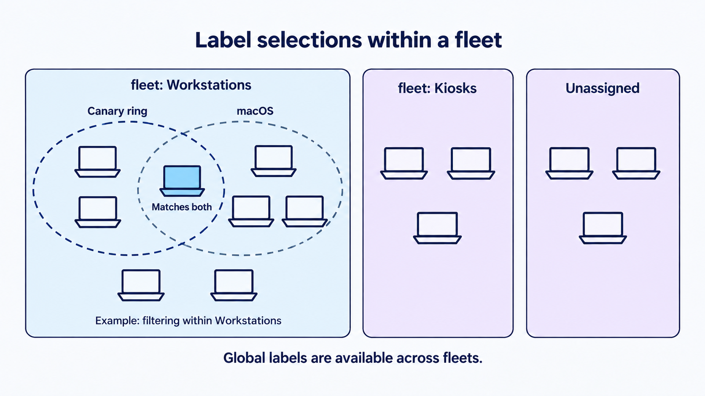

# Hosts, fleets, labels, and targeting

Fleet gives administrators two complementary ways to organize a device estate:

- **fleets** define the configuration and administrative scope a host belongs to.
- **Labels** select hosts globally or within a fleet for a particular action.

Together, they allow administrators to give a group of devices a *shared operating model* without giving up precise targeting.

The distinction is important and powerful. A fleet is closer to an address: a device has exactly one, changing it is a deliberate act, and it determines who is responsible for the device and what configuration it lives under. A label is closer to a mailing list: a device can be on any number of them, membership often changes on its own, and being on one carries no implication about ownership.

**Named fleets are a Fleet Premium capability.** On Free there is one scope for every host, and the whole of this chapter's fleet material describes something you cannot create. Labels are the targeting tool that exists on both editions, though several ways of *using* a label are gated too, and the table later in this chapter says which.

The characteristic design mistake is a fleet doing a label's job, and it starts reasonably. Marketing needs one extra application. Engineering needs a slightly looser setting. Each gets its own fleet, because that is the obvious way to give a group something different.

The cost arrives later, and it is worth being precise about where. **Profiles and software are exact-scope**: a profile assigned to one fleet reaches that fleet and nowhere else, so two fleets that differ by a single application are two sets of profile and software assignments to keep in step forever. **Policies, scheduled reports and labels are not**: a global one applies to hosts in every fleet as well as to unassigned hosts, because the selection accepts a null scope alongside the host's own.

That asymmetry is the thing to hold on to, because getting it backwards is expensive in both directions. Copying global policies into each new fleet gives every host the same check twice. Assuming a profile will be inherited from global gives it only to the unassigned hosts, since a globally scoped profile matches the unassigned scope exactly and reaches nobody in a named fleet.

A label expresses a small difference at the cost of one line on the item itself. Reach for a fleet when the group genuinely needs its own operating model and its own administrators, not when it needs one extra thing.

## What a host record holds

 A host record is Fleet’s durable view of a device. It collects identity, inventory, report results, policy status, software activity, and management history as the device interacts with Fleet.

<!-- SCREENSHOT: Host details in the Fleet web interface, showing what a host record
     actually contains: identity, the fleet it belongs to, its labels, and the tabs for
     software, policies and activity. Crop to the header block plus the tab row rather than
     the whole page. Highlight the fleet field and the label chips, since those two are what
     the rest of this chapter is about. No real serials or UUIDs. -->

<!-- SCREENSHOT: The same host read from the command line, as a terminal capture, showing
     that the record is one thing with several surfaces rather than a web page. Show the
     command and enough of its output to recognise the same host as the image above,
     including its fleet. Trim the output rather than showing hundreds of lines, and redact
     any serial or UUID. -->

Fleet uses device identity information during enrollment to recognize returning devices and maintain a continuous host record where possible. A re-enrollment refreshes the host’s trust chain while preserving its assigned fleet.

Moving an existing device to another fleet is an explicit administrative action, so administrators can see and control changes in scope.

The detailed identity rules, node-key lifecycle, and re-enrollment behaviour belong in the host identity reference and troubleshooting material.

Re-enrollment has two surprises: it preserves the host's current fleet, but duplicate device identifiers can merge host records. Keep both exceptions in mind before treating the enroll secret as a move instruction.

**Re-enrolling a host does not move it between fleets.** An enroll secret belongs to a fleet, and that assignment applies when the host is genuinely new. Re-enrolling an existing host with a different fleet's secret leaves it exactly where it is. Moving it is a deliberate transfer, which is the behaviour you want, and not the behaviour the installer suggests.

**Two devices sharing a hardware identifier can merge rather than fail, on some enrollment paths.** Whether they do depends on the path: matching by serial is limited to Apple MDM enrollment on supported Apple platforms and deliberately skipped elsewhere, and matching by UUID depends on which identifier that path uses. Where matching does occur, both machines resolve to the same host record and take turns claiming it. Fleet logs a warning and lets the newer enrollment overwrite the existing data, so the symptom is one host record whose details keep changing rather than an error anyone notices.

**With TPM-backed host identity certificates the behaviour inverts.** Fleet does not support duplicate identifiers on that path and rejects the enrollment outright, saying that the certificate's host does not match the enrolled host. So the same underlying problem presents as a silent merge in one deployment and a loud enrollment failure in another, and which one you get depends on a setting made elsewhere. Knowing which path a host is on tells you which symptom to look for.

## fleets in Fleet

### fleets define configuration scope

 A host belongs to one named fleet or to the **Unassigned** scope, and what it receives depends on the item, not on one rule:

| Item | Scoped to the fleet only | Also inherited from global |
|---|---|---|
| Configuration profiles | yes | no |
| Software | yes | no |
| Enrollment secrets | yes | no |
| Agent options, the **osquery** part | the fleet's document is used whole, or the global one is. **Never a mix** | **only when the fleet has no agent options at all.** A fleet document that omits an osquery setting does not inherit that setting, it simply goes without it |
| Agent options, the **Orbit** part: `update_channels`, `command_line_flags`, extensions | read from the fleet's own document | **no**, apart from the script execution timeout, and not even when the fleet has no document at all. A fleet that does not name a channel does not inherit the global one ([3.8](../03-connect-devices/3.8-manage-fleetd-orbit-and-updates.md)) |
| Roles | a fleet role reaches that fleet | **yes**, a global role authorizes work on every fleet's resources |
| Policies | fleet policies apply to the fleet | **yes**, global policies apply as well |
| Scheduled reports | fleet reports apply to the fleet | **yes**, global reports apply as well |
| Labels | fleet-scoped labels are available in the fleet | **yes**, global labels are available everywhere |

**"Has no options of its own" means the whole document, not the setting.** Agent options are the row most often read wrong, because two different things sound the same: a fleet with no agent options at all falls back to the global document entire, while a fleet that *has* a document and leaves a setting out of it does not inherit that setting from anywhere. The two cases are one line apart in Fleet and produce opposite results.

**fleets** are for devices that share an owner, an operating model, or a lifecycle. A fleet carries its own policies, software, profiles, reports, agent options, enrollment secrets and roles; what it does not do is shield its hosts from globally scoped policies, reports and labels.

**Unassigned** is a scope in its own right, with its own policies, software, profiles and controls. It is not, however, a staging area every device passes through. **Placement happens at enrollment, and where a host lands depends on the path it took**: an enroll secret carries a fleet association, an Apple Business token has per-platform defaults, and Android and ChromeOS have their own mechanisms again ([3.1](../03-connect-devices/3.1-enrollment-design-and-host-lifecycle.md)). A device only arrives in Unassigned when nothing on its path said otherwise, so treating Unassigned as a guaranteed first stop will miss hosts that went straight to a fleet.

Choose fleets for a hard administrative boundary. Device purpose, ownership, management posture, or a distinct service level are all good reasons. A technical attribute a host happens to have is not; that is what labels are for.

### How global and fleet scopes interact

 Fleet has an organization-wide scope for work that should be shared across the estate and a fleet scope for work that belongs to one operating environment. Use global policies, labels, and reports for requirements, selections, and observations that genuinely apply across the organization. Use fleet-scoped policies, labels, scripts, software, profiles, and settings when a device group needs its own operating model.

A global label is available across fleets; a fleet label is available only in its fleet. In either case, label targeting narrows the recipients of the item you are configuring. This is why a durable difference in configuration or ownership is a reason for a new fleet, while a temporary rollout ring or shared device characteristic is usually a label.

#### What "global" does and does not mean

**"Global" does not mean the same thing for every kind of item**, and this is the single most useful precedence fact in the chapter. Some item types merge the global set with the fleet's set. Others match one scope exactly and ignore everything else.

| Item type | A host in a fleet also gets the global ones? |
|---|---|
| Policies | **Yes.** The fleet's policies and the global policies both apply |
| Reports | **Yes.** Same merge, which is why the interface shows inherited results |
| Labels | **Yes.** A global label is evaluated on every host; a fleet label only inside its fleet |
| Configuration profiles | **No.** The host receives its fleet's profiles and no others |
| Software | **No.** Same exact-scope match |

For profiles and software there is no fallback and no inheritance. **Unassigned is a peer scope, not a parent**, so a host in a fleet does not pick up anything sitting in Unassigned, and a profile placed in Unassigned reaches only the hosts that are actually unassigned.

That asymmetry catches people who learn one half and generalise. Someone who has only worked with policies expects a global profile to reach everything, and it does not. Someone who has only worked with profiles expects a global policy not to apply inside a fleet, and it does.

When something did not arrive, check the item's scope before you check anything on the host. A fleet mismatch is the first thing to rule out when a profile did not deploy, because it makes every label question irrelevant.

#### Deleting a fleet does not delete its hosts

The hosts move to Unassigned, carrying their history with them. That is the forgiving behaviour, but it means a deleted fleet silently withdraws every profile, policy and software title that was scoped to it, and those hosts now sit in whatever baseline Unassigned carries.

**Withdrawn is not the same as removed, and the two behave differently.** Profiles are reconciled, so a profile the host no longer qualifies for is queued for removal from the device. Software is not: deleting the fleet removes the *availability* of its packages, and anything already installed stays installed on every host. Deleting a fleet is therefore not a way to claw software back.

<!-- IMAGE-OK: 1.3-fleet-scope-delegation.webp
     NOTE: reviewed 2026-08-24 and kept. All three faults are fixed: connectors land on the
     fleet panels, "Profiles and software do not inherit" is its own callout rather than an
     annotation on the label arrows, and "No access" reads as a statement about people.
     Prompt retained; do not delete.
     PROMPT: Global scope, fleet scope, and delegated administration
Create a polished landscape 16:9 flat-vector diagram on an off-white (#F9FAFC) background. A wide top
panel labelled "Global scope" contains "Global policies", "Global labels", and "Global
reports" and connects to two distinct lower panels: "Fleet: Computer lab" and "Fleet:
Corporate workstations". Each fleet panel contains "Fleet policies", "Fleet labels",
"Scripts & software", and "Profiles & settings". A people card labelled "Lab employees" and
"Fleet role: Maintainer" connects only to Computer lab with the label "Manage this fleet";
Corporate workstations shows "No access" for that group. Caption: "A fleet defines both device
scope and the people empowered to manage it." Use #192147 text, pale blue fills (#E8F1F6 or #D3E8F3) and a single Fleet Green (#009A7D) accent used sparingly, thin connector lines, generous whitespace, and large crisp text. No logo,
watermark, drop shadows, or extra text.
     PALETTE. Two sets, doing different jobs.
     STRUCTURE, the Fleet Black ramp and neutrals: #192147 for the most important marks,
     #515774 for ordinary labels, #8B8FA2 and #C5C7D1 for secondary structure, #E2E4EA for
     grouping bands, #F9FAFC background, #D3E8F3 and #E8F1F6 for quiet fills. All text stays
     in this set; do not tint type.
     THE FLEET DOTS, the six accent colours taken from Fleet's own logo mark: #5CABDF sky
     blue, #3AEFC4 mint, #63C740 green, #C98DEF lavender, #FAA669 apricot, #D66C7B rose.
     Fleet Green #009A7D sits alongside them. These are soft and pastel, so they work as
     fills with #192147 text on top.
     STRENGTH. Use a dot colour at full strength only for small marks: an arrow, a chip, a
     single filled icon, a rule. Over any large area, use it at roughly a 20 to 25 percent
     tint, so a panel reads as tinted rather than painted. Five large panels at full
     saturation looks like a children's infographic, not a technical manual. And do not
     colour a panel that has no content in it; colour has to carry meaning, and an empty
     coloured box is just noise.
     HOW TO USE THE DOTS. One colour per category, used consistently within the image, to
     fill or stroke the things a reader genuinely has to tell apart. Take only as many as
     there are categories; do not spread all six across four items to look lively. If nothing
     in the picture needs distinguishing, use none of them and let the structure set carry it.
     GIVE IT WEIGHT. At least one element should be a solid filled shape rather than an
     outline, so the composition has an anchor. Vary stroke weight so the primary flow is
     visibly heavier than the scaffolding around it.
     Never invent a colour outside these two sets. Flat vector, generous whitespace, no
     gradients, no drop shadows, no 3D or photorealistic icons, no logo, no watermark.
     Legible at half page width.
     NOTE: "Fleet" here is a software product for managing computers. Never draw vehicles,
     cars, vans, trucks, ships or aircraft. Never use an em-dash in rendered text. -->

### fleets are also delegation boundaries

 Fleet lets an administrator assign a user a role on one or more specific fleets. That user can work with the hosts and fleet-scoped resources their role permits, without being given access to the other fleets merely because they administer one of them.

For example, a computer-lab fleet can have its own policies, software, and settings, while lab employees receive an appropriate role for that fleet. The central endpoint team retains global access and can manage organization-wide configuration; the lab team can manage the lab within the responsibilities assigned to its fleet role.

**Rule of thumb:** Use a separate fleet when host administration changes configuration ownership, access delegation, software catalog, enrollment path, or lifecycle.

### What a transfer costs

 Knowing what survives when a host is moved between fleets makes the difference between a routine move and a surprise.

**Kept:** the host record and its ID, hardware identity, software inventory, host vitals, activity history, global policy results, global report results, and memberships in global labels, including all the built-ins.

**Lost, and deleted rather than merely stale:** results and memberships that belonged to the old fleet specifically, meaning fleet-scoped policy results, fleet-scoped report results, and memberships in labels that were themselves scoped to that fleet. None of those could remain meaningful in a different fleet.

**Do not read that as "the host will report it all again".** It will rebuild its state in the *destination* scope, because that is what it is now sent. The old fleet's results and memberships are gone for good, since the host is never again evaluated against a scope it has left. If that history mattered, it needed exporting before the move.

Profiles are **diffed rather than reinstalled**, so a transfer between two similarly configured fleets asks little of the device. It is not instant, though: Apple and Windows profile reconciliation is deferred to a periodic job rather than performed during the transfer, so the host settles into its new configuration over the following minutes rather than at the moment you click.

**One consequence is worth checking before you click, because the host cannot repair it.** If the destination fleet does not enforce disk encryption, Fleet **deletes the host's active escrowed recovery key** on transfer. It is escrowed again once encryption is enforced, and in the interval Fleet has no active key to give you. This applies across platforms, not only macOS. Confirm the destination enforces encryption before moving encrypted hosts into it.

**Fleet keeps an archive, and it is better than "superseded keys only".** When a host reports a non-empty key that differs from the active value, Fleet writes **the incoming key** into an archive table before it inserts or updates the active row. An absent active key counts as different, so **the first key a host ever reports is archived too**, not only later ones. The read path then falls back to the newest decryptable archived copy when the active row is missing, which is why an administrator asking for the key of a transferred host can still be given one.

That makes the archive a real recovery path rather than a possibility to ask about. It is still not a reason to skip the check below, because the archived copy depends on Fleet having ingested a key at all and on that copy still being decryptable with the server's current private key ([1.6](1.6-the-fleet-server.md)).

The other losses in the list above are recoverable in the sense that the host regenerates them by reporting again. This one is different in kind: the host does not re-report a key that Fleet has stopped asking for, so what stands between you and the disk is the archived copy rather than anything the device will do.

**Two permissions are checked, not one.** Transferring a host authorizes the action against the destination fleet *and* against the fleet it is leaving, so an administrator scoped to only one end of the move will be refused. That is worth knowing before delegating transfers, because the refusal names the action rather than the missing scope.

## Labels

### Labels group hosts

 Labels provide flexible selections for an attribute, host vital, rollout, policy, report, software title, profile, or other fleet-scoped item. A host can belong to many labels all at once, or none.

**Two independent properties describe a label, and collapsing them into one list of four "kinds" is a mistake with real consequences**, because they live in different database columns and an automation that reads the wrong one will classify a label incorrectly.

The first property is **where membership comes from**, of which there are three possibilities:

| Membership type | Membership comes from | Good use |
|---|---|---|
| Dynamic | An osquery result evaluated on the host | Operating-system, hardware, software, or configuration characteristics |
| Manual | An administrator-maintained host list | A deliberate pilot, exception group, or project cohort |
| Host vitals | Criteria evaluated against reported host vitals | Department, end-user, model, or other available vital data |

The second is **who owns the label**, of which there are two: labels you create, and Fleet's own built-ins for supported platforms and Fleet-defined conditions.

These combine rather than exclude each other. **A built-in label has a membership type like any other**, and Fleet ships built-ins of more than one type, so "built-in" tells you who may edit the label and nothing at all about how its membership is maintained. If you are diagnosing why a built-in label's population looks wrong, the question is still which of the three membership types it uses.

Use a label when the selection can change over time or is narrower than the fleet’s enduring purpose. For example, a **Canary ring** label can select a few devices inside a Workstations fleet without creating another configuration scope.

#### Labels can themselves be fleet-scoped

A label is normally global and usable anywhere. It can instead be confined to one fleet, in which case it is only evaluated on hosts in that fleet, and its memberships are cleared if a host leaves. **Confining a label to a fleet is itself Fleet Premium**, with its own licence check separate from the one on named fleets, so on Free every label is global.

Label names are globally unique either way, so there cannot be a `Canary` label in two fleets. Pick names that survive that constraint.

#### Why exclude targeting behaves differently from include

Dynamic label membership is refreshed when the host next reports, roughly hourly by default and deliberately jittered so an estate does not refresh in lockstep. Manual membership applies immediately, since nothing on the host has to run.

That delay is harmless for **include** targeting: a host that has not yet been evaluated simply does not receive the item, and it arrives on the next report.

It would be harmful for **exclude** targeting, where a host not yet known to be in the exclusion label looks eligible and would receive something it should never have had, then have it taken away again once the truth arrives.

**Fleet protects against exactly that for profiles and software, and it decides per host.** The comparison is between *this host's* last label report and the label's creation time, so the item is withheld from the hosts that have not reported since the label existed. It is not therefore *delivered* to the ones that have: a host that has reported is simply eligible to be judged, and the ordinary rules then apply, so it receives the item only if the include labels match and it is not in an exclusion label after all.

**And the guard only covers dynamic labels.** Manual membership is administrator-maintained and needs nothing from the host, so Fleet trusts it immediately and a manual exclusion takes effect at once. Attaching a fresh *manual* exclusion is therefore safe in a way that attaching a fresh dynamic one is not. The failure mode is "some hosts do not have it yet" rather than "the wrong hosts got it permanently", which is the right trade.

**Policies have no equivalent guard.** Policy selection reads label membership as it stands and does not compare it against the label's age, so a policy with a fresh exclusion runs on hosts that have not yet been evaluated for it. Reports have no exclusion mode at all, so the question does not arise. Do not carry the fail-closed expectation across from profiles to policies; it is not there.

The consequence to plan around, for the two items that do guard: attaching a newly created **dynamic** label as an exclusion means the item rolls out raggedly, becoming eligible for each host only once that host has reported since the label was created. That is roughly an hour for a healthy estate and indefinitely for anything offline, so a rollout can look stalled at eighty percent for reasons that have nothing to do with the item. Create the label, let it populate, then attach it.

And the correction to the sentence above about a profile not un-installing itself: **profiles and software behave differently here, and the difference is the whole reason the guard matters more for one than the other.**

- **A profile is removed.** When label membership takes a host out of a profile's scope, Fleet queues the installed profile for removal. The state is not permanent, and the reason to withhold delivery is that the round trip is slow and visible to the user.
- **Software is not uninstalled.** Falling out of a software title's scope removes the host's *access* to it, and whatever was already installed stays installed. Removing it is a separate, deliberate uninstall.

So an exclusion applied too late to a profile costs a visible flap on the device; applied too late to a software title it costs a package on machines that were never supposed to have one, and no amount of fixing the label will take it off.

#### A label whose query fails keeps its old membership

An erroring label query is treated differently from one that legitimately returns nothing. An error leaves membership untouched rather than clearing it, which is the safe behaviour and avoids an estate-wide membership collapse when something host-side breaks.

The cost is that **stale membership looks exactly like correct membership on the label page.** A label whose query has been failing for a week still lists its members, with nothing on the screen to say so.

Its effect on targeting cuts both ways, and only one of them is easy to spot. An **include** keeps delivering to a host that should have fallen out, which shows up as over-delivery. An **exclude** keeps excluding a host that should have fallen back in, which shows up as nothing at all: an item quietly not reaching a host that now qualifies for it. The second is the one that goes undiagnosed, because there is no failure to investigate.

The membership timestamps are the way out. Fleet records when a host's labels were last updated and when each membership row was written, and comparing the two is the reliable staleness signal ([8.6](../08-troubleshooting/8.6-server-state.md)). If a label's population looks implausibly static, check that rather than the population itself.

#### Renaming a label in GitOps deletes and recreates it

The name is the identity. Changing it in YAML removes the old label and creates a new one, which clears every membership and resets the label's age.

That second part matters more than it sounds: because the exclusion guard above compares a host's last report against the label's creation time, renaming a label used in an exclusion re-arms the delay for every host. Rename in the interface first, then update the YAML to match.

### Targeting: how fleets and labels combine

 A fleet-scoped item begins with its fleet's hosts. A global item begins with a pool that depends on the item, as the table near the start of this chapter sets out: a global **policy, report or label** reaches every fleet as well as the unassigned hosts, while a global **profile or software title** matches the unassigned scope exactly and reaches no named fleet. Label targeting then narrows the recipients within whichever pool the item started from.

Think of it as two steps that always happen in the same order. The scope establishes the pool of candidate hosts. The labels then filter that pool. *A label can never widen the pool beyond the scope it started from.*

<!-- SCREENSHOT: The targeting control, captured TWICE, side by side, because the point is
     that the controls differ per item and no single capture can stand for all of them.
     Left: the control on a configuration profile, where an include mode and exclude-any can
     both be set. Right: the same control on a software title, where choosing one mode
     disables the others. Two or three labels selected in each. Crop to the controls and
     highlight the mode selectors. Caption should name the item type in each half; a reader
     who takes one of these as universal will write payloads Fleet rejects. -->

There are four targeting modes in Fleet:

| Targeting mode | Meaning |
|---|---|
| Include any | Deliver to hosts with at least one listed label |
| Include all | Deliver only to hosts with every listed label |
| Exclude any | Deliver to the scoped hosts except those with at least one listed label |
| Exclude all | Deliver to the scoped hosts except those with **every** listed label |

**No two item types share both the same set of modes and the same combination rule.** Profiles and software support the same three, and differ in that a profile may combine an include mode with exclude-any while software may not. Policies are the only item with all four. Assuming one common control here produces API and GitOps payloads that Fleet rejects outright:

| Item | Include any | Include all | Exclude any | Exclude all | Can combine include with exclude |
|---|---|---|---|---|---|
| Policies | yes | yes | yes | **yes** | **yes**, one of each |
| Configuration profiles | yes | yes | yes | **no** | **yes**, one include mode plus exclude-any |
| Software | yes | yes | yes | **no** | **no**, exactly one mode |
| Scheduled reports | yes | yes | **no** | **no** | not applicable, no exclusions exist |

Read that table before writing anything by hand. Policies are the only item with `exclude_all`, reports are the only item with no exclusions at all, and software is the strictest of the four: naming an include list *and* an exclude list on a software title is a bad request, even though the identical shape is valid on a profile.

**Label targeting is separately gated for policies, reports and profiles**, so on Free those controls are absent rather than merely unused, and software deployment does not exist there at all.

The same shape is visible in Fleet's own storage, which is the way to confirm what an item actually recorded: each item's label table carries an `exclude` and a `require_all` column, and the four combinations are the four modes above. Reports are the visible exception even there, since `query_labels` has `require_all` and no `exclude` column at all ([8.6](../08-troubleshooting/8.6-server-state.md#8613-scoping-which-fleet-which-labels-was-this-host-targeted)).

This constitutes a practical rollout pattern:

1. Put the configuration in the fleet that owns it.
2. Use a canary label for an initial ring.
3. Expand or remove the label target after validation.
4. Keep the fleet membership unchanged unless the device’s *long-term operating model* changes.

**Rule of thumb:** Use a label when the answer is a temporary or cross-cutting selection such as platform, hardware architecture, department, rollout ring, or a policy condition.

## Fleets and teams, reports and queries

 Fleet renamed **teams** to **fleets**, and **queries** to **reports**, in the interface, API, command line, and GitOps. The rename is an alias layer rather than a migration, so both vocabularies are live at once and you will meet the older one constantly.

What that means in practice, if you are writing automation:

- **The database was not renamed.** Anything reading Fleet's storage directly still sees `team` and `queries`.
- **Both names work wherever a rename has been configured for that field or parameter**, across request bodies, query strings, GitOps YAML and command-line flags. The old form logs a deprecation warning rather than failing. It is a per-field alias rather than a blanket rule, so do not assume every renamed concept has both forms on every surface.
- **Responses carry both keys.** A renamed field is emitted twice, under the old name and the new one. Never treat an absent `team_id` as meaning "no fleet", and never assert on the number of keys in a response.
- **Supplying both names for the same thing is an error**, in a query string and in a JSON request body alike. Each has its own conflict check, and each rejects the request rather than picking a winner. This is an easy accident when a script is half-migrated, and it is the alias layer's one strict rule.

[a.6](../09-appendices/a.6-glossary-and-release-compatibility.md) carries the surface-level mapping of which vocabulary is used where, including how Unassigned is stored, which is not one shape. It does not enumerate every renamed field.

## Summary

- A group that needs its own **administrators**, or its own **update channels**, wants **a fleet**, because those are chosen per fleet and nothing else expresses them. "Its own agent options" is too broad a rule: osquery's half of agent options falls back from global, and extensions can be filtered by label. Wanting its own enrollment secret is weaker evidence: Fleet allows up to 50 secrets globally as well as per fleet, so a separate secret for rotation or a separate distribution channel needs no fleet at all ([3.1](../03-connect-devices/3.1-enrollment-design-and-host-lifecycle.md)). What needs a fleet is a secret that has to *place* new hosts into a distinct scope. Needing its own profiles or software is weaker evidence than it looks: both can be label-targeted inside an existing fleet, and doing so avoids a second configuration set.
- A subset testing a change wants **a label**. The membership is a rollout decision inside an existing scope, and it is supposed to change. Building a fleet for it means unpicking the fleet later.
- A report that should cover every device with some shared property wants **a label**, because the property can span fleets and a fleet cannot.
- A device that changes organizational ownership wants **a fleet transfer**. The durable scope genuinely changed, which is exactly the case fleets exist for.

If a case still feels ambiguous, ask how long the grouping should survive: something you expect to dissolve after a rollout leans label, something you expect to outlive the people who set it up leans fleet.

That is a heuristic and it has a clear exception, so do not apply it mechanically. **Update channels are chosen per fleet and labels play no part in choosing them**, so an update-channel pilot needs a fleet however temporary it is ([3.8](../03-connect-devices/3.8-manage-fleetd-orbit-and-updates.md)). That is narrower than "labels never touch agent options": agent options also carry Orbit extensions, and those *can* be filtered by label, with the label filter itself gated on Premium. The question that actually settles it is not how long the group lasts but whether the particular thing you want to give the group can be targeted by label.

<!-- IMAGE-OK: assets/1.3-fleets-scope-labels-target.webp
     NOTE: reviewed 2026-08-24 and kept. The two dashed outlines genuinely intersect now and
     the green laptop sits in the overlap, which is the whole reason the picture exists.
     Tints are right and every panel has hosts in it. Two small things accepted rather than
     chased: the heading and the caption both open with "Fleets scope", and the label pills
     touch the dashed boundaries. Prompt retained; do not delete.
     PROMPT: Three large rounded rectangles side by side, all with the same pale blue fill,
     labelled "Fleet: Workstations", "Fleet: Kiosks", and "Unassigned". Above them:
     "Fleets scope: a host is in exactly one." Inside Workstations, eight identical laptop
     outlines in two rows. Two dashed outlines overlap across them: one labelled "Label:
     Canary ring" enclosing three, one labelled "Label: macOS" enclosing four. They must
     visibly share exactly one laptop, and that shared laptop should be filled solid #009A7D
     so the overlap is unmistakable at a glance. Give the three fleet rectangles three dot
     colours as pale fills, #5CABDF, #FAA669 and #C98DEF, to make plain that fleets are peers
     rather than a hierarchy. Draw the two dashed label outlines in #192147 at a heavier
     stroke than the rectangles, so labels read as lying across the fleets rather than beside
     them, and so the reader can see they are a different kind of thing from a fleet. Inside the bottom of
     Workstations: "Labels target: a host is in any number." One caption only, at the
     bottom: "Fleets scope. Labels target inside a fleet."
     PALETTE. Two sets, doing different jobs.
     STRUCTURE, the Fleet Black ramp and neutrals: #192147 for the most important marks,
     #515774 for ordinary labels, #8B8FA2 and #C5C7D1 for secondary structure, #E2E4EA for
     grouping bands, #F9FAFC background, #D3E8F3 and #E8F1F6 for quiet fills. All text stays
     in this set; do not tint type.
     THE FLEET DOTS, the six accent colours taken from Fleet's own logo mark: #5CABDF sky
     blue, #3AEFC4 mint, #63C740 green, #C98DEF lavender, #FAA669 apricot, #D66C7B rose.
     Fleet Green #009A7D sits alongside them. These are soft and pastel, so they work as
     fills with #192147 text on top.
     STRENGTH. Use a dot colour at full strength only for small marks: an arrow, a chip, a
     single filled icon, a rule. Over any large area, use it at roughly a 20 to 25 percent
     tint, so a panel reads as tinted rather than painted. Five large panels at full
     saturation looks like a children's infographic, not a technical manual. And do not
     colour a panel that has no content in it; colour has to carry meaning, and an empty
     coloured box is just noise.
     HOW TO USE THE DOTS. One colour per category, used consistently within the image, to
     fill or stroke the things a reader genuinely has to tell apart. Take only as many as
     there are categories; do not spread all six across four items to look lively. If nothing
     in the picture needs distinguishing, use none of them and let the structure set carry it.
     GIVE IT WEIGHT. At least one element should be a solid filled shape rather than an
     outline, so the composition has an anchor. Vary stroke weight so the primary flow is
     visibly heavier than the scaffolding around it.
     Never invent a colour outside these two sets. Flat vector, generous whitespace, no
     gradients, no drop shadows, no 3D or photorealistic icons, no logo, no watermark.
     Legible at half page width.
     NOTE: "Fleet" here is a software product for managing computers. Never draw vehicles,
     cars, vans, trucks, ships or aircraft. Never use an em-dash in rendered text. -->

The detailed targeting validation rules, label refresh timing, GitOps identity rules, and scope-precedence examples belong in the GitOps and reference chapters. Part VIII contains the diagnostic material for delayed membership and enrollment identity questions.
