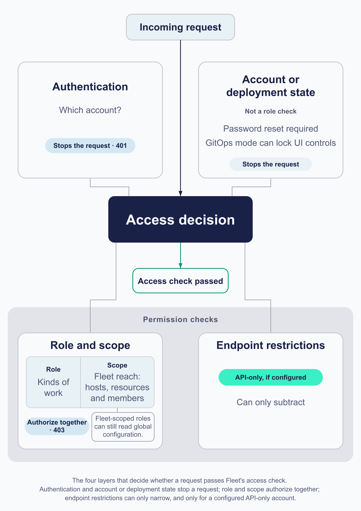

# Identity and roles

Fleet’s access model helps organizations delegate endpoint work while retaining clear ownership. It combines identity, role, fleet scope, and interface so the people and systems doing the work have the right level of access.

Access control carries more weight here than in a tool that only reports, because the same system that reports on devices can also act on them. What it can actually do to any given device depends on the platform, the enrollment, the licence and the management channel as well as the role, and the rest of this manual is largely about those limits. Reading and acting are separate permissions, and Fleet's read-only roles exist precisely to hand out one without the other. Grant too much and a support account can wipe a laptop. Grant too little and the people who own a device population have to escalate every task to someone who does not know their environment.

## What decides whether an action is allowed

 Four layers narrow a request, and only the middle two are what people mean by "permissions". Naming all four is the difference between diagnosing a refusal in a minute and spending an afternoon on the role.

**Authentication** answers who is making the request. For a person that is a Fleet account, reached through organization sign-in or a password. For automation it is a dedicated API-only account, whose token is a credential belonging to that account rather than an identity in its own right. Failing here is a `401`, and it happens before permissions are considered at all.

**Role and scope together** answer what that identity may do, and they are one authorization decision rather than two. The role says which kinds of work are permitted; the scope says over which fleets. Failing here is a `403`, from an identity Fleet has already recognised.

**An identity is global or fleet-scoped, never both.** Fleet rejects an account carrying a global role and a fleet role together. A global assignment works across the organization; a fleet assignment confines the same role to that fleet's resources, and one person can hold different roles in several fleets when their responsibilities differ.

**Four separate licence checks meet here, and each one refuses at a different moment.** Guessing which is which is the reason a Free `ErrMissingLicense` so often gets diagnosed against the wrong thing:

| What Free refuses | When the error arrives |
|---|---|
| Creating a fleet at all | At fleet creation |
| **Adding or removing a fleet member** | At assignment. This is its own Premium API rather than a consequence of fleets being Premium, so it refuses on Free in its own right |
| A user carrying **Technician, Observer+ or GitOps**, at either scope | At user creation or modification. Admin, Maintainer and Observer are not in that set |
| An **API-only** user carrying any fleet role | At user creation or modification, and regardless of which role it is, so this refuses an API-only Observer on a fleet that the row above would allow |
| A non-empty **endpoint restriction** list on an API-only user | At user creation or modification |

**Endpoint restrictions** can narrow an API-only account further, to a list of API endpoints. They are optional, Premium, and they only ever subtract: granting an endpoint never confers permission the role did not already carry.

Four details decide whether an allowlist does what you meant, and they are easy to get wrong in opposite directions:

| You send | Fleet does |
|---|---|
| The field **absent**, when modifying | Leaves the existing restrictions alone. It does not clear them |
| **`null`** | Clears the list. The account is then restricted by its role only |
| A **list of entries** | Restricts to those entries |
| An entry Fleet does not recognise as a catalogued endpoint | **Rejects the request as invalid.** An unrecognised path is not silently ignored |

The important consequence is that **a stored empty list is no restriction rather than deny-all**: an API-only account with nothing in `user_api_endpoints` reaches every registered route, gated by its role alone. So clearing a list to stage a change hands the account everything its role permits, not nothing.

An entry is also a **method and a normalized path together**, drawn from Fleet's catalogue, so allowing a path does not allow every verb on it. And on Free the licence check rejects a **non-null** list, which means an explicit empty array is refused there too rather than treated as "no restrictions requested".

**The interface is not one of these decisions.** The UI, `fleetctl`, GitOps and the REST API are surfaces onto the same authorization, not gates of their own, and choosing one does not change what an identity may do. The one thing an interface does decide is availability: an API-only account cannot use the UI at all.

**`401` and `403` are the two you will meet most, and neither is exhaustive.** Two account-level and deployment-level conditions produce refusals that have nothing to do with roles or scope, and both are easy to spend an hour on:

- **GitOps mode** makes the UI controls for managed settings read-only for everyone, whatever their role. A greyed-out control is a deployment decision, not a permission one. Enabling it requires Fleet Premium, so on Free this cause is ruled out.
- **A forced password reset** leaves an account authenticated but in a state Fleet treats as incomplete, and some endpoints answer `403` on that basis alone. A global administrator can meet this.

So diagnose a permission problem by asking which question failed, and check the account's own state and the deployment's mode before concluding it was the role.

For example, a lab employee can sign in through the organization’s identity provider and receive a fleet role for the Computer lab fleet. That assignment lets the employee perform the work their role permits for lab devices, without granting access to a separate Corporate workstations fleet. A central endpoint team can hold the global access needed for organization-wide settings.

<!-- IMAGE-REDO: assets/1.4-access-gates.webp
     WHY: the rendered image labels Scope "which devices?" and draws Interface as a narrowing authorization gate. The chapter now says scope covers a fleet's resources and members as well as its hosts and does not seal off global configuration reads, and that the interface is not an authorization decision at all, the fourth layer being non-RBAC account and deployment state. Corrected prompt below.
     NOTE 2026-08-27: the rendered image contradicts the corrected prose in two places and
     must be regenerated before this chapter can be stamped. It labels Scope "which
     devices?", where the chapter now says scope covers a fleet's resources and its
     membership as well as its hosts, and does not seal off global configuration reads. And
     it draws Interface as a narrowing authorization gate, where the chapter says the
     interface is not an authorization decision at all and the fourth layer is non-RBAC
     account and deployment state. When regenerating: relabel Scope "which fleet, and its
     hosts, resources and members", and replace the Interface gate with "Account and
     deployment state: forced password reset, GitOps mode". The reviewer that originally
     said to leave this asset alone withdrew that once the prose changed.
     Original note follows.
     IMAGE-OK-WAS:
     NOTE: reviewed 2026-08-24 and kept. The band now steps down at each bar and holds
     constant between them, so four discrete decisions read as four cuts. Outcome box is a
     solid fill. Prompt retained for regeneration; do not delete.
     PROMPT: Landscape 16:9. Create a conceptual access-decision map rather than a row of four sequential gates. A solid #192147 rectangle at centre-right is the visual anchor and is labelled "Access decision" in white text. A heavy horizontal #192147 flow enters it from the left, beginning with "Incoming request", and a short #009A7D arrow leaves it toward a small outlined box labelled "Access check passed". This outcome means only that the access check passed; do not imply that the action completed or that a device can perform it.

     Arrange four contributor cards around the central decision and connect each card to it with thin #8B8FA2 lines. Do not number the cards, do not imply middleware execution order, and do not make every contributor an identical narrowing bar.

     Above-left, a card labelled "Authentication" over "Which account?". Above-right, a card labelled "Account or deployment state" with the small heading "Examples" and two lines: "Password reset required" and "GitOps mode can lock UI controls". These are examples, not an exhaustive list.

     Below the decision, place one pale #E2E4EA grouping band labelled "Permission checks". It contains two cards. The first is a single compound card labelled "Role and scope" with two side-by-side fields: "Role" over "Kinds of work" and "Scope" over "Fleet reach". Add the small line "One authorization decision". Attach a compact neutral note to the Scope field reading "Fleet-scoped roles can still read global configuration". Do not label scope as devices alone and do not imply fleet scope seals off all global information.

     The second card in the Permission checks band is labelled "Endpoint restrictions". Add a small #009A7D chip reading "API-only, if configured" and the line "Can only subtract". Make its conditional nature unmistakable; do not imply that every account has endpoint restrictions.

     Do not include "Interface" as a contributor, checkpoint, permission, or gate. Do not draw UI, fleetctl, GitOps, or REST API as separate authorization paths.

     Caption: "Role and scope authorize together. Endpoint restrictions apply only to API-only accounts, and only when configured. Account or deployment state can still block work."

     PALETTE. Two sets, doing different jobs.
     STRUCTURE, the Fleet Black ramp and neutrals: #192147 for the most important marks,
     #515774 for ordinary labels, #8B8FA2 and #C5C7D1 for secondary structure, #E2E4EA for
     grouping bands, #F9FAFC background, #D3E8F3 and #E8F1F6 for quiet fills. All text stays
     in this set; do not tint type.
     THE FLEET DOTS, the six accent colours taken from Fleet's own logo mark: #5CABDF sky
     blue, #3AEFC4 mint, #63C740 green, #C98DEF lavender, #FAA669 apricot, #D66C7B rose.
     Fleet Green #009A7D sits alongside them. These are soft and pastel, so they work as
     fills with #192147 text on top.
     STRENGTH. Use a dot colour at full strength only for small marks: an arrow, a chip, a
     single filled icon, a rule. Over any large area, use it at roughly a 20 to 25 percent
     tint, so a panel reads as tinted rather than painted. Five large panels at full
     saturation looks like a children's infographic, not a technical manual. And do not
     colour a panel that has no content in it; colour has to carry meaning, and an empty
     coloured box is just noise.
     HOW TO USE THE DOTS. One colour per category, used consistently within the image, to
     fill or stroke the things a reader genuinely has to tell apart. Take only as many as
     there are categories; do not spread all six across four items to look lively. If nothing
     in the picture needs distinguishing, use none of them and let the structure set carry it.
     GIVE IT WEIGHT. At least one element should be a solid filled shape rather than an
     outline, so the composition has an anchor. Vary stroke weight so the primary flow is
     visibly heavier than the scaffolding around it.
     Never invent a colour outside these two sets. Flat vector, generous whitespace, no
     gradients, no drop shadows, no 3D or photorealistic icons, no logo, no watermark.
     Legible at half page width.
     NOTE: "Fleet" here is a software product for managing computers. Never draw vehicles,
     cars, vans, trucks, ships or aircraft. Never use an em-dash in rendered text.
     PROMPT REWRITTEN 2026-08-27 by the independent reviewer against the corrected prose.
     It found that the author's hand-edited version still said "Scope: which devices?" and
     still drew Interface as an authorization gate, and that the author's proposed
     replacement missed a layer: role and scope are one decision, endpoint restrictions are
     a second. It also removed an invented "roughly one fifth" narrowing and the universal
     caption "Each gate can only narrow", since authentication and account state stop work
     rather than narrow it. Do not hand-edit this prompt; send it back for review.
     The reviewer chose to render no HTTP status. That is a caution about the picture, not a
     correction to the prose: `debug_handler.go` does return 403 when a forced password reset
     makes `CanPerformActions` false, which is what the chapter says. Checked 2026-08-27.
-->

## Organizational control vs. ownership of fleets

### Global Admins
 Some decisions are naturally organization-wide: server configuration, identity-provider and SCIM setup, MDM connections, and other shared settings. Keep these with a small group of global administrators who can coordinate their impact across the deployment.

**Audit-log delivery is not one of them, and it is worth knowing why.** Where Fleet sends its audit stream is set through the server's own configuration keys rather than through anything in the interface, so no Fleet role grants or withholds it. It is a change to the deployment, made by whoever operates the server ([2.5](../02-administer-and-deploy-fleet/2.5-activity-audit-logs-and-log-delivery.md)). An access review that treats it as an administrator's privilege will look in the wrong place.

### fleet roles
Use fleet role assignments for daily endpoint ownership. A fleet owner can be responsible for the policies, software, profiles, and device actions appropriate to their operating environment. This gives a computer lab, business unit, or regional support group meaningful autonomy while preserving clear boundaries between their device populations.

**Fleet scope is about more than which hosts an identity can see, in both directions**, and an access review built only around host visibility will get the picture wrong twice over:

- It also covers the fleet's **resources** and the fleet's **people**. A Fleet Admin can manage membership of the fleets they administer, which is a genuine administrative power over accounts rather than over devices.
- And it does not seal off everything global. **Any fleet-scoped role can read global configuration**, down to Observer. That is deliberate, since a fleet-scoped user needs to know how the deployment is set up to work in it, but it means "confined to their fleet" is not literally true and should not be relied on as an isolation boundary for server settings.

### Role and scope are independent of each other

This is the part of the model most worth keeping distinct. **The same set of roles exists at both levels.** A global maintainer and a fleet maintainer hold the same kind of authority; they differ only in how far it reaches.

That independence is what lets one person hold different roles in different fleets, which is a supported and useful arrangement. Someone can administer the fleet they own while holding read-only access to a neighbouring one they occasionally support.

It also means a role name on its own only answers half of "what can this person do". [1.3](1.3-hosts-fleets-labels.md) has the other half, and the two compose: **a fleet bounds devices and people at the same time.** Which is a good reason to design fleets deliberately instead of letting them accumulate.

[2.3](../02-administer-and-deploy-fleet/2.3-user-accounts-roles-and-service-identities.md) covers which role to choose. [a.4](../09-appendices/a.4-roles-and-permissions-matrix.md) is where the exhaustive breakdown will live and **is not written yet**; 2.3 is the fullest account there is.

<!-- SCREENSHOT: The user edit dialog showing a role being assigned, with the global versus
     fleet choice visible and at least one fleet-scoped assignment already present. This is
     where the model above becomes a concrete control. Crop to the dialog. Highlight the
     global/fleet toggle, since that choice is the whole subject of this section. Use a
     placeholder name, not a real colleague. -->

### "Read-only" is not the same as "harmless"

In most systems read access is the safe thing to hand out. Here it is not automatically safe, because some of what Fleet can read is a secret. At fleet scope, the read-only role can view disk encryption recovery keys.

That is deliberate and useful: recovering a locked-out user is exactly the task you want a support person to handle without also granting them the ability to change configuration. It is simply not what most people picture when they hear read-only.

Treat "who can read recovery secrets" as its own question when you design access, rather than assuming the answer falls out of the role names.

### Fleet also has a write-only role

Fleet's GitOps role is write-oriented: it can apply configuration and cannot read most of what it applied. It is not literally write-only, and the exceptions are deliberate rather than accidental. A global GitOps identity can read global configuration and global reports, for instance, because applying them needs to know what is there.

That shape exists for pipelines. A credential living in CI should be able to push desired state and should not become a way to enumerate the estate if it leaks. A fleet-scoped GitOps identity can write its own fleet and cannot read it back.

**One distinction is easy to lose here.** A denied read is a `403`, not an empty success. So a GitOps token that returns nothing has not been refused: an empty result means the request was authorized and there was nothing to return, which is a different finding from a refusal and points somewhere different. Read the status code before concluding either way.

## Give people and automation their own identities

 Human administrators need an identity that follows their employment and access lifecycle. Connecting Fleet to the organization’s identity provider gives administrators a familiar sign-in experience and makes joiner, mover, and leaver processes easier to operate. SCIM and role-sync features can further align Fleet access with the organization’s established identity processes.

Automation needs the same clarity. Give GitOps, CI, reporting, ticket workflows, and internal tools their own API-only identities rather than sharing a person’s token. Each identity should have an owner, documented purpose, narrowest useful scope, and a rotation and review process. This makes automated changes durable, reviewable, and easier to update when the workflow changes.

`fleetctl` follows the same model. It acts with the identity and scope of its configured session or token, so command-line work remains attributable and respects the same access boundaries.

### Why shared credentials cost you

Fleet records a defined set of activities, and that record is what [1.5](1.5-audit-and-activity.md) is built on. It is an enumerated list of things Fleet considers worth recording rather than a log of every request, which matters when you are deciding what the audit record can be relied on to prove.

**A row has one of three attributions, not one.** It is attributed to a user, which may be a person or an API-only service identity; or it is marked Fleet-initiated, which the activity type has to declare; or it is **unattributed**, because Fleet accepts an activity with no user at all. Do not build an audit control on the assumption that every action traces to a person or a service account.

An action attributed to a person tells you who to ask. One attributed to a well-named service identity tells you which workflow to go and read. One attributed to a token that three people share tells you very little.

Naming matters as much as separating. A service identity called `API User` produces a record that is technically complete and useless six months later.

<!-- SCREENSHOT: The activity feed showing several entries with different actors: a person,
     and a clearly-named service identity such as a GitOps pipeline. The point is the actor
     column rather than the actions, so pick entries whose actors differ visibly. Crop to
     four or five rows. Highlight the actor column. Use placeholder names. -->

### Where account lifecycle should live

Accounts outliving the need for them is an access failure that happens by omission. Nobody decides to leave a departed colleague's access in place.

Keep the lifecycle upstream and the problem mostly goes away. When accounts are created and removed from your identity provider, joining, moving and leaving run through a process that already exists and is already audited. [2.2](../02-administer-and-deploy-fleet/2.2-identity-providers-sso-scim-and-role-sync.md) covers getting there.

**"Upstream" is three capabilities, not one, and enabling only the first is the common mistake.** Sign-on alone authenticates an account Fleet already holds; it creates nothing and removes nothing, so a deactivated employee's Fleet account survives their departure intact and simply stops being usable through the IdP. Just-in-time provisioning is what creates the account on first sign-in, and SCIM is what performs automatic upstream removal.

**Both of those are Fleet Premium**, and SCIM more strictly so than it looks: its routes are only registered when the server *starts* with a Premium licence, so this is a restart-time decision rather than a setting you toggle.

Even with all three, removal is not universal. SCIM removes **eligible SSO accounts** and skips the rest: **API-only accounts and password accounts are not touched**, which is most of your automation, and it will **refuse to delete the last global administrator**, which is a safety property rather than a failure. Those exceptions need their own review cycle.

Service identities are the exception, since they have no employment to inherit a lifecycle from. Give each one an owner and a review date when you create it, or nothing will ever prompt you to look at it again.

## Putting it together: a starting access model

 Start with a small group of global administrators for shared Fleet configuration. Assign fleet roles to the teams that own day-to-day device work, and use a separate service identity for each automated workflow. Review roles, API tokens, endpoint restrictions, and audit-log delivery on a regular cycle. Treat recovery keys, certificate authorities, secrets, and automation output as sensitive operational data throughout that model.

The full role-and-permission matrix, token administration, GitOps identity setup, and audit-log configuration belong in the reference and operations parts of the manual.
