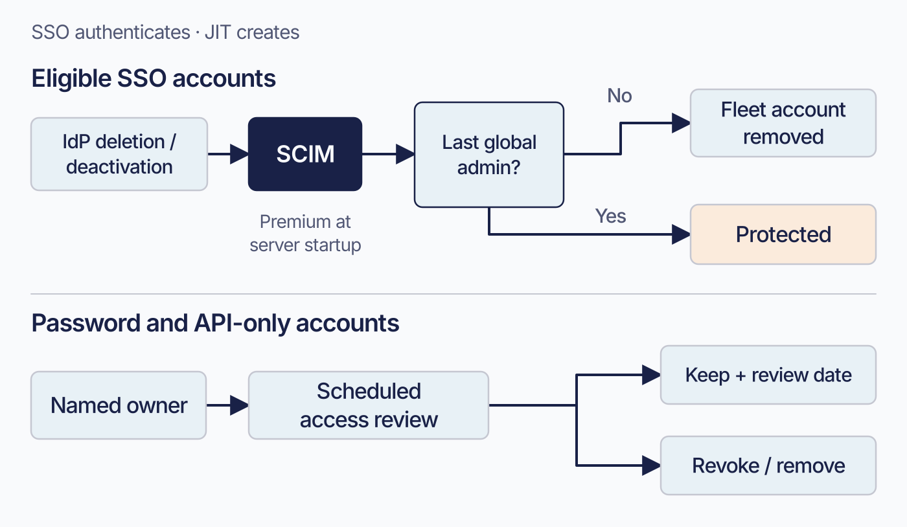

# Identity and roles

Fleet accounts can read device data, change settings, and perform actions such as wiping a laptop. Give each person and automated workflow the access their work requires.

An action’s availability also depends on platform, enrollment, licence, and management channel. Reading data and changing a device require different permissions; read-only roles let you grant the former without the latter.

## What decides whether an action is allowed

 A request must pass authentication, role-and-scope authorization, any configured endpoint restrictions, and relevant account or deployment checks.

**Authentication** identifies the Fleet account behind a request. People use organization sign-in or a password. Automation uses a token belonging to a dedicated API-only account. Authentication failure returns `401` before authorization is considered.

**Role and scope** form one authorization decision: the role permits kinds of work, and the scope determines which fleets it covers. A refusal here returns `403` for an authenticated account.

An account holds either a global role or fleet-scoped roles. Fleet rejects an account with both. One person can hold different roles in several fleets.

**Licence checks depend on the operation.** Use the failing request to identify which requirement applies:

| What Free refuses | When the error arrives |
|---|---|
| Creating a fleet at all | At fleet creation |
| **Adding or removing a fleet member** | At assignment, through a separate Premium API |
| A user carrying **Technician, Observer+ or GitOps**, at either scope | At user creation or modification. Admin, Maintainer and Observer are not in that set |
| An **API-only** user carrying any fleet role | At user creation or modification, for every role, including Observer |
| A **non-null** endpoint restriction list on an API-only user, which includes an explicit empty array | At user creation or modification |

> **Bulk role assignment follows a different path.** The role-spec route used by GitOps performs neither the licence validation nor the API-only validation of user creation and modification. It can assign Premium-only roles on Free. The table describes what the listed operations enforce, not every role assignment that can exist.

**Endpoint restrictions** optionally limit a Premium API-only account to specified API endpoints. The account’s role must still permit each action.

An endpoint list can be in these states:

| You send | Fleet does |
|---|---|
| The field **absent**, when modifying | Preserves the existing restrictions |
| **`null`** | Clears the list. The account is then restricted by its role only |
| A **list of entries** | Restricts to those entries |
| An explicit **empty array** | Rejected on Premium as invalid, since a list must name at least one endpoint. On Free the licence check refuses it first, so which error you get depends on your tier. Use `null` to clear |
| An entry Fleet does not recognise as a catalogued endpoint | Rejects the request as invalid |

Clearing endpoint restrictions permits every registered route the account’s role allows. An empty `user_api_endpoints` store has that same effect. Keep this in mind when replacing an allowlist.

Each entry combines an HTTP method with a normalized path from Fleet’s endpoint catalogue. Allowing a path for one method leaves other methods restricted.

The UI, `fleetctl`, GitOps, and REST API use Fleet’s authorization rules. Their available operations differ; for example, API-only accounts cannot use the UI.

Account state and deployment configuration can also explain a refusal or an unavailable control:

- **GitOps mode** makes managed-setting controls read-only in the UI for every role. It requires Premium.
- **A forced password reset** leaves the account authenticated but incomplete. Some endpoints return `403` for this state, even for a global administrator.

Check the failed operation, the account’s state, and GitOps mode before changing its role.

For example, a lab employee can sign in through the organization’s identity provider and receive a fleet role for the Computer lab fleet. That assignment lets the employee perform the work their role permits for lab devices, without granting access to a separate Corporate workstations fleet. A central endpoint team can hold the global access needed for organization-wide settings.

<!-- IMAGE-OK: assets/1.4-access-gates.webp
     REDONE 2026-08-30: regenerated to correct scope (resources, members, hosts; does not seal global config reads) and to drop Interface as an authorization gate; fourth layer is non-RBAC account and deployment state. Reviewed and accepted.
     WHY-WAS: the rendered image labels Scope "which devices?" and draws Interface as a narrowing authorization gate. The chapter now says scope covers a fleet's resources and members as well as its hosts and does not seal off global configuration reads, and that the interface is not an authorization decision at all, the fourth layer being non-RBAC account and deployment state. Corrected prompt below.
     IMAGE-OK-WAS:
     NOTE: reviewed 2026-08-24 and kept. The band now steps down at each bar and holds
     constant between them, so four discrete decisions read as four cuts. Outcome box is a
     solid fill. Prompt retained for regeneration; do not delete.
     PROMPT: Landscape 16:9. Create a conceptual access-decision map rather than a row of four sequential gates. A solid #192147 rectangle at centre-right is the visual anchor and is labelled "Access decision" in white text. A heavy horizontal #192147 flow enters it from the left, beginning with "Incoming request", and a short #009A7D arrow leaves it toward a small outlined box labelled "Access check passed". This outcome means only that the access check passed; do not imply that the action completed or that a device can perform it.

     Arrange four contributor cards around the central decision and connect each card to it with thin #8B8FA2 lines. Do not number the cards, do not imply middleware execution order, and do not make every contributor an identical narrowing bar.

     Above-left, a card labelled "Authentication" over "Which account?". Above-right, a card labelled "Account or deployment state" with the small heading "Examples" and two lines: "Password reset required" and "GitOps mode can lock UI controls". These are examples, not an exhaustive list.

     Below the decision, place one pale #E2E4EA grouping band labelled "Permission checks". It contains two cards. The first is a single compound card labelled "Role and scope" with two side-by-side fields: "Role" over "Kinds of work" and "Scope" over "Fleet reach". Add the small line "One authorization decision". Attach a compact neutral note to the Scope field reading "Fleet-scoped roles can still read global configuration". Do not label scope as devices alone and do not imply fleet scope seals off all global information.

     The second card in the Permission checks band is labelled "Endpoint restrictions". Add a small #009A7D chip reading "API-only, if configured" and the line "Can only subtract". Make its conditional nature unmistakable; do not imply that every account has endpoint restrictions.

     Do not include "Interface" as a contributor, checkpoint, permission, or gate. Do not draw UI, fleetctl, GitOps, or REST API as separate authorization paths.

     Caption: "Role and scope authorize together. Endpoint restrictions apply only to API-only accounts, and only when configured. Account or deployment state can still block work."

     PALETTE. Two sets, doing different jobs.
     STRUCTURE, the Fleet Black ramp and neutrals: #192147 for the most important marks,
     #515774 for ordinary labels, #8B8FA2 and #C5C7D1 for secondary structure, #E2E4EA for
     grouping bands, #F9FAFC background, #D3E8F3 and #E8F1F6 for quiet fills. All text stays
     in this set; do not tint type.
     THE FLEET DOTS, the six accent colours taken from Fleet's own logo mark: #5CABDF sky
     blue, #3AEFC4 mint, #63C740 green, #C98DEF lavender, #FAA669 apricot, #D66C7B rose.
     Fleet Green #009A7D sits alongside them. These are soft and pastel, so they work as
     fills with #192147 text on top.
     STRENGTH. Use a dot colour at full strength only for small marks: an arrow, a chip, a
     single filled icon, a rule. Over any large area, use it at roughly a 20 to 25 percent
     tint, so a panel reads as tinted rather than painted. Five large panels at full
     saturation looks like a children's infographic, not a technical manual. And do not
     colour a panel that has no content in it; colour has to carry meaning, and an empty
     coloured box is just noise.
     HOW TO USE THE DOTS. One colour per category, used consistently within the image, to
     fill or stroke the things a reader genuinely has to tell apart. Take only as many as
     there are categories; do not spread all six across four items to look lively. If nothing
     in the picture needs distinguishing, use none of them and let the structure set carry it.
     GIVE IT WEIGHT. At least one element should be a solid filled shape rather than an
     outline, so the composition has an anchor. Vary stroke weight so the primary flow is
     visibly heavier than the scaffolding around it.
     Never invent a colour outside these two sets. Flat vector, generous whitespace, no
     gradients, no drop shadows, no 3D or photorealistic icons, no logo, no watermark.
     Legible at half page width.
     NOTE: "Fleet" here is a software product for managing computers. Never draw vehicles,
     cars, vans, trucks, ships or aircraft. Never use an em-dash in rendered text.
     PROMPT REWRITTEN 2026-08-27 by the independent reviewer against the corrected prose.
     It found that the author's hand-edited version still said "Scope: which devices?" and
     still drew Interface as an authorization gate, and that the author's proposed
     replacement missed a layer: role and scope are one decision, endpoint restrictions are
     a second. It also removed an invented "roughly one fifth" narrowing and the universal
     caption "Each gate can only narrow", since authentication and account state stop work
     rather than narrow it. Do not hand-edit this prompt; send it back for review.
     The reviewer chose to render no HTTP status. That is a caution about the picture, not a
     correction to the prose: `debug_handler.go` does return 403 when a forced password reset
     makes `CanPerformActions` false, which is what the chapter says. Checked 2026-08-27.
-->

## Organizational control vs. ownership of fleets

### Global Admins
 Some decisions are naturally organization-wide: organization configuration, identity-provider and SCIM setup, MDM connections, and other shared settings. Keep these with a small group of global administrators who can coordinate their impact across the deployment.

Audit-log delivery is configured on the server. Whoever operates the deployment controls it through server configuration; Fleet roles do not grant this capability ([2.8](../02-administer-and-deploy-fleet/2.8-activity-audit-logs-and-log-delivery.md)). Include the server operator in reviews of audit delivery.

### fleet roles
Use fleet role assignments for daily endpoint ownership. A fleet owner can be responsible for the policies, software, profiles, and device actions appropriate to their operating environment. This gives a computer lab, business unit, or regional support group meaningful autonomy while preserving clear boundaries between their device populations.

A fleet role can cover resources and people as well as devices. It also permits some access to global settings:

- A fleet Admin can manage membership of the fleets they administer.
- All six fleet-scoped roles can read global configuration, including Observer and GitOps. A fleet assignment therefore does not isolate global server settings.

### Role and scope are independent of each other

The same roles exist at both scopes. A global Maintainer and a fleet Maintainer have the same kind of authority over different scopes.

A person can administer one fleet and hold read-only access to another.

Review role and scope together. [1.3](1.3-hosts-fleets-labels.md) explains how fleets group devices and delegate administration.

[2.6](../02-administer-and-deploy-fleet/2.6-user-accounts-roles-and-service-identities.md) covers which role to choose. [a.4](../09-appendices/a.4-roles-and-permissions-matrix.md) carries the exhaustive breakdown, action by action against all six roles at both scopes.

<!-- SCREENSHOT: The user edit dialog showing a role being assigned, with the global versus
     fleet choice visible and at least one fleet-scoped assignment already present. This is
     where the model above becomes a concrete control. Crop to the dialog. Highlight the
     global/fleet toggle, since that choice is the whole subject of this section. Use a
     placeholder name, not a real colleague. -->

### Read access includes recovery secrets

Some host data is secret, so read access needs its own review.

Recovery secrets use the host-read permission. A user who can list and read a host can reveal its disk-encryption recovery key, Recovery Lock password, and managed local account password. Five of the six roles have that access at their assigned scope. GitOps lacks host-list and ordinary host-read permissions, so it cannot use these reveal operations; its narrower identifier-based host read is separate ([a.4](../09-appendices/a.4-roles-and-permissions-matrix.md)).

A fleet-scoped reader can reveal secrets for hosts in their fleets. A global reader can reveal them for every host in the deployment.

This lets support staff recover a locked-out user without receiving configuration-write permission.

Include recovery-secret access explicitly when choosing and reviewing roles.

### The GitOps role

Fleet’s GitOps role is designed for configuration pipelines. It can apply configuration while many read operations are refused.

A fleet-scoped GitOps account can write its fleet but cannot read it back. Review the following permissions when scoping a GitOps credential:

- A global GitOps identity can read global configuration and global reports, because applying them needs to know what is there.
- It can read **certificate authority integration secrets**: the API tokens, passwords, Simple Certificate Enrollment Protocol (SCEP) challenges and client secrets Fleet holds for the certificate authorities you have connected. Not their private keys, which no surface returns to it.
- It can read **one host in full**, unredacted, if it knows that host's identifier. It cannot list hosts to find one.
- It can **write MDM commands**, and cannot read their results. The named device actions, lock, unlock, wipe and clear passcode, still refuse it, because each checks the ability to list hosts before the command write and GitOps fails there. The raw command channel has no such gate: a GitOps credential can send arbitrary MDM commands directly, which on Premium includes Apple's lock and erase commands.

Treat a GitOps token as a credential capable of device actions, including raw MDM commands.

Check the HTTP status when a GitOps read returns no data. `403` means access was refused. An authorized request with an empty result means there was nothing to return.

## Give people and automation their own identities

 Connect human accounts to your organization’s identity provider. Use SCIM and role sync where appropriate to manage account creation, changes, and departures.

Give each GitOps pipeline, CI job, reporting integration, and other automated workflow its own API-only account. Record its owner, purpose, scope, rotation process, and review date.

`fleetctl` acts with its configured session or token’s identity and scope.

### Why shared credentials cost you

Fleet records defined activity types. It is not a request-by-request audit log ([1.5](1.5-audit-and-activity.md)).

An activity may identify a person or API-only account and may carry a Fleet-initiated flag. These are independent: both can be present, and Fleet also accepts activities with neither. The activity type determines whether it declares Fleet initiation.

A person’s account identifies whom to ask about a change. A named service account identifies the workflow. Shared tokens make that attribution ambiguous ([8.12](../08-troubleshooting/8.12-audit-logs.md)).

Choose a service-account name that identifies its job; `API User` will be difficult to interpret later.

<!-- SCREENSHOT: The activity feed showing several entries with different actors: a person,
     and a clearly-named service identity such as a GitOps pipeline. The point is the actor
     column rather than the actions, so pick entries whose actors differ visibly. Crop to
     four or five rows. Highlight the actor column. Use placeholder names. -->

### Where account lifecycle should live

Account removal needs an owner and a trigger.

Use your existing identity-provider processes for joining, changing roles, and leaving ([2.5](../02-administer-and-deploy-fleet/2.5-identity-providers-sso-scim-and-role-sync.md)). Fleet’s integration has three distinct parts:

- **SSO** authenticates an existing Fleet account. Disabling the IdP user stops IdP sign-in but leaves the Fleet account in place.
- **Just-in-time provisioning** creates the Fleet account at first sign-in.
- **SCIM** removes eligible accounts after upstream deletion or deactivation.

Just-in-time provisioning and SCIM require Premium. SCIM routes are registered when the server starts with a Premium licence, so enabling them requires the appropriate startup state.

SCIM skips password and API-only accounts and protects the last global administrator. Include those accounts in an owner-led review cycle.

Give every service identity an owner and review date at creation.

<!-- IMAGE-OK: assets/1.4-account-review-lifecycles.webp
     QUESTION: Which accounts need an explicit owner-led retirement process?
     PROMPT: DIAGRAM: Split account lifecycle into two lanes. Eligible SSO account: IdP
     deletion/deactivation leads through SCIM to Fleet account removal, with a stop marker Last
     global admin protected. Password and API-only accounts: Named owner leads to Scheduled access
     review, then Keep with review date or Revoke/remove. No SCIM arrow may enter the second lane.
     Put SSO sign-in and JIT creation outside the removal arrows as small contextual labels, not as
     steps that automatically deprovision accounts. Label SCIM Premium and server-start prerequisite
     in one short note.
     TERMINOLOGY: Fleet is the product, server, or company. Host groups are lowercase
     fleet/fleets, even in titles and node labels. Do not call those groups teams. Preserve
     exact code/API identifiers; do not render these terminology instructions as image text.
     DESIGN: Flat vector technical diagram. Fleet is software for managing computers; draw no
     vehicles. Use Inter labels and Roboto Mono identifiers. At 1400 px source width use 48 px
     titles, 36 px body labels, and at least 28 px secondary text; scale proportionally. Check at
     720 px reading width and intended print size. Use a 32 px spacing grid, at least 24 px node
     padding, and consistent corner radii. Center short node names; left-align multiline
     explanations. Never shrink text to fit. Use #F9FAFC background, #192147 headings and primary
     connectors, #515774 text, #8B8FA2 secondary connectors, #C5C7D1 borders, and #D3E8F3 or #E8F1F6
     quiet fills. Use #5CABDF and #C98DEF for named categories, #3AEFC4 for labelled positive
     outcomes, #D66C7B for labelled failures, and #FAA669 for labelled cautions. Tint large panels
     to 20 to 25 percent; full strength is for small marks. Keep text navy or slate, or off-white on
     a navy anchor. Never rely on colour alone. Use one arrowhead shape, consistent stroke weights,
     box-edge termination, and labelled branches and return paths. Keep connectors clear of text. No
     gradients, shadows, decorative icons, logo, watermark, em-dashes, or slogan footer. Render only
     the specified reader-facing labels. Choose orientation to fit the relationship, not a default
     poster. Keep captions outside the artwork. If labels crowd, split the figure before shrinking
     them. Keep editable SVG when the production method supports it.
     NOTE: Reviewed and installed 2026-09-09 in the live 4.91 and frozen 4.90 editions.
     Checked against the chapter and its version-specific evidence during the editorial pass.
     The surrounding text retains technical qualifications and accessible explanation.
     SOURCE: research/visual-reviews/part-0-1/assets/1.4-account-review-lifecycles.svg
-->

## Putting it together: a starting access model

 Start with a small group of global administrators for shared Fleet configuration. Assign fleet roles to the teams that own day-to-day device work, and use a separate service identity for each automated workflow. Review roles, API tokens, endpoint restrictions, and audit-log delivery on a regular cycle. Treat recovery keys, certificate authorities, secrets, and automation output as sensitive operational data throughout that model.

The full role-and-permission matrix, token administration, GitOps identity setup, and audit-log configuration belong in the reference and operations parts of the manual.
