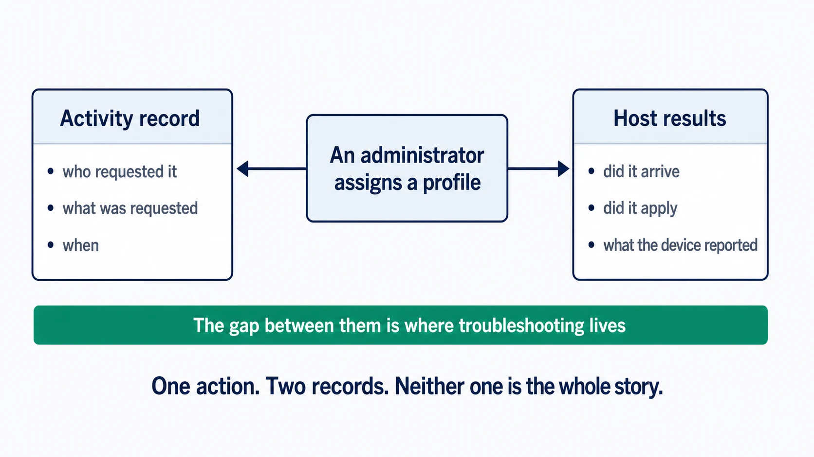

# Audit and activity

Fleet gives administrators a record of the change requested in Fleet and the result reported by the device. Reading those records together turns an endpoint action into an accountable operational story: what was requested, who requested it, how it progressed, and what the host reported.

## Activity records and host results

 **The activity record is an enumerated event stream, not one half of a tidy pair.** It is easiest to reach for a two-record model, administrative requests on one side and device outcomes on the other, and this chapter used to. That model is wrong in a way that matters, because it tells you an activity row proves an administrator asked for something, and plenty of them do not.

What `activity_past` actually contains is a defined list of things Fleet considers worth recording, drawn from four different places:

| Kind | Example | Actor |
|---|---|---|
| Administrative changes | Assigning a profile, editing a policy, changing a role | A person, or an API-only service identity. The API marks which, **while the actor still resolves to a live user**: deleting the account nulls the link, and the stored name and email remain with nothing to say what kind of actor it was |
| Requested work | Sending an MDM command | Whoever requested it, again a person or a service identity |
| Automation | A policy automation running a script | Fleet, flagged as Fleet-initiated |
| **Observed outcomes** | A device checking out of MDM, an enrollment completing, software or a script reporting its result through the agent | Sometimes nobody, sometimes the original requester |

**These are not four exclusive bins**, and it is worth not over-learning the table. A `ran_script` row is an observed outcome *and* may be automation, since it is written when the host's result comes back and separately reports whether a policy or the setup experience started it. An `installed_software` row can carry the user who asked for it, or no user at all when it came from self-service or an automation.

The point the table is making is narrower and more useful than a taxonomy: **an activity with no actor is a legitimate record of something that happened, not a corrupted one.** An Apple device sending `CheckOut` creates `mdm_unenrolled` with no user; enrollment creates `mdm_enrolled` the same way. Reading a blank actor as missing attribution sends you looking for a person who was never involved.

**Host results and status** are still a separate thing, and still where a device's reported outcome for a piece of work lives: software-install status, script output, policy status, an MDM-command acknowledgement. The two overlap rather than partition. Use the activity stream to find out that something happened and when; use host results to find out what a specific device made of a specific piece of work.

<!-- IMAGE-OK: assets/1.5-activity-and-host-results.webp
     NOTE: reviewed 2026-08-24 and kept. The earlier version spread the accent
     across a full-width filled banner and asserted a gap it never drew; both are fixed. The
     gutter is real empty space, the dashed green line sits in it, the two panels are
     balanced, and there is one caption. Prompt retained for regeneration; do not delete.
     PROMPT: Landscape 16:9. A single box at top centre: "An administrator assigns a
     profile". Two arrows descend from it, left and right, into two panels separated by a
     visible vertical gutter of empty background about a fifth of the width. Left panel,
     "Activity record": who requested it, what was requested, when. Right panel, "Host
     results": did it arrive, did it apply, what the device reported. In the empty gutter
     between them, running vertically, a thin dashed line in #8B8FA2 and small #515774 text
     reading "the gap where troubleshooting lives". The gap must be real empty space, not a
     filled bar. One caption only, at the bottom: "One action. Two records. Neither is the
     whole story." Draw the dashed gutter line in #009A7D. Give the top
     box a solid #192147 fill with white text, since one action is the origin of both records,
     and fill the two panels #D3E8F3 so they carry equal weight against each other.
     PALETTE. Two sets, doing different jobs.
     STRUCTURE, the Fleet Black ramp and neutrals: #192147 for the most important marks,
     #515774 for ordinary labels, #8B8FA2 and #C5C7D1 for secondary structure, #E2E4EA for
     grouping bands, #F9FAFC background, #D3E8F3 and #E8F1F6 for quiet fills. All text stays
     in this set; do not tint type.
     THE FLEET DOTS, the six accent colours taken from Fleet's own logo mark: #5CABDF sky
     blue, #3AEFC4 mint, #63C740 green, #C98DEF lavender, #FAA669 apricot, #D66C7B rose.
     Fleet Green #009A7D sits alongside them. These are soft and pastel, so they work as
     fills with #192147 text on top.
     STRENGTH. Use a dot colour at full strength only for small marks: an arrow, a chip, a
     single filled icon, a rule. Over any large area, use it at roughly a 20 to 25 percent
     tint, so a panel reads as tinted rather than painted. Five large panels at full
     saturation looks like a children's infographic, not a technical manual. And do not
     colour a panel that has no content in it; colour has to carry meaning, and an empty
     coloured box is just noise.
     HOW TO USE THE DOTS. One colour per category, used consistently within the image, to
     fill or stroke the things a reader genuinely has to tell apart. Take only as many as
     there are categories; do not spread all six across four items to look lively. If nothing
     in the picture needs distinguishing, use none of them and let the structure set carry it.
     GIVE IT WEIGHT. At least one element should be a solid filled shape rather than an
     outline, so the composition has an anchor. Vary stroke weight so the primary flow is
     visibly heavier than the scaffolding around it.
     Never invent a colour outside these two sets. Flat vector, generous whitespace, no
     gradients, no drop shadows, no 3D or photorealistic icons, no logo, no watermark.
     Legible at half page width.
     NOTE: "Fleet" here is a software product for managing computers. Never draw vehicles,
     cars, vans, trucks, ships or aircraft. Never use an em-dash in rendered text. -->

## What the record covers, and where it stops

 One boundary decides which questions this record can answer at all.

**Every entry is written by Fleet's server, but they do not all record something the server chose to do.** Some record a server action; others are written when a device's report arrives, which is why an unenrollment or a returned script result has a row of its own. What follows is about when the row appears rather than who caused it. Creating a policy, assigning a profile, transferring a host, changing someone's role and signing in are all written as they happen. A per-host **script result is written when the host's result comes back**, not when the script was sent, which is why a script queued against a single offline host produces no `ran_script` row until that host returns. Batch runs are different: requesting one writes its batch activity straight away, and scheduling one likewise, whatever state the target hosts are in.

**What Fleet does not record is anything it never saw.** An action taken on the machine, outside every channel Fleet holds, leaves no entry: someone uninstalling the agent locally, deleting a profile by hand, turning off encryption at the keyboard, or another management tool removing a package.

The distinction is between *device-originated* and *invisible*, and they are not the same thing. A device that unenrolls from MDM tells Fleet so, and that becomes an activity. A device whose agent is deleted tells Fleet nothing, and it does not. So "how did the agent get removed from this laptop?" has no answer here unless Fleet removed it, and the answer is on the device, in [8.4](../08-troubleshooting/8.4-host-side-investigation.md). "When did this Mac leave MDM?" may well have one.

Set that expectation before someone runs the query, because an empty result looks suspicious when it is simply out of scope.

> ### And some things Fleet did see
>
> **The organisation-wide settings document is audited by exception rather than as a document.** Around forty distinct activity types are reachable from a change to it: agent options, disk encryption on and off, Windows MDM on and off, minimum OS versions, the integrations, GitOps mode, and so on. Enroll secrets are audited too, through their own separate route rather than as part of that set ([a.3](../09-appendices/a.3-configuration-model-and-precedence.md)).
>
> **There is no activity for the document itself, and no fallback.** Every one of those writes is guarded by a condition on its own block, so a change to a part with no dedicated type writes nothing at all. Changing SMTP settings, the server URL, or the host expiry window leaves no entry, and the activity feed is silent rather than incomplete: there is nothing to indicate a settings change happened.
>
> So the rule is not "Fleet records what it saw". It is that **Fleet records what it has a name for**, and for this one document the names cover some of it.

### Reading a secret is recorded as an action

[1.4](1.4-identity-and-roles.md) notes something uncomfortable: reading a host is enough to reveal its disk encryption recovery key, at whatever scope that read reaches. This is the other half of it.

Fleet treats retrieving a secret as an event in its own right. Reading a host's disk encryption key, viewing a recovery lock password, and reading a managed local account each write an entry naming who did it and when.

The read-only role can see the secret. It cannot see it quietly. Whether that trade suits your organisation is yours to decide; what Fleet gives you is the visibility to decide it on, rather than the decision.

### Sign-ins are recorded too, including the failures

Successful sign-ins appear as `user_logged_in`, and **password-stage** failures as `user_failed_login`. A run of failures against one account is exactly the sort of thing that should reach the same place as the rest of your security events, which is what delivery, below, is for.

**Second-factor events are recorded almost nowhere, and this is worth settling before anyone builds an alert on it.** Fleet can perform email-based MFA itself rather than delegating it: after the password validates, Fleet sends the code and returns **without writing a login activity at all**. The `user_logged_in` row appears only when the code is later accepted. A wrong or expired code writes nothing, so **`user_failed_login` does not cover second-factor failures**, and because Fleet ran the challenge rather than an identity provider, the IdP has no record of it either. Someone could fail the second factor indefinitely and leave no trace in either system.

### Upcoming activity: work still queued

A host carries **upcoming** activity as well as past activity: work Fleet has queued for it and is waiting to deliver.

A script that has not run is not necessarily a failure. It may be a device that has not checked in. Past activity tells you what happened, upcoming tells you what is still owed, and a queue that only grows is worth explaining. Do not expect the queue to tell you *why*: Fleet tracks activation internally to order the results and does not expose an activation state on the upcoming activity, so what you see is a list of owed work and not a diagnosis. A growing queue is consistent with several different things: a device that has stopped collecting, execution blocked on the host, results failing to come back, or a server-side scheduling problem. [8.1](../08-troubleshooting/8.1-diagnostic-method.md#815-classify-the-failure) treats queue depth as a diagnostic in its own right.

## When to reach for the activity record

 Activity in the Fleet UI and API gives operators a convenient history of ongoing administration. Use it when reviewing a change window, confirming a recent configuration update, or handing an action to another administrator. Pair the activity record with the affected hosts, policy results, command status, or software activity to understand the full operational context.

This model is especially useful when an action is intentionally gradual. The activity record identifies the rollout, and **it identifies its scope only partially**: a profile activity carries the profile's identity and its fleet, and a batch script activity carries a host count and a fleet, but neither carries the labels that were targeted or the hosts that were resolved. A batch profile edit may not even carry the profile name. So the activity tells you a rollout happened and roughly how wide it was; for who was actually targeted you have to read the item's own targeting ([1.3](1.3-hosts-fleets-labels.md)).

## Reading the record: in Fleet, by webhook, or streamed

 The record itself is available on every Fleet deployment. What differs is how you reach it.

**In Fleet**, through the interface and the Activities API. This is the immediate view, bounded by whatever retention you have configured, and an account alone is not enough to see it: **the global feed is readable only by eligible global roles, and global GitOps is not among them**. A fleet-scoped operator is refused there while still being able to read an individual host's feed, which authorizes against access to that host and its fleet instead. If someone reports the activity page as empty or forbidden, check their scope before checking retention.

**Pushed per event, through an activity webhook**, on Free and Premium alike. Fleet can POST each activity to a URL as it happens. There is exactly one such setting, in the organization's own configuration; **there is no per-fleet activity webhook**, so a request to notify one fleet's channel separately has no answer at this release.

Treat it as a notification rather than as a copy of the record. Fleet launches the delivery before it attempts to store the row, so the POST can arrive before or after the activity exists in Fleet, and can announce an event whose storage then fails. The payload omits the stored activity's ID and its Fleet-initiated flag. Delivery is best-effort: only a `429` is retried, for at most thirty minutes, and other errors are permanent, though **not silent**, since an exhausted or permanent failure is written to the Fleet server log. It is the right tool for putting a change in a chat channel or opening a ticket, and the wrong one for anything that has to be complete or ordered.

**Streamed to a log destination**, which is how the record ends up alongside your identity, infrastructure, and security events, minus the host-only rows described below. This is a Fleet Premium capability, and it writes eligible activities through whichever audit-log plugin you configure, for correlation or downstream retention. **Durability is the destination's, not Fleet's**: the plugin defaults to `filesystem`, whose own default path is a temporary directory, and `stdout` is a valid choice too. Streaming gives you a delivery path and you supply the durable end of it.

**That exclusion is not a rounding error, and nothing establishes how large it is.** Streaming reuses the query behind the global activity feed, and that query filters host-only rows out unconditionally. Two kinds are host-only at this release: an `installed_certificate` activity always, and a `ran_script` activity when it belongs to a batch execution, which is to say the per-host rows for a batch script run. An estate that runs batch scripts routinely could have those dominate its activity volume. They appear on the host's own feed in Fleet and never reach your destination, so **do not claim coverage in a compliance context without checking whether the activity types you rely on are among them.**

Three design goals commonly drive that choice, and which one you have changes the answer. Retention, when the obligation outlasts what you want sitting in Fleet's database. Correlation, because a Fleet activity is far more useful next to identity events from the same ten minutes. Access, when your security team needs to investigate without holding a Fleet account.

Decide who owns the destination, who may read it, and how long it is kept, before enabling anything. [2.8](../02-administer-and-deploy-fleet/2.8-activity-audit-logs-and-log-delivery.md) covers the setup.

<!-- SCREENSHOT: The activity feed in Fleet, which is the surface most readers will meet
     first. Show six or eight entries of visibly different kinds: a profile change, a script
     run, a role change, and a sign-in. The point is the shape of an entry, actor and action
     and timestamp together, so pick a stretch where those differ. Crop to the feed. Use
     placeholder names, and no real host identifiers. -->

## How long Fleet keeps the record

 Activity retention is configurable. The expiry settings are off by default, so an untouched deployment keeps everything and the database grows to match. That is defensible. It should still be deliberate.

**Host-linked activities are kept while any host link remains, and there is one exception that surprises people.** On an Apple **Automated Device Enrollment (ADE)** re-enrollment, Fleet consults `preserve_host_activities_on_reenrollment`. When it is off, the reset **unlinks that host's activities without deleting the host**. An activity can link to several hosts, and expiry accepts a row only once **no** host link remains, so what becomes eligible is the subset that had no other host attached. The default is decided once, by the migration that introduced the setting, on a single test: **on if any user account already existed when that migration ran, off if none did**. In practice that means on for a deployment that upgraded into it and off for a fresh install, so two Fleet servers of the same version can behave differently depending on their history. If you rely on a redeployed Mac keeping its investigation history, check that setting rather than assuming it.

**If you need records for longer than you want them sitting in Fleet's database, treat retention and delivery as one decision rather than two**, so that expiry does not remove something before it has been delivered. What coordination will not buy you is avoiding duplication: a host-linked row stays in Fleet for as long as the link exists, whether or not it has also been streamed. The settings are in [2.7](../02-administer-and-deploy-fleet/2.7-organization-and-server-settings.md).

Three things constrain the obvious "stream it out, then trim locally" plan, and all of them matter before you enable expiry. **Streaming does not carry host-only rows**, so trimming on the assumption that everything left Fleet discards those permanently. **Expiry cannot trim host-linked activities at all**: its query selects only activities with no host link remaining, so the rows attached to your hosts stay regardless of the window you set. What expiry actually prunes is the unlinked remainder.

And **"streamed" does not always mean "arrived"**. A destination can accept a batch while an individual record inside it never lands, and Fleet marks the whole batch streamed on the destination's acknowledgement. So a row can be flagged as delivered with no copy at the far end, and the only way to know is to reconcile counts at the destination rather than trusting Fleet's flag.

## A review routine

 Build regular review around a simple sequence:

1. Find the activity or audit event that created, changed, or requested the work.
2. Confirm the intended fleet and label scope. **Read the activity's own payload first**, since what it carries varies by activity type, and go to the item's targeting for anything it omits. Profile and batch-script activities are the ones that carry a fleet without the labels targeted or the hosts resolved.
3. Inspect the host results reported through the relevant device channel.
4. Record the decision to expand, adjust, or complete the work.

[8.12](../08-troubleshooting/8.12-audit-logs.md) is the reference: roughly two hundred activity types, the shape of an entry, and how to query the record when you are looking for what changed.
