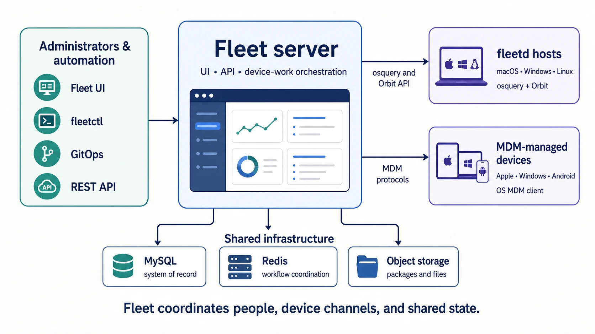
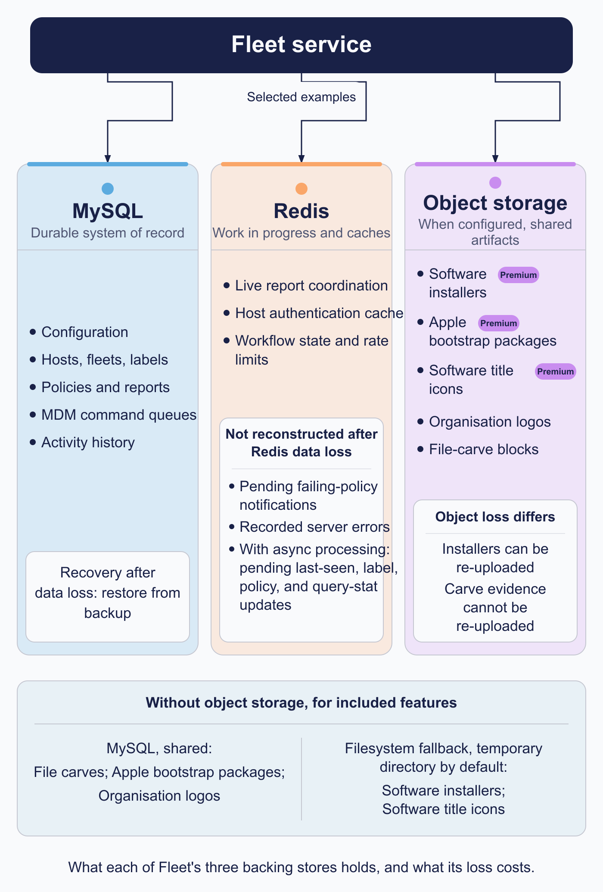

# The Fleet server

The Fleet server coordinates device management and keeps almost none of the results.

Everything durable lives in MySQL, Redis, or object storage. That makes a Fleet server process close to disposable. Stop one, start three more, replace all of them during an upgrade, and the deployment carries on, because none of them was holding anything the others needed.

Most of what follows is a consequence of that: how Fleet scales, what a restart costs, what a backup has to cover, and what counts as an outage.

<!-- IMAGE-OK: assets/1.6-fleet-server-architecture.webp
     NOTE: reviewed 2026-08-24 and kept. Solid navy server anchors it, and the three stores
     use the same colours as the state-model diagram in this chapter, so the two pictures
     agree. Prompt retained; do not delete.
     PROMPT: A landscape architecture diagram. A central panel "Fleet server", subtitled
     "UI, API, device-work orchestration". To its left, "Administrators and automation"
     listing Fleet UI, fleetctl, GitOps, REST API. To its right, two stacked boxes: "fleetd
     hosts (macOS, Windows, Linux)" connected through "osquery and Orbit API", and
     "MDM-managed devices (Apple, Windows, Android)" connected through "MDM protocols".
     Below the centre, three boxes: "MySQL, system of record", "Redis, workflow
     coordination", "Object storage, packages and files". Use the same three dot colours for the three
     stores as the state-model diagram in this chapter, so the two pictures agree: MySQL
     #5CABDF, Redis #FAA669, Object storage #C98DEF. Give the central Fleet server panel a
     solid #192147 fill with white text, so it anchors the composition.
     Caption: "Fleet coordinates people, device channels, and shared state."
     PALETTE. Two sets, doing different jobs.
     STRUCTURE, the Fleet Black ramp and neutrals: #192147 for the most important marks,
     #515774 for ordinary labels, #8B8FA2 and #C5C7D1 for secondary structure, #E2E4EA for
     grouping bands, #F9FAFC background, #D3E8F3 and #E8F1F6 for quiet fills. All text stays
     in this set; do not tint type.
     THE FLEET DOTS, the six accent colours taken from Fleet's own logo mark: #5CABDF sky
     blue, #3AEFC4 mint, #63C740 green, #C98DEF lavender, #FAA669 apricot, #D66C7B rose.
     Fleet Green #009A7D sits alongside them. These are soft and pastel, so they work as
     fills with #192147 text on top.
     STRENGTH. Use a dot colour at full strength only for small marks: an arrow, a chip, a
     single filled icon, a rule. Over any large area, use it at roughly a 20 to 25 percent
     tint, so a panel reads as tinted rather than painted. Five large panels at full
     saturation looks like a children's infographic, not a technical manual. And do not
     colour a panel that has no content in it; colour has to carry meaning, and an empty
     coloured box is just noise.
     HOW TO USE THE DOTS. One colour per category, used consistently within the image, to
     fill or stroke the things a reader genuinely has to tell apart. Take only as many as
     there are categories; do not spread all six across four items to look lively. If nothing
     in the picture needs distinguishing, use none of them and let the structure set carry it.
     GIVE IT WEIGHT. At least one element should be a solid filled shape rather than an
     outline, so the composition has an anchor. Vary stroke weight so the primary flow is
     visibly heavier than the scaffolding around it.
     Never invent a colour outside these two sets. Flat vector, generous whitespace, no
     gradients, no drop shadows, no 3D or photorealistic icons, no logo, no watermark.
     Legible at half page width.
     NOTE: "Fleet" here is a software product for managing computers. Never draw vehicles,
     cars, vans, trucks, ships or aircraft. Never use an em-dash in rendered text. -->

## Where the state actually lives

Three stores sit behind the Fleet server, and each one holds a different kind of thing for a different reason.

**MySQL is the system of record.** If it is written down and expected to survive, it is here: hosts, fleets, labels, policies, reports, the MDM command queues, activity history, and the configuration you set. When people talk about backing up Fleet, this is overwhelmingly what they mean.

**Redis holds work in progress.** Live report campaigns, the host authentication cache, rate limits, in-flight SSO state, and the cursors reconcilers use to track where they had reached. Losing any of it costs you a retry, not a fact. A live report running when Redis restarts is simply gone. Run it again.

**Object storage holds the large files.** Software installers, bootstrap packages, title icons, and file-carve blocks. Big, immutable, read by many instances at once, and no business occupying a database.

TLS protects communication with the service. Those three stores plus certificates are what a production deployment has to plan for, and Parts II and VII spend most of their time on them.

### The fourth store, which nobody configures

Each Fleet process keeps a small cache in front of MySQL for the few values read on nearly every request: the application configuration, a fleet's agent options and features. Expirations are short, about a second for configuration and a minute for the rest.

It is per process, and nothing invalidates it across instances. So if you change a fleet's agent options, a request landing on a different instance can still be answered from that instance's older copy for up to a minute.

That is behind most "I changed it and only some hosts got the new value" reports, the ones that resolve themselves before anyone finishes investigating. A configuration change that applies inconsistently and then settles within a minute is this, and nothing is broken.

### What happens if you configure no object storage

Configuring no bucket does not mean the features are off. Each one falls back somewhere, and the two fall back differently.

File carves go to MySQL. Carve blocks are written into the database, which works at small scale and grows the database fast.

Software installers go to local disk, in a temporary directory, and Fleet logs that this is not suitable for production. That log line is not boilerplate. See what breaks under multiple instances, below.

<!-- IMAGE-OK: assets/1.6-fleet-service-state-model.webp
     NOTE: reviewed 2026-08-24 and kept, and it is the strongest diagram in the manual.
     Tinted cards, per-item icons, the green bar marking MySQL as the store whose loss is
     unrecoverable, and the "loss costs" line beneath each. Prompt retained; do not delete.
     PROMPT: A rounded rectangle at the top labelled "Fleet service", above three equal
     connected cards. MySQL lists: Configuration, Hosts and fleets and labels, Policies and
     reports, MDM command queues, Activity history. Redis lists: Live report coordination,
     Host auth cache, Short-lived workflow state, Rate limits. Object storage lists: Software
     installers, Bootstrap packages, Title icons, File carve blocks. Beneath each card, one
     line of smaller text describing what its loss costs: "loss is unrecoverable" under
     MySQL, "loss costs a retry" under Redis, "loss costs a re-upload" under Object storage.
     Give the three cards three dot colours as fills, since they are three
     genuinely different kinds of store: MySQL #5CABDF, Redis #FAA669, Object storage #C98DEF,
     each with #192147 text on top. Then put a solid #009A7D bar across the top edge of the
     MySQL card alone, so that the one store whose loss is unrecoverable is marked out even
     though all three are coloured.
     Caption: "Each store holds the kind of state it is built for."
     PALETTE. Two sets, doing different jobs.
     STRUCTURE, the Fleet Black ramp and neutrals: #192147 for the most important marks,
     #515774 for ordinary labels, #8B8FA2 and #C5C7D1 for secondary structure, #E2E4EA for
     grouping bands, #F9FAFC background, #D3E8F3 and #E8F1F6 for quiet fills. All text stays
     in this set; do not tint type.
     THE FLEET DOTS, the six accent colours taken from Fleet's own logo mark: #5CABDF sky
     blue, #3AEFC4 mint, #63C740 green, #C98DEF lavender, #FAA669 apricot, #D66C7B rose.
     Fleet Green #009A7D sits alongside them. These are soft and pastel, so they work as
     fills with #192147 text on top.
     STRENGTH. Use a dot colour at full strength only for small marks: an arrow, a chip, a
     single filled icon, a rule. Over any large area, use it at roughly a 20 to 25 percent
     tint, so a panel reads as tinted rather than painted. Five large panels at full
     saturation looks like a children's infographic, not a technical manual. And do not
     colour a panel that has no content in it; colour has to carry meaning, and an empty
     coloured box is just noise.
     HOW TO USE THE DOTS. One colour per category, used consistently within the image, to
     fill or stroke the things a reader genuinely has to tell apart. Take only as many as
     there are categories; do not spread all six across four items to look lively. If nothing
     in the picture needs distinguishing, use none of them and let the structure set carry it.
     GIVE IT WEIGHT. At least one element should be a solid filled shape rather than an
     outline, so the composition has an anchor. Vary stroke weight so the primary flow is
     visibly heavier than the scaffolding around it.
     Never invent a colour outside these two sets. Flat vector, generous whitespace, no
     gradients, no drop shadows, no 3D or photorealistic icons, no logo, no watermark.
     Legible at half page width.
     NOTE: "Fleet" here is a software product for managing computers. Never draw vehicles,
     cars, vans, trucks, ships or aircraft. Never use an em-dash in rendered text. -->

## Why the state is split

One database could hold all of it. The split exists because the three kinds of state want incompatible things, and forcing them together makes each one worse.

Configuration and history need durability and consistency, and they are read far more than written. Live report coordination needs to be fast and is worthless sixty seconds later, so durability there buys nothing. Installers are large, immutable, and read by many readers at once, which is the workload a relational database handles least gracefully.

Give each one a store built for it and Fleet can run a live report against thousands of hosts while a package downloads and someone reads a year of activity history, without those three fighting each other.

### Recorded errors flush on read

Fleet records internal errors into Redis, deduplicated, retained about a day by default. Reading them clears them.

That is deliberate and it bounds memory. It also means the first person to look at the errors is usually the last, having destroyed the evidence they came for. Capture the output somewhere before you start interpreting it. Treat the first read as the only read.

## What the architecture rules out

Everything above is what the split buys. This is what it costs. These are constraints, not preferences, and two of them shape a deployment plan before anything else does.

### Fleet supports exactly one database writer

One writable primary, with read replicas. Multi-writer and group-replication setups are not supported, and that one sentence reaches further into a deployment plan than anything else in this chapter.

**No active-active across regions.** Fleet instances need a writer in the same datacentre. A second region can hold a warm standby for failover. It cannot serve writes at the same time.

Write capacity therefore scales vertically. More Fleet instances add API and check-in capacity, and they all point at the same writer, so when the writer saturates the answer is a bigger writer. Fleet's own reference sizings do exactly that, stepping one database instance class up as host counts grow.

Failover is a genuine interruption. Promoting a replica makes every Fleet instance reconnect. Hosts ride it out, because osquery buffers and retries. Live reports in flight do not.

Check your MySQL version against Fleet's, in both directions. Fleet requires a recent MySQL 8 and is tested against a specific set of releases, and at least one newer release has been incompatible. MariaDB and other variants are unsupported, and known problems with variants may not get fixed.

If your platform standard is a multi-writer cluster, settle that before you deploy rather than after.

### Read replicas help some deployments and not others

Once a replica is configured, reads go to it automatically. Nothing needs annotating per query, and the code paths that must read their own writes ask for the primary themselves.

The benefit is specific rather than general. Heavy API polling, automation, and reporting is the case that pays. A deployment whose load is mostly host check-ins mostly does not, because check-ins write.

The trap: **the replica configuration inherits nothing from the primary.** Address, credentials, TLS, and pool settings are all separate. A half-filled replica section, written by someone who assumed the rest carried over, fails in ways that look like a broken replica when the replica is fine.

### The pub/sub buffer is the scale limit that bites first

Redis enforces an output buffer limit per subscriber, and Fleet is a subscriber. Fill that buffer and **Redis drops the data. Nothing errors.**

What you see is a live report returning fewer hosts than you targeted, which reads as a host coverage problem. That mismatch is why this is the most misdiagnosed scale limit in a Fleet deployment. The fix is to lift the limit for pub/sub clients.

It is harder to find than it should be for two reasons. Managed Redis services often split the setting across several differently named parameters, so searching for the Redis name, finding nothing, and concluding it does not apply is an easy and wrong path. And the limit is about result volume, not host count. A fleet-wide report against a wide table is a completely different sizing exercise from a policy check against the same hosts.

### Redis standalone or cluster, and how Fleet decides

You do not tell Fleet which mode to use. It attempts cluster operation at startup and falls back to standalone if the server does not support it.

Cluster mode costs something. Multi-key operations have to land in one slot, fan-out operations visit every node, and subscriber counts have to be summed across nodes. Fleet handles all of it, and Fleet's own reference architectures still specify plain Redis for deployments well into six figures of hosts.

Reach for cluster mode when one node cannot hold your working set or serve your throughput. Not as a default posture.

### What is coordinated across instances, and what is not

Fleet instances are interchangeable and hold no durable local state. "Stateless" is doing a lot of work in that sentence, so here is what it actually covers.

**Scheduled jobs are coordinated, through MySQL.** Each named schedule takes a lock before running, so only one instance runs a given job in a given window. That lock lives in the database, not in Redis, so the bookkeeping survives a Redis flush.

Fleet also records which instance ran a job, alongside an identifier that appears in that process's logs. The pairing is how you get from "this job behaved oddly" to "these are that node's logs." The identifier is generated at process start, so it names a process, not a machine. One that shows up in the job record but in no current log belongs to a process that has since restarted.

**API and check-in traffic is not coordinated at all.** Any instance answers any request. That is the point, and it produces the failure mode that costs the most debugging time: a fault that lives on one node. One instance with a stale cache. One that cannot reach the object store. One with a broken path to Apple's push service. The symptom is intermittent, roughly proportional to that instance's share of traffic, and reproducible only by luck.

So when a Fleet problem is intermittent at a stable rate, ask which instance served it early, not late.

Node-local storage breaks the moment there is a second instance. The local-disk installer fallback writes to whichever instance handled the upload, so a later request served by a different one finds nothing. Under a container orchestrator, a restart loses it outright. That is what the "not suitable for production" log line is telling you.

### Losing Redis and losing MySQL fail very differently

You can usually tell which one from the symptom, which is faster than checking both.

**MySQL unavailable is a hard stop.** No fallback, no local copy of anything durable. Check-ins fail, because authenticating a host needs a row. The interface and API fail. The server does not exit, it just returns errors until the database comes back. New instances refuse to start at all, because the startup migration check cannot run.

**Redis unavailable degrades in parts**, and the parts are specific:

- **Live reports stop.** Campaigns cannot be created and results have nowhere to go. This is usually the first thing anyone notices.
- **Sign-ins in progress fail**, because that state is held for the duration of one attempt. A retry after Redis returns succeeds.
- **Error recording stops**, so the outage is invisible in the place you would look for it afterwards.
- **Host check-ins keep working and get more expensive.** The host authentication cache is a cache; a miss falls through to MySQL. Functionality is preserved while MySQL absorbs the traffic the cache was absorbing, so watch for MySQL saturating as a secondary effect.
- **Reconcilers may repeat work**, because their cursors live in Redis. Desired state is in MySQL, so this costs a repeated pass rather than correctness.
- **Scheduled jobs keep coordinating**, because that lock is in MySQL.

The overall health endpoint checks both, so it cannot tell you which one is down. It also accepts a parameter to check a single dependency, and that is the fastest way to answer "which store". Wire the two checks into monitoring separately instead of using the combined endpoint only as a load balancer probe.

## The two flows administrators operate

Everything Fleet does resolves into one of two flows, running in opposite directions.

**Desired state flows outward.** It starts with an intention: an administrator in the UI, a GitOps change, an API request, or a scheduled workflow. It ends with a policy, script, software item, profile, or command sitting ready for the hosts it was scoped to. Note where it ends. Desired state ends at *available to the device*, not at *applied on the device*. The gap between those two is where a great deal of troubleshooting lives.

**Observed state flows inward.** It starts at the device: a check-in, a report result, an MDM response, an agent report. It ends as updated host details, an activity record, a result status, report data, or a line in an external log.

The two never meet directly. Fleet writes what you want into MySQL and reads what is true out of device reports. Most of the interesting questions in this book live in the distance between them.

The Fleet service coordinates those flows; the device paths described in [1.2 How Fleet reaches a device](1.2-how-fleet-reaches-a-device.md) carry the work to and from hosts.

## What to plan for

When designing or operating a Fleet deployment, establish ownership for:

- Fleet server configuration, availability, and TLS certificates
- MySQL capacity, backups, and restoration
- Redis availability and monitoring
- Object-storage access, retention, and software/package delivery
- Logs, audit-event export, metrics, and tracing
- Release management for the Fleet service and fleetd

Parts II and VII expand these topics into deployment, day-two operations, and release-management guidance. This chapter provides the model needed to understand why those operational pieces fit together.

### Backing up three stores that cannot be captured together

Only two of the three need backing up, and they cannot be captured at a consistent point in time relative to each other.

**Back up MySQL.** It is the whole system of record. Take a backup before every upgrade, because Fleet has no down-migrations: rolling back a schema change means restoring.

**Back up the installer bucket, or accept re-uploading.** MySQL holds a software installer's metadata and the bucket holds its bytes. Restoring the database to an earlier point while the bucket moves on leaves rows pointing at objects that are not there. Neither store is wrong; they simply disagree, and the repair is re-uploading.

**Redis needs no backup**, which is the whole point of what it holds.

### Upgrades take the service offline, and the window scales with your data

The documented procedure is to stop every Fleet instance, back up the database, run the migration, then start the new version. Typical upgrades are minutes. Hosts buffer during the window and replay when the server returns, so the cost is a gap in freshness rather than lost data.

Treat the typical figure as a median rather than a bound. Migrations that touch large per-host tables scale with how much of that data you have, and at least one release has shipped a fix for a migration that took hours on deployments with a lot of it. Before a production upgrade, run the migration against a restored copy of your own database and time it. That is the only estimate that means anything.
