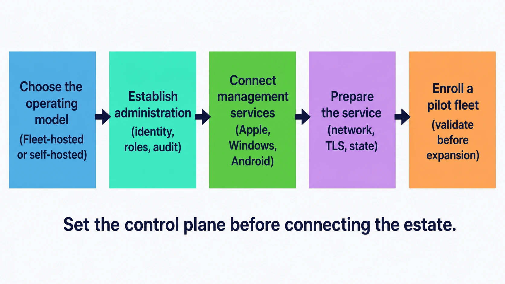

# Administration model and deployment choices

Fleet is a control plane for endpoint work. Before enrolling devices, decide who will run that control plane, who will administer it, and which platform-management connections it will own.

## Purpose and scope

This chapter covers the decisions made once, at the start, that shape everything after: where Fleet runs, who administers it, and how you prove the arrangement works before the estate depends on it.

It deliberately stops short of the mechanics. Connecting an identity provider is [2.2](2.2-identity-providers-sso-scim-and-role-sync.md). Setting up MDM is [2.6](2.6-mdm-architecture-and-foundations.md). Sizing and running the infrastructure yourself is [2.9](2.9-self-hosting-architecture-and-capacity.md). What you want from this chapter is the shape of the thing, and the order to do it in.

That order is the point. None of these decisions is difficult on its own. What makes them worth pausing over is that they are cheap to make now and awkward to unpick once a few thousand devices are enrolled and a support team has built habits around them.

<!-- IMAGE-OK: 2.1-setup-sequence.webp
     NOTE: reviewed 2026-08-24 and kept. Both fixes landed: the headings now wrap
     inside their panels with clear margin instead of overflowing into their neighbours, and
     the five stages carry the same dot tints in the same order as the lifecycle diagram in
     1.1, so the two read as siblings. Prompt retained for regeneration; do not delete.
     PROMPT: Fleet setup sequence
Landscape five-stage setup sequence: Choose the operating model (Fleet-hosted or self-hosted);
Establish administration (identity, roles, audit); Connect management services (Apple, Windows,
Android); Prepare the service (network, TLS, state); Enroll a pilot fleet (validate before
expansion). Caption: "Set the control plane before connecting the estate." Clean enterprise
flat-vector style; #192147 text, pale blue fills (#E8F1F6 or #D3E8F3) and a single Fleet Green (#009A7D) accent used sparingly, large legible labels,
no logo, watermark, or drop shadows.
     PALETTE. Two sets, doing different jobs.
     STRUCTURE, the Fleet Black ramp and neutrals: #192147 for the most important marks,
     #515774 for ordinary labels, #8B8FA2 and #C5C7D1 for secondary structure, #E2E4EA for
     grouping bands, #F9FAFC background, #D3E8F3 and #E8F1F6 for quiet fills. All text stays
     in this set; do not tint type.
     THE FLEET DOTS, the six accent colours taken from Fleet's own logo mark: #5CABDF sky
     blue, #3AEFC4 mint, #63C740 green, #C98DEF lavender, #FAA669 apricot, #D66C7B rose.
     Fleet Green #009A7D sits alongside them. These are soft and pastel, so they work as
     fills with #192147 text on top.
     STRENGTH. Use a dot colour at full strength only for small marks: an arrow, a chip, a
     single filled icon, a rule. Over any large area, use it at roughly a 20 to 25 percent
     tint, so a panel reads as tinted rather than painted. Five large panels at full
     saturation looks like a children's infographic, not a technical manual. And do not
     colour a panel that has no content in it; colour has to carry meaning, and an empty
     coloured box is just noise.
     HOW TO USE THE DOTS. One colour per category, used consistently within the image, to
     fill or stroke the things a reader genuinely has to tell apart. Take only as many as
     there are categories; do not spread all six across four items to look lively. If nothing
     in the picture needs distinguishing, use none of them and let the structure set carry it.
     GIVE IT WEIGHT. At least one element should be a solid filled shape rather than an
     outline, so the composition has an anchor. Vary stroke weight so the primary flow is
     visibly heavier than the scaffolding around it.
     Never invent a colour outside these two sets. Flat vector, generous whitespace, no
     gradients, no drop shadows, no 3D or photorealistic icons, no logo, no watermark.
     Legible at half page width.
     NOTE: "Fleet" here is a software product for managing computers. Never draw vehicles,
     cars, vans, trucks, ships or aircraft. Never use an em-dash in rendered text. -->

## Where Fleet runs

There are two ways to run Fleet, and for most organizations the choice is made for them.

**Fleet offers managed cloud hosting to Fleet Premium customers with large deployments.** Fleet runs the service and the infrastructure underneath it, and your team works on organization settings, identities, platform connections, and device operations. As of Fleet 4.90.1 the documented threshold for fully managed hosting is deployments **larger than 700 hosts**.

**Self-hosting is the path for everyone else, and it is a well-trodden one.** You run the Fleet server, MySQL, Redis, TLS, object storage where you use it, networking, backups, and monitoring. Fleet documents deployments on AWS with Terraform, Kubernetes, GCP, Render, and Docker Compose, and Fleet Premium is available self-hosted with support.

The distinction worth internalising is that **this is an operational choice, not a feature choice.** Premium capabilities are the same on both paths. What changes is who carries the pager for MySQL.

If you are self-hosting, [1.6 The Fleet server](../01-foundations/1.6-the-fleet-server.md) explains why the state is split across three stores, which is the model that makes the capacity and backup decisions in 2.9 make sense.

## Define the administration boundary

Fleet's access model gives you two levels to work with, and the useful discipline is to decide which decisions belong at each one before you create a single account.

A small **global administrator** group should own the settings that affect everyone: identity-provider configuration, fleet creation, MDM service connections, server settings, audit-log delivery, and access review. These are the settings where one change reaches every device, and they deserve a group small enough that its members can talk to each other.

**Fleet-level roles** then delegate the day-to-day work to the teams that own particular device populations. A computer lab, a business unit, or a regional support group can run their own devices without reaching anyone else's.

The reasoning behind that split, and the four decisions that combine on every request, are covered in [1.4 Identity and roles](../01-foundations/1.4-identity-and-roles.md). This chapter is about writing the answer down.

## Write down who owns what, before you configure anything

This sounds like bureaucracy and is not. Every one of these has a moment, usually at 2am, when someone needs to know the answer, and the cost of not having decided in advance is paid entirely at that moment.

| What | Needs a named owner because |
|---|---|
| Global settings | One change here reaches every enrolled device |
| Each initial fleet | Someone must decide what its devices get, and answer for it |
| The identity provider connection | Sign-in for every administrator depends on it |
| Each MDM platform connection | Certificates and tokens expire, and renewal is time-boxed |
| Service infrastructure | Applies when self-hosting: server, MySQL, Redis, storage |
| Backup and restore | Ownership without a tested restore is not ownership |
| Escalation | The path when the owner is unavailable |

MDM platform connections deserve particular attention, because several of them expire on a schedule set by Apple or Microsoft rather than by you. Renewal is a calendar item with a deadline, and an unowned calendar item is how a fleet stops receiving commands on a Tuesday. [2.6](2.6-mdm-architecture-and-foundations.md) covers what expires and when.

## Use a pilot as the first production test

Choose a pilot fleet with clear ownership and people who can tell you when something feels wrong from the end-user side. This is not a rehearsal. It is the first real deployment, run somewhere the consequences are small.

Before expanding, confirm the whole chain works there: sign-in through your identity provider, roles landing as intended, activity appearing in the audit record, MDM connected, devices enrolling, and at least one representative management action reaching a device and reporting back.

That last item is the one people skip, and it is the one that matters most. Enrollment proves a device can be reached. It does not prove that work sent to the device arrives, executes, and reports its result, which is a different chain with its own failure modes. Send a profile or run a script, and watch it complete.

## Verification and ownership

You are ready to expand when the pilot answers yes to all of these:

- An administrator signs in through the identity provider and lands with the role you expected, in the scope you expected.
- A person removed from the relevant group in your identity provider loses Fleet access.
- Every action taken during the pilot appears in the activity record with the right actor.
- Each MDM connection is live, and you know the date each one needs renewing.
- A representative management action reached a device and reported a result.
- Someone specific owns each row in the table above, and knows they own it.

Ongoing, the global administrator group owns the access review and the renewal calendar. Fleet owners own their own device populations. Whoever owns the infrastructure owns the restore test, which is worth running before you need it rather than during.

## Reference and troubleshooting

- Roles and what each one can do: [a.4 Roles and permissions matrix](../09-appendices/a.4-roles-and-permissions-matrix.md)
- Which interface can perform which action: [a.5 Interface index](../09-appendices/a.5-interface-index.md)
- When sign-in or permissions behave unexpectedly, the audit record is the first place to look: [8.12 Audit logs](../08-troubleshooting/8.12-audit-logs.md)

## Version notes

Verified against Fleet 4.90.1. The managed cloud hosting threshold of more than 700 hosts is Fleet's stated current capacity position rather than a product limit, so treat it as a figure to confirm rather than a constant.
