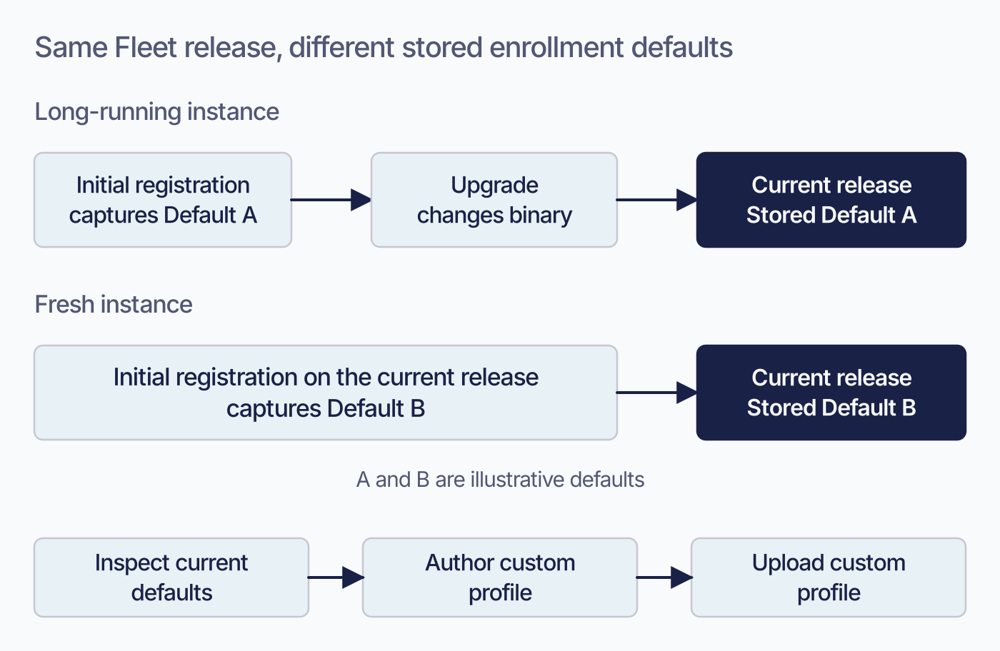

# Apple MDM configuration

Connecting Fleet to Apple means holding four separate credentials, each with its own expiry and its own failure mode. Three of them you renew by hand.

## Purpose and scope

 This chapter covers connecting Fleet to Apple's services: the push certificate, Apple Business, Volume Purchasing, and the certificates Fleet issues to hosts. It also covers the settings that decide where automatically enrolled devices land.

Getting individual devices enrolled is Part III. What MDM asks of your deployment generally is [2.9](2.9-mdm-architecture-and-foundations.md).

**A note on names.** Fleet now calls it **Apple Business**, abbreviated AB. Older material, including some of Fleet's own, calls the same thing Apple Business Manager or ABM. They are the same service.

## Four credentials, four different renewal stories

 These four fail differently, and only one of them looks after itself.

| Credential | Lifetime | Renewed by | What happens when it lapses |
|---|---|---|---|
| **APNs push certificate** | One year | You, annually, through Apple, **using the same Apple Account that created it** | Commands and profile changes sit in Pending. **Renewing the same certificate restores delivery**, even after it has lapsed, and enrolled devices are unaffected. Losing the Apple Account is the serious case: a new certificate breaks trust with every enrolled device and all of them must re-enroll |
| **Apple Business token** | Expires; Fleet warns from 30 days out | You | Automatic enrollment stops working |
| **Volume Purchasing token** | Expires; warns from 30 days out | You | App Store app delivery stops |
| **Host SCEP certificates** | One year | **Fleet, automatically, every 180 days** | On manually enrolled devices, MDM is turned off and the user must re-enroll |

Only the fourth renews itself. Fleet renews each host's certificate at 180 days, well ahead of the one-year expiry, so the mechanism is invisible until it fails.

**Apple Business and Volume Purchasing both require Fleet Premium.** The push certificate does not.

<!-- IMAGE-REDO: assets/2.10-apple-credentials.webp
     WHY: One shared timeline puts independent credential deadlines in an invented order and places the one-year label at the midpoint.
     PROMPT: Draw separate renewal tracks for four Apple credentials. Title: "Apple credential renewal".
     Use four horizontal rows, with the credential name and owner in a left gutter. Group the first
     two under "Certificate age" and the last two under "Time remaining until token expiry".
     Certificate track 1: "APNs push certificate", owner "Administrator". A labelled line starts at
     "Issued" and ends at "1 year: renew through Apple". Add "Use the same Apple Account" beside the end.
     Certificate track 2: "Host SCEP certificate", owner "Fleet". Use the same age scale as track 1,
     with "Issued" at zero, "Automatic renewal: 180 days" near halfway, and "Expiry: 1 year" at the end.
     The renewal mark is an action before expiry, not a claim that the original certificate remains in use.
     Token track 3: "Apple Business token", owner "Administrator". Show only the final interval from
     "Warning: 30 days remaining" to "Token expiry"; use an axis-break mark before the warning.
     Token track 4: "Volume Purchasing token", owner "Administrator". Use the same final-30-days scale.
     Do not draw an issuance date or imply a one-year lifetime for either token. Do not align their
     deadlines to the certificate-age axis or imply the four credentials were issued together.
     Use neutral tracks, an apricot warning mark, and a mint automatic-renewal mark, all text-labelled.
     Leave consequences of expiry in the chapter's existing table. No slogan or second comparison grid.
     TERMINOLOGY: Fleet is the company, product, or server. Host groups are lowercase
     fleet/fleets, including headings and labels. Do not call these groups teams. Preserve
     exact code/API identifiers. These instructions are not text to render.
     DESIGN: Flat vector technical diagram. Fleet is software for managing computers; draw no vehicles.
     Use Inter for labels and Roboto Mono for literal identifiers. On a 1400 px wide canvas use
     48 px titles, 36 px body labels, and at least 28 px secondary text; scale proportionally.
     Check the raster at 720 px wide and at its intended print size. Never shrink text to fit.
     Use a 32 px spacing grid, at least 24 px internal padding, and consistent corner radii.
     Left-align multiline explanations; center short node names. Keep a clear reading direction.
     Use #F9FAFC background, #192147 headings and primary connectors, #515774 body text,
     #8B8FA2 secondary connectors, #C5C7D1 borders, and #D3E8F3 or #E8F1F6 quiet fills.
     Use #5CABDF and #C98DEF only to distinguish named categories; #3AEFC4 for a labelled
     positive outcome, #D66C7B for a labelled failure, and #FAA669 for a labelled caution.
     Use accents at 20 to 25 percent tint for panels; full strength only for small marks.
     Keep text navy or slate, with off-white text on a navy anchor. Do not rely on color alone.
     Use one arrowhead shape and consistent stroke weights. Put connectors behind nodes,
     terminate at box edges, and keep labels clear of lines. Label branches and return paths.
     No gradients, shadows, decorative icons, logo, watermark, em-dashes, or slogan footer.
     Render only the specified reader-facing labels. Instructions and review notes stay out of the image.
     NOTE: Brief revised 2026-09-08 following visual review. Editorial draft grounded in the
     current chapter and its existing ledger; this edit is not a new release verification.
     Before rendering, check every arrow, timing, scope qualifier, and selected transition against
     the chapter. Resolve any conflict before accepting the artwork. Preserve the current asset
     until its replacement is reviewed. Update alt text to describe the replacement when installed.
     Retain editable SVG when available. Change to IMAGE-OK only after rendered-image review.
     CANDIDATE: ../../research/visual-reviews/part-2/assets/2.10-apple-credentials.webp
     Rendered and inspected for the overnight batch; awaiting final joint review.
-->

## Turning Apple MDM on

 The push certificate is the first connection and the one everything else depends on.

In Fleet, go to **Settings > Integrations > MDM** and select **Turn on** for Apple. Fleet gives you a certificate signing request to download. Take that to Apple's push certificate portal, sign in, choose **Create a Certificate**, upload the request, and download what Apple returns. Upload that `.pem` back into Fleet.

**Create the certificate under an account the organization controls.** Fleet's own recommendation is a shared Apple Developer account, so that renewal does not depend on one person still being available a year from now. The reason that matters is in the next section.

<!-- SCREENSHOT: Settings > Integrations > MDM, with Apple MDM showing as turned on and the
     Apple Business and Volume Purchasing sections visible beneath it. Crop to the panel.
     Highlight the renewal date if one is displayed, since that is the field this chapter
     keeps pointing at. Use a test instance; no real organization names or tokens. -->

## Renewing the push certificate without resetting the estate

 Renewal follows the same shape as setup, and there are two places it goes wrong. They do not cost the same thing: one is caught at upload, and the other costs **MDM turned off and back on for every Apple host**, by hand, by the person using each device. Expiry alone costs neither; a lapsed certificate stops delivery until it is renewed, and renewing the same certificate restores it with the estate untouched.

In Fleet, go to **Settings > Integrations > MDM**, select **Edit** next to Apple MDM, then **Renew certificate**, and download the new signing request. In Apple's portal, sign in and select **Renew** next to your existing certificate rather than creating a new one. Upload the request, download the certificate, and upload it to Fleet.

**Signing in with a different Apple ID.** Fleet is explicit that you must use the same Apple ID year over year. A renewal performed under a different account is a new certificate, not a renewal.

**Renewing the wrong certificate in the portal.** If your organization has more than one, check that the certificate's Common Name matches the one Fleet displays. This is the cheaper mistake: a certificate that does not match the key behind Fleet's signing request is refused at upload, so you find out immediately, at the cost of another trip through the portal.

The Apple ID mistake is the expensive one: the renewal appears to succeed, and the estate breaks afterwards. No confirmation step catches it.

### What an expired certificate looks like

 The signature is specific: **configuration profile changes and other MDM commands stay in Pending** rather than failing.

Pending is also what an offline device looks like. A whole estate in Pending at once, with **macOS** hosts still reporting inventory normally, is the certificate rather than the devices.

macOS inventory arrives through fleetd, which does not depend on the push certificate, so those hosts keep reporting while MDM is stuck. iOS and iPadOS have no agent and Fleet refetches their inventory using MDM commands, so when the certificate lapses they stop reporting too and look exactly like devices that have gone offline. Read the macOS hosts for the diagnosis.

## Connecting Apple Business

 Apple Business makes automatic enrollment possible for company-owned devices, and account-driven enrollment possible for personal ones.

From **Settings > Integrations > MDM**, select **Add AB** and download the public key Fleet generates. In Apple Business, go to **Devices > Management**, add a server, name it something you will recognise, and upload that key. Apple hands back a service token, which you upload into Fleet.

**Do not stop at the token.** Creating the server and uploading the token connects Fleet to Apple; it does not send Apple any devices. In the **Default Device Assignment** section of Apple Business, assign the new server as the default for your Macs, iPhones and iPads. Skip that and the connection tests clean, the token shows healthy, and no host ever appears. Devices listed in Apple Business and assigned to the server sync into Fleet and show an MDM status of Pending.

**The AB token expires too.** Fleet shows a warning banner from thirty days out and marks the token's renew date amber, then red once it has expired. Renewing means downloading a fresh token from the same Apple Business server and uploading it against the existing token through **Actions > Renew**, rather than adding a new one.

**One AB token and one VPP token is the normal case.** Fleet names four situations that need more: managed service providers, who are advised to keep one connection per client; enterprises that acquire other businesses and inherit their devices; umbrella organizations whose entities hold separate purchasing authority, such as a hospital or a university; and organizations operating across several countries.

If you are not one of those, more than one token is usually a sign that something was set up twice rather than a requirement.

## Where automatically enrolled hosts land

 A device that enrolls through Apple Business has to go somewhere, and that destination is a property of the AB token rather than a global setting.

You set a default fleet **per platform**, so macOS, iOS and iPadOS can each land somewhere different. It is configured from **Settings > Integrations > MDM**, under the token's **Actions** menu, via **Edit fleets**.

**If you set no default for a platform, hosts of that platform land in Unassigned.** That is a real scope with its own configuration rather than a holding pen, so decide what Unassigned carries before the first device arrives. [1.3](../01-foundations/1.3-hosts-fleets-labels.md) covers why.

A device can also be moved to a different fleet **before it enrolls**, which stages it into its final scope without it ever passing through the default.

## Releasing a device from Apple Business

 This is the one action in this chapter you cannot take back. **Release from Apple Business**, on a host's **Actions** menu, tells Apple to disown the device: it leaves your Apple Business organization entirely. It is Fleet Premium.

**Apple does not let you undo this, and neither does Fleet.** A released device cannot be added back to your organization automatically. Getting it back means going through Apple, by the purchase channel that put it there or by re-adding it by hand, which is why Fleet makes you tick a confirmation box naming the host before the button becomes usable. Treat it as the paperwork step when a device leaves the organization for good, not as a way to move a device between fleets or to clean up a host record.

**Apple Business has to permit it.** The setting is **Allow this service to release devices** on the Apple Business side. With it off, Apple rejects the request and Fleet reports that specific reason against the host rather than a generic failure.

**Six conditions decide whether the action appears at all**, and the interface hides it rather than explaining itself, so check them in order when it is missing:

| Condition | Why |
|---|---|
| Fleet Premium | The whole capability is Premium |
| Apple Business connected and configured | There is nothing to release the device from otherwise |
| An Apple host | macOS, iOS or iPadOS |
| Automatically enrolled, or still Pending | A manually enrolled Mac was never assigned in Apple Business |
| Assigned to this Fleet server in Apple Business | The assignment is what Fleet asks Apple to remove |
| Global administrator, or administrator of the host's fleet | Maintainers and observers do not get it. A host in Unassigned needs a **global** administrator, because there is no fleet to be an administrator of |

**What happens to the host record depends on whether the device ever enrolled:**

- **A host still showing Pending is deleted from Fleet.** It only existed because Apple Business said the device was coming; once it is not coming, the record has nothing behind it. Add the device back in Apple Business later and Fleet recreates it.
- **An enrolled host stays, and stays enrolled.** Releasing removes the Apple Business assignment, not MDM. The device keeps its profiles, its inventory and its history, and it will not automatically re-enroll after a wipe, because there is no longer an assignment to enroll it. Unenrolling is a separate action.

Fleet records the release as a `released_from_ab` activity carrying the host's serial and display name, and it appears on that host's own timeline as well as in the audit log ([8.12](../08-troubleshooting/8.12-audit-logs.md)). The API behind the action, `POST /api/v1/fleet/hosts/release_ab`, takes a list of host identifiers and answers per host, so an automated release reads each host's own result rather than one status for the batch.

## Requiring hardware-attested device identity

 Every enrolled Mac gets an identity certificate, and by default Fleet issues it over SCEP: a private key generated in software and signed against a challenge. **Require hardware attestation**, at **Settings > Organization settings > Advanced**, under **Host lifecycle**, asks Fleet to issue that certificate through ACME with Apple's Managed Device Attestation instead, binding the private key to the device's Secure Enclave rather than to a file on disk. It is Fleet Premium, off by default, and set through the checkbox, the REST API's `mdm.apple_require_hardware_attestation`, `fleetctl`, or GitOps's `controls.apple_require_hardware_attestation`.

**Three checks decide whether a given Mac gets it, evaluated fresh each time Fleet builds that Mac's identity certificate:**

- **Apple Silicon, macOS 14.0 or later.** Intel Macs and older macOS always fall back to SCEP. Apple's ACME attestation protocol also covers Apple Silicon iPhones and iPads, but Fleet does not extend the requirement to them yet.
- **The serial number is DEP-assigned to your Fleet server in Apple Business.** This is a check against the assignment record, not against which enrollment path the device took. A Mac that Apple Business has assigned to your server still clears this gate even if it enrolls through the ordinary manual link rather than Setup Assistant, because the same enrollment-profile endpoint serves both paths.
- **The device supplied a serial number at all.** Account-driven user enrollment carries no serial, so it always falls back to SCEP, silently.

Any device that fails one of these gets Fleet's ordinary SCEP certificate instead, with nothing shown in the console beyond an info-level log line naming the serial and the outcome. If you turned this on expecting attested Macs and are seeing SCEP identities, check Apple Silicon, macOS version, and the Apple Business assignment, in that order.

**Turning the setting on does not re-key devices already enrolled.** A Mac keeps the identity certificate it already has until Fleet renews it, which happens automatically every 180 days ([above](#four-credentials-four-different-renewal-stories)). So a Mac enrolled the day before you flip this on can carry a SCEP identity for up to six months, until Fleet requests an attested replacement at its next renewal. The same renewal cycle moves a Mac back to SCEP if you later turn the setting off. New enrollments pick up the current setting immediately; existing ones only catch up at their next scheduled renewal.

**Finding the certificate afterward takes an extra step, because a hardware-bound key is invisible to osquery.** An ordinary SCEP identity certificate is enumerable from disk; a Secure Enclave key is not, and Apple exposes it only through the MDM protocol. Fleet handles this by watching for the Mac to acknowledge installing the ACME enrollment profile and then queuing a `CertificateList` command to pull the resulting certificate into `host_certificates` (the same probe runs on removal, so a stale row clears too). Give that round trip a moment before concluding attestation failed, then look under **Hosts > *device* > Certificates**, or `GET /api/v1/fleet/hosts/{id}/certificates`.

## The default enrollment profile is stored once and never refreshed

 Nothing in the product will tell you about this one.

When Apple devices enroll automatically, Fleet sends Apple a profile controlling how Setup Assistant behaves: whether enrollment is mandatory, which panes are skipped, whether the MDM profile can be removed. If you have not uploaded a custom one, Fleet uses a built-in default.

**That default is stored once, at the moment your Fleet instance first registers for automatic enrollment, and is never refreshed.** Not by upgrading Fleet, not by adding or removing an Apple Business token, not by any other normal operation.

So a Fleet instance that has been running for two years is still sending the defaults it captured on day one, even if later Fleet releases shipped better ones. A freshly installed Fleet and a long-running one can behave differently here while reporting the same version.

**There is no reset-to-latest action.** Adopting newer defaults means reading what a current release uses, building a custom profile containing those values, and uploading it. At that point it is a custom profile and stays under your control.

You can see what your instance is currently using at **Controls > Setup experience > Setup Assistant**, where the default is available to download when no custom profile is uploaded.

<!-- IMAGE-TODO: assets/2.10-stored-enrollment-default.webp
     QUESTION: Why can two servers on the same release send different default enrollment profiles?
     PROMPT: DIAGRAM: Two parallel histories ending at the same Fleet release. Long-running
     instance: Initial registration captures Default A in storage, then an Upgrade arrow changes the
     binary while the stored Default A remains. Fresh instance: Initial registration on the newer
     release captures Default B. Label A and B Illustrative defaults, not real version numbers. A
     separate deliberate route reads Inspect current defaults, Author custom profile, Upload custom
     profile. No Upgrade arrow may replace the stored profile, and no Reset to latest button may
     appear.
     TERMINOLOGY: Fleet is the company, product, or server. Host groups are lowercase
     fleet/fleets, including headings and labels. Do not call these groups teams. Preserve
     exact code/API identifiers. These instructions are not text to render.
     DESIGN: Flat vector technical diagram. Fleet is software for managing computers; draw no
     vehicles. Use Inter labels and Roboto Mono identifiers. At 1400 px source width use 48 px
     titles, 36 px body labels, and at least 28 px secondary text; scale proportionally. Check at
     720 px reading width and intended print size. Use a 32 px spacing grid, at least 24 px node
     padding, and consistent corner radii. Center short node names; left-align multiline
     explanations. Never shrink text to fit. Use #F9FAFC background, #192147 headings and primary
     connectors, #515774 text, #8B8FA2 secondary connectors, #C5C7D1 borders, and #D3E8F3 or #E8F1F6
     quiet fills. Use #5CABDF and #C98DEF for named categories, #3AEFC4 for labelled positive
     outcomes, #D66C7B for labelled failures, and #FAA669 for labelled cautions. Tint large panels
     to 20 to 25 percent; full strength is for small marks. Keep text navy or slate, or off-white on
     a navy anchor. Never rely on colour alone. Use one arrowhead shape, consistent stroke weights,
     box-edge termination, and labelled branches and return paths. Keep connectors clear of text. No
     gradients, shadows, decorative icons, logo, watermark, em-dashes, or slogan footer. Render only
     the specified reader-facing labels. Choose orientation to fit the relationship, not a default
     poster. Keep captions outside the artwork. If labels crowd, split the figure before shrinking
     them. Keep editable SVG when the production method supports it.
     NOTE: Proposed 2026-09-08; editorial brief, not technical re-verification. Replace the
     same-version/different-defaults explanation with this persistence example. Retain the download
     location and the explicit absence of an automatic refresh or reset operation. Keep current
     prose and this TODO until the actual image is reviewed. Then check alt text against the artwork
     and retain an accessible summary plus all required technical qualifications.
     CANDIDATE: ../../research/visual-reviews/part-2/assets/2.10-stored-enrollment-default.webp
     Rendered and inspected for the overnight batch; awaiting final joint review.
-->

<!-- IMAGE PENDING. Install reviewed artwork, then activate the image line below.

-->

## Volume Purchasing

 Volume Purchasing allows App Store apps to be deployed to managed devices.

The token comes from Apple Business, under **Settings > Payments & Billing > Apps & Books**, and **each token corresponds to one organization unit** there. Upload it in Fleet under **Add VPP**, then assign it to whichever fleets should be able to use it.

Assign it deliberately: a token assigned everywhere makes every fleet's app catalogue identical, which is a problem when two parts of the organization have different purchasing.

Renewal is the same download-and-upload cycle, and Fleet shows token state in a **Renew date** column: yellow within thirty days of expiry, red once expired.

## Verification and ownership

 Confirm the connection on a real device rather than in the settings page. Enroll one, check inventory arrives, apply a profile, and run a low-risk command so you have seen the round trip complete.

Then record four things, because these credentials outlive the person who created them:

- **The account each Apple credential was created under**, and confirmation that it is organizational rather than personal.
- **Three renewal dates**: the push certificate, the AB token, and each VPP token. The push certificate deserves the most warning because a lapse stalls every Apple device's MDM work until it is renewed.
- **Who watches the Renew date column**, since that column and a matching app-wide banner are the only advance warning Fleet gives for these credentials, and nothing else in the estate gets either by default.
- **Which fleets each VPP token serves**, so that adding a fleet later does not silently leave it without an app catalogue.

## Edge cases and precedence

 **Re-enrolling an Apple Business host clears its old state automatically.** After a wipe or an OS reinstall, Fleet cancels pending commands, script runs and software installs, clears completed ones from the previous enrollment, and resets the host's labels. **You do not need to delete the host from Fleet first.**

**That clearing does not happen during an MDM migration.** A host moving to Fleet from another MDM keeps its labels and pending activity deliberately, so the transition is continuous.

**SCEP renewal failure removes MDM from manually enrolled devices.** Fleet renews these automatically at 180 days against a one-year expiry, so there is a wide margin. When renewal fails anyway, MDM is turned off on that host and the user has to re-enroll it. Nothing about this is visible until it happens.

**Releasing a device from Apple Business is not unenrolling it.** The two are separate actions with separate consequences: one removes the Apple Business assignment permanently and leaves MDM alone, the other removes MDM and leaves the assignment, so the device can enroll again. Doing the first to achieve the second cannot be reversed.

**Automatic enrollment defaults are per platform within each token.** Setting a default fleet for macOS does not set one for iOS or iPadOS, and the unset ones fall to Unassigned. If you hold more than one Apple Business token, each carries its own set of per-platform defaults, so adding a token adds a fresh set of unset ones.

## Reference and troubleshooting

 When Apple MDM misbehaves, [8.8](../08-troubleshooting/8.8-apple-mdm-diagnostics.md) covers the push path, the command queue and profile status, including how to tell a stuck queue from an unreachable device.

For which channel is failing before you assume it is MDM at all, [8.1](../08-troubleshooting/8.1-diagnostic-method.md).

Endpoint paths that must be publicly reachable are in [a.8](../09-appendices/a.8-api-action-and-endpoint-reference.md); [2.9](2.9-mdm-architecture-and-foundations.md) covers why the set grows as you enable features.

## Version notes

 Verified against Fleet 4.91.0. The annual push certificate cycle and the same-account requirement are Apple's constraints, so they outlast Fleet versions; the screens for managing them are Fleet's and move between releases.

Apple Business and Volume Purchasing are Fleet Premium capabilities at this release, as is releasing a device from Apple Business, added in 4.91. The stored-once behaviour of the default enrollment profile means an instance upgraded from an earlier release may not match a fresh install of the same version.
