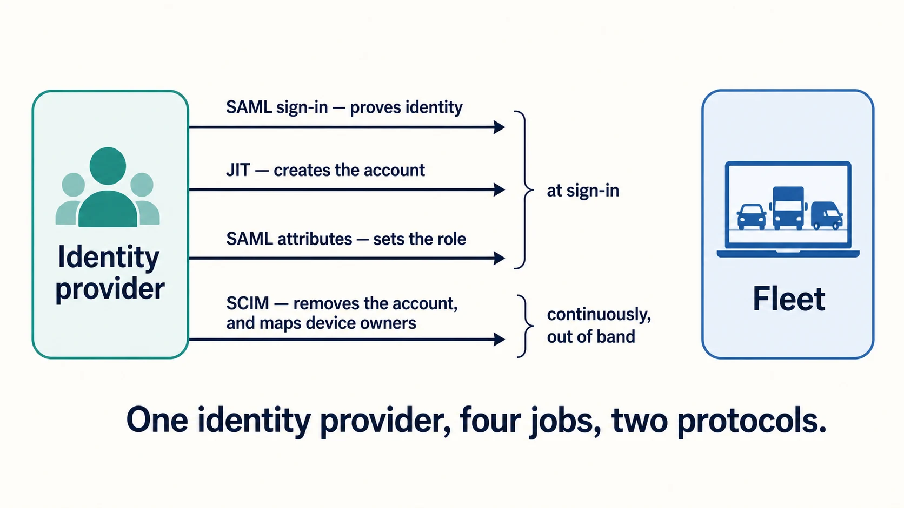

# Identity providers, SSO, SCIM, and role sync

Fleet can use your organization's identity provider for administrator sign-in, for creating and removing administrator accounts, for assigning their roles, and for learning who owns a given device. Those are four separate jobs. They are configured in nearby places, they use two protocols between them, and the quickest way to a confusing afternoon is to treat them as one feature.

## Purpose and scope

This chapter covers connecting Fleet to an identity provider and deciding how administrator accounts come into existence, receive permissions, and go away.

[1.4 Identity and roles](../01-foundations/1.4-identity-and-roles.md) explains the access model itself: what a role is, how scope works, and why automation gets its own identity. Read that first if the words "global observer" do not yet mean something specific to you. This chapter assumes the model and covers the wiring.

Managing individual accounts and API-only identities day to day is [2.3](2.3-user-accounts-roles-and-service-identities.md).

## Vocabulary

 Four terms that sound interchangeable and are not.

| Term | In this chapter it means |
|---|---|
| **SSO** | Authenticating an administrator against your identity provider, using SAML |
| **JIT provisioning** | Creating the Fleet account automatically the first time that person signs in |
| **Role sync** | Setting that account's role from attributes the identity provider sends in the sign-in response |
| **SCIM** | A separate protocol your identity provider uses to push user records to Fleet, for two distinct purposes described below |

The order matters and it is worth saying plainly. **Authentication proves who is signing in. Provisioning decides whether an account exists at all. Role assignment decides what that account may do.** A working sign-in that lands someone in the wrong role is three-quarters of the way there, and the remaining quarter is where the interesting problems live.

<!-- IMAGE-REDO: assets/2.2-identity-provider-jobs.webp
     WHY: the palette and subject-matter problems in the previous version are fixed, and the
     result now reads flat. Almost everything is one weight of navy line on near-white, the
     pale fills barely register at reading size, and nothing anchors the composition. This is
     a second pass for visual weight, not a correction: keep the structure and the labels,
     and rebuild it using the fuller tonal guidance below. Give the element the picture is
     most about a solid fill rather than an outline, vary the stroke weights, and use the
     mid greys and the stronger blue fill so the eye has somewhere to rest.
     PROMPT: A tall box on the left labelled "Identity provider" and a tall box on the right
     labelled "Fleet server". Both plain, no icons inside either one. Four horizontal arrows
     run left to right between them, stacked. Their labels, top to bottom: "SAML sign-in,
     proves identity", "JIT, creates the account", "SAML attributes, set the role", "SCIM,
     removes the account and maps device owners". A brace gathers the first three, labelled
     "at sign-in". A second brace on the fourth is labelled "continuously, out of band". Draw the fourth
     arrow in #009A7D at a heavier weight, because it is the only one not tied to a sign-in,
     and band the first three with an #E8F1F6 fill so the grouping is visible before the brace
     is read. Give the two end boxes a solid #192147 fill with white text.
     Caption: "One identity provider, four jobs, two protocols."
     PALETTE. Two sets, doing different jobs.
     STRUCTURE, the Fleet Black ramp and neutrals: #192147 for the most important marks,
     #515774 for ordinary labels, #8B8FA2 and #C5C7D1 for secondary structure, #E2E4EA for
     grouping bands, #F9FAFC background, #D3E8F3 and #E8F1F6 for quiet fills. All text stays
     in this set; do not tint type.
     THE FLEET DOTS, the six accent colours taken from Fleet's own logo mark: #5CABDF sky
     blue, #3AEFC4 mint, #63C740 green, #C98DEF lavender, #FAA669 apricot, #D66C7B rose.
     Fleet Green #009A7D sits alongside them. These are soft and pastel, so they work as
     fills with #192147 text on top.
     HOW TO USE THE DOTS. One colour per category, used consistently within the image, to
     fill or stroke the things a reader genuinely has to tell apart. Take only as many as
     there are categories; do not spread all six across four items to look lively. If nothing
     in the picture needs distinguishing, use none of them and let the structure set carry it.
     GIVE IT WEIGHT. At least one element should be a solid filled shape rather than an
     outline, so the composition has an anchor. Vary stroke weight so the primary flow is
     visibly heavier than the scaffolding around it.
     Never invent a colour outside these two sets. Flat vector, generous whitespace, no
     gradients, no drop shadows, no 3D or photorealistic icons, no logo, no watermark.
     Legible at half page width.
     NOTE: "Fleet" here is a software product for managing computers. Never draw vehicles,
     cars, vans, trucks, ships or aircraft. Never use an em-dash in rendered text. -->

## The one thing to get straight: SCIM does two jobs

 SCIM appears twice in Fleet, doing unrelated work for different people, over the same connection. Knowing which one you are configuring saves a great deal of confusion.

**Deprovisioning administrators.** With SCIM connected, when a person is deleted or deactivated in your identity provider, Fleet removes their Fleet account. This is the joiner-mover-leaver story for people who administer Fleet. It applies to SSO-authenticated users; API-only identities and password-authenticated accounts follow their own lifecycle and are unaffected.

**Mapping device owners.** Fleet also uses SCIM to learn an end user's IdP username, groups, and department, and to attach those facts to the hosts that person uses. Those become available as variables in configuration profiles and as criteria for labels. This one is about the humans holding the laptops, not the humans administering Fleet, and it is a Fleet Premium capability.

One connection, both jobs. If you configure SCIM for either reason you get the plumbing for both, so it is worth knowing the second exists before you find it by accident.

## Choose the lifecycle model

 Start by deciding how an administrator account should come into existence and how it should end, because everything else follows from that.

**SSO alone** authenticates people whose Fleet accounts you create by hand. This is a reasonable place to start. Sign-in is centralised, and account creation stays a deliberate act with a human in the loop.

**SSO plus JIT provisioning** creates the account on first successful sign-in. Nobody files a ticket to get access; being in the right group in your identity provider is the access. This requires Fleet Premium.

**Adding role sync** means the identity provider also decides what the new account may do, carried as attributes in the sign-in response. Fleet re-evaluates those attributes on **every** login, not only the first, so a group change in your identity provider becomes a role change in Fleet at the person's next sign-in.

**Adding SCIM** closes the loop at the other end, removing the Fleet account when the person is deactivated upstream.

The full arrangement is a genuine joiner-mover-leaver pipeline where Fleet holds no independent copy of who should have access. That is the destination most organizations want. Getting there in one step is not the way to arrive, and the section on verification below gives the order that works.

## Configure SSO

 Fleet supports the SAML standard, and documents Okta, authentik, Google Workspace, and Microsoft Entra ID specifically. Any SAML identity provider works. Both IdP-initiated and service-provider-initiated sign-in are supported, so users can start from your application portal or from Fleet's login page.

In Fleet, the settings live at **Settings > Integrations > Single sign-on (SSO)**. That page has two tabs, and the distinction matters: **Fleet users** configures administrator sign-in, which is what this chapter is about. **End users** configures identity-provider authentication during the device setup experience, which is a different feature covered in [5.5](../05-manage-devices/5.5-self-service-setup-experience-and-updates.md).

<!-- SCREENSHOT: Settings > Integrations > Single sign-on (SSO), Fleet users tab, filled in
     with example values: Identity provider name "Entra", Entity ID "fleet", a metadata URL.
     Crop to the settings panel. Highlight the two tabs, "Fleet users" and "End users", since
     that distinction is the point of the surrounding text. -->

Four fields do the work:

- **Identity provider name** is a human-readable label, and it is rendered on Fleet's login page. Users will read it, so name it after what they call the thing they sign in with.
- **Entity ID** is a URI identifying your Fleet instance to the identity provider. A short string such as `fleet` is fine. It must match what you configured on the other side exactly.
- **Metadata URL** is the usual way to connect, and lets Fleet fetch the identity provider's configuration.
- **Metadata** takes pasted XML instead, for identity providers that do not publish a URL.

On the identity provider side, Fleet's assertion consumer service URL is `https://<your_fleet_url>/api/v1/fleet/sso/callback`, and the Name ID format should be the user's email address.

That callback URL is worth reading twice, because the setup-experience feature uses a different one that differs by three characters: `https://<your_fleet_url>/api/v1/fleet/mdm/sso/callback`. Configuring one and testing the other is a well-worn path to a confusing afternoon.

**Keep a working way in while you do this.** Fleet supports email-based two-factor authentication specifically so that a break-glass account can sign in when the identity provider is unavailable, and Fleet's own recommendation is SSO for everyone else with two-factor enforced at the identity provider. Set that account up before you need it. One detail to know in advance: you cannot change the authentication method of the account you are currently signed in as, so a second administrator has to make that change from **Settings > Users**.

## Turn on JIT provisioning

 JIT provisioning is enabled by **Create user and sync permissions on login**, on the same SSO settings page. It requires Fleet Premium.

Once enabled, a successful first sign-in creates the account, copying the email address and full name from the sign-in response. **New accounts get the Global Observer role by default**, which is a sensible landing place: the person can see Fleet and can change nothing.

Fleet needs two things from the identity provider for this to work cleanly. The **email address must arrive as the Name ID**. The **full name must arrive as an attribute** named one of `name`, `displayname`, `cn`, `urn:oid:2.5.4.3`, or `http://schemas.xmlsoap.org/ws/2005/05/identity/claims/name`. If none of those is present Fleet falls back to the email address, so an estate full of accounts named after email addresses is the visible symptom of a name attribute that is not being sent.

## Assign roles from the identity provider

 Role sync builds on JIT provisioning and requires it to be enabled. Your identity provider sends custom SAML attributes in the sign-in response, and Fleet reads them:

- `FLEET_JIT_USER_ROLE_GLOBAL` sets an organization-wide role.
- `FLEET_JIT_USER_ROLE_FLEET_<FLEET_ID>` sets a role within one fleet, identified by its ID.

The accepted values are `admin`, `maintainer`, `observer`, `observer_plus`, `technician`, and `null`.

**A user is either global or fleet-scoped, never both.** Sending both a global attribute and a fleet attribute for the same person is rejected at login, which is Fleet holding the line on a model that would otherwise be ambiguous. Decide which kind of administrator each group represents, and send only that.

What Fleet does on each sign-in depends on whether the account already exists and whether role attributes arrived:

| | Role attributes present | No role attributes |
|---|---|---|
| **Account does not exist** | Account created with those roles | Account created as Global Observer |
| **Account already exists** | Roles updated to match | Roles left alone |

The bottom-right cell is the one to notice. **Absent attributes mean no change, not demotion.** Fleet will not strip someone's permissions because a sign-in response arrived without role information, which is the safe behaviour but does mean that removing a role requires either sending a different value or changing the account directly. Removing someone's access entirely is a deprovisioning question, and that is what SCIM is for.

A few smaller behaviours worth knowing before they surprise you. A value of `null` is ignored deliberately, so identity providers that insist on sending every configured attribute can send `null` rather than being unable to express "no opinion". Empty, whitespace-only, and omitted attribute values are treated the same way. And where an attribute carries multiple values, **Fleet uses the last one**.

## Connect SCIM

 SCIM is configured on your identity provider and points at Fleet, rather than the other way round. Fleet's SCIM base URL is `https://<your_fleet_server_url>/api/v1/fleet/scim`.

Authentication is by HTTP header, using the API token of a Fleet API-only user with admin permissions and access to the SCIM endpoints. Give that identity its own entry in the ownership register from [2.1](2.1-administration-model-and-deployment-choices.md), because it is a credential with real reach and no human attached to notice when it expires.

Set the unique identifier field for users to `userName`.

**Fleet accepts a specific, short list of attributes and rejects payloads containing others.** The required three are `userName`, `givenName`, and `familyName`. The optional one is `department`. Anything else causes Fleet to reject the payload, which matters because identity providers map a generous set of attributes by default. Trimming the attribute mapping down is a required step rather than tidying up.

<!-- SCREENSHOT: Settings > Integrations > Identity provider (IdP) in Fleet, showing a
     successfully received SCIM request from the identity provider. Crop to the status
     panel. This is the confirmation step readers need after configuring the IdP side. -->

Once connected, verify from Fleet's side at **Settings > Integrations > Identity provider (IdP)**, which shows whether Fleet has received requests from your identity provider.

Groups arrive through your identity provider's push-groups mechanism, and Fleet maps them to users. That group information is part of what makes the device-owner mapping useful.

One documentation inconsistency to be aware of, unresolved at Fleet 4.90.1: Fleet's SSO documentation lists `email` among the required attributes for deprovisioning, while the host-vitals guide lists only `userName`, `givenName`, and `familyName`. Both agree on those three. Map email as well, and you satisfy either reading.

## Where device-owner information comes from

 If you connected SCIM for the second purpose, Fleet collects a host's IdP identity when the end user authenticates during enrollment. That covers automatic enrollment for Apple and Windows devices, and manual enrollment for Apple, Android, Windows, and Linux.

You can also set a host's IdP username by hand on the Host details page, and Fleet maps the remaining vitals from it. That is the practical repair when a device was enrolled before SCIM was connected.

## Verification and ownership

 Change one thing at a time and confirm it before the next. The order below is the one that keeps you able to sign in.

1. **SSO with a test account**, while normal sign-in still works and a break-glass account exists. Confirm the display name, email, role, fleet scope, and that the sign-in appears in the activity record.
2. **JIT provisioning**, with a person who has no Fleet account. Confirm the account appears with the right name and lands as Global Observer.
3. **Role sync**, with a test account in one group. Confirm the role arrives, then change the group membership and confirm the role changes at the next sign-in.
4. **SCIM**, and confirm Fleet reports receiving requests. Then deactivate a test user upstream and confirm their Fleet account is removed.

Every one of those steps leaves a trace in Fleet's activity record, which is the fastest way to see what actually happened rather than what you expected. See [1.5 Audit and activity](../01-foundations/1.5-audit-and-activity.md).

Ongoing, this belongs to the global administrator group. Two things need a review cycle: **which identity-provider groups map to Fleet roles**, reviewed whenever group ownership changes, and **the API token behind the SCIM connection**, which needs an owner and a rotation schedule.

## Reference and troubleshooting

- Every role and what it can do: [a.4 Roles and permissions matrix](../09-appendices/a.4-roles-and-permissions-matrix.md)
- SCIM and SSO endpoints: [a.8 API action and endpoint reference](../09-appendices/a.8-api-action-and-endpoint-reference.md)
- When a sign-in, role assignment, or deprovisioning does not do what you expected, the activity record shows what Fleet received and acted on: [8.12 Audit logs](../08-troubleshooting/8.12-audit-logs.md)

## Version notes

 Verified against Fleet 4.90.1. JIT provisioning and the IdP host-vitals mapping are Fleet Premium capabilities. The `technician` role is available as a role-sync value at this release.
