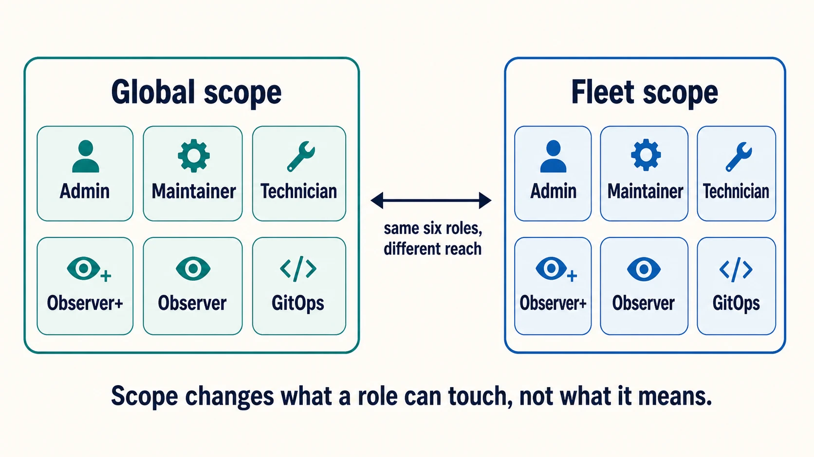

# User accounts, roles, and service identities

Fleet access becomes easier to operate when every person and every automated workflow has a distinct identity, an appropriate role, and the narrowest useful scope.

## Purpose and scope

This chapter covers the accounts themselves: which role to give a person, how scope changes what that role reaches, how to create identities for automation, and how to review the whole arrangement periodically.

[1.4 Identity and roles](../01-foundations/1.4-identity-and-roles.md) explains why the model is shaped this way. [2.2](2.2-identity-providers-sso-scim-and-role-sync.md) covers connecting an identity provider so accounts are created and removed for you. The exhaustive action-by-action breakdown belongs in [a.4 Roles and permissions matrix](../09-appendices/a.4-roles-and-permissions-matrix.md), **which is not written yet**. This chapter is therefore not a summary of a fuller account; it is the account, and it gives you enough to choose correctly.

## The six roles

 Fleet has six roles. Three are available at every tier, and three require Fleet Premium.

1. **Admin** receives all permissions. Keep this group small, and keep it staffed by people who talk to each other.
2. **Maintainer** manages most of what Fleet contains: reports, policies, labels, software, profiles. What a maintainer cannot do is change the shape of Fleet itself, meaning application configuration, fleets, and users. This is the right role for someone who runs endpoint work day to day without administering the service.
3. **Observer** is read-only, and can run reports that have been marked "observer can run".
4. **Observer+** is Observer with the ability to run any report. Premium.
5. **Technician** is defined by what it can change: run scripts, view their results, and install or uninstall software. Its read access is much wider than that summary suggests, and includes recovery secrets. See the warning below before granting it. Premium.
6. **GitOps** is API-only and write-only, intended for CI/CD pipelines. Premium.

A GitOps identity can apply configuration but cannot read most of what it just applied. This is intentional: a pipeline credential that leaks should not become a way to enumerate your estate. It does mean that if you are trying to use a GitOps token to check current state, the empty response you get back is the design working rather than a broken token.

<!-- IMAGE-OK: 2.3-roles-and-reach.webp
     NOTE: reviewed 2026-08-24 and kept. Two panels of equal weight, the same six roles in
     each, "reaches every fleet" against "reaches one fleet", and every chip the same fill.
     The nesting that muddled the point is gone. Prompt retained; do not delete.
     PROMPT: DIAGRAM: Scope diagram, roles against reach. Two nested rounded rectangles. Outer
     labelled "Global scope", inner labelled "Fleet scope". Six role chips listed inside
     each: Admin, Maintainer, Technician, Observer+, Observer, GitOps. An arrow between them
     labelled "same six roles, different reach". Below, a small caption: "Scope changes what
     a role can touch, not what it means." Flat vector, generous whitespace.
     PALETTE. Two sets, doing different jobs.
     STRUCTURE, the Fleet Black ramp and neutrals: #192147 for the most important marks,
     #515774 for ordinary labels, #8B8FA2 and #C5C7D1 for secondary structure, #E2E4EA for
     grouping bands, #F9FAFC background, #D3E8F3 and #E8F1F6 for quiet fills. All text stays
     in this set; do not tint type.
     THE FLEET DOTS, the six accent colours taken from Fleet's own logo mark: #5CABDF sky
     blue, #3AEFC4 mint, #63C740 green, #C98DEF lavender, #FAA669 apricot, #D66C7B rose.
     Fleet Green #009A7D sits alongside them. These are soft and pastel, so they work as
     fills with #192147 text on top.
     STRENGTH. Use a dot colour at full strength only for small marks: an arrow, a chip, a
     single filled icon, a rule. Over any large area, use it at roughly a 20 to 25 percent
     tint, so a panel reads as tinted rather than painted. Five large panels at full
     saturation looks like a children's infographic, not a technical manual. And do not
     colour a panel that has no content in it; colour has to carry meaning, and an empty
     coloured box is just noise.
     HOW TO USE THE DOTS. One colour per category, used consistently within the image, to
     fill or stroke the things a reader genuinely has to tell apart. Take only as many as
     there are categories; do not spread all six across four items to look lively. If nothing
     in the picture needs distinguishing, use none of them and let the structure set carry it.
     GIVE IT WEIGHT. At least one element should be a solid filled shape rather than an
     outline, so the composition has an anchor. Vary stroke weight so the primary flow is
     visibly heavier than the scaffolding around it.
     Never invent a colour outside these two sets. Flat vector, generous whitespace, no
     gradients, no drop shadows, no 3D or photorealistic icons, no logo, no watermark.
     Legible at half page width.
     NOTE: "Fleet" here is a software product for managing computers. Never draw vehicles,
     cars, vans, trucks, ships or aircraft. Never use an em-dash in rendered text. -->


## How scope changes what a role reaches

 The same six roles exist at global scope and at fleet scope. A global maintainer and a fleet maintainer have the same kind of authority; they differ in how far it extends. One person can hold different roles in different fleets when their responsibilities genuinely differ.

Start from the outcome someone is accountable for rather than from the list of roles. A lab operator who is responsible for the computer lab needs a fleet role on that fleet. A central endpoint engineer responsible for organization-wide configuration needs global access. The role follows the accountability.

**A fleet-scoped user sees results from global reports only for the hosts in fleets they can reach.** The report is shared; the results are filtered to their scope. That is the model working as intended.

### Two roles can read recovery secrets

**Observer can view the disk encryption key and the macOS Recovery Lock password.** So can Technician. Neither role name suggests it, and read-only does not mean harmless.

Technician is the one most likely to catch you out, because its short description is about changing things. Within its scope it can also view all hosts, all software, all activity, all policies, all reports and their results, saved scripts, the results of MDM commands, and **disk encryption keys for macOS, Windows and Linux hosts** along with the Recovery Lock password. It can run any report as a live report against all hosts, and run all policies.

Decide who may read recovery credentials as a separate question from which role someone needs, and do not use the role name as the security classification. The per-action detail belongs in [a.4](../09-appendices/a.4-roles-and-permissions-matrix.md), which is not written yet.

These summaries describe each role's primary purpose and are not exhaustive.

## Give automation its own identities

 Create an API-only user for each automated workflow: GitOps, CI, reporting, ticketing, integrations. A person's token in shared automation ties the workflow to that person's employment and makes the activity record misleading about who did what.

Separate identities per workflow, rather than one shared automation account. When a GitOps identity and a ticketing integration share a token, neither can be rotated or revoked without considering the other, and the activity record cannot tell them apart.

From the UI, create one at **Settings > Users > Create user** and select the **API-only** option. From the command line:

```sh
fleetctl user create \
  --name 'Production GitOps' \
  --api-only \
  --global-role gitops
```

**Always state the role.** Omit `--global-role` and omit a fleet, and Fleet does not fail: it creates the identity as a **global observer**. Given what the previous section says an observer can read, an automation account created that way is both wrong for its job and more privileged than intended.

`--email` and `--password` are optional. Leave them out and Fleet derives an email from the creating administrator's address, and the identity authenticates by token alone.

With Fleet Premium, `--fleet <fleet_id>:<role>` scopes the identity to a single fleet, which is worth doing whenever the automation only needs one.

**Capture the token when it is displayed.** An API-only identity created without a password cannot sign in to mint another, so a lost token is genuinely awkward. It is not unrecoverable: an administrator with the authority to modify users can set a password on the identity, which destroys its existing sessions, and then sign in as it to mint a new token. That is a rotation procedure rather than a lookup, and it invalidates whatever the old token was still doing. Have somewhere to put the token before you run the command and you will not need it.

**API-only tokens do not expire.** A regular user's token expires on the ordinary session schedule, and Fleet's own guidance recommends API-only users for automation for exactly that reason. The trade is that nothing forces rotation, so the rotation schedule has to come from you and belongs beside the identity's owner in the record from [2.1](2.1-administration-model-and-deployment-choices.md).

### Endpoint restrictions narrow, and only narrow

An API-only user can optionally be restricted to a named list of API endpoints. This is a useful way to give an integration exactly the surface it needs.

The important property is that restriction and role combine by intersection. Granting an identity access to an endpoint does not give it permission it would not otherwise have. A fleet-scoped admin granted access to the configuration-update endpoint still receives a `403` from it, because that endpoint requires a global admin. An endpoint list is therefore safe to use as a defence in depth and unsafe to rely on as a way of granting anything.

**Treat it as defence in depth rather than as a boundary in its own right.** The list narrows what a role already permits, and an empty list narrows nothing at all. Role and scope remain the security boundary; the endpoint list is a second layer over it, and at 4.90.1 that second layer is not attached to quite every route group Fleet catalogues.

## Verification and ownership

 After creating or changing an identity, confirm three things: that it can do what it is meant to do, that it cannot do what it is not, and that its activity is attributable to a name you will recognise in six months.

Give every service identity an owner, a documented purpose, the narrowest useful scope, a rotation process, and a name that makes its entries in the activity record obvious. An entry attributed to "API User" tells a future investigator nothing.

Review on a defined cycle, and again whenever ownership changes:

- Global roles, which is the shortest and most consequential list.
- Fleet role assignments, compared against the current fleet model. A team that no longer owns a device population should no longer hold a role on it.
- API-only users and their tokens, including whether each still has an owner who knows they own it.
- Anyone holding Observer at fleet scope, given what that role can read.

## Edge cases and precedence

 **Fleet will not let you remove the last global admin.** Attempting to demote the final one fails with `cannot demote the last global admin`, and attempting to delete them fails the same way. The check is atomic, so two administrators demoting each other at the same moment cannot both succeed and leave the deployment with nobody in charge.

That guard is worth knowing before you need it, because the failure it prevents is unrecoverable through the interface: a Fleet with no global admin has nobody who can create one.

It also means the order of operations matters when handing over. Promote the incoming administrator first, then demote the outgoing one. Doing it the other way round is refused, which is inconvenient rather than dangerous, but it surprises people mid-handover.

**An API-only identity can hold the global admin role**, and it counts toward that check. That is a trap worth naming: the check will happily be satisfied by a token nobody can sign in as. Since these tokens never expire, the failure is not a lapse but a loss, and losing the secret leaves a deployment whose only global admin cannot be reached and cannot be replaced through the interface. Keep at least one human in the role.


## Reference and troubleshooting


- The full action-by-action breakdown for all six roles at both scopes: [a.4 Roles and permissions matrix](../09-appendices/a.4-roles-and-permissions-matrix.md), **not written yet**
- User and token commands: [a.7 fleetctl command reference](../09-appendices/a.7-fleetctl-command-reference.md)
- Endpoints and the permissions each one requires: [a.8 API action and endpoint reference](../09-appendices/a.8-api-action-and-endpoint-reference.md)
- When someone can or cannot do something and you need to know why, the activity record shows what Fleet received and how it was attributed: [8.12 Audit logs](../08-troubleshooting/8.12-audit-logs.md)

## Version notes

 Verified against Fleet 4.90.1. Technician, Observer+, and GitOps require Fleet Premium. Fleet 4.82.0 renamed teams to fleets and queries to reports across the UI, API, CLI, and GitOps, so role documentation from before that release uses the older words for the same things.
