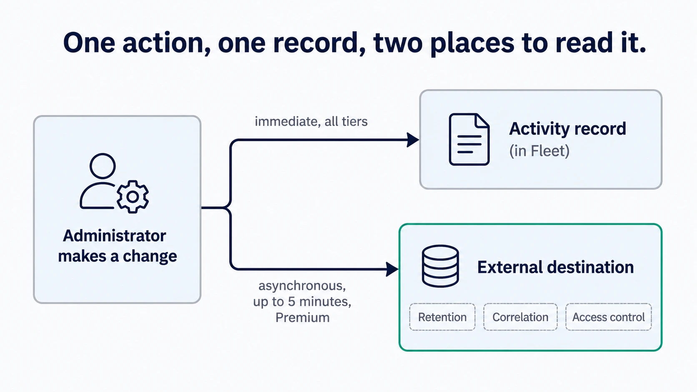

# Activity, audit logs, and log delivery

Fleet keeps a record of what administrators did. This chapter covers getting that record out of Fleet and into wherever your organization keeps such things.

## Purpose and scope

[1.5 Audit and activity](../01-foundations/1.5-audit-and-activity.md) explains the model: Fleet keeps an administrative record of what was requested and a device record of what was reported, and reading them together is what turns an endpoint action into an accountable story. This chapter assumes that and covers the delivery decision, the configuration, and how to confirm it works.

[8.2](../08-troubleshooting/8.2-log-surfaces.md) inventories every log surface Fleet has, and [8.12](../08-troubleshooting/8.12-audit-logs.md) covers diagnosis when a record is missing or puzzling. This chapter is what those two point back at.

## What is available to whom

One distinction to settle before anything else, because getting it backwards leads people to conclusions they should not draw.

**The activity record itself is available on every Fleet deployment.** Free and Premium alike, readable in the UI and through the Activities API. Every Fleet deployment can answer who changed what and when.

**Streaming that record to an external destination is a Fleet Premium capability.** What Premium adds is delivery, not the record.

So "audit logs require Premium" is the wrong summary. If you are running Fleet Free you have the history; what you do not have is automatic shipping of it to a SIEM.

## Decide what you need before choosing a destination

Most organizations reach for external delivery for one of three reasons, and they lead to different answers.

**Retention** is the simplest: Fleet's own activity history is subject to the expiry settings covered in [2.4](2.4-organization-and-server-settings.md), and a compliance obligation may require keeping records longer than you want to keep them in Fleet's database. Delivery to durable storage solves that cleanly.

**Correlation** is the more interesting case. A Fleet activity record becomes considerably more useful next to identity events and infrastructure changes from the same ten minutes. This is the reason to send events to the same place as everything else rather than to a dedicated bucket.

**Access control** is the one people forget. Reading Fleet's activity in Fleet requires a Fleet account. If your security team needs to investigate without being granted Fleet access, delivering events to a system they already have is the answer.

Decide which of these you are solving for, because it determines who should own the destination, who reads it, and how long it is kept. Settle those three before enabling anything.

<!-- IMAGE-REDO: 2.5-activity-audit-lifecycle.webp
     WHY: not individually reviewed in this round, so this note is not a critique of
     what is currently there. It is marked for a pass because it predates the fuller palette
     guidance below, and its siblings all came back correct but flat. Look at it first and
     skip the redo if it already reads well.
     PROMPT: DIAGRAM: Lifecycle diagram, one administrative action to two records. Left: an
     "Administrator makes a change" box. Two arrows right. Top arrow to "Activity record (in
     Fleet)", labelled "immediate, all tiers". Bottom arrow to "External destination",
     labelled "asynchronous, up to 5 minutes, Premium". Below the external destination, three
     small chips: "Retention", "Correlation", "Access control". Caption: "One action, one
     record, two places to read it." Flat vector, generous whitespace.
     PALETTE. Two sets, doing different jobs.
     STRUCTURE, the Fleet Black ramp and neutrals: #192147 for the most important marks,
     #515774 for ordinary labels, #8B8FA2 and #C5C7D1 for secondary structure, #E2E4EA for
     grouping bands, #F9FAFC background, #D3E8F3 and #E8F1F6 for quiet fills. All text stays
     in this set; do not tint type.
     THE FLEET DOTS, the six accent colours taken from Fleet's own logo mark: #5CABDF sky
     blue, #3AEFC4 mint, #63C740 green, #C98DEF lavender, #FAA669 apricot, #D66C7B rose.
     Fleet Green #009A7D sits alongside them. These are soft and pastel, so they work as
     fills with #192147 text on top.
     HOW TO USE THE DOTS. One colour per category, used consistently within the image, to
     fill or stroke the things a reader genuinely has to tell apart. Take only as many as
     there are categories; do not spread all six across four items to look lively. If nothing
     in the picture needs distinguishing, use none of them and let the structure set carry it.
     GIVE IT WEIGHT. At least one element should be a solid filled shape rather than an
     outline, so the composition has an anchor. Vary stroke weight so the primary flow is
     visibly heavier than the scaffolding around it.
     Never invent a colour outside these two sets. Flat vector, generous whitespace, no
     gradients, no drop shadows, no 3D or photorealistic icons, no logo, no watermark.
     Legible at half page width.
     NOTE: "Fleet" here is a software product for managing computers. Never draw vehicles,
     cars, vans, trucks, ships or aircraft. Never use an em-dash in rendered text. -->


## Turn on delivery

Two server settings control this, and the second only matters once the first is on.

`activity_enable_audit_log` turns delivery on. It defaults to off. As an environment variable it is `FLEET_ACTIVITY_ENABLE_AUDIT_LOG`.

`activity_audit_log_plugin` chooses where events go. It defaults to `filesystem`. As an environment variable it is `FLEET_ACTIVITY_AUDIT_LOG_PLUGIN`.

In config-file form:

```yaml
activity:
  enable_audit_log: true
  audit_log_plugin: firehose
```

The available plugins at Fleet 4.90.1 are `filesystem`, `firehose`, `kinesis`, `lambda`, `pubsub`, `kafkarest`, `nats`, `splunk`, and `stdout`. Each has its own configuration except `stdout`, which needs none. Choose based on what your organization already operates rather than on what looks tidiest; the destination someone already monitors beats the destination that is technically neater.

Because these are server settings, changing them is an infrastructure change and follows the ownership split described in [2.4](2.4-organization-and-server-settings.md).

### Change the filesystem destination if you use it

The defaults compose in a way that is worth knowing. Enable audit logging without choosing a plugin and you get `filesystem`, whose default path is `/tmp/audit`.

That path has two properties that make it a poor permanent home: `/tmp` is cleared by the operating system, and it is local to a single Fleet instance, so a deployment running several instances writes several partial logs. Fine for confirming events are being produced, and worth replacing with either a real path your log forwarder watches or a plugin that ships events directly.

## Verification and ownership

Make a low-risk, clearly identifiable change: rename a test label, or create and delete a placeholder. Something you can search for unambiguously.

**Then wait.** Audit events are written asynchronously, and Fleet documents a delay of up to five minutes before an event is logged. Checking the destination immediately and finding nothing is the expected result, not a failure, and this is the single most common reason someone concludes delivery is broken when it is working.

Once the event arrives, confirm four things about it rather than just its presence:

- The **actor** is the identity you expect, and is recognisable. This is where a well-named service identity from [2.3](2.3-user-accounts-roles-and-service-identities.md) pays off.
- The **scope** is right, so you can tell which fleet an action affected.
- The **timestamp** makes sense next to your other systems, which is what makes correlation work.
- The people who will use this during an investigation **can find it**, using the tools they would actually reach for at the time. An event that arrives in a store nobody can query is not evidence.

That last check is the one worth doing with the person who would run the investigation, not on their behalf.

Ongoing, three things need an owner: the destination itself, the retention period configured there, and monitoring that events are still arriving. A delivery pipeline that quietly stops looks exactly like a period of no administrative activity, which is why the monitoring matters more here than for most integrations.

## Reference and troubleshooting

- Every log surface Fleet has, and how to turn up verbosity: [8.2 The log surfaces](../08-troubleshooting/8.2-log-surfaces.md)
- Diagnosis when an expected record is missing, or an event is puzzling: [8.12 Audit logs](../08-troubleshooting/8.12-audit-logs.md)
- Server-side configuration keys and their defaults: [a.3 Configuration model and precedence](../09-appendices/a.3-configuration-model-and-precedence.md)
- Reading the activity record through the API: [a.8 API action and endpoint reference](../09-appendices/a.8-api-action-and-endpoint-reference.md)

## Version notes

Verified against Fleet 4.90.1. External audit-log delivery is a Fleet Premium capability; the activity record and the Activities API are available at every tier. The documented delay before an event is written is up to five minutes.
