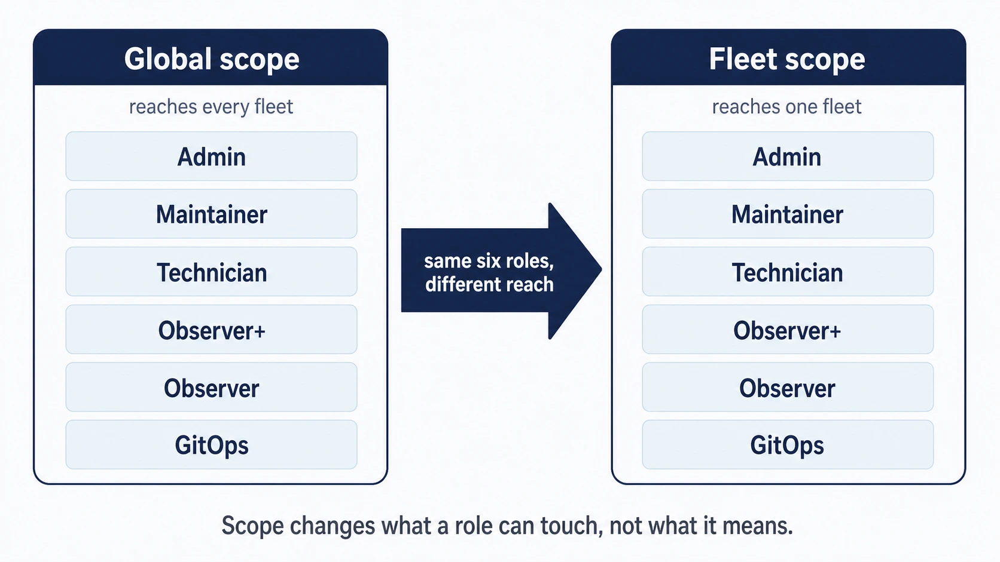

# User accounts, roles, and service identities

 Fleet’s roles let you share endpoint work across central administrators, local support staff, and automated workflows. Giving each person or workflow its own identity makes those responsibilities easier to delegate, review, and trace in the activity record. Start with the work it needs to do, then choose the role and device scope that support it.

## Purpose and scope

This chapter covers the accounts themselves: which role to give a person, how scope changes what that role reaches, how to create identities for automation, and how to review the whole arrangement periodically.

[1.4 Identity and roles](../01-foundations/1.4-identity-and-roles.md) introduces the access model. [2.5](2.5-identity-providers-sso-scim-and-role-sync.md) connects it to an identity provider for account creation, role synchronization, and removal. Use the guidance here to choose accounts and roles, then consult [a.4 Roles and permissions matrix](../09-appendices/a.4-roles-and-permissions-matrix.md) for individual actions.

## The six roles

 Fleet has six roles. Three are available at every tier, and three require Fleet Premium.

1. **Admin** receives all permissions. Keep this group small, and keep it staffed by people who talk to each other.
2. **Maintainer** manages most of what Fleet contains: reports, policies, labels, software, profiles. What a maintainer cannot do is change the shape of Fleet itself, meaning application configuration, fleets, and users. This is the right role for someone who runs endpoint work day to day without administering the service.
3. **Observer** is read-only, and can run reports that have been marked "observer can run".
4. **Observer+** is Observer with the ability to run any report. Premium.
5. **Technician** is defined by what it can change: run scripts, view their results, and install or uninstall software. Its read access is much wider than that summary suggests, and includes recovery secrets. See the warning below before granting it. Premium.
6. **GitOps** is intended for CI/CD pipelines and is Premium. It is **neither literally write-only nor reliably API-only**, and [1.4](../01-foundations/1.4-identity-and-roles.md) has the detail on both. Treat it as a powerful automation identity rather than a contained one.

A GitOps identity can read the global configuration and reports needed to apply changes, along with the specific secrets listed in [1.4](../01-foundations/1.4-identity-and-roles.md). It cannot enumerate the host inventory. When checking a pipeline’s access, inspect the HTTP status: `403` means the read was denied, while a successful empty response means the read was allowed and found no matching data.

<!-- IMAGE-OK: 2.6-roles-and-reach.webp
     NOTE: reviewed 2026-08-24 and kept. Two panels of equal weight, the same six roles in
     each, "reaches every fleet" against "reaches one fleet", and every chip the same fill.
     The nesting that muddled the point is gone. Prompt retained; do not delete.
     PROMPT: DIAGRAM: Scope diagram, roles against reach. Two nested rounded rectangles. Outer
     labelled "Global scope", inner labelled "Fleet scope". Six role chips listed inside
     each: Admin, Maintainer, Technician, Observer+, Observer, GitOps. An arrow between them
     labelled "same six roles, different reach". Below, a small caption: "Scope changes what
     a role can touch, not what it means." Flat vector, generous whitespace.
     PALETTE. Two sets, doing different jobs.
     STRUCTURE, the Fleet Black ramp and neutrals: #192147 for the most important marks,
     #515774 for ordinary labels, #8B8FA2 and #C5C7D1 for secondary structure, #E2E4EA for
     grouping bands, #F9FAFC background, #D3E8F3 and #E8F1F6 for quiet fills. All text stays
     in this set; do not tint type.
     THE FLEET DOTS, the six accent colours taken from Fleet's own logo mark: #5CABDF sky
     blue, #3AEFC4 mint, #63C740 green, #C98DEF lavender, #FAA669 apricot, #D66C7B rose.
     Fleet Green #009A7D sits alongside them. These are soft and pastel, so they work as
     fills with #192147 text on top.
     STRENGTH. Use a dot colour at full strength only for small marks: an arrow, a chip, a
     single filled icon, a rule. Over any large area, use it at roughly a 20 to 25 percent
     tint, so a panel reads as tinted rather than painted. Five large panels at full
     saturation looks like a children's infographic, not a technical manual. And do not
     colour a panel that has no content in it; colour has to carry meaning, and an empty
     coloured box is just noise.
     HOW TO USE THE DOTS. One colour per category, used consistently within the image, to
     fill or stroke the things a reader genuinely has to tell apart. Take only as many as
     there are categories; do not spread all six across four items to look lively. If nothing
     in the picture needs distinguishing, use none of them and let the structure set carry it.
     GIVE IT WEIGHT. At least one element should be a solid filled shape rather than an
     outline, so the composition has an anchor. Vary stroke weight so the primary flow is
     visibly heavier than the scaffolding around it.
     Never invent a colour outside these two sets. Flat vector, generous whitespace, no
     gradients, no drop shadows, no 3D or photorealistic icons, no logo, no watermark.
     Legible at half page width.
     NOTE: "Fleet" here is a software product for managing computers. Never draw vehicles,
     cars, vans, trucks, ships or aircraft. Never use an em-dash in rendered text. -->


## How scope changes what a role reaches

 The same six roles exist at global scope and at fleet scope. A global maintainer and a fleet maintainer have the same kind of authority; they differ in how far it extends. One person can hold different roles in different fleets when their responsibilities genuinely differ.

Start from the outcome someone is accountable for rather than from the list of roles. A lab operator who is responsible for the computer lab needs a fleet role on that fleet. A central endpoint engineer responsible for organization-wide configuration needs global access. The role follows the accountability.

**A fleet-scoped user sees results from global reports only for the hosts in fleets they can reach.** The report is shared; the results are filtered to their scope. That is the model working as intended.

<a id="reading-a-recovery-secret-is-not-its-own-permission"></a>

### Host-read access and recovery credentials

**Revealing a host's disk encryption key or its macOS Recovery Lock password takes exactly the permission that reading the host takes**, and no more. Fleet has no separate gate for it. So the group is five of the six roles at either scope: Admin, Maintainer, Technician, Observer+ and Observer. Only GitOps is excluded: the reveal checks the ordinary ability to list and read hosts, and GitOps has neither, holding only the narrower read of a host whose identifier it already knows ([1.4](../01-foundations/1.4-identity-and-roles.md)).

Include Observer and Technician in recovery-credential access reviews. Technician can read hosts, software, activity, policies, reports and their results, saved scripts, MDM command results, disk encryption keys for macOS, Windows, and Linux, and macOS Recovery Lock passwords within its scope. It can also run any report live against all hosts in scope and run all policies. These read capabilities are broader than its script and software duties alone suggest.

Decide who may read recovery credentials as a separate question from which role someone needs, and do not use the role name as the security classification. The per-action detail is in [a.4](../09-appendices/a.4-roles-and-permissions-matrix.md).

These summaries describe each role's primary purpose and are not exhaustive.

## Create and manage a person's account

<!-- SCREENSHOT-REUSE: SS-1.4-01. Reuse the role-assignment dialog to illustrate account role and fleet scope; SS-2.6-01 separately covers the API-only choice. -->

 A person's account has a lifecycle around the role decision: it is created, its role and scope move as responsibilities change, its sessions sometimes have to be ended early, and eventually it is removed. Fleet gives an administrator each of these as a separate action under **Settings > Users**, and the same choices are available over the API and `fleetctl`.

**Add a user, or invite one.** The **Create user** dialog offers two paths. **Add user** sets a password immediately, which Fleet treats as temporary: the person is prompted to choose their own after their first sign-in to the web UI, though not when they authenticate to `fleetctl` or the API. **Invite user** instead emails the person a link to set their own password, and is offered only when the deployment can send mail, since it depends on the SMTP or SES configuration under **Settings > Organization settings** ([2.7](2.7-organization-and-server-settings.md)). A deployment that has not set up mail can still add people, by the first path. Either way you set the role and scope at creation, exactly as the sections above describe; the account's creation is recorded as `created_user`.

**Editing an account** changes its name, email, role, and fleet scope from the same list. A change to a global role is recorded as `changed_user_global_role` and a change to a fleet-scoped one as `changed_user_team_role`, so the ownership review below applies whenever an account's reach changes, not only when it is first created.

**Require password reset** marks the account so that its next web sign-in must set a new password, and in the same step ends all of that account's current sessions. Reach for it when a credential may be exposed: the current password stops working at the next login, and no open session survives it. It does not apply to accounts that sign in through single sign-on, which hold no Fleet password to reset and are governed at the identity provider ([2.5](2.5-identity-providers-sso-scim-and-role-sync.md)). A person who has merely forgotten their password uses the **Forgot password** link on the sign-in page, which mails them a reset link and so also needs a working mail configuration.

**Reset sessions** ends an account's active sessions without changing its password, signing that person out of every browser. It is the lighter tool for signing someone out immediately when the password itself is not in doubt.

**Delete** removes an account, and a role change demotes one. Both are bounded by the last-global-admin guard below: Fleet refuses to remove or demote the final global admin, so a clean handover promotes the incoming administrator before it removes the outgoing one.

### Require a second factor

 Fleet can require a second factor at sign-in, set per account rather than for the whole deployment, from the **Enable two-factor authentication (email)** option on the account. The factor is a single-use link Fleet sends to the person's email address once their password is accepted; following it completes the sign-in.

Three conditions have to hold, and Fleet refuses the option unless all three do. It is a **Fleet Premium** capability. The deployment must be able to send mail, because the factor is delivered by email, so the same SMTP or SES configuration that invitations depend on is required here too. And it cannot be combined with single sign-on on the same account: an SSO account already authenticates through its identity provider, which is where a second factor belongs, so Fleet rejects that pairing rather than stacking a second challenge on top of it.

Because Fleet runs this challenge itself instead of delegating it, the second factor is thinly represented in the activity record, a property to account for in any alerting built on sign-in events. Fleet 4.91 records the moment a valid password triggers the email, and still records nothing when the code itself is refused. [1.5](../01-foundations/1.5-audit-and-activity.md) settles that caveat.

## Give automation its own identities

<!-- SCREENSHOT: SS-2.6-01 | Creating a dedicated automation identity
     PURPOSE: Make the API-only account choice easy to recognize without exposing a generated token.
     PREPARE: Use an administrator in a demo instance. Prepare a fictional automation identity such as Inventory reporting; decide its role and scope before capture.
     CAPTURE: Settings > Users > Create user with API-only selected and the role/scope controls visible. Capture before submission or token generation.
     FRAME: One complete dialog with readable labels and the intended role. Do not capture the token result.
     EDITION: 4.91; reuse for 4.90 only when the visible controls and wording match
     PRIVACY: Use demo names and non-sensitive data; exclude tokens, passwords, keys, and personal identifiers.
     FILENAME: ss-2.6-01.png
-->

 Create an API-only user for each automated workflow: GitOps, CI, reporting, ticketing, integrations. A person's token in shared automation ties the workflow to that person's employment and makes the activity record misleading about who did what.

Separate workflow identities let you rotate or revoke one integration’s credentials without disrupting another. They also give the activity record recognizable actors, such as a GitOps pipeline or ticketing integration.

From the UI, create one at **Settings > Users > Create user** and select the **API-only** option. From the command line:

```sh
fleetctl user create \
  --name 'Production GitOps' \
  --api-only \
  --global-role gitops
```

Set the intended role explicitly. If you omit both `--global-role` and a fleet assignment, Fleet creates a global observer. That default may have broader read access than the workflow needs, including the recovery credentials described above.

`--email` and `--password` are optional. Leave them out and Fleet derives an email from the creating administrator's address, and the identity authenticates by token alone.

With Fleet Premium, `--fleet <fleet_id>:<role>` scopes the identity to a single fleet, which is worth doing whenever the automation only needs one.

Store the token in the workflow’s secret store when it is displayed. An API-only identity created without a password cannot sign in to obtain another token. If it is lost, an administrator who can modify users can set a password on the identity and sign in as it to create a replacement token. Setting the password destroys existing sessions, so coordinate that recovery with every consumer of the old token.

**API-only tokens do not expire.** A regular user's token expires on the ordinary session schedule, and Fleet's own guidance recommends API-only users for automation for exactly that reason. The trade is that nothing forces rotation, so the rotation schedule has to come from you and belongs beside the identity's owner in the record from [2.1](2.1-administration-model-and-deployment-choices.md).

<a id="endpoint-restrictions-narrow-and-only-narrow"></a>

### Restrict API access by endpoint

An API-only user can optionally be restricted to a named list of API endpoints. This is a useful way to give an integration exactly the surface it needs.

Endpoint restrictions narrow the permissions granted by the role. For example, allowing a fleet-scoped admin to call the configuration-update endpoint still results in `403`, because that action requires a global admin. Use the endpoint list to limit an integration’s API surface after choosing the correct role and scope.

Keep role and scope as the primary access controls. An absent endpoint list leaves every role-authorized route available; removing a list clears the restriction, while sending an empty list is rejected. At Fleet 4.90.0, restrictions also do not cover every catalogued route group, so treat them as an additional layer of protection.


<!-- IMAGE-TODO: assets/2.6-endpoint-permission-intersection.webp
     QUESTION: Can an endpoint allowlist grant permission that the role lacks?
     PROMPT: DIAGRAM: Two overlapping permission sets labelled Role + scope allows and Configured
     endpoint list allows. The intersection is Effective access where endpoint restrictions apply.
     Place the worked example outside the intersection: fleet-scoped Admin plus configuration-update
     endpoint still yields 403 because the action requires Global Admin. Below, distinguish List
     absent (no additional narrowing) from Empty list submitted (rejected), using short labels
     rather than a second Venn diagram. Do not imply endpoint restrictions cover every route group
     or that global and fleet roles can be combined on one identity.
     TERMINOLOGY: Fleet is the company, product, or server. Host groups are lowercase
     fleet/fleets, including headings and labels. Do not call these groups teams. Preserve
     exact code/API identifiers. These instructions are not text to render.
     DESIGN: Flat vector technical diagram. Fleet is software for managing computers; draw no
     vehicles. Use Inter labels and Roboto Mono identifiers. At 1400 px source width use 48 px
     titles, 36 px body labels, and at least 28 px secondary text; scale proportionally. Check at
     720 px reading width and intended print size. Use a 32 px spacing grid, at least 24 px node
     padding, and consistent corner radii. Center short node names; left-align multiline
     explanations. Never shrink text to fit. Use #F9FAFC background, #192147 headings and primary
     connectors, #515774 text, #8B8FA2 secondary connectors, #C5C7D1 borders, and #D3E8F3 or #E8F1F6
     quiet fills. Use #5CABDF and #C98DEF for named categories, #3AEFC4 for labelled positive
     outcomes, #D66C7B for labelled failures, and #FAA669 for labelled cautions. Tint large panels
     to 20 to 25 percent; full strength is for small marks. Keep text navy or slate, or off-white on
     a navy anchor. Never rely on colour alone. Use one arrowhead shape, consistent stroke weights,
     box-edge termination, and labelled branches and return paths. Keep connectors clear of text. No
     gradients, shadows, decorative icons, logo, watermark, em-dashes, or slogan footer. Render only
     the specified reader-facing labels. Choose orientation to fit the relationship, not a default
     poster. Keep captions outside the artwork. If labels crowd, split the figure before shrinking
     them. Keep editable SVG when the production method supports it.
     NOTE: Proposed 2026-09-08; editorial brief, not technical re-verification. Condense the
     intersection explanation and example. Keep the empty-versus-absent rule and route-coverage
     limitation explicit in the prose. Keep current prose and this TODO until the actual image is
     reviewed. Then check alt text against the artwork and retain an accessible summary plus all
     required technical qualifications.
     CANDIDATE: ../../research/visual-reviews/part-2/assets/2.6-endpoint-permission-intersection.webp
     Rendered and inspected for the overnight batch; awaiting final joint review.
-->

<!-- IMAGE PENDING. Install reviewed artwork, then activate the image line below.

-->

## Verification and ownership

 After creating or changing an identity, confirm three things: that it can do what it is meant to do, that it cannot do what it is not, and that its activity is attributable to a name you will recognise in six months.

Give every service identity an owner, a documented purpose, the narrowest useful scope, a rotation process, and a name that makes its entries in the activity record obvious. An entry attributed to "API User" tells a future investigator nothing.

Review on a defined cycle, and again whenever ownership changes:

- Global roles, which is the shortest and most consequential list.
- Fleet role assignments, compared against the current fleet model. A team that no longer owns a device population should no longer hold a role on it.
- API-only users and their tokens, including whether each still has an owner who knows they own it.
- Anyone holding Observer at fleet scope, given what that role can read.

## Edge cases and precedence

 **Fleet will not let you remove the last global admin.** Attempting to demote the final one fails with `cannot demote the last global admin`, and attempting to delete them fails the same way. The check is atomic, so two administrators demoting each other at the same moment cannot both succeed and leave the deployment with nobody in charge.

This guard preserves an administrator who can manage access. Without a global admin, the interface cannot create a replacement.

During a handover, promote the incoming administrator before demoting the outgoing one. Fleet refuses the reverse order when only one global admin remains.

An API-only identity can hold the global admin role and counts toward this guard. Keep at least one accessible human administrator as well. If the only remaining administrator is a token-only identity and its token is lost, the interface provides no way to replace it.


## Reference and troubleshooting


- The full action-by-action breakdown for all six roles at both scopes: [a.4 Roles and permissions matrix](../09-appendices/a.4-roles-and-permissions-matrix.md)
- User and token commands: [a.7 fleetctl command index and behaviour](../09-appendices/a.7-fleetctl-command-reference.md)
- How a caller authenticates to an endpoint, and which endpoints have to be reachable from where: [a.8 API access, versioning, and exposure](../09-appendices/a.8-api-action-and-endpoint-reference.md). Which role may perform an action is a separate question, and the [a.4 matrix](../09-appendices/a.4-roles-and-permissions-matrix.md) above answers it.
- When someone can or cannot do something and you need to know why, the activity record shows what Fleet received and how it was attributed: [8.12 Audit logs](../08-troubleshooting/8.12-audit-logs.md)

## Version notes

 Verified against Fleet 4.90.0. Technician, Observer+, and GitOps require Fleet Premium. Fleet 4.82.0 renamed teams to fleets and queries to reports across the UI, API, CLI, and GitOps, so role documentation from before that release uses the older words for the same things.
