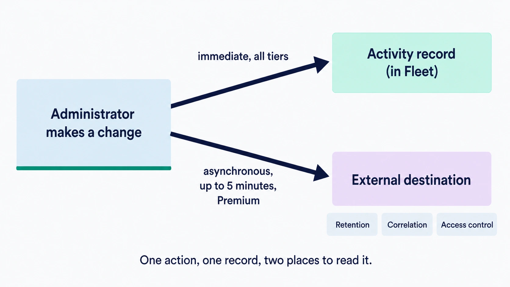

# Activity, audit logs, and log delivery

Fleet keeps a record of administrative changes, requested work, automation and selected outcomes reported by devices. This chapter covers getting that record out of Fleet and into wherever your organization keeps such things.

## Purpose and scope

[1.5 Audit and activity](../01-foundations/1.5-audit-and-activity.md) explains the model: the activity record is an enumerated event stream covering administrative changes, requested work, automation and selected observed outcomes, sitting alongside a separate device record of what each host reported. Reading them together is what turns an endpoint action into an accountable story. This chapter assumes that and covers the delivery decision, the configuration, and how to confirm it works. It covers **all three** of Fleet's outbound log streams, which are configured separately: the activity audit stream, osquery results, and osquery status.

[8.2](../08-troubleshooting/8.2-log-surfaces.md) inventories every log surface Fleet has, and [8.12](../08-troubleshooting/8.12-audit-logs.md) covers diagnosis when a record is missing or puzzling. This chapter is what those two point back at.

## What each Fleet tier includes

 One distinction to settle before anything else, because getting it backwards leads people to conclusions they should not draw.

**The activity record itself is available on every Fleet deployment.** Free and Premium alike, readable in the UI and through the Activities API, though the *global* feed is readable only by global roles ([1.4](../01-foundations/1.4-identity-and-roles.md)). Every Fleet deployment can answer who changed what and when, for the changes Fleet enumerates and for the people it can attribute; some rows record an observed outcome and carry no actor at all.

**Streaming that record to an external destination is a Fleet Premium capability.** What Premium adds is delivery, not the record.

So "audit logs require Premium" is the wrong summary. If you are running Fleet Free you have the history; what you do not have is automatic shipping of it to a SIEM.

## Three streams, three switches

 "Log delivery" in Fleet is not one setting. Configuring one of these and expecting another to follow is how a destination ends up empty.

| Stream | What it carries | Setting | Default | Tier |
|---|---|---|---|---|
| **Activity audit** | The administrative and observed-event record this chapter is mostly about | `activity_enable_audit_log`, then `activity_audit_log_plugin` | Off; plugin `filesystem` | **Premium** |
| **osquery results** | The rows your scheduled reports produce on hosts | `osquery_result_log_plugin` | `filesystem` | Free and Premium |
| **osquery status** | osquery's own health messages, forwarded through Fleet | `osquery_status_log_plugin` | `filesystem` | Free and Premium |

The two osquery plugins take the same set of destinations as each other: `filesystem`, `firehose`, `kinesis`, `lambda`, `pubsub`, `kafkarest`, `nats`, `splunk` and `stdout`. They are set independently, so results and status can go to different places, and they are **on by default** in the sense that they always write somewhere; what you are choosing is where, not whether.

**The audit stream is the odd one out in three ways**: it is off until you turn it on, it is Premium, and it uses its own plugin setting rather than either of the osquery ones. Everything from "Turn on delivery" below concerns that stream specifically.

**And a result-log destination is still not the whole story for reports.** In the steady state a scheduled report's results are forwarded only when that report has automations enabled, which is off when a report is created, so a correctly configured `osquery_result_log_plugin` sits empty until somebody turns automations on per report ([4.2](../04-know-your-devices/4.2-run-queries-and-reports.md)). Two cases bypass that filter: when stored reporting is disabled server-wide Fleet forwards incoming results without applying it, and results for reports Fleet does not recognise, which is how an osquery configured outside Fleet reaches the destination, are forwarded too.

## Choosing a destination

 Most organizations reach for external delivery for one of three reasons, and they lead to different answers.

**Retention** is the simplest: Fleet's own activity history is subject to the expiry settings covered in [2.7](2.7-organization-and-server-settings.md), and a compliance obligation may require keeping records longer than you want to keep them in Fleet's database. Delivery to durable storage is most of the answer, though not all of it: **host-only activities never enter the stream**, so a destination is not a complete archive of what Fleet held ([1.5](../01-foundations/1.5-audit-and-activity.md)).

**Correlation** is the more interesting case. A Fleet activity record becomes considerably more useful next to identity events and infrastructure changes from the same ten minutes. This is the reason to send events to the same place as everything else rather than to a dedicated bucket.

**Access control** is the one people forget. Reading Fleet's activity in Fleet requires a Fleet account. If your security team needs to investigate without being granted Fleet access, delivering events to a system they already have is the answer.

Decide which of these you are solving for, because it determines who should own the destination, who reads it, and how long it is kept. Settle those three before enabling anything.

<!-- IMAGE-OK: 2.8-activity-audit-lifecycle.webp
     NOTE: reviewed 2026-08-24 and kept. Accurate on the part that matters: "immediate, all
     tiers" against "asynchronous, up to 5 minutes, Premium", with the three reasons for
     external delivery as chips. Prompt retained; do not delete.
     PROMPT: DIAGRAM: Lifecycle diagram, one administrative action to two records. Left: an
     "Administrator makes a change" box. Two arrows right. Top arrow to "Activity record (in
     Fleet)", labelled "immediate, all tiers". Bottom arrow to "External destination",
     labelled "asynchronous, up to 5 minutes, Premium". Below the external destination, three
     small chips: "Retention", "Correlation", "Access control". Caption: "One action, one
     record, two places to read it." Flat vector, generous whitespace.
     PALETTE. Two sets, doing different jobs.
     STRUCTURE, the Fleet Black ramp and neutrals: #192147 for the most important marks,
     #515774 for ordinary labels, #8B8FA2 and #C5C7D1 for secondary structure, #E2E4EA for
     grouping bands, #F9FAFC background, #D3E8F3 and #E8F1F6 for quiet fills. All text stays
     in this set; do not tint type.
     THE FLEET DOTS, the six accent colours taken from Fleet's own logo mark: #5CABDF sky
     blue, #3AEFC4 mint, #63C740 green, #C98DEF lavender, #FAA669 apricot, #D66C7B rose.
     Fleet Green #009A7D sits alongside them. These are soft and pastel, so they work as
     fills with #192147 text on top.
     STRENGTH. Use a dot colour at full strength only for small marks: an arrow, a chip, a
     single filled icon, a rule. Over any large area, use it at roughly a 20 to 25 percent
     tint, so a panel reads as tinted rather than painted. Five large panels at full
     saturation looks like a children's infographic, not a technical manual. And do not
     colour a panel that has no content in it; colour has to carry meaning, and an empty
     coloured box is just noise.
     HOW TO USE THE DOTS. One colour per category, used consistently within the image, to
     fill or stroke the things a reader genuinely has to tell apart. Take only as many as
     there are categories; do not spread all six across four items to look lively. If nothing
     in the picture needs distinguishing, use none of them and let the structure set carry it.
     GIVE IT WEIGHT. At least one element should be a solid filled shape rather than an
     outline, so the composition has an anchor. Vary stroke weight so the primary flow is
     visibly heavier than the scaffolding around it.
     Never invent a colour outside these two sets. Flat vector, generous whitespace, no
     gradients, no drop shadows, no 3D or photorealistic icons, no logo, no watermark.
     Legible at half page width.
     NOTE: "Fleet" here is a software product for managing computers. Never draw vehicles,
     cars, vans, trucks, ships or aircraft. Never use an em-dash in rendered text. -->


## Turn on delivery

 Two server settings control this, and the second only matters once the first is on.

`activity_enable_audit_log` turns delivery on. It defaults to off. As an environment variable it is `FLEET_ACTIVITY_ENABLE_AUDIT_LOG`.

`activity_audit_log_plugin` chooses where events go. It defaults to `filesystem`. As an environment variable it is `FLEET_ACTIVITY_AUDIT_LOG_PLUGIN`.

In config-file form:

```yaml
activity:
  enable_audit_log: true
  audit_log_plugin: firehose
```

The available plugins at Fleet 4.90.1 are `filesystem`, `firehose`, `kinesis`, `lambda`, `pubsub`, `kafkarest`, `nats`, `splunk`, and `stdout`. Each has its own configuration except `stdout`, which needs none. Choose based on what your organization already operates rather than on what looks tidiest; the destination someone already monitors beats the destination that is technically neater.

Selecting a plugin is not the same as configuring it. Every destination except `stdout` needs its own settings, and Fleet will start with a plugin named and its configuration incomplete, so treat the example above as one line of a longer change.

**Turning this on for the first time sends your history, not just what happens next.** Fleet marks each activity as streamed once it has been delivered, and that flag starts false for every record already in the database. The first run after you enable delivery therefore works through the entire unstreamed backlog **that the stream is eligible to carry**, in order, oldest first; host-only rows are filtered out of that query as they are out of every later one. On a deployment that has been running for a year, that is a large burst arriving at a destination that has never seen Fleet traffic. Size for it, or expect the first delivery window to be the one that fails.

**On managed cloud hosting this is not yours to change.** Fleet's guidance is that only self-hosted deployments can modify the logging configuration, and managed-cloud customers should ask Fleet. Because these are server settings, on a self-hosted deployment changing them is an infrastructure change and follows the ownership split described in [2.7](2.7-organization-and-server-settings.md).

### Change the filesystem destination if you use it

The defaults compose in a way that is worth knowing. Enable audit logging without choosing a plugin and you get `filesystem`, whose default path is `/tmp/audit`.

That path has two properties that make it a poor permanent home: `/tmp` is cleared by the operating system, and it is local to a single Fleet instance, so a deployment running several instances writes several partial logs. Fine for confirming events are being produced, and worth replacing with either a real path your log forwarder watches or a plugin that ships events directly.

## Verification and ownership

 Make a low-risk, clearly identifiable change: rename a test label, or create and delete a placeholder. Something you can search for unambiguously.

**Then wait.** Audit events are written asynchronously, and Fleet documents a delay of up to five minutes before an event is logged. Checking the destination immediately and finding nothing is the expected result, not a failure, and this is the single most common reason someone concludes delivery is broken when it is working.

Once the event arrives, confirm four things about it rather than just its presence:

- The **actor** is the identity you expect, and is recognisable. This is where a well-named service identity from [2.6](2.6-user-accounts-roles-and-service-identities.md) pays off.
- The **scope** is as expected, remembering that an activity payload carries the fleet and the item but not the labels that were targeted or the hosts that resolved, so it tells you which fleet an action was aimed at rather than which hosts received it ([1.3](../01-foundations/1.3-hosts-fleets-labels.md)).
- The **timestamp** makes sense next to your other systems, which is what makes correlation work.
- The people who will use this during an investigation **can find it**, using the tools they would actually reach for at the time. An event that arrives in a store nobody can query is not evidence.

That last check is the one worth doing with the person who would run the investigation, not on their behalf.

Ongoing, three things need an owner: the destination itself, the retention period configured there, and monitoring that events are still arriving. A delivery pipeline that quietly stops looks exactly like a period of no administrative activity, which is why the monitoring matters more here than for most integrations.

## Edge cases and precedence

 **Oversized events are dropped rather than truncated or retried.** Destinations batch events before sending, and an event too large for its destination's limit is discarded with a notice written to the Fleet server log. The limits differ by destination, so the threshold you care about depends on which one you chose.

That failure is quiet in the place you would look for it. The activity is still in Fleet, and the external copy simply never arrives, so a destination that is missing occasional records is worth checking against the server log rather than assumed to be dropping them at random.

**Delivery is asynchronous and can lag by up to five minutes**, which is covered above under verification but bears repeating here because it interacts with the previous point: an event that has not arrived may be late rather than lost, and the two look identical for the first few minutes.

**An unreachable destination recovers; a rejected record does not.** These are different failures and the distinction decides whether you have a compliance gap.

Audit streaming tracks which activities it has already sent. When a write fails, Fleet stops at that activity, leaves it unmarked, and retries from there on the next run a few minutes later. So an outage delays delivery rather than losing it, and the backlog drains once the destination returns.

What is not retried is a record the destination accepted responsibility for and then discarded. Several plugins drop an individual record that exceeds the destination's size limit and report the batch as written, so Fleet marks it streamed and never revisits it. That gap does not fill itself, and nothing in Fleet reports it.

The practical consequence is that a destination outage is an operational problem, while a size limit is a silent data-integrity one. Size the destination for your largest plausible activity record rather than your typical one.


## Reference and troubleshooting


- Every log surface Fleet has, and how to turn up verbosity: [8.2 The log surfaces](../08-troubleshooting/8.2-log-surfaces.md)
- Diagnosis when an expected record is missing, or an event is puzzling: [8.12 Audit logs](../08-troubleshooting/8.12-audit-logs.md)
- Which layer owns a server-side configuration key, and what wins when two of them set it: [a.3 Configuration sources, scopes, and precedence](../09-appendices/a.3-configuration-model-and-precedence.md). Per-key defaults are in Fleet's own reference
- Reading the activity record through the API: [a.8 API access, versioning, and exposure](../09-appendices/a.8-api-action-and-endpoint-reference.md)

## Version notes

 Verified against Fleet 4.90.1. External audit-log delivery is a Fleet Premium capability; the activity record and the Activities API are available at every tier. The documented delay before an event is written is up to five minutes.
