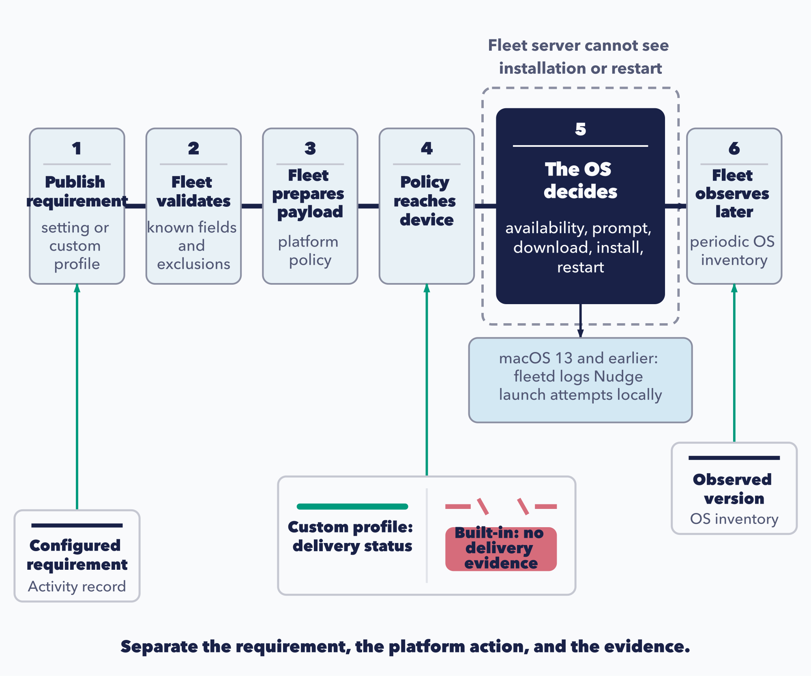

# Control operating system updates

Fleet gives administrators a central place to set operating-system requirements and follow adoption across their devices. You publish a target version or an update policy, and the operating system handles availability, downloads, user prompts, installation, and restarts. Fleet then collects inventory so you can see which devices have reached the required version.

The delivery mechanism varies by platform and OS version. On macOS 13 and earlier, fleetd supplies and launches Nudge to prompt the user to update. Nudge also relies on the operating system to install the update, but its agent-delivered prompts need their own monitoring. This chapter explains how to choose the right control, plan deadlines, and verify the result.

**Fleet's OS-update enforcement controls are Premium**, and the built-in settings page needs Apple or Windows MDM already working, with access limited to global and fleet administrators. The Linux alternatives at the end of this chapter, inventory and policies, are not ([2.10](../02-administer-and-deploy-fleet/2.10-apple-mdm-configuration.md), [2.11](../02-administer-and-deploy-fleet/2.11-configure-windows-management.md)).

## Understand the requirement-to-observation control loop

 An update rollout moves from a requirement to a device action and then to an observed result. Following these stages helps you locate a delay and report progress accurately:

1. You publish a setting or a custom profile.
2. Fleet validates known fields, your licence, the MDM prerequisites, and the built-in against custom exclusions it implements. It does not referee every possible conflict; several are resolved only at reconciliation, or not at all.
3. Fleet materialises the platform payload, or merges it into one.
4. The payload reaches an eligible device.
5. **The operating system evaluates availability and runs its own prompting, installation and restart.**
6. Fleet later receives inventory showing what version the device is on.

The installation and restart happen at stage 5, outside the Fleet server's visibility. On macOS 13 and earlier, fleetd records its own Nudge launch attempts in local logs, but those entries do not describe the operating system's installation progress.

### The evidence ladder

 Use the evidence available at each stage to answer a specific question:

| Claim | What supports it |
|---|---|
| **A requirement is configured** | The activity record of you changing the setting |
| **A policy reached the device** | Profile delivery status, **for custom profiles only** |
| **A device is actually on the version** | OS inventory, collected periodically |

For built-in enforcement, Fleet keeps the generated Apple and Windows update profiles hidden from profile lists, host details, and aggregate summaries. You can see the configuration activity and later inventory, but there is no ordinary profile-delivery status in the interface. To inspect the payload's delivery directly, use the Apple declaration diagnostics in [8.8](../08-troubleshooting/8.8-apple-mdm-diagnostics.md#888-ddm-declarations) or the Windows diagnostics in [8.9](../08-troubleshooting/8.9-windows-mdm-diagnostics.md).

After saving a requirement, validate it on representative devices. Fleet's input checks do not establish that every target platform can apply the resulting payload.

<!-- IMAGE-TODO: assets/5.6-control-loop-and-evidence.webp
     PROMPT WRITTEN 2026-08-28 by the independent reviewer, against the chapter as corrected
     after its review round. Do not hand-edit; a hand-edited prompt is a new claim.
     PROMPT: A portrait technical diagram combining an OS-update control loop with its
     evidence ladder. Use six numbered stages in a folded path: stages 1 to 3 left to right,
     then down to stage 4 and right to left through stages 5 and 6. Numbers and arrowheads
     make the reading order explicit while preserving readable labels at 720 px:

     1. "Publish requirement"
        "setting or custom profile"
     2. "Fleet validates"
        "known fields and exclusions"
     3. "Fleet prepares payload"
        "platform policy"
     4. "Policy reaches device"
     5. "The OS decides"
        "availability, prompt, download, install, restart"
     6. "Fleet observes later"
        "periodic OS inventory"

     Join the six stages with a visibly heavy numbered process path. Keep stages 1, 2, 3, 4 and 6
     compact. Make stage 5 wider than every other stage and give it a solid #192147 fill with
     #F9FAFC text, so it is the visual anchor. Surround stage 5 with a neutral dashed #8B8FA2
     enclosure. Put the exact boundary label "Fleet server cannot see installation or restart"
     immediately above that enclosure. Do not say that Fleet has no visibility at all.

     Attach one small local-device callout beneath stage 5, outside the main Fleet flow:
     "macOS 13 and earlier: fleetd logs Nudge launch attempts locally". Connect it only to the
     device side of stage 5. Do not turn this callout into server evidence, and do not draw any
     telemetry line from installation or restart back to Fleet.

     Across the lower third, draw a three-step evidence ladder. Label each rung with the
     corresponding process-stage number (1, 4 or 6) and add Numbers refer to stages above.
     This avoids long cross-diagram pointers through the folded process:

     First step, mapped to stage 1:
     "Configured requirement"
     "Activity record"

     Middle step, mapped to stage 4, split into two unmistakable cases. Show a complete small rung
     labelled "Custom profile: delivery status". Beside it show a physical gap or broken rung for
     built-in enforcement, with a small #D66C7B chip labelled "Built-in: no delivery evidence".
     The missing built-in rung must read as absent, not merely delayed or failed. Do not label
     delivery status as installed, completed or compliant.

     Third step, mapped to stage 6:
     "Observed version"
     "OS inventory"

     Use #009A7D only for the small completed custom-profile rung. Use
     #D66C7B only for the small missing-evidence chip and broken-rung marks. Keep the main process
     flow in the structure palette. Do not add a Premium badge or any licence claim; this image is
     about process and evidence, not entitlement. Use simple abstract interface, payload and
     device shapes only, with no platform logos.

     Caption: "Separate the requirement, the platform action, and the evidence."

     PALETTE. Two sets, doing different jobs.
     STRUCTURE, the fleet Black ramp and neutrals: #192147 for the most important marks,
     #515774 for ordinary labels, #8B8FA2 and #C5C7D1 for secondary structure, #E2E4EA for
     grouping bands, #F9FAFC background, #D3E8F3 and #E8F1F6 for quiet fills. All text stays
     in this set; do not tint type.
     THE FLEET DOTS, the six accent colours taken from Fleet's own logo mark: #5CABDF sky
     blue, #3AEFC4 mint, #63C740 green, #C98DEF lavender, #FAA669 apricot, #D66C7B rose.
     Fleet Green #009A7D sits alongside them. These are soft and pastel, so they work as
     fills with #192147 text on top.
     STRENGTH. Use a dot colour at full strength only for small marks: an arrow, a chip, a
     single filled icon, a rule. Over any large area, use it at roughly a 20 to 25 percent
     tint, so a panel reads as tinted rather than painted. Five large panels at full
     saturation looks like a children's infographic, not a technical manual. And do not
     colour a panel that has no content in it; colour has to carry meaning, and an empty
     coloured box is just noise.
     HOW TO USE THE DOTS. One colour per category, used consistently within the image, to
     fill or stroke the things a reader genuinely has to tell apart. Take only as many as
     there are categories; do not spread all six across four items to look lively. If nothing
     in the picture needs distinguishing, use none of them and let the structure set carry it.
     GIVE IT WEIGHT. At least one element should be a solid filled shape rather than an
     outline, so the composition has an anchor. Vary stroke weight so the primary flow is
     visibly heavier than the scaffolding around it.
     Never invent a colour outside these two sets. Flat vector, generous whitespace, no
     gradients, no drop shadows, no 3D or photorealistic icons, no logo, no watermark.
     Legible at half page width.
     NOTE: "Fleet" here is a software product for managing computers. Never draw vehicles,
     cars, vans, trucks, ships or aircraft. Never use an em-dash in rendered text.
     TERMINOLOGY: Fleet is the company, product, or server. Host groups are lowercase
     fleet/fleets, including headings and labels. Do not call these groups teams. Preserve
     exact code/API identifiers. These instructions are not text to render.
     CANDIDATE: ../../research/visual-reviews/part-5/assets/5.6-control-loop-and-evidence.webp
     Rendered and inspected for the overnight batch; awaiting final joint review.
-->



## Choose built-in enforcement or a custom update profile

 Choose the control that expresses your rollout policy. Apple supports version targets, Windows uses update and restart deadlines, and Android takes policy through a custom profile:

| | What built-in lets you say | Custom mechanism | Targeting |
|---|---|---|---|
| **macOS, iOS, iPadOS** | A minimum version with an absolute deadline date, **or** the latest version with a rolling deadline | Apple software-update declaration | Built-in: fleet only |
| **Windows** | A deadline in days **and** a restart grace period. **No version** | Windows Update CSP profile | Built-in: fleet only |
| **Android** | Nothing. There is no built-in form | `systemUpdate` in an Android profile | Profile labels |
| **Linux** | Nothing | Nothing | |

Use a custom profile if you need to pin a Windows version; the built-in Windows control sets update urgency through deadlines. Android configuration also uses a custom profile because it has no built-in OS-update form.

### Targeting is the other half of the choice

**Built-in settings are scoped by fleet, and their generated payloads do not accept labels.** Custom profiles get label scope like any other profile ([5.2](5.2-manage-configuration-profiles-and-declarative-settings.md)).

For rollout rings within one fleet, use label-scoped custom profiles. If you prefer built-in enforcement, use separate fleets for the rings ([5.1](5.1-plan-target-and-govern-device-changes.md)).

<a id="they-exclude-each-other-and-the-boundary-is-wider-than-you-would-guess"></a>

### Built-in and custom update-profile conflicts

Apple's built-in and custom controls exclude one another across the Apple platform family. Configuring a built-in macOS, iOS, or iPadOS requirement blocks custom Apple software-update declarations, and a tracked custom declaration blocks the built-in settings. For example, a built-in iOS minimum also prevents a custom macOS update declaration.

**On Windows, the exclusion triggers on the entire `Update` CSP subtree.** A custom profile that sets nothing but active hours still collides with built-in settings, because Fleet is guarding the whole area rather than the specific nodes it writes.

You can publish multiple custom Apple declarations or Windows profiles. Review their scopes and settings together, because Fleet does not resolve every conflict between them.

## Enforce Apple operating-system versions and deadlines

<!-- SCREENSHOT: SS-5.6-01 | A fixed Apple version requirement and current versions
     PURPOSE: Orient readers to the requirement and the inventory used to follow adoption.
     PREPARE: Use a test fleet with Apple MDM configured and devices reporting at least two OS versions. Open Controls > OS updates and select macOS.
     CAPTURE: Capture the fixed-version and deadline fields with the selected fleet and platform visible. Take a second crop of Current versions with its timestamp and host-count links.
     FRAME: Keep the settings and inventory in separate crops if one frame would make text small. Use an existing test requirement; do not enforce a new deadline on Dogfood devices for the capture.
     EDITION: 4.91; reuse for 4.90 only when the visible controls and wording match
     PRIVACY: Use demo names and non-sensitive data; exclude tokens, passwords, keys, and personal identifiers.
     FILENAME: ss-5.6-01.png
-->

 Two mechanisms behind one settings form, split at **macOS 14**.

### macOS 14 and later, iOS 17 and later, iPadOS 17 and later

Fleet generates a declaration carrying an exact target version and a deadline at **noon, local to the device**.

The version you enter serves two purposes: it identifies hosts below the minimum and becomes the exact target sent to those hosts. A device below that minimum is asked to install the specified version, even when a newer release is available.

In the interface, Fleet checks the version against Apple's published list and rejects unsupported values. Validation differs by API path: global and Unassigned GitOps configuration receive that check, while the per-fleet spec endpoint does not. That endpoint also skips iOS and iPadOS format validation. Check versions carefully before applying per-fleet specifications, since a typo can be stored as an unsatisfiable requirement.

Rapid Security Responses are visible in inventory but cannot be required as update targets. Server-side enforcement strips the parenthesized suffix, treating `13.3.1 (a)` and `13.3.1` alike. The browser's host-vitals comparison handles that suffix differently: it reads the patch component as zero and can show an RSR-equipped Mac as below the minimum. Compare the reported OS version with your requirement before acting on that indicator.

### Enforce the latest version with a rolling deadline

 Instead of a fixed version and a calendar date, you can set `minimum_version` to `latest` with a `deadline_days` count, and Fleet keeps each host on the newest release its own hardware can run. The target moves forward every time Apple ships a version, and each host gets a deadline that many days after the later of that version's release and the date Fleet first saw it. This is Fleet Premium, like the rest of built-in enforcement, and it applies to macOS 14 and later, iOS 17 and later, and iPadOS 17 and later, on whichever of the three you turn it on for.

It extends the minimum-versus-target split from the fixed path. The target is still an exact version carried in the declaration; what changes is that Fleet chooses that version per host rather than you typing it, and derives the deadline per host rather than you picking a date.

`latest` and a fixed version go through the same settings form and the same GitOps keys, and the two deadline fields are mutually exclusive. In latest mode you provide `deadline_days`, a whole number of at least one day, and you leave `deadline` unset; in fixed mode you provide `deadline`, a date, and you leave `deadline_days` unset. Fleet rejects the wrong combination on save with a message that names the field. In GitOps the setting lives under `controls.macos_updates` (and `ios_updates`, `ipados_updates`):

```yaml
controls:
  macos_updates:
    minimum_version: latest
    deadline_days: 7
```

**How Fleet resolves the latest version per host.** Fleet reads Apple's public software-update catalogue, the software-availability service Apple publishes for MDM, at most once a day and caches it. Once an hour a background job walks every host under a latest setting, finds the newest version in that catalogue that lists the host's hardware as supported, and stores it as the host's target version. The deadline is the later of that version's Apple-published release date and the date Fleet first saw the version, plus your `deadline_days`, at noon local to the device, the same shape a fixed deadline takes. That distinction only shows up when Fleet learns of a version after Apple's own release date; otherwise the two dates are the same. Both values are held per host and reach the built-in declaration through placeholders that resolve when the device fetches it, so the device receives a concrete version and date computed for it. When Apple ships a newer version, the target and deadline advance and Fleet re-sends the declaration.

Two consequences follow from "the newest the hardware can run". A Mac too old for the current major release is pointed at the newest release it does support, rather than one it cannot install. And because the deadline is measured from each version's own release (or discovery) date rather than a single date you chose, one setting produces different deadlines across a fleet whose hosts sit on different hardware and therefore on different newest versions.

There is no Nudge equivalent, so a fleet that still contains macOS 13 or earlier hosts should pin a specific version rather than track latest. Latest resolves to a per-host date that the declarative path delivers, and the older Nudge path has no fixed date to work from: Fleet cannot build a Nudge configuration for those hosts, and their fleetd configuration fetch errors until you pin a version or move them to a fleet that pins one ([the Nudge path](#macos-13-and-earlier-the-nudge-path) below).

**Verifying it on a host.** Host vitals on the host details page show the resolved target, the concrete version and deadline Fleet computed for that host, on Apple platforms. A host Fleet has not evaluated yet, most often one enrolled since the last hourly run, reads `Pending` for both until the job resolves it. Rapid Security Responses and beta builds are not tracked: Fleet reads only Apple's public release set, which is consistent with how the fixed path treats an RSR as visible but not targetable.

If Apple's service is unreachable when the daily refresh runs, Fleet keeps the catalogue it last fetched and recomputes targets from that, rather than clearing anyone's requirement.

<!-- SCREENSHOT: SS-5.6-02 | Latest-version enforcement and the resolved host target
     PURPOSE: Show the difference between a rolling requirement and the version resolved for one host.
     PREPARE: Use Fleet 4.91 with a test Apple fleet already tracking latest. Allow the hourly target-resolution job to run for a supported host.
     CAPTURE: Capture Controls > OS updates > macOS with latest selected and the deadline in days. Take a second crop of an Apple host's vitals showing its resolved version and deadline; an unevaluated host may be captured separately as Pending if useful.
     FRAME: Two separate views with the fleet/platform and host identity clear. Never invent a resolved target or edit UI labels.
     EDITION: 4.91 only; latest-version enforcement is absent from 4.90
     PRIVACY: Use demo names and non-sensitive data; exclude tokens, passwords, keys, and personal identifiers.
     FILENAME: ss-5.6-02.png
-->

### What the user experiences

 Choose deadlines with the employee experience in mind. Apple's prompts and restart behavior determine how much interruption people will see.

As the deadline approaches, the device notifies the user and prepares the download. At the deadline on macOS, the operating system force quits open applications, including those with unsaved documents. Pilot the policy with an appropriate fleet and tell users when to save their work and expect the update.

On iOS and iPadOS, a passcode-protected device requires the passcode to be entered at the enforcement date before the update can proceed, unless it was entered earlier.

On Apple silicon, enforcement may be authorised by a bootstrap token. Without one, macOS prompts the user for credentials instead, which is a different experience and a different failure mode ([2.10](../02-administer-and-deploy-fleet/2.10-apple-mdm-configuration.md)).

A device that was offline or interrupted at the deadline does not stay stuck: Apple retries after it reconnects, with an installation attempt within about an hour.

### macOS 13 and earlier: the Nudge path

Fleet has no declarative mechanism on these versions. Instead, fleetd downloads, configures and launches **Nudge**, which prompts the user with increasing insistence as the deadline nears. It requires fleetd with agent updates enabled; a host without them never gets the mechanism at all.

**The deadline is a different clock.** Nudge's deadline is **20:00 UTC**, which Fleet's source describes as noon Pacific Standard Time. It is not adjusted for daylight saving, so it lands at 13:00 Pacific for half the year, and at whatever that translates to everywhere else. Two Macs in your fleet on either side of macOS 14 will therefore hit their deadlines at different times of day.

> If Nudge exits with an error during launch, fleetd stops retrying for the life of that agent process. The failure is recorded locally; it creates no server activity or host-field change, so the setting still appears configured in Fleet.
>
> Query `fleetd_logs` to inspect those launch failures ([4.2](../04-know-your-devices/4.2-run-queries-and-reports.md)). Include that check in your monitoring for older Macs so an inactive prompt does not go unnoticed.

### Updating newly enrolled Apple devices

A separate switch asks Apple to update a Mac during automated enrollment. Account for these behaviors when preparing new devices:

- **It requests Apple's latest available release, not your configured target.** A device set up this way can land on a newer version than your minimum.
- Where no minimum is configured, it applies to every eligible device rather than only those below a threshold.
- It defaults to on when omitted from configuration while both a macOS version and a deadline are set. Set it explicitly in automation when you want a predictable enrollment policy.

There is no equivalent switch for iOS or iPadOS.

This switch is a one-time nudge at enrollment and is separate from tracking `latest` as your minimum version. The switch acts once, on macOS, as a device sets itself up. Tracking latest is continuous enforcement across macOS, iOS, and iPadOS that keeps hosts on the newest release for the life of the setting ([Enforce the latest version with a rolling deadline](#enforce-the-latest-version-with-a-rolling-deadline)).

## Configure Windows update deadlines and grace periods

<!-- SCREENSHOT: SS-5.6-03 | Windows update deadline and restart grace
     PURPOSE: Locate the two controls readers must configure together.
     PREPARE: Open the Windows tab under Controls > OS updates for a test fleet with Windows MDM enabled.
     CAPTURE: Show the deadline and restart grace-period fields, their units, and the selected fleet/platform. Use a preconfigured test policy or leave a demonstration unsaved.
     FRAME: Crop the complete settings card. The caption can explain the two clocks; do not add an invented timeline inside the UI.
     EDITION: 4.91; reuse for 4.90 only when the visible controls and wording match
     PRIVACY: Use demo names and non-sensitive data; exclude tokens, passwords, keys, and personal identifiers.
     FILENAME: ss-5.6-03.png
-->

 You supply two numbers: a **deadline** of 0 to 30 days and a **restart grace period** of 0 to 7 days. There is no version field. Both must be set together or both cleared.

A zero-day deadline means immediate enforcement. To disable the requirement, clear both the deadline and restart-grace fields.

<a id="six-settings-not-two"></a>

### The six generated Windows policy settings

 The two fields produce six Windows policy settings in one atomic block. Review the generated settings, including the values supplied automatically:

| Setting | Value | Visible to you |
|---|---|---|
| Deadline for feature updates | your deadline | Yes |
| Deadline for quality updates | your deadline, the same number | Yes |
| Deadline grace period | your grace period | Yes |
| Automatic updates allowed | on | **No** |
| **Pause access disabled** | on | **No** |
| `ConfigureDeadlineNoAutoReboot` | `1` | **No** |

Built-in Windows enforcement also removes the user's ability to pause updates, through the fifth setting in this table. Include that behavior in your rollout communications; it is not exposed as a separate choice in the form.

Note also that **the same deadline governs both feature and quality updates.** Fleet does not let you separate them; a custom profile does.

<a id="how-the-deadline-and-grace-period-actually-interact"></a>

### How the deadline and grace period interact

The deadline runs from when the device discovers the update. The grace period runs from when a restart becomes pending. Windows uses the later of those two deadlines for the forced restart.

For example, a seven-day deadline and two-day grace period do not automatically give a user nine days. If installation finishes early enough, the original seven-day deadline still governs. The grace period extends the schedule only when its restart-pending deadline falls later.

**Once the effective deadline is reached, Windows can force the restart regardless of active hours.** Active hours shape when restarts happen before that point, not after it.

Microsoft's own documentation is inconsistent on the deadline model in one place, where the prose for an older Windows build disagrees with its own parenthetical. The model above is the one Microsoft states in its compliance-deadline guidance.

### Custom Windows profiles

A custom Update CSP profile is the way to express what the built-in form cannot: separate feature and quality deferrals, version pinning, update schedules, active hours, and notification behaviour ([5.2](5.2-manage-configuration-profiles-and-declarative-settings.md) owns the authoring).

> For a custom Windows profile, **Verified** means the device reported that the write succeeded. Fleet does not read the value back. Check the device's policy state when you need to establish that the setting remains in force, and use inventory to confirm the OS update itself.

<a id="one-risk-worth-testing-rather-than-assuming"></a>

### Test atomic policy delivery on supported Windows builds

Fleet sends all six settings as one atomic block. If a device rejects any one of them, Windows fails the whole block and attempts to roll the others back, and that rollback can itself fail and leave the device partially configured.

**Fleet sends both the split deadline nodes and the combined one.** `ConfigureDeadlineForFeatureUpdates` and `ConfigureDeadlineForQualityUpdates` are the two Microsoft's current CSP reference documents; the older combined `ConfigureDeadlineNoAutoReboot` node goes into the same atomic block as well, which is what the settings table above records. **Microsoft does not document what an unsupported policy node returns**, so if any Windows build you run does not accept one of the six settings, the whole block can fail and roll back, which is exactly why the atomic-block risk above is worth testing rather than assuming.

Test the generated profile on the Windows builds and editions you manage. After delivery, inspect the policy state through the `PolicyManager` registry path or the Windows MDM diagnostic report. This checks what the device retained if a policy node was rejected or rollback was incomplete.


<!-- IMAGE-TODO: assets/5.6-windows-deadline-overlap.webp
     QUESTION: How do the Windows update deadline and restart grace period overlap?
     PROMPT: DIAGRAM: Two small aligned illustrative timelines, each with Update discovered at day 0
     and a 7-day deadline. Early-install example: Restart pending day 3, 2-day grace ends day 5,
     effective forced-restart boundary day 7. Late-install example: Restart pending day 6, 2-day
     grace ends day 8, effective boundary day 8. Draw deadline and grace as independent brackets,
     not consecutive blocks. Label the shared rule Later of discovery + deadline and restart-pending
     + grace. Mark the examples Illustrative, with no implied installation-duration guarantee;
     active hours do not extend the effective boundary.
     TERMINOLOGY: Fleet is the company, product, or server. Host groups are lowercase
     fleet/fleets, including headings and labels. Do not call these groups teams. Preserve
     exact code/API identifiers. These instructions are not text to render.
     DESIGN: Flat vector technical diagram. Fleet is software for managing computers; draw no
     vehicles. Use Inter labels and Roboto Mono identifiers. At 1400 px source width use 48 px
     titles, 36 px body labels, and at least 28 px secondary text; scale proportionally. Check at
     720 px reading width and intended print size. Use a 32 px spacing grid, at least 24 px node
     padding, and consistent corner radii. Center short node names; left-align multiline
     explanations. Never shrink text to fit. Use #F9FAFC background, #192147 headings and primary
     connectors, #515774 text, #8B8FA2 secondary connectors, #C5C7D1 borders, and #D3E8F3 or #E8F1F6
     quiet fills. Use #5CABDF and #C98DEF for named categories, #3AEFC4 for labelled positive
     outcomes, #D66C7B for labelled failures, and #FAA669 for labelled cautions. Tint large panels
     to 20 to 25 percent; full strength is for small marks. Keep text navy or slate, or off-white on
     a navy anchor. Never rely on colour alone. Use one arrowhead shape, consistent stroke weights,
     box-edge termination, and labelled branches and return paths. Keep connectors clear of text. No
     gradients, shadows, decorative icons, logo, watermark, em-dashes, or slogan footer. Render only
     the specified reader-facing labels. Choose orientation to fit the relationship, not a default
     poster. Keep captions outside the artwork. If labels crowd, split the figure before shrinking
     them. Keep editable SVG when the production method supports it.
     NOTE: Proposed 2026-09-08; editorial brief, not technical re-verification. Replace the overlap
     explanation and seven-plus-two misconception with a short formula and the timelines. Retain
     ranges, zero-value semantics, built-in policy side effects, and the Microsoft-version
     qualification. Keep current prose and this TODO until the actual image is reviewed. Then check
     alt text against the artwork and retain an accessible summary plus all required technical
     qualifications.
     CANDIDATE: ../../research/visual-reviews/part-5/assets/5.6-windows-deadline-overlap.webp
     Rendered and inspected for the overnight batch; awaiting final joint review.
-->

<!-- IMAGE PENDING. Install reviewed artwork, then activate the image line below.

-->

## Configure Android system-update policy

 Configure Android OS updates through a `systemUpdate` block in an Android configuration profile. This release has no built-in Android update form, and `systemUpdate` requires Premium independently of the profile's other settings.

Three modes are available: taking updates automatically, taking them inside a maintenance window, or postponing them. **Postponing means 30 days**, not a period you choose. Freeze periods have hard vendor limits: **at most 90 days each, at least 60 days between them, no overlapping**, and the calculation ignores leap years. They **repeat every year**, so a freeze set for a December release window returns each December until you remove it.

Windowed mode also constrains Google Play application updates. Choose its maintenance window with both application and operating-system updates in mind.

> **A misspelled field inside `systemUpdate` is accepted and silently dropped.** Fleet does not strictly validate the nested keys, so a maintenance window with a mistyped field name applies, reports success, and simply is not there. Check the device's behaviour rather than the profile's status.

**Fleet does not check device ownership for this policy.** Google's model is that only a device owner can control system updates; a profile owner, which is what manages a personally owned work profile, can report on them but not control them. Fleet accepts the profile either way. Apply system-update policy to fully managed devices, and do not assume Fleet will stop you doing otherwise.

## State the Linux update-management boundary

 For Linux, use Fleet to identify OS versions, test your requirements with policies, and track progress while the distribution's package-management tools perform updates. Fleet provides no built-in Linux update enforcement, deadline, or restart policy.

Check Linux versions in host inventory or reports. The **Current versions** table on the OS updates page excludes Linux.

Host inventory shows the reported version ([4.1](../04-know-your-devices/4.1-understand-hosts-vitals-and-inventory.md)), and a policy can test whether it meets your baseline ([4.3](../04-know-your-devices/4.3-use-policies-for-compliance.md)). You can call the distribution's tooling from a script ([5.3](5.3-run-and-manage-scripts.md)) or policy automation ([5.9](5.9-automate-remediation-with-policies.md)). In that approach, your automation owns installation, retry, and restart behavior.

## Handle conflicts, offline hosts, retries, interruption, and limits


**Exclusions.** Apple's is family-wide; Windows' covers the whole `Update` subtree. Fleet permits multiple custom profiles of either kind and will not referee between them.

**Android field collisions.** Fleet merges Android policy fragments by **profile name in alphabetical order**, and a later profile wins a duplicate top-level field. The profile that loses is **marked failed in its entirety**, including for fields it won. Two profiles that both set `systemUpdate` do not merge; one wins and the other reports as a failure.

**Offline at the deadline.** Apple retries when the device reconnects. Microsoft's documentation does not clearly establish the Windows behavior for a device returning after its deadline, so test that case on your supported builds. A device that never discovered the update has not started its deadline clock; time offline alone does not establish that it is overdue.

**Interrupted installation.** Downloads, installations and restarts belong to the platform. Fleet cannot cancel one, cannot roll one back, and has no visibility into one in progress.

**Removing enforcement.** Clear the required field pair to remove built-in settings; remove or rescope a custom profile as any other ([5.2](5.2-manage-configuration-profiles-and-declarative-settings.md)). What stops is future enforcement. **What cannot be undone is anything already installed and any restart already taken.**

**The two macOS paths degrade differently, and neither stops instantly.** On macOS 14 and later, MDM connectivity is needed to *deliver* or *revise* a declaration, but Apple's declarative model is device-autonomous once the declaration is present: a device already holding one keeps enforcing it. Withdrawal likewise only takes effect once the removal reaches the device, so an offline Mac stays under the old requirement. On macOS 13 and earlier it is fleetd and agent updates that matter, not MDM. A single failure does not affect both halves of a mixed fleet the same way.

## Roll out, verify, revise, and withdraw update enforcement


### Roll out within the scope your mechanism allows

Pilot built-in enforcement with a fleet, or custom profiles with a fleet and label scope. Include the hardware and OS branches you use, and identify devices whose work is sensitive to a restart. Review the pilot's results before expanding the audience.

### Verify delivery and convergence separately

Use these views to follow configuration changes and the versions devices report:

| Check | What it tells you | Where |
|---|---|---|
| **Activity record** | The setting changed, and to what | Global activity feed |
| **Host vitals** | Whether *this* host meets the minimum, with its deadline | Host details, **Apple only** |
| **Current versions** | Aggregate version spread | OS updates page, **no Linux** |
| **A policy** | Whether hosts pass a version test you wrote | Policies |
| **Device policy state** | What a Windows device actually has | Registry or MDM diagnostic report, on the device |

Two cautions on that table. The **activity types are global-feed only**: they never appear on a host's own timeline, so looking at one host will not show you that its fleet's requirement changed. And **re-saving an unchanged value writes no activity at all**, so an empty feed is not evidence that nothing happened.

**The Current versions timestamp is aggregation time, not report time.** For a healthy, reporting host expect it to lag by roughly a detail interval plus an aggregation interval, on the order of two hours. For an offline host the underlying inventory can be arbitrarily old, and no timestamp on that page tells you which case you are looking at. Drilling into the host list bypasses the aggregation but still reads stored inventory; it is not an on-demand query of the device.

Track how many eligible devices have reached the requirement, then investigate those that remain below it. That gives you a useful rollout result beyond confirmation that the policy was saved.

<a id="what-is-not-evidence"></a>

### Limits of the available update evidence

- The settings page saving successfully.
- The absence of errors.
- A profile listed as delivered, which built-in enforcement never produces anyway.
- **Windows `Verified`**, which means the write succeeded, not that the value is still set.
- An empty activity feed, which may mean nothing changed.

### Revise or withdraw

Changing a version or deadline is simply a new desired state; Fleet does not track a history of what you used to require. Clear the field pairs to withdraw built-in enforcement, and expect nothing to be rolled back on any device that already acted.

## Reference and troubleshooting

 Which platforms support built-in enforcement versus a custom update profile, and the licence each requires, are in [a.2](../09-appendices/a.2-platform-capability-matrix.md). Whether an update action is reachable through the UI, fleetctl, the API, or GitOps is in [a.5](../09-appendices/a.5-interface-index.md); built-in enforcement is fleet-scoped only and does not accept labels, unlike most of the targeting model in [5.1](5.1-plan-target-and-govern-device-changes.md).

Custom update profiles are authored and read the same way as any other configuration profile, covered in [5.2](5.2-manage-configuration-profiles-and-declarative-settings.md).
