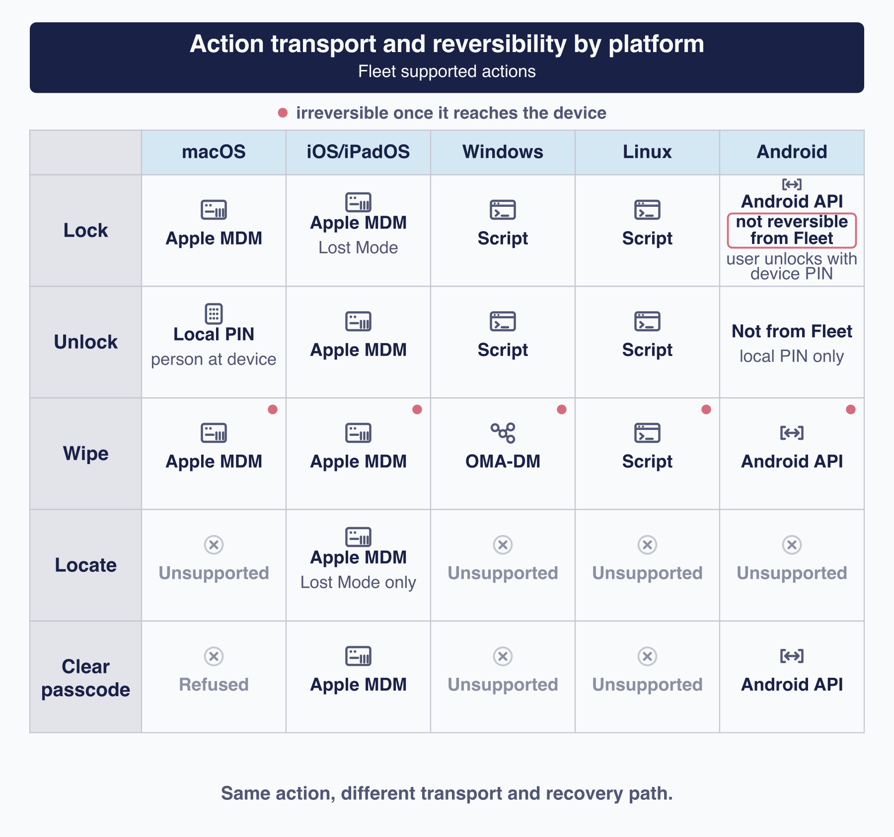

# Control devices and send custom MDM commands

This chapter is about the actions that reach out and change a device: locking it, unlocking it, finding it, clearing its passcode, and erasing it. Some of them cannot be undone.

**An action is defined by what it does to the machine. Everything else about it depends on the platform**: what it requires, how it gets there, when it stops being reversible, and what evidence you get back. Lock on a Mac and lock on a Windows laptop share a button and almost nothing else.

The title says "custom MDM commands" rather than "MDM commands" for a reason worth knowing early. **Several of these actions are not MDM commands at all.** Windows lock and unlock and every Linux action are scripts; Android goes through its own management API; only some Apple actions are what the phrase suggests ([1.2](../01-foundations/1.2-how-fleet-reaches-a-device.md)).

## Make the action safe before you send it

 Five things to settle before sending any of these. Work through them as a checklist for the action you're about to send, not something to hold in your head in advance.

**Confirm you have the right host.** Serial numbers and hostnames repeat, people hand machines on, and a stale inventory record can point at a device that now belongs to someone else. Check the identity against something the person can confirm.

**Know who is holding it.** Locking a machine strands whoever is using it. That may be the point, and it is still worth being deliberate about, because a locked device with no unlock path is a support problem you have created.

**Have the recovery plan before you act.** How will this person get working again, and who redeploys the machine? Answering afterwards is answering under pressure.

**Do not conflate the unlock PIN with disk-recovery material.** They are different things with different purposes: the PIN releases a lock Fleet applied, while recovery keys unlock an encrypted volume ([5.8](5.8-enforce-disk-encryption-and-manage-recovery-credentials.md)). **Treat the unlock PIN as credential material.** Restrict who can see it, keep it out of tickets and chat, and route it through whatever channel your organization uses for secrets.

**Be careful with bulk.** These actions are per host by design. Anything that applies one of them to many hosts at once deserves a second person looking at the target list.

**Wipe is not the only irreversible thing you can do from Fleet.** A script runs with full administrative privilege ([5.3](5.3-run-and-manage-scripts.md)), and a raw custom command can do anything the platform allows.

## Choose a supported device action or a custom MDM command

 Two different things share this chapter.

A **supported action** is one Fleet owns. It selects the mechanism for you, checks the preconditions it knows about, and creates action-specific bookkeeping **where Fleet models that action**. That qualifier matters: Fleet does not model every resulting state. Android lock is never represented as locked, and clearing an Apple passcode has no device-level pending state.

A **custom command** is an escape hatch. Fleet relays your payload to the platform and reports what came back. It does not interpret it.

> **Use the supported action for anything destructive.** Sending the equivalent raw command can erase a device **without Fleet's device status ever transitioning to wiped**. The status stays where it was until some other tracked event moves it. That applies to a raw Apple erase and to a raw Windows remote wipe alike. If you have a reason to send one anyway, verify the outcome independently rather than trusting what Fleet shows.

The custom path also loses the precondition checks, the refusal on personally enrolled devices, the unlock PIN, the conflict detection, and the activity that records a wipe. It keeps the licence gate. **Do not rely on a raw command to tidy up a host's queued work**: a raw Apple erase can trigger that cleanup once its result arrives, and a raw Windows remote wipe does not.

## Compare platform support, prerequisites, transport, and licence

 What is possible, per platform.

| | macOS | iOS and iPadOS | Windows | Linux | Android |
|---|---|---|---|---|---|
| **Lock** | Apple MDM | Apple MDM, as **Lost Mode** | **Script** | **Script** | Android API |
| **Unlock** | **No command.** Fleet gives you a PIN | Apple MDM | **Script** | **Script** | **Not from Fleet.** Local only |
| **Wipe** | Apple MDM | Apple MDM | **OMA-DM** | **Script** | Android API |
| **Locate** | No | Yes, with Lost Mode | No | No | No |
| **Clear passcode** | **Refused** | Yes | No | No | Yes |

ChromeOS supports none of it.

Three rows deserve attention before you plan anything around them:

- **iOS and iPadOS "lock" is Lost Mode**, not the same mechanism as a Mac lock. It is what makes locating possible, and it behaves like Apple's feature rather than like Fleet's.
- **macOS unlock is not a command at all.** Fleet hands you a PIN and somebody types it on the machine. If the Mac is not in front of anyone, it stays locked.
- **Android has no remote unlock.** You can lock an Android device from Fleet and you cannot reverse it from Fleet; the person holding it unlocks it locally.

**Prerequisites are not uniform either.** Windows lock and unlock need Windows MDM turned on **even though they are scripts**, while the Linux equivalents do not. Script-backed actions need fleetd with scripts enabled ([5.3](5.3-run-and-manage-scripts.md)). And licensing is not uniform: most of this is Premium, but Android wipe on a company-owned device works on Fleet Free.

### Eligibility, before you find out the hard way

| Action | What it requires |
|---|---|
| **iOS and iPadOS Lost Mode** | **Company-owned, automatic enrollment.** Manual and personal enrollments are refused |
| **Apple clear passcode** | iOS or iPadOS, not personally enrolled, and Fleet must already hold an unlock token for the device |
| **Android wipe** | **Company-owned only.** A personally owned Android is unenrolled instead, which removes management rather than erasing the device |
| **Android lock and clear passcode** | Both ownership models |
| **Windows unlock** | Somebody must power the machine back on, because lock shut it down and the unlock script is queued work waiting for an agent that is not running |
| **Linux lock** | Root is exempt, and only ordinary user accounts are password-locked. Test the result against your own login stack before relying on it |
| **Any of them** | Administrator or maintainer for the relevant scope. **GitOps is refused**: each action checks the ability to list hosts before the MDM-command write, and GitOps lacks it ([a.4](../09-appendices/a.4-roles-and-permissions-matrix.md)). Refusal of these actions is not containment: a GitOps credential can still send raw MDM commands, including device-destroying ones on Premium ([a.4](../09-appendices/a.4-roles-and-permissions-matrix.md), [1.4](../01-foundations/1.4-identity-and-roles.md)) |

The Windows row is the one that catches people. **Lock powers the machine off, and the unlock is queued work.** A device nobody physically restarts cannot receive the instruction that would release it.

## Follow each action from request to result

 Five pipelines, because when something is stuck the useful question is which stage it stopped at ([8.1](../08-troubleshooting/8.1-diagnostic-method.md)).

**Apple, by MDM.** Fleet enqueues the command, pushes a notification, and the device collects it on its next check-in. A device that is off or offline gets it whenever it reappears.

**Windows lock and unlock, by script.** The request enters the host's queue like any other script and runs when the agent next collects work ([5.1](5.1-plan-target-and-govern-device-changes.md)).

**Windows wipe, by OMA-DM.** A different channel from the Windows lock beside it, and it depends on the agent waking the device's management client. That dependency is the thing to check first when a Windows wipe sits pending.

**Linux, by script.** Everything on Linux is the agent running a shell script. No MDM is involved at any point.

**Android, by its management API.** Fleet issues an AMAPI command, not a policy update, and updates its record when the command result arrives over Pub/Sub.

## Lock, unlock, locate, and clear passcodes

### macOS

Fleet generates a **six-digit PIN** and locks the machine. Somebody physically present enters that PIN to release it. Keep the caution from the opening section in mind: that PIN is credential material and deserves the handling you would give any other secret.

Clearing a passcode is **refused on macOS**. It is an iOS and iPadOS operation.

### iOS and iPadOS

Lock puts the device into **Lost Mode**, which is why location works here and nowhere else. Fleet can ask for the device's position and show you where it last reported.

**A device in Lost Mode that cannot reach Fleet cannot be released by Fleet.** The unlock is a command like any other, so it waits for the device to check in. A phone that is off, out of coverage, or otherwise unable to reach you stays locked until that changes.

Clearing a passcode works here, subject to ownership and token requirements.

### Windows

Lock and unlock are scripts, and they do more than the words suggest.

> **Windows lock shuts the machine down.** It is not a screen lock; the device powers off.
>
> **Windows unlock re-enables every disabled local account on the machine**, not only the one the lock disabled. An account somebody disabled deliberately, for an entirely unrelated reason, comes back. It also resets the cached-logons setting to a fixed value regardless of what your organization had configured.

That second behaviour is worth checking against your own estate before you rely on unlock, particularly on any machine where a local account was disabled on purpose.

### Linux

Lock and unlock are scripts here too. **Linux unlock does not restore the autologin configuration that lock disabled**, so a Linux device does not return to exactly the state it was in. The Windows and Linux scripts fail in opposite directions: one restores too much, the other too little.

### Android

Lock works. **Fleet has no remote unlock for Android**: the person holding the device unlocks it locally with its own PIN. So the device is recoverable, just not by you from Fleet.

**Fleet does not model the Android lock state**, so the interface shows the device as unlocked immediately after a successful lock. That is Fleet declining to claim knowledge it does not have rather than a display fault, but the practical effect is that **you cannot tell from Fleet whether an Android device is currently locked**.

One consequence follows. On every other platform a locked device must be unlocked before it can be wiped. On Android, wipe on a locked device is permitted, because Fleet does not model the lock.

## Wipe a device and plan for what remains

> **Wipe is irreversible on every platform, but it does not erase the same thing on every platform.** Read the platform notes below before sending it; once the command reaches the device, Fleet cannot cancel or roll it back.

**Apple** erases the device through its own mechanism, and it behaves the way Apple's erase behaves.

**Windows** uses a remote wipe through OMA-DM, which is a different channel from the lock beside it in the interface.

**Linux is the one to read carefully.** It is a script, and two things about it are not what the word "wipe" implies:

- **It is path-based deletion, not a secure erase.** The script deletes selected paths and snapshots **without overwriting the underlying storage**, and untargeted partitions and mountpoints can survive. **Do not treat a Linux wipe as sanitisation** for a machine leaving your control.
- **Fleet reports success before the destructive phase begins.** The reporting process hands work to a detached child, which waits ten seconds before deleting anything. That is a deliberate tradeoff in this implementation. Its consequence is sharper than it first looks: **success proves neither that deletion completed nor that it began.**

**Android** wipes within the scope its ownership model allows, and Android wipe on a company-owned device is one of the few things here that does not need Premium.

**Afterwards**, three things are worth knowing. **The host record survives** the wipe; Fleet does not delete it for you. **A successful tracked wipe cancels that host's remaining upcoming activities**, so queued work does not run against a machine that no longer exists as you knew it. And **re-enrollment clears the computed wiped state**, so a device that comes back into service reads as an ordinary host again, enrolling from the beginning ([3.1](../03-connect-devices/3.1-enrollment-design-and-host-lifecycle.md)).

## Turn MDM off for one host

 A different scope from everything above: independent of the platform-wide MDM switch, one host at a time, and Free on every platform that offers it.

Apple hosts (macOS, iOS, iPadOS) and BYOD-enrolled Android hosts can have MDM turned off individually, from the host's Actions menu. **Windows refuses outright**, with its own error ("Can't turn off MDM for Windows hosts"), and every other platform, ChromeOS included, gets a generic unsupported-platform response. **Company-owned Android does not offer the action at all**; Wipe is what an administrator sends to a device the organization owns instead.

The button's label tracks what happens next, not the platform. On macOS it reads **Turn off**: the host stays enrolled with Fleet and keeps checking in, only MDM management leaves. On iOS, iPadOS, and Android it reads **Unenroll**, because there is no such split there: removing management takes the device out of Fleet's device-management view too, deleting the settings and apps Fleet placed, or on Android, deleting the work profile and its company data.

**Requires administrator or maintainer**, globally or on the host's own team; GitOps cannot invoke it, the same restriction [above](#eligibility-before-you-find-out-the-hard-way) gives lock, unlock, and wipe.

> **On Apple, Fleet's own record moves before the device does; on Android BYOD, it is the other way round.** For a Mac, iPhone, or iPad, confirming the action enqueues the removal command to the device *and* immediately marks the host unenrolled in Fleet's own database, ahead of any acknowledgement, and the interface's own wording, "MDM will be turned off... next time this host checks in," is telling you the device-side effect lags what Fleet already recorded. For BYOD Android, it is reversed: unenrolling issues a work-profile wipe command, and Fleet does not record the host as unenrolled until the device confirms that wipe completed.

**What survives, on macOS and iOS/iPadOS:** disk-encryption keys and any bootstrap-package record, kept intentionally in case the host re-enrolls ([5.8](5.8-enforce-disk-encryption-and-manage-recovery-credentials.md) covers what a re-enrolled host does and does not get back). **What does not:** every profile Fleet placed is deleted from Fleet's side (the device stops acknowledging removal requests once it is gone, so Fleet does not wait for it), MDM-delivered certificates are dropped, queued MDM-dependent activities including pending app installs are cancelled, and the stored Recovery Lock password is discarded, because Apple itself wipes the device-side lock when the enrollment profile is removed.

**Getting the device back depends on how it enrolled, not on this action.** A host that enrolled through Apple Business Manager's automatic device enrollment re-enrolls only after it is reset; confirm it is still assigned in Apple Business Manager first, since leaving MDM off does nothing by itself. A manually enrolled iOS or iPadOS device re-enrolls by going through **Hosts > Add hosts > iOS/iPadOS** again. A BYOD account-driven enrollment re-enrolls from the device itself, at **Settings > General > VPN & Device Management > Sign in to Work or School Account**. A manually enrolled Mac's end user follows the **Turn on MDM** instructions on their own **My device** page. Android re-enrolls the same way it enrolled, through **Hosts > Add hosts > Android**.

## Send custom Apple and Windows MDM commands

 When the supported actions do not cover what you need, Fleet will relay a raw command to Apple or Windows devices.

**Targets must be homogeneous.** One request goes to one platform's devices; Fleet enforces that, and enforces it more strictly at the server than the command-line tool does. There is no host limit as such, but the request body size is a real ceiling.

**Send it** with `fleetctl mdm run-command`, or `POST /api/v1/fleet/commands/run` against the API. Apple expects a plist XML command; Windows expects a single `<Exec>` containing one `<Item>`.

**Command identifiers differ by entry point.** The direct API requires and preserves the identifier in your payload; `fleetctl` replaces it with one of its own. Either way, **keep the identifier you get back**, because it is how you retrieve the result later with `fleetctl get mdm-command-results` or `GET /api/v1/fleet/commands/results`.

**Apple enqueue can partially succeed**, and the failure mode is narrower than it sounds: what fails is the *push notification* to some devices, not the enqueue. Those devices still have the command waiting and will collect it on their next check-in. Read a partial result as "some devices have not been nudged yet", not as "some devices did not get it".

**Destructive command types are licence-gated**, and the matching differs: Apple matches exact request types, while Windows identifies a remote wipe from the target path in the payload.

> **A raw destructive command does not inherit the supported action's bookkeeping.** Fleet will relay an erase command perfectly well and the device status will not become wiped. If you send one, verify the outcome on the device rather than in Fleet.

## Read status, results, and retry signals

 Four different things get called "the status".

| Surface | What it actually tells you |
|---|---|
| **The activity feed** | That somebody **requested** the action, at the moment they requested it |
| **Pending action** | That Fleet is expecting something to happen |
| **Device status** | Fleet's computed belief about the actions it tracks. `unlocked` is the **default**, not proof |
| **The command result** | What the device itself said |

**The activity is written when the request is accepted and is not revised afterwards.** Outcome handling does not go back and amend it. So an activity records an intention, not an outcome, and it can also be skipped for devices whose push notification failed even though the command is waiting for them.

**Only the command result carries the device's own words.** Both Apple and Windows results are available through the results API; it is the per-host command feed **in the interface** that is Apple-only, so a Windows result is retrievable but not browsable in the same way.

### Apple command states

**Pending** means it is waiting. **Acknowledged** means the device says it did it. **Error** means the device says it did not.

**NotNow** is the one people misread. It means the device received the command and is not in a position to act on it right now, typically because it is locked or busy. It is not a failure and it is not a retry from Fleet's side: the device gets the command again on a later check-in, and Fleet counts how often that has happened.

### Elsewhere

**Windows** redelivers until the device acknowledges. **Android** reports its command result back over Pub/Sub.

**Script-backed actions do not give you an ordinary script result.** Fleet stores the script result internally and consumes its exit code to update the action's state; the lock, unlock and wipe activities do not expose the output and exit code you would see from a script you ran yourself ([5.3](5.3-run-and-manage-scripts.md)). What you get is the action's state, not the script's.

**None of these actions retries on its own.** Redelivery is not retrying: a redelivered command is the same command still waiting, and a command that reached a terminal failure stays failed until you send another one.

## Handle collisions, cancellation, and irreversible edge cases

**A locked device must be unlocked before it can be wiped**, on every platform that models locking. Android is the exception, and only because it does not model it.

**Fleet refuses actions that conflict with one already in flight**, and refuses ones whose target is already in the resulting state.

**Cancellation is narrow, and narrower than people assume.** Upcoming work that has not yet been activated can be cancelled ([5.1](5.1-plan-target-and-govern-device-changes.md)). Beyond that point there is nothing to cancel: **Fleet exposes no administrator-facing cancellation for a custom command**, and nothing recalls a command a device has already been sent.

**Offline devices hold their instruction.** An Apple command waits in the MDM queue and the device collects it whenever it reappears, which may be long after you have forgotten sending it. **Being offline does not create a cancellation window**: once a command is in that queue you cannot recall it, so the time to change your mind is before you send it, not while you wait.

**An iOS or iPadOS device that cannot reach Fleet after being locked** cannot be released by Fleet, which is the practical version of the Lost Mode warning above.

**Linux's destructive phase is delayed**, so a Linux wipe reported as successful may still be in progress, and a machine that loses power in that window may be left partially wiped rather than wiped or intact.

<!-- IMAGE-TODO: assets/5.7-action-transport-and-reversibility.webp
     PROMPT WRITTEN 2026-08-28 by the independent reviewer, against the chapter as corrected
     after its review round. Do not hand-edit; a hand-edited prompt is a new claim.
     DIAGRAM: A wide, compact technical-manual matrix titled "Action transport and reversibility by platform". Scope it explicitly to "Fleet supported actions". Five columns: "macOS", "iOS/iPadOS", "Windows", "Linux", "Android". Five rows: "Lock", "Unlock", "Wipe", "Locate", "Clear passcode". Keep the grid highly legible at half page width, with short labels and generous internal spacing.

     Use a solid #192147 title band with #F9FAFC text as the composition's anchor. Use quiet neutral fills for row and column headers. Keep ordinary cells neutral. Each supported cell contains a small, consistent transport glyph and its transport label. Use an unbranded command-card glyph for Apple MDM, an unbranded linked-node glyph for OMA-DM, a simple terminal-window glyph for Script, an unbranded API-connector glyph for Android API, and a small keypad glyph for Local PIN. Do not use Apple, Microsoft, Android or Fleet logos.

     Render the matrix content exactly as follows:

     LOCK
     macOS: "Apple MDM"
     iOS/iPadOS: "Apple MDM" with the second line "Lost Mode"
     Windows: "Script"
     Linux: "Script"
     Android: "Android API" with a compact outlined tag reading exactly "not reversible from Fleet" and a smaller neutral line reading "user unlocks with device PIN"

     UNLOCK
     macOS: "Local PIN" with the smaller line "person at device"
     iOS/iPadOS: "Apple MDM"
     Windows: "Script"
     Linux: "Script"
     Android: "Not from Fleet" with the smaller line "local PIN only"

     WIPE
     macOS: "Apple MDM"
     iOS/iPadOS: "Apple MDM"
     Windows: "OMA-DM"
     Linux: "Script"
     Android: "Android API"

     LOCATE
     macOS: muted X and "Unsupported"
     iOS/iPadOS: "Apple MDM" with the second line "Lost Mode only"
     Windows: muted X and "Unsupported"
     Linux: muted X and "Unsupported"
     Android: muted X and "Unsupported"

     CLEAR PASSCODE
     macOS: muted X and "Refused"
     iOS/iPadOS: "Apple MDM"
     Windows: muted X and "Unsupported"
     Linux: muted X and "Unsupported"
     Android: "Android API"

     SECOND LAYER: Add a small solid #D66C7B rose dot to each of the five Wipe cells. A compact legend labels that dot "irreversible once it reaches the device". Use the same rose only as the thin outline of the Android Lock tag reading "not reversible from Fleet". Android lock must never receive the "irreversible" marker or label. Keep its local recovery line visible. The macOS Unlock cell must visibly communicate that a person at the device enters the PIN. Do not add reversibility marks to any other cells.

     Unsupported and refused cells remain uncoloured and visually quiet. "Refused" on macOS Clear passcode must remain distinct from "Unsupported". Omit ChromeOS entirely. Avoid decorative illustrations, device mockups, people, scenery and ornamental icons. The matrix, transport glyphs and restrained reversibility layer are the whole picture.

     Caption: "Same action, different transport and recovery path."

     PALETTE. Two sets, doing different jobs.
     STRUCTURE, the Fleet Black ramp and neutrals: #192147 for the most important marks,
     #515774 for ordinary labels, #8B8FA2 and #C5C7D1 for secondary structure, #E2E4EA for
     grouping bands, #F9FAFC background, #D3E8F3 and #E8F1F6 for quiet fills. All text stays
     in this set; do not tint type.
     THE FLEET DOTS, the six accent colours taken from Fleet's own logo mark: #5CABDF sky
     blue, #3AEFC4 mint, #63C740 green, #C98DEF lavender, #FAA669 apricot, #D66C7B rose.
     Fleet Green #009A7D sits alongside them. These are soft and pastel, so they work as
     fills with #192147 text on top.
     STRENGTH. Use a dot colour at full strength only for small marks: an arrow, a chip, a
     single filled icon, a rule. Over any large area, use it at roughly a 20 to 25 percent
     tint, so a panel reads as tinted rather than painted. Five large panels at full
     saturation looks like a children's infographic, not a technical manual. And do not
     colour a panel that has no content in it; colour has to carry meaning, and an empty
     coloured box is just noise.
     HOW TO USE THE DOTS. One colour per category, used consistently within the image, to
     fill or stroke the things a reader genuinely has to tell apart. Take only as many as
     there are categories; do not spread all six across four items to look lively. If nothing
     in the picture needs distinguishing, use none of them and let the structure set carry it.
     GIVE IT WEIGHT. At least one element should be a solid filled shape rather than an
     outline, so the composition has an anchor. Vary stroke weight so the primary flow is
     visibly heavier than the scaffolding around it.
     Never invent a colour outside these two sets. Flat vector, generous whitespace, no
     gradients, no drop shadows, no 3D or photorealistic icons, no logo, no watermark.
     Legible at half page width.
     NOTE: "Fleet" here is a software product for managing computers. Never draw vehicles,
     cars, vans, trucks, ships or aircraft. Never use an em-dash in rendered text.
-->

## Run the lost-or-stolen-device runbook

 The primitives above exist individually. A real incident needs them in an order, with the branch points made explicit.

**1. Contain before anything else.** Lock the device using [the platform notes above](#lock-unlock-locate-and-clear-passcodes). On iOS and iPadOS this also puts the device into Lost Mode, which is the only platform where Fleet can then ask for its position; there is no equivalent locate step on macOS, Windows, Linux, or Android.

**2. Decide whether you are trying to recover the device or write it off.** [An iOS or iPadOS device that cannot reach Fleet after being locked cannot be released by Fleet](#handle-collisions-cancellation-and-irreversible-edge-cases). If it is genuinely gone, unlock is not a real option and there is nothing to wait for before moving to the next step. If there is a real chance it comes back, a locked device is already contained; there is no need to wipe something you might still get back.

**3. Know what the wipe costs before you send it.** [A successful tracked wipe cancels that host's remaining upcoming activities](#wipe-a-device-and-plan-for-what-remains), so anything else queued against this host disappears at that moment, not when the device itself next checks in. The host record and its inventory survive the wipe, so there is nothing you need to export first for the record to remain.

**4. Wipe, reading the platform note as you go.** Every wipe here is irreversible once it reaches the device. Linux needs patience as well as caution: [Fleet reports success before the destructive phase begins](#wipe-a-device-and-plan-for-what-remains), so a reported success can still be in progress, and a device that loses power in that window is left partially wiped rather than cleanly in either state.

**5. Confirm the outcome from the device's own words, not the activity feed.** [The activity feed only records that the action was requested](#read-status-results-and-retry-signals). Check the command result on Apple and Windows, or the device status Fleet computes elsewhere, and on Linux specifically wait out the delayed destructive phase before treating an early success as final.

**6. Close the loop.** The host record stays in Fleet after the wipe; deciding whether to remove it is a separate, deliberate choice, not something the wipe does for you. If the device is later recovered and re-enrolled, [re-enrollment clears the computed wiped state](#wipe-a-device-and-plan-for-what-remains), so it reads as an ordinary host again from that point on ([3.1](../03-connect-devices/3.1-enrollment-design-and-host-lifecycle.md)).
