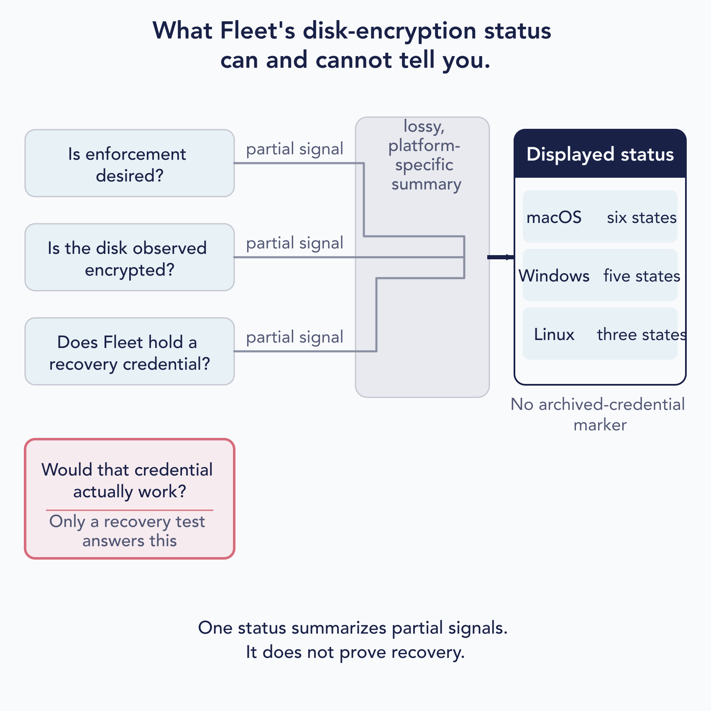

# Enforce disk encryption and manage recovery credentials

The four states below are the part to memorize: desired, observed encrypted, credential escrowed, and credential proven. Fleet can show the first three imperfectly and cannot prove the fourth.

**Fleet offers one fleet-scoped control, and one shared surface for status and retrieval, over three platform-specific mechanisms.** Licensing, scoping, storage, permissions and audit logging are shared. The pipelines underneath barely resemble each other, and on one platform Fleet cannot turn encryption on at all.

Fleet's enforcement, escrow, status interpretation, and Recovery Lock controls described here require Premium. Revealing a key Fleet already holds is Premium in practice too, because escrow is, though the retrieval itself carries no licence check.

**This chapter explains which credentials exist, what they unlock, who may reveal them, and how their lifecycle changes. It does not publish credential-retrieval paths.**

## Separate desired enforcement, observed encryption, escrow, and recovery proof

 Administrators need answers to four separate questions. Fleet exposes one lossy, platform-specific status summary, and it cannot answer the fourth.

1. **Is enforcement desired?** You have told Fleet you want this fleet encrypted.
2. **Is the disk observed encrypted?** The device reports that it is.
3. **Does Fleet hold a recovery credential?** Separate from the above, and not implied by it.
4. **Would that credential actually work?** Separate again, and **nothing in Fleet answers it.** No signal from this question reaches the status at all.

**A disk can be encrypted while Fleet holds no usable credential for it.** And Fleet can create and escrow a credential for a disk it did not encrypt. Enforcement and escrow are not independent switches you can set, but they are independent *facts* you can be in.

> **The status is a summary of partial signals, not a reading of those four.** The set of values differs by platform: six on macOS, five on Windows, three on Linux. It does not label "the disk is encrypted" and "Fleet has a key" as separate fields, and **it does not mark a credential as archived when it serves you one.** Read it as a summary, and answer the fourth question yourself.

<!-- IMAGE-TODO: assets/5.8-four-claims-one-status.webp
     PROMPT WRITTEN 2026-08-28 by the independent reviewer, against the chapter as corrected
     after its review round. Do not hand-edit; a hand-edited prompt is a new claim.
     Landscape 16:9 flat-vector diagram titled "What Fleet's disk-encryption status
     can and cannot tell you." Build a clear left-to-right composition with four stacked
     administrator questions on the left, a narrow summary band in the middle, and one
     displayed-status panel on the right.
     The first three questions are matching quiet-filled rounded rectangles labelled, in
     order: "Is enforcement desired?", "Is the disk observed encrypted?", and "Does Fleet
     hold a recovery credential?" Draw exactly three separate partial-signal lines from these
     three boxes into the middle band. Label each line "partial signal" in small secondary
     text. The lines may converge only after entering the band. Do not imply that any one
     signal answers another question.
     The middle band is translucent and labelled "lossy, platform-specific summary". Make it
     visibly narrower than the question and status panels, like a compression stage rather
     than another data source. A single heavier arrow leaves this band and enters the
     displayed-status panel.
     The fourth question, "Would that credential actually work?", sits below the first three
     in its own distinct warning outline. Inside the same outline, add the sentence "Only a
     recovery test answers this". Use a rose warning stroke at full strength and a very light
     rose tint within the box. This fourth question connects to NOTHING: no arrow, line,
     branch, dotted path, bracket, alignment rail, or visual continuation may run from it to
     the summary band or displayed status. Preserve obvious whitespace around its right edge
     so its isolation is unmistakable. Do not draw four inputs collapsing into one.
     On the right, make "Displayed status" the visual anchor. Use a solid #192147 heading band
     with white heading text above a quiet neutral panel containing exactly three horizontal
     platform rows: "macOS" with "six states", "Windows" with "five states", and "Linux" with
     "three states". Keep all three rows equal in visual weight; do not illustrate or enumerate
     the individual states. Directly beneath the panel, centered and clearly associated with
     it, place the secondary note "No archived-credential marker". Do not connect that note
     to the isolated fourth question.
     Caption: "One status summarizes partial signals. It does not prove recovery."
     Use a clean humanist sans-serif with sentence case throughout. Keep the title and panel
     heading strong, question labels medium weight, and connector labels and notes smaller but
     fully legible. Render every specified label exactly once. Avoid decorative lettering,
     condensed type, all-caps labels, and tiny text. Maintain generous whitespace and make the
     diagram legible at half-page width.
     PALETTE. Two sets, doing different jobs.
     STRUCTURE, the Fleet Black ramp and neutrals: #192147 for the most important marks,
     #515774 for ordinary labels, #8B8FA2 and #C5C7D1 for secondary structure, #E2E4EA for
     grouping bands, #F9FAFC background, #D3E8F3 and #E8F1F6 for quiet fills. All text stays
     in this set except white text on the solid #192147 heading band; do not tint type.
     THE FLEET DOTS, the six accent colours taken from Fleet's own logo mark: #5CABDF sky
     blue, #3AEFC4 mint, #63C740 green, #C98DEF lavender, #FAA669 apricot, #D66C7B rose.
     Fleet Green #009A7D sits alongside them. These are soft and pastel, so they work as
     fills with #192147 text on top.
     STRENGTH. Use a dot colour at full strength only for small marks: an arrow, a chip, a
     single filled icon, a rule, or the warning outline. Over any large area, use it at
     roughly a 20 to 25 percent tint, so a panel reads as tinted rather than painted. Large
     areas at full saturation look like a children's infographic, not a technical manual.
     Do not colour a panel that has no content in it; colour has to carry meaning.
     HOW TO USE THE DOTS. Use neutral structure for the three partial signals and the
     displayed-status panel. Reserve D66C7B rose for the isolated recovery-test warning so
     colour reinforces the one distinction the reader must not miss. Do not spread the other
     accent colours across questions or platform rows merely to make the diagram lively.
     GIVE IT WEIGHT. The solid #192147 "Displayed status" heading is the anchor. Make the
     three incoming partial-signal lines lighter than the arrow leaving the lossy-summary
     band, and make all incidental scaffolding lighter still.
     Use geometry and typography only. No security clip-art and no pictograms suggesting
     protection or successful recovery. Specifically, no padlocks, shields, keys, vaults,
     fingerprints, hard-drive icons, checkmarks, badges, seals, or secure-status symbols.
     Do not depict a credential unlocking anything.
     Never invent a colour outside these two sets. Flat vector, generous whitespace, no
     gradients, no drop shadows, no 3D or photorealistic elements, no faux application
     screenshot, no logo, no watermark. NOTE: "Fleet" here is a software product for managing
     computers. Never draw vehicles, cars, vans, trucks, ships or aircraft. Never use an
     em-dash in rendered text.
-->

## Check licensing, prerequisites, compatibility, and competing configuration

| | macOS | Windows | Linux |
|---|---|---|---|
| **Can Fleet turn encryption on?** | Yes | Yes | **No** |
| **What the setting does there** | Enforces and escrows | Enforces and escrows | **Escrow only** |
| **Already-encrypted disk** | Existing credential invalidated | Existing credential invalidated **and removed from the device** | Left alone |
| **Who starts escrow** | Fleet | Fleet | **The end user, from their own device page** |

**On Linux the switch is escrow-only.** Fleet cannot enable LUKS, and refuses escrow until the disk is already encrypted. If your Linux estate is not encrypted, this feature will not encrypt it.

**Prerequisites, because an unmet one looks exactly like a switch that does nothing.** Every platform needs fleetd. Beyond that: macOS needs Fleet's Apple MDM; Windows needs Fleet's Windows MDM, a non-server edition of Windows, and a working TPM; Linux needs a supported distribution with LUKS2, the local encryption utilities present, and a recent enough fleetd. Recovery Lock additionally needs Apple silicon and MDM enrolment. See [3.2](../03-connect-devices/3.2-enroll-macos-devices.md), [3.3](../03-connect-devices/3.3-enroll-windows-devices.md) and [3.4](../03-connect-devices/3.4-enroll-linux-devices.md) for the full matrices rather than duplicating them here.

**Competing configuration is refused.** A custom FileVault profile is rejected while built-in enforcement is on, unless a deployment-wide escape hatch is enabled. That escape hatch is Premium, applies to the whole deployment rather than one fleet, and **also disarms the equivalent guard for BitLocker**. Turning it on to solve one macOS problem quietly removes a protection on Windows.

On Windows, encryption and the startup PIN are locked together as one decision rather than two.

## Enforce FileVault and escrow a personal recovery key

 Fleet sends a profile; macOS asks the user; the key comes back.

The observable sequence:

1. Enforcement is turned on for the fleet and the profile reaches the Mac.
2. **The user is prompted**, and must act. FileVault enablement is not silent on macOS.
3. macOS generates a **personal recovery key**.
4. That key is escrowed to Fleet.
5. Fleet reports the host as encrypted with a credential held.

**An already-encrypted Mac takes a different path.** Fleet does not accept whatever credential exists; it arranges a new one it can hold, and the pre-existing recovery credential stops being the one that matters. If your organisation has recovery keys recorded from before Fleet, do not assume they remain valid.

## Enforce BitLocker and escrow a numerical-password protector

 The agent does the work here, not MDM.

What Fleet escrows is a **numerical password protector**. That is a specific BitLocker construct, not "the BitLocker key", and the distinction matters when you are talking to someone who knows BitLocker well.

**Fleet runs this flow silently.** Any prompt or message the user sees comes from Windows, not from Fleet. Do not plan communications on the assumption that Fleet will explain anything to them.

**An already-encrypted Windows disk has its existing recovery credential invalidated and removed from the device.** That is more assertive than the macOS equivalent, and worth knowing before you switch enforcement on across machines somebody else encrypted.

## Require a BitLocker startup PIN

 Fleet can require a pre-boot PIN on Windows hosts, and it never sets the PIN itself. The administrator turns the requirement on, the user creates the PIN through Windows, and Fleet detects it and folds it into status.

**Turn it on under OS settings, in the disk-encryption card's Advanced options.** The control is the `windows_require_bitlocker_pin` setting, and it rides in the same request as disk-encryption enforcement, which is why the two are one decision rather than two. GitOps refuses to disable disk encryption while the PIN requirement is on, and the checkbox is unavailable while a deployment is managed by GitOps. Once the requirement is set, an affected host has to carry a TPM-plus-PIN protector to count as compliant.

<!-- SCREENSHOT: OS settings, the Disk encryption card, with Advanced options expanded to show the "Require the end user to set a BitLocker PIN" checkbox. Crop to the card. -->

**Fleet does not choose or deliver the PIN.** The My Device page offers the user a Create PIN dialog, and that dialog is instructions rather than an input box: it walks them through Windows' own Manage BitLocker tool, from Start, to "Change how the drive is unlocked at startup", to entering a PIN, and then tells them to close the dialog and refetch on My Device so the new state is reported. The PIN never travels to Fleet.

**Enforcement is by status, not by a block.** A required PIN folds into the BitLocker status the way encryption does: a host reads as Verified or Verifying only if the PIN is present, and a host that would otherwise be Verified but has no PIN drops to Action required rather than being stopped from working. Because the signal is host-reported, the state changes after the host's next routine detail refresh, which an explicit My Device refetch simply brings forward.

**Fleet knows whether the PIN is set by asking the host.** Its osquery query reads the `bitlocker_key_protectors` table for protector types 4 or 6, the TPM-plus-PIN protectors, on the `C:` volume, and records the result as a `tpm_pin_set` boolean. That boolean is what the status logic reads, and it is why the Create PIN flow ends with a refetch rather than an immediate change in the console.

## Escrow recovery material from an already-encrypted LUKS host

 The odd one out, and the section most likely to surprise.

**Fleet cannot encrypt a Linux disk.** The setting only arranges escrow, and escrow is refused until LUKS is already in place.

**Only the end user can start it**, from their own device page, and they need their passphrase to do it. There is no administrator action that causes a Linux host to escrow. **It is one-shot**: not something Fleet retries or picks up on a later cycle.

> **There is no administrator-initiated Linux escrow.** No action available to you causes a Linux host to escrow, and none is coming on a later cycle. If you are waiting for one, it will not arrive.

TPM-backed Ubuntu is a distinct case. The observable difference is that escrow happens without the user being prompted for a passphrase, and what Fleet ends up holding is its own recovery credential rather than the one the platform uses day to day.

## Read compound status without overclaiming recovery

 The status answers fewer questions than it appears to.

**Fleet's "verification" is not a recovery test.** At best it establishes that the server can read back what it stored. It does not prove a credential will unlock a disk, because nothing tries.

> **And on Windows and Linux, no scheduled check runs at all.** A credential is marked usable at the moment it is escrowed. The indicator you are reading on those platforms is a default rather than a result. A reveal still attempts to decrypt the stored value, so a successful reveal tells you more than the indicator does.

On Windows one displayed status covers two unrelated causes, and the explanatory tooltip names only one of them. If you see that status and the stated cause does not fit the host, consider the other.

**To establish that you could actually recover a machine, recover a machine.** Take one host out of production, reveal its credential, and use it. That is different in kind from anything Fleet's status can tell you, and it is the only thing that answers the fourth claim.

## Reveal, validate, and repair disk-recovery credentials safely

**The operator path is the host details page, the Actions menu, then Show disk encryption key.** The option is present only when Fleet holds a credential for the host, current or archived, and it is disabled while the encryption profile is still pending or has failed. Selecting it reads the host's `encryption_key` endpoint, which decrypts the stored value and returns it to a modal on screen.

<!-- SCREENSHOT: Host details page with the Actions dropdown open and "Show disk encryption key" highlighted, and the resulting "Disk encryption key" modal showing a revealed key. Crop to the menu and the modal. -->

**Who can reveal a credential:** anyone who can read the host, which is a wider group than those who can change anything. Retrieval is per host. **Fleet records a successful read as an activity**, so revealing a credential leaves a trace with your name on it, by design. That record is written only after the decrypt succeeds. A retrieval that cannot decrypt returns an error and writes no read activity, so a failed attempt leaves nothing in the activity feed.

**Fleet may serve you an archived credential**, and **the interface does not tell you which you received.** It tries the current stored key first; if that key is missing or fails to decrypt, it falls back to the newest archived entry and returns that in the current one's place, without marking the difference. If a revealed credential does not work, that silent substitution is worth ruling out early.

The archive is a one-deep fallback, not a history you can page through. A different, non-empty key is copied into it when the host's stored key changes, and **only the newest archived entry is ever retrievable**: earlier keys are not reachable through Fleet.

**When nothing Fleet holds can be decrypted, the reveal returns one generic message**: that the decryption certificate and key are invalid because MDM has been turned off. **That text is the same on every platform**, Windows and Linux included, where Apple MDM plays no part. Read it as "Fleet could not decrypt what it holds", then diagnose the platform's own decrypt dependency rather than the Apple wording ([8.6](../08-troubleshooting/8.6-server-state.md#host_disk_encryption_keys) reads the escrow record, including the column that says why a key is not decryptable).

**Revealing a disk-recovery key does not rotate it.** Reading here is passive: Fleet decrypts, logs the activity, and returns the value, and the stored credential is unchanged. That is the opposite of Recovery Lock and the managed local administrator password, where a reveal schedules a rotation. You can show a FileVault, BitLocker or LUKS key as often as you need without changing it.

**Each platform decrypts with different server-side material.** Linux uses the Fleet server private key directly, Windows the current Windows enrolment certificate and key, and macOS the Apple MDM certificate authority assets. The macOS path keeps rolled-over authority certificates, so a key escrowed under a previous certificate authority still decrypts; the Windows path uses only the current enrolment identity, which is why a routine enrolment-certificate renewal can quietly break BitLocker retrieval. The rollover asymmetry and the safe renewal order are covered under [certificate and key material](#certificate-and-key-material) below, and the material itself is inventoried in [7.6](../07-operate-fleet/7.6-maintain-credentials-certificates-and-access.md#inventory-operational-trust-material).

**Revealing a key is Premium in practice, not by a check on the read.** The escrow that fills the store is Premium, so a Free deployment has no ordinary way to put a key there to read back. The retrieval itself applies no separate licence test, so a deployment that already holds escrowed data, for instance one downgraded to Free, can still reach it.

**Handle the value like the credential it is.** Move it through whatever channel your organisation uses for secrets, not through a ticket or a chat message. Rotate or re-escrow after a disclosure that went somewhere it should not have.

**"Repair" is platform-specific.** There is no universal rotate action that works everywhere, and what is possible on one platform may have no equivalent on another.

## Survive re-enrollment, scope changes, disablement, certificate rollover, and archives

 This is the section to read before an infrastructure change, not after one.

### Turning enforcement off

**Disabling is read-preserving and write-stopping.** Nothing decrypts, nothing already held is deleted, and you can still retrieve what Fleet has. What stops is new escrow.

**Recovery Lock behaves differently: disabling it removes the credential.** Do not reason from one to the other.

### Moving a host between fleets

**A fleet move deletes the live credential when the destination fleet does not enforce encryption, and preserves it when the destination does.** That is the rule, and it is a sensible one: a fleet that will not escrow does not keep what it will never refresh.

The part to know is *how Fleet decides*. It looks for exactly one thing, Fleet's own FileVault configuration profile on the destination fleet, and uses its presence as the answer for **all three platforms**. In a deployment with Windows MDM and no Apple MDM, that profile does not exist on any fleet, so the destination always looks like one that does not enforce encryption, and **every fleet move deletes escrowed BitLocker credentials.** If you run Windows without Apple MDM, treat a fleet move as a de-escrow and confirm the behaviour on one host before doing it in bulk.

### Re-enrollment

**macOS and Windows re-escrow automatically. Linux never does.** Because only the end user can start Linux escrow, a re-enrolled Linux host has no credential in Fleet until that person goes and does it again. If you re-enroll Linux machines in bulk, you have silently de-escrowed them.

### Certificate and key material

Each platform depends on different server-side material, and **the three are independent**:

| Platform | What must survive for held credentials to stay readable |
|---|---|
| **macOS** | The Apple MDM CA private key, **and** the Fleet server private key that protects it |
| **Windows** | **The Windows enrolment identity certificate and key.** The server private key is not involved |
| **Linux** | The Fleet server private key, directly |

Two consequences require a pre-change recovery plan.

> **Renewing or replacing the Windows enrolment certificate can make every escrowed BitLocker credential unreadable through Fleet**, even when the key pair is reused. Fleet decrypts using the current certificate identity, and unlike macOS it keeps no fallback to a historical certificate. A routine, scheduled renewal is enough.
>
> **And Fleet will go on telling you those credentials are available.** Windows escrow is marked usable when it arrives and is excluded from later re-checking, so the status you read afterwards is the one recorded before the change. The indicator says yes and the retrieval fails.
>
> **Removing Apple MDM and re-adding it are two separate harms, and the first one is immediate.** Removing it deactivates the Apple certificate authority material along with the push certificate, so **FileVault retrieval stops working straight away**. Reconfiguring afterwards then mints a new certificate authority key, and credentials escrowed under the previous one are no longer reachable through Fleet's active decryption path. Nothing warns you at either moment.
>
> **So never remove Apple MDM as part of renewing the push certificate.** Upload the renewed certificate over the existing configuration. If it has already been removed, **stop before reconfiguring**: preserve the database, the backups and the server private key, and treat it as an incident rather than a next step.

In both cases the loss is silent, and you discover it at the worst possible moment: when somebody needs a key. Recovery is possible only if the original certificate and key material, or a suitable backup, can be restored. **Before any change to this material, secure what you currently hold**, and plan as though the change were irreversible.

## Manage Recovery Lock as a separate Apple credential

 A different credential from the FileVault key, guarding a different thing, and behaving unlike anything else in this chapter.

Recovery Lock protects access to a Mac's recovery environment. It has its own control, its own status, and its own lifecycle.

> **Viewing it schedules its rotation.** Revealing the password marks it as viewed and sets a rotation due about an hour later. The hour is a floor on when Fleet starts, not a guarantee of when the old value stops working: the replacement is delivered as a command like any other, so completion depends on the device.
>
> **Each reveal resets that clock**, so repeated viewing pushes rotation further out rather than triggering it sooner.

Two operational consequences follow.

**Anyone who can read the host can reveal it**, which is a wider group than the administrators and maintainers who can explicitly rotate it. So a read by someone with no authority to change the credential nonetheless causes it to change.

**Do not reveal it to check it.** On every other credential in this chapter, looking is passive. Here it is not.

**Disabling Recovery Lock removes the credential, but not at the moment you disable it.** Fleet schedules a clear, sends it to the Mac as a command, and deletes what it holds once the Mac acknowledges. Until then the password remains readable. So disablement is a request with a device-dependent completion, like most things in [5.7](5.7-control-devices-and-send-mdm-commands.md). If the Mac never checks in, Fleet still holds a credential for a lock that is supposed to be gone.

That is the opposite of disabling disk-encryption enforcement, which preserves what Fleet holds indefinitely and by design. The two switches sit near each other and end in different places.
