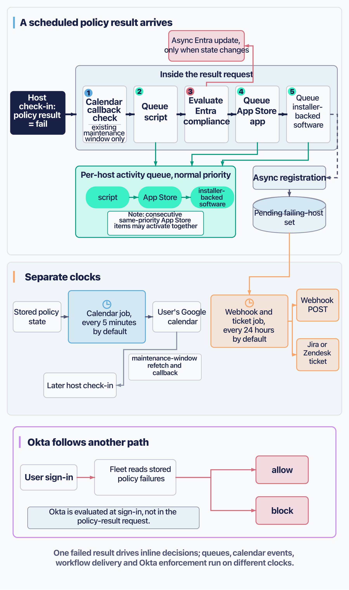

# Automate responses to policy failures

A policy asks a yes-or-no question of a host on a schedule. An automation is what Fleet does when the answer is no.

**A policy automation is not a general workflow engine.** It turns a scheduled per-host failure into one or more predefined responses. There are no dependencies, no branching, no ordering you control, and no transaction across responses. **It is safe only when the response, the trigger mode, and the policy's own definition of success form a bounded loop**, and nothing in Fleet checks that they do.

The chapter is titled "responses" rather than "remediation" deliberately. Only the endpoint responses try to change the host. The others open a ticket, book a meeting, or stop somebody signing in.

[4.3](../04-know-your-devices/4.3-use-policies-for-compliance.md) owns what a policy is, how its query is written, and what pass, fail and no-answer mean. This chapter starts after that.

## Start from a scheduled failing policy result

 One specific kind of result triggers an automation, and it is easy to assume the others do too.

**Only a scheduled policy result can trigger an automation.** Fleet sends policy queries to a host roughly hourly, and the answers arrive on the host's ordinary check-in. Running a policy live from the interface takes a different path and triggers nothing.

Three outcomes, and only one of them is a trigger:

| The host reports | Meaning | Triggers? |
|---|---|---|
| **Fail** | The query ran and returned no rows | **Yes** |
| **Pass** | The query ran and returned rows | No |
| **No answer** | The query did not run, or errored | **No, and this matters more than it looks** |

**A no-answer is not a failure, and Fleet does not treat it as one.** Results it never received are filtered out before any trigger logic runs.

> **The structural fact that shapes everything else: there is no cron for the responses that touch a host.** Software installs, App Store installs, script runs and **Entra** compliance evaluation are all decided inside the request that delivers the failing result, one after another, before Fleet replies to the agent. Webhooks, tickets and calendar events are deferred to scheduled jobs, and Okta takes a different path again, evaluating at sign-in rather than here.
>
> So the endpoint responses are as timely as the host's check-in, and the rest run on clocks you may not have looked at. **The webhook and ticket job runs every 24 hours by default; the calendar job runs every five minutes.**

<!-- IMAGE-TODO: assets/5.9-what-fires-when.webp
     PROMPT WRITTEN 2026-08-28 by the independent reviewer, against the chapter as
     corrected after its review round rather than as first drafted. Do not hand-edit
     this prompt; a hand-edited prompt is a new claim and needs checking like any other.
     PROMPT: DIAGRAM: Landscape 16:9 flat-vector timing and routing diagram for a technical manual.

     The diagram has three horizontal bands sharing a left-to-right time direction.

     TOP BAND, headed "A scheduled policy result arrives":
     At far left, a solid #192147 card with #F9FAFC text: "Host check-in: policy result = fail".
     Connect it into a large pale neutral container headed "Inside the result request".
     Inside that container, show five numbered decision boxes in this exact left-to-right order:
     1. "Calendar callback check" with smaller text "existing maintenance window only"
     2. "Queue script"
     3. "Evaluate Entra compliance"
     4. "Queue App Store app"
     5. "Queue installer-backed software"

     These are sequential decisions, not parallel execution and not administrator-controlled ordering.
     Do not imply that every box fires for every policy.

     From "Evaluate Entra compliance", draw a thin arrow leaving the request container to a rose-tinted
     card labelled "Async Entra update, only when state changes".

     From the three queue boxes, draw arrows to one mint-tinted card below the request container labelled
     "Per-host activity queue, normal priority". Inside it show three small ordered chips:
     "script", "App Store", "installer-backed software".
     Add a small note beside the App Store chip: "consecutive same-priority App Store items may activate
     together". Do not draw all queue work as concurrent.

     After the fifth decision box, show a dashed arrow leaving the request container to a small card
     labelled "Async registration" and then to a cylinder labelled "Pending failing-host set".
     The dashed treatment matters: Fleet starts this registration without waiting for it before replying
     to the host.

     MIDDLE BAND, headed "Separate clocks":
     On the left, show "Stored policy state" flowing into a clock card labelled
     "Calendar job, every 5 minutes by default", then to "User's Google calendar".
     A thin return arrow from the calendar card should point toward a later host check-in and be labelled
     "maintenance-window refetch and callback". Do not draw calendar event creation as part of the
     original result request.

     On the right, connect the "Pending failing-host set" from the top band to a clock card labelled
     "Webhook and ticket job, every 24 hours by default", then split to two destination cards:
     "Webhook POST" and "Jira or Zendesk ticket".
     Do not draw the scheduled job feeding scripts, App Store apps, packages or Entra.

     BOTTOM BAND, a compact inset headed "Okta follows another path":
     Show "User sign-in" flowing to "Fleet reads stored policy failures" and then to two outcomes,
     "allow" and "block".
     Add the note: "Okta is evaluated at sign-in, not in the policy-result request."
     Keep this inset visually separate from Entra.

     Caption: "One failed result drives inline decisions; queues, calendar events, workflow delivery and
     Okta enforcement run on different clocks."

     PALETTE. Two sets, doing different jobs.
     STRUCTURE, the Fleet Black ramp and neutrals: #192147 for the most important marks, #515774 for
     ordinary labels, #8B8FA2 and #C5C7D1 for secondary structure, #E2E4EA for grouping bands,
     #F9FAFC background, #D3E8F3 and #E8F1F6 for quiet fills. All text stays in this set; do not tint type.
     THE FLEET DOTS: #5CABDF sky blue, #3AEFC4 mint, #63C740 green, #C98DEF lavender, #FAA669 apricot,
     #D66C7B rose, with Fleet Green #009A7D alongside them.
     Use mint consistently for the host queue, apricot for scheduled workflow delivery, and rose for
     access decisions. Use accent colours at full strength only for small rules, chips and arrowheads;
     use roughly 20 to 25 percent tints over larger cards.
     Make the initial check-in card the solid visual anchor. Vary stroke weight so the main result path is
     heavier than return arrows and timing scaffolding.
     Never invent a colour outside these sets. Flat vector, generous whitespace, no gradients, no drop
     shadows, no 3D, no photorealistic icons, no logo and no watermark. Legible at half-page width.
     "Fleet" means endpoint-management software: never draw vehicles, ships or aircraft.
     Never use an em dash in rendered text.
-->

## Choose an endpoint, workflow, calendar, or access response

 Seven responses, four kinds, and they behave nothing like each other.

| Response | Kind | What it does | Scope |
|---|---|---|---|
| **Install software** | Endpoint | Installs installer-backed software: a custom package or a Fleet-maintained app | Fleet only |
| **Install App Store app** | Endpoint | Installs a purchased Apple app | Fleet only, macOS |
| **Run script** | Endpoint | Runs a saved script | Fleet only |
| **Webhook** | Workflow | POSTs to a URL you choose | Global or per fleet |
| **Jira or Zendesk ticket** | Workflow | Opens one ticket | Global or per fleet |
| **Calendar event** | Calendar | Books a maintenance window on the user's calendar | Named fleets only |
| **Conditional access** | Access | Marks the host non-compliant to your identity provider | Fleet only |

**Several can sit on one policy at once**, and they do not coordinate. A policy can install a package, open a ticket and block sign-in for the same failure, with nothing linking the three and no ordering you can rely on.

**The workflow responses are alternatives, not additions.** Within one scope Fleet normally permits a webhook, or Jira, or Zendesk, not several at once.

**Calendar has more prerequisites than the others and its own clock.** It needs the Google Calendar integration configured globally, enablement on the fleet, and a user email for the host in the configured domain. Its job runs every five minutes rather than on the webhook and ticket job's daily cycle. A host with no matching email is skipped silently.

Two boundaries to know before you plan around this:

**Endpoint responses cannot be attached to an "All fleets" policy.** Neither can conditional access or continuous mode. Fleet rejects them. Calendar is the exception, and not in a good way: it is accepted, saved, shown back to you, and **can never fire**, because the job that creates events only ever looks at named fleets. The same is true of a No-team policy.

**The App Store option is reached through Install software**, not as a separate choice. It is one selector with two kinds of thing behind it.

## Design a transition-based or continuous closed loop

 This is the section that decides whether your automation is safe.

By default an endpoint response fires on a host's **first failure, or on a pass turning into a fail**. A host that simply keeps failing does not re-trigger it. Turn on **continuous automations** and the same three responses fire on every failing result instead.

**Continuous mode changes only software, App Store apps and scripts.** Webhooks, tickets, calendar events and conditional access are unaffected by it.

### The asymmetry that will confuse you first

**A successful install asks the host to refetch, and a successful script does not.**

That one difference sets how fast you learn whether the response worked:

| After a successful… | The policy re-runs | So you see the result |
|---|---|---|
| **Software or App Store install** | On the host's next check-in | **In about ten seconds** |
| **Script** | At the ordinary policy cadence | **In up to about an hour** |

> **A script that ran successfully next to a policy that still says failing is the normal state of affairs for the next hour.** Nothing is wrong. Do not build a runbook, or a second automation, around that gap.

A refetch requested for any other reason will pull the script's verification forward too, so the hour is a ceiling rather than a schedule.

### The loop that does not close

**Fleet has no idea whether your remediation fixes your policy.** There is no convergence check anywhere: no oscillation detector, no circuit breaker, no counter you can read.

What happens when a response succeeds without making the policy pass depends entirely on the trigger mode, and the default is quieter than people expect:

- **Transition-based.** The response fires once. The host is already recorded as failing, so no later result is a transition, and **nothing happens again.** No retry, because retries only cover responses that *failed*. No activity, no warning. It stays that way until something re-arms the policy, and the last section lists what does.
- **Continuous.** The response fires again on every failing result, damped differently per type. An install is limited to one per policy interval once it has succeeded. **A script has no such limit** and runs each time.

Neither is wrong, but they fail in opposite directions: one goes silent, the other repeats.

> **Three things have to hold together, and Fleet validates none of the relationships between them.** Make the response safe to repeat ([5.3](5.3-run-and-manage-scripts.md) on idempotent scripts, [5.4](5.4-manage-software-and-applications.md) on repeated installs). Choose the trigger mode by deciding which failure you can live with, silence or repetition. And write the policy query so that it passes only once the response has actually taken effect, and so that osquery can see the difference.
>
> That is the safety argument. Everything else in this chapter is a consequence of it.

### How no-answer re-arms transition mode

There is one way to get repeated firing without continuous mode, and it is easy to hit.

**A policy whose query intermittently errors on a host alternates between "failing" and "no answer".** Fleet stores the no-answer over the previous value, so the next genuine failure looks like a brand-new first failure. Every recovery re-fires the response and re-registers the host for a webhook or ticket, with no cooldown in the way, because as far as Fleet is concerned this is a fresh transition.

A missing table, an extension that is not always loaded, a permissions problem on some hosts and not others. **If an automation is firing repeatedly and you have not turned on continuous mode, this is the first thing to check.**

## Validate policy, action, scope, and transport compatibility

 Most of what silently never fires is decided here.

Fleet checks a good deal when you save a policy: that the platform tokens are real, that labels exist and are visible, that the script or installer belongs to the same fleet, that an App Store app is macOS, that conditional access is only on macOS or Windows, that endpoint responses and continuous mode are not on an "All fleets" policy.

**What it does not check is more useful to know.**

| Not checked at save time | What happens instead |
|---|---|
| **Whether the installer's platform matches the policy's** | Accepted. At runtime the host is skipped, at debug log level only |
| **Whether the script's type matches the policy's platform** | The same |
| **Whether the installer's label scope overlaps the policy's** | Accepted. See below, because this one is worse than it sounds |
| **Agent version** | Never checked. A host without fleetd silently gets nothing |

Runtime adds its own gates that have no save-time equivalent: the host needs fleetd, scripts must be enabled both globally and on the host, and an App Store install needs Apple MDM.

:::note Fixed in 4.90.1
On Fleet 4.90.0 a policy automation could act on an App Store app that was added for a platform other than the host's, rather than skipping it. Fleet 4.90.1 fixes this.
:::

> **The label-scope trap.** If a policy fails on a host that the attached installer is not scoped to, Fleet rewrites that host's result from failing to "did not run", deliberately, so the policy does not show as failed in host details.
>
> But conditional access has already read the original failing result and acted on it, because it runs earlier in the same request. The webhook and ticket filter runs afterwards and sees the blank.
>
> **So one failure produces a host that your identity provider has been told is non-compliant, that Fleet's own interface says is not failing, and that generates no notification to tell you the two disagree.** The suppression appears only in a debug log line.

### The configuration contract for tickets

**Jira and Zendesk read their list of policies from the webhook settings block.** Not from the integration's own configuration. If a policy's ID is not in `webhook_settings.failing_policies_webhook.policy_ids`, no ticket is ever created for it, whether or not the webhook itself is enabled.

The interface and the GitOps `webhooks_and_tickets_enabled` shorthand both populate that list for you. **Anyone writing the YAML directly must know it**, because the shipped configuration reference describes the field as governing webhooks only. A configuration that follows the documentation validates, saves, and never fires.

### Conditional access is two systems wearing one checkbox

This is the least obvious thing in the chapter.

| | **Microsoft Entra** | **Okta** |
|---|---|---|
| What Fleet does | Reports compliance; Microsoft blocks | **Fleet is the identity provider** and refuses the sign-in itself |
| When it evaluates | On policy results arriving | **On every sign-in attempt** |
| What it reads | The current submission | **Stored pass/fail state** |
| Platforms | macOS and Windows | macOS in practice |

They share the per-policy checkbox and they share the fleet-level toggle. **Only Entra reads that toggle.**

> **Turning conditional access off for a fleet stops Fleet reporting to Entra. It does not stop Okta blocking sign-in.** Okta keeps enforcing every policy that carries the flag. To stop that, remove the flag from the policies.
>
> Disabling also does not tell Entra anything. Whatever compliance state Fleet last pushed is the state Entra keeps. **Reconcile it there; Fleet will not.**

**Both systems treat unknown as fine.** Entra ignores a policy absent from the submission; Okta counts only recorded failures, so a policy that has never run on a host does not block it. A host that stops answering does not become non-compliant.

**The bypass is granted by the end user, from their own device page**, and it is not a time window despite what the interface suggests: it is **one sign-in**. It cannot be granted or consumed while a critical conditional-access policy is failing, and if the host is healthy at the next sign-in the bypass sits unused indefinitely.

If you run Okta conditional access, one deployment fact is a prerequisite rather than hardening: **terminate mTLS at a proxy that requires and verifies Fleet's conditional-access client certificate, overwrite `X-Client-Cert-Serial` with the verified certificate's serial number, and strip any client-supplied value on every other route and listener that can reach Fleet.**

## Bound queueing, duplicate work, cooldown, and retries

 Four separate controls that are easy to confuse for one.

**Re-fire** is the policy deciding to act again. **Retry** is one response trying again after failing. **Duplicate suppression** stops two policies queueing the same work. **Cooldown** damps continuous mode. They are independent.

### Retries

| Response | Budget | Shape |
|---|---|---|
| **Script** | **3 attempts total** | The first run plus two retries, immediately, while the policy still reads as failing |
| **Custom package** | **3 attempts total** | The same. A retry re-resolves to the currently active package, so a version change mid-sequence installs the new one |
| **App Store app** | **3 retries after the first send** | A different mechanism at a different layer, with its own counter |

The App Store difference is deliberate and acknowledged in Fleet's own source. **Do not carry the "three attempts" number across to it**, and note that its retries respond to delivery errors rather than to the policy. One case is terminal and never retried: an app the user already installed personally on a BYOD device.

**Continuous mode re-arms the script and package budget before each new run**, so a continuously failing policy can start a fresh three-attempt sequence indefinitely.

**App Store re-firing does not reset the old counter.** It creates a new install record with a counter of its own, which is why the two budgets never have to be reconciled against each other.

### Cooldown

There is exactly one, and it is narrower than its name suggests. **A continuous automation will not re-install more than once per policy interval, and only after a successful install.** It exists to break the loop where a successful install triggers a refetch, which re-runs the policy, which triggers another install.

**Scripts have no cooldown, deliberately**, because a script does not request a refetch and so cannot form that loop. A failed install is not throttled either; that case belongs to the retry budget.

### Queueing and duplicates

Policy work joins the host's ordinary queue at normal priority, behind anything from a setup experience. Within one check-in the order is fixed: **scripts, then App Store apps, then packages.** You cannot change it, and there is no dependency mechanism.

Fleet does suppress some duplicates: the same script already pending on a host, a package install already pending for that installer, an App Store install already queued for that app. **Two policies pointing at one script or one package therefore collapse into a single execution**, and which policy gets recorded as the cause is not defined. What Fleet does not offer is exactly-once semantics across completed runs.

:::note Fixed in 4.90.1
On Fleet 4.90.0 the App Store side of that suppression did not hold when a host's upcoming-activity queue was not draining, so automatic App Store updates and policy automations could still queue a duplicate install. Fleet 4.90.1 skips an app that already has an install waiting, whether or not it has reached the device.
:::

Serialisation has one exception: consecutive App Store installs at the same priority can activate together rather than strictly one at a time ([5.1](5.1-plan-target-and-govern-device-changes.md) has the exact boundary).

## Read outcomes, reset state, and provide an escape path

 What ran, how to make it run again, and how to stop it.

### Where to look

**The policy's own automation-runs view is the only surface worth using.** It shows every attempt against every host you can see, success or failure, with script output and install output where they exist. Nothing else joins a response back to the policy that caused it.

Everything else is partial. A policy-triggered script on the host timeline reads as *Fleet ran the script*, with no mention of which policy. The server records it; the interface does not show it. The global activity feed can filter to the automation types but renders them as bare machine text. Nothing anywhere shows a *pending* automation, because that view reads completed activity only.

**That view is one endpoint, and you can query it directly.** It is backed by `GET /api/latest/fleet/policies/{policy_id}/automation_activities`, the row listed in the audit-log reference ([8.12](../08-troubleshooting/8.12-audit-logs.md)). It returns one row per host per attempt, so three failed script retries against a host read as three rows, each with its own outcome, rather than one collapsed result. A `status` filter narrows it to `error` or `success`. Each row carries the outcome and, for script and install activities, the output: the combined script output, and for an install the separate pre-install-query and post-install-script output, since an install can fail at any of those stages. Rows come newest first and paginated.

**The endpoint carries no licence check; edition and scope decide what can appear in it.** Webhook and ticket automations are Free, so their rows show on any edition. A run-script automation is Free as well when the policy sits on no team: Fleet attaches and runs the script with no licence gate on that path. Scope that same script automation to a named team and it becomes Premium, because a named team is itself a Premium feature. The software-install, App Store, calendar and conditional-access responses stay Premium on any scope. So a Free instance shows webhook, ticket and no-team script rows, the last with their script output attached; the rest appear only on Premium. The endpoint is the same on both; the edition and the policy's scope set how much it has to show.

**Its reach is narrower than every attempt that ever ran.** It returns completed, still-retained activities for hosts that are currently present and visible to the caller. A deleted host drops out, because the query joins against current hosts, and its automation history goes with it. Retention can age older rows out. A GitOps-role caller meets the same visibility rule from the far end: it can read the policy and call the endpoint, but the host filter returns no rows for it, an empty result rather than a permission denial ([a.4](../09-appendices/a.4-roles-and-permissions-matrix.md) records the same outcome, that GitOps gets no automation activities).

> **There is no convergence metric.** Repeated successful runs against one host in the automation-runs view is the signal to look for, though resets, edits, scope changes and re-enrollment can produce repetition too. Pass and fail counts will not help: they are refreshed hourly and they are a level, not a rate.

### The three resets, which are not the same thing

|  | **Reset policy** | **Reset automations** | **Edit the policy** |
|---|---|---|---|
| Clears pass/fail history | **Yes, every host** | No | Only if the query, or the attached script, package or App Store app, changed |
| Refills retry budgets | **Yes** | No | **Yes, on any save, even a typo fix** |
| Re-fires webhooks and tickets | Indirectly | **Yes, and only these** | Indirectly |
| Covers installs and scripts | **Yes** | **No** | Yes |
| Records an activity | Yes | **None at all** | Yes |

Two consequences worth carrying:

**Editing a policy's description refills every host's retry budget** for that policy. It does not fire anything by itself, but a host that had exhausted its attempts becomes eligible again. **Doing the same edit through GitOps does not**, because that path never touches the counters. Two routes that look equivalent are not.

**Re-arming is not the same as re-firing.** Turning on a webhook or a calendar automation for a policy that hosts are already failing does nothing for those hosts, because there is no new transition to see. Continuous mode acts on the next failing result; attaching a *new* script, package or App Store app clears history and so does re-fire. Changing the other settings clears nothing.

### What re-arms a policy without you asking

Two host operations that an administrator would describe identically have opposite effects. **Re-enrolling a host through osquery deletes all of its policy history**, so every failing policy looks new and its responses fire again. **Re-enrolling through Orbit deletes none of it.**

Neither resets the script and package attempt counters. If that budget was already exhausted, the re-armed policy gets one new attempt and no retries. An App Store response is unaffected, because it starts a new record with a fresh counter.

Moving a host to another fleet deletes its fleet-policy history and **does not cancel work already queued for it.** A package install ordered by the old fleet still runs.

### Stopping something

Nothing here recalls work an agent already holds ([5.1](5.1-plan-target-and-govern-device-changes.md)). These stop what has not been handed over yet:

1. **Turn scripts off globally.** The bluntest control and the only real pause, because it withholds even *already-activated* script work from agents rather than merely stopping new work. It applies to every script on every host, and there is no equivalent for installs.
2. **Detach the response from the policy.** Stops future triggers, recalls nothing, and **refills every host's retry budget** as a side effect of the save.
3. **Cancel the queued item on the host.** One item at a time, and only work still waiting. **Cancelling a script that has already been activated can cause Fleet to queue it again**, because the retry check treats a cancelled execution as a failed one. The install path does not have this problem.
4. **Delete the policy.** Cancels queued package work and discards unfinished script records. **It does not cancel a queued App Store install.** That carries on, having lost its link to the policy. Deleting the whole *fleet* is worse: it removes the policies without running any of that cleanup, so queued work survives a fleet that does not.
5. **Move the host out**, which stops future triggers and leaves the queue alone.

There is no off switch for automations as a class.

### Three limitations to plan around

**Webhook deliveries are not signed**, so a receiver has to authenticate the request some other way. Treat every field as untrusted input, and expect the occasional duplicate: Fleet clears a batch only after it observes success, so a receiver that commits and then times out will see it again. Tickets have no deduplication at all, so every run creates a new one.

**Host display names arrive empty.** The pending set stores only the host's ID and hostname, so `display_name` is blank in every webhook payload and every ticket bullet renders with empty link text. Use the hostname or the ID.

**Tickets list at most 50 hosts** while the title states the full count for that job, with nothing to indicate the list was cut.

One GitOps warning belongs with these: **creating a fleet from a spec silently drops its failing-policies webhook.** A second apply installs it, because that takes the edit path. Check after the first.

---

An automation can create work on a device, invoke a system outside Fleet, or change whether somebody can sign in. **None of those becomes desired state merely because Fleet initiated it.** The next policy result is the evidence, which is where [5.1](5.1-plan-target-and-govern-device-changes.md) came in and where this part ends.
