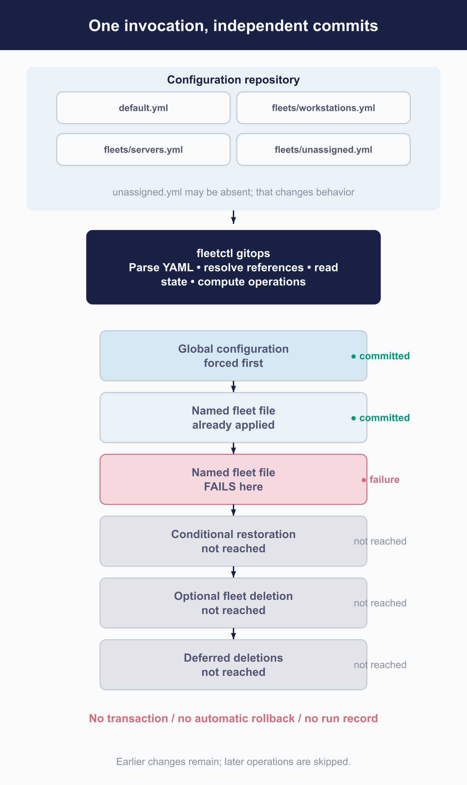

# Manage Fleet with GitOps

 GitOps is the closest Fleet comes to declarative configuration, and understanding exactly how close is the difference between a safe production practice and an expensive afternoon.

**`fleetctl gitops` is a client.** It reads your YAML, reads Fleet's current state, works out what to do, and then does it as a sequence of ordinary API calls. There is no server-side GitOps engine, no repository watcher, and **no transaction around the run**. Each operation commits on its own.

Everything that follows is a consequence of that sentence.

> **Before your first production run, three things.** Whenever the invocation includes your global file, include an explicit `unassigned.yml`. Check your deployment's effective exception settings rather than assuming them. And know that a dry run validates rather than rehearses: it is not passive, and it does not produce a plan of what would change.
>
> The rest of this chapter explains why each of those matters.

## Understand Fleet's GitOps execution model

 A client orchestrating API calls, in an order that matters.

A run proceeds like this:

1. **Preflight.** Parse every supplied file, resolve environment variables and referenced files, and read what already exists in Fleet.
2. **The global file, forced first.** Organisation settings, integrations, controls.
3. **Every remaining supplied file, in the order you supplied them.** That includes an explicit `unassigned.yml`, which is not moved to the end; it applies wherever it appears in your invocation.
4. **Conditional work.** Restoring token assignments the run cleared to get itself started, and reapplying App Store apps deferred along the way.
5. **Optional fleet deletion**, if you asked for it.
6. **A synthesised empty Unassigned apply**, but only when you supplied a global file and no explicit Unassigned one. See the warning below.
7. **Deferred label and certificate-authority deletions.**

**Nothing coordinates those steps.** If step three fails on the fourth of six files, the first three are applied, the rest are not, and nothing from steps four to seven happens. Fleet holds a configuration that exists in neither your old commit nor your new one.

**Fleet records no run-level marker or outcome.** Individual operations may leave activities behind, so a burst of them is a recognisable footprint ([8.12](../08-troubleshooting/8.12-audit-logs.md)). But nothing says which commit ran, or whether the complete invocation finished.

**There is no lock.** Two people, or a scheduled job and a person, can apply concurrently and interleave. The only serialisation is whatever your pipeline provides.



<!-- IMAGE-TODO: assets/6.2-execution-model.webp
     QUESTION: How does a failed GitOps invocation leave a partial live configuration?
     PRODUCTION REVISION: 2026-09-08, from the independent reviewer’s 2026-08-28 brief.
     Layout clarified against the current chapter; visible prose is unchanged.
     PROMPT: DIAGRAM: Use a tall, readable execution diagram. At the top show Configuration repository with
     default.yml, fleets/workstations.yml, fleets/servers.yml, and fleets/unassigned.yml.
     Note that unassigned.yml may be absent but changes behavior. Connect to a navy
     fleetctl gitops, Client-side orchestrator card: Parse all supplied YAML; Resolve environment
     and files; Read current Fleet state; Compute operations.
     Connect that client to an ordered fleet API phase rail. State Each API request commits
     independently; a file can require several requests. These are phases, not atomic file commits.
     Show: 1 Global configuration, forced first (some unassigned.yml controls folded in);
     2 First named fleet file (remaining files follow invocation order); Second named fleet file:
     failure; Explicit unassigned.yml, wherever supplied. Mark earlier changes already applied
     and all later work Not reached in this failure example. Never move explicit Unassigned last
     as a rule; this placement is one illustrative invocation.
     Follow with 3 Restore ABM / App Store assignments, conditional on a Premium multi-file run
     referencing a fleet that did not exist, then deferred App Store apps; 4 Delete absent fleets,
     optional, comparing live fleets with this invocation's supplied files; 5 Synthesized empty
     Unassigned apply, a conditional alternative only with a global file and no explicit
     unassigned.yml; 6 Deferred label and certificate-authority deletions. Keep all later phases
     readable, with muted dashed paths rather than low-contrast text. Use small applied/failure
     marks and label the skipped region. No transaction, no automatic rollback, no server-side
     GitOps run record. Do not draw a server-side GitOps engine, watcher, parallel apply, or loop.
     TERMINOLOGY: Fleet is the company, product, or server. Host groups are lowercase
     fleet/fleets, including headings and labels. Do not call these groups teams. Preserve
     exact code/API identifiers. These instructions are not text to render.
     DESIGN: Flat vector technical diagram. Fleet is software for managing computers; draw no
     vehicles. Use Inter labels and Roboto Mono identifiers. At 1400 px source width use 48 px
     titles, 36 px body labels, and at least 28 px secondary text; scale proportionally. Check at
     720 px reading width and intended print size. Use a 32 px spacing grid, at least 24 px node
     padding, and consistent corner radii. Center short node names; left-align multiline
     explanations. Never shrink text to fit. Use #F9FAFC background, #192147 headings and primary
     connectors, #515774 text, #8B8FA2 secondary connectors, #C5C7D1 borders, and #D3E8F3 or #E8F1F6
     quiet fills. Use #5CABDF and #C98DEF for named categories, #3AEFC4 for labelled positive
     outcomes, #D66C7B for labelled failures, and #FAA669 for labelled cautions. Tint large panels
     to 20 to 25 percent; full strength is for small marks. Keep text navy or slate, or off-white on
     a navy anchor. Never rely on colour alone. Use one arrowhead shape, consistent stroke weights,
     box-edge termination, and labelled branches and return paths. Keep connectors clear of text. No
     gradients, shadows, decorative icons, logo, watermark, em-dashes, or slogan footer. Render only
     the specified reader-facing labels. Choose orientation to fit the relationship, not a default
     poster. Keep captions outside the artwork. If labels crowd, split the figure before shrinking
     them. Keep editable SVG when the production method supports it.
     NOTE: Candidate remains pending the final manual-wide review. Preserve the chapter’s
     technical qualifications and prose until artwork is accepted.
     CANDIDATE: ../../research/visual-reviews/part-6/assets/6.2-execution-model.webp
     Rendered and inspected for the overnight batch; awaiting final joint review.
-->

### What Fleet knows about GitOps

Almost nothing. The server sees an ordinary API client that sets a flag meaning "replace rather than merge", records which file a fleet came from, and can ask for validation without persistence. **That is the entire server-side surface.** Everything else you think of as GitOps happens in the client, on your build runner.

## Design the repository and configuration boundaries

 A layout, and four invariants that keep it safe.

The shape is a global file, a file per fleet, and a file for Unassigned. Fleet's generated workflow adds a pull-request dry run, a scheduled apply, and a concurrency block.

**Four repository invariants**, each of which exists because of something in this chapter:

1. **Every invocation containing the global file also contains an explicit `unassigned.yml`**, even when its desired state is genuinely empty.
2. **The canonical production workflow supplies and records one complete, asserted file manifest.** It does not trust an unexamined glob, because a file that does not match is a file whose resources are candidates for deletion.
3. **Each environment binds its repository ref and file manifest to one Fleet address, context and credential.** A branch separates content; it does not stop that content reaching the wrong server.
4. **The flag that deletes absent fleets is enabled only on that canonical complete workflow**, never on a staged migration or an ad hoc run.

> ### The empty-Unassigned trap
>
> **If your invocation includes a global file but no `unassigned.yml`, Fleet does not skip the Unassigned scope. It synthesises an empty configuration and applies it.**
>
> On Premium that clears the Unassigned scope's setup-experience script, policies, self-service categories and failing-policies webhook configuration. **Its software is subject to the software exception**: with that exception on, packages, Fleet-maintained apps and App Store associations survive; with it off, they go too.
>
> Reports and labels are unaffected either way: reports are not supported there, and labels in an Unassigned file are ignored.
>
> There is no special warning that Fleet synthesised this configuration, because from the client's point of view you asked for an empty scope. **Dry-run output may contain would-delete entries, so read it** rather than checking the exit status.

**The flag that deletes absent fleets compares against the files supplied in that invocation**, not against your repository. Combine it with a partial file set and you have asked Fleet to delete the fleets you did not mention.

## Know what GitOps owns and can represent

 The important boundary, and it is one people get wrong in the direction that leaves drift behind.

**GitOps does not own all of your organisation settings.** It replaces four blocks wholesale:

| Replaced entirely when the run applies |
|---|
| Features |
| SSO settings |
| MDM end-user authentication |
| Apple account provisioning |

Beyond those, two different things happen. The client supplies **defaults for individual fields**, which makes those fields declarative without making their blocks declarative: the integrations, the four webhook enable flags, Apple Business Manager and App Store assignment lists, most MDM controls, YARA rules and the end-user licence agreement. Separately, **enroll secrets and certificate authorities are reconciled by their own paths**, subject to their exceptions and to deferred deletion, rather than by that defaulting mechanism.

**Everything else survives omission.** SMTP settings, server settings, host expiry, activity expiry, Fleet Desktop, vulnerability settings, conditional access, unspecified organisation-information fields, and the change-management block itself. Remove them from your YAML and they stay exactly as they were.

> **Webhooks are the subtle case.** Omitting a webhook block turns its enable flag off, because the client defaults that flag. **The destination and the rest of its configuration survive**, inactive, waiting for someone to re-enable it. Your repository will not show that it exists.

### What can be expressed where

| Surface | Global | Named fleet | Unassigned | On omission |
|---|---|---|---|---|
| **Organisation settings** | Yes | No | No | Four blocks replaced; most others survive |
| **Labels** | Yes | Yes | Ignored | Governed by the labels exception |
| **Reports** | Yes | Yes | **Not supported** | Cleared |
| **Policies** | Yes | Yes | Yes | Cleared |
| **Agent options** | Yes | Yes | **Not supported.** The key is accepted and ignored with a warning | **The run fails.** `agent_options` is required in a global or fleet file, so omitting it is an error rather than a clearing |
| **Profiles, scripts** | Yes | Yes | Yes | Cleared |
| **Controls** | Yes | Yes | Yes | Named-fleet omission resets them. Across the global and unassigned files exactly one must define them: setting both is an error, setting neither is an error, and when only the unassigned file defines them they are applied to the global scope |
| **Software** | No | Yes | Yes | Governed by the software exception |
| **Enroll secrets** | Yes | Yes | Yes | Governed by the secrets exception |

**The command contract matters too.** Unknown keys fail by default, and the flag that permits them belongs nowhere near production. `unassigned.yml` is recognised by its basename. And the flag that deletes absent fleets belongs only on the canonical complete invocation.

### The exceptions, which you must read rather than assume

Fleet has a change-management exceptions setting controlling whether omitting a section deletes what it describes. **Its defaults differ between a fresh installation and an upgraded one**, for one of the three:

| Exception | Fresh 4.90.0 | Upgraded to 4.90.0 |
|---|---|---|
| **Labels** | `false` | `true` |
| **Secrets** | `true` | `true` |
| **Software** | `false` | `false` |

So on a stock fresh installation, omitting `labels:` deletes your custom labels. On a stock upgraded one, it preserves them. **Same YAML, same Fleet version, opposite outcome.**

**Read the effective values.** They are in Settings, under Integrations, under Change management, and in the configuration Fleet returns. Deployment history explains the initial state but does not determine the current one, because anyone can change these afterwards.

> **The enroll-secrets warning you have probably read is wrong by default.** Because the secrets exception defaults on, omitting `secrets:` on a stock Premium deployment **preserves** your enroll secrets, and *including* the key produces an error. Turn the exception off and omission deletes them.
>
> Neither "omission always deletes" nor "omission always preserves" is safe to carry around. Read the setting.

## Migrate from click-ops

 There is an export command. It is a starting aid, not a round trip.

Fleet can export your current configuration as YAML. Treat it as a migration aid rather than a round trip: it is a hidden command, and **it can emit output that will not apply.** Fleet's own checked-in example output contains a structural type error and an internal placeholder token that leaked into a generated file. Not every export contains both, but ordinary Premium configurations can produce them.

It also deliberately omits sensitive values, so what you get is a draft with holes in it by design as well as by accident.

**So the migration is five steps, not two:**

1. **Export** what you have.
2. **Compare** it against live state, and list what the export missed.
3. **Repair** the placeholders, the structural errors, and the omissions.
4. **Validate**, then apply for real **in a non-production environment**.
5. **Promote** one ownership boundary at a time.

**Never "export and apply."**

### A worked migration

Start clean, in a directory you can diff against your repository:

```
mkdir migration && cd migration
fleetctl generate-gitops --dir .
```

That is step 1. `generate-gitops` writes `default.yml` at the root and `fleets/unassigned.yml` for the Unassigned scope, but it names each other fleet's file after that fleet's own name in your deployment, not after this chapter's running example. Unless your fleets happen to be called "Workstations" and "Servers," you will not get `fleets/workstations.yml` and `fleets/servers.yml`. Find out what it actually wrote:

```
find fleets -maxdepth 1 -name '*.yml'
```

Compare every file it wrote against the settings you can see in the UI before touching anything else, which is step 2. Leave `--insecure` off; without it, Fleet secret variables and other sensitive values come out as placeholders you still have to fill in by hand, rather than in the clear.

Step 3, repairing placeholders, structural errors and omissions, is manual editing of what `generate-gitops` wrote. Once that pass is done, validate before any of it reaches a real deployment, with one `-f` per file `find` showed you (the two named fleets below are this chapter's running example; substitute the filenames from your own deployment):

```
fleetctl gitops \
  -f default.yml \
  -f fleets/workstations.yml \
  -f fleets/servers.yml \
  -f fleets/unassigned.yml \
  --dry-run
```

`-f` is required and repeatable, one flag per file rather than a comma-separated list, and `gitops` rejects any positional argument outright, so a filename typed without its own `-f` fails the command instead of being silently skipped. Point that same set of `-f` flags at a non-production Fleet with `--context`, and run it for real by dropping `--dry-run`:

```
fleetctl gitops \
  -f default.yml \
  -f fleets/workstations.yml \
  -f fleets/servers.yml \
  -f fleets/unassigned.yml \
  --context non-production
```

`--context` is not optional here even though it is easy to leave off: `fleetctl` falls back to the `default` context whenever it is omitted, and for anyone who set up `fleetctl` normally that `default` context points at production. Naming the non-production context explicitly, every time, is what keeps this command doing what the paragraph above promises.

That completes step 4. It is also the canonical complete invocation this chapter keeps referring to: every fleet file present, `unassigned.yml` explicit, and, only once you trust it enough to make it authoritative, `--delete-other-fleets` added to remove anything not listed. Leave that flag off everywhere else, including every staged invocation below.

Adopt by boundary rather than all at once, and **use a different invocation to do it.**

A staged migration is not the canonical production workflow and must not borrow its flags. Deleting absent fleets has to be off, because a stage supplies a deliberate subset. And any stage containing the global file still has to carry `unassigned.yml`, for the reason two sections ago. Keep the two invocations separate in your pipeline so nobody can run the destructive one with a partial manifest.

Each boundary you move is also one where you must decide who is now forbidden to use the interface, which the next section explains is a decision you have to enforce socially.

**One more thing to verify after a stage creates a fleet.** A fleet created from a spec does not retain a failing-policies webhook declared in that same spec; a second apply installs it, because that takes the edit path. Reapply the same complete state and confirm it landed ([5.9](../05-manage-devices/5.9-automate-remediation-with-policies.md)).

### GitOps mode is a guardrail, not a boundary

Fleet has a GitOps mode that makes supported interface controls read-only and points people at your repository. It is useful and you should turn it on.

**It is a user-interface control only.** It imposes no server-side authorization, so while it is on, writes still arrive through the API, through non-GitOps `fleetctl` commands, and through interface actions that remain supported, including user administration, live queries and host actions.

**It reduces accidental drift. It cannot establish one-writer ownership by itself.** That remains a matter of roles, credentials and agreement.

## Supply secrets without committing them

 Two mechanisms that look similar and are not.

**Ordinary environment substitution** replaces a variable in your YAML on the client, before anything is sent. Fleet stores the substituted result. The variable is a build-time convenience and Fleet never knows it existed.

**Fleet secret variables** are different. Their values are stored in Fleet, encrypted with the server private key, and what your profile or script retains is a **placeholder**. Substitution happens on delivery to the device. The value is omitted from list responses, and a stored variable that nothing references is not deleted automatically.

That second mechanism needs the server private key configured. Without it there is nothing to encrypt with.

> **Debug logging will print your secrets.** Debug mode writes request and response bodies to standard error without redaction, and GitOps request bodies carry enroll secrets, referenced secret values, substituted credentials and integration tokens.
>
> The flag also binds to a **bare `DEBUG` environment variable**, taking effect whenever that resolves to true. A pipeline that sets `DEBUG` for an unrelated reason will log all of it.
>
> **Do not enable debug logging in a GitOps pipeline, control the generic `DEBUG` variable in your build environment, and treat any log produced with it as a secret exposure.** Authorization headers and binary bodies are not printed, which limits the blast radius without changing the response.

## Validate, review, and apply

 The promotion ladder, and an honest account of what each rung proves.

### What a dry run actually does

**A dry run is validation. It is not a plan, and it is not a rehearsal.**

What it does not check:

- **Policies and reports** are read and compared but **never sent** to Fleet for validation.
- **Labels** are not sent either.
- **Profiles containing a Fleet secret variable** still get client-side file and structure checks, but are excluded from the server-side profile batch validation.
- For a fleet that **does not exist yet**, it returns before reaching that fleet's Android certificates, policies, icons and reports.

And it is not passive. It transmits referenced secret values to Fleet, which validates and discards them without storing. It can reach the network to download software or fetch an app manifest when it has no usable cached copy, and it writes transient server state along the way.

**Call it validation with network and server side effects.** A clean dry run means your files parse and much of their content is acceptable. It does not mean the real apply will succeed, and it does not tell you what the real apply would change.

### The ladder

1. **Match versions exactly.** The client and the server should be the same release.
2. **Supply the complete file set.** Always.
3. **Dry run**, and read the output rather than the exit code.
4. **Apply for real in a non-production environment.** This is the rung that actually proves anything, and it is the one people skip.
5. **Serialise production applies.** One at a time, enforced by your pipeline, because Fleet will not do it for you.
6. **Do not cancel a run in progress.** Cancelling mid-sequence produces exactly the partial state this chapter opened with.
7. **Verify live state afterwards**, and where devices are involved, verify on a device.

## Resolve drift, partial applies, and disagreement

 What to do when a run fails or drift appears.

### When a run fails part way

 **Reapplying an older commit is not a rollback.** It is a forward apply of an older desired state. It cannot undo what has already reached a device, and it will not restore anything the failed run deleted that the old commit does not describe.

The general response: stop other applies, find the first failed operation in the run's output, fix that cause, and rerun **the same complete commit and full file set** so the deferred phase is reached this time.

### The assignment-loss window

One failure mode deserves naming because it is silent and it breaks device enrollment.

**In a Premium run supplying more than one file, where your global configuration assigns an Apple Business Manager or App Store token to a fleet that does not exist yet**, the client has a problem: it cannot assign a token to a fleet it has not created. Its solution is to clear those assignment lists first, create the fleets, and restore the assignments at the end.

**If the run fails in between, the assignments stay cleared.**

If that happens:

1. **Stop subsequent and concurrent applies.**
2. **Inspect the live assignments.** Do not infer them from the repository.
3. **Preserve the failed run's output** and identify the first failed operation.
4. **Fix that, and rerun the complete commit and full file set**, so the restoration phase is reached.
5. If a complete rerun cannot succeed quickly, **restore the assignment map directly** under your incident procedure and reconcile afterwards.
6. **Verify enrollment routing, token assignments and affected App Store associations** before you call it done.

### Living with the gaps

**Fleet supplies no reconciliation cadence.** If nothing runs, nothing converges. Whatever schedule your pipeline has is the schedule.

**Fleet supplies no concurrency lock.** Your pipeline's concurrency control is the only thing preventing two runs interleaving.

**Fleet records no run-level outcome.** There is no "last apply succeeded" you can query, even though individual operations leave activities. Your pipeline's history is the record, which is another reason to keep a failed run's output.

**Deferred deletions need explicit verification.** Labels, certificate authorities and fleets removed by omission are deleted at the end of a successful run. Confirm they actually went.

And the drift GitOps cannot see: an API writer changing a field between runs, an interface action that GitOps mode still permits, or a setting in a block GitOps does not own. **The next apply governs what GitOps sends. It has no opinion about anything else.**


<!-- IMAGE-TODO: assets/6.2-gitops-assignment-loss-window.webp
     QUESTION: How can a partial GitOps apply leave Apple token assignments cleared?
     PROMPT: DIAGRAM: A focused Premium, multi-file apply sequence: Existing assignments → Temporarily
     clear assignment lists → Create/configure fleets → Restore assignments. Shade
     the interval between clear and restore as Assignment-loss window. A failure exit in that
     interval ends at Live assignments remain cleared. A recovery path says Inspect live state → Fix
     first failure → Rerun same complete commit and full file set → Verify routing and associations.
     Do not label an older-commit apply Rollback or imply GitOps is transactional. Keep direct
     incident restoration as a textual fallback.
     TERMINOLOGY: Fleet is the company, product, or server. Host groups are lowercase
     fleet/fleets, including headings and labels. Do not call these groups teams. Preserve
     exact code/API identifiers. These instructions are not text to render.
     DESIGN: Flat vector technical diagram. Fleet is software for managing computers; draw no
     vehicles. Use Inter labels and Roboto Mono identifiers. At 1400 px source width use 48 px
     titles, 36 px body labels, and at least 28 px secondary text; scale proportionally. Check at
     720 px reading width and intended print size. Use a 32 px spacing grid, at least 24 px node
     padding, and consistent corner radii. Center short node names; left-align multiline
     explanations. Never shrink text to fit. Use #F9FAFC background, #192147 headings and primary
     connectors, #515774 text, #8B8FA2 secondary connectors, #C5C7D1 borders, and #D3E8F3 or #E8F1F6
     quiet fills. Use #5CABDF and #C98DEF for named categories, #3AEFC4 for labelled positive
     outcomes, #D66C7B for labelled failures, and #FAA669 for labelled cautions. Tint large panels
     to 20 to 25 percent; full strength is for small marks. Keep text navy or slate, or off-white on
     a navy anchor. Never rely on colour alone. Use one arrowhead shape, consistent stroke weights,
     box-edge termination, and labelled branches and return paths. Keep connectors clear of text. No
     gradients, shadows, decorative icons, logo, watermark, em-dashes, or slogan footer. Render only
     the specified reader-facing labels. Choose orientation to fit the relationship, not a default
     poster. Keep captions outside the artwork. If labels crowd, split the figure before shrinking
     them. Keep editable SVG when the production method supports it.
     NOTE: Proposed 2026-09-08; editorial brief, not technical re-verification. Replace the
     assignment-loss mechanism paragraph and shorten the recovery narrative. Keep the complete
     ordered recovery steps, concurrency control, and deferred-deletion verification requirements.
     Keep current prose and this TODO until the actual image is reviewed. Then check alt text
     against the artwork and retain an accessible summary plus all required technical
     qualifications.
     CANDIDATE: ../../research/visual-reviews/part-6/assets/6.2-gitops-assignment-loss-window.webp
     Rendered and inspected for the overnight batch; awaiting final joint review.
-->

<!-- IMAGE PENDING. Install reviewed artwork, then activate the image line below.

-->

## Reference and troubleshooting

 Which settings GitOps can and cannot reach, row by row, is in [a.5](../09-appendices/a.5-interface-index.md), the appendix this chapter's read-direction and "GitOps mode" claims are drawn from. Every `fleetctl gitops` flag is in [a.7](../09-appendices/a.7-fleetctl-command-reference.md).

For diagnosing a run that failed partway through, start with the general method in [8.1](../08-troubleshooting/8.1-diagnostic-method.md) before assuming the failure is GitOps-specific.
