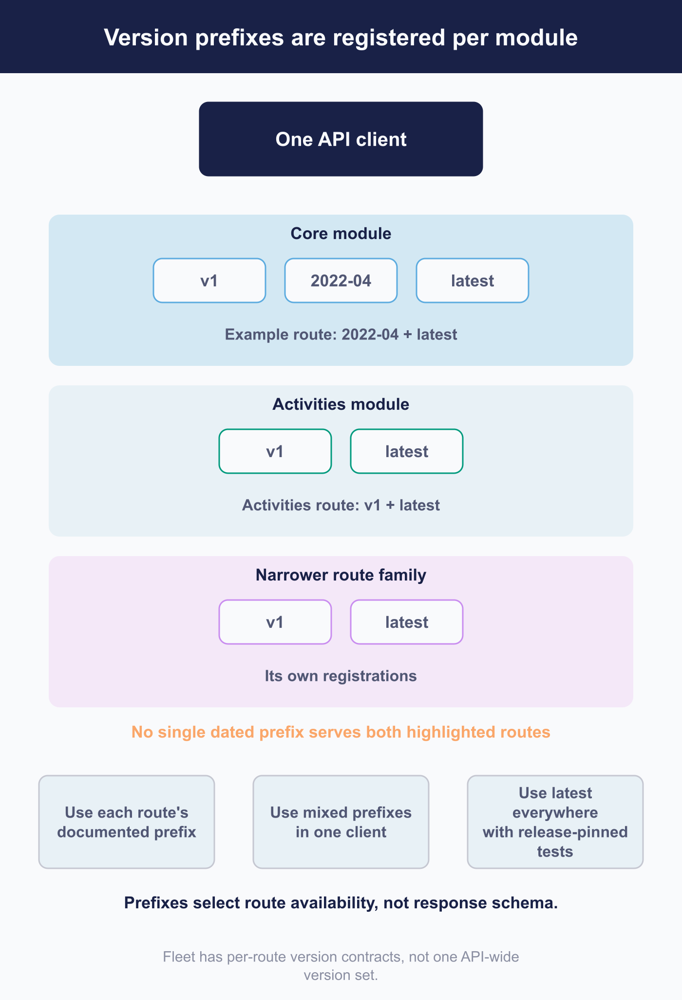

# Use the Fleet REST API

 Fleet's REST API lets you connect device information and administrative actions to your own tools. You can build a focused integration, gather data for another system, or coordinate a workflow that spans several Fleet features. The interface, fleetctl, and GitOps use this API too, so a custom client works with the same underlying resources.

Start with the resource and outcome you need, then plan how the client will authenticate, traverse results, and verify changes. Startup settings remain outside the API: the Fleet server reads those from its own configuration ([a.3](../09-appendices/a.3-configuration-model-and-precedence.md)). Agent, device, and protocol-callback routes also have their own contracts; the guidance here concerns the administrative API used by integrations.

[6.1](6.1-automation-design-and-change-control.md) covers credentials, ownership, and the shared automation rules. The feature chapters explain each resource's fields and behavior. If you are connecting an AI assistant, Fleet's MCP server wraps a mainly read-oriented subset of this API; [6.6](6.6-connect-fleet-to-an-ai-assistant.md) and [a.11](../09-appendices/a.11-mcp-tool-reference.md) explain the tools and the additional layer through which requests pass.

## Start from the documented resource and scope

 Before building a request, establish four parts of its contract:

1. **Resource and outcome.** Use the feature's owning chapter to understand the fields, states, and terminal results.
2. **Required role.** Check that the automation identity can perform the action ([2.6](../02-administer-and-deploy-fleet/2.6-user-accounts-roles-and-service-identities.md)).
3. **Scope.** Global and fleet-scoped resources can use different routes and permissions.
4. **Response.** Identify what the write returns and which later read, if any, will confirm the intended result.

Use Fleet's published API reference to find the documented method and path. It is maintained by hand and may omit routes. The embedded machine-readable catalogue has a narrower purpose: it provides the endpoint allowlist for API-only accounts with a non-empty restriction list. Validation checks that catalogue entries have routes, but does not establish that every route appears in the catalogue. Fleet also registers backward-compatible aliases outside it ([a.8](../09-appendices/a.8-api-action-and-endpoint-reference.md)).

## Build and authenticate a request

 Authenticate with a session key in the `Authorization` header using the `Bearer` scheme. [6.1](6.1-automation-design-and-change-control.md) explains API-only accounts and session handling. Combine that credential with the exact path documented for the resource, including the deployment's URL prefix where one is configured.

### Route-specific version prefixes

Versioned routes are registered in two stages. Each route-registering module declares an ordered set of version names, and an individual route can narrow that set with start and end boundaries. Eligible current routes also receive a literal `latest` path; it is not a redirect. Historical or deliberately fixed routes may have no `latest` path.

As a result, no dated prefix necessarily contains every API route. Modules can support different version sets, and at least one route family is fixed to a single prefix. A client using several resources may legitimately need mixed prefixes.

Use the documented method and path for each resource and test those paths against every Fleet release you support. Use `latest` only where it is available and where you are prepared to verify its behavior during upgrades.

A version prefix selects route availability. It does not freeze the response schema or provide the data shape from an older Fleet release.

<!-- IMAGE-TODO: assets/6.3-version-prefixes-per-module.webp
     QUESTION: Why can one API client need different route prefixes?
     PRODUCTION REVISION: 2026-09-08, from the independent reviewer’s 2026-08-28 brief.
     Layout clarified against the current chapter; visible prose is unchanged.
     PROMPT: DIAGRAM: Use two module bands to focus on the two example routes. Core module has equal-style chips
     v1, 2022-04 and latest; its highlighted example route is available at 2022-04 and latest.
     Activities module has v1 and latest; its example route is available at those prefixes.
     A navy One API client connects to each example route, with Needs the core route and Needs
     the activities route labels. The latest chip is an ordinary registered path, never a redirect.
     A broken apricot guide in the dated-prefix column marks the missing dated choice for
     activities. Note No single dated prefix serves both example routes. Omit the redundant
     generic third module; the two concrete examples carry the distinction.
     Beneath them state Prefixes select route availability, not response schema. Connect the
     client to three equal-weight alternatives: Use each route's documented prefix; Use mixed
     prefixes in one client; Use latest everywhere with release-pinned tests. Do not rank or
     number these options or draw schema snapshots. Use a taller canvas if required for readable
     labels; no arrows or guide lines through text.
     TERMINOLOGY: Fleet is the company, product, or server. Host groups are lowercase
     fleet/fleets, including headings and labels. Do not call these groups teams. Preserve
     exact code/API identifiers. These instructions are not text to render.
     DESIGN: Flat vector technical diagram. Fleet is software for managing computers; draw no
     vehicles. Use Inter labels and Roboto Mono identifiers. At 1400 px source width use 48 px
     titles, 36 px body labels, and at least 28 px secondary text; scale proportionally. Check at
     720 px reading width and intended print size. Use a 32 px spacing grid, at least 24 px node
     padding, and consistent corner radii. Center short node names; left-align multiline
     explanations. Never shrink text to fit. Use #F9FAFC background, #192147 headings and primary
     connectors, #515774 text, #8B8FA2 secondary connectors, #C5C7D1 borders, and #D3E8F3 or #E8F1F6
     quiet fills. Use #5CABDF and #C98DEF for named categories, #3AEFC4 for labelled positive
     outcomes, #D66C7B for labelled failures, and #FAA669 for labelled cautions. Tint large panels
     to 20 to 25 percent; full strength is for small marks. Keep text navy or slate, or off-white on
     a navy anchor. Never rely on colour alone. Use one arrowhead shape, consistent stroke weights,
     box-edge termination, and labelled branches and return paths. Keep connectors clear of text. No
     gradients, shadows, decorative icons, logo, watermark, em-dashes, or slogan footer. Render only
     the specified reader-facing labels. Choose orientation to fit the relationship, not a default
     poster. Keep captions outside the artwork. If labels crowd, split the figure before shrinking
     them. Keep editable SVG when the production method supports it.
     NOTE: Candidate remains pending the final manual-wide review. Preserve the chapter’s
     technical qualifications and prose until artwork is accepted.
     CANDIDATE: ../../research/visual-reviews/part-6/assets/6.3-version-prefixes-per-module.webp
     Rendered and inspected for the overnight batch; awaiting final joint review.
-->

### Renamed fields in request and response bodies

Fleet renamed teams to fleets and queries to reports. Compatibility aliases let the old names continue working, but requests and responses handle them differently:

- A response using these aliases can contain both names for one value.
- A request containing both members of an alias pair is rejected with a client error.

Build writes from the endpoint's request schema, using the canonical field name. Copying a response object into a write can include both names and cause rejection. Check this when maintaining an older integration, including the route spellings and aliases that were not covered by the field-rename announcements.

### Request handling requirements

Give the client explicit limits and enough error information to investigate a failure:

- **Include the configured URL prefix** in front of the API path.
- **Set connection and whole-request deadlines.** Fleet does not impose these client deadlines for you.
- **Bound response size and page size** to prevent an unexpectedly large result exhausting client resources.
- **Send JSON content type on writes** and read the body of every response, including successful ones.
- **Record Fleet's error identifier when present.** It connects a client failure to the server's record ([8.3](../08-troubleshooting/8.3-server-logs.md#the-uuid-correlation-trick)).

| Status | Ordinarily means | Client response |
|---|---|---|
| **401** | Invalid credential or required password reset | Stop requests using that credential and resolve the authentication problem |
| **402** | The role permits the action, but the licence tier does not include it | Check the licence requirement ([a.4](../09-appendices/a.4-roles-and-permissions-matrix.md)) |
| **403** | The authenticated request was refused | Check role and fleet scope ([2.6](../02-administer-and-deploy-fleet/2.6-user-accounts-roles-and-service-identities.md)), endpoint restrictions, and account-state gates that can reject the request before role evaluation ([1.4](../01-foundations/1.4-identity-and-roles.md), [8.5](../08-troubleshooting/8.5-fleetctl-debug.md)) |
| **409** | Semantic conflict, such as a duplicate name | Read current state before deciding how to proceed |
| **413** | Request too large | Reduce the request before retrying |
| **429** | A limiter refused the request | Follow the retry hint |
| **5xx** or connection failure | Outcome may be unknown | Verify state with a read before repeating a write |

## Page, filter, and order complete result sets

 Make pagination and filtering explicit so the client returns the population you intended as the deployment grows. A successful list request can still be incomplete, ordered unpredictably, or wider than the filter you thought you applied.

### Pagination defaults

Endpoints using Fleet's shared list machinery have different defaults depending on whether a page number is supplied:

| What you send | What you get |
|---|---|
| **No pagination parameters** | Up to one million rows |
| **Any page number, including zero, without a page size** | Twenty rows |

Always set page size explicitly. Adding only a page number can reduce a previously large response to twenty rows. Check the chosen endpoint's defaults and maximums rather than assuming all list routes use the shared behavior.

### Ordering and cursor traversal

The host list has no default ordering. Neither it nor the shared list machinery adds an identifier tiebreaker, so repeated requests can return rows in different orders. Offset paging under those conditions can repeat one row and miss another. Some endpoints define their own secondary ordering; check the endpoint you use.

Traverse the host list with its cursor support: order by identifier ascending, set an explicit page size, and pass the last identifier received as the next page's starting point. The response has no pagination metadata, so stop when a page is empty or shorter than requested. Reject a page carrying a top-level error, as described below.

Cursor support is specific to each endpoint. Even a successful cursor traversal is not a transactional snapshot: rows created or deleted during the traversal can appear or disappear. Reconcile afterward when the workflow requires an exact population.

### Filters fail quietly

 Test that each filter actually narrows a known result set. Fleet ordinarily ignores unknown query parameters, so a misspelled filter can return a successful, unfiltered response.

Support is specific to the endpoint. A filter accepted by a listing route may be ignored by its related counting route, or the reverse. Licence tier can also affect whether a filter is applied: some filters are accepted and validated but leave the results unfiltered. Verify the exact route and tier your client will use.

<!-- IMAGE-TODO: assets/6.3-host-list-cursor.webp
     QUESTION: How does a client traverse a large host list without relying on unstable offset
     ordering?
     PROMPT: DIAGRAM: A cursor walk through illustrative ascending host IDs: page 1 returns 11, 18,
     24; page 2 starts after 24 and returns 31, 40, 57; final short page returns 63 and stops. Every
     request is labelled Explicit page size + ID ascending. A side gate rejects a whole page
     carrying a top-level error. Use logical cursor labels rather than inventing parameter names.
     Beneath the pages, show a separate Live dataset changes marker and Reconcile if exactness
     matters. Do not claim a transactional snapshot or cursor support on every endpoint.
     TERMINOLOGY: Fleet is the company, product, or server. Host groups are lowercase
     fleet/fleets, including headings and labels. Do not call these groups teams. Preserve
     exact code/API identifiers. These instructions are not text to render.
     DESIGN: Flat vector technical diagram. Fleet is software for managing computers; draw no
     vehicles. Use Inter labels and Roboto Mono identifiers. At 1400 px source width use 48 px
     titles, 36 px body labels, and at least 28 px secondary text; scale proportionally. Check at
     720 px reading width and intended print size. Use a 32 px spacing grid, at least 24 px node
     padding, and consistent corner radii. Center short node names; left-align multiline
     explanations. Never shrink text to fit. Use #F9FAFC background, #192147 headings and primary
     connectors, #515774 text, #8B8FA2 secondary connectors, #C5C7D1 borders, and #D3E8F3 or #E8F1F6
     quiet fills. Use #5CABDF and #C98DEF for named categories, #3AEFC4 for labelled positive
     outcomes, #D66C7B for labelled failures, and #FAA669 for labelled cautions. Tint large panels
     to 20 to 25 percent; full strength is for small marks. Keep text navy or slate, or off-white on
     a navy anchor. Never rely on colour alone. Use one arrowhead shape, consistent stroke weights,
     box-edge termination, and labelled branches and return paths. Keep connectors clear of text. No
     gradients, shadows, decorative icons, logo, watermark, em-dashes, or slogan footer. Render only
     the specified reader-facing labels. Choose orientation to fit the relationship, not a default
     poster. Keep captions outside the artwork. If labels crowd, split the figure before shrinking
     them. Keep editable SVG when the production method supports it.
     NOTE: Proposed 2026-09-08; editorial brief, not technical re-verification. Replace the host
     traversal prose with a concise algorithm and this worked example. Retain endpoint-specific
     defaults, filter validation, and concurrent-change qualifications. Keep current prose and this
     TODO until the actual image is reviewed. Then check alt text against the artwork and retain an
     accessible summary plus all required technical qualifications.
     CANDIDATE: ../../research/visual-reviews/part-6/assets/6.3-host-list-cursor.webp
     Rendered and inspected for the overnight batch; awaiting final joint review.
-->
<!-- IMAGE PENDING. Install reviewed artwork, then activate the image line below.

-->
## Handle errors, limits, and ambiguous writes

 Inspect the response body as well as its status. Fleet can return several error shapes, and the host-list endpoint can report a body-level error after sending a success status.

### What the codes mean here

| Code | Ordinarily means |
|---|---|
| **422** | Fleet rejected the content during validation |
| **400** | Malformed request framing, or a deprecated and canonical field name supplied together |
| **404 / 405** | May be a router response with a plain-text body instead of Fleet's JSON error shape |

Handle non-JSON errors without losing the original status and body. A wrongly addressed route is one place where assuming a Fleet JSON error object can hide the useful diagnostic information.

> ### The host list can return an error inside a 200
>
> The host-list endpoint fetches its base rows and sends a 200 status before finishing the per-host response work. If that later work fails, it reports a top-level error inside the body.
>
> Parse the complete response and reject it if it contains a top-level error key, regardless of status. This behavior belongs to the host-list endpoint's streaming implementation; it is not a general API contract.

### Rate limits

Pace calls to ordinary authenticated routes in your client. Fleet applies no rate limiter to those routes, so unbounded concurrency can compete with the device traffic the deployment also serves.

Other routes do have limiters. Some use fixed, deployment-wide buckets, including the sign-in family; others are keyed by address. Frequent re-authentication can consume the sign-in allowance shared with human users. Sign in once and retain the session instead of authenticating for each request.

Only limiter responses carry a retry hint. Other Fleet responses do not specify when a client should retry.

### After an ambiguous write

If a write times out or its response is lost, read the resource's documented state before deciding whether to repeat the request. [6.1](6.1-automation-design-and-change-control.md) explains how to correlate the available evidence with your original request.

Retry safety depends on the particular endpoint and current state. Fleet's declarative endpoints use POST, batch routes vary, and there is no idempotency key. An HTTP verb or route-family naming convention cannot establish whether repeating an action is safe.

## Design idempotent and observable clients

 Retain the handles that let a later read identify the work: resource IDs, profile IDs, script execution IDs, command IDs, and batch execution IDs. Store them alongside your own change reference so an operator can follow a request through to its outcome.

Some actions return less information. A per-host software installation returns an accepted status and an empty body, with no installation identifier even though Fleet has one internally. That workflow needs client-side correlation and a later read to identify the result.

Fleet records no request identifier or client identity beyond the account ([6.1](6.1-automation-design-and-change-control.md)). Keep the connection to your change ticket in your own records. Log the request's non-sensitive details, response status, any body-level error, and your correlation identifier; keep credentials and secret values out of those logs.

## Version and test the integration contract

 Test the integration against the target Fleet release before upgrading production ([7.3](../07-operate-fleet/7.3-upgrade-fleet-and-fleetd.md)). Use the requests and assumptions your client depends on as the test cases:

- **Route availability:** exercise every method and path at its exact prefix.
- **Write schemas:** check request bodies, especially renamed fields and aliases.
- **Pagination:** verify accepted page sizes and traversal behavior.
- **Filters:** confirm that each filter narrows the expected population.
- **Errors:** include a malformed path to verify handling of non-JSON responses.

Apply the same checks to routes addressed through `latest`. fleetctl uses that prefix internally, but it does not provide a stable external integration contract.

Maintain an inventory of the routes and fields the integration uses. Field renames were announced, while old route spellings were not documented as deprecated, and the catalogue's deprecation flags do not cover name aliases. Release notes alone may therefore miss a dependency that needs testing.
