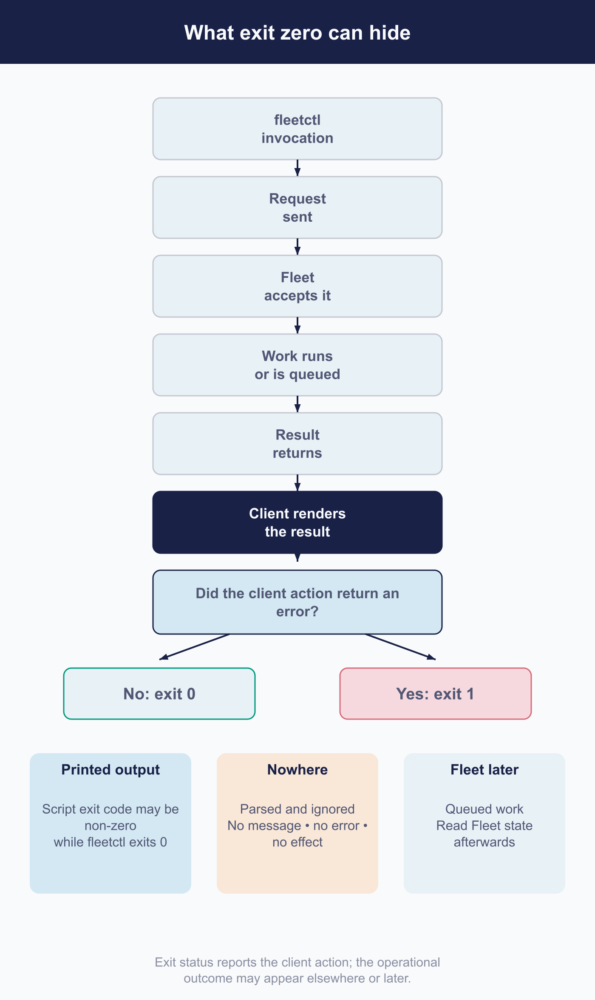

# Operate Fleet with fleetctl

 fleetctl brings Fleet administration to the command line. You can use it for an individual host action, a repeatable shell workflow, or a CI job that applies reviewed configuration. It also provides local tools for packaging, configuration, scaffolding, conversion, and update-repository management.

For server operations, fleetctl uses the API's authorization and resource behavior ([6.3](6.3-use-the-fleet-rest-api.md)). The client adds connection contexts, command-specific defaults, and output handling. Knowing those details helps you target the correct server and build a pipeline that can recognize the result it needs.

A command's zero or one exit status reports whether the client action returned an error. The underlying operation's outcome may appear in printed output or require a later read from Fleet. Check that contract when choosing a command for automation.

## Install and match fleetctl to the server

 Install a client release that matches your Fleet server, then confirm the installed binary's version:

```sh
fleetctl --version
```

For a 4.90.0 binary, expect `fleetctl - version 4.90.0` followed by branch, revision, build-date, and Go-version information.

You can install the npm launcher with a pinned version, such as `npm install -g fleetctl@4.90.0`. The launcher downloads the platform binary on its first invocation and prints installation messages to standard output. Run `fleetctl --version` once after installation, before a pipeline starts parsing command output, to complete that download and check the version.

Pin the npm package itself. It chooses the binary version declared in its installed `package.json`; an unpinned `npm install -g fleetctl` follows the registry's current default, which may differ from your server.

Alternatively, download the appropriate archive from the `fleet-v4.90.0` GitHub release and extract fleetctl:

- **macOS:** `fleetctl_v4.90.0_macos.tar.gz`, a universal build.
- **Linux:** `fleetctl_v4.90.0_linux_amd64.tar.gz` or the `_arm64_` variant.
- **Windows:** `fleetctl_v4.90.0_windows_amd64.zip` or the `_arm64_` variant.

Use the corresponding release and filenames when targeting another server version. fleetctl warns about a version mismatch on authenticated commands, including GitOps, but continues with the request. A mismatched client can then encounter an unsupported field or changed route as an ordinary operation error.

Coordinate client and server upgrades so automated workflows keep using the matching release ([7.3](../07-operate-fleet/7.3-upgrade-fleet-and-fleetd.md)).

## Configure connections and contexts safely

 A named context groups a Fleet server address and credential with optional certificate-authority and URL-prefix settings. Switching contexts selects that whole connection. [6.1](6.1-automation-design-and-change-control.md) covers the credential's lifetime and permissions.

Use explicit contexts when working with multiple deployments, and give each automated job its own configuration file. That keeps a job's destination independent of changes made by another shell or workflow.

> ### Concurrent writes to the configuration file lose each other
>
> fleetctl rewrites the whole configuration file without locking, atomic replacement, or conflict detection. Concurrent updates can overwrite one another while both processes report success.
>
> Separate configuration files prevent automated jobs from competing over that shared state.

<!-- IMAGE-TODO: assets/6.4-fleetctl-config-write-race.webp
     QUESTION: Why should simultaneous automation jobs use separate fleetctl configuration files?
     PROMPT: DIAGRAM: A before/after concurrency example. Shared file panel: Jobs A and B both read
     revision 0; A writes its context change; B writes its own whole-file snapshot and overwrites
     A's change. Label Both commands may exit successfully. Isolated files panel: Job A writes
     Config A and Job B writes Config B, with no shared write edge. These are illustrative jobs, not
     Fleet-managed locks or transactions. Use explicit read/write arrows and a short vertical time
     direction; do not show the isolated files fixing incorrect credentials or wrong-server
     selection automatically.
     TERMINOLOGY: Fleet is the company, product, or server. Host groups are lowercase
     fleet/fleets, including headings and labels. Do not call these groups teams. Preserve
     exact code/API identifiers. These instructions are not text to render.
     DESIGN: Flat vector technical diagram. Fleet is software for managing computers; draw no
     vehicles. Use Inter labels and Roboto Mono identifiers. At 1400 px source width use 48 px
     titles, 36 px body labels, and at least 28 px secondary text; scale proportionally. Check at
     720 px reading width and intended print size. Use a 32 px spacing grid, at least 24 px node
     padding, and consistent corner radii. Center short node names; left-align multiline
     explanations. Never shrink text to fit. Use #F9FAFC background, #192147 headings and primary
     connectors, #515774 text, #8B8FA2 secondary connectors, #C5C7D1 borders, and #D3E8F3 or #E8F1F6
     quiet fills. Use #5CABDF and #C98DEF for named categories, #3AEFC4 for labelled positive
     outcomes, #D66C7B for labelled failures, and #FAA669 for labelled cautions. Tint large panels
     to 20 to 25 percent; full strength is for small marks. Keep text navy or slate, or off-white on
     a navy anchor. Never rely on colour alone. Use one arrowhead shape, consistent stroke weights,
     box-edge termination, and labelled branches and return paths. Keep connectors clear of text. No
     gradients, shadows, decorative icons, logo, watermark, em-dashes, or slogan footer. Render only
     the specified reader-facing labels. Choose orientation to fit the relationship, not a default
     poster. Keep captions outside the artwork. If labels crowd, split the figure before shrinking
     them. Keep editable SVG when the production method supports it.
     NOTE: Proposed 2026-09-08; editorial brief, not technical re-verification. Replace the quoted
     whole-file race explanation with the visual and one operational instruction. Keep the list of
     context values and the risk of switching server and credential together. Keep current prose and
     this TODO until the actual image is reviewed. Then check alt text against the artwork and
     retain an accessible summary plus all required technical qualifications.
     CANDIDATE: ../../research/visual-reviews/part-6/assets/6.4-fleetctl-config-write-race.webp
     Rendered and inspected for the overnight batch; awaiting final joint review.
-->
<!-- IMAGE PENDING. Install reviewed artwork, then activate the image line below.

-->
## Choose the appropriate command surface

 Choose a command family based on the task and the evidence you need from it. Native commands cover daily administration, while spec-based commands and GitOps support configuration workflows:

| Surface | Use it for | Limits to check |
|---|---|---|
| **Native commands** | Hosts, reports, scripts, and software | Some results appear in output rather than the exit status |
| **Client-side utilities** | Configuration, packaging, scaffolding, conversion, preview, and update repositories | These do local work rather than administrative API operations. [3.8](../03-connect-devices/3.8-manage-fleetd-orbit-and-updates.md) covers packaging and channels, including [running an update repository](../03-connect-devices/3.8-manage-fleetd-orbit-and-updates.md#running-your-own-update-repository); [a.7](../09-appendices/a.7-fleetctl-command-reference.md) details the commands |
| **`apply` and `delete`** | One-off spec files | Dry run skips validation for five of eight accepted kinds; delete ignores five kinds |
| **`gitops`** | Declared configuration and repeated applies | File-set, omission, and partial-apply behavior in [6.2](6.2-manage-fleet-with-gitops.md) |
| **`api`** | Routes without a native command | Defaults to the numbered version prefix and discards error bodies |

<a id="the-raw-api-passthrough-has-two-sharp-edges"></a>

### Raw API passthrough limits

The `api` command recognizes the numbered version prefix and `latest`, defaulting to the numbered one. It has no straightforward way to address a dated prefix. Since route availability is specific to each endpoint ([6.3](6.3-use-the-fleet-rest-api.md)), a route can exist on the server but return not-found through this command.

Native commands select their routes internally, so they may use a different version of the same resource. Check the path used by each command when comparing results.

On a non-success response, `api` discards the body and returns the status, losing Fleet's explanation. It can be useful for reads or occasional calls to routes without a native command. For a repeated integration, an HTTP client that preserves error bodies gives you more diagnostic information.

<a id="use-commands-without-duplicating-feature-chapters"></a>

## Find commands and check their behavior

 Use command help for exact syntax and flags, then [a.7](../09-appendices/a.7-fleetctl-command-reference.md) to check what the command asks Fleet to do and what its result establishes.

Getting and applying resources use separate verbs over the same specs. Host actions reach the same server operations as the interface, with command-specific defaults: for example, `run-script` is synchronous by default. [5.3](../05-manage-devices/5.3-run-and-manage-scripts.md) explains script queueing, completion, and verification across the available interfaces. Diagnostic commands inspect the service itself; [Part VIII](../08-troubleshooting/8.1-diagnostic-method.md) helps interpret the results.

Pay particular attention to `delete` and `apply --dry-run` when building spec-based automation:

- **`delete` removes reports, packs, and labels.** It accepts eight kinds, but silently ignores the other five after parsing them. For those kinds it deletes nothing, prints nothing, and exits successfully.
- **`apply --dry-run` processes configuration, fleet, and enroll-secret specs.** It notes reports, labels, packs, policies, and user roles on standard output but does not send those five kinds for server validation. Accepted kinds are parsed into local spec types with their parse-time checks; this does not establish semantic validity.

A pull-request check based on `apply --dry-run` therefore needs to account for the resource kinds it leaves unvalidated.

## Consume output and failures in automation

 Treat command output and later Fleet state as part of the verification process. The exit status alone may answer only whether fleetctl completed its part of the request.



<!-- IMAGE-TODO: assets/6.4-what-exit-zero-hides.webp
     QUESTION: What can a successful fleetctl process leave unknown?
     PRODUCTION REVISION: 2026-09-08, from the independent reviewer’s 2026-08-28 brief.
     Layout clarified against the current chapter; visible prose is unchanged.
     PROMPT: DIAGRAM: Use a numbered, folded server-backed command example at the top. Label it Illustrative
     server-backed command path. Preserve this order: fleetctl invocation; Request sent; Fleet
     accepts it; Work runs or is queued; Result or accepted response returns; Client renders the
     result (navy anchor); Did client action return an error? No reaches Exit 0; Yes reaches Exit 1.
     The exit decision follows the returned result and rendering, never request acceptance.
     Place Most exit 0 results are ordinary success beside the outcomes. Keep an external note:
     Wrapper timeout, signal, or failure to start may produce another status.
     Below, show three equal evidence examples headed Where the operational outcome appears.
     Printed output: Script ran; script exit code is non-zero; fleetctl exits 0 because the client
     action completed. Add --quiet removes the script exit-code line. Fleet later: Asynchronous
     work queued; Final outcome is not yet knowable; then Read Fleet state afterwards.
     Nowhere is explicitly a CLIENT-ONLY exception: accepted delete kind is parsed and ignored;
     No message; No error; No effect; Exit 0. Keep that card detached from the server-backed
     lifecycle. Never route this ignored case through a Fleet request or a rendering box that
     prints a result. The examples are alternatives, not consecutive stages.
     End with two separate neutral rails, Standard error and Standard output, without assigning
     error classes or severity to either. Prefer a taller canvas to undersized text.
     TERMINOLOGY: Fleet is the company, product, or server. Host groups are lowercase
     fleet/fleets, including headings and labels. Do not call these groups teams. Preserve
     exact code/API identifiers. These instructions are not text to render.
     DESIGN: Flat vector technical diagram. Fleet is software for managing computers; draw no
     vehicles. Use Inter labels and Roboto Mono identifiers. At 1400 px source width use 48 px
     titles, 36 px body labels, and at least 28 px secondary text; scale proportionally. Check at
     720 px reading width and intended print size. Use a 32 px spacing grid, at least 24 px node
     padding, and consistent corner radii. Center short node names; left-align multiline
     explanations. Never shrink text to fit. Use #F9FAFC background, #192147 headings and primary
     connectors, #515774 text, #8B8FA2 secondary connectors, #C5C7D1 borders, and #D3E8F3 or #E8F1F6
     quiet fills. Use #5CABDF and #C98DEF for named categories, #3AEFC4 for labelled positive
     outcomes, #D66C7B for labelled failures, and #FAA669 for labelled cautions. Tint large panels
     to 20 to 25 percent; full strength is for small marks. Keep text navy or slate, or off-white on
     a navy anchor. Never rely on colour alone. Use one arrowhead shape, consistent stroke weights,
     box-edge termination, and labelled branches and return paths. Keep connectors clear of text. No
     gradients, shadows, decorative icons, logo, watermark, em-dashes, or slogan footer. Render only
     the specified reader-facing labels. Choose orientation to fit the relationship, not a default
     poster. Keep captions outside the artwork. If labels crowd, split the figure before shrinking
     them. Keep editable SVG when the production method supports it.
     NOTE: Candidate remains pending the final manual-wide review. Preserve the chapter’s
     technical qualifications and prose until artwork is accepted.
     CANDIDATE: ../../research/visual-reviews/part-6/assets/6.4-what-exit-zero-hides.webp
     Rendered and inspected for the overnight batch; awaiting final joint review.
-->
<a id="two-exit-codes-and-what-they-cannot-express"></a>

### Exit codes and operation results

fleetctl itself chooses between zero and one. A wrapper timeout, signal, or failure to start the process can produce a different status outside fleetctl's control.

For `run-script`, zero means the script was delivered, executed, and returned a result, regardless of the script's own exit code. That exit code appears in the printed output, and `--quiet` removes the line containing it. To verify the script's outcome, parse the output or read the execution result through the API ([6.3](6.3-use-the-fleet-rest-api.md)).

Other commands have different completion points. An asynchronous command can correctly report that work was queued while the device has yet to perform it ([6.1](6.1-automation-design-and-change-control.md)). Informational commands can finish with ordinary successful output. The ignored `delete` kinds provide no outcome detail at all. Choose the verification step around the command's actual behavior.

<a id="two-streams-and-which-one-carries-an-error-is-not-guaranteed"></a>

### Capture standard output and standard error

Capture both output streams, preferably separately so you can identify which carried each message. The command-line framework determines parts of the error routing, and the split can differ by command or release. Standard error is not a reliable severity filter ([a.7](../09-appendices/a.7-fleetctl-command-reference.md)).

A job that retains only standard error can miss a usage failure caused by an invalid or missing flag. Keeping both streams is especially useful when an upgrade changes the flags a pipeline uses.

### Timeouts

Set an explicit deadline in the job runner. Ordinary authenticated fleetctl calls have transport and handshake timeouts but no overall request deadline. If a server accepts the connection and then delays its response, the client can wait indefinitely.

## Run fleetctl in CI and troubleshoot the client boundary

 Fleet's generated workflows provide a starting structure for CI: a dry run on proposed changes and a scheduled apply. Before using a scaffold against an existing deployment, review four defaults:

1. **Absent-fleet deletion is enabled.** Disable it until the workflow supplies a verified, complete manifest. [6.2](6.2-manage-fleet-with-gitops.md) explains how a partial manifest can otherwise remove existing fleets.
2. **No Unassigned file is generated.** Add an explicit `unassigned.yml` wherever the global file is supplied. Otherwise the client applies an empty Unassigned configuration, clearing the fields listed in 6.2 and handling software according to the effective software exception.
3. **The credential appears in command arguments twice.** Processes able to inspect the runner's process list can read it. Supply the credential through the environment or a file, as Fleet's documentation recommends.
4. **Both generated pipelines can fall back to the newest client.** Require the version matching your server and fail installation if that version is unavailable.

The generated GitHub workflow includes a concurrency block. The generated GitLab pipeline does not, so add serialization there before allowing production applies.

<a id="a-preflight-worth-running"></a>

### Preflight checks

Before running a job, confirm its configuration file, server address and context, matching client version, output format, deadline, and verification step. These checks connect the command being run to the deployment and outcome you intend.

### Working in CI

Keep those decisions in the job definition so they are repeatable. Give the job a private configuration file, pin fleetctl, set the runner timeout, and retain both output streams. Use the command-specific verification step to decide whether the job achieved its intended result.

### Telling a client problem from a server problem

Establish how far the request got before investigating the service. fleetctl controls its configuration file and contexts, address selection, certificate trust, client version, flag parsing, and output rendering.

If no request left the machine, begin with those client-side details: invalid flags, a missing context, an unresolvable address, or a certificate the client will not trust. If a server response arrived, preserve its status and body and use [Part VIII](../08-troubleshooting/8.1-diagnostic-method.md) to investigate the operation it reports.
