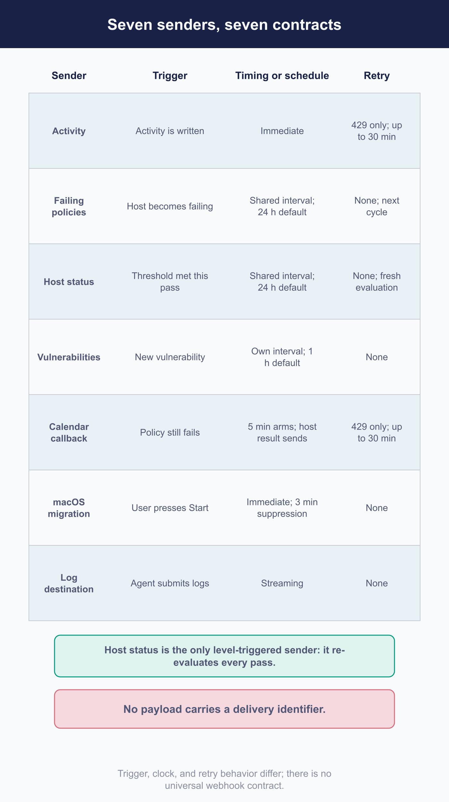

# Connect integrations, webhooks, and external workflows

Fleet can tell something else that a thing happened. That is the whole feature, and almost every difficulty in this chapter comes from the fact that **the seven mechanisms which do it are not variations on one design.**

They differ in what triggers them, how often, whether they retry, whether they batch, and whether they can even be configured for one fleet. A receiver written against the shape of one will be wrong about the next.

[5.9](../05-manage-devices/5.9-automate-remediation-with-policies.md) owns what makes a policy fire. This chapter owns the destination and what you build at the other end of it.

## Choose event delivery, polling, or a native integration

 Three ways to learn that something happened, and the first is not always the right one.

**A webhook** is push. Fleet tells you once, and if your receiver is not listening, that is usually the end of it.

**Polling the API** is pull. Slower, costs you requests, and it is the only one that survives your receiver being down. [6.3](6.3-use-the-fleet-rest-api.md) is how.

**A native integration**, a ticket or a calendar event, is Fleet doing the work at the far end for you, with correspondingly less control.

> **The useful pattern is webhook as trigger and API as source of truth**: take the event as a signal to go and read, rather than as the data itself. It removes most ordering and duplication problems at once.
>
> **It recovers current state while that state persists.** A policy that is still failing, a vulnerability still present, a host still quiet: all readable afterwards. A condition that cleared between your polls is gone either way.
>
> **And three deliveries have no supported replay at all**: a migration press, a log batch and a calendar callback. For those the delivery is the only record you can get to.

## Configure destinations and ownership

 Where each one is configured, and what scope it can be configured at.

Scope is inconsistent in both directions, which is worth knowing before you design around it:

| Mechanism | Global | Per fleet |
|---|---|---|
| **Activity** | Yes | **No** |
| **Failing policies** | Yes | Yes |
| **Host status** | Yes | Yes |
| **Vulnerabilities** | Yes | **No** |
| **Calendar callback** | **No** | Yes, named fleets only |
| **macOS MDM migration** | Yes | **No** |
| **Log destination** | Yes | **No** |

**Four of them cannot be scoped to a fleet at all, and the calendar callback destination cannot be configured globally.** Note that the Google Calendar credentials themselves *are* global; it is only the callback destination that is per fleet.

### The eighth sender, which is not yours

Of the places Fleet posts JSON outward, seven are the ones above. **One more is Fleet's own usage analytics, to a fixed address you do not configure.** It is not a receiver contract and not in the table, but it belongs in your outbound firewall thinking, because it is traffic leaving your deployment that no webhook setting explains. [2.2](../02-administer-and-deploy-fleet/2.2-self-hosting-architecture-and-capacity.md#built-in-and-commonly-configured-egress-destinations) maps that address alongside everything else the server reaches out to, and sets out what the analytics payload carries.

### The one an end user can set off

**The macOS MDM migration webhook fires from a device-authenticated request when a person presses Start on their own machine.** A successful delivery suppresses another for that host for three minutes.

It is the only *dedicated* webhook endpoint an end-user action invokes directly. It is not the only way a person at a laptop causes a webhook: self-service actions write activities, and activities have their own webhook. But it is the one where a human's click is the trigger, and a receiver for it should expect the timing and the volume that implies.

## Understand each webhook contract

 The comparison the chapter exists for.

| Mechanism | What triggers it | Cadence | Delivery unit | Retries |
|---|---|---|---|---|
| **Activity** | An activity is written | Immediate | One activity | **429 only, up to 30 minutes** |
| **Failing policies** | A host transitions to failing | The shared interval, **24 hours by default** | Configurable host batches | No. Hosts stay pending for the next cycle |
| **Host status** | **A threshold being met, re-evaluated every pass** | The same shared interval | **One unbounded identifier list** | No. A fresh evaluation happens next cycle |
| **Vulnerabilities** | A newly detected vulnerability | Its own interval, **one hour by default** | Configurable host batches | No |
| **Calendar callback** | A calendar-enabled policy still failing during the active window | The five-minute job **arms** it; delivery waits for the host's result | Per host | **429 only, up to 30 minutes** |
| **macOS MDM migration** | An end user pressing Start | Immediate, then suppressed for three minutes per host | Per host | No |
| **Log destination** | An agent submitting logs | Streaming | The agent's submitted batch | No |

**One thing they do share.** Every sender treats any 2xx as success and times out after **thirty seconds**. That is the whole of the common contract.

### Three settings, not one

Of these seven senders, the shared interval directly schedules **only** host status and failing-policy delivery. **The same automation schedule also drives Jira and Zendesk collection and the scan that re-fires reset automations** ([5.9](../05-manage-devices/5.9-automate-remediation-with-policies.md)), so raising its frequency raises more than this chapter's two. Vulnerabilities and calendar each have their own interval, and activity, migration and log delivery are not scheduled at all.

> **The vulnerability interval is a server startup setting.** You can read it back through the configuration API, and you cannot change it there or through GitOps. Changing it means changing deployment configuration and restarting the server, which puts it on a different footing from every other cadence in this chapter.

<!-- IMAGE-TODO: assets/6.5-seven-senders-compared.webp
     PROMPT WRITTEN 2026-08-28 by the independent reviewer, against the chapter as corrected
     after its review round. Do not hand-edit; a hand-edited prompt is a new claim.
     DIAGRAM: Landscape 16:9 flat-vector comparison matrix titled "Seven senders, seven
     contracts" for a technical operations manual.

     Build one wide table with exactly seven administrator-configurable sender rows and three main
     comparison columns:

     "Trigger"
     "Timing or schedule"
     "Retry"

     Use these rows and labels:

     1. "Activity"
        Trigger: "Activity is written"
        Timing: "Immediate"
        Retry: "429 only, up to 30 minutes"

     2. "Failing policies"
        Trigger: "Host transitions to failing"
        Timing: "Shared automation interval, 24 hours by default"
        Retry: "None; pending hosts wait for the next cycle"

     3. "Host status"
        Trigger: "Threshold is met on this pass"
        Timing: "Shared automation interval, 24 hours by default"
        Retry: "None; fresh evaluation next cycle"
        Add a prominent side annotation spanning only this row:
        "Only level-triggered sender: re-evaluates every pass, with no memory between passes"

     4. "Vulnerabilities"
        Trigger: "New vulnerability is detected"
        Timing: "Vulnerability interval, 1 hour by default"
        Retry: "None"

     5. "Calendar callback"
        Trigger: "Policy still fails during an active maintenance window"
        Timing: "Calendar job every 5 minutes arms it; delivery waits for a host result"
        Retry: "429 only, up to 30 minutes"

     6. "macOS MDM migration"
        Trigger: "End user presses Start"
        Timing: "Immediate; then suppressed for 3 minutes per host"
        Retry: "None"

     7. "Log destination"
        Trigger: "Agent submits logs"
        Timing: "Streaming"
        Retry: "None"

     Visually group the two rows driven by the shared automation interval with one bracket labelled
     "One shared setting". Give the vulnerability row a separate bracket labelled
     "Vulnerability interval". Give the calendar row its own bracket labelled "Calendar interval".
     These three brackets must remain visibly separate, with no shared clock, common parent setting,
     or connecting schedule line. Immediate and streaming rows sit outside all three interval
     groups.

     In the retry column, make only the Activity and Calendar callback cells accented. Their labels
     must say "429 only"; do not draw a general retry loop around the table or imply retries on any
     other status. Use neutral "None" cells for the other five rows.

     Add one full-width footer annotation:
     "No payload carries a delivery identifier."
     Do not show an ID field, envelope identifier, event-delivery token, sequence number, or
     deduplication key on any row.

     Show exactly seven rows. Do not add Fleet usage analytics as an eighth row. If any reference to
     usage analytics appears, it may only be a small detached note outside the table reading
     "Fixed non-configurable destination, not one of the seven"; omitting it is preferable.

     Caption: "The senders differ in trigger, clock, and retry behavior; there is no universal
     webhook contract."

     Use a clean humanist sans-serif with sentence case throughout. Keep the title, column headings,
     and sender names strong; use smaller but fully legible type for triggers, cadence details, and
     annotations. Render every specified label exactly once. Avoid decorative lettering, condensed
     type, all-caps labels, and tiny text. Maintain generous row spacing and make the matrix legible
     at half-page width.

     PALETTE. Use Fleet Black #192147 for headings and strongest rules; #515774 for ordinary text;
     #8B8FA2 and #C5C7D1 for secondary structure; #E2E4EA, #D3E8F3, and #E8F1F6 for grouping;
     #F9FAFC background. Use #FAA669 for the shared automation interval, #5CABDF for the
     vulnerability interval, #C98DEF for the calendar interval, #D66C7B for the two limited-retry
     cells, and #009A7D for the level-triggered host-status annotation. Keep text neutral.

     Use accent colours at full strength only for small brackets, rules, chips, and arrowheads; use
     roughly 20 to 25 percent tints over larger cells. Make the dark header row the visual anchor.
     Keep interval brackets heavier than ordinary grid lines but lighter than the table headings.

     Use geometry and typography only. Do not depict deliveries as guaranteed, durable, ordered, or
     authenticated. No security clip-art: no padlocks, shields, keys, vaults, or fingerprints.
     Never invent a colour outside the specified sets. Flat vector, generous whitespace, no
     gradients, no drop shadows, no 3D or photorealistic elements, no faux application screenshot,
     no logo, and no watermark. "Fleet" is software for managing computers. Never draw vehicles,
     cars, vans, trucks, ships, or aircraft. Never use an em dash in rendered text.
-->
### Host status is the one that will surprise your receiver

Every pass, Fleet recounts and asks whether the threshold is met. If it is, it sends.

**There is no memory between passes.** No record that it already alerted, no hysteresis, no suppression. A condition that persists produces a delivery every cycle for as long as it lasts.

And the payload is not built for that: **every matching host identifier is included, with no batching and no limit**, and **there is no timestamp in it**. Global and per-fleet settings are evaluated independently, so overlapping populations produce overlapping sends.

**Design the receiver for repetition and for size**, and derive your own timestamp at receipt. [4.5](../04-know-your-devices/4.5-monitor-fleet-wide-state.md) says the same thing from the monitoring side.

### Two ways delivery is lost

> **A failing vulnerability delivery abandons the rest of the run.** The first failed POST ends it, so a nondeterministic subset of that cycle's newly detected vulnerabilities has been delivered and the remainder never will be. There is no queue and no replay.
>
> **The log destination swallows its errors.** Loss is silent to the agent and to whatever submitted the logs. A Fleet server error log is the only trace.

### One filtering surprise

**Premium filters vulnerability automations more than Free does.** Premium keeps findings whose vulnerabilities have recent metadata; Free applies no such filter. Findings from other sources survive when their vulnerabilities meet that condition, but the practical effect is that **the higher tier can deliver fewer events**, which is the opposite of what anyone expects.

## Secure the receiver

 Fleet gives you less than you would like here, so the receiver has to carry it.

**No sender signs its request.** There is no signature and no configurable authentication header, so **nothing in the request itself lets a receiver verify it came from Fleet.** Every one of the seven is a plain JSON POST. An authenticating boundary in front of the receiver can still establish that, which is why it is the recommendation below.

That leaves the destination address itself as the only thing carrying a secret, and it is a poor place for one:

> **Do not design around credentials in a destination URL.** They are not consistently redacted: two of the senders wrap delivery errors with the **unmasked** address, so a failure writes it into logs and diagnostics.
>
> **Put an authenticating boundary in front of the receiver instead**: a gateway, a proxy, or a service that checks something before the workflow runs. Where you cannot, prefer polling.

**Treat every field as untrusted input.** Much of a payload comes from a host: names, serials, query results. None of it has been validated as safe for whatever your workflow does next.

### The private-address change

**4.90.1 blocks destinations on private, loopback, link-local and metadata-service addresses by default.**

The important part is *when*: **the check happens at dial time rather than when you save the setting.** An internal destination therefore validates cleanly, saves without complaint, and then fails on every delivery.

**The two bypasses have very different blast radii.** A dedicated setting re-enables ordinary private ranges, and that is the narrow one. Loopback, link-local and metadata addresses need the broader bypass, which disables the protection generally rather than for one range. Wanting the second is worth a second look at the design.

## Build idempotent external workflows

 What you can and cannot deduplicate on.

**No webhook carries a delivery identifier.** Nothing in any payload identifies *this send* as distinct from another send of the same thing.

What payloads do carry are **entity and event fields**: policy identifiers, host identifiers, vulnerability identifiers, serial numbers, timestamps. Those identify *what happened*, not *which delivery told you*. They are **candidate inputs to a key you construct**, not a deduplication contract: a repeated host-status delivery may be a legitimately new evaluation rather than a duplicate, and a calendar retry carries a fresh timestamp each attempt.

Three consequences:

1. **Separate receipt from side effects.** Acknowledge quickly, then do the work, so a slow workflow does not turn into a delivery failure.
2. **Expect repetition**, especially from host status, and make the side effect safe to repeat.
3. **Do not assume ordering.** Nothing guarantees it.

**Bound what your workflow calls back into Fleet.** A receiver that reacts to every host in a host-status payload with an API call per host will generate a burst against a deployment that has no rate limiter to protect it ([6.3](6.3-use-the-fleet-rest-api.md)).

## Observe, test, and recover delivery

 Noticing that deliveries stopped is harder than it should be. When a webhook silently stops firing, [8.14](../08-troubleshooting/8.14-degradation.md) covers the Fleet-side cause, including how the failing-policies webhook interacts with asynchronous host processing.

**The scheduler's own record of its runs has no read interface.** No API, no command. It is a real signal and you cannot get at it without going to the database directly.

So delivery observability is assembled rather than provided:

| Source | Tells you |
|---|---|
| **Fleet activities** | That some automations ran, for the types that record them |
| **Fleet's error diagnostics** | Recent failures, including some that carry the destination address |
| **Server logs** | Failures, including the log destination's own, which appear nowhere else |
| **Your receiver's telemetry** | The only end-to-end evidence, and the one to build first |

**Your receiver counting what it received is the most reliable signal you will have.** Everything on Fleet's side is partial.

### Testing

**Record real payloads and replay them.** Payload shapes differ enough between mechanisms that a receiver tested against one is not tested.

For each mechanism you consume, exercise four things: a duplicate delivery, an out-of-order pair, a payload larger than you expected (host status can be very large), and a receiver failure, so you find out whether Fleet retries before you find out during an incident. For most of them it does not.

### Recovering a missed delivery

**Where Fleet keeps the state, read it back.** A policy failure, a vulnerability, a quiet host are all discoverable through the API afterwards.

**Where it does not, the event is gone.** A migration press, a log batch and a calendar delivery leave nothing to reconstruct from. If those matter to you, the receiver's own durability is the whole of your recovery plan.

### Rotating a destination

Changing a destination is a configuration change like any other, with one wrinkle: **there is nothing to drain.** A change takes effect at the next send, anything in flight goes where it was already going, and nothing tells you which deliveries landed on which side of the change. Where a delivery matters, confirm at the receiver rather than assuming the boundary was clean.

**The log destination is different in kind**, because it is deployment configuration rather than a runtime setting: changing it means changing the server's configuration and restarting, not editing something in the interface.

## Reference and troubleshooting

 The configuration keys that control each integration and log destination are in [a.3](../09-appendices/a.3-configuration-model-and-precedence.md). Whether a webhook or integration setting is reachable through the UI, fleetctl, the API, or GitOps is in [a.5](../09-appendices/a.5-interface-index.md).

For a delivery that never showed up on the receiving end at all, work through the log surfaces in [8.2](../08-troubleshooting/8.2-log-surfaces.md) before assuming the destination is unreachable.
