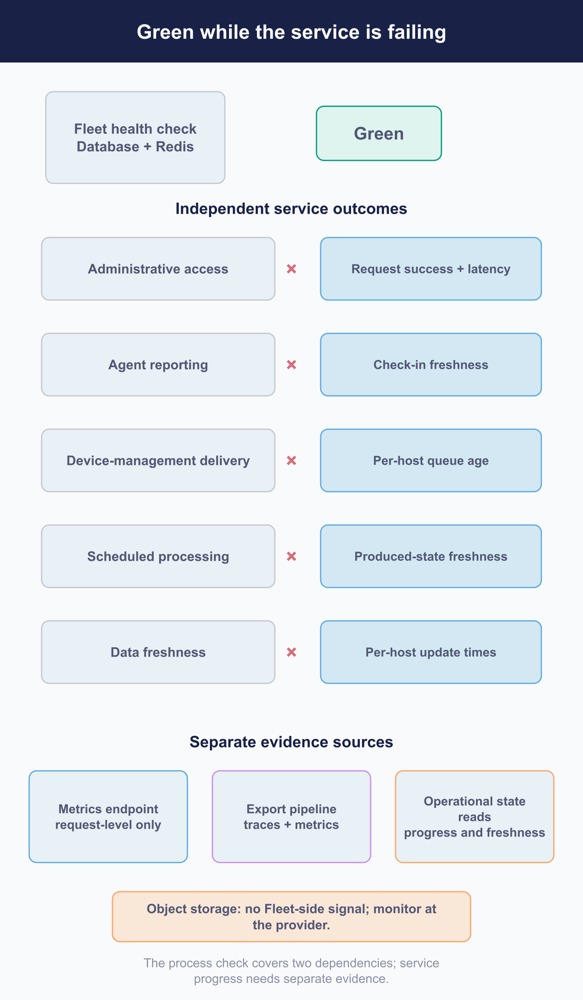

# Observe progress, performance, and service health

Fleet's health check can be green while agents have stopped reporting, scheduled work has stopped running, and the audit log has stopped arriving somewhere. Process uptime and service health are separate measurements.

This chapter is about closing that gap. It covers what Fleet emits, how to collect it, what it does not cover, and **how to tell whether the signals you built are working.**

Monitoring platforms are yours. Dashboards, alert routing and paging policy are not Fleet's business and not this manual's.

## Measure service progress, not only uptime

 Several things can be separately unhealthy, and one check does not see any of them.

The outcomes to track separately, because they fail independently:

| Outcome | Failing looks like |
|---|---|
| **Administrative access** | The interface and API are slow or erroring |
| **Agent reporting** | Hosts stop checking in; inventory ages |
| **Device management delivery** | Commands and profiles queue without landing |
| **Scheduled processing** | Vulnerability, app and maintenance jobs stop advancing |
| **Data freshness** | Something is still reporting, but what it reports is old |

> **Every one of those can fail while the health check stays green.** Its checks cover the database and Redis. **It is not a service check.**

<!-- IMAGE-TODO: assets/7.4-green-while-failing.webp
     QUESTION: What can fail while the Fleet health check remains green, and where is the evidence?
     PROMPT: DIAGRAM: Title: Observe each service outcome independently. Use a taller canvas for five
     independent failure lanes and three separate evidence-source cards. A small detached Fleet
     health check box contains only Database + Redis, with Green can persist through every failure
     below. Beside it note that a failed health response does not identify which check failed.
     The five lanes have staggered failure crosses, labelled illustrative rather than a timing chart.
     Administrative access: Request success / latency, Metrics endpoint + export pipeline.
     Agent reporting: Host check-in freshness, Read Fleet state.
     Device-management delivery: Per-host queue age, Read the host's own view.
     Scheduled processing: Freshness of expected output, Maintained / purchased apps: not established.
     Data freshness: Per-host update times, Read Fleet state.
     Below, use three equally separate cards. Metrics endpoint: Request-level metrics, No business
     metrics. Export pipeline: Traces + metrics; Pool statistics, errors and cache counters are export
     pipeline only. Operational reads: Check-in freshness, Per-host queue age, Per-host update times.
     Explicitly state that metrics and export coverage overlap and neither contains the other.
     A detached Object storage strip says No Fleet-side signal, Monitor the storage provider.
     No source encloses another. Do not connect the green check to the five outcome lanes, invent a
     freshness proxy for maintained or purchased apps, or imply request metrics measure business state.
     TERMINOLOGY: Fleet is the company, product, or server. Host groups are lowercase
     fleet/fleets, including headings and labels. Do not call these groups teams. Preserve
     exact code/API identifiers. These instructions are not text to render.
     DESIGN: Flat vector technical diagram. Fleet is software for managing computers; draw no
     vehicles. Use Inter labels and Roboto Mono identifiers. At 1400 px source width use 48 px
     titles, 36 px body labels, and at least 28 px secondary text; scale proportionally. Check at
     720 px reading width and intended print size. Use a 32 px spacing grid, at least 24 px node
     padding, and consistent corner radii. Center short node names; left-align multiline
     explanations. Never shrink text to fit. Use #F9FAFC background, #192147 headings and primary
     connectors, #515774 text, #8B8FA2 secondary connectors, #C5C7D1 borders, and #D3E8F3 or #E8F1F6
     quiet fills. Use #5CABDF and #C98DEF for named categories, #3AEFC4 for labelled positive
     outcomes, #D66C7B for labelled failures, and #FAA669 for labelled cautions. Tint large panels
     to 20 to 25 percent; full strength is for small marks. Keep text navy or slate, or off-white on
     a navy anchor. Never rely on colour alone. Use one arrowhead shape, consistent stroke weights,
     box-edge termination, and labelled branches and return paths. Keep connectors clear of text. No
     gradients, shadows, decorative icons, logo, watermark, em-dashes, or slogan footer. Render only
     the specified reader-facing labels. Choose orientation to fit the relationship, not a default
     poster. Keep captions outside the artwork. If labels crowd, split the figure before shrinking
     them. Keep editable SVG when the production method supports it.
     NOTE: Layout and labels refined 2026-09-08 for readable collection artwork, against
     the current chapter. This editorial adaptation is not a new release verification.
     Preserve published artwork and prose until the final joint review. Do not mark IMAGE-OK yet.
     CANDIDATE: ../../research/visual-reviews/part-7/assets/7.4-green-while-failing.webp
     Rendered and inspected for the overnight batch; awaiting final joint review.
-->
## Collect Fleet-native telemetry

 Two pipelines, unequal coverage, and one that is missing by default.

**The metrics endpoint carries request-level information**: HTTP families and a service-layer family covering a subset of administrative methods, plus runtime defaults. **It carries no business metric.** Nothing about hosts, policies, queues or freshness.

> **It is not mounted by default.** With no credentials configured and no explicit opt-out, the route is simply absent, and an ordinary request falls through to the web interface. That is not an error and not a refusal. **If you have never configured it, you do not have it**, and a check that expects a failure will not see one.

**The export pipeline carries traces and metrics**, including internal detail the metrics endpoint does not have: database pool statistics, error counters, cache counters. **The two overlap without either being a superset.** Decide what each is for.

> **Fleet's own instance identifier is regenerated on every start**, so it does not survive a restart and cannot be used to follow one node across a deployment. **Add a stable identity of your own**, from whatever your platform knows, or you will have signals you cannot attribute to a node over time.

### The six metric families and the series you query

The endpoint carries six Fleet-registered families. Four cover HTTP request handling and two cover the service layer. Everything else on `/metrics` is a Go runtime or process default from the client library, or the scrape handler's own counters, and none of it is Fleet's. You reach any of it only once the endpoint is mounted, which is the basic-auth condition described above.

Prometheus gives one metric family several suffixed series, and the family's shape decides which of them you query:

- **Counter:** query the family name directly. Two of the six are counters.
- **Histogram:** query its `_bucket`, `_sum` and `_count` series, never the bare family name.
- **Summary:** Fleet set this one up with no quantile targets, so it exposes only `_sum` and `_count`, not the per-quantile series a summary can otherwise carry.

| Family | Type | Series you query | Labels |
|---|---|---|---|
| `http_requests_total` | counter | `http_requests_total` | `method`, `code`, `handler` |
| `http_request_duration_seconds` | histogram | `http_request_duration_seconds_bucket`, `_sum`, `_count` | `handler` |
| `http_response_size_bytes` | histogram | `http_response_size_bytes_bucket`, `_sum`, `_count` | `handler` |
| `http_request_size_bytes` | histogram | `http_request_size_bytes_bucket`, `_sum`, `_count` | `handler` |
| `api_service_request_count` | counter | `api_service_request_count` | `method`, `error` |
| `api_service_request_latency_microseconds` | summary | `api_service_request_latency_microseconds_sum`, `_count` | `method`, `error` |

The `handler` label is the route name, so the HTTP families group by endpoint. The service-layer family's `method` label is a hand-written name on each wrapped call, and it wraps a subset of administrative methods rather than all of them, which is why it covers less than the HTTP families do.

`api_service_request_latency_microseconds` is named for microseconds and recorded in seconds. Alert on it in seconds, and read the caveat below before you set any threshold from its name.

Fleet's other instrumentation never appears on `/metrics`. It travels a separate OpenTelemetry pipeline, exported over the OpenTelemetry Protocol (OTLP): the request-error counters `fleet.http.client_errors` and `fleet.http.server_errors`, the pre-authentication rejection counter `fleet.osquery.preauth_rejections`, the host-cache counters `fleet.host_cache.lookups`, `.errors` and `.invalidations`, and the database connection-pool metrics exported under `db.client.connection.*`. Scraping `/metrics` returns none of them: request-level names on the endpoint, error, cache and pool internals on the export pipeline.

## Know the coverage and sampling gaps

 What the health check does not cover, and where the numbers are estimates.

- **The health check's registered checks are the database and Redis.** Object storage is not among them, and is not probed at startup either.
- **It does not name what failed.** Poll its individual checks separately if you want to know which one.
- **It does not test the server private key or whether anything encrypted is readable** ([7.2](7.2-back-up-and-restore-service-state.md)).
- **Traces are sampled.** Totals derived from them are estimates.

### Two signals that report success when they should not

A gap is silence; these two arrive looking like evidence:

> **The vulnerability freshness field is stamped even when the run found nothing**, so a recent value proves the pipeline produced a result rather than that it found or refreshed anything. "Recently updated" and "ran and returned an empty set" are indistinguishable from it alone.
>
> **The service-layer latency metric, `api_service_request_latency_microseconds`, is named for microseconds and emitted in seconds.** A threshold set from its name will be wrong by six orders of magnitude, in the direction that never alerts. Check the unit before using it, not the name.

<!-- IMAGE-TODO: assets/7.4-latency-metric-unit-check.webp
     QUESTION: How can a misleading metric name prevent a latency alert from firing?
     PROMPT: DIAGRAM: A single metric sample passes from Raw value in seconds through a deliberate
     Unit conversion/threshold check to an alert comparison. Use the illustrative value 0.25 s = 250
     ms = 250,000 microseconds. The exact metric name api_service_request_latency_microseconds
     appears once, on a wide monospace label, with Emitted in seconds at this release directly
     beneath it. A crossed alternate interpretation reads Treat raw value as microseconds →
     threshold mismatch. Avoid an invented real incident chart or assertion that all Fleet metrics
     use the same units.
     TERMINOLOGY: Fleet is the company, product, or server. Host groups are lowercase
     fleet/fleets, including headings and labels. Do not call these groups teams. Preserve
     exact code/API identifiers. These instructions are not text to render.
     DESIGN: Flat vector technical diagram. Fleet is software for managing computers; draw no
     vehicles. Use Inter labels and Roboto Mono identifiers. At 1400 px source width use 48 px
     titles, 36 px body labels, and at least 28 px secondary text; scale proportionally. Check at
     720 px reading width and intended print size. Use a 32 px spacing grid, at least 24 px node
     padding, and consistent corner radii. Center short node names; left-align multiline
     explanations. Never shrink text to fit. Use #F9FAFC background, #192147 headings and primary
     connectors, #515774 text, #8B8FA2 secondary connectors, #C5C7D1 borders, and #D3E8F3 or #E8F1F6
     quiet fills. Use #5CABDF and #C98DEF for named categories, #3AEFC4 for labelled positive
     outcomes, #D66C7B for labelled failures, and #FAA669 for labelled cautions. Tint large panels
     to 20 to 25 percent; full strength is for small marks. Keep text navy or slate, or off-white on
     a navy anchor. Never rely on colour alone. Use one arrowhead shape, consistent stroke weights,
     box-edge termination, and labelled branches and return paths. Keep connectors clear of text. No
     gradients, shadows, decorative icons, logo, watermark, em-dashes, or slogan footer. Render only
     the specified reader-facing labels. Choose orientation to fit the relationship, not a default
     poster. Keep captions outside the artwork. If labels crowd, split the figure before shrinking
     them. Keep editable SVG when the production method supports it.
     NOTE: Proposed 2026-09-08; editorial brief, not technical re-verification. Replace the
     six-orders-of-magnitude explanation with a short unit warning and this worked example. Keep
     sampling and health-check coverage limitations elsewhere in the section. Keep current prose and
     this TODO until the actual image is reviewed. Then check alt text against the artwork and
     retain an accessible summary plus all required technical qualifications.
     CANDIDATE: ../../research/visual-reviews/part-7/assets/7.4-latency-metric-unit-check.webp
     Rendered and inspected for the overnight batch; awaiting final joint review.
-->

<!-- IMAGE PENDING. Install reviewed artwork, then activate the image line below.

-->

## Monitor operational dependencies

 Where Fleet's signals stop and your vendor's start.

| Dependency | From Fleet | From the vendor |
|---|---|---|
| **MySQL** | Connection pool statistics, on the export pipeline only | Connections, replication lag, storage, CPU, slow queries |
| **Redis** | Very little | Memory, evictions, connections, replication |
| **Object storage** | **No Fleet-side signal, and not in the health check** | Latency, errors, availability |

**Object storage is the one to plan around.** Fleet gives you no signal that it is slow or unavailable, so the symptom reaches you as a failed or hanging install rather than as an alert. **Watch it from the storage side.**

## Monitor the Fleet MCP server, if you run one

 A probe that answers does not mean the path it fronts still works.

An SSE deployment's liveness probe reports only that the process is up; it does not check that the server can still reach Fleet or that its token is still valid. Treat it as a process-supervisor signal, not a service-health one, and pair it with a periodic authenticated read through the assistant or a scripted tool call, exactly as [6.6](../06-automate-fleet/6.6-connect-fleet-to-an-ai-assistant.md) describes for confirming a new setup works. The server's own logs record which tools ran and, at a more verbose level, the route each call made, which is where an outage shows up first.

## Monitor queues, scheduled work, and feeds

 The largest blind spot, and the workaround.

**Fleet has around three dozen possible scheduled jobs**, and which of them register depends on edition and configuration: a Free deployment registers substantially fewer than a Premium one. **Registration is not evidence of work.** The device-management schedules register whether or not device management is configured.

> **There is no supported way to read the schedule's own record of its runs.** No endpoint, no command. It is written to the database and no interface returns it.
>
> **A run records completion even when every job inside it failed.** So even with database access, that record is not the signal you want.

**Monitor freshness instead of execution.** For each thing a schedule is supposed to advance, watch the timestamp of what it produced:

| What you care about | What to watch |
|---|---|
| Vulnerability processing | The freshness field, **with the caveat above** |
| Maintained-app and purchased-app refresh | **Not established.** No supported freshness surface for these was found at this release |
| Host vitals, policy results, software inventory | The per-host update times |
| Queued device work | Queue age, per host, from the host's own view |

**Where the table says not established, say so in your monitoring rather than substituting a proxy** that measures something else and reads as if it measured this.

**Age, not count.** A queue of a thousand that is draining is healthier than a queue of five that has not moved in a day ([7.3](7.3-upgrade-fleet-and-fleetd.md) on the activated item that never completes).

## Monitor log and integration delivery

 The failures that lose data without reporting it.

Log destinations and webhooks are where Fleet hands data to something else, and both can fail quietly ([6.5](../06-automate-fleet/6.5-integrations-webhooks-and-external-workflows.md)).

> **Failures delivering osquery status and result logs to an external destination are classified in a way that keeps them out of the places you would look.** They are treated as client errors, which means debug-level logging and exclusion from the error store and from exception reporting.
>
> That is specific to those external log deliveries. **Do not generalise it to Fleet's activity or audit stream, or to webhooks**, which fail in their own ways ([6.5](../06-automate-fleet/6.5-integrations-webhooks-and-external-workflows.md)).

**Count arrivals at the destination.** That is the only reliable evidence, and it is true of webhooks too. Everything on Fleet's side is partial.

## Establish baselines and leading capacity signals

 What to record before you need it.

**Record a baseline before every change**, from whatever you can actually read: request latency and error rates, host counts and check-in freshness, queue ages, database and cache metrics from the vendor. [7.3](7.3-upgrade-fleet-and-fleetd.md)'s last acceptance rung is meaningless without it. **Which of those you record, and what you consider normal, is a local judgement rather than anything Fleet defines.**

> **Almost every leading indicator Fleet emits about its own resources is on the export pipeline only.** If you are running the metrics endpoint alone, you have request-level information and very little about pressure building inside the process. That is the reason to run both.

**Distinguish leading from lagging.** Latency rising, pool waits appearing and queue age growing are leading. Errors and timeouts are lagging: by then it has already happened. [7.5](7.5-maintain-capacity-and-availability.md) acts on the leading ones.

## Define and test alerts

 Setting thresholds, and proving the path delivers.

**Derive thresholds from [7.1](7.1-define-the-service-operating-model.md)'s objectives**, not from what a metric happens to do this week. If there is no objective, the alert has no meaning and will be tuned into silence.

**A small first set:** administrative errors and latency, agent check-in freshness, device-work queue age, vulnerability freshness, log-delivery arrival, and the dependency signals your vendor provides. **That selection is operational judgement**, offered as a starting point rather than as a Fleet recommendation.

> ### Prove the path end to end
>
> **A configured alert is not a working alert.** The failing-policy notification path is the one Fleet lets you exercise: reset the policy automations, trigger the schedule, and a real delivery goes through the real channel.
>
> **A successful response to the trigger is not the evidence.** It says the schedule was asked to run. **Require two things: a new automation activity recorded in Fleet, and arrival at the destination.** Without both, you have tested that a command was accepted.
>
> For everything else, test the alerting platform's own path, and accept that you are testing your monitoring rather than Fleet.

**When a signal breaches without an explained change, that is [Part VIII](../08-troubleshooting/8.1-diagnostic-method.md).** Monitoring notices; diagnosis needs a different set of tools.

## Reference and troubleshooting

 The health and metrics endpoints this chapter's monitoring is built on are in [a.8](../09-appendices/a.8-api-action-and-endpoint-reference.md). For reading the server's own internal state directly rather than through an exported metric, see [8.6](../08-troubleshooting/8.6-server-state.md).
