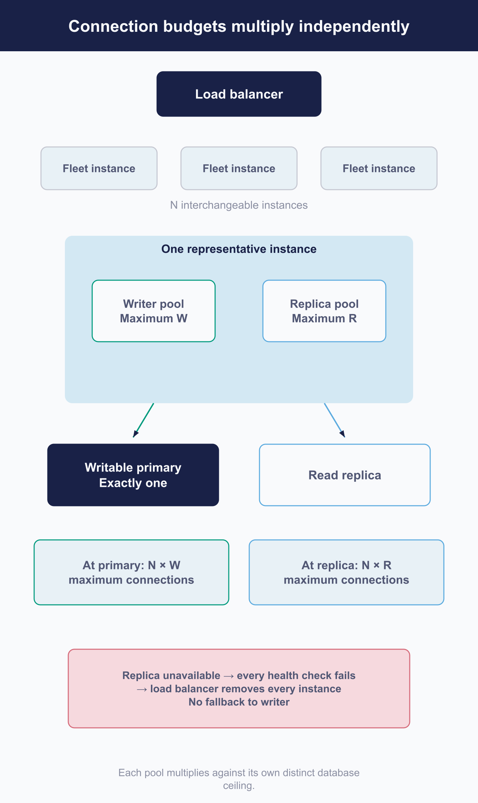

# Maintain capacity and availability

Fleet's application tier scales horizontally against shared stores. That sentence is most of the good news, and the rest of the chapter is about the constraints it hides.

**There is no universal capacity number to give you.** Fleet publishes no supported instance count, no recovery-time target and no sizing formula, and its reference architecture is an example rather than a guarantee. What this chapter can give you is **the shape of the constraints**, the signals worth acting on, and the specific things that get worse rather than better when you add instances.

## Start from Fleet's topology constraints

 Four facts that bound every decision below.

1. **The application tier is stateless and horizontal.** Add instances behind a load balancer.
2. **The stores are shared.** Every instance talks to the same database and the same Redis.
3. **There is one writable database primary.** Replicas are for reads.
4. **Instances need a writer they can reach quickly.** Fleet's own design places them together.

**Cross-region is described for failover, not for serving from two places at once.** An active-passive design with a promoted writer is what the architecture supports; treating a distant region as a second active site is not.

[2.2](../02-administer-and-deploy-fleet/2.2-self-hosting-architecture-and-capacity.md) owns the initial topology. This chapter is about changing one that already exists.

## Turn telemetry into a capacity decision

 Adding capacity is one of several answers, and often not the right one.

**Start by asking whether anything is stalled rather than saturated.** A queue that has stopped moving, a schedule that has stopped running, a replica that has fallen behind: none of those is a capacity problem, and adding instances will not touch any of them. That question is [7.4](7.4-observe-progress-and-service-health.md)'s to answer, and it comes first because the alternative is buying hardware to fix a stuck row.

Then, in order:

1. **Is the pressure sustained**, or is it a spike you are extrapolating from?
2. **Which component is actually under pressure?** The application tier, the database, Redis, or storage. They scale differently and only one of them scales by adding instances.
3. **Is there headroom to reclaim** by tuning what you already have?
4. **What does the growth curve say** about when you would need this anyway?

> **Almost every leading indicator about Fleet's own resource pressure is on the export pipeline rather than the metrics endpoint** ([7.4](7.4-observe-progress-and-service-health.md)). If you are running only the metrics endpoint, you will see requests slowing and not see the pool waits that explain why. That is a monitoring gap presenting as a capacity mystery.

**Leading**: latency rising, database pool waits appearing, queue age growing, replication lag creeping. **Lagging**: errors, timeouts, failed check-ins. By the time you are watching the lagging set, the decision has been made for you. Diagnosing degradation once these indicators appear is [8.14](../08-troubleshooting/8.14-degradation.md).


<!-- IMAGE-TODO: assets/7.5-capacity-decision-path.webp
     QUESTION: What evidence justifies scaling instead of repairing stalled work?
     PROMPT: DIAGRAM: A diagnostic decision path starting at Slow progress. First split: Stalled
     work? → investigate queue/schedule/replica state. Otherwise Sustained pressure? No → observe
     spike against baseline; Yes → Identify constrained component. Branch that last node to
     Application, MySQL, Redis, and Storage, grouped as Component-specific remedy, with a
     Tune/reclaim headroom checkpoint before capacity expansion. Do not show Add Fleet instances as
     the answer to every branch or equate every growing queue with saturation.
     TERMINOLOGY: Fleet is the company, product, or server. Host groups are lowercase
     fleet/fleets, including headings and labels. Do not call these groups teams. Preserve
     exact code/API identifiers. These instructions are not text to render.
     DESIGN: Flat vector technical diagram. Fleet is software for managing computers; draw no
     vehicles. Use Inter labels and Roboto Mono identifiers. At 1400 px source width use 48 px
     titles, 36 px body labels, and at least 28 px secondary text; scale proportionally. Check at
     720 px reading width and intended print size. Use a 32 px spacing grid, at least 24 px node
     padding, and consistent corner radii. Center short node names; left-align multiline
     explanations. Never shrink text to fit. Use #F9FAFC background, #192147 headings and primary
     connectors, #515774 text, #8B8FA2 secondary connectors, #C5C7D1 borders, and #D3E8F3 or #E8F1F6
     quiet fills. Use #5CABDF and #C98DEF for named categories, #3AEFC4 for labelled positive
     outcomes, #D66C7B for labelled failures, and #FAA669 for labelled cautions. Tint large panels
     to 20 to 25 percent; full strength is for small marks. Keep text navy or slate, or off-white on
     a navy anchor. Never rely on colour alone. Use one arrowhead shape, consistent stroke weights,
     box-edge termination, and labelled branches and return paths. Keep connectors clear of text. No
     gradients, shadows, decorative icons, logo, watermark, em-dashes, or slogan footer. Render only
     the specified reader-facing labels. Choose orientation to fit the relationship, not a default
     poster. Keep captions outside the artwork. If labels crowd, split the figure before shrinking
     them. Keep editable SVG when the production method supports it.
     NOTE: Proposed 2026-09-08; editorial brief, not technical re-verification. Replace the ordered
     capacity questions with this route and a short instruction. Keep leading/lagging indicators and
     export-pipeline monitoring requirements. Keep current prose and this TODO until the actual
     image is reviewed. Then check alt text against the artwork and retain an accessible summary
     plus all required technical qualifications.
     CANDIDATE: ../../research/visual-reviews/part-7/assets/7.5-capacity-decision-path.webp
     Rendered and inspected for the overnight batch; awaiting final joint review.
-->

<!-- IMAGE PENDING. Install reviewed artwork, then activate the image line below.

-->

## Scale Fleet instances safely

 The one place where adding instances actively hurts.

> ### Connection budgets are per pool, per instance, and they multiply
>
> Fleet's writer connection pool has a maximum defaulting to **fifty**. **The replica pool has its own maximum, taking the same default independently.** Those are ceilings on concurrent connections rather than connections held at rest, and they are separate ceilings against separate endpoints: the writer pool goes to the primary, the replica pool to the replica.
>
> **Each instance carries its own pair.** So the worst case at the primary is the writer maximum times your instance count, and the worst case at the replica is the replica maximum times your instance count. Neither figure is the sum of both, and the primary does not absorb the replica's share.
>
> **Set both maximums deliberately before scaling out**, each sized against what that endpoint can serve, rather than leaving either at the default and discovering the ceiling under load.

**Keep configuration identical across instances.** They are interchangeable only if they are actually the same.

**And give the load balancer a real health check** ([7.4](7.4-observe-progress-and-service-health.md) on what that check does and does not cover).



<!-- IMAGE-TODO: assets/7.5-connection-budget-multiplies.webp
     QUESTION: How does adding Fleet instances affect each database endpoint independently?
     PROMPT: DIAGRAM: Title: Connection budgets multiply independently. Use a tall composition that keeps
     pool labels and equations readable. One load balancer feeds a row of identical Fleet instance
     cards, with N instances as a variable rather than a recommended count. Expand one representative
     instance beneath that row. It contains exactly two separate pools: Writer pool, Maximum W
     concurrent connections; Replica pool, Maximum R concurrent connections. Show no combined budget.
     Writer pool points only to Writable primary, Exactly one. Replica pool points only to Read replica.
     Put two distinct equations below the cutaway: At primary: N × W maximum concurrent connections;
     At replica: N × R maximum concurrent connections. End each at its own separate ceiling bar:
     Primary's own connection limit; Replica's own connection limit. Use matching writer and replica
     line accents, with neutral text. Explain that these are ceilings on concurrent connections,
     not connections held at rest. Never sum the pools or make the primary absorb replica connections.
     Mark the read replica with a small failure cross. Below the equations, draw a separate rose failure
     chain: Configured read replica unavailable → Health check fails on every instance → Load balancer
     removes every instance. Qualify this as health-check-based removal. State No fallback to the writer.
     Keep this conditional failure chain separate from normal traffic; no failover connector. Do not
     print a numeric database limit, instance recommendation, safe estate size, or sizing formula.
     TERMINOLOGY: Fleet is the company, product, or server. Host groups are lowercase
     fleet/fleets, including headings and labels. Do not call these groups teams. Preserve
     exact code/API identifiers. These instructions are not text to render.
     DESIGN: Flat vector technical diagram. Fleet is software for managing computers; draw no
     vehicles. Use Inter labels and Roboto Mono identifiers. At 1400 px source width use 48 px
     titles, 36 px body labels, and at least 28 px secondary text; scale proportionally. Check at
     720 px reading width and intended print size. Use a 32 px spacing grid, at least 24 px node
     padding, and consistent corner radii. Center short node names; left-align multiline
     explanations. Never shrink text to fit. Use #F9FAFC background, #192147 headings and primary
     connectors, #515774 text, #8B8FA2 secondary connectors, #C5C7D1 borders, and #D3E8F3 or #E8F1F6
     quiet fills. Use #5CABDF and #C98DEF for named categories, #3AEFC4 for labelled positive
     outcomes, #D66C7B for labelled failures, and #FAA669 for labelled cautions. Tint large panels
     to 20 to 25 percent; full strength is for small marks. Keep text navy or slate, or off-white on
     a navy anchor. Never rely on colour alone. Use one arrowhead shape, consistent stroke weights,
     box-edge termination, and labelled branches and return paths. Keep connectors clear of text. No
     gradients, shadows, decorative icons, logo, watermark, em-dashes, or slogan footer. Render only
     the specified reader-facing labels. Choose orientation to fit the relationship, not a default
     poster. Keep captions outside the artwork. If labels crowd, split the figure before shrinking
     them. Keep editable SVG when the production method supports it.
     NOTE: Layout and labels refined 2026-09-08 for readable collection artwork, against
     the current chapter. This editorial adaptation is not a new release verification.
     Preserve published artwork and prose until the final joint review. Do not mark IMAGE-OK yet.
     CANDIDATE: ../../research/visual-reviews/part-7/assets/7.5-connection-budget-multiplies.webp
     Rendered and inspected for the overnight batch; awaiting final joint review.
-->
### Draining, which needs more time than it is given

**Fleet's own behaviour:** on shutdown it allows a bounded window of about **thirty seconds** for work to finish, while the request window it will accept is considerably longer. Those two numbers do not match, and the shorter one is not a promise that everything completes inside it.

**The rest is operational practice**, and it is two things done together:

1. **Pre-drain.** Take the instance out of the load balancer's rotation and let in-flight work finish *before* signalling the process. This is the half that actually protects requests.
2. **Allow more than thirty seconds after the signal** in whatever your platform uses to bound termination, sized against the longest request you accept.

Doing only the second is not enough, because the shutdown window is not where the protection comes from. **Check what your own platform's termination behaviour is** rather than assuming it matches Fleet's window.

## Scale MySQL, Redis, and object storage by their own limits

 Three dependencies, three different constraints, none of them Fleet's.

**MySQL** is the one that constrains most. There is a single writer, so writes scale vertically. Reads can go to replicas, with the consequence in the next section.

**Redis** is memory and connections. **Watch evictions from Redis itself**: whether and when a key is evicted is your Redis configuration's behaviour rather than Fleet's, and Fleet does not surface it either way.

**Object storage** has no Fleet-side signal. Two buckets serve several features between them, and **Fleet imposes no timeout of its own on the agent's download path**, so slow storage tends to present as installs that hang rather than as installs that fail. Whatever timeouts exist come from the layers beneath, and if a content delivery layer sits in front, its degradation is silent too.

**Apply the vendor's procedure for whichever is the bottleneck, then re-check the consequence for Fleet.** Resizing a database can change connection limits, which changes the pool arithmetic above.

## Design failure domains and regional recovery

 What each loss costs, and one that is worse than it looks.

| Lost | Effect |
|---|---|
| **A Fleet instance** | The case the design handles, if the others have headroom. **Work it had already accepted can still be lost** on an ungraceful stop ([7.3](7.3-upgrade-fleet-and-fleetd.md)), and its own in-flight requests fail |
| **The database primary** | Fleet stops. Recovery is promotion, and its speed is your database platform's |
| **Redis** | Live queries and pending notification sets are lost; most else self-heals ([7.2](7.2-back-up-and-restore-service-state.md)) |
| **Object storage** | Software delivery and bootstrap fail. **Fleet gives no signal**, so watch it from the storage side ([7.4](7.4-observe-progress-and-service-health.md)) |
| **A read replica** | **See below** |

> ### A read replica is a hard availability dependency
>
> **If a configured read replica becomes unavailable, the health check fails on every instance, and there is no fallback to the writer.**
>
> So a component added for performance, which most people would describe as optional, takes the whole deployment out when it fails. Load balancers acting on that health check will remove every instance.
>
> **If you run a replica, you need a tested degraded-mode plan**: how to take it out of the configuration, and whether the primary alone has the capacity to serve what the replica was serving. Discovering the second half during the incident is the bad version of this.

**For regional recovery**, plan active-passive: writer promotion, traffic redirection, name resolution, certificates, secrets, and object data all have to move or already be there. **Fleet publishes no recovery-time target**, so yours comes from measuring your own procedure ([7.2](7.2-back-up-and-restore-service-state.md)).

## Test load and failover assumptions

 The only way any of the above stops being a belief.

**Fleet ships a load-simulation tool called `osquery-perf`** that drives the server with the traffic a managed estate produces: agent-shaped enrolment, configuration and distributed-query polls and log submission, alongside the separate Apple MDM, declarative device management and Platform SSO check-ins a managed device makes. It generates that traffic by fabricating query results from built-in OS templates rather than running osquery, so **it proves what the server can absorb, not what a query costs on a real endpoint.** It is more capable than its documentation suggests, and it is the honest way to answer "what happens at twice this size" for the agent-facing half of the system.

> **Fleet's own load-test results are in its tree, and they are evidence of a specific thing.** They record a particular version, workload, duration and infrastructure. **They are a measurement of Fleet's test deployment, not a capacity guarantee for yours**, and citing them without those four qualifiers is how a number becomes folklore.

**What is worth exercising:**

- **Instance loss** under load, confirming the remaining instances cope.
- **Replica loss**, because of the section above.
- **A deployment**, watching whether requests are actually shed during the rollout.
- **Database failover**, timed rather than assumed.

**Measure recovery of the control loop, not just of the process.** The server accepting requests again is the first thing to come back and the least interesting: what matters is agents reporting and queues draining ([7.4](7.4-observe-progress-and-service-health.md)).

### Run osquery-perf

The tool lives in Fleet's source tree as the `osquery-perf` command, and its only requirement is a working Go toolchain; the repository builds with Go 1.26.5. There is no separate build step and no distributed binary to fetch: from a checkout you run it with `go run ./cmd/osquery-perf`, and `go run ./cmd/osquery-perf --help` prints its flags. It authenticates the way a real agent does, with an enroll secret, so there is no edition or licence dimension to it: point it at a server, hand it a secret, and it enrols simulated hosts. Retrieve the secret from the Fleet UI or with `fleetctl get enroll_secret`.

```sh
git clone --branch fleet-v4.90.0 https://github.com/fleetdm/fleet.git
cd fleet                                   # go run resolves ./cmd/osquery-perf from here
go run ./cmd/osquery-perf \
  -server_url "https://fleet.example.com" \
  -enroll_secret "<secret>" \
  -host_count 500
```

One machine only drives so many simulated hosts. To go past that, run several copies and shard one logical fleet between them: `-total_host_count` is the size of the whole fleet and `-host_index_offset` is where this copy starts in it, so each container drives a distinct slice without colliding on host identity. The default platform is a single template, `macos_14.1.2`; `-os_templates` takes a comma-separated selection from the tool's own built-in template set to shape the platform mix. The tool carries many further flags for check-in cadence, failure injection and reported-inventory size, so read its own flag list before a serious run.

Two properties make this a test-only tool, and both matter before you aim it anywhere. It disables TLS certificate verification on its own client unconditionally, so it will trust whatever server answers, including one impersonating yours. It also opens a [pprof](../09-appendices/a.6-glossary-and-release-compatibility.md#pprof) server on `localhost:6060` on the machine running it. Run it against a disposable test server on an isolated network, not against production and not across a path you do not control.

### What osquery-perf cannot tell you

It fabricates results and never runs osquery, so it says nothing about agent CPU or query cost on a real device: the endpoint half of performance is out of its reach entirely.

It drives only the agent-facing surface. The read-heavy REST API traffic an integration or the Fleet MCP server generates is not part of its load, and that traffic is not small: a single assistant question can fan out into one Fleet call per fleet or per matching item, and a live query it launches dispatches to as many as several hundred hosts at once ([6.6](../06-automate-fleet/6.6-connect-fleet-to-an-ai-assistant.md)). Size that half separately from what `osquery-perf` reports.

Its workload is synthetic in a second way as well. The failure-injection defaults, such as a high software-query failure probability, are fixtures set for the generator's own baseline rather than a model of how often real hosts fail, so a figure you extrapolate from the default shape is extrapolated from a fixture. Traffic arrives from one or a few machines that share a source IP and check in on the fixed intervals you set, so per-device TLS, IP-based behaviour and push-driven check-in timing stay unexercised.

And it measures nothing itself: no capacity number comes out of the generator. You read the effect from Fleet's own signals ([7.4](7.4-observe-progress-and-service-health.md)) and from your database and Redis vendor metrics, and whatever you read belongs to that one run, on the terms of the folklore warning above.

## Review capacity after material change

 The step that keeps the rest current.

**Re-measure after**: significant host growth, a new automation that touches every host, a cadence change, a Fleet upgrade, connecting an integration or the Fleet MCP server that adds read-heavy API and live-query traffic ([6.6](../06-automate-fleet/6.6-connect-fleet-to-an-ai-assistant.md)), and any dependency resize.

Fleet upgrades deserve their own mention. **A release can change what work happens per host or per interval**, and a deployment that was comfortable can stop being comfortable without anyone changing anything ([7.3](7.3-upgrade-fleet-and-fleetd.md) records the baseline you compare against).

**Recalculate the connection arithmetic on every instance-count change.** It is the easiest thing to get wrong and the one that fails hardest.
