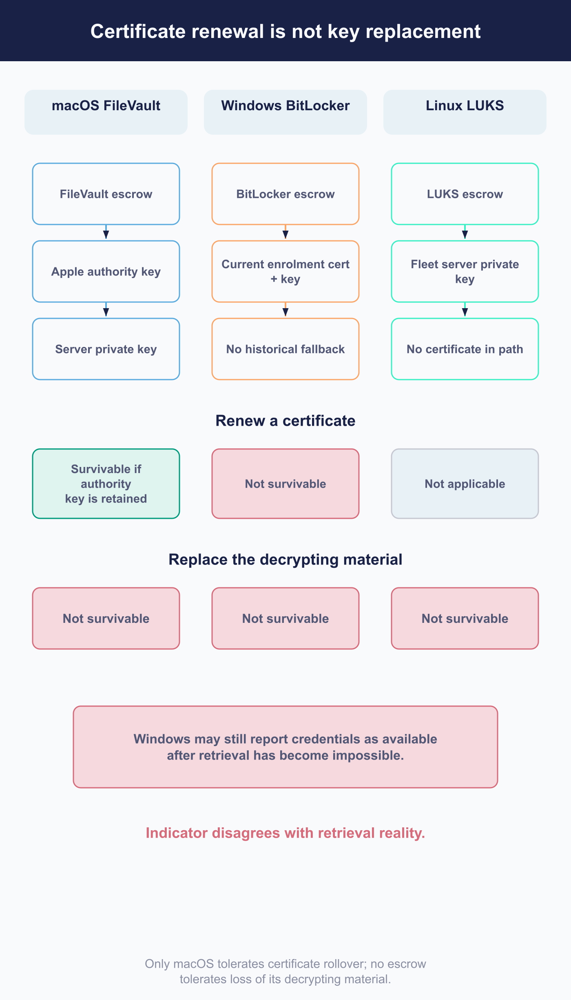

# Maintain credentials, certificates, and privileged access

Most of what this chapter covers has a date on it. Certificates expire, tokens expire, a licence expires, and the consequences of each arriving unhandled range from an inconvenience to losing the ability to decrypt your own disks.

**The distinction that runs through the chapter is between renewing a certificate and replacing key material.** They look like the same maintenance task. They are not, and [5.8](../05-manage-devices/5.8-enforce-disk-encryption-and-manage-recovery-credentials.md) already established what the difference costs.

## Inventory operational trust material

 What Fleet depends on, and what breaks when each one lapses.

| | What it does | On expiry or loss |
|---|---|---|
| **HTTPS certificate** | Agents and administrators trust the server | Agents stop connecting. The most visible failure here |
| **Fleet server private key** | Encrypts stored assets in the database, including the Apple certificate authority material and Linux escrow. **Supplied separately from the database** | Encrypted assets become unreadable. Not recoverable by reissuing anything |
| **Apple push certificate** | Reaching Apple devices | Commands stop arriving ([8.8](../08-troubleshooting/8.8-apple-mdm-diagnostics.md)). **Removing it does more than this: see below** |
| **Apple MDM certificate authority** | Protects macOS escrow. **Stored in the database**, encrypted with the key above | Retrieval fails while it is inactive |
| **Windows enrolment identity** | Windows enrolment **and BitLocker escrow retrieval** | Retrieval fails, and Fleet does not notice |
| **Apple Business Manager and App Store tokens** | Enrolment assignment, purchased apps | Assignment and installation stop |
| **Identity provider and integration secrets** | Sign-in, tickets, calendars, webhooks | The affected integration stops |
| **Fleet MCP server's API-only token and client bearer** | Lets an AI assistant call Fleet under one identity, gated by a shared secret over SSE | Neither expires on its own. A forgotten one stays valid indefinitely; revoke and reissue per [6.6](../06-automate-fleet/6.6-connect-fleet-to-an-ai-assistant.md) rather than waiting for it to lapse |
| **The licence** | Premium features | **Nothing, at this release. See below** |

## Monitor expiry, advisories, and entitlement

 Almost none of this warns you in advance.

**Fleet's own alerting is uneven, not absent.** The Apple push certificate, the Apple Business token, and each Volume Purchasing token get an in-app warning (an app-wide banner plus a coloured Renew date column) starting thirty days out and again after expiry ([2.10](../02-administer-and-deploy-fleet/2.10-apple-mdm-configuration.md)). Nothing else in the table above gets that treatment: there is no metric, no webhook, no email, and no in-app warning for the HTTPS certificate, the server's private key, the Apple MDM certificate authority, the Windows enrolment identity, identity provider and integration secrets, or the MCP server's tokens. Dates for those live only in an external console, Apple's or your identity provider's.

**So the calendar is yours to build** ([7.1](7.1-define-the-service-operating-model.md)), and it needs the lead time each renewal actually requires rather than just the date.

### The licence is a special case worth understanding

**An expired Premium licence does not demote Fleet at this release.** Expiry is deliberately ignored during validation, and the interface Fleet uses internally to ask about entitlement cannot ask whether the licence expired. Premium features keep working.

What you can actually observe:

- **The expiry timestamp**, readable by any authenticated role through the configuration endpoint. **This is the only signal available in advance**, and it is why [7.1](7.1-define-the-service-operating-model.md) puts licence expiry on a calendar you maintain.
- **A response header** marking the licence expired, after the fact.
- **A warning from the command-line client**, and one at server startup.
- **A banner in the interface**, after expiry only, and behind several others in priority.

> **Poll the expiry timestamp and compare it yourself.** That is the only advance signal available.
>
> And **do not write "Fleet keeps working after expiry" into a plan as though it were a grace period.** It is this release's behaviour, not a commitment, and building a renewal process on it is building on something nobody promised.

**Security advisories are this chapter's to notice and 7.3's to execute.** Somebody has to be subscribed and reading, and that ownership belongs on the calendar alongside the expiries. Once an advisory becomes a release, it is an upgrade with a shorter deadline than usual ([7.3](7.3-upgrade-fleet-and-fleetd.md)).

## Renew HTTPS trust without disconnecting agents

 The failure mode is an estate that goes quiet.

Agents validate the server's certificate. **Break that and they stop checking in**, which looks like a mass outage and is one. Separating a served-chain or reachability failure from the rest is [8.5](../08-troubleshooting/8.5-fleetctl-debug.md), whose connection check distinguishes what a browser trusts from what the agent bundle trusts.

The order that avoids it:

1. **Keep the hostname and the chain compatible.** A changed name is not a renewal, it is a migration, and every agent has to learn about it.
2. **If the trust root is private, distribute the new root first**, and confirm arrival before switching.
3. **Cut over.**
4. **Verify against representative agents on each platform**, not just a browser.

**Check-in counts are the measure of success**, not a successful request from your own machine ([7.4](7.4-observe-progress-and-service-health.md)).

<!-- IMAGE-TODO: assets/7.6-private-ca-cutover.webp
     QUESTION: In what order should a private trust root and served TLS chain change?
     PROMPT: DIAGRAM: A dependency sequence with Operator/server and Representative agents lanes.
     Distribute new private root → agents receive it → verify trust on representative platforms →
     switch served chain → confirm check-ins continue. The cutover arrow must wait on verification,
     not merely on dispatch. Show hostname continuity as a fixed boundary along the sequence, since
     a hostname change is a migration. A small browser-only check is marked Insufficient evidence.
     No absolute dates, invented outage duration, or instruction to remove the old root before
     overlap is tested.
     TERMINOLOGY: Fleet is the company, product, or server. Host groups are lowercase
     fleet/fleets, including headings and labels. Do not call these groups teams. Preserve
     exact code/API identifiers. These instructions are not text to render.
     DESIGN: Flat vector technical diagram. Fleet is software for managing computers; draw no
     vehicles. Use Inter labels and Roboto Mono identifiers. At 1400 px source width use 48 px
     titles, 36 px body labels, and at least 28 px secondary text; scale proportionally. Check at
     720 px reading width and intended print size. Use a 32 px spacing grid, at least 24 px node
     padding, and consistent corner radii. Center short node names; left-align multiline
     explanations. Never shrink text to fit. Use #F9FAFC background, #192147 headings and primary
     connectors, #515774 text, #8B8FA2 secondary connectors, #C5C7D1 borders, and #D3E8F3 or #E8F1F6
     quiet fills. Use #5CABDF and #C98DEF for named categories, #3AEFC4 for labelled positive
     outcomes, #D66C7B for labelled failures, and #FAA669 for labelled cautions. Tint large panels
     to 20 to 25 percent; full strength is for small marks. Keep text navy or slate, or off-white on
     a navy anchor. Never rely on colour alone. Use one arrowhead shape, consistent stroke weights,
     box-edge termination, and labelled branches and return paths. Keep connectors clear of text. No
     gradients, shadows, decorative icons, logo, watermark, em-dashes, or slogan footer. Render only
     the specified reader-facing labels. Choose orientation to fit the relationship, not a default
     poster. Keep captions outside the artwork. If labels crowd, split the figure before shrinking
     them. Keep editable SVG when the production method supports it.
     NOTE: Proposed 2026-09-08; editorial brief, not technical re-verification. Replace the short
     renewal sequence explanation with the dependency diagram. Keep the numbered procedure,
     endpoint/chain diagnostics, and check-in verification criterion. Keep current prose and this
     TODO until the actual image is reviewed. Then check alt text against the artwork and retain an
     accessible summary plus all required technical qualifications.
     CANDIDATE: ../../research/visual-reviews/part-7/assets/7.6-private-ca-cutover.webp
     Rendered and inspected for the overnight batch; awaiting final joint review.
-->

<!-- IMAGE PENDING. Install reviewed artwork, then activate the image line below.

-->

## Renew MDM certificates and tokens in the safe order

 The section where a routine renewal can cost you your recovery credentials.

> ### Never remove Apple MDM to renew the push certificate
>
> **Upload the renewed certificate over the existing configuration.**
>
> Removing Apple MDM does not only stop push. It deactivates the Apple certificate authority material at the same time, so **FileVault credential retrieval stops working immediately.** Reconfiguring afterwards mints a new certificate authority key, and everything escrowed under the previous one is no longer reachable through Fleet's normal path.
>
> **If it has already been removed, stop before reconfiguring.** Preserve the database, the backups and the server private key, and treat it as an incident. Reconfiguring is the step that makes it hard to undo.

<!-- IMAGE-TODO: assets/7.6-renewal-versus-replacement.webp
     QUESTION: How does certificate renewal differ across the three escrow populations?
     PROMPT: DIAGRAM: Title: Certificate renewal has different escrow consequences. Scope: existing escrow
     retrieved through a working Fleet configuration. Use a tall three-column comparison with aligned
     rows below, allowing enough space for all conditions without smaller type. Columns: macOS
     FileVault, Windows BitLocker, Linux LUKS. Keep their dependency chains strictly separate.
     macOS: FileVault escrow depends on the Apple authority key; include separate Current certificate
     and Historical certificates chips. A Fleet server private key above the authority key protects
     that authority material, making this a transitive dependency rather than direct FileVault use.
     Windows: BitLocker escrow depends on the Current enrolment certificate + key, Only. Say No
     historical fallback and Certificate participates in retrieval. No connection to the Fleet server
     private key. Linux: LUKS escrow depends directly on Fleet server private key, with No certificate
     in this path. Keep all arrows inside their platform column and clear of supporting labels.
     Below the columns, Renew certificate has three aligned results: macOS, Survivable if the authority
     key is retained; Windows, Not survivable, even with the same key pair; Linux, Not applicable,
     No certificate. A second row Replace the decrypting key says Not survivable for each platform.
     A warning specific to Windows says Fleet still reports credentials available after the certificate
     changes. This is a dependency comparison, not a storage map. Do not include key values, contents,
     tables, backup boundaries, storage locations, or retrieval instructions. Do not suggest loss through
     Fleet proves the device has no other recovery route or that preserved old material is useless.
     TERMINOLOGY: Fleet is the company, product, or server. Host groups are lowercase
     fleet/fleets, including headings and labels. Do not call these groups teams. Preserve
     exact code/API identifiers. These instructions are not text to render.
     DESIGN: Flat vector technical diagram. Fleet is software for managing computers; draw no
     vehicles. Use Inter labels and Roboto Mono identifiers. At 1400 px source width use 48 px
     titles, 36 px body labels, and at least 28 px secondary text; scale proportionally. Check at
     720 px reading width and intended print size. Use a 32 px spacing grid, at least 24 px node
     padding, and consistent corner radii. Center short node names; left-align multiline
     explanations. Never shrink text to fit. Use #F9FAFC background, #192147 headings and primary
     connectors, #515774 text, #8B8FA2 secondary connectors, #C5C7D1 borders, and #D3E8F3 or #E8F1F6
     quiet fills. Use #5CABDF and #C98DEF for named categories, #3AEFC4 for labelled positive
     outcomes, #D66C7B for labelled failures, and #FAA669 for labelled cautions. Tint large panels
     to 20 to 25 percent; full strength is for small marks. Keep text navy or slate, or off-white on
     a navy anchor. Never rely on colour alone. Use one arrowhead shape, consistent stroke weights,
     box-edge termination, and labelled branches and return paths. Keep connectors clear of text. No
     gradients, shadows, decorative icons, logo, watermark, em-dashes, or slogan footer. Render only
     the specified reader-facing labels. Choose orientation to fit the relationship, not a default
     poster. Keep captions outside the artwork. If labels crowd, split the figure before shrinking
     them. Keep editable SVG when the production method supports it.
     NOTE: Layout and labels refined 2026-09-08 for readable collection artwork, against
     the current chapter. This editorial adaptation is not a new release verification.
     Preserve published artwork and prose until the final joint review. Do not mark IMAGE-OK yet.
     CANDIDATE: ../../research/visual-reviews/part-7/assets/7.6-renewal-versus-replacement.webp
     Rendered and inspected for the overnight batch; awaiting final joint review.
-->
### The three escrow populations do not renew alike

| Population | What decrypts it | Certificate rollover |
|---|---|---|
| **macOS FileVault** | The Apple certificate authority key, with current and historical certificates | **Safe, while the same authority key is retained** |
| **Windows BitLocker** | The **current** enrolment certificate and key | **No rollover support at all** |
| **Linux LUKS** | The Fleet server private key | No certificate involved. Replacing the key loses readability |

**Only macOS has a safe certificate-rollover path, and only while its authority key is kept.** No platform survives replacement of the key that actually decrypts.

Everything in that table is about **retrieving existing escrow through a working Fleet configuration.** It says nothing about what a device could still do for you by other means, and nothing about material you have preserved outside Fleet, both of which may matter in a genuine recovery.

> ### Windows renewal, and why the status lies
>
> Renewing the Windows enrolment certificate makes existing BitLocker escrow unreadable, **even when the key pair is unchanged**, because retrieval matches against the current certificate and there is no historical fallback.
>
> **And Fleet goes on reporting those credentials as available.** Windows escrow is marked usable when it arrives and is excluded from the job that re-checks the others, so the indicator keeps showing the value it recorded before the change.
>
> **Re-escrowing before the change does not help**, because anything escrowed beforehand is encrypted to the old certificate.
>
> The workable plan starts with what is certainly available: **preserve and verify the old certificate and key, and your recovery set, before the change.** Keeping the old material is what makes the old population recoverable at all.
>
> Re-establishing a readable population under the new certificate then requires new escrow to occur. **Fleet exposes no single supported operation that re-escrows an existing population on demand**, so plan that half against your own deployment rather than assuming a command exists, and **verify by retrieving one credential afterwards.** Until that retrieval succeeds, treat the post-change Windows population as unproven regardless of what the status says.

## Protect key continuity and recovery credentials

 One instruction, and it is the chapter's most important.

**Back up the server private key and the Windows enrolment identity as material, separately from the database** ([7.2](7.2-back-up-and-restore-service-state.md)). The Apple certificate authority material is not on that list because it is already in the database; what it needs is the key that decrypts it.

A database restore without them recovers rows you cannot read. And because the three populations depend on three different things, **partial preservation gives you partial recovery**, in a way that is not obvious until you try.

**Verify by retrieving, not by counting.** Fleet's availability indicators are recorded state rather than live tests, and the Windows one is stale by construction after a certificate change.

**What a retrieval proves is bounded**: that the service can still decrypt a stored value on that chain. It does not prove the whole population is readable, and it does not prove the credential would unlock a device. Both of those are separate questions ([5.8](../05-manage-devices/5.8-enforce-disk-encryption-and-manage-recovery-credentials.md)). It is still the only evidence worth having, and you do not need to display or use the value.

**Per-host privileged credentials sit outside this inventory** and carry their own reveal-and-rotate lifecycles: the managed local administrator password ([5.5](../05-manage-devices/5.5-design-setup-and-self-service-experiences.md#retrieve-and-rotate-the-managed-local-administrator-password)), and Recovery Lock and the disk-encryption keys ([5.8](../05-manage-devices/5.8-enforce-disk-encryption-and-manage-recovery-credentials.md#reveal-validate-and-repair-disk-recovery-credentials-safely)).

## Rotate service and integration secrets

 The mechanics vary; the sequence does not.

**Where the far end supports two credentials at once**, overlap, and the sequence is: create the new one, distribute it to every consumer, **verify the workflow still runs**, then revoke the predecessor. The verification step is the one that gets skipped, and it is the one that catches the consumer nobody remembered.

**Where it does not support two**, there is no transition to arrange and the change is a brief outage. Plan it as one: agree a window, prepare every consumer's new value in advance, cut over, and verify immediately rather than at the end of the day. Doing this without a window means discovering your consumer list by watching things break.

**Find the consumers first.** [6.1](../06-automate-fleet/6.1-automation-design-and-change-control.md)'s one-identity-per-workflow convention exists partly so this question has an answer.

**The Fleet MCP server's two secrets fall into different halves of this.** Its Fleet API token has no built-in transition, so rotating it is the second pattern: update the server's configuration, restart it, then re-run the allowed-and-denied check [6.6](../06-automate-fleet/6.6-connect-fleet-to-an-ai-assistant.md) walks through. Its client bearer is entirely yours to reissue whenever a client that held it should lose access, on the same restart-and-verify sequence.

## Review privileged access

 What a review can establish, and what it cannot.

**What to do, concretely.** List every user and API-only identity with its role and fleet scope, and reconcile that against the workflow inventory [6.1](../06-automate-fleet/6.1-automation-design-and-change-control.md) asks you to keep. List each identity's sessions with their creation times, so a token created years ago and never revoked is visible as such. Check any endpoint restrictions still match what the workflow does. **Where identities come from an identity provider, the group mapping is the thing to review, and the provider's own record is the authority for who is in those groups rather than Fleet's.**

**What you cannot**:

> **When a token was last used.** Fleet records it and no interface returns it.
>
> **Where a session came from.** No address, no client, no user agent.
>
> **Which token did something.** Several tokens can belong to one identity and are indistinguishable in the record.

**There is no rotation operation for an API token.** It is an ordinary session, shown once when created. Rotating means revoking and authenticating again with a password you control, or recreating the identity ([2.6](../02-administer-and-deploy-fleet/2.6-user-accounts-roles-and-service-identities.md)).

**API-only sessions do not expire**, so an unrevoked token is valid indefinitely. Combined with no last-used signal, that makes a periodic review the only control: an identity nobody can account for should be revoked rather than left because revoking it might break something.

## Prepare for compromise

 Decided in advance, because none of it is quick to work out during.

1. **Contain.** Revoke the credential. **Revocation stops the next request and cancels nothing already queued** ([6.1](../06-automate-fleet/6.1-automation-design-and-change-control.md)), so establish separately what was already ordered.
2. **Establish the blast radius** from activities, remembering they record the account rather than the client, and record no reads beyond a few sensitive ones.
3. **Rotate outward.** Every credential the compromised one could have reached.
4. **Decide about key material.** If the server private key may be exposed, replacing it makes everything encrypted under it unreadable. **That is the same decision this chapter opens with**, made under pressure, which is why it is worth having thought about first.
5. **Preserve evidence before cleaning up.** The database, the logs, and whatever your external log destination holds.
6. **Re-enrol or re-escrow** where the trust was in device-facing material.

**The step people miss is the second one.** Revoking is fast and feels like resolution. Work already queued under that credential is still going to run.

## Reference and troubleshooting

 What each role and each API-only identity may do, by scope, is in [a.4](../09-appendices/a.4-roles-and-permissions-matrix.md). Authentication and versioning for the endpoints these credentials call is in [a.8](../09-appendices/a.8-api-action-and-endpoint-reference.md).

For reading activities and audit events during containment, see [8.12](../08-troubleshooting/8.12-audit-logs.md).
