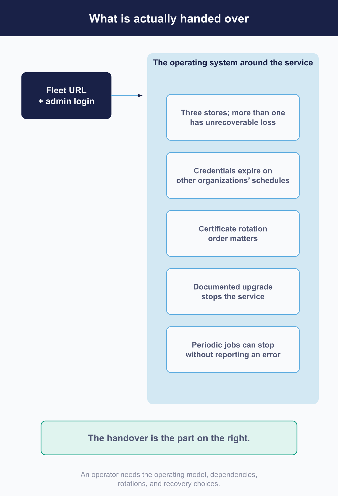

# Production readiness checklist and handoff

Everything Fleet documents about running Fleet is now behind you. What is left is the part nobody documents, which is also the part that gets handed over.

## Purpose and scope

 This chapter turns Part II's deployment and this part's operating practice into something another person can operate. It covers what is actually being handed over, the obligations that have no published procedure, and what has to be true before a deployment carries real hosts.

It assumes Part II and the six chapters before this one.

## What is being handed over

 Not a server. A set of standing obligations, most of which are invisible on the day everything works.

There are three data stores with different consequences on loss, and more than one of them can lose things that nothing reconstructs.

- There are credentials that expire on other organizations' schedules, several of which live in consoles that are not Fleet.
- There is a certificate whose rotation can disconnect every agent if it is done in the wrong order.
- There is an upgrade whose documented procedure stops the service, though not every deployment runs it that way.
- There is a set of periodic jobs that can quietly stop without anything reporting an error.
- And if the deployment runs a Fleet MCP server for an AI assistant, there is another standing service with its own credential, its own liveness probe that lies by omission, and its own rotation and retirement steps ([6.6](../06-automate-fleet/6.6-connect-fleet-to-an-ai-assistant.md), [7.4](7.4-observe-progress-and-service-health.md), [7.6](7.6-maintain-credentials-certificates-and-access.md)) that an inheriting operator won't know exist unless someone tells them.

An operator who inherits the URL and the admin password has inherited none of that, and will meet each item for the first time at the worst available moment. Writing them down is the handover.

<!-- IMAGE-TODO: assets/7.7-what-is-handed-over.webp
     PROMPT: Landscape 16:9. Centre-left, a single small filled rectangle labelled "the Fleet
     URL and an admin login", drawn small and plain. An arrow from it to the right opens into
     a much larger bracketed group labelled "what is actually being handed over", containing
     five stacked labelled rows: "three stores, more than one of them unrecoverable", "credentials that
     expire on other organizations' schedules", "a certificate whose rotation order matters",
     "an upgrade whose documented procedure stops the service", "periodic jobs that can stop
     without erroring". The size contrast between the small rectangle and the large group is
     the whole point, so exaggerate it. Use a single dot colour at light tint for the large
     group's fill and full strength only for the small rectangle's outline. Caption: "The
     handover is the part on the right."
     PALETTE. Two sets, doing different jobs.
     STRUCTURE, the Fleet Black ramp and neutrals: #192147 for the most important marks,
     #515774 for ordinary labels, #8B8FA2 and #C5C7D1 for secondary structure, #E2E4EA for
     grouping bands, #F9FAFC background, #D3E8F3 and #E8F1F6 for quiet fills. All text stays
     in this set; do not tint type.
     THE FLEET DOTS, the six accent colours taken from Fleet's own logo mark: #5CABDF sky
     blue, #3AEFC4 mint, #63C740 green, #C98DEF lavender, #FAA669 apricot, #D66C7B rose.
     Fleet Green #009A7D sits alongside them. These are soft and pastel, so they work as
     fills with #192147 text on top.
     STRENGTH. Use a dot colour at full strength only for small marks: an arrow, a chip, a
     single filled icon, a rule. Over any large area, use it at roughly a 20 to 25 percent
     tint, so a panel reads as tinted rather than painted. Five large panels at full
     saturation looks like a children's infographic, not a technical manual. And do not
     colour a panel that has no content in it; colour has to carry meaning, and an empty
     coloured box is just noise.
     HOW TO USE THE DOTS. One colour per category, used consistently within the image, to
     fill or stroke the things a reader genuinely has to tell apart. Take only as many as
     there are categories; do not spread all six across four items to look lively. If nothing
     in the picture needs distinguishing, use none of them and let the structure set carry it.
     GIVE IT WEIGHT. At least one element should be a solid filled shape rather than an
     outline, so the composition has an anchor. Vary stroke weight so the primary flow is
     visibly heavier than the scaffolding around it.
     Never invent a colour outside these two sets. Flat vector, generous whitespace, no
     gradients, no drop shadows, no 3D or photorealistic icons, no logo, no watermark.
     Legible at half page width.
     NOTE: "Fleet" here is a software product for managing computers. Never draw vehicles,
     cars, vans, trucks, ships or aircraft. Never use an em-dash in rendered text.
 -->

## Backup and restore have no Fleet procedure

 This is the largest gap an operator inherits, and it is worth being direct about it: Fleet publishes no backup procedure and no restore procedure. Where the subject comes up, Fleet advises backing up the database and links to MySQL's own documentation, or recommends turning on a cloud provider's managed backups.

That is a reasonable position for Fleet to take, since the mechanics belong to whichever database you chose. It is not a reasonable position for you to inherit unexamined, because it means the single most consequential operational task in the deployment has no written procedure unless somebody writes one. The written procedure is now [7.2](7.2-back-up-and-restore-service-state.md); what the handover adds is the deployment's own copy, with its hostnames and its measured restore time.

Four things make that procedure less obvious than it looks, and all four come from earlier chapters.

**MySQL's loss is the catastrophic one, but it is not the only unrecoverable one.** [1.6](../01-foundations/1.6-the-fleet-server.md) establishes what each store actually holds and what "lost" means for each, including the difference between a store being unavailable and its data being gone: Redis carries pending failing-policy deliveries and the recorded error history, and nothing reconstructs either ([7.2](../07-operate-fleet/7.2-back-up-and-restore-service-state.md)); object storage can hold completed file-carve evidence that nobody can re-upload, alongside installers and icons that anybody can. Losing MySQL costs your history, your configuration, and your enrolled estate. Whether object storage needs backup therefore depends on whether carve evidence must survive, not on how cheap installers are to replace.

**The three stores cannot be captured at one instant.** There is no single consistent snapshot across them, so a restore reconstructs a state that never quite existed. In practice this matters less than it sounds, because no supported procedure backs up Redis in any case, but it does mean the restore procedure is a database restore plus a reconciliation, not a rollback.

**The server private key is not in the database and is not optional.** A perfect database backup restored alongside a lost private key does not give you your disk encryption keys back; which escrow chains the key protects, and which it does not, is [7.2](7.2-back-up-and-restore-service-state.md)'s subject. It belongs in whatever holds your organization's other irreplaceable secrets, and it belongs in the handover document by name.

**A backup you have not restored is a hypothesis.** The restore is the part that fails, and the rehearsal that catches it is [7.2](7.2-back-up-and-restore-service-state.md)'s. What the handover records is that a restore has been performed against this deployment and how long it took, because that number is your actual recovery time regardless of what the backup schedule promises.

## Upgrades

 Fleet's documented upgrade procedure stops every instance, though its own Helm chart does not, so whether your deployment takes an outage is a choice you make and test rather than Fleet's contract. The procedure, from the recovery point through the migration to proving the service resumed, is [7.3](7.3-upgrade-fleet-and-fleetd.md); the semantic versioning commitment it plans against, and the three exceptions that can break a minor release, are recorded in [a.6](../09-appendices/a.6-glossary-and-release-compatibility.md). Three things belong in the handover itself, because a successor plans upgrade paths and maintenance windows from them.

**Within the current major version you can skip releases freely.** Going from an old 4.x directly to the latest 4.x is supported and expected. Crossing a major boundary is different and is done in stages, upgrading to the last release of the old major, migrating, testing, then moving on, so that a problem can be attributed to a specific step.

Budget the window honestly. Fleet describes migration time as seconds to minutes even on large installations, and separately describes a typical upgrade as five to ten minutes of downtime. Both are true and they measure different things: the first is the migration, the second is the whole procedure including replacing the binary or image and starting back up. Plan the maintenance window against the larger number.

Agents buffer through the outage and send what they collected once the server returns, so for a short window the cost is delay rather than loss. **That buffer is finite.** Osquery holds results until delivery succeeds or the buffer's limit is passed, at which point the oldest are discarded, and the default is a million log entries. A maintenance window is delay; an outage long enough to fill the buffer on a busy estate is a hole in the record. Tell whoever approves the window which one they are approving.

## The database user needs more permission than a careful DBA will grant

 Migrations are schema changes, so the account Fleet uses to run them must be able to create, alter and drop tables, and to create temporary tables.

This collides predictably with a sensible instinct. Asked to provision a database user for an application, a careful administrator grants read and write on the data and nothing else, and the deployment works perfectly until the first upgrade, at which point migrations fail on permissions during a maintenance window with the service already stopped.

Establish this before the handover rather than during an incident, and note it beside the restore procedure, since restoring into a fresh database has exactly the same requirement.

## Rotating the certificate can disconnect every agent

 Certificate rotation is routine work that a platform team will do without consulting anyone, and on Fleet it has a failure mode worth flagging in the handover explicitly: if the agents were deployed with an explicit certificate chain, the new chain has to reach them before the server starts presenting the new certificate. Get the order wrong and the agents fail verification and stop reporting, all at once, with the server perfectly healthy.

The rotation order that avoids this, and the hostname check that belongs beside it, are in [7.6](7.6-maintain-credentials-certificates-and-access.md). What the handover names is who rotates certificates for this deployment, and that they have read the constraint before the renewal date rather than after it.

## What to monitor, and who answers

 What to watch, how to collect it, and how to prove the alerts fire is [7.4](7.4-observe-progress-and-service-health.md). The handoff question is narrower: what should wake someone up, and which person answers when it does.

**Enrollment count is the signal that catches what the others miss.** Fleet's own suggested alerts are a change in host enrollment levels, rising endpoint latency and rising endpoint error rates. The first is the one worth insisting on, because a deployment can be healthy by every infrastructure measure while hosts quietly stop checking in, and nothing else in the stack will tell you.

Name a person for each of these, not a team. The failure this prevents is the one where the database is watched by whoever watches databases, the certificate is watched by whoever watches certificates, and the enrollment count is watched by nobody because it does not belong to either. If a Fleet MCP server is part of the deployment, name the same person for it that you named for Fleet itself ([7.1](7.1-define-the-service-operating-model.md)); it is not infrastructure with its own team, and its liveness probe answering is not the same as it working ([7.4](7.4-observe-progress-and-service-health.md)).

## A runbook for the failures that are not obviously Fleet

 These have a common shape: the symptom appears in Fleet and the cause is somewhere else, which is exactly the class of problem that a new operator loses a day to.

| What you see | Where to look first |
|---|---|
| Slow after a database change | Connection limits. The per-instance limit multiplied by instance count, against what the database accepts, from [2.2](../02-administer-and-deploy-fleet/2.2-self-hosting-architecture-and-capacity.md) |
| An unknown column error after an upgrade | Migrations did not run. The binary was replaced and the database was not prepared |
| Too many open files | The process file descriptor limit, which on plain machines is set in the service definition, from [2.4](../02-administer-and-deploy-fleet/2.4-deploy-with-containers-or-virtual-machines.md) |
| Agents stop verifying the server | The certificate chain or the hostname on the certificate, above |
| Software installers fail while health checks pass | Object storage. It is not covered by the health endpoint, from [2.2](../02-administer-and-deploy-fleet/2.2-self-hosting-architecture-and-capacity.md) |
| Hosts appear and disappear, or share an identity | Duplicate enrollment, usually a cloned machine image carrying an enrolled agent. The identifier settings are in [3.1](../03-connect-devices/3.1-enrollment-design-and-host-lifecycle.md) |
| Windows hosts report management off | They are waiting for a user to sign in, from [2.11](../02-administer-and-deploy-fleet/2.11-configure-windows-management.md) |

## Ownership that reaches outside your organization

 Several of the credentials in Part II live in consoles that are not Fleet, administered by people who may not know Fleet depends on them. That is the ownership boundary most likely to be left undrawn, and each side of it can end a capability without touching Fleet at all.

The Apple push certificate expires annually and is renewed by hand, and [2.10](../02-administer-and-deploy-fleet/2.10-apple-mdm-configuration.md) covers why it must be created under an account the organization controls rather than a person's. The Entra application registration and its permissions belong to whoever administers Microsoft identity. The Android enterprise belongs to whoever administers your Google organization, and as [2.12](../02-administer-and-deploy-fleet/2.12-bind-android-enterprise.md) records, deleting it from the Google console ends management for every enrolled Android device with no confirmation step in Fleet, and on personally owned devices Google removes the work profile too.

Write down, for each one, which console it lives in, who administers that console, and what breaks when it lapses. The renewal dates matter less than the names, because a date in a document nobody owns is not a control.

## The go-live decision

 Readiness is not a feeling, and it is not the absence of open tickets. A deployment is ready to carry real hosts when a specific set of things are true and someone is willing to say so.

The infrastructure questions: the database is backed up on a schedule, a restore has actually been performed at least once, and the recovery time is a measured number rather than an estimate. The account Fleet uses can perform schema changes. Object storage is configured rather than falling back, and an installer has been uploaded and downloaded end to end. The server private key is stored somewhere the organization will still have it after the person who generated it leaves.

The operational questions: the health endpoint is what the load balancer targets. Metrics are actually being collected, which is a real question given they are off until enabled. Someone is alerted when enrollment counts move. The upgrade procedure has been performed once, on this deployment, in a maintenance window, rather than read about.

The ownership questions: every credential in the deployment has a named owner and a named console. Every external console has someone in your organization who can reach an administrator of it. The runbook above exists in your own words, with your own hostnames in it.

A pilot is what turns these from claims into observations, which is why [2.1](../02-administer-and-deploy-fleet/2.1-administration-model-and-deployment-choices.md) puts one before the rollout. The go-live decision is mostly reviewing what the pilot already told you.

## Precedence and edge cases

 A few things about handover are worth stating because they are true of Fleet specifically rather than of software generally.

MySQL replication is supported and recommended for production, but it does not substitute for backups. A replica faithfully reproduces a deletion.

The decisions that are genuinely hard to reverse are named in [2.1](../02-administer-and-deploy-fleet/2.1-administration-model-and-deployment-choices.md), and two of them belong in the handover document because a successor will not guess them: the server URL, which [2.12](../02-administer-and-deploy-fleet/2.12-bind-android-enterprise.md) shows Fleet will accept a change to while Google keeps delivering to the old one, so editing it silently breaks Android management, and the Windows key pair, which [2.11](../02-administer-and-deploy-fleet/2.11-configure-windows-management.md) shows is also the escrow key for disk encryption.

An upgrade is never only a binary or image replacement, on any packaging. If your tooling does not run migrations deliberately, it will discover them accidentally.

## Reference and troubleshooting

 For working a problem rather than recognising one, [8.1](../08-troubleshooting/8.1-diagnostic-method.md) is the method, [8.3](../08-troubleshooting/8.3-server-logs.md) covers the server's own logs, and [8.13](../08-troubleshooting/8.13-escalation.md) covers what to gather before escalating.

Which endpoints have to be reachable from where, which is a question a security review will ask during handover, is in [a.8](../09-appendices/a.8-api-action-and-endpoint-reference.md). Command line operations are in [a.7](../09-appendices/a.7-fleetctl-command-reference.md).

## Version notes

 Verified against Fleet 4.90.0. Fleet publishes no backup or restore procedure at this release. That is a documentation gap rather than a product limitation, and it may close; the obligations it leaves with you will not.

The upgrade downtime figures come from Fleet's own guidance and describe two different things, the migration and the whole procedure. Measure your own on the first upgrade and use that number afterwards.
