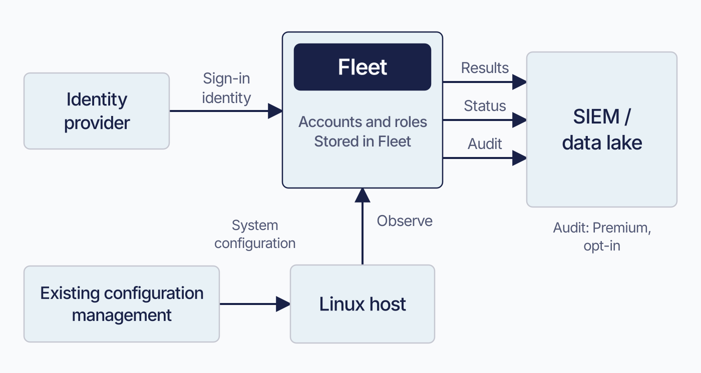

# What Fleet is

Fleet combines device inventory and management in one **control plane**: a service that stores device data, accepts configuration, and coordinates work on devices. It uses agents and operating-system management channels, commonly called mobile device management (MDM).

Administrators can use the same host record to inspect a device, target a change, and check the reported result.

Part IV covers reading device state; Part V covers changing it. Other parts cover administration, enrollment, automation, audit, and service operations.

## What does Fleet do?

 Fleet is built to answer four practical questions:

1. **What is on this device, and what was its state when it last reported?**
2. **Which devices need a configuration, remediation, or software change?**
3. **How can we make and audit that change across the estate?**
4. **Did the device actually receive and apply it?**

On macOS, Windows, and Linux, **osquery** reads device data and **Orbit** runs agent-side work. Both belong to the **fleetd** bundle. Other platforms use the management or extension paths described below.

Fleet answers the first question with **host vitals** (the hardware, OS, and network facts it collects about a device), software inventory, and reports, run live or on a schedule. Ask what version of a browser is installed across a large estate and a live report goes out to the hosts that are online and returns what they say.

Reported data reflects the last observation Fleet received. An offline laptop may still show an old browser version. Read the relevant freshness information, such as last-seen time or a report row’s fetch time. Some values, including custom vitals set through the API, have no timestamp.

Configuration you write is stored as desired state. Fleet also retains history for selected data, including uptime and vulnerabilities.

Scheduled-report storage keeps the newest result per host. Result forwarding and activity auditing have separate settings:

| Behaviour | What it does | What turns it off |
|---|---|---|
| Report storage | Replaces the previous result rows for each host and query | `discard_reports_data` disables storage server-wide and deletes stored rows; `discard_data` disables it for a report. Storage also requires snapshot logging. A fixed threshold rejects all results from a host returning more than 1000 rows. The configurable `report_cap` trims across hosts and marks the report clipped; treat clipped coverage and freshness as unknown ([4.2](../04-know-your-devices/4.2-run-queries-and-reports.md)) |
| Result forwarding | Sends results to the configured result-log destination for external retention | Automations is off by default for each query; enable it to forward that query’s results |
| Activity audit | Records administrative actions on the server, on its own independent settings | Its own separate configuration |

To forward report results, configure a server log destination and enable Automations for the query. A destination alone receives no results from queries whose forwarding is off ([2.8](../02-administer-and-deploy-fleet/2.8-activity-audit-logs-and-log-delivery.md)).

You can also export stored report rows through the REST API on a schedule. `fleetctl report` runs a new live report, and `fleetctl get reports` lists definitions; neither retrieves stored result rows.

<!-- SCREENSHOT: The Hosts page, which is the product's front door and the fastest way to
     make this chapter concrete. Show a populated list of a few dozen hosts across mixed
     platforms, with the online indicator, hostname, platform icon and fleet column all
     visible. Use realistic hostnames rather than test1 and test2, and no real serial
     numbers. Crop to the table and the filter bar above it, leaving out browser chrome.
     No highlight; the point is simply what the surface looks like. -->

Labels, policies, fleets, and vulnerability data help identify the devices that need a change.

Fleet delivers changes through software installs, scripts, profiles, MDM commands, OS settings, and disk-encryption workflows.

Check the device’s result after requesting a change. Fleet accepts the instruction, determines its targets, delivers work, and receives evidence of what happened. The visible states and audit timing depend on the delivery path.

An MDM command you send by hand writes its activity when Fleet successfully queues it. A configuration profile writes its activity when you store the desired state, and a **reconciler** (a background process that watches stored state and issues the matching device commands) works out the per-device commands afterwards. An Android profile does not use Fleet's device-command queue at all: Fleet patches a policy at Google and later checks the policy version the device reports.

For these operations, the activity entry confirms Fleet accepted the instruction. Check the device’s result separately: a queued command may wait days for check-in or be refused after delivery ([8.1](../08-troubleshooting/8.1-diagnostic-method.md)).

**Automation** uses GitOps, fleetctl, the REST API, policy automations, and integrations to make changes repeatable. **Operations** covers agent updates, logs, audit history, and server maintenance.

After a change, return to device observations to compare the result with the intended state. The lifecycle below loops from Manage to Know for that reason.

<!-- IMAGE-OK: 1.1-fleet-management-lifecycle.webp
     NOTE: reviewed 2026-08-24 and kept. The tint is right: the five stages stay
     distinguishable while the solid navy icons carry the weight, and Operate no longer reads
     as a support desk. Prompt retained for regeneration; do not delete.
     PROMPT: Fleet management lifecycle
Create a polished landscape 16:9 flat vector diagram for an enterprise endpoint-management
manual. On a off-white (#F9FAFC) background, show a single horizontal five-stage lifecycle with five
equal rounded panels and thin right-pointing arrows between them. Use #192147 text and
pale blue fills (#E8F1F6 or #D3E8F3) and a single Fleet Green (#009A7D) accent used sparingly. The panels read: "Connect: enroll devices";
"Know: inventory, reports, policies"; "Manage: software, scripts, settings";
"Automate: GitOps, API, fleetctl"; and "Operate: agents, service, audit". Give the five stage panels the five Fleet dot
colours as fills, in order, #5CABDF, #3AEFC4, #63C740, #C98DEF, #FAA669, with #192147 text on
top, since this is the diagram that introduces the shape of the whole manual and it should
look like Fleet. Include the caption: "Fleet connects device insight to controlled action." Use large, crisp, legible
typography; simple line icons; no logo, watermark, or drop shadows.
     PALETTE. Two sets, doing different jobs.
     STRUCTURE, the Fleet Black ramp and neutrals: #192147 for the most important marks,
     #515774 for ordinary labels, #8B8FA2 and #C5C7D1 for secondary structure, #E2E4EA for
     grouping bands, #F9FAFC background, #D3E8F3 and #E8F1F6 for quiet fills. All text stays
     in this set; do not tint type.
     THE FLEET DOTS, the six accent colours taken from Fleet's own logo mark: #5CABDF sky
     blue, #3AEFC4 mint, #63C740 green, #C98DEF lavender, #FAA669 apricot, #D66C7B rose.
     Fleet Green #009A7D sits alongside them. These are soft and pastel, so they work as
     fills with #192147 text on top.
     STRENGTH. Use a dot colour at full strength only for small marks: an arrow, a chip, a
     single filled icon, a rule. Over any large area, use it at roughly a 20 to 25 percent
     tint, so a panel reads as tinted rather than painted. Five large panels at full
     saturation looks like a children's infographic, not a technical manual. And do not
     colour a panel that has no content in it; colour has to carry meaning, and an empty
     coloured box is just noise.
     HOW TO USE THE DOTS. One colour per category, used consistently within the image, to
     fill or stroke the things a reader genuinely has to tell apart. Take only as many as
     there are categories; do not spread all six across four items to look lively. If nothing
     in the picture needs distinguishing, use none of them and let the structure set carry it.
     GIVE IT WEIGHT. At least one element should be a solid filled shape rather than an
     outline, so the composition has an anchor. Vary stroke weight so the primary flow is
     visibly heavier than the scaffolding around it.
     Never invent a colour outside these two sets. Flat vector, generous whitespace, no
     gradients, no drop shadows, no 3D or photorealistic icons, no logo, no watermark.
     Legible at half page width.
     NOTE: "Fleet" here is a software product for managing computers. Never draw vehicles,
     cars, vans, trucks, ships or aircraft. Never use an em-dash in rendered text. -->


## Fleet in your environment

 Plan how Fleet will work with the systems you already operate:

Your **identity provider** authenticates administrators, while Fleet stores their accounts, roles, sessions, and API tokens. Without just-in-time provisioning, Fleet needs an existing SSO-enabled account matching the asserted email. Premium just-in-time provisioning creates that account at first sign-in. Plan provisioning, role assignment, removal, and a break-glass account that can sign in without the IdP ([2.5](../02-administer-and-deploy-fleet/2.5-identity-providers-sso-scim-and-role-sync.md), [2.6](../02-administer-and-deploy-fleet/2.6-user-accounts-roles-and-service-identities.md)).

**Configuration-management tools** can continue managing systems that Fleet observes. For example, an existing tool may own a headless Linux server’s configuration while Fleet collects inventory. Linux has no Fleet MDM channel.

**SIEMs (security information and event management), data lakes, and security tools** provide long-term retention and analysis of exported Fleet data. Fleet’s own history is limited to specific features, so plan retention explicitly.

**Configure each log stream separately.** osquery results and status logs use their log plugins. Administrative activity uses a separate Premium audit plugin, off by default. Individual queries must also have result forwarding enabled ([2.8](../02-administer-and-deploy-fleet/2.8-activity-audit-logs-and-log-delivery.md)).

**Apple MDM, Windows OMA-DM (Open Mobile Alliance Device Management), and Google’s Android Management API** carry platform-specific work. For example, Fleet composes a Mac’s configuration profile and the device’s Apple MDM client applies it.

**IT asset systems** remain authoritative for procurement, financial ownership, contracts, and lifecycle. Fleet contributes reported device facts.

Fleet also stores desired configuration, such as profiles and device settings, and device-to-person mappings from an IdP or an assigned email.

Policies ask yes/no questions about devices and return pass or fail. An attached automation can respond to a failure. Keep the commercial asset record in the system that owns it.

<!-- IMAGE-OK: assets/1.1-fleet-environment-boundaries.webp
     QUESTION: Where does Fleet fit among the systems an organization already runs?
     PROMPT: DIAGRAM: Place Fleet and its own administrator-account store at the center of a small
     ecosystem. At left, Identity provider sends Sign-in identity to Fleet; annotate Fleet accounts
     and roles remain in Fleet. Below, Existing configuration management connects directly to a
     Linux host with the label System configuration, while Fleet connects to that host with Observe.
     At right, SIEM / data lake receives separately labelled Results, Status, and Audit streams from
     Fleet, with an Audit: Premium, opt-in note. Do not draw one universal export switch or suggest
     Fleet replaces the IdP or all Linux configuration management. Use simple outlines rather than
     vendor logos.
     TERMINOLOGY: Fleet is the product, server, or company. Host groups are lowercase
     fleet/fleets, even in titles and node labels. Do not call those groups teams. Preserve
     exact code/API identifiers; do not render these terminology instructions as image text.
     DESIGN: Flat vector technical diagram. Fleet is software for managing computers; draw no
     vehicles. Use Inter labels and Roboto Mono identifiers. At 1400 px source width use 48 px
     titles, 36 px body labels, and at least 28 px secondary text; scale proportionally. Check at
     720 px reading width and intended print size. Use a 32 px spacing grid, at least 24 px node
     padding, and consistent corner radii. Center short node names; left-align multiline
     explanations. Never shrink text to fit. Use #F9FAFC background, #192147 headings and primary
     connectors, #515774 text, #8B8FA2 secondary connectors, #C5C7D1 borders, and #D3E8F3 or #E8F1F6
     quiet fills. Use #5CABDF and #C98DEF for named categories, #3AEFC4 for labelled positive
     outcomes, #D66C7B for labelled failures, and #FAA669 for labelled cautions. Tint large panels
     to 20 to 25 percent; full strength is for small marks. Keep text navy or slate, or off-white on
     a navy anchor. Never rely on colour alone. Use one arrowhead shape, consistent stroke weights,
     box-edge termination, and labelled branches and return paths. Keep connectors clear of text. No
     gradients, shadows, decorative icons, logo, watermark, em-dashes, or slogan footer. Render only
     the specified reader-facing labels. Choose orientation to fit the relationship, not a default
     poster. Keep captions outside the artwork. If labels crowd, split the figure before shrinking
     them. Keep editable SVG when the production method supports it.
     NOTE: Reviewed and installed 2026-09-09 in the live 4.91 and frozen 4.90 editions.
     Checked against the chapter and its version-specific evidence during the editorial pass.
     The surrounding text retains technical qualifications and accessible explanation.
     SOURCE: research/visual-reviews/part-0-1/assets/1.1-fleet-environment-boundaries.svg
-->


## What Fleet can do on each platform

 Fleet presents a common interface, but each platform supports different collection and management paths:

When a capability is unavailable, check the following possible causes:

1. **Platform support.** Linux has no MDM channel for configuration profiles.
2. **Fleet implementation.** The Chrome extension supports live reports but has no scheduled-result upload path.
3. **Licence.** Premium requirements apply per feature. A request may return a licence error, while the UI may omit the control entirely.
4. **Prerequisites.** The feature may require MDM enrollment or a particular fleetd version.
5. **Configuration and permissions.** For example, the server’s `scripts_disabled` setting refuses every script run. Your role must also permit the action.


| Device class | Device-data path | Agent action path | Platform-management path |
|---|---|---|---|
| macOS | fleetd and osquery | Orbit: scripts, installer-based software, fleetd updates | Apple MDM: profiles, MDM commands, App Store apps via the Volume Purchasing Program (VPP) |
| Windows | fleetd and osquery | Orbit: scripts, installer-based software, fleetd updates, **and lock, which is a script here rather than an MDM command** | Windows device management (OMA-DM): profiles, MDM commands, wipe |
| Linux | fleetd and osquery | Orbit: scripts, installer-based software, disk-encryption (LUKS) key escrow, lock and wipe as scripts | **none** |
| iOS / iPadOS | MDM-reported inventory | **none** | Apple MDM: profiles, commands, App Store apps via the Volume Purchasing Program (VPP) |
| Android | Android Management API (AMAPI)-reported inventory | A narrow Fleet app for certificate delivery only | Android Management API: policy, managed applications |
| ChromeOS | Fleetd for Chrome, a force-installed extension | **none** | **none**; Google Admin manages the Chromebook |

macOS, Windows, and Linux run osquery through fleetd. iOS, iPadOS, and Android mainly supply inventory through their management channels. Some records exist before device contact: Apple Business Manager sync can create a pending host ([1.2](1.2-how-fleet-reaches-a-device.md), [3.5](../03-connect-devices/3.5-enroll-ios-and-ipados-devices.md)).

**FileVault uses all three paths.** An MDM profile enables encryption and initial escrow. osquery retrieves the encrypted recovery key. For rotation, Orbit runs Escrow Buddy and osquery retrieves the new key. Check each path when troubleshooting FileVault.

For failed scripts or installer-based software delivery, check Orbit and the agent path.

**Licence requirements apply per feature.** Named fleets and software installation require Premium. Scripts are available on Free, with fleet-scoped execution requiring Premium. Profiles have separate gates for fleet scope, label targeting, and content. MDM commands also have command-specific requirements.

Fleet variables in Apple and Windows profiles require Premium; Apple also validates individual variables and certificates. Android accepts supported variables on Free but gates particular profile content, currently `systemUpdate`.

Use [a.2](../09-appendices/a.2-platform-capability-matrix.md) to check platform support, licence, and prerequisites, then follow the owning chapter for the procedure.

Part III covers enrollment and prerequisites for each platform.

## The main components, and what each one does

 Fleet coordinates several device-side components. ChromeOS’s extension and Android’s certificate app have the separate roles described above.

**fleetd** is the macOS, Windows, and Linux installer bundle. It contains Orbit, osquery, and optionally Fleet Desktop.

**Fleetd for Chrome** is a browser extension. Force-install it through Google Admin, which continues to manage it. Its service worker enrolls in Fleet and answers live reports from virtual tables. It provides no scheduled reports or native fleetd processes ([3.7](../03-connect-devices/3.7-enroll-chromeos-devices.md)).

**osquery** answers questions about the running host, letting Fleet query many devices together.

**Orbit** manages osquery’s version and configuration, installs software, runs scripts, and updates fleetd.

**Fleet Desktop** provides user-facing policy information, self-service software, and dialogs.

**The OS MDM client** applies native management instructions. Apple and Microsoft provide the device clients. Fleet implements enrollment, profile and command construction, queueing, and result handling on the server.

**The Fleet service** holds the desired state, receives results, and coordinates the rest.

## Try Fleet without deploying anything

 `fleetctl preview` (alias `sandbox`) starts a disposable Fleet server in Docker on your machine. Use it to explore Fleet before choosing a deployment path.

```sh
fleetctl preview --tag v4.90.0 --preview-config fleet-v4.90.0 --no-hosts
```

`--tag` picks the Fleet server image; it defaults to `latest`, which drifts. `--preview-config` picks the branch or tag of `fleetdm/fleet` that the docker-compose files are pulled from; it defaults to `main`, which also drifts. The two take different forms of the same release: `--tag` is the published server image, which drops the `fleet-` prefix (`v4.90.0`), while `--preview-config` is the repository's git tag, which keeps it (`fleet-v4.90.0`). Pinning each to its own form gets you the server version and compose setup this manual describes.

Keep `--no-hosts` unless you intend to enroll your workstation. Without it, preview downloads and runs Orbit and osqueryd locally and enrolls the machine alongside the simulated Linux containers.

`preview` creates `~/.fleet/config` with a `default` sandbox context if the file is absent. With an existing configuration, it adds a `preview` context. Later commands still default to `default`, so select the sandbox explicitly: `fleetctl get hosts --context preview`.

If your existing `~/.fleet/config` is present but fails to parse, `preview` overwrites it and every context it held is gone. Back the file up first if you already use `fleetctl` against a real deployment. [A.7](../09-appendices/a.7-fleetctl-command-reference.md#the-exit-zero-register) tracks this as Z30, alongside the full authorization chain `preview` runs inside the sandbox it creates.

When you're done:

```sh
fleetctl preview stop     # stop the containers and the local agent; keep the data
fleetctl preview reset    # remove the containers and Orbit's update files; keeps the config dir and named volumes
```

[A.7](../09-appendices/a.7-fleetctl-command-reference.md#fleetctl-preview-two-sandbox-subcommands) has the full reference for both, including what neither one touches.
