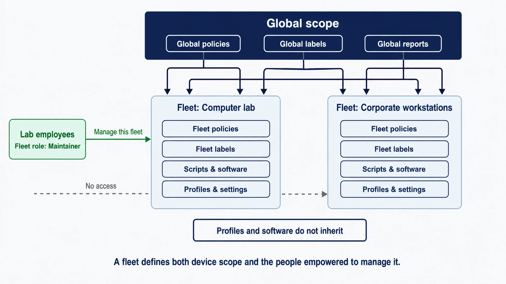
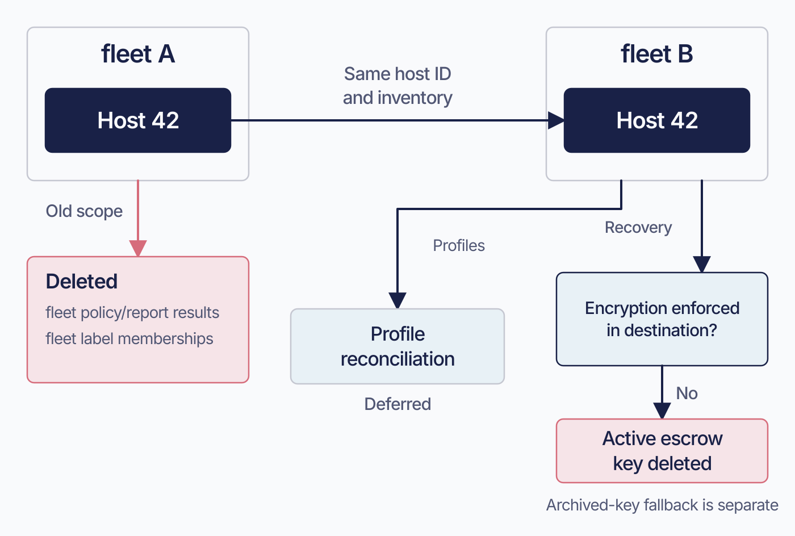

# Hosts, fleets, labels, and targeting

 Organizing devices well lets you share administration and make targeted changes without rebuilding the structure for every rollout. A computer lab can have its own administrators and baseline, while a small pilot group receives a new application first. Fleet gives you two complementary tools for those decisions:

- **fleets** define the configuration and administrative scope a host belongs to.
- **Labels** select hosts globally or within a fleet for a particular action.

Use fleets for shared configuration and administration. Use labels to select devices within the scope an item can reach.

A host belongs to one named fleet or to Unassigned. It can belong to many labels, and label membership can change as its reported state changes.

Named fleets are available in Fleet Premium. Free uses a single scope for all hosts. Both editions support labels, with separate licence requirements for some targeting features.

Before creating a fleet for Marketing’s extra application or Engineering’s different setting, check whether label targeting within an existing fleet will meet the need.

Profiles and software match their assigned scope exactly. Two fleets with nearly identical requirements need separate profile and software assignments. Global policies, scheduled reports, and labels also apply inside named fleets.

Copying a global policy into every fleet gives hosts duplicate checks. Placing a profile in global scope reaches Unassigned hosts; named fleets need their own profile assignments.

Create a fleet when devices need a distinct configuration baseline or administrators. Use label targeting for smaller differences supported by the item.

## What a host record holds

 A host record is Fleet’s persistent view of a device. It collects identity, inventory, report results, policy status, software activity, and management history as the device interacts with Fleet.

<!-- SCREENSHOT: SS-1.3-01 | The host record and its fleet
     PURPOSE: Show how identity, scope and observed device facts meet in host details.
     PREPARE: Use a fictional host assigned to Workstations, with software inventory and policy results populated.
     CAPTURE: Capture the host header, fleet assignment, basic hardware/OS details, and navigation to software, policies and activity.
     FRAME: One upper-page view with readable labels; leave long serial numbers and identifying user data out of frame.
     EDITION: 4.91; reuse for 4.90 only when the visible controls and wording match
     PRIVACY: Use demo names and non-sensitive data; exclude tokens, passwords, keys, and personal identifiers.
     FILENAME: ss-1.3-01.png
-->

<!-- EDITORIAL-NOTE: Use selectable fleetctl output for the command-line representation of this host rather than a terminal screenshot. SS-1.3-01 supplies the useful visual of the host record. -->

Fleet uses enrollment identifiers to recognize returning devices. Re-enrollment refreshes trust while preserving the host’s fleet assignment.

The detailed identity rules, node-key lifecycle, and re-enrollment behaviour belong in the host identity reference and troubleshooting material.

Check both fleet placement and device identity before re-enrolling a host:

**An enrollment secret places new hosts.** Re-enrolling an existing host with another fleet’s secret preserves its current assignment. Use an explicit transfer to move it.

Duplicate identifiers can merge host records on some enrollment paths. Serial matching applies to supported Apple MDM enrollment paths and is skipped elsewhere; UUID matching depends on the identifier used by the path. When two devices match one record, Fleet logs a warning and lets the newer enrollment overwrite the data. The record’s details can then alternate between devices.

TPM-backed host identity certificates reject duplicate identifiers. Enrollment fails with a certificate/host mismatch instead of merging the records.

## fleets in Fleet

### fleets define configuration scope

 A host belongs to one named fleet or to **Unassigned**. That placement helps determine the configuration it receives. Different item types use scope differently, so check the behavior of the item you are assigning:

| Item | Scoped to the fleet only | Also inherited from global |
|---|---|---|
| Configuration profiles | yes | no |
| Software | yes | no |
| Enrollment secrets | yes | no |
| Agent options, the **osquery** part | the fleet's document is used whole, or the global one is. **Never a mix** | **only when the fleet has no agent options at all.** A fleet document that omits an osquery setting does not inherit that setting, it simply goes without it |
| Agent options, the **Orbit** part: `update_channels`, `command_line_flags`, extensions | read from the fleet's own document | **no**, apart from the script execution timeout, and not even when the fleet has no document at all. A fleet that does not name a channel does not inherit the global one ([3.8](../03-connect-devices/3.8-manage-fleetd-orbit-and-updates.md)) |
| Roles | a fleet role reaches that fleet | **yes**, a global role authorizes work on every fleet's resources |
| Policies | fleet policies apply to the fleet | **yes**, global policies apply as well |
| Scheduled reports | fleet reports apply to the fleet | **yes**, global reports apply as well |
| Labels | fleet-scoped labels are available in the fleet | **yes**, global labels are available everywhere |

For osquery options, fallback applies to the whole document. A fleet with no agent-options document uses the global one. A fleet document that omits an osquery setting leaves that setting absent. Orbit options have the different rules shown in the table.

A fleet groups devices by ownership, operating model, or lifecycle. It carries policies, software, profiles, reports, agent options, enrollment secrets, and roles. Global policies, reports, and labels still apply.

**Unassigned** has its own policies, software, profiles, and controls. Hosts can enroll directly into a named fleet: placement may come from an enrollment secret, an Apple Business token’s platform default, or the Android or ChromeOS enrollment path ([3.1](../03-connect-devices/3.1-enrollment-design-and-host-lifecycle.md)). Use Unassigned as a staging area only if your enrollment paths place hosts there.

Use fleets for durable differences in device purpose, ownership, management, or service level. Use labels for device attributes and supported selections.

### How global and fleet scopes interact

 Use global policies, reports, and labels for requirements shared across the organization. Use fleet-scoped items for a group’s configuration and operating needs.

A global label is available across fleets; a fleet-scoped label is confined to its fleet. In both cases, targeting filters the hosts the item can already reach.

#### What "global" does and does not mean

Global policies, reports, and labels apply alongside their fleet-scoped counterparts. Profiles and software use the exact scope shown in the table above.

Profiles and software assigned to Unassigned reach Unassigned hosts. Named fleets require their own assignments.

Check an item’s assignment scope before its labels. A host outside that scope is ineligible regardless of label membership.

#### Deleting a fleet does not delete its hosts

Deleting a fleet moves its hosts to Unassigned and preserves their history. They lose the deleted fleet’s assignments and receive the Unassigned baseline.

Fleet queues obsolete profiles for removal. Installed software stays on the device even though the deleted fleet’s packages are no longer available; uninstall it separately.

<!-- IMAGE-OK: 1.3-fleet-scope-delegation.webp
     NOTE: reviewed 2026-08-24 and kept. All three faults are fixed: connectors land on the
     fleet panels, "Profiles and software do not inherit" is its own callout rather than an
     annotation on the label arrows, and "No access" reads as a statement about people.
     Prompt retained; do not delete.
     PROMPT: Global scope, fleet scope, and delegated administration
Create a polished landscape 16:9 flat-vector diagram on an off-white (#F9FAFC) background. A wide top
panel labelled "Global scope" contains "Global policies", "Global labels", and "Global
reports" and connects to two distinct lower panels: "Fleet: Computer lab" and "Fleet:
Corporate workstations". Each fleet panel contains "Fleet policies", "Fleet labels",
"Scripts & software", and "Profiles & settings". A people card labelled "Lab employees" and
"Fleet role: Maintainer" connects only to Computer lab with the label "Manage this fleet";
Corporate workstations shows "No access" for that group. Caption: "A fleet defines both device
scope and the people empowered to manage it." Use #192147 text, pale blue fills (#E8F1F6 or #D3E8F3) and a single Fleet Green (#009A7D) accent used sparingly, thin connector lines, generous whitespace, and large crisp text. No logo,
watermark, drop shadows, or extra text.
     PALETTE. Two sets, doing different jobs.
     STRUCTURE, the Fleet Black ramp and neutrals: #192147 for the most important marks,
     #515774 for ordinary labels, #8B8FA2 and #C5C7D1 for secondary structure, #E2E4EA for
     grouping bands, #F9FAFC background, #D3E8F3 and #E8F1F6 for quiet fills. All text stays
     in this set; do not tint type.
     THE FLEET DOTS, the six accent colours taken from Fleet's own logo mark: #5CABDF sky
     blue, #3AEFC4 mint, #63C740 green, #C98DEF lavender, #FAA669 apricot, #D66C7B rose.
     Fleet Green #009A7D sits alongside them. These are soft and pastel, so they work as
     fills with #192147 text on top.
     STRENGTH. Use a dot colour at full strength only for small marks: an arrow, a chip, a
     single filled icon, a rule. Over any large area, use it at roughly a 20 to 25 percent
     tint, so a panel reads as tinted rather than painted. Five large panels at full
     saturation looks like a children's infographic, not a technical manual. And do not
     colour a panel that has no content in it; colour has to carry meaning, and an empty
     coloured box is just noise.
     HOW TO USE THE DOTS. One colour per category, used consistently within the image, to
     fill or stroke the things a reader genuinely has to tell apart. Take only as many as
     there are categories; do not spread all six across four items to look lively. If nothing
     in the picture needs distinguishing, use none of them and let the structure set carry it.
     GIVE IT WEIGHT. At least one element should be a solid filled shape rather than an
     outline, so the composition has an anchor. Vary stroke weight so the primary flow is
     visibly heavier than the scaffolding around it.
     Never invent a colour outside these two sets. Flat vector, generous whitespace, no
     gradients, no drop shadows, no 3D or photorealistic icons, no logo, no watermark.
     Legible at half page width.
     NOTE: "Fleet" here is a software product for managing computers. Never draw vehicles,
     cars, vans, trucks, ships or aircraft. Never use an em-dash in rendered text. -->

### fleets are also delegation boundaries

 Fleet lets an administrator assign a user a role on one or more specific fleets. That user can work with the hosts and fleet-scoped resources their role permits, without being given access to the other fleets merely because they administer one of them.

For example, a computer-lab fleet can have its own policies, software, and settings, while lab employees receive an appropriate role for that fleet. The central endpoint team retains global access and can manage organization-wide configuration; the lab team can manage the lab within the responsibilities assigned to its fleet role.

A separate fleet is useful when the devices need their own configuration ownership, access delegation, software catalog, enrollment path, or lifecycle.

### What a transfer costs

 A transfer lets a device move to a new operating baseline while keeping its host identity. Before transferring it, review the results and memberships that belong to its current fleet so you can preserve any history you need.

**Kept:** the host record and its ID, hardware identity, software inventory, host vitals, activity history, global policy results, global report results, and memberships in global labels, including all the built-ins.

**Deleted:** old fleet policy results, fleet report results, and memberships in labels scoped to that fleet.

Export old fleet results before moving a host if you need them. Subsequent reports build state for the destination; they do not restore the deleted history.

Fleet reconciles profile differences rather than reinstalling every profile. On Apple and Windows, a periodic job performs reconciliation after the transfer, so device settings change over the following minutes.

Check disk encryption in the destination before transferring a host. If it is not enforced, Fleet deletes the host’s active escrowed recovery key across platforms. Enforcing encryption again allows it to be escrowed again. Until then, recovery may depend on an archived key.

When a reported non-empty key differs from the active value, Fleet archives the incoming key before updating the active row. This includes the first key reported. If the active row is missing, the read path tries the newest archived copy. Recovery succeeds only if that copy can be decrypted.

Archive recovery requires a previously ingested key that remains decryptable with Fleet’s current private key ([1.6](1.6-the-fleet-server.md)). Confirm the destination’s encryption setting even when an archive is available.

The host reports new policy and report results for its destination scope. It does not re-report a recovery key while Fleet is no longer requesting one.

Transfers require authorization for both fleets. An administrator scoped to one end of the move is refused; the error names the action rather than identifying the missing scope.

<!-- IMAGE-OK: assets/1.3-host-transfer-state.webp
     QUESTION: What survives a fleet transfer, and what must be checked beforehand?
     PROMPT: DIAGRAM: Show the same host identifier moving from fleet A to fleet B. A persistent
     outline travels with it containing Host ID and inventory. A small old-scope tray stays behind
     with crossed-out items fleet policy/report results and fleet label memberships, labelled
     Deleted; a separate tray at B is labelled New scope evaluated. Beneath the move, a deferred
     Profile reconciliation path compares desired settings. Beside the destination, place the
     decision Encryption enforced? with a No branch to Active escrow key deleted, and a separate
     note Archived-key fallback is distinct. Never imply that all history disappears, that
     reconciliation is instantaneous, or that deleting the active row deletes every archive.
     TERMINOLOGY: Fleet is the product, server, or company. Host groups are lowercase
     fleet/fleets, even in titles and node labels. Do not call those groups teams. Preserve
     exact code/API identifiers; do not render these terminology instructions as image text.
     DESIGN: Flat vector technical diagram. Fleet is software for managing computers; draw no
     vehicles. Use Inter labels and Roboto Mono identifiers. At 1400 px source width use 48 px
     titles, 36 px body labels, and at least 28 px secondary text; scale proportionally. Check at
     720 px reading width and intended print size. Use a 32 px spacing grid, at least 24 px node
     padding, and consistent corner radii. Center short node names; left-align multiline
     explanations. Never shrink text to fit. Use #F9FAFC background, #192147 headings and primary
     connectors, #515774 text, #8B8FA2 secondary connectors, #C5C7D1 borders, and #D3E8F3 or #E8F1F6
     quiet fills. Use #5CABDF and #C98DEF for named categories, #3AEFC4 for labelled positive
     outcomes, #D66C7B for labelled failures, and #FAA669 for labelled cautions. Tint large panels
     to 20 to 25 percent; full strength is for small marks. Keep text navy or slate, or off-white on
     a navy anchor. Never rely on colour alone. Use one arrowhead shape, consistent stroke weights,
     box-edge termination, and labelled branches and return paths. Keep connectors clear of text. No
     gradients, shadows, decorative icons, logo, watermark, em-dashes, or slogan footer. Render only
     the specified reader-facing labels. Choose orientation to fit the relationship, not a default
     poster. Keep captions outside the artwork. If labels crowd, split the figure before shrinking
     them. Keep editable SVG when the production method supports it.
     NOTE: Reviewed and installed 2026-09-09 in the live 4.91 and frozen 4.90 editions.
     Checked against the chapter and its version-specific evidence during the editorial pass.
     The surrounding text retains technical qualifications and accessible explanation.
     SOURCE: research/visual-reviews/part-0-1/assets/1.3-host-transfer-state.svg
-->

## Labels

### Labels group hosts

 Labels provide flexible selections for an attribute, host vital, rollout, policy, report, software title, profile, or other fleet-scoped item. A host can belong to many labels all at once, or none.

A label has a membership type and an owner. Automation must read the correct field for each.

**Membership type** determines how hosts enter and leave the label:

| Membership type | Membership comes from | Good use |
|---|---|---|
| Dynamic | An osquery result evaluated on the host | Operating-system, hardware, software, or configuration characteristics |
| Manual | An administrator-maintained host list | A deliberate pilot, exception group, or project cohort |
| Host vitals | Criteria evaluated against reported host vitals | Department, end-user, model, or other available vital data |

**Ownership** distinguishes labels you create from Fleet’s built-in labels for supported platforms and conditions.

Built-in labels also have membership types, and Fleet uses more than one. Check that type when investigating a built-in label’s population; ownership determines who can edit it.

Use a label when the selection can change over time or is narrower than the fleet’s enduring purpose. For example, a **Canary ring** label can select a few devices inside a Workstations fleet without creating another configuration scope.

#### Labels can themselves be fleet-scoped

A label is global by default and can be used across fleets. With Premium, you can instead confine it to one fleet: only hosts in that fleet are evaluated, and their membership is cleared if they leave. This label-scope capability has its own licence check, separate from the one for named fleets; all labels are global on Free.

Label names are globally unique either way, so there cannot be a `Canary` label in two fleets. Pick names that survive that constraint.

#### Why exclude targeting behaves differently from include

Dynamic label membership is refreshed when the host next reports, roughly hourly by default and deliberately jittered so an estate does not refresh in lockstep. Manual membership applies immediately, since nothing on the host has to run.

With **include** targeting, an unevaluated host waits until a report establishes its membership.

With **exclude** targeting, an unevaluated host could otherwise receive an item that its next report would exclude.

Profiles and software wait for each host to report after a dynamic label’s creation. Fleet compares the host’s last label report with the label’s creation time. Once the host has reported, normal include and exclude rules determine eligibility. (Fleet 4.90.0 has a gap for a host re-enrolling through DEP: it could receive a profile with a dynamic exclusion before reporting label results. 4.90.1 closes that gap.)

**Manual exclusions take effect immediately.** Their membership is administrator-maintained and requires no host report. The waiting rule applies to dynamic labels.

Policies use current membership without checking the label’s age. A fresh dynamic exclusion can therefore allow a policy to run before a host has been evaluated. Reports support no exclusion mode.

Create and populate a dynamic label before using it as an exclusion. For profiles and software, a new exclusion delays eligibility until each host reports, roughly an hour by default for healthy hosts and potentially indefinitely for offline ones.

When a host leaves an item’s target population:

- **Profiles:** Fleet queues an installed profile for removal when label membership takes the host out of its target population. A profile delivered before an exclusion takes effect may therefore be installed and then removed, a round trip the user can notice.
- **Software:** the host loses access to the software title when it leaves the target population. An application already installed stays on the device; removing it requires a separate uninstall.

A late exclusion can cause a profile to be installed and then removed. For software, it can leave an unwanted application installed until you explicitly uninstall it.

#### A label whose query fails keeps its old membership

A label-query error preserves existing membership. A successful query that returns no match can remove membership.

The label page does not distinguish stale membership from current membership. A label can still list hosts after its query has failed repeatedly.

Stale include membership can keep delivering an item to a host that should have left. Stale exclude membership can keep withholding it from a host that now qualifies.

Compare the host’s last label update with the membership row’s timestamp when the population looks stale ([8.6](../08-troubleshooting/8.6-server-state.md)).

#### Renaming a label in GitOps deletes and recreates it

The name is the identity. Changing it in YAML removes the old label and creates a new one, which clears every membership and resets the label's age.

Because the exclusion guard above compares a host's last report against the label's creation time, renaming a label used in an exclusion re-arms the delay for every host. Rename in the interface first, then update the YAML to match.

### Targeting: how fleets and labels combine

 Targeting starts with the hosts an item’s assignment scope can reach. For a fleet-scoped item, that is its fleet. Global policies, reports, and labels can reach hosts in named fleets and Unassigned; profiles and software assigned globally reach Unassigned hosts. Labels then narrow that starting population.

Scope establishes the eligible population; labels filter it. Labels cannot expand an item’s assignment scope.

<!-- SCREENSHOT: SS-1.3-02 | Comparing profile and software targeting
     PURPOSE: Show that label-targeting combinations depend on the kind of item.
     PREPARE: In a Premium demo fleet, prepare harmless profile and software entries plus two labels, Canary ring and macOS. Open their targeting editors without applying new changes.
     CAPTURE: Capture the profile targeting controls and, separately, the software targeting controls. Show the actual include/exclude and any/all options offered by each editor, with fleet scope visible.
     FRAME: Deliver two matched crops at the same scale; leave controls unselected where selecting them would hide the alternatives. Capture the actual UI, not a composed mockup.
     EDITION: 4.91; reuse for 4.90 only when the visible controls and wording match
     PRIVACY: Use demo names and non-sensitive data; exclude tokens, passwords, keys, and personal identifiers.
     FILENAME: ss-1.3-02.png
-->

<!-- IMAGE-OK: assets/1.3-fleets-scope-labels-target.webp
     WHY: The caption overgeneralizes fleet-local targeting; the example needs explicit scope. Label pills touch boundaries.
     PROMPT: Show overlapping label selections within one fleet. Use a compact landscape canvas.
     Title: "Label selections within a fleet". Three peer containers are labelled "fleet: Workstations",
     "fleet: Kiosks", and "Unassigned". Use different pale category fills with the same border weight.
     Place eight identical laptop outlines in Workstations and three each in the other containers.
     In Workstations, draw two closed dashed outlines labelled "Canary ring" and "macOS".
     The first encloses three hosts, the second four, and they share exactly one host. Arrange the
     hosts to make that intersection unambiguous; highlight the shared host and label it "Matches both".
     Keep the label text on clear background above the boundaries, with padding around each label.
     Inside Workstations add "Example: label filtering within the Workstations scope".
     Below the peer containers place one plain scope note: "Global labels are available across fleets."
     The outlined subsets illustrate selection within this example, not the full reach of global labels.
     Do not call Unassigned a named fleet. Do not imply that a label expands an item's assignment scope.
     No arrows are needed: containment and intersection carry the meaning. Do not add a summary footer.
     TERMINOLOGY: Fleet is the product, server, or company. Host groups are lowercase
     fleet/fleets, even in titles and node labels. Do not call those groups teams. Preserve
     exact code/API identifiers; do not render these terminology instructions as image text.
     DESIGN: Flat vector technical diagram. Fleet is software for managing computers; draw no vehicles.
     Use Inter for labels and Roboto Mono for literal identifiers. On a 1400 px wide canvas use
     48 px titles, 36 px body labels, and at least 28 px secondary text; scale proportionally.
     Check the raster at 720 px wide and at its intended print size. Never shrink text to fit.
     Use a 32 px spacing grid, at least 24 px internal padding, and consistent corner radii.
     Left-align multiline explanations; center short node names. Keep a clear reading direction.
     Use #F9FAFC background, #192147 headings and primary connectors, #515774 body text,
     #8B8FA2 secondary connectors, #C5C7D1 borders, and #D3E8F3 or #E8F1F6 quiet fills.
     Use #5CABDF and #C98DEF only to distinguish named categories; #3AEFC4 for a labelled
     positive outcome, #D66C7B for a labelled failure, and #FAA669 for a labelled caution.
     Use accents at 20 to 25 percent tint for panels; full strength only for small marks.
     Keep text navy or slate, with off-white text on a navy anchor. Do not rely on color alone.
     Use one arrowhead shape and consistent stroke weights. Put connectors behind nodes,
     terminate at box edges, and keep labels clear of lines. Label branches and return paths.
     No gradients, shadows, decorative icons, logo, watermark, em-dashes, or slogan footer.
     Render only the specified reader-facing labels. Instructions and review notes stay out of the image.
     NOTE: Reviewed and installed 2026-09-09 in the live 4.91 and frozen 4.90 editions.
     Checked against the chapter and its version-specific evidence during the editorial pass.
     The surrounding text retains technical qualifications and accessible explanation.
     SOURCE: research/visual-reviews/part-0-1/assets/1.3-fleets-scope-labels-target.png
-->

There are four targeting modes in Fleet:

| Targeting mode | Meaning |
|---|---|
| Include any | Deliver to hosts with at least one listed label |
| Include all | Deliver only to hosts with every listed label |
| Exclude any | Deliver to the scoped hosts except those with at least one listed label |
| Exclude all | Deliver to the scoped hosts except those with **every** listed label |

Supported modes and combinations vary by item:

| Item | Include any | Include all | Exclude any | Exclude all | Can combine include with exclude |
|---|---|---|---|---|---|
| Policies | yes | yes | yes | **yes** | **yes**, one of each |
| Configuration profiles | yes | yes | yes | **no** | **yes**, one include mode plus exclude-any |
| Software | yes | yes | yes | **no** | **no**, exactly one mode |
| Scheduled reports | yes | yes | **no** | **no** | not applicable, no exclusions exist |

Check the combination column when writing API or GitOps payloads. For example, an include list combined with exclude-any is valid on a profile but rejected for software.

**Label targeting is separately gated for policies, reports and profiles**, so on Free those controls are absent rather than merely unused, and software deployment does not exist there at all.

The same shape is visible in Fleet's own storage, which is the way to confirm what an item actually recorded: each item's label table carries an `exclude` and a `require_all` column, and the four combinations are the four modes above. Reports are the visible exception even there, since `query_labels` has `require_all` and no `exclude` column at all ([8.6](../08-troubleshooting/8.6-server-state.md#8613-scoping-which-fleet-which-labels-was-this-host-targeted)).

A practical rollout pattern:

1. Put the configuration in the fleet that owns it.
2. Use a canary label for an initial ring.
3. Expand or remove the label target after validation.
4. Keep the fleet membership unchanged unless the device’s *long-term operating model* changes.

**Rule of thumb:** Use a label when the answer is a temporary or cross-cutting selection such as platform, hardware architecture, department, rollout ring, or a policy condition.

## Fleets and teams, reports and queries

 Fleet’s current vocabulary uses **fleets** and **reports** where older material used **teams** and **queries**. The interface, API, command line, and GitOps gained the new names through aliases, so you will still encounter the older identifiers when reading data or maintaining automation.

What that means in practice, if you are writing automation:

- **The database was not renamed.** Anything reading Fleet's storage directly still sees `team` and `queries`.
- **Both names work wherever a rename has been configured for that field or parameter**, across request bodies, query strings, GitOps YAML and command-line flags. The old form logs a deprecation warning rather than failing. It is a per-field alias rather than a blanket rule, so do not assume every renamed concept has both forms on every surface.
- **Responses carry both keys.** A renamed field is emitted twice, under the old name and the new one. Never treat an absent `team_id` as meaning "no fleet", and never assert on the number of keys in a response.
- **Use one name for each field or parameter.** Supplying both aliases in a query string or JSON body rejects the request. When updating a script to the newer vocabulary, replace the old spelling rather than adding the new one alongside it.

[a.6](../09-appendices/a.6-glossary-and-release-compatibility.md) carries the surface-level mapping of which vocabulary is used where, including how Unassigned is stored, which is not one shape. It does not enumerate every renamed field.

## Summary

- Use **a fleet** for separate administrators, update channels, or enrollment placement. A distinct profile or software assignment can often use labels within an existing fleet. A separate enrollment secret also needs no new fleet: Fleet supports up to 50 secrets globally and per fleet ([3.1](../03-connect-devices/3.1-enrollment-design-and-host-lifecycle.md)). osquery options can fall back to global, and Orbit extensions support label filters.
- Use **a label** for a rollout selection that will expand or dissolve within an existing scope.
- Use **a label** for reports covering a shared device property across fleets.
- Use **a fleet transfer** when a device changes organizational ownership or its operating baseline.

Use the item’s targeting support to decide whether a label is sufficient.

**Update-channel pilots require a fleet**, even for a short trial: labels do not choose update channels ([3.8](../03-connect-devices/3.8-manage-fleetd-orbit-and-updates.md)). Orbit extensions can use label filters, with Premium required for that filter.

The detailed targeting validation rules, label refresh timing, GitOps identity rules, and scope-precedence examples belong in the GitOps and reference chapters. Part VIII contains the diagnostic material for delayed membership and enrollment identity questions.
