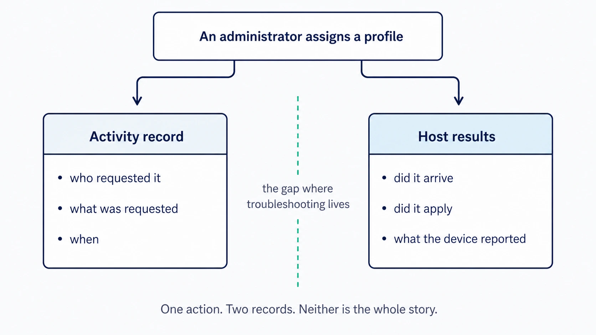
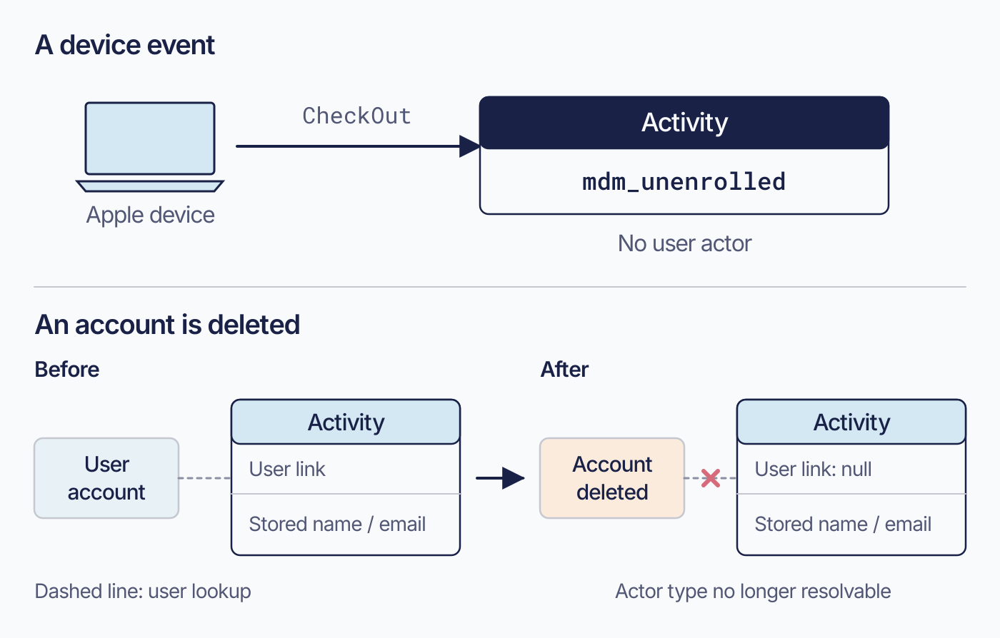

# Audit and activity

Fleet’s activity record helps you follow the work being done across your devices. You can review a configuration change, find the request behind an installation, or give another administrator context when handing over a support case. The record includes administrative changes, requested work, automation, and some device outcomes.

For a complete picture of a particular task, read its activity alongside the host result. Together, they help you understand what Fleet was asked to do and what the device reported afterward.

## Activity records and host results

 The activity stream records specific event types. An entry may describe an administrator’s request or a result reported by a device.

The stored activity record, `activity_past`, contains defined event types from four sources:

| Kind | Example | Actor |
|---|---|---|
| Administrative changes | Assigning a profile, editing a policy, changing a role | A person, or an API-only service identity. The API marks which, **while the actor still resolves to a live user**: deleting the account nulls the link, and the stored name and email remain with nothing to say what kind of actor it was |
| Requested work | Sending an MDM command | Whoever requested it, again a person or a service identity |
| Automation | A policy automation running a script | Fleet, flagged as Fleet-initiated |
| **Observed outcomes** | A device checking out of MDM, an enrollment completing, software or a script reporting its result through the agent | Sometimes nobody, sometimes the original requester |

These categories overlap. A `ran_script` row records a returned result and separately identifies whether a policy or setup experience started it. An `installed_software` row may name the requester or have no user when installation came from self-service or automation.

Some events have no user actor. Apple `CheckOut` produces `mdm_unenrolled`, and enrollment produces `mdm_enrolled`, without a user. Deleting a user account also removes the actor link from its activities; the stored name and email remain, but the API can no longer resolve whether that account was API-only.

Use activities to find events and their times. Use host results for the device’s response: software-install status, script output, policy status, or an MDM-command acknowledgement.

<!-- IMAGE-OK: assets/1.5-activity-and-host-results.webp
     NOTE: reviewed 2026-08-24 and kept. The earlier version spread the accent
     across a full-width filled banner and asserted a gap it never drew; both are fixed. The
     gutter is real empty space, the dashed green line sits in it, the two panels are
     balanced, and there is one caption. Prompt retained for regeneration; do not delete.
     PROMPT: Landscape 16:9. A single box at top centre: "An administrator assigns a
     profile". Two arrows descend from it, left and right, into two panels separated by a
     visible vertical gutter of empty background about a fifth of the width. Left panel,
     "Activity record": who requested it, what was requested, when. Right panel, "Host
     results": did it arrive, did it apply, what the device reported. In the empty gutter
     between them, running vertically, a thin dashed line in #8B8FA2 and small #515774 text
     reading "the gap where troubleshooting lives". The gap must be real empty space, not a
     filled bar. One caption only, at the bottom: "One action. Two records. Neither is the
     whole story." Draw the dashed gutter line in #009A7D. Give the top
     box a solid #192147 fill with white text, since one action is the origin of both records,
     and fill the two panels #D3E8F3 so they carry equal weight against each other.
     PALETTE. Two sets, doing different jobs.
     STRUCTURE, the Fleet Black ramp and neutrals: #192147 for the most important marks,
     #515774 for ordinary labels, #8B8FA2 and #C5C7D1 for secondary structure, #E2E4EA for
     grouping bands, #F9FAFC background, #D3E8F3 and #E8F1F6 for quiet fills. All text stays
     in this set; do not tint type.
     THE FLEET DOTS, the six accent colours taken from Fleet's own logo mark: #5CABDF sky
     blue, #3AEFC4 mint, #63C740 green, #C98DEF lavender, #FAA669 apricot, #D66C7B rose.
     Fleet Green #009A7D sits alongside them. These are soft and pastel, so they work as
     fills with #192147 text on top.
     STRENGTH. Use a dot colour at full strength only for small marks: an arrow, a chip, a
     single filled icon, a rule. Over any large area, use it at roughly a 20 to 25 percent
     tint, so a panel reads as tinted rather than painted. Five large panels at full
     saturation looks like a children's infographic, not a technical manual. And do not
     colour a panel that has no content in it; colour has to carry meaning, and an empty
     coloured box is just noise.
     HOW TO USE THE DOTS. One colour per category, used consistently within the image, to
     fill or stroke the things a reader genuinely has to tell apart. Take only as many as
     there are categories; do not spread all six across four items to look lively. If nothing
     in the picture needs distinguishing, use none of them and let the structure set carry it.
     GIVE IT WEIGHT. At least one element should be a solid filled shape rather than an
     outline, so the composition has an anchor. Vary stroke weight so the primary flow is
     visibly heavier than the scaffolding around it.
     Never invent a colour outside these two sets. Flat vector, generous whitespace, no
     gradients, no drop shadows, no 3D or photorealistic icons, no logo, no watermark.
     Legible at half page width.
     NOTE: "Fleet" here is a software product for managing computers. Never draw vehicles,
     cars, vans, trucks, ships or aircraft. Never use an em-dash in rendered text. -->

<!-- IMAGE-OK: assets/1.5-activity-actor-retention.webp
     QUESTION: Why can a valid activity have no current actor link?
     PROMPT: DIAGRAM: Two independent examples, not a universal activity taxonomy. Upper lane: Apple
     device CheckOut produces mdm_unenrolled with No user actor. Lower lane: Person or API-only
     account produces an activity carrying a user link plus stored name/email; Account deleted then
     severs only the user link while stored name/email remain. Use a dashed relationship for the
     user lookup and an explicit broken-link mark at deletion. Finish with Actor type no longer
     resolvable in the second lane. Do not imply every missing actor was deleted, or that all
     activities represent administrator requests.
     TERMINOLOGY: Fleet is the product, server, or company. Host groups are lowercase
     fleet/fleets, even in titles and node labels. Do not call those groups teams. Preserve
     exact code/API identifiers; do not render these terminology instructions as image text.
     DESIGN: Flat vector technical diagram. Fleet is software for managing computers; draw no
     vehicles. Use Inter labels and Roboto Mono identifiers. At 1400 px source width use 48 px
     titles, 36 px body labels, and at least 28 px secondary text; scale proportionally. Check at
     720 px reading width and intended print size. Use a 32 px spacing grid, at least 24 px node
     padding, and consistent corner radii. Center short node names; left-align multiline
     explanations. Never shrink text to fit. Use #F9FAFC background, #192147 headings and primary
     connectors, #515774 text, #8B8FA2 secondary connectors, #C5C7D1 borders, and #D3E8F3 or #E8F1F6
     quiet fills. Use #5CABDF and #C98DEF for named categories, #3AEFC4 for labelled positive
     outcomes, #D66C7B for labelled failures, and #FAA669 for labelled cautions. Tint large panels
     to 20 to 25 percent; full strength is for small marks. Keep text navy or slate, or off-white on
     a navy anchor. Never rely on colour alone. Use one arrowhead shape, consistent stroke weights,
     box-edge termination, and labelled branches and return paths. Keep connectors clear of text. No
     gradients, shadows, decorative icons, logo, watermark, em-dashes, or slogan footer. Render only
     the specified reader-facing labels. Choose orientation to fit the relationship, not a default
     poster. Keep captions outside the artwork. If labels crowd, split the figure before shrinking
     them. Keep editable SVG when the production method supports it.
     NOTE: Reviewed and installed 2026-09-09 in the live 4.91 and frozen 4.90 editions.
     The surrounding prose retains the conditions, exact identifiers, and accessible explanation.
     SOURCE: research/visual-reviews/part-0-1/assets/1.5-activity-actor-retention.svg
-->

## What the record covers, and where it stops

 Fleet writes activities for the event types it implements, using server actions and incoming device reports.

Administrative events such as creating a policy, assigning a profile, transferring a host, changing a role, or signing in are recorded as they happen. A per-host `ran_script` activity appears when the result returns. A script queued for one offline host therefore has no such row yet. Requesting or scheduling a batch run writes its batch activity immediately, regardless of host state.

Local actions outside Fleet’s channels leave no activity: uninstalling the agent, deleting a profile by hand, turning off encryption locally, or another tool removing a package.

An MDM unenrollment can appear because the device sends a notification. Local agent removal sends none. Investigate how an agent was removed on the device itself ([8.4](../08-troubleshooting/8.4-host-side-investigation.md)).

> ### Auditing the organisation-wide settings document
>
> Fleet audits specific changes to organization settings through roughly forty activity types, including agent options, disk encryption, Windows MDM, minimum OS versions, integrations, and GitOps mode. Enrollment secrets have a separate audited route ([a.3](../09-appendices/a.3-configuration-model-and-precedence.md)).
>
> There is no catch-all activity for editing the document. Changes to SMTP settings, the server URL, or the host-expiry window have no dedicated activity and leave the feed silent.

### Reading a secret is recorded as an action

Host-read permission can reveal the host’s disk encryption recovery key within the account’s scope ([1.4](1.4-identity-and-roles.md)).

Fleet treats retrieving a secret as an event in its own right. Reading a host's disk encryption key, viewing a recovery lock password, and reading a managed local account each write an entry naming who did it and when.

Include these secret-read events in access reviews, including reads by read-only accounts.

### Sign-ins are recorded too, including the failures

Successful sign-ins appear as `user_logged_in`, and password-stage failures as `user_failed_login`. Sending these events to your security logging system lets you investigate repeated failures alongside other account activity. The delivery options below explain how to arrange that connection.

Fleet’s built-in email MFA records `user_logged_in` only after the code is accepted. After password validation, sending the code creates no login activity in 4.90. Wrong or expired codes create no failure activity, so `user_failed_login` covers password-stage failures only. The identity provider has no record of a challenge Fleet handled itself. Account for this gap when designing alerts ([8.12](../08-troubleshooting/8.12-audit-logs.md#8124-activity-types-the-categories)).

### Upcoming activity: work still queued

A host carries **upcoming** activity as well as past activity: work Fleet has queued for it and is waiting to deliver.

Check upcoming activity when work has not completed. A growing queue may indicate that a device has stopped checking in or that delivery, execution, or result reporting has stalled.

Upcoming activity exposes the work owed, without the internal activation state Fleet uses to order it. Queue depth alone cannot distinguish a host problem from server scheduling or result delivery. Follow [8.1](../08-troubleshooting/8.1-diagnostic-method.md#815-classify-the-failure) to locate the failure.

## When to reach for the activity record

 Activity in the Fleet UI and API gives operators a convenient history of ongoing administration. Use it when reviewing a change window, confirming a recent configuration update, or handing an action to another administrator. Pair the activity record with the affected hosts, policy results, command status, or software activity to understand the full operational context.

Activity payloads provide partial rollout scope. Profile activities identify the profile and fleet; batch-script activities identify a host count and fleet. Neither includes targeted labels or resolved hosts, and a batch profile edit may omit the profile name. Check the item’s targeting for those details ([1.3](1.3-hosts-fleets-labels.md)).

## Reading the record: in Fleet, by webhook, or streamed

 The record itself is available on every Fleet deployment; how you reach it differs.

**In Fleet:** use the UI or Activities API within the configured retention window. The global feed requires an eligible global role and excludes global GitOps. A fleet-scoped operator can instead read individual host feeds where their host permissions allow it. Check account scope when a feed is forbidden or appears empty.

**Pushed per event, through an activity webhook**, on Free and Premium alike. Fleet can POST each activity to a URL as it happens. There is exactly one such setting, in the organization's own configuration; **there is no per-fleet activity webhook**, so a request to notify one fleet's channel separately has no answer at this release.

Treat it as a notification rather than as a copy of the record. Fleet launches the delivery before it attempts to store the row, so the POST can arrive before or after the activity exists in Fleet, and can announce an event whose storage then fails. The payload omits the stored activity's ID and its Fleet-initiated flag.

Delivery retries only `429` responses, for at most thirty minutes. Other errors are permanent. Exhausted or permanent failures appear in the server log. Use the webhook for notifications such as chat messages or tickets; delivery can be incomplete or out of order.

**Streamed to a log destination:** Fleet Premium sends eligible activities through the configured audit-log plugin. Supply durable storage and retention at the destination. The default plugin is `filesystem`, its default path is a temporary directory, and `stdout` is also supported.

Streaming uses the global feed’s query, which excludes host-only rows. These are all `installed_certificate` events and the per-host `ran_script` events belonging to batch executions. They remain visible in host feeds but never reach the streaming destination. Check this exclusion before relying on that destination for audit coverage.

External delivery supports longer retention, correlation with identity and infrastructure events, and investigation by people without Fleet accounts.

Before enabling delivery, decide who will maintain the destination, who needs access to its records, and how long to retain them. [2.8](../02-administer-and-deploy-fleet/2.8-activity-audit-logs-and-log-delivery.md) covers the setup.

<!-- SCREENSHOT: SS-1.5-01 | Reading actors and timestamps in the activity feed
     PURPOSE: Help readers recognize the records they will use during a change review.
     PREPARE: Prepare a demo feed with real recorded actions by a named administrator and a purpose-named API-only account. Include a Fleet-initiated event if one is naturally available.
     CAPTURE: Capture several complete activity rows with action text, actor labels and timestamps. Choose benign actions such as a policy/configuration change; do not reveal a secret to create an example.
     FRAME: Use the feed’s native layout, with its heading and scope visible. Avoid cropping away the actor or time at the row edge.
     EDITION: 4.91; reuse for 4.90 only when the visible controls and wording match
     PRIVACY: Use demo names and non-sensitive data; exclude tokens, passwords, keys, and personal identifiers.
     FILENAME: ss-1.5-01.png
-->

## How long Fleet keeps the record

 Choose an activity-retention policy that supports your operational and audit needs. Expiry settings are off by default, so Fleet retains the records and the database grows as activity accumulates. You can keep that history or configure expiry once you have decided which records to retain elsewhere.

Check `preserve_host_activities_on_reenrollment` before relying on a redeployed Mac retaining its history. With the setting off, Apple Automated Device Enrollment (ADE) re-enrollment unlinks the host’s activities without deleting the host. Expiry can remove an activity only after its last host link is gone.

The migration that introduced this setting enabled it if any user account already existed and disabled it otherwise. Upgraded deployments and fresh installs can therefore have different defaults at the same version.

Plan retention with delivery so expiry does not remove records you still need. Host-linked activities remain in Fleet while a link exists, even after streaming. Configure expiry in [2.7](../02-administer-and-deploy-fleet/2.7-organization-and-server-settings.md).

Before enabling expiry, account for three limits:

1. Streaming excludes host-only rows. An external destination is therefore an incomplete copy.
2. Expiry prunes only activities with no remaining host links. It cannot enforce a retention window on linked rows.
3. A destination’s batch acknowledgement can mark a batch streamed even if an individual record was not stored. Reconcile records at the destination before relying on Fleet’s streamed flag.

## A review routine

 Build regular review around a simple sequence:

1. Find the activity or audit event that created, changed, or requested the work.
2. Confirm the intended fleet and label scope. **Read the activity's own payload first**, since what it carries varies by activity type, and go to the item's targeting for anything it omits. Profile and batch-script activities are the ones that carry a fleet without the labels targeted or the hosts resolved.
3. Inspect the host results reported through the relevant device channel.
4. Record the decision to expand, adjust, or complete the work.

[8.12](../08-troubleshooting/8.12-audit-logs.md) is the reference: roughly two hundred activity types, the shape of an entry, and how to query the record when you are looking for what changed.
