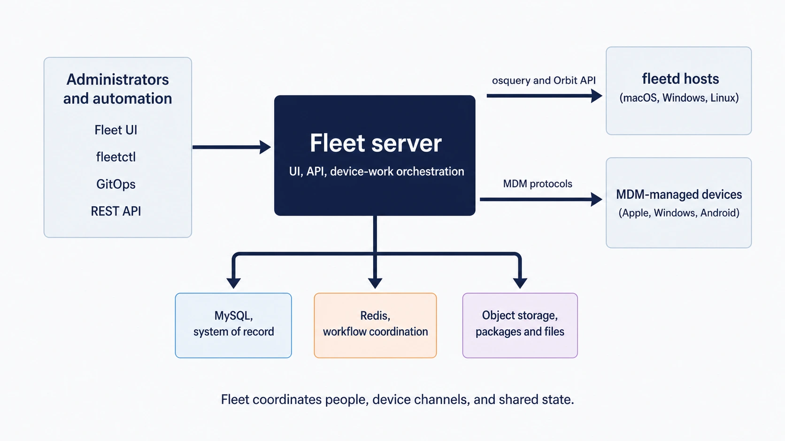
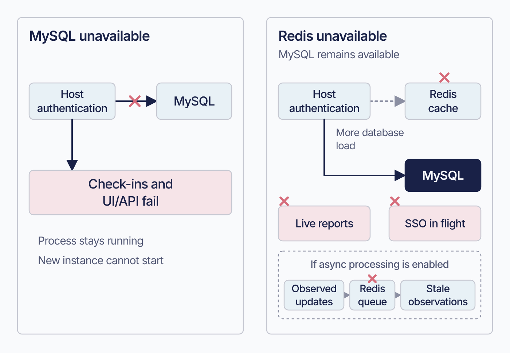

# The Fleet server

The Fleet server coordinates device management. Its database, Redis, and file stores hold most state outside the server process.

The server private key is separate: it lives in server configuration and decrypts sensitive material in MySQL. Back up that key independently of the stores ([7.7](../07-operate-fleet/7.7-production-readiness-checklist-and-handoff.md)). Fleet instances can be replaced or scaled when their configuration and shared dependencies remain available. Upgrades still require a planned outage for migration.

Each process also has a local cache. Without object storage, installers and icons use filesystem storage whose persistence and sharing you must arrange.

<!-- IMAGE-OK: assets/1.6-fleet-server-architecture.webp
     NOTE: reviewed 2026-08-24 and kept. Solid navy server anchors it, and the three stores
     use the same colours as the state-model diagram in this chapter, so the two pictures
     agree. Prompt retained; do not delete.
     PROMPT: A landscape architecture diagram. A central panel "Fleet server", subtitled
     "UI, API, device-work orchestration". To its left, "Administrators and automation"
     listing Fleet UI, fleetctl, GitOps, REST API. To its right, two stacked boxes: "fleetd
     hosts (macOS, Windows, Linux)" connected through "osquery and Orbit API", and
     "MDM-managed devices (Apple, Windows, Android)" connected through "MDM protocols".
     Below the centre, three boxes: "MySQL, system of record", "Redis, workflow
     coordination", "Object storage, packages and files". Use the same three dot colours for the three
     stores as the state-model diagram in this chapter, so the two pictures agree: MySQL
     #5CABDF, Redis #FAA669, Object storage #C98DEF. Give the central Fleet server panel a
     solid #192147 fill with white text, so it anchors the composition.
     Caption: "Fleet coordinates people, device channels, and shared state."
     PALETTE. Two sets, doing different jobs.
     STRUCTURE, the Fleet Black ramp and neutrals: #192147 for the most important marks,
     #515774 for ordinary labels, #8B8FA2 and #C5C7D1 for secondary structure, #E2E4EA for
     grouping bands, #F9FAFC background, #D3E8F3 and #E8F1F6 for quiet fills. All text stays
     in this set; do not tint type.
     THE FLEET DOTS, the six accent colours taken from Fleet's own logo mark: #5CABDF sky
     blue, #3AEFC4 mint, #63C740 green, #C98DEF lavender, #FAA669 apricot, #D66C7B rose.
     Fleet Green #009A7D sits alongside them. These are soft and pastel, so they work as
     fills with #192147 text on top.
     STRENGTH. Use a dot colour at full strength only for small marks: an arrow, a chip, a
     single filled icon, a rule. Over any large area, use it at roughly a 20 to 25 percent
     tint, so a panel reads as tinted rather than painted. Five large panels at full
     saturation looks like a children's infographic, not a technical manual. And do not
     colour a panel that has no content in it; colour has to carry meaning, and an empty
     coloured box is just noise.
     HOW TO USE THE DOTS. One colour per category, used consistently within the image, to
     fill or stroke the things a reader genuinely has to tell apart. Take only as many as
     there are categories; do not spread all six across four items to look lively. If nothing
     in the picture needs distinguishing, use none of them and let the structure set carry it.
     GIVE IT WEIGHT. At least one element should be a solid filled shape rather than an
     outline, so the composition has an anchor. Vary stroke weight so the primary flow is
     visibly heavier than the scaffolding around it.
     Never invent a colour outside these two sets. Flat vector, generous whitespace, no
     gradients, no drop shadows, no 3D or photorealistic icons, no logo, no watermark.
     Legible at half page width.
     NOTE: "Fleet" here is a software product for managing computers. Never draw vehicles,
     cars, vans, trucks, ships or aircraft. Never use an em-dash in rendered text. -->

## Where the state actually lives

 Three stores sit behind the Fleet server, and each one holds a different kind of thing for a different reason.

**MySQL is the system of record.** If it is written down and expected to survive, it is here: hosts, fleets, labels, policies, reports, the MDM command queues, activity history, and the configuration you set. It is the store a Fleet backup has to cover.

**Redis holds coordination and cached state:** live-report campaigns, host authentication, rate limits, in-flight SSO, and reconciler cursors. Losing that data interrupts live reports and sign-in attempts; rerun them after recovery.

Redis also holds data that cannot be reconstructed. Distinguish temporary unavailability from data loss:

| What | If Redis is unavailable | If the data is actually lost or flushed |
|---|---|---|
| Pending recipients for failing-policy automations | The worker cannot read them, and a host that starts failing during the outage may fail to be registered at all rather than queueing | The owed notifications are not reconstructed from anywhere |
| Recorded server errors | Not recordable and not readable while Redis is away. Unavailability does not itself delete what was stored, though those keys carry a TTL and can expire during the interval | The record of what went wrong before the incident is gone too |
| With asynchronous host processing on, pending last-seen, label, policy and query-stat updates | Writes fail and are logged, while the check-in itself carries on | Those particular observations do not arrive in MySQL |

During an outage, Redis-dependent writes can fail and existing keys can expire. Flushing or losing stored data also removes pending work that was successfully queued before the outage.

**Object storage holds large files:** software installers, bootstrap packages, title icons, organization logos, and file-carve blocks. Installers and carve blocks are immutable; logos and icons can be replaced or deleted through the interface.

TLS protects communication with the service. Protect the server private key separately: a database restore cannot recover encrypted secrets without it. Assign key custody, keep a backup away from the Fleet host, and document recovery ([7.7](../07-operate-fleet/7.7-production-readiness-checklist-and-handoff.md)).

### The in-process cache nobody configures

Each Fleet process keeps a cache in front of MySQL for values read very frequently. It is wider than the agent options people know about: application configuration, a fleet's agent options and features, packs and scheduled queries, fleet and default-fleet MDM configuration, query lookups and result counts, YARA rules, MDM assets, and Fleet-maintained app names. Expirations run from about a second for configuration to fifteen minutes for the longest of them. Live queries keep a separate in-memory cache of their own.

It is per process, and nothing invalidates it across instances. So if you change a fleet's agent options, a request landing on a different instance can still be answered from that instance's older copy until its entry expires.

A stale pack, query definition, or app name can also come from a process-local cache. Compare the affected value’s cache expiry with the duration of the stale response.

MDM assets use checksum-based cache keys. Fleet fetches current hashes on each lookup, so an updated asset bypasses its old entry. Investigate stale assets beyond ordinary cache expiry.

### What happens if you configure no object storage

Software installers, software title icons, and Apple bootstrap packages require Premium. Fleet rejects their uploads and does not construct their stores on Free. File carves and organization logos remain available without that gate.

Without a bucket, supported artifacts use the following fallback stores:

| Artifact | Falls back to | Shared between instances |
|---|---|---|
| File carves | MySQL | Yes |
| Apple bootstrap packages | MySQL | Yes |
| Organisation logos | MySQL | Yes |
| Software installers | Local filesystem, a temporary directory by default | **No** |
| Software title icons | Local filesystem | **No** |

Organization logos use the software-installers bucket when configured.

The database-backed three keep working across any number of instances, because every instance reaches the same database. They cost database growth, and carve blocks grow it fastest.

Installers and title icons use deterministic paths under configurable directories, defaulting to the system temporary directory. Sharing across instances and survival across restarts depend on those directories and their backing volumes. Fleet logs a production-suitability warning for each local store.

<!-- IMAGE-OK: assets/1.6-fleet-service-state-model.webp
     COMPLETE 2026-09-03: owner-accepted after review. Labels verified verbatim (Premium chips
     only on installers, Apple bootstrap packages, and software title icons; Redis and object
     loss nuances correct). ChatGPT/gpt-image-1 regen declined; raster text would downgrade the
     exact SVG labels. Cosmetic-only nits left as-is (owner's call): Premium chips crowd their
     labels and the Redis card has a whitespace gap above its callout.
     REDONE 2026-08-30: regenerated so Redis loss shows unreconstructed pending failing-policy notifications and recorded server errors (not merely a retry) and object-storage loss shows file-carve evidence that cannot be re-uploaded (not merely a re-upload). Reviewed and accepted.
     WHY-WAS-REDO:
     WHY: the rendered image still summarises Redis as "loss costs a retry" and object storage as "loss costs a re-upload". The chapter retracts both: Redis holds pending failing-policy notifications and the recorded error history that nothing reconstructs, and object storage can hold file-carve blocks that nobody can re-upload. Corrected prompt below.
     IMAGE-OK-WAS:
     NOTE: reviewed 2026-08-24 and kept, and it is the strongest diagram in the manual.
     Tinted cards, per-item icons, the green bar marking MySQL as the store whose loss is
     unrecoverable, and the "loss costs" line beneath each. Prompt retained; do not delete.
     PROMPT: A landscape state-and-recovery diagram, 16:9. Across the top, place one
     wide solid #192147 rounded rectangle labelled "Fleet service" in #F9FAFC text.
     This is the composition's solid anchor. Directly beneath it, add the small
     qualifier "Selected examples", then connect the service to three aligned cards.

     The first card is labelled "MySQL" with the subtitle "Durable system of record".
     List: "Configuration"; "Hosts, fleets, labels"; "Policies and reports"; "MDM
     command queues"; "Activity history". At the bottom of this card, in a clearly
     separated callout, write "Recovery after data loss: restore from backup".

     The second card is labelled "Redis" with the subtitle "Work in progress and
     caches". List: "Live report coordination"; "Host authentication cache";
     "Workflow state and rate limits". At the bottom of this card, use a clearly
     separated callout headed "Not reconstructed after Redis data loss", followed by:
     "Pending failing-policy notifications"; "Recorded server errors"; "With async
     processing: pending last-seen, label, policy, and query-stat updates". Make the
     wording distinguish actual data loss from Redis merely being unavailable. Do not
     summarise Redis loss as only costing a retry.

     The third card is labelled "Object storage" with the subtitle "When configured,
     shared artifacts". List: "Software installers"; "Apple bootstrap packages";
     "Software title icons"; "Organisation logos"; "File-carve blocks". Put a small
     "Premium" chip beside Software installers, Apple bootstrap packages, and Software
     title icons only. Do not put that chip beside Organisation logos or File-carve
     blocks. At the bottom of this card, use a clearly separated callout headed
     "Object loss differs", followed by "Installers can be re-uploaded" and "Carve
     evidence cannot be re-uploaded". Do not imply that every object can be supplied
     again.

     Below the three cards, add one quiet neutral fallback band headed "Without object
     storage, for included features". Divide it into two subcells. The first says
     "MySQL, shared: File carves; Apple bootstrap packages; Organisation logos". The
     second says "Filesystem fallback, temporary directory by default: Software installers; Software title
     icons". Keep this band visually subordinate to the three main cards.

     Give the three main cards three dot colours, used consistently: MySQL #5CABDF,
     Redis #FAA669, Object storage #C98DEF. Use each colour only as a roughly 20 to 25
     percent card tint and at full strength for a thin top rule, small icon, or small
     chip. Do not use a green severity bar on MySQL and do not visually claim that
     MySQL is uniquely unrecoverable. Use the structure colours for the fallback band.
     Use simple flat line icons only where they improve scanning. Prioritise exact,
     large, readable text over decoration. Render every quoted label verbatim and add
     no other text.

     Caption: "Fleet's backing stores serve different roles, and data loss has
     different consequences."

     PALETTE. Two sets, doing different jobs.
     STRUCTURE, the Fleet Black ramp and neutrals: #192147 for the most important marks,
     #515774 for ordinary labels, #8B8FA2 and #C5C7D1 for secondary structure, #E2E4EA for
     grouping bands, #F9FAFC background, #D3E8F3 and #E8F1F6 for quiet fills. All text stays
     in this set; do not tint type.
     THE FLEET DOTS, the six accent colours taken from Fleet's own logo mark: #5CABDF sky
     blue, #3AEFC4 mint, #63C740 green, #C98DEF lavender, #FAA669 apricot, #D66C7B rose.
     Fleet Green #009A7D sits alongside them. These are soft and pastel, so they work as
     fills with #192147 text on top.
     STRENGTH. Use a dot colour at full strength only for small marks: an arrow, a chip, a
     single filled icon, a rule. Over any large area, use it at roughly a 20 to 25 percent
     tint, so a panel reads as tinted rather than painted. Five large panels at full
     saturation looks like a children's infographic, not a technical manual. And do not
     colour a panel that has no content in it; colour has to carry meaning, and an empty
     coloured box is just noise.
     HOW TO USE THE DOTS. One colour per category, used consistently within the image, to
     fill or stroke the things a reader genuinely has to tell apart. Take only as many as
     there are categories; do not spread all six across four items to look lively. If nothing
     in the picture needs distinguishing, use none of them and let the structure set carry it.
     GIVE IT WEIGHT. At least one element should be a solid filled shape rather than an
     outline, so the composition has an anchor. Vary stroke weight so the primary flow is
     visibly heavier than the scaffolding around it.
     Never invent a colour outside these two sets. Flat vector, generous whitespace, no
     gradients, no drop shadows, no 3D or photorealistic icons, no logo, no watermark.
     Legible at half page width.
     NOTE: "Fleet" here is a software product for managing computers. Never draw vehicles,
     cars, vans, trucks, ships or aircraft. Never use an em-dash in rendered text.
     PROMPT REWRITTEN 2026-08-27 by the independent reviewer against the corrected prose.
     It found the author's hand-edited version still carried "loss costs a retry" without the
     three non-reconstructed Redis cases, still generalised "loss costs a re-upload" past the
     installer case the chapter actually establishes, called MySQL loss unrecoverable when the
     chapter tells operators to restore from backup, and omitted organisation logos from both
     object storage and the no-bucket fallback. Do not hand-edit this prompt; send it back for
     review.
-->

## Why the state is split

 Each store serves a different workload.

MySQL provides durable configuration and history. Redis coordinates live reports and caches frequently accessed state; live-query metadata has a seven-day TTL. Object storage serves large files to multiple instances and devices.

### Recorded errors can be read without destroying them

Fleet records internal errors into Redis, deduplicated, retained about a day by default.

Error retrieval preserves records by default. Both the API and command-line client flush them only when explicitly requested, so colleagues can read the same errors during an investigation.

Capture the errors you need before flushing them or allowing their TTL to expire.

## Deployment constraints this design imposes

 Plan capacity, failover, and shared storage around these constraints.

### Fleet supports exactly one database writer

One writable primary, with read replicas. Multi-writer and group-replication setups are not supported.

Fleet instances need a writer in the same datacentre. A second region can hold a warm standby, but both regions cannot serve writes concurrently.

Write capacity therefore scales vertically. More Fleet instances add API and check-in capacity, and they all point at the same writer, so when the writer saturates the answer is a bigger writer. Fleet's own reference sizings do exactly that, stepping one database instance class up as host counts grow.

Failover interrupts service while instances reconnect; in-flight work against the old primary fails. The duration depends on your database topology and failover mechanism. Measure it in your own tests. The upgrade guidance below describes a planned procedure and does not establish what every database interruption will do.

Check your MySQL version against Fleet's, in both directions. Fleet requires a recent MySQL 8 and is tested against a specific set of releases, and at least one newer release has been incompatible. MariaDB and other variants are unsupported, and known problems with variants may not get fixed.

If your platform standard is a multi-writer cluster, settle that before you deploy rather than after.

### Read replicas help some deployments and not others

Once a replica is configured, reads go to it automatically. Nothing needs annotating per query, and the code paths that must read their own writes ask for the primary themselves.

The benefit is specific. Heavy API polling, automation, and reporting is the case that pays. A deployment whose load is mostly host check-ins mostly does not, because check-ins write.

Configure the replica’s address, credentials, TLS, and connection pool separately; none is inherited from the primary.

An empty replica address makes Fleet use the writer for reads without configuring a replica. A supplied address with incorrect settings produces connection failures. Check the effective configuration before investigating replication lag.

### Redis publish/subscribe: the live-query buffer that fills first

Redis enforces an output buffer limit per subscriber, and Fleet is a subscriber. Fill that buffer and Redis drops the subscriber's data.

Fleet reports failed publishes, missing subscribers, and receive errors. It also emits an interruption error used by the UI to identify incomplete results.

A Redis interruption can look like poor host coverage. Check campaign errors before attributing missing results to offline hosts. Increase the pub/sub output-buffer limit when those errors identify an exhausted buffer.

Managed Redis services may expose the limit under several provider-specific parameters. Size it for result volume: a wide report can produce much more data than a policy check on the same hosts.

### Redis standalone or cluster, and how Fleet decides

You do not tell Fleet which mode to use. It attempts cluster operation at startup and falls back to standalone if the server does not support it.

Cluster mode costs something. Multi-key operations have to land in one slot, **fan-out operations** (ones that cannot be targeted at a single node) visit every node, and subscriber counts have to be summed across nodes. Fleet handles all of it, and Fleet's own reference architectures still specify plain Redis for deployments well into six figures of hosts.

Use cluster mode when one node cannot hold the working set or serve the required throughput.

### What is coordinated across instances, and what is not

Fleet instances share their database and Redis state. File sharing requires a bucket or a filesystem accessible to every instance that serves those artifacts.

**Scheduled jobs are coordinated, through MySQL.** Each named schedule takes a lock before running, so only one instance runs a given job in a given window. That lock lives in the database, not in Redis, so the bookkeeping survives a Redis flush.

Fleet also records which instance ran a job, alongside an identifier that appears in that process's logs. The pairing is how you get from "this job behaved oddly" to "these are that node's logs." The identifier is generated at process start, so it names a process, not a machine. One that shows up in the job record but in no current log belongs to a process that has since restarted.

Any instance can answer API and check-in requests. A stale cache, inaccessible object store, or broken Apple push path on one instance can therefore cause intermittent failures proportional to its traffic share.

For a recurring intermittent failure, identify which instance served each failed request.

With local storage, an upload handled by one instance may be unavailable to another. Use the configured directories and volume mounts to establish sharing and persistence; the default temporary directory provides neither guarantee.

### Losing Redis and losing MySQL fail very differently

Check the stores separately when diagnosing these symptoms.

**MySQL unavailable:** check-ins and the UI/API fail because Fleet cannot read durable state or authenticate hosts. Running processes return errors until recovery; new instances cannot pass their startup migration check.

**Redis unavailable, with MySQL still available:**

- **Live reports stop.** Campaigns cannot be created and results have nowhere to go. It is an unusually visible symptom, because it fails in the interface while someone is watching.
- **Sign-on attempts that depend on Redis fail**, because Fleet holds in-flight SSO state there for the duration of one attempt, with an expiry. A retry once Redis is back starts a fresh attempt; that is a new sign-on rather than a resumed one.
- **Error recording stops**, because Fleet's recorded server errors are themselves Redis data, with their own TTL, and reading them can flush them. The outage does not delete what was already stored, though entries can expire on their own clock while it lasts. You certainly cannot get a record of the outage itself, the period you will most want to read about.
- **Host check-ins keep working and get more expensive.** The host authentication cache is a cache; a miss falls through to MySQL. Functionality is preserved while MySQL absorbs the traffic the cache was absorbing, so watch for MySQL saturating as a secondary effect.
- **Reconcilers may repeat work**, because their cursors live in Redis. Desired state is in MySQL, so this costs a repeated pass rather than correctness.
- **Pending failing-policy notifications are at risk**, because the recipients waiting to be sent are held in Redis sets rather than reconstructed from MySQL. They survive an outage; they do not survive the data being discarded.
- **With asynchronous host processing enabled, pending observations do not arrive.** Last-seen, label, policy and scheduled-query-stat updates queue through Redis, and their write failures are logged while the check-in continues, so the host looks healthy and Fleet's picture of it quietly stops advancing ([8.14](../08-troubleshooting/8.14-degradation.md)).
- **Scheduled jobs keep coordinating**, because that lock is in MySQL.

The health endpoint checks both stores by default and can check an individual dependency through a parameter. Monitor each dependency separately to identify which one failed.

<!-- IMAGE-OK: assets/1.6-datastore-outage-paths.webp
     QUESTION: Why does losing Redis look different from losing MySQL?
     PROMPT: DIAGRAM: Use two small failure-path panels with matching component positions. MySQL
     unavailable: cross the Host authentication to MySQL path; show Check-ins and UI/API fail, with
     Process remains running and New instance cannot start as short labels. Redis unavailable, MySQL
     available: show the host-auth cache path failing over to MySQL, labelled More database load;
     cross separate Live reports and SSO-in-flight paths. Add an optional dashed Async observations
     queue through Redis, ending at Stale observations when enabled. Do not imply all check-in data
     remains fresh during a Redis outage, or that Redis loss deletes durable desired state.
     TERMINOLOGY: Fleet is the product, server, or company. Host groups are lowercase
     fleet/fleets, even in titles and node labels. Do not call those groups teams. Preserve
     exact code/API identifiers; do not render these terminology instructions as image text.
     DESIGN: Flat vector technical diagram. Fleet is software for managing computers; draw no
     vehicles. Use Inter labels and Roboto Mono identifiers. At 1400 px source width use 48 px
     titles, 36 px body labels, and at least 28 px secondary text; scale proportionally. Check at
     720 px reading width and intended print size. Use a 32 px spacing grid, at least 24 px node
     padding, and consistent corner radii. Center short node names; left-align multiline
     explanations. Never shrink text to fit. Use #F9FAFC background, #192147 headings and primary
     connectors, #515774 text, #8B8FA2 secondary connectors, #C5C7D1 borders, and #D3E8F3 or #E8F1F6
     quiet fills. Use #5CABDF and #C98DEF for named categories, #3AEFC4 for labelled positive
     outcomes, #D66C7B for labelled failures, and #FAA669 for labelled cautions. Tint large panels
     to 20 to 25 percent; full strength is for small marks. Keep text navy or slate, or off-white on
     a navy anchor. Never rely on colour alone. Use one arrowhead shape, consistent stroke weights,
     box-edge termination, and labelled branches and return paths. Keep connectors clear of text. No
     gradients, shadows, decorative icons, logo, watermark, em-dashes, or slogan footer. Render only
     the specified reader-facing labels. Choose orientation to fit the relationship, not a default
     poster. Keep captions outside the artwork. If labels crowd, split the figure before shrinking
     them. Keep editable SVG when the production method supports it.
     NOTE: Reviewed and installed 2026-09-09 in the live 4.91 and frozen 4.90 editions.
     The surrounding prose retains the conditions, exact identifiers, and accessible explanation.
     SOURCE: research/visual-reviews/part-0-1/assets/1.6-datastore-outage-paths.svg
-->

## Desired state out, observed state in

 Fleet sends desired state to devices and receives observations from them.

**Desired state** starts with an administrator, GitOps change, API request, or workflow. Fleet makes the policy, script, software, profile, or command available to its target hosts. Availability alone does not establish that the device applied it.

**Observed state flows inward.** It starts at the device: a check-in, a report result, an MDM response, an agent report. It ends as updated host details, an activity record, a result status, report data, or a line in an external log.

Policy results can trigger more work: scripts, compliance updates to an identity provider, software or VPP installation, and notifications later delivered as webhooks or tickets. Most triggers respond to a policy starting to fail. Continuous actions run on every failing result, and one identity-provider path evaluates at sign-in. See [5.9](../05-manage-devices/5.9-automate-remediation-with-policies.md) for those conditions.

The Fleet service coordinates those flows; the device paths described in [1.2 How Fleet reaches a device](1.2-how-fleet-reaches-a-device.md) carry the work to and from hosts.

## What a deployment needs owners for

 When designing or operating a Fleet deployment, establish ownership for:

- Fleet server configuration, availability, and TLS certificates
- **Server private-key custody, distribution, backup, and recovery**, which is separate from the three stores and is what makes a MySQL restore readable
- MySQL capacity, backups, and restoration
- Redis availability and monitoring
- Object-storage access, retention, and software/package delivery
- Logs, audit-event export, metrics, and tracing
- Release management for the Fleet service and fleetd

Parts II and VII expand these topics into deployment, day-two operations, and release-management guidance.

### Backing up three stores that cannot be captured together

No supported procedure backs up all three together, and a plain snapshot of each will not be consistent with the others unless you arrange for that yourself.

**Back up MySQL before every upgrade.** Fleet exposes forward migrations and no supported downgrade command. Reversing a schema change requires restoring the pre-upgrade database; internal migration `Down` functions do not provide an operational rollback procedure.

**Back up the installer bucket, or plan to re-upload packages.** MySQL holds metadata and the bucket holds bytes. A restored database can refer to missing objects if the stores represent different points in time.

**Preserve file-carve storage as evidence.** Carve blocks came from a host at a particular moment and cannot be re-uploaded by an administrator. Missing objects cause reconciliation to mark the carve expired. Include them in retention and disaster-recovery plans.

Fleet documents no supported Redis backup procedure. Discarding its data loses pending failing-policy notifications, recorded errors, and queued asynchronous observations; these are not reconstructed. Establish whether planned Redis maintenance preserves data.

### Upgrades take the service offline, and the window scales with your data

The documented procedure is to stop **every** Fleet instance, back up the database, run the migration, then start the new version. Fleet requires all instances down for the migration, so this is a full outage rather than a rolling restart. Typical upgrades are minutes.

Avoid upgrades during Apple ADE provisioning. Fleet’s guidance says hosts buffer osquery logs until the server returns, but an ADE enrollment in progress may fail. Recovery can require an automatic retry, a remote wipe, or physical access to reinstall macOS from Recovery if the Mac is not on Wi-Fi.

Measure migration time against a restored copy of your own database before a production upgrade. Large per-host tables can make migrations take hours; the typical duration is not an upper bound.