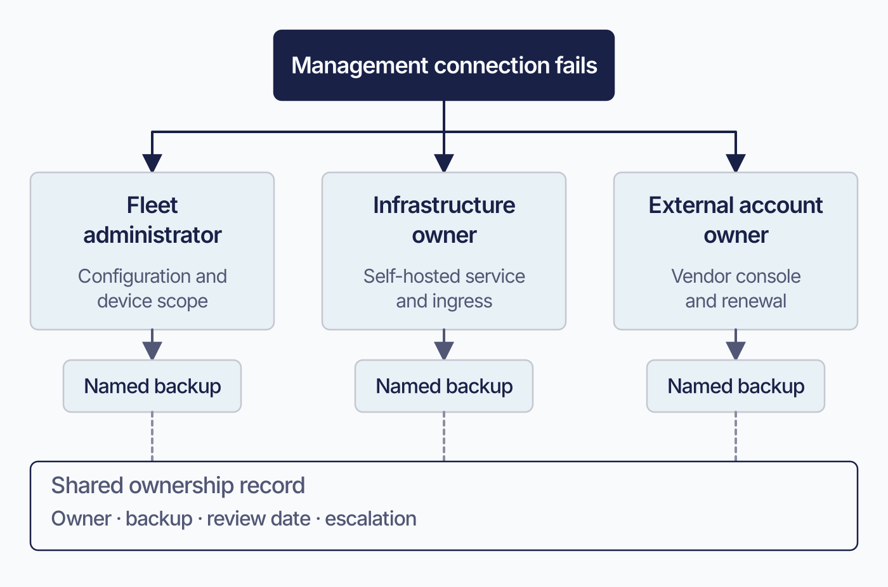

# Administration model and deployment choices

Fleet brings device administration into one place, whether you want Fleet to operate the service for you or prefer to run it on your own infrastructure. A little planning at the start makes that flexibility useful: choose who will run the service, who will administer devices, and which operating systems you will manage first.

**Operating the service** means keeping Fleet available to your administrators and devices. It includes the server, database, cache, object storage, TLS certificate, backups, monitoring, and upgrades. Fleet can take on that work through managed cloud hosting, or your organization can own it through self-hosting.

**Holding authority** covers who has an account, what each person is allowed to change, over which devices, and how they sign in.

**Platform connections** give Fleet the authority to manage Apple, Windows, and Android devices. These connections involve certificates, tokens, and enterprise bindings, often managed through Apple’s, Microsoft’s, or Google’s consoles. Recording their owners and renewal dates early helps keep device management running smoothly.

Check managed-cloud eligibility and your organization’s identity-provider requirements before choosing how to divide administrative authority.

## Purpose and scope

Record the deployment decisions and their owners, then test the arrangement on a small device population before expanding.

For implementation, use [2.2](2.2-self-hosting-architecture-and-capacity.md) for self-hosting, [2.5](2.5-identity-providers-sso-scim-and-role-sync.md) for identity, and [2.9](2.9-mdm-architecture-and-foundations.md) for MDM.

![The Fleet setup sequence, which forks on the operating model. It opens with a full-width stage, "Choose the operating model: Fleet-hosted or self-hosted", then splits into two lanes. The self-hosted lane passes through one stage, "Prepare the service: sizing, network, TLS, state"; the Fleet-hosted lane skips ahead. The lanes rejoin, then three shared stages follow in order: "Establish administration", "Connect management services", and "Enroll a pilot fleet". A caption reads: self-hosters stand the service up first, everyone sets the control plane before connecting the estate.](assets/2.1-setup-sequence.webp)

<!-- IMAGE-OK: assets/2.1-setup-sequence.webp
     COMPLETE 2026-09-03: owner-accepted after review. Every label verified verbatim, the
     fork logic checked, and a ChatGPT/gpt-image-1 regen was declined because raster text
     would downgrade the exact SVG labels. Cosmetic-only nit left as-is (owner's call): the
     mint "Prepare the service" panel sits a little above the 20-25% tint guidance.
     NOTE: regenerated 2026-08-30 as a branched sequence, replacing the withheld linear
     version that taught the pre-2026-08-30 order (administration before service preparation).
     Sol diagram recipe (HANDOFF). The fork now teaches the corrected order: self-hosters
     pass through "Prepare the service" first, Fleet-hosted skips it, both rejoin before the
     three shared control-plane stages. Reviewed by eye and kept. Prompt retained for
     regeneration; do not delete.
     PROMPT: Fleet setup sequence, branched
Landscape sequence that forks on the operating model. Stage one, full width: "Choose the
operating model (Fleet-hosted or self-hosted)". It then splits into two lanes. Self-hosted lane:
"Prepare the service (sizing, network, TLS, state)" first, then the lanes rejoin. Fleet-hosted
lane: skip straight to the join. After the join, three shared stages in order: "Establish
administration (identity, roles, audit)"; "Connect management services (Apple, Windows,
Android)"; "Enroll a pilot fleet (validate before expansion)". Caption: "Self-hosters stand the
service up first; everyone sets the control plane before connecting the estate." Clean enterprise
flat-vector style; #192147 text, pale blue fills (#E8F1F6 or #D3E8F3) and a single Fleet Green (#009A7D) accent used sparingly, large legible labels,
no logo, watermark, or drop shadows.
     PALETTE. Two sets, doing different jobs.
     STRUCTURE, the Fleet Black ramp and neutrals: #192147 for the most important marks,
     #515774 for ordinary labels, #8B8FA2 and #C5C7D1 for secondary structure, #E2E4EA for
     grouping bands, #F9FAFC background, #D3E8F3 and #E8F1F6 for quiet fills. All text stays
     in this set; do not tint type.
     THE FLEET DOTS, the six accent colours taken from Fleet's own logo mark: #5CABDF sky
     blue, #3AEFC4 mint, #63C740 green, #C98DEF lavender, #FAA669 apricot, #D66C7B rose.
     Fleet Green #009A7D sits alongside them. These are soft and pastel, so they work as
     fills with #192147 text on top.
     STRENGTH. Use a dot colour at full strength only for small marks: an arrow, a chip, a
     single filled icon, a rule. Over any large area, use it at roughly a 20 to 25 percent
     tint, so a panel reads as tinted rather than painted. Five large panels at full
     saturation looks like a children's infographic, not a technical manual. And do not
     colour a panel that has no content in it; colour has to carry meaning, and an empty
     coloured box is just noise.
     HOW TO USE THE DOTS. One colour per category, used consistently within the image, to
     fill or stroke the things a reader genuinely has to tell apart. Take only as many as
     there are categories; do not spread all six across four items to look lively. If nothing
     in the picture needs distinguishing, use none of them and let the structure set carry it.
     GIVE IT WEIGHT. At least one element should be a solid filled shape rather than an
     outline, so the composition has an anchor. Vary stroke weight so the primary flow is
     visibly heavier than the scaffolding around it.
     Never invent a colour outside these two sets. Flat vector, generous whitespace, no
     gradients, no drop shadows, no 3D or photorealistic icons, no logo, no watermark.
     Legible at half page width.
     NOTE: "Fleet" here is a software product for managing computers. Never draw vehicles,
     cars, vans, trucks, ships or aircraft. Never use an em-dash in rendered text. -->

## Where Fleet runs

 Your hosting choice determines who maintains Fleet’s infrastructure. Both paths give administrators the same Premium capabilities when licensed; managed cloud hosting has eligibility requirements.

**Fleet offers managed cloud hosting to Fleet Premium customers with large deployments.** Fleet runs the service and the infrastructure underneath it, and your team works on organization settings, identities, platform connections, and device operations. As of Fleet 4.90.0 the documented threshold for fully managed hosting is deployments **larger than 700 hosts**.

**Self-hosting gives you direct control over the deployment.** You run the Fleet server, MySQL, Redis, TLS, object storage where needed, networking, backups, and monitoring. Fleet documents deployments on AWS with Terraform, Kubernetes, GCP, Render, and Docker Compose. Fleet Premium is also available self-hosted with support. Organizations outside the managed hosting eligibility requirements use this path.

Premium capabilities are identical on both hosting paths; responsibility for operating the infrastructure differs.

If you are self-hosting, [1.6 The Fleet server](../01-foundations/1.6-the-fleet-server.md) explains why the state is split across three stores, the model behind the capacity and backup decisions in [2.2](2.2-self-hosting-architecture-and-capacity.md).

## Fleet administrators and infrastructure owners

 Assign responsibility for configuration, infrastructure, and escalation before deployment.

**Fleet administrators own** identity provider configuration, roles and their scopes, fleet structure, and the platform management connections to Apple, Microsoft and Google.

**Infrastructure owners own** service availability, the three state stores, backups and their restoration, monitoring, and upgrades.

**Both own the boundary**: who gets called when the other side is implicated, and who approves a change that crosses it.

On managed cloud hosting the second of those belongs to Fleet. [7.7](../07-operate-fleet/7.7-production-readiness-checklist-and-handoff.md) turns this split into a handover document.

## Define the administration boundary

 Fleet lets a central group set organization-wide policy while local administrators look after their own device populations. Decide which responsibilities belong at each level, then use those decisions to assign roles.

Keep organization-wide administration with a small **global administrator** group: identity-provider configuration, fleet creation, MDM connections, organization settings, and access review. Audit-log delivery is configured on the server and belongs with the deployment operator ([2.8](2.8-activity-audit-logs-and-log-delivery.md)).

**fleet-level roles** delegate day-to-day work for particular device populations, such as a computer lab, business unit, or regional support group.

Use [1.4 Identity and roles](../01-foundations/1.4-identity-and-roles.md) to choose the permissions each group needs.

## Assign deployment responsibilities

 Keep a shared deployment ownership record so people know whom to contact during setup, renewal, or an incident. Give each responsibility a named primary contact, a backup, a review interval, and a link to its supporting records.

| What | Primary owner | Backup owner | Review cadence |
|---|---|---|---|
| Global settings | | | Quarterly |
| Each initial fleet | | | Quarterly |
| Identity provider connection | | | Quarterly, with access review |
| Each OS management connection | | | Monthly, against renewal dates |
| Service infrastructure, when self-hosting | | | Quarterly |
| Backup and restore | | | Per restore test |
| Escalation path | | | Quarterly |

Review OS management connections against their renewal dates each month. See [2.9](2.9-mdm-architecture-and-foundations.md) for the expiry schedules.

<!-- IMAGE-OK: assets/2.1-ownership-escalation-map.webp
     QUESTION: How does an ownership record help when a dependency fails?
     PROMPT: DIAGRAM: An illustrative ownership handoff, not an organization chart. A failed
     management connection branches by responsibility to Fleet administrator (configuration and
     device scope), Infrastructure owner (self-hosted service and ingress), and External account
     owner (vendor console and renewal). Each role links to a smaller Named backup marker. A single
     Shared ownership record binds those roles, labelled Owner, backup, review date, escalation. Use
     role labels only, with no fabricated names or promises about a managed provider's contract.
     Make the external-console dependency visually clear without an exhaustive responsibility
     matrix.
     TERMINOLOGY: Fleet is the company, product, or server. Host groups are lowercase
     fleet/fleets, including headings and labels. Do not call these groups teams. Preserve
     exact code/API identifiers. These instructions are not text to render.
     DESIGN: Flat vector technical diagram. Fleet is software for managing computers; draw no
     vehicles. Use Inter labels and Roboto Mono identifiers. At 1400 px source width use 48 px
     titles, 36 px body labels, and at least 28 px secondary text; scale proportionally. Check at
     720 px reading width and intended print size. Use a 32 px spacing grid, at least 24 px node
     padding, and consistent corner radii. Center short node names; left-align multiline
     explanations. Never shrink text to fit. Use #F9FAFC background, #192147 headings and primary
     connectors, #515774 text, #8B8FA2 secondary connectors, #C5C7D1 borders, and #D3E8F3 or #E8F1F6
     quiet fills. Use #5CABDF and #C98DEF for named categories, #3AEFC4 for labelled positive
     outcomes, #D66C7B for labelled failures, and #FAA669 for labelled cautions. Tint large panels
     to 20 to 25 percent; full strength is for small marks. Keep text navy or slate, or off-white on
     a navy anchor. Never rely on colour alone. Use one arrowhead shape, consistent stroke weights,
     box-edge termination, and labelled branches and return paths. Keep connectors clear of text. No
     gradients, shadows, decorative icons, logo, watermark, em-dashes, or slogan footer. Render only
     the specified reader-facing labels. Choose orientation to fit the relationship, not a default
     poster. Keep captions outside the artwork. If labels crowd, split the figure before shrinking
     them. Keep editable SVG when the production method supports it.
     NOTE: Reviewed and installed 2026-09-09 in the live 4.91 and frozen 4.90 editions.
     The surrounding prose retains the conditions, exact identifiers, and accessible explanation.
     SOURCE: research/visual-reviews/part-2/assets/2.1-ownership-escalation-map.svg
-->

## Use a pilot as the first production test

 Choose a pilot fleet with clear ownership and people who can tell you when something feels wrong from the end-user side. Treat it as the first production deployment, run somewhere the consequences are small.

Test sign-in, roles, activity recording, MDM, enrollment, and a representative management action on the pilot.

After enrollment, send a profile or run a script and confirm the device reports completion.

## Verification and ownership

 You are ready to expand when the pilot answers yes to all of these:

- An administrator signs in through the identity provider and lands with the role you expected, in the scope you expected.
- A deactivated person loses Fleet access, and the Fleet account is removed where required. Test both IdP sign-in refusal and SCIM deletion. Group removal alone does neither; role sync changes roles without removing access. SCIM matches email and preserves unmatched, API-only, non-SSO, and last-global-administrator accounts. Review those separately ([2.5](2.5-identity-providers-sso-scim-and-role-sync.md)).
- Every action Fleet records for the pilot appears in the activity record with the right actor. Some configuration changes produce no activity at all by design, so confirm the actions Fleet is built to log rather than reading a silent feed as proof nothing happened; [1.5](../01-foundations/1.5-audit-and-activity.md) lists the known gaps, among them SMTP, the server URL, and the host-expiry window.
- Each MDM connection is live, and you know the date each one needs renewing.
- A representative management action reached a device and reported a result.
- Every row in the ownership record has a named primary and backup, and both know it.

The global administrator group owns access reviews and the renewal calendar. Owners of each fleet manage their device populations. Infrastructure owners run restore tests before production depends on them.

Use the pilot evidence for the production go-live review and handover in [7.7](../07-operate-fleet/7.7-production-readiness-checklist-and-handoff.md#the-go-live-decision).

## Decisions to settle before enrollment

 Settle these four choices early to avoid disrupting enrollment or rebuilding the deployment:

**The server URL.** Changing it after Apple MDM enrollment requires users to turn MDM off and back on for each device. Android events continue to use the URL captured in the Pub/Sub subscription, so changing Fleet’s URL breaks Android management. See [2.7](2.7-organization-and-server-settings.md).

**Managed cloud eligibility.** Managed hosting requires Fleet Premium and a deployment above Fleet’s stated size threshold. Confirm eligibility while planning; smaller deployments should plan for self-hosting.

**Your database topology, when self-hosting.** Fleet supports one writable primary with read replicas, and does not support multi-writer or group-replication clusters. If your organization's platform standard is a multi-writer cluster, resolve it before deployment. [2.2](2.2-self-hosting-architecture-and-capacity.md) covers the constraint and what it means for availability design. On managed cloud hosting, Fleet has already made this choice.

**Which identity provider owns access.** Connect it before creating accounts by hand to reduce later identity reconciliation.

## Reference and troubleshooting

- Roles and what each one can do: [a.4 Roles and permissions matrix](../09-appendices/a.4-roles-and-permissions-matrix.md)
- Which interface can perform which action: [a.5 Action-to-interface index](../09-appendices/a.5-interface-index.md)
- When sign-in or permissions behave unexpectedly, the audit record is the first place to look: [8.12 Audit logs](../08-troubleshooting/8.12-audit-logs.md)

## Version notes

 Verified against Fleet 4.90.0. The managed cloud hosting threshold of more than 700 hosts is Fleet's stated current capacity position rather than a product limit, so treat it as a figure to confirm rather than a constant.
