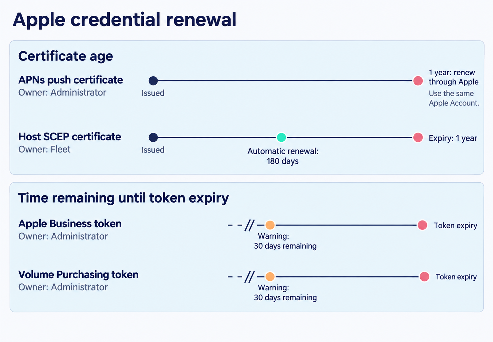

# Apple MDM configuration

 Fleet’s Apple integrations let you prepare devices for employees, deliver management settings, and make purchased apps available from the same console. Start with the push certificate, then connect Apple Business and Volume Purchasing as your enrollment and app-distribution plans require. Each connection has its own credential; tracking them separately keeps those workflows dependable.

## Purpose and scope

 This chapter takes you through Apple’s service connections, the certificates Fleet issues to hosts, and the default fleets used during automatic enrollment. By the end, you will have the connections and ownership records needed for an Apple pilot.

Getting individual devices enrolled is Part III. What MDM asks of your deployment generally is [2.9](2.9-mdm-architecture-and-foundations.md).

**Apple Business (AB)** is the service older material calls Apple Business Manager (ABM).

## Four credentials, four different renewal stories

 Track each credential separately:

| Credential | Lifetime | Renewed by | What happens when it lapses |
|---|---|---|---|
| **APNs push certificate** | One year | You, annually, through Apple, **using the same Apple Account that created it** | Commands and profile changes sit in Pending. **Renewing the same certificate restores delivery**, even after it has lapsed, and enrolled devices are unaffected. Losing the Apple Account is the serious case: a new certificate breaks trust with every enrolled device and all of them must re-enroll |
| **Apple Business token** | Expires; Fleet warns from 30 days out | You | Automatic enrollment stops working |
| **Volume Purchasing token** | Expires; warns from 30 days out | You | App Store app delivery stops |
| **Host SCEP certificates** | One year | **Fleet, automatically, every 180 days** | On manually enrolled devices, MDM is turned off and the user must re-enroll |

Fleet renews host SCEP certificates at 180 days, ahead of their one-year expiry. Administrators renew the other three credentials.

**Apple Business and Volume Purchasing both require Fleet Premium.** The push certificate does not.

<!-- IMAGE-OK: assets/2.10-apple-credentials.webp
     WHY: One shared timeline puts independent credential deadlines in an invented order and places the one-year label at the midpoint.
     PROMPT: Draw separate renewal tracks for four Apple credentials. Title: "Apple credential renewal".
     Use four horizontal rows, with the credential name and owner in a left gutter. Group the first
     two under "Certificate age" and the last two under "Time remaining until token expiry".
     Certificate track 1: "APNs push certificate", owner "Administrator". A labelled line starts at
     "Issued" and ends at "1 year: renew through Apple". Add "Use the same Apple Account" beside the end.
     Certificate track 2: "Host SCEP certificate", owner "Fleet". Use the same age scale as track 1,
     with "Issued" at zero, "Automatic renewal: 180 days" near halfway, and "Expiry: 1 year" at the end.
     The renewal mark is an action before expiry, not a claim that the original certificate remains in use.
     Token track 3: "Apple Business token", owner "Administrator". Show only the final interval from
     "Warning: 30 days remaining" to "Token expiry"; use an axis-break mark before the warning.
     Token track 4: "Volume Purchasing token", owner "Administrator". Use the same final-30-days scale.
     Do not draw an issuance date or imply a one-year lifetime for either token. Do not align their
     deadlines to the certificate-age axis or imply the four credentials were issued together.
     Use neutral tracks, an apricot warning mark, and a mint automatic-renewal mark, all text-labelled.
     Leave consequences of expiry in the chapter's existing table. No slogan or second comparison grid.
     TERMINOLOGY: Fleet is the company, product, or server. Host groups are lowercase
     fleet/fleets, including headings and labels. Do not call these groups teams. Preserve
     exact code/API identifiers. These instructions are not text to render.
     DESIGN: Flat vector technical diagram. Fleet is software for managing computers; draw no vehicles.
     Use Inter for labels and Roboto Mono for literal identifiers. On a 1400 px wide canvas use
     48 px titles, 36 px body labels, and at least 28 px secondary text; scale proportionally.
     Check the raster at 720 px wide and at its intended print size. Never shrink text to fit.
     Use a 32 px spacing grid, at least 24 px internal padding, and consistent corner radii.
     Left-align multiline explanations; center short node names. Keep a clear reading direction.
     Use #F9FAFC background, #192147 headings and primary connectors, #515774 body text,
     #8B8FA2 secondary connectors, #C5C7D1 borders, and #D3E8F3 or #E8F1F6 quiet fills.
     Use #5CABDF and #C98DEF only to distinguish named categories; #3AEFC4 for a labelled
     positive outcome, #D66C7B for a labelled failure, and #FAA669 for a labelled caution.
     Use accents at 20 to 25 percent tint for panels; full strength only for small marks.
     Keep text navy or slate, with off-white text on a navy anchor. Do not rely on color alone.
     Use one arrowhead shape and consistent stroke weights. Put connectors behind nodes,
     terminate at box edges, and keep labels clear of lines. Label branches and return paths.
     No gradients, shadows, decorative icons, logo, watermark, em-dashes, or slogan footer.
     Render only the specified reader-facing labels. Instructions and review notes stay out of the image.
     NOTE: Reviewed and installed 2026-09-09 in the live 4.91 and frozen 4.90 editions.
     The surrounding prose retains the conditions, exact identifiers, and accessible explanation.
     SOURCE: research/visual-reviews/part-2/assets/2.10-apple-credentials.png
-->

## Turning Apple MDM on

 The Apple push certificate lets Fleet notify enrolled devices that management work is waiting. Create this connection first; the other Apple management workflows depend on it.

In Fleet, go to **Settings > Integrations > MDM** and select **Turn on** for Apple. Fleet gives you a certificate signing request to download. Take that to Apple's push certificate portal, sign in, choose **Create a Certificate**, upload the request, and download what Apple returns. Upload that `.pem` back into Fleet.

Create the certificate under an organization-controlled account that will remain available for annual renewal. Fleet recommends a shared Apple Developer account.

<!-- SCREENSHOT: SS-2.10-01 | Apple management connections and renewal dates
     PURPOSE: Show the independent Apple credentials and the dates an administrator must track.
     PREPARE: Use a demo instance with Apple MDM enabled and test AB/ABM and VPP connections. Use fictional connection names; no actual token contents.
     CAPTURE: Settings > Integrations > MDM with Apple MDM on and the Apple Business/Apple Business Manager and Volume Purchasing connection rows visible. Include Renew date and the relevant Actions menus.
     FRAME: One readable panel crop, or two matched crops if the credential rows cannot fit legibly. Do not force an expired state on Dogfood.
     EDITION: Capture 4.91 and 4.90 separately if Apple Business naming or controls differ; use the actual release labels.
     PRIVACY: Use demo names and non-sensitive data; exclude tokens, passwords, keys, and personal identifiers.
     FILENAME: ss-2.10-01.png
-->

## Renewing the push certificate without resetting the estate

 Renew the existing push certificate under the same Apple Account. Even after expiry, renewing that certificate restores delivery without re-enrolling devices. Replacing it with a new certificate requires every Apple host to turn MDM off and back on.

In Fleet, go to **Settings > Integrations > MDM**, select **Edit** next to Apple MDM, then **Renew certificate**, and download the new signing request. In Apple's portal, sign in and select **Renew** next to your existing certificate rather than creating a new one. Upload the request, download the certificate, and upload it to Fleet.

**Apple Account:** use the account that created the certificate. A different account creates a new certificate.

**Certificate identity:** match the Common Name to the one Fleet displays. Fleet refuses an upload whose certificate does not match the key behind its signing request.

### What an expired certificate looks like

 The signature is specific: **configuration profile changes and other MDM commands stay in Pending** rather than failing.

If many devices remain Pending while macOS inventory still updates, check the push certificate as well as device connectivity.

macOS inventory uses fleetd and can keep arriving during an APNs outage. iOS and iPadOS inventory refreshes use MDM commands, so a lapsed certificate also stops those refreshes.

## Connecting Apple Business

 Apple Business makes automatic enrollment possible for company-owned devices, and account-driven enrollment possible for personal ones.

From **Settings > Integrations > MDM**, select **Add AB** and download the public key Fleet generates. In Apple Business, go to **Devices > Management**, add a server, name it something you will recognise, and upload that key. Apple hands back a service token, which you upload into Fleet.

After uploading the token, assign devices to the server in Apple Business. Under **Default Device Assignment**, choose it for Macs, iPhones, and iPads. The connection and token can be healthy while no devices are assigned. Assigned devices sync into Fleet with an MDM status of Pending.

Fleet begins warning thirty days before an AB token expires. Its renew date appears amber, then red after expiry. To renew, download a fresh token from the same Apple Business server and upload it against the existing connection through **Actions > Renew**.

Multiple AB or VPP tokens can support separate customers, acquired businesses, organizations with separate purchasing authorities, or operations in several countries.

Use additional tokens where those boundaries require them; check for duplicate setup before adding more.

## Where automatically enrolled hosts land

<!-- SCREENSHOT: SS-2.10-02 | Assigning Apple enrollment destinations
     PURPOSE: Show that default fleet placement is chosen separately for macOS, iOS, and iPadOS within an Apple token.
     PREPARE: Create demo fleets with clearly different names, then open one test AB/ABM token’s Actions > Edit fleets dialog.
     CAPTURE: Capture the per-platform default fleet selectors, with at least two different destinations and one Unassigned example if allowed. Include the BYOD destination selector if this release provides it, using a second crop if needed; chapter 3.5 reuses that account-driven enrollment detail.
     FRAME: One complete dialog showing the token context, platform labels, and selected fleets; no token value.
     EDITION: 4.91; reuse for 4.90 only when the visible controls and wording match
     PRIVACY: Use demo names and non-sensitive data; exclude tokens, passwords, keys, and personal identifiers.
     FILENAME: ss-2.10-02.png
-->

 Each AB token has a default destination fleet for each platform.

You set a default fleet **per platform**, so macOS, iOS and iPadOS can each land somewhere different. It is configured from **Settings > Integrations > MDM**, under the token's **Actions** menu, via **Edit fleets**.

Platforms with no default land in Unassigned. Configure that scope before enrolling devices ([1.3](../01-foundations/1.3-hosts-fleets-labels.md)).

A device can also be moved to a different fleet **before it enrolls**, which stages it into its final scope without it ever passing through the default.

## Requiring hardware-attested device identity

 Every enrolled Mac gets an identity certificate, and by default Fleet issues it over SCEP: a private key generated in software and signed against a challenge. **Require hardware attestation**, at **Settings > Organization settings > Advanced**, under **Host lifecycle**, asks Fleet to issue that certificate through ACME with Apple's Managed Device Attestation instead, binding the private key to the device's Secure Enclave rather than to a file on disk. It is Fleet Premium, off by default, and set through the checkbox, the REST API's `mdm.apple_require_hardware_attestation`, `fleetctl`, or GitOps's `controls.apple_require_hardware_attestation`.

**Three checks decide whether a given Mac gets it, evaluated fresh each time Fleet builds that Mac's identity certificate:**

- **Apple Silicon, macOS 14.0 or later.** Intel Macs and older macOS always fall back to SCEP. Apple's ACME attestation protocol also covers Apple Silicon iPhones and iPads, but Fleet does not extend the requirement to them yet.
- **The serial number is DEP-assigned to your Fleet server in Apple Business.** This is a check against the assignment record, not against which enrollment path the device took. A Mac that Apple Business has assigned to your server still clears this gate even if it enrolls through the ordinary manual link rather than Setup Assistant, because the same enrollment-profile endpoint serves both paths.
- **The device supplied a serial number at all.** Account-driven user enrollment carries no serial, so it always falls back to SCEP, silently.

Any device that fails one of these gets Fleet's ordinary SCEP certificate instead, with nothing shown in the console beyond an info-level log line naming the serial and the outcome. If you turned this on expecting attested Macs and are seeing SCEP identities, check Apple Silicon, macOS version, and the Apple Business assignment, in that order.

The attestation setting applies immediately to new enrollments. Existing Macs keep their identity certificate until the next automatic renewal at 180 days, when Fleet reevaluates the setting. Enabling it can therefore take up to six months to replace a SCEP identity; disabling it moves eligible devices back to SCEP on the same cycle.

Inspect the resulting certificate under **Hosts > *device* > Certificates**, or `GET /api/v1/fleet/hosts/{id}/certificates`. osquery cannot enumerate the Secure Enclave key. After the Mac acknowledges the ACME enrollment profile, Fleet queues `CertificateList` to populate `host_certificates`; allow that round trip to finish. The same probe runs on removal to clear stale rows.

## The default enrollment profile is stored once and never refreshed

 Upgrading Fleet preserves the default enrollment profile captured when the instance first registered for automatic enrollment.

When Apple devices enroll automatically, Fleet sends Apple a profile controlling how Setup Assistant behaves: whether enrollment is mandatory, which panes are skipped, whether the MDM profile can be removed. If you have not uploaded a custom one, Fleet uses a built-in default.

Fleet stores the default once. Upgrades and adding or removing AB tokens do not refresh it.

An older instance and a fresh installation can therefore send different Setup Assistant defaults while running the same Fleet release.

To adopt newer defaults, inspect the current release’s profile, copy the required values into a custom profile, and upload it. Fleet has no reset-to-latest action.

You can see what your instance is currently using at **Controls > Setup experience > Setup Assistant**, where the default is available to download when no custom profile is uploaded.

<!-- IMAGE-OK: assets/2.10-stored-enrollment-default.webp
     QUESTION: Why can two servers on the same release send different default enrollment profiles?
     PROMPT: DIAGRAM: Two parallel histories ending at the same Fleet release. Long-running
     instance: Initial registration captures Default A in storage, then an Upgrade arrow changes the
     binary while the stored Default A remains. Fresh instance: Initial registration on the newer
     release captures Default B. Label A and B Illustrative defaults, not real version numbers. A
     separate deliberate route reads Inspect current defaults, Author custom profile, Upload custom
     profile. No Upgrade arrow may replace the stored profile, and no Reset to latest button may
     appear.
     TERMINOLOGY: Fleet is the company, product, or server. Host groups are lowercase
     fleet/fleets, including headings and labels. Do not call these groups teams. Preserve
     exact code/API identifiers. These instructions are not text to render.
     DESIGN: Flat vector technical diagram. Fleet is software for managing computers; draw no
     vehicles. Use Inter labels and Roboto Mono identifiers. At 1400 px source width use 48 px
     titles, 36 px body labels, and at least 28 px secondary text; scale proportionally. Check at
     720 px reading width and intended print size. Use a 32 px spacing grid, at least 24 px node
     padding, and consistent corner radii. Center short node names; left-align multiline
     explanations. Never shrink text to fit. Use #F9FAFC background, #192147 headings and primary
     connectors, #515774 text, #8B8FA2 secondary connectors, #C5C7D1 borders, and #D3E8F3 or #E8F1F6
     quiet fills. Use #5CABDF and #C98DEF for named categories, #3AEFC4 for labelled positive
     outcomes, #D66C7B for labelled failures, and #FAA669 for labelled cautions. Tint large panels
     to 20 to 25 percent; full strength is for small marks. Keep text navy or slate, or off-white on
     a navy anchor. Never rely on colour alone. Use one arrowhead shape, consistent stroke weights,
     box-edge termination, and labelled branches and return paths. Keep connectors clear of text. No
     gradients, shadows, decorative icons, logo, watermark, em-dashes, or slogan footer. Render only
     the specified reader-facing labels. Choose orientation to fit the relationship, not a default
     poster. Keep captions outside the artwork. If labels crowd, split the figure before shrinking
     them. Keep editable SVG when the production method supports it.
     NOTE: Reviewed and installed 2026-09-09 in the live 4.91 and frozen 4.90 editions.
     The surrounding prose retains the conditions, exact identifiers, and accessible explanation.
     SOURCE: research/visual-reviews/part-2/assets/2.10-stored-enrollment-default.svg
-->

## Volume Purchasing

 Volume Purchasing allows App Store apps to be deployed to managed devices.

The token comes from Apple Business, under **Settings > Payments & Billing > Apps & Books**, and **each token corresponds to one organization unit** there. Upload it in Fleet under **Add VPP**, then assign it to whichever fleets should be able to use it.

Assign VPP tokens to the fleets that should share their app catalog. Separate assignments help preserve different purchasing arrangements across business units or regions.

Renewal is the same download-and-upload cycle, and Fleet shows token state in a **Renew date** column: yellow within thirty days of expiry, red once expired.

## Verification and ownership

 Confirm the connection on a real device rather than in the settings page. Enroll one, check inventory arrives, apply a profile, and run a low-risk command so you have seen the round trip complete.

Record the credential owners and renewal details:

- **The account each Apple credential was created under**, and confirmation that it is organizational rather than personal.
- **Three renewal dates**: the push certificate, the AB token, and each VPP token. The push certificate deserves the most warning because a lapse stalls every Apple device's MDM work until it is renewed.
- **Who watches the Renew date column**, since that column and a matching app-wide banner are the only advance warning Fleet gives for these credentials, and nothing else in the estate gets either by default.
- **Which fleets each VPP token serves**, so that adding a fleet later does not silently leave it without an app catalogue.

## Edge cases and precedence

 **Re-enrolling an Apple Business host clears its old state automatically.** After a wipe or an OS reinstall, Fleet cancels pending commands, script runs and software installs, clears completed ones from the previous enrollment, and resets the host's labels. **You do not need to delete the host from Fleet first.**

**That clearing does not happen during an MDM migration.** A host moving to Fleet from another MDM keeps its labels and pending activity deliberately, so the transition is continuous.

Fleet attempts automatic SCEP renewal at 180 days, leaving time before the one-year expiry. If renewal fails on a manually enrolled device, Fleet turns MDM off and the user must re-enroll it. Include certificate health in the management checks for that population.

**Automatic enrollment defaults are per platform within each token.** Setting a default fleet for macOS does not set one for iOS or iPadOS, and the unset ones fall to Unassigned. If you hold more than one Apple Business token, each carries its own set of per-platform defaults, so adding a token adds a fresh set of unset ones.

## Reference and troubleshooting

 When Apple MDM misbehaves, [8.8](../08-troubleshooting/8.8-apple-mdm-diagnostics.md) covers the push path, the command queue and profile status, including how to tell a stuck queue from an unreachable device.

For which channel is failing before you assume it is MDM at all, [8.1](../08-troubleshooting/8.1-diagnostic-method.md).

Endpoint paths that must be publicly reachable are in [a.8](../09-appendices/a.8-api-action-and-endpoint-reference.md); [2.9](2.9-mdm-architecture-and-foundations.md) covers why the set grows as you enable features.

## Version notes

 Verified against Fleet 4.90.0. The annual push certificate cycle and the same-account requirement are Apple's constraints, so they outlast Fleet versions; the screens for managing them are Fleet's and move between releases.

Apple Business and Volume Purchasing are Fleet Premium capabilities at this release. The stored-once behaviour of the default enrollment profile means an instance upgraded from an earlier release may not match a fresh install of the same version.
