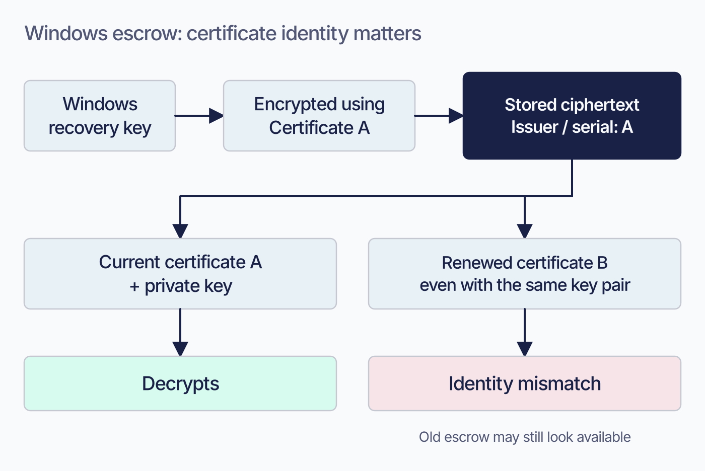

# Configure Windows management

 Fleet brings Windows enrollment, configuration, and device actions into the same workspace as your other platforms. You can enroll through the agent or connect Microsoft Entra ID for supported user-driven workflows. Begin by preparing the Windows management certificate and key: they support enrollment and protect escrowed recovery credentials, so their lifetime and custody are important deployment decisions.

## Purpose and scope

 Use this chapter to prepare Windows management, choose the enrollment experience, and establish the credentials and Microsoft identity connections it needs. [3.3](../03-connect-devices/3.3-enroll-windows-devices.md) takes the next step with individual devices, and [2.9](2.9-mdm-architecture-and-foundations.md) explains the shared MDM requirements.


## What the Windows connection commits you to

 You choose the lifetime of the self-signed certificate; Fleet’s example uses ten years. There is no vendor renewal service. Preserve the original certificate and private key because existing disk-encryption escrow requires that certificate’s identity.

The basic connection is Fleet Free. Zero-touch enrollment through Microsoft Entra ID is Fleet Premium, and Fleet rejects the Entra tenant and client IDs on Free; migrating Windows hosts from another MDM is Premium too. Migration, where you have it, is automatic, with no end user interaction.

Android uses an enterprise binding with a separate set of constraints ([2.12](2.12-bind-android-enterprise.md)).


<!-- IMAGE-OK: assets/2.11-windows-commitment.webp
     NOTE: accepted 2026-08-30. Sol diagram recipe (HANDOFF), rendered portrait as a vertical
     flow. PROMPT below.
     PROMPT: Landscape 16:9. A single vertical flow with three stations, generously spaced.
     At the top, a small filled certificate mark labelled "a key pair you generate yourself".
     An arrow down to a plain node labelled "no issuer, no renewal date". An arrow down to a
     caution mark labelled "replacing or renewing the certificate strands escrowed disk
     encryption keys". Across the bottom, a single full width band reading "free to start;
     zero-touch through Entra ID is Premium". Use one dot colour at a light tint for the flow
     stations and reserve full strength for the caution mark. Caption: "One credential, and
     one thing you cannot take back."
     PALETTE. Two sets, doing different jobs.
     STRUCTURE, the Fleet Black ramp and neutrals: #192147 for the most important marks,
     #515774 for ordinary labels, #8B8FA2 and #C5C7D1 for secondary structure, #E2E4EA for
     grouping bands, #F9FAFC background, #D3E8F3 and #E8F1F6 for quiet fills. All text stays
     in this set; do not tint type.
     THE FLEET DOTS, the six accent colours taken from Fleet's own logo mark: #5CABDF sky
     blue, #3AEFC4 mint, #63C740 green, #C98DEF lavender, #FAA669 apricot, #D66C7B rose.
     Fleet Green #009A7D sits alongside them. These are soft and pastel, so they work as
     fills with #192147 text on top.
     STRENGTH. Use a dot colour at full strength only for small marks: an arrow, a chip, a
     single filled icon, a rule. Over any large area, use it at roughly a 20 to 25 percent
     tint, so a panel reads as tinted rather than painted. Five large panels at full
     saturation looks like a children's infographic, not a technical manual. And do not
     colour a panel that has no content in it; colour has to carry meaning, and an empty
     coloured box is just noise.
     HOW TO USE THE DOTS. One colour per category, used consistently within the image, to
     fill or stroke the things a reader genuinely has to tell apart. Take only as many as
     there are categories; do not spread all six across four items to look lively. If nothing
     in the picture needs distinguishing, use none of them and let the structure set carry it.
     GIVE IT WEIGHT. At least one element should be a solid filled shape rather than an
     outline, so the composition has an anchor. Vary stroke weight so the primary flow is
     visibly heavier than the scaffolding around it.
     Never invent a colour outside these two sets. Flat vector, generous whitespace, no
     gradients, no drop shadows, no 3D or photorealistic icons, no logo, no watermark.
     Legible at half page width.
     NOTE: "Fleet" here is a software product for managing computers. Never draw vehicles,
     cars, vans, trucks, ships or aircraft. Never use an em-dash in rendered text.
 -->

## Windows: the certificate you issue yourself

 Fleet uses your self-signed certificate and private key for Windows enrollment. Track the expiry you choose; no external authority renews it.

Generate the key first, then a self-signed certificate over it:

```
openssl genrsa --traditional -out fleet-mdm-win-wstep.key 4096
openssl req -x509 -new -nodes -key fleet-mdm-win-wstep.key -sha256 -days 3652 \
  -out fleet-mdm-win-wstep.crt -subj '/CN=Fleet Root CA/C=US/O=Fleet.'
```

Run `openssl version` before generating the key. If it reports LibreSSL, use OpenSSL instead: LibreSSL does not support `--traditional`.

The example sets a lifetime of `3652` days, about ten years. Fleet does not require that duration. Consider the escrow consequences below before choosing a shorter lifetime.

Give the contents to the server as `FLEET_MDM_WINDOWS_WSTEP_IDENTITY_CERT_BYTES` and `FLEET_MDM_WINDOWS_WSTEP_IDENTITY_KEY_BYTES`, then restart Fleet. The `_BYTES` suffix is a general convention across Fleet's configuration and not specific to these two: a variable ending in `_BYTES` wants the file's contents, and dropping the suffix gives you the variable that wants a path instead.

**Fleet parses and caches this pair once, when `fleet serve` starts**, so the restart is required. This is one of the settings from [2.7](2.7-organization-and-server-settings.md) that cannot be changed from the UI or the API, because it is not stored in the database at all.

## The Windows key pair is also Fleet's escrow key

 The WSTEP certificate and key serve two purposes: Windows enrollment and protection of escrowed disk encryption keys. Preserve the original pair so Fleet can decrypt credentials stored against that certificate.

When a Windows host reports its disk encryption key, Fleet encrypts that key to the WSTEP certificate before storing it. When an administrator later views the key on the host details page, Fleet decrypts it with the WSTEP private key. Neither operation has a fallback.

Before replacing or renewing the certificate, preserve and verify the old certificate and key. Escrow retrieval matches the ciphertext to the current certificate by issuer and serial. Even a renewed certificate with the same key pair fails that match, while Fleet may still show the old recovery keys as available.

Fleet has no supported operation to re-escrow the existing population on demand. Test a method of obtaining fresh escrow in your deployment and prove recovery by retrieving a credential after the change ([7.6](../07-operate-fleet/7.6-maintain-credentials-certificates-and-access.md)).

Escrow protection follows the host platform. Windows uses the WSTEP pair; Linux LUKS escrow uses the server private key. Apple uses Fleet’s Apple MDM certificate authority assets and retains earlier authority certificates for older escrow. Windows does not retain that equivalent history automatically.

> Fleet's published configuration reference states that changing this pair affects **macOS** hosts. Reading the code at this release, the WSTEP path is selected for Windows hosts and Apple hosts take the certificate authority path instead. Treat the platform in that sentence as Windows.

<!-- IMAGE-OK: assets/2.11-windows-escrow-identity.webp
     QUESTION: Why can a renewed Windows enrollment certificate break retrieval of an existing
     BitLocker key?
     PROMPT: DIAGRAM: A Windows recovery key enters Fleet, is encrypted using Certificate A, and
     becomes stored ciphertext tagged with A's issuer/serial. On the read side, compare Current
     certificate A + private key (decrypts) with Renewed certificate B, even if same key pair
     (identity mismatch). Use a small identity tag as the critical visual, rather than a generic
     broken padlock. Label the failed branch Old escrow may still look available. Limit this figure
     to Windows; do not reuse its rule for Apple or Linux. No real recovery values, issuer details,
     or certificate material.
     TERMINOLOGY: Fleet is the company, product, or server. Host groups are lowercase
     fleet/fleets, including headings and labels. Do not call these groups teams. Preserve
     exact code/API identifiers. These instructions are not text to render.
     DESIGN: Flat vector technical diagram. Fleet is software for managing computers; draw no
     vehicles. Use Inter labels and Roboto Mono identifiers. At 1400 px source width use 48 px
     titles, 36 px body labels, and at least 28 px secondary text; scale proportionally. Check at
     720 px reading width and intended print size. Use a 32 px spacing grid, at least 24 px node
     padding, and consistent corner radii. Center short node names; left-align multiline
     explanations. Never shrink text to fit. Use #F9FAFC background, #192147 headings and primary
     connectors, #515774 text, #8B8FA2 secondary connectors, #C5C7D1 borders, and #D3E8F3 or #E8F1F6
     quiet fills. Use #5CABDF and #C98DEF for named categories, #3AEFC4 for labelled positive
     outcomes, #D66C7B for labelled failures, and #FAA669 for labelled cautions. Tint large panels
     to 20 to 25 percent; full strength is for small marks. Keep text navy or slate, or off-white on
     a navy anchor. Never rely on colour alone. Use one arrowhead shape, consistent stroke weights,
     box-edge termination, and labelled branches and return paths. Keep connectors clear of text. No
     gradients, shadows, decorative icons, logo, watermark, em-dashes, or slogan footer. Render only
     the specified reader-facing labels. Choose orientation to fit the relationship, not a default
     poster. Keep captions outside the artwork. If labels crowd, split the figure before shrinking
     them. Keep editable SVG when the production method supports it.
     NOTE: Reviewed and installed 2026-09-09 in the live 4.91 and frozen 4.90 editions.
     The surrounding prose retains the conditions, exact identifiers, and accessible explanation.
     SOURCE: research/visual-reviews/part-2/assets/2.11-windows-escrow-identity.svg
-->



## Turning Windows MDM on

<!-- SCREENSHOT: SS-2.11-01 | Windows MDM and enrollment settings
     PURPOSE: Show where administrators choose the Windows enrollment experience and connect Entra.
     PREPARE: Use a demo instance with Windows certificate configuration complete and Windows MDM enabled. Use a test Entra application with non-sensitive identifiers.
     CAPTURE: Settings > Integrations > MDM > Windows management. Show Automatic/Manual enrollment controls and the Entra connection section. In 4.91, include User driven enrollment and Default fleet in a second frame if needed.
     FRAME: One or two focused panel captures with complete labels. Keep tenant/client IDs masked or replace them with demo values; no private key or certificate contents.
     EDITION: Capture 4.90 separately: the user-driven Default fleet control is a 4.91 addition.
     PRIVACY: Use demo names and non-sensitive data; exclude tokens, passwords, keys, and personal identifiers.
     FILENAME: ss-2.11-01.png
-->

 With the pair in place and the server restarted, go to **Settings > Integrations > Mobile device management (MDM)**, select **Turn on** next to Windows, and set the toggle.

Choose the enrollment experience that fits your rollout. **Automatic**, Fleet’s recommended setting, starts enrollment without prompting the user. **Manual** asks the user to turn management on.

Fleet's guidance is that turning Windows MDM on **disables Windows tamper protection** on the host, as a consequence of how Windows hands management to an MDM rather than as a Fleet decision. **Nothing in Fleet's source at this release establishes it**, so confirm it on a test machine before quoting it in a compliance answer. Either way, raise it early, because the answer changes a security posture.

## Windows enrollment waits for a sign-in

 **Fleet's guidance is that Windows completes MDM enrollment in the context of a signed-in user**, not at boot and not when the agent first checks in.

Fleet's source establishes only that the agent's check-in **starts** registration: Orbit runs as a system service and calls Windows' registration API without inspecting who is logged in ([3.3](../03-connect-devices/3.3-enroll-windows-devices.md)). When Windows **completes** enrollment is Windows' behaviour, and nothing in the checkout establishes it.

Fleet’s guidance describes machines without interactive sessions as waiting for enrollment with MDM **Off**. Commands, profiles, and encryption settings remain queued while Fleet continues offering enrollment. It gives a completion estimate of about thirty seconds after sign-in. Test that behavior on your devices before using the estimate in a rollout plan.

For unattended machines reporting MDM **Off**, include sign-in state in the investigation.

## Automatic enrollment through Microsoft Entra ID

 Automatic enrollment on Windows is a Fleet Premium capability and it runs through Microsoft Entra ID, which puts the sign-in during device setup in Microsoft's hands rather than Fleet's.

Check existing Intune enrollment settings before connecting Fleet. In **Devices > Device onboarding > Enrollment > Automatic Enrollment**, set both **MDM user scope** and **WIP user scope** to **None**. Otherwise, automatic enrollment into Intune can direct devices away from Fleet.

Licensing is Microsoft's and it is per-person. You, as the administrator, need a Microsoft Enterprise Mobility + Security E3 license. Every end user who enrolls automatically or turns MDM on by hand needs at least Entra ID P1, which they already have if they hold an E3 or E5. Fleet's own Autopilot notes describe that end-user requirement as their **current understanding** rather than something verified end to end, so price a rollout against Microsoft's terms rather than against this summary ([3.3](../03-connect-devices/3.3-enroll-windows-devices.md)).

Fleet Premium is required for both the Settings-app and Entra automatic-enrollment routes, which use tenant and client IDs, and for migration from another MDM. Free supports the agent-driven path without migration.

The connection itself is three values that have to agree, held in two consoles:

- **The Entra tenant ID**, copied from Entra and added in Fleet under **Settings > Integrations > MDM > Windows Enrollment**.
- **The MDM URLs**, copied from Fleet and pasted into a custom application you create in Entra under **Mobility (MDM and WIP)**. The same application's **Application ID URI** must be set to your Fleet URL.
- **The application client ID**, copied back from that Entra application into Fleet. Entra issues v2 access tokens whose audience is the client ID, so Fleet cannot validate a token without it.

If either the tenant ID or the client ID is missing, the end user sees "Device management could not be enabled" and cannot enroll. The message does not distinguish the two, so check both.

Your Fleet URL also has to be registered in Entra as a verified custom domain, which means a TXT or MX record at your registrar. On managed cloud hosting you do not control that DNS, so ask Fleet to create the record.

Grant Microsoft Graph permissions to the application, then grant admin consent:

- **Delegated:** `Group.Read.All`, `Group.ReadWrite.All`.
- **Application:** `Device.Read.All`, `Device.ReadWrite.All`, `Directory.Read.All`, `Group.Read.All`, `User.Read.All`.

Connecting Entra also gives end users the **Settings > Access work or school** route for turning management on themselves, and Fleet collects the email address from that sign-in and stores it as the host's IdP username. During setup, users are prompted to configure Windows Hello and a PIN.

Once the Entra connection works, Windows Autopilot adds branding and control over the out-of-box experience. It builds on the enrollment configuration above, with a role similar to Automated Device Enrollment on Apple platforms.

## Migrating Windows hosts from another MDM

 Fleet can move Windows hosts off another MDM with no end user interaction at all. Turn Windows MDM on, install fleetd on the hosts and wait for them to appear, then return to **Manage Windows MDM** and select **Automatically migrate hosts connected to another MDM solution**. Fleet notifies each host and the move usually takes minutes.

Monitor migration results because users receive no prompt to confirm the move.

 For hosts stuck at MDM **Off**, inspect fleetd logs. Enrollment errors such as `400` or `0x8018000a`, sometimes accompanied by locked local accounts, can indicate residue from the previous manager. Fleet provides `fix-windows-mdm-migration.ps1` for that case. After running it, reboot and refetch the host. Its existence does not establish that residue is the most likely cause.

Review RMM agents retained from the previous deployment. Products such as N-able, ConnectWise, or Kaseya can independently interfere with enrollment and, in some cases, Windows Update. Remove agents that are no longer part of the intended management plan.

Re-using a device that was previously enrolled through Autopilot needs its stale records cleared first, in a specific order: delete the host in Fleet, delete the device object in **Entra ID > Devices**, then confirm in Intune that the hardware hash is still registered and the right profile assigned. **Do not delete the Autopilot registration itself.** Sync, then reset the device. If the first boot skips Autopilot, restart and try again, since the sync can lag by a few minutes.

## Turning Windows MDM off

 `uninstall-fleetd-windows.ps1`, under `docs/solutions/windows/scripts/` in Fleet’s repository, unregisters MDM and removes Orbit, osqueryd, and Fleet Desktop, including their service, files, and registry entries. Inventory, reports, scripts, and software delivery stop until fleetd is reinstalled. Confirm that complete removal is intended before using it.

Turning Windows MDM off is per host and then global. Save `uninstall-fleetd-windows.ps1` as a script in Fleet, then batch-run it across the Windows hosts ([5.3](../05-manage-devices/5.3-run-and-manage-scripts.md#running-it-on-many-at-once)), which turns MDM off and removes fleetd with it, then switch Windows MDM off under **Settings > Integrations > MDM**.

## Verification and ownership

 For Windows, the test is a real device rather than a settings page: a freshly wiped machine, a test Entra user, **Set up for an organization** at the setup screen, and then the Fleet icon in the taskbar leading to a **My device** page showing **Online**. Because enrollment depends on a sign-in, a status check that does not involve signing in tells you very little.

Document ownership on both sides of the connection. Keep the Windows certificate and private key with the server’s protected secrets. Assign the Entra tenant, application registration, and Graph permissions to the Microsoft identity administrator, and coordinate changes with the Fleet operator.

## Edge cases and precedence

 The behaviours below all come from the boundary between Fleet and the platform vendor.

Intune's automatic enrollment silently wins over Fleet. It is not reported as a conflict; the devices never arrive.

Enrolling against an identity provider that is not federated with Entra is not supported. A third-party IdP works only through that federation.

Fleet’s guidance says Windows hosts may wait at MDM **Off** until an interactive sign-in; confirm the behavior as described above.

## Reference and troubleshooting

 Windows MDM diagnostics, including reading enrollment failures out of the fleetd logs, are in [8.9](../08-troubleshooting/8.9-windows-mdm-diagnostics.md).

The Windows management endpoints that have to be publicly reachable are listed in [a.8](../09-appendices/a.8-api-action-and-endpoint-reference.md). [2.9](2.9-mdm-architecture-and-foundations.md) covers why that set grows as features are turned on.

For deciding whether the problem is the platform connection at all, start with [8.1](../08-troubleshooting/8.1-diagnostic-method.md).

## Version notes

 Verified against Fleet 4.90.0. The Microsoft licensing requirements and the Entra console layout are vendor-owned and change on Microsoft's schedule, not Fleet's.
