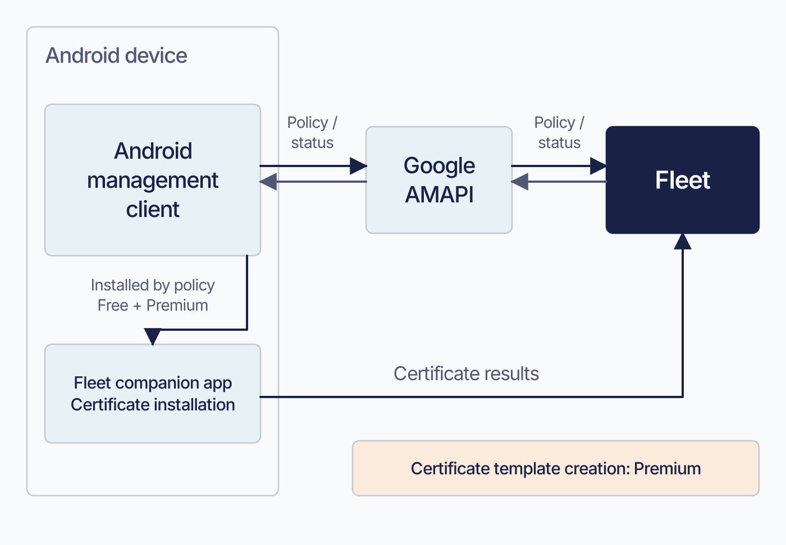

# Bind Android Enterprise

Connecting Android binds Fleet to a Google enterprise without a certificate renewal cycle. Settle the Fleet server URL first: Google’s event subscription keeps the original URL if you later change it in Fleet.

## Purpose and scope

 This chapter covers connecting Fleet to Android Enterprise: the binding that stands in for a credential, what the connection commits you to afterwards, and how to turn it off. Enrolling individual devices is [3.6](../03-connect-devices/3.6-enroll-android-devices.md). What MDM asks of your deployment in general is [2.9](2.9-mdm-architecture-and-foundations.md).

The basic connection is Fleet Free, for work profiles on personally owned devices. Company-owned enrollment is **not licence-gated in Fleet's server at this release**: nothing in the Android module checks a licence, and a company-owned QR enrollment is one query parameter on the same token endpoint the personal path uses ([3.6](../03-connect-devices/3.6-enroll-android-devices.md)). Confirm the commercial side against Fleet's own pricing rather than against behaviour. Migrating Android hosts from another MDM is manual at both ends.

For the Windows certificate and its escrow requirements, see [2.11](2.11-configure-windows-management.md).

## Android: binding an enterprise

 Bind Fleet to an Android Enterprise through Google’s signup flow.

Fleet supports devices that are Play Protect certified, previously known as GMS. Start at **Settings > Integrations > Mobile device management (MDM)** and select **Connect**, which opens Google's signup. Which flow you get depends on what your organization already uses, and the difference is mostly about proving you own your domain.

With **Google Workspace**, sign up with an existing admin account and a free Android Enterprise subscription is added to your Workspace. With **Microsoft 365**, enter your Microsoft email and choose **Sign in with Microsoft**. With **neither**, sign up with a work email rather than a personal `@gmail.com` address, and verify your domain in the Google Admin console afterwards.

Fleet’s guide gives conflicting instructions for Microsoft 365 domain verification: one passage exempts Microsoft organizations, while the procedure asks them to verify. Check whether your domain is already verified and complete verification if needed.

**The Workspace account needs super administrator privileges only for the initial enterprise binding.** Once the binding exists it survives, so the privileges can be reduced immediately afterwards and the connection keeps working.

## What the Android connection commits you to

 Fleet does not talk to Google's Android Management API directly by default. It talks to a proxy running on fleetdm.com, which talks to Google. The enterprise creation, the policy, the Pub/Sub subscription and the per-device enrollment tokens all pass through that proxy.

Plan for these connection requirements:

**Your Fleet server URL must be publicly reachable.** Google delivers device events by Pub/Sub push, which means Google originating a connection to your server. A URL that only resolves inside your network cannot receive them.

**Keep the server URL stable.** Fleet does not move the Pub/Sub subscription when its server URL changes. Complete planned hostname changes before connecting Android.

**One Fleet server URL supports one Android enterprise, on the default path.** This is enforced by the proxy Fleet operates; a deployment configured to talk to Google directly is not subject to the proxy's rule. It shows up most on non-production instances, where the same URL cannot be rebound after the database is reset.

A half-finished state is also possible. The binding takes several round trips, and a network failure partway through can leave the proxy having created an enterprise that your Fleet server never received the secret key for. The symptom is a connection that looks established on Google's side and absent on Fleet's.

## Android management and the certificate companion app

 There is no fleetd on Android and no osquery, and the traffic is mainly Google telling Fleet what happened: `ENROLLMENT` when a device enrolls, `STATUS_REPORT` when its state changes.

Fleet polls Google hourly to reconcile device existence. At enrollment it also adds a small Fleet companion app to every host’s policy on Free and Premium. The app enrolls with Fleet and reports certificate results once a template exists; creating that template requires Premium ([3.6](../03-connect-devices/3.6-enroll-android-devices.md)).

Android has no live queries, scheduled reports, or scripts. Its inventory and management capabilities follow the Android Management API.

The companion app installs client certificates. AMAPI provides no REST call for that operation, so Fleet uses its delegated `CERT_INSTALL` scope.

Fleet sets the app to `FORCE_INSTALLED`, pre-grants permissions, assigns `COMPANION_APP`, and enables high-priority auto-updates. A pinned signing-certificate fingerprint prevents another package with the same name from replacing it.

The hidden server settings `mdm.android_agent.package` and `mdm.android_agent.signing_sha256` have working defaults. Set both or neither; they are intended for Fleet development.

Android API operations are also batched, at `mdm.android_batch_size` hosts per call, defaulting to 100 with 0 meaning no limit. That one is likewise hidden, and it matters only if you are sizing API pressure on a large Android estate.

<!-- IMAGE-OK: assets/2.12-android-companion-boundary.webp
     QUESTION: What does the small Android agent do alongside Google's management path?
     PROMPT: DIAGRAM: Inside one Android device boundary place Android management client and a much
     smaller fleet Android companion app. The management client exchanges policy and status through
     Google AMAPI to Fleet; the companion has a separate direct Certificate results arrow to Fleet
     and is labelled Certificate installation. A policy-delivery arrow installs the companion on
     both editions; label Certificate template creation: Premium on the certificate path only. Do
     not draw Orbit, osquery, live queries, or scripts on Android. Use relative box size for limited
     responsibility, not a numeric traffic-volume claim.
     TERMINOLOGY: Fleet is the company, product, or server. Host groups are lowercase
     fleet/fleets, including headings and labels. Do not call these groups teams. Preserve
     exact code/API identifiers. These instructions are not text to render.
     DESIGN: Flat vector technical diagram. Fleet is software for managing computers; draw no
     vehicles. Use Inter labels and Roboto Mono identifiers. At 1400 px source width use 48 px
     titles, 36 px body labels, and at least 28 px secondary text; scale proportionally. Check at
     720 px reading width and intended print size. Use a 32 px spacing grid, at least 24 px node
     padding, and consistent corner radii. Center short node names; left-align multiline
     explanations. Never shrink text to fit. Use #F9FAFC background, #192147 headings and primary
     connectors, #515774 text, #8B8FA2 secondary connectors, #C5C7D1 borders, and #D3E8F3 or #E8F1F6
     quiet fills. Use #5CABDF and #C98DEF for named categories, #3AEFC4 for labelled positive
     outcomes, #D66C7B for labelled failures, and #FAA669 for labelled cautions. Tint large panels
     to 20 to 25 percent; full strength is for small marks. Keep text navy or slate, or off-white on
     a navy anchor. Never rely on colour alone. Use one arrowhead shape, consistent stroke weights,
     box-edge termination, and labelled branches and return paths. Keep connectors clear of text. No
     gradients, shadows, decorative icons, logo, watermark, em-dashes, or slogan footer. Render only
     the specified reader-facing labels. Choose orientation to fit the relationship, not a default
     poster. Keep captions outside the artwork. If labels crowd, split the figure before shrinking
     them. Keep editable SVG when the production method supports it.
     NOTE: Reviewed and installed 2026-09-09 in the live 4.91 and frozen 4.90 editions.
     The surrounding prose retains the conditions, exact identifiers, and accessible explanation.
     SOURCE: research/visual-reviews/part-2/assets/2.12-android-companion-boundary.svg
-->

## Personally enrolled Android hosts report an enterprise-specific ID

 On a personally owned Android device enrolled with a work profile, the `hardware_serial` and `uuid` that Fleet reports are not hardware identifiers. They are what Google calls an enterprise-specific ID: unique to this work profile in your organization, stable across factory resets, and meaningless to anyone else.

Apple’s two personal-enrollment paths also differ. Account-driven user enrollment supplies an enrollment identifier; personal enrollment by link supplies the real serial and UDID. Both display **On (manual - personal)**, so the status alone cannot distinguish them ([3.5](../03-connect-devices/3.5-enroll-ios-and-ipados-devices.md)).

Any process that assumes a serial number identifies a physical device will not work on the Android hosts above or on account-driven Apple enrollments. Hardware asset reconciliation is the obvious one.

Wiping behaves differently too. Fleet sends the Android Management API's wipe command rather than its delete device command, because the delete command expires after thirty days. A device that is off, lost or abroad for longer than that would otherwise stop being wiped. The wipe command does not expire, so the work profile is removed whenever the device next appears.

## Turning Android MDM off deletes your enterprise

 Turning Android MDM off deletes the Android Enterprise and ends management for its devices.

Fleet performs teardown sequentially: it deletes the enterprise at Google, removes its local record, disables Android MDM, and marks Android hosts unenrolled. It then fails pending managed-store app installs and deletes the Pub/Sub notification token and Fleet server secret. Each step stops on error, so confirm both Google and Fleet state if teardown fails.

Google controls the device-side result. Personally owned devices lose their work profiles; fully managed company-owned devices stop being managed. Turning Android MDM on again creates a fresh binding and restores neither the old connection secrets nor failed installs.

Deleting the enterprise in **Google Admin console** also turns Android MDM off in Fleet, with the same device consequences. Fleet provides no confirmation step for a deletion initiated there. Include Google administrators in the ownership and change process.

<!-- IMAGE-OK: assets/2.12-android-off-switch.webp
     NOTE: accepted 2026-08-30. Sol diagram recipe (HANDOFF), generated then given one polish
     pass to separate the caution mark from its label. PROMPT below.
     PROMPT: Landscape 16:9. A simple two-source diagram. On the left, two labelled entry
     points drawn as small filled marks: "Fleet: Settings > Integrations > MDM > Turn off" and
     "Google Admin console: delete the Android Enterprise". Both feed arrows into a single
     shared node in the centre labelled "Android Enterprise deleted". From that node, three
     arrows fan out to the right to outcomes: "MDM off on every Android host", "Google removes
     work profiles from personally owned devices", "re-enrolling means a new binding". Draw the second entry
     point at heavier stroke weight with a small caution mark beside it and a short label
     reading "no confirmation in Fleet". Use a single dot colour for the destructive path and
     keep everything else in the structure set. Caption: "Two doors, one outcome."
     PALETTE. Two sets, doing different jobs.
     STRUCTURE, the Fleet Black ramp and neutrals: #192147 for the most important marks,
     #515774 for ordinary labels, #8B8FA2 and #C5C7D1 for secondary structure, #E2E4EA for
     grouping bands, #F9FAFC background, #D3E8F3 and #E8F1F6 for quiet fills. All text stays
     in this set; do not tint type.
     THE FLEET DOTS, the six accent colours taken from Fleet's own logo mark: #5CABDF sky
     blue, #3AEFC4 mint, #63C740 green, #C98DEF lavender, #FAA669 apricot, #D66C7B rose.
     Fleet Green #009A7D sits alongside them. These are soft and pastel, so they work as
     fills with #192147 text on top.
     STRENGTH. Use a dot colour at full strength only for small marks: an arrow, a chip, a
     single filled icon, a rule. Over any large area, use it at roughly a 20 to 25 percent
     tint, so a panel reads as tinted rather than painted. Five large panels at full
     saturation looks like a children's infographic, not a technical manual. And do not
     colour a panel that has no content in it; colour has to carry meaning, and an empty
     coloured box is just noise.
     HOW TO USE THE DOTS. One colour per category, used consistently within the image, to
     fill or stroke the things a reader genuinely has to tell apart. Take only as many as
     there are categories; do not spread all six across four items to look lively. If nothing
     in the picture needs distinguishing, use none of them and let the structure set carry it.
     GIVE IT WEIGHT. At least one element should be a solid filled shape rather than an
     outline, so the composition has an anchor. Vary stroke weight so the primary flow is
     visibly heavier than the scaffolding around it.
     Never invent a colour outside these two sets. Flat vector, generous whitespace, no
     gradients, no drop shadows, no 3D or photorealistic icons, no logo, no watermark.
     Legible at half page width.
     NOTE: "Fleet" here is a software product for managing computers. Never draw vehicles,
     cars, vans, trucks, ships or aircraft. Never use an em-dash in rendered text.
 -->

## Verification and ownership

 For Android, the settings page is the confirmation. **Settings > Integrations > MDM** shows Android MDM on once the binding is complete, and on the Google side the free Android Enterprise subscription appears in the Workspace subscriptions list.

Record who administers the Google organization and can delete its Android Enterprise.

## Edge cases and precedence

 The behaviours below come from the boundary between Fleet and the platform vendor.

Android software installs must be marked self-service. Apps reach the user through the Play Store inside the work profile, so there is no silent push equivalent for Android.

Android operating system updates have no built-in form in Fleet at this release, unlike macOS, iOS, iPadOS and Windows. They can still be enforced: the control is a `systemUpdate` block inside an Android configuration profile, Premium-gated independently of everything else, and [5.6](../05-manage-devices/5.6-control-operating-system-updates.md) owns it.

## Reference and troubleshooting

 Android diagnostics are in [8.10](../08-troubleshooting/8.10-android-diagnostics.md), and they are largely a matter of interpreting what Google has and has not pushed.

The Android Pub/Sub callback that has to be publicly reachable is listed in [a.8](../09-appendices/a.8-api-action-and-endpoint-reference.md). [2.9](2.9-mdm-architecture-and-foundations.md) covers why that set grows as features are turned on.

## Version notes

 Verified against Fleet 4.90.0. Google's signup flow is vendor-owned and changes on Google's schedule, not Fleet's.

Certificate delivery to Android hosts arrived in 4.84.0, with automatic retry of failed installations and per-host resending; 4.85.0 added ordering so that a Wi-Fi profile referencing a certificate is delivered only after the certificate itself. An instance running an earlier release will not behave as described. The per-host resend is not Android-specific and is taught as an operator action in [5.2](../05-manage-devices/5.2-manage-configuration-profiles-and-declarative-settings.md#changing-resending-and-removing).

The server URL restriction is a known limitation. Recheck it against the release you plan to run before a hostname change.