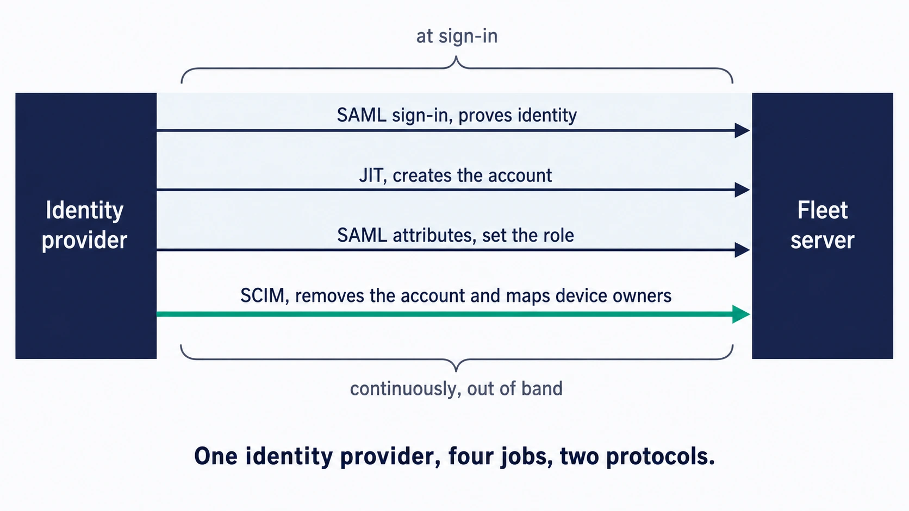

# Identity providers, SSO, SCIM, and role sync

Connecting Fleet to your identity provider lets you manage administrator access alongside the rest of your organization’s applications. It can also bring device-owner information into Fleet, giving administrators useful context about the people using their devices. Sign-in, account provisioning, role assignment, and owner mapping each have their own configuration; this chapter helps you put them together in a sequence you can test.

## Purpose and scope

This chapter covers connecting Fleet to an identity provider and deciding how administrator accounts come into existence, receive permissions, and go away.

Use [1.4 Identity and roles](../01-foundations/1.4-identity-and-roles.md) for the access model, including global and fleet scope and dedicated automation identities. Here, you will connect that model to the identity provider’s sign-in and provisioning flows.

Managing individual accounts and API-only identities day to day is [2.6](2.6-user-accounts-roles-and-service-identities.md).

## What you should have at the end

 Aim to leave setup with a working sign-in path, a recovery option, and clear ownership for the account lifecycle:

- A tested SSO connection, and a recovery account that does not depend on it.
- A decision on JIT provisioning and role sync, taken deliberately rather than by default.
- If you use SCIM, a named owner for the API token behind it and a date to rotate it.
- A record of the verification steps at the end of this chapter, including which ones you ran.

## Vocabulary

 These four terms describe the responsibilities you can connect to your identity provider.

| Term | In this chapter it means |
|---|---|
| **SSO** | Authenticating an administrator against your identity provider, using SAML |
| **JIT provisioning** | Creating the Fleet account automatically the first time that person signs in |
| **Role sync** | Setting that account's role from attributes the identity provider sends in the sign-in response |
| **SCIM** | A separate protocol your identity provider uses to push user records to Fleet, for two distinct purposes described below |

Each answers a different question. Authentication answers who is signing in. Provisioning answers whether Fleet should create an account for them. Role sync answers what that account may do. SCIM keeps account and device-owner data current outside the sign-in flow entirely.

<!-- IMAGE-OK: assets/2.5-identity-provider-jobs.webp
     NOTE: reviewed 2026-08-24 and kept. Arrows now span the full width and land on the
     Fleet server box, the dead space is gone, text is back in the Black ramp, and the green
     SCIM arrow marks the one job not tied to a sign-in. Prompt retained; do not delete.
     PROMPT: A tall box on the left labelled "Identity provider" and a tall box on the right
     labelled "Fleet server". Both plain, no icons inside either one. Four horizontal arrows
     run left to right between them, stacked. Their labels, top to bottom: "SAML sign-in,
     proves identity", "JIT, creates the account", "SAML attributes, set the role", "SCIM,
     removes the account and maps device owners". A brace gathers the first three, labelled
     "at sign-in". A second brace on the fourth is labelled "continuously, out of band". Draw the fourth
     arrow in #009A7D at a heavier weight, because it is the only one not tied to a sign-in,
     and band the first three with an #E8F1F6 fill so the grouping is visible before the brace
     is read. Give the two end boxes a solid #192147 fill with white text.
     Caption: "One identity provider, four jobs, two protocols."
     PALETTE. Two sets, doing different jobs.
     STRUCTURE, the Fleet Black ramp and neutrals: #192147 for the most important marks,
     #515774 for ordinary labels, #8B8FA2 and #C5C7D1 for secondary structure, #E2E4EA for
     grouping bands, #F9FAFC background, #D3E8F3 and #E8F1F6 for quiet fills. All text stays
     in this set; do not tint type.
     THE FLEET DOTS, the six accent colours taken from Fleet's own logo mark: #5CABDF sky
     blue, #3AEFC4 mint, #63C740 green, #C98DEF lavender, #FAA669 apricot, #D66C7B rose.
     Fleet Green #009A7D sits alongside them. These are soft and pastel, so they work as
     fills with #192147 text on top.
     STRENGTH. Use a dot colour at full strength only for small marks: an arrow, a chip, a
     single filled icon, a rule. Over any large area, use it at roughly a 20 to 25 percent
     tint, so a panel reads as tinted rather than painted. Five large panels at full
     saturation looks like a children's infographic, not a technical manual. And do not
     colour a panel that has no content in it; colour has to carry meaning, and an empty
     coloured box is just noise.
     HOW TO USE THE DOTS. One colour per category, used consistently within the image, to
     fill or stroke the things a reader genuinely has to tell apart. Take only as many as
     there are categories; do not spread all six across four items to look lively. If nothing
     in the picture needs distinguishing, use none of them and let the structure set carry it.
     GIVE IT WEIGHT. At least one element should be a solid filled shape rather than an
     outline, so the composition has an anchor. Vary stroke weight so the primary flow is
     visibly heavier than the scaffolding around it.
     Never invent a colour outside these two sets. Flat vector, generous whitespace, no
     gradients, no drop shadows, no 3D or photorealistic icons, no logo, no watermark.
     Legible at half page width.
     NOTE: "Fleet" here is a software product for managing computers. Never draw vehicles,
     cars, vans, trucks, ships or aircraft. Never use an em-dash in rendered text. -->

## SCIM does two different jobs

 One SCIM connection supports administrator deprovisioning and device-owner mapping. Consider both uses when choosing the attributes and groups your identity provider will send.

### Deprovisioning administrators

With SCIM connected, when a person is deleted or deactivated in your identity provider, Fleet removes their Fleet account. This is the joiner-mover-leaver story for people who administer Fleet. It applies to SSO-authenticated users; API-only identities and password-authenticated accounts follow their own lifecycle and are unaffected.

### Mapping device owners

Fleet uses SCIM to learn an end user’s IdP username, groups, and department and associate that information with their hosts. Administrators can then use the values in configuration profiles and labels, for example, to tailor settings to a department. This device-owner mapping requires Fleet Premium.

The same connection provides the data for both uses. You can begin with the one you need and incorporate the other into your rollout plan.

## Choose the lifecycle model

 Start by deciding how an administrator account should come into existence and how it should end, because everything else follows from that.

Each of the four builds on the one before it, and they can be turned on in that order.

1. **SSO alone** authenticates people whose Fleet accounts you create by hand. Sign-in is centralised, and account creation stays a deliberate act with a human in the loop.
2. **JIT provisioning** creates the account on first successful sign-in. Nobody files a ticket to get access: whoever your identity provider lets sign in to Fleet has an account from that moment, so granting access becomes an assignment in the identity provider rather than an action in Fleet. The reverse is not symmetric. Removing the assignment stops future sign-ins only because the identity provider refuses them; the Fleet account it created survives until step 4, or an administrator, removes it.
3. **Role sync** lets the identity provider decide what that account may do, carried as attributes in the sign-in response. Fleet re-evaluates those attributes on **every** login, not only the first, so a group change upstream becomes a role change in Fleet at the person's next sign-in. It is not independently switchable at this release: it comes with JIT provisioning, and the setting that used to control it separately is deprecated.
4. **SCIM** closes the loop at the other end, removing the Fleet account when the person is deactivated upstream.

Together, these features let the identity provider guide access as people join, change responsibilities, and leave. Fleet retains its own account for each person ([1.4](../01-foundations/1.4-identity-and-roles.md)), with the upstream systems controlling its creation, permissions, and removal. Enable and verify each part in sequence so you can isolate problems while retaining a working sign-in.

**Everything except SSO itself requires Fleet Premium.** JIT provisioning is rejected without a licence, and **SCIM in its entirety is Premium**, deprovisioning included: Fleet registers the SCIM routes only when the server *starts* with a Premium licence, which makes it a restart-time property rather than a setting you can turn on later in the interface. Only SSO sign-in works on Free, and on its own it neither creates nor removes accounts.

## Configure SSO

 Fleet implements SAML 2.0, and documents Okta, authentik, Google Workspace, and Microsoft Entra ID specifically. Another identity provider that speaks SAML 2.0 should work, but that is a claim about the standard rather than a tested promise, so validate yours during the pilot rather than discovering an incompatibility at rollout. Both IdP-initiated and service-provider-initiated sign-in are supported, so users can start from your application portal or from Fleet's login page.

In Fleet, the settings live at **Settings > Integrations > Single sign-on (SSO)**. That page has two tabs, and the distinction matters: **Fleet users** configures administrator sign-in, which is what this chapter is about. **End users** configures identity-provider authentication during the device setup experience, which is a different feature covered in [5.5](../05-manage-devices/5.5-design-setup-and-self-service-experiences.md).

<!-- SCREENSHOT: SS-2.5-01 | Administrator SSO settings
     PURPOSE: Distinguish Fleet administrator sign-in from end-user setup authentication and locate JIT provisioning.
     PREPARE: Use a demo SAML integration with non-sensitive example metadata. Prepare the Fleet users tab; show the JIT checkbox in the state used by the example.
     CAPTURE: Settings > Integrations > Single sign-on (SSO), Fleet users tab. Include Identity provider name, Entity ID, metadata input choice, and Create user and sync permissions on login.
     FRAME: One readable frame of the settings panel; keep both Fleet users and End users tab labels visible. Hide tenant-specific URLs or replace them with demo values.
     EDITION: 4.91; reuse for 4.90 only when the visible controls and wording match
     PRIVACY: Use demo names and non-sensitive data; exclude tokens, passwords, keys, and personal identifiers.
     FILENAME: ss-2.5-01.png
-->

Four fields do the work:

- **Identity provider name** is a human-readable label, and it is rendered on Fleet's login page. Users will read it, so name it after what they call the thing they sign in with.
- **Entity ID** is a URI identifying your Fleet instance to the identity provider. A short string such as `fleet` is fine. It must match what you configured on the other side exactly.
- **Metadata URL** is the usual way to connect, and lets Fleet fetch the identity provider's configuration.
- **Metadata** takes pasted XML instead, for identity providers that do not publish a URL.

On the identity provider side, Fleet's assertion consumer service URL is `https://<your_fleet_url>/api/v1/fleet/sso/callback`, and the Name ID format should be the user's email address.

Use the administrator callback URL for this connection. End-user setup authentication uses `/api/v1/fleet/mdm/sso/callback`, which includes an additional `/mdm` segment. Check the intended flow when entering and testing the URL.

**Keep a working way in while you do this.** Fleet supports email-based two-factor authentication specifically so that a break-glass account can sign in when the identity provider is unavailable, and Fleet's own recommendation is SSO for everyone else with two-factor enforced at the identity provider. Set that account up before you need it. One detail to know in advance: you cannot change the authentication method of the account you are currently signed in as, so a second administrator has to make that change from **Settings > Users**.

## Turn on JIT provisioning

 JIT provisioning is enabled by **Create user and sync permissions on login**, on the same SSO settings page. It requires Fleet Premium.

This creates a **Fleet console** account, for someone who signs in to administer or observe Fleet. If you are looking for Fleet provisioning a **Mac's local user account** and syncing its password with your identity provider, that is Platform SSO account provisioning, a separate Premium feature on its own settings page, **Account provisioning** (`fpsso` in Fleet's own settings search), covered in [5.5](../05-manage-devices/5.5-design-setup-and-self-service-experiences.md#provision-and-sync-the-local-account-with-platform-sso).

Once enabled, a successful first sign-in creates the account, copying the email address and full name from the sign-in response. **New accounts get the Global Observer role by default**, which is a sensible landing place: the person can see Fleet and can change nothing.

Fleet needs two things from the identity provider for this to work cleanly. The **email address must arrive as the Name ID**. The **full name must arrive as an attribute** named one of `name`, `displayname`, `cn`, `urn:oid:2.5.4.3`, or `http://schemas.xmlsoap.org/ws/2005/05/identity/claims/name`. If none of those is present Fleet falls back to the email address, so an estate full of accounts named after email addresses is the visible symptom of a name attribute that is not being sent.

## Assign roles from the identity provider

 Role sync is **not a separate switch at this release**. `enable_jit_role_sync` is deprecated, and Fleet's Premium sign-in path updates roles from the assertion whenever JIT provisioning is on. So enabling JIT provisioning is what turns role sync on, and there is nothing further to enable; treat the two as one decision rather than two stages, whatever an older configuration file may still carry.

Your identity provider sends custom SAML attributes in the sign-in response, and Fleet reads them:

- `FLEET_JIT_USER_ROLE_GLOBAL` sets an organization-wide role.
- `FLEET_JIT_USER_ROLE_FLEET_<FLEET_ID>` sets a role within one fleet, identified by its ID. The older `FLEET_JIT_USER_ROLE_TEAM_<FLEET_ID>` spelling is still accepted, which matters if your identity provider was configured before Fleet renamed teams to fleets.

The accepted values are `admin`, `maintainer`, `observer`, `observer_plus`, `technician`, and `null`.

Fleet rejects the sign-in instead of using a default in these three cases:

1. **Both a global and a fleet attribute for the same person.** A user is either global or fleet-scoped, never both. Decide which kind of administrator each group represents, and send only that.
2. **A role value Fleet does not recognise.** Matching is exact and Fleet does not trim, so `admin` is accepted and a padded `" admin "` is not. Identity providers add surrounding whitespace more often than you would expect.
3. **Two attributes naming the same fleet.** Some identity providers will send a duplicate attribute happily. Fleet rejects the pair rather than guessing which one was meant.

What Fleet does on each sign-in depends on whether the account already exists and whether role attributes arrived:

| | Role attributes present | No role attributes |
|---|---|---|
| **Account does not exist** | Account created with those roles | Account created as Global Observer |
| **Account already exists** | Roles updated to match | Roles left alone |

For an existing account, omitted role attributes preserve its current permissions. To change the role, send a different supported value or update the account directly. To remove the account entirely, use deprovisioning through SCIM or an administrator action.

A value of `null` is ignored deliberately, so an identity provider that insists on sending every configured attribute can send `null` rather than being unable to express "no opinion". Empty, whitespace-only, and omitted values are treated the same way.

Whitespace-only values are ignored, but surrounding whitespace on a role value causes rejection: `"   "` is ignored while `" admin "` fails sign-in. If an attribute carries multiple values, Fleet uses the last one.

Make lasting role exceptions in the identity provider when it sends role attributes for an account. Fleet applies those attributes at the next sign-in, replacing any intervening manual change. If no role attribute arrives, the manual assignment remains.

## Connect SCIM

 SCIM is configured on your identity provider and points at Fleet, rather than the other way round. Fleet's SCIM base URL is `https://<your_fleet_server_url>/api/v1/fleet/scim`.

Authentication is by HTTP header, using the API token of a Fleet API-only user with admin permissions and access to the SCIM endpoints. Give that identity its own entry in the ownership register from [2.1](2.1-administration-model-and-deployment-choices.md), because it is a credential with real reach that never expires on its own, so only a rotation schedule you set will ever retire it.

Set the unique identifier field for users to `userName`.

**Fleet reads a short list of attributes and accepts a longer one.** The required three are `userName`, `givenName`, and `familyName`, and the two names must be present and non-empty. Fleet also reads and stores `externalId`, `active`, `emails`, and the enterprise `department` attribute. A further set of enterprise attributes, `employeeNumber`, `costCenter`, `organization`, `division`, and `manager`, is deliberately accepted and then dropped without being stored, so the generous mappings identity providers ship by default do not all fail, and on the update paths Fleet covers, an unrecognised field in an otherwise valid payload is ignored rather than fatal. An attribute outside that declared set still rejects the whole payload. Trimming the mapping down to the attributes Fleet stores keeps you clear of that boundary and makes what Fleet holds predictable.

<!-- SCREENSHOT: SS-2.5-02 | Confirming SCIM requests reach Fleet
     PURPOSE: Show the Fleet-side indication that the identity provider has contacted the SCIM integration.
     PREPARE: Connect a demo identity provider and send at least one successful test provisioning request.
     CAPTURE: Settings > Integrations > Identity provider (IdP), showing the actual received-request or connected status exposed by this release. Include the setting label that identifies the integration.
     FRAME: One focused settings-panel frame. Do not show a bearer token or raw request payload.
     EDITION: 4.91; reuse for 4.90 only when the visible controls and wording match
     PRIVACY: Use demo names and non-sensitive data; exclude tokens, passwords, keys, and personal identifiers.
     FILENAME: ss-2.5-02.png
-->

Once connected, verify from Fleet's side at **Settings > Integrations > Identity provider (IdP)**, which shows whether Fleet has received requests from your identity provider.

Groups arrive through your identity provider's push-groups mechanism, and Fleet maps them to users. That group information is part of what makes the device-owner mapping useful.

SCIM deprovisioning finds Fleet accounts by email. It uses `userName` when that value contains `@`, and the `emails` attribute otherwise. Map email explicitly if your usernames are not email addresses; without an email-shaped identifier, Fleet finds no account to remove. Fleet’s documentation differs on whether email is required, so including it in the mapping makes the intended match clear.

One account survives deprovisioning whatever the match finds: Fleet refuses to delete the last remaining global administrator, so an offboarding mistake cannot leave the server without one.

## Map device owners when you need user context on hosts

<!-- SCREENSHOT: SS-2.5-03 | Device-owner context on a host
     PURPOSE: Show how IdP information becomes useful to an administrator looking at a device.
     PREPARE: Use a demo host associated with a fictional employee, department, and two readable IdP groups. For 4.91, optionally use an inherited group from a nested membership.
     CAPTURE: Open Host details and show the IdP username, groups, and department vitals available for that host. Keep the host name and fleet context visible.
     FRAME: One host-details crop containing the relevant vitals; use a fictional email and neutral group names. If fields are separated, use two tightly matched frames.
     EDITION: 4.91; reuse for 4.90 only when the visible controls and wording match
     PRIVACY: Use demo names and non-sensitive data; exclude tokens, passwords, keys, and personal identifiers.
     FILENAME: ss-2.5-03.png
-->

 If you connected SCIM for the second purpose, Fleet collects a host's IdP identity when the end user authenticates during enrollment. That covers automatic enrollment for Apple and Windows devices, and manual enrollment for Apple, Android, Windows, and Linux.

You can also set a host's IdP username by hand on the Host details page, and Fleet maps the remaining vitals from it. That is the practical repair when a device was enrolled before SCIM was connected.

## Device conditional access is a separate feature

 Device conditional access extends identity integration to the applications employees use. A device presents a client certificate to an Okta or Entra flow so access can depend on its managed state. This Premium feature requires the server private key and is configured separately from administrator SSO.

Its behavior lives with the policy responses in [5.9](../05-manage-devices/5.9-automate-remediation-with-policies.md), including the security boundary the Okta path places in your reverse proxy: Fleet trusts the certificate serial the proxy sets in the `X-Client-Cert-Serial` header as sent, with no cryptographic binding to the request, so the terminator has to set that header from the verified peer certificate and discard every inbound copy. That treatment, and how the Okta path differs from the Entra one, are in [5.9's conditional-access section](../05-manage-devices/5.9-automate-remediation-with-policies.md#the-okta-path-trusts-a-proxy-set-certificate-serial).

## Verification and ownership

 Change one thing at a time and confirm it before the next. The order below is the one that keeps you able to sign in.

1. **SSO with a test account**, while normal sign-in still works and a break-glass account exists. Confirm the display name, email, role, fleet scope, and that the sign-in appears in the activity record.
2. **JIT provisioning**, with a person who has no Fleet account. Confirm the account appears with the right name and lands as Global Observer.
3. **Role sync**, with a test account in one group. Confirm the role arrives, then change the group membership and confirm the role changes at the next sign-in.
4. **SCIM**, and confirm Fleet reports receiving requests. Then deactivate a test user upstream and confirm their Fleet account is removed.
5. **Device-owner mapping**, if you are using it. Enroll a test device, confirm the owner appears on the host, and confirm the group or department data you plan to build labels or profile variables on is actually present.

The first four of those steps leave a trace in Fleet's activity record, which is the fastest way to see what actually happened rather than what you expected. Automatic device-owner mapping is the exception: Fleet records no activity when it associates an owner during enrollment, so verify step 5 on the host itself, where the owner appears, rather than in the activity record. Setting a host's IdP username by hand does log one. See [1.5 Audit and activity](../01-foundations/1.5-audit-and-activity.md).

Ongoing, this belongs to the global administrator group, and four things need a review cycle:

- **Which identity-provider groups map to Fleet roles**, reviewed whenever group ownership changes upstream.
- **The API token behind the SCIM connection**, which needs a named owner and a rotation date in the ownership record from [2.1](2.1-administration-model-and-deployment-choices.md).
- **The recovery account**, including whether anyone has signed in with it recently enough to know it works.
- **The evidence** that a role change and a deprovisioning both did what you expected, which is the activity record and is worth keeping rather than re-deriving at audit time.

## Reference and troubleshooting

- Every role and what it can do: [a.4 Roles and permissions matrix](../09-appendices/a.4-roles-and-permissions-matrix.md), action by action against all six roles at both scopes. [2.6](2.6-user-accounts-roles-and-service-identities.md) explains the model behind it and is the fullest account
- SCIM and SSO endpoints: [a.8 API access, versioning, and exposure](../09-appendices/a.8-api-action-and-endpoint-reference.md)
- When a sign-in, role assignment, or deprovisioning does not do what you expected, the activity record shows what Fleet received and acted on: [8.12 Audit logs](../08-troubleshooting/8.12-audit-logs.md)

## Version notes

 Verified against Fleet 4.90.0. JIT provisioning and the IdP host-vitals mapping are Fleet Premium capabilities. The `technician` role is available as a role-sync value at this release.
