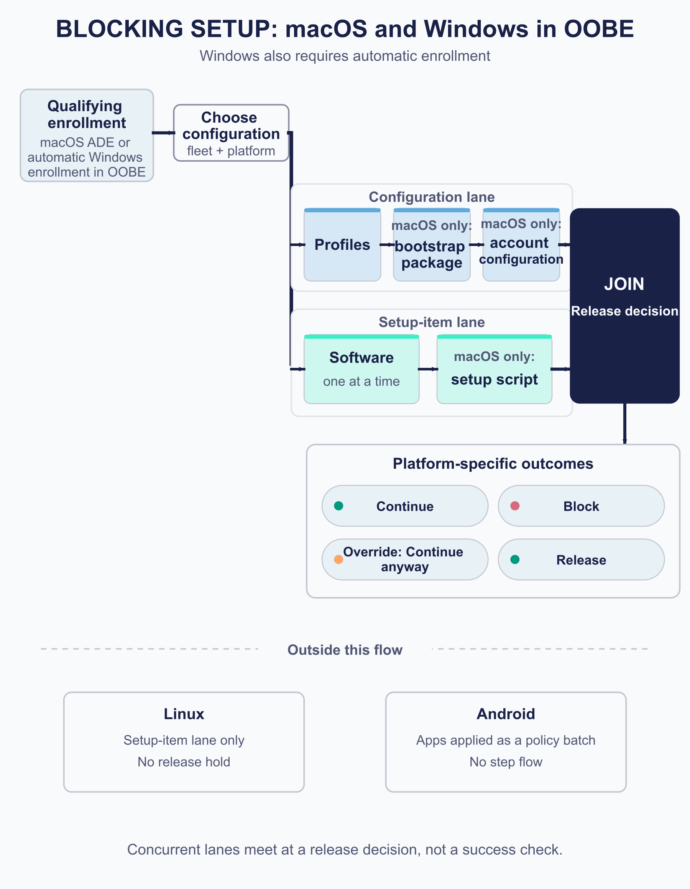
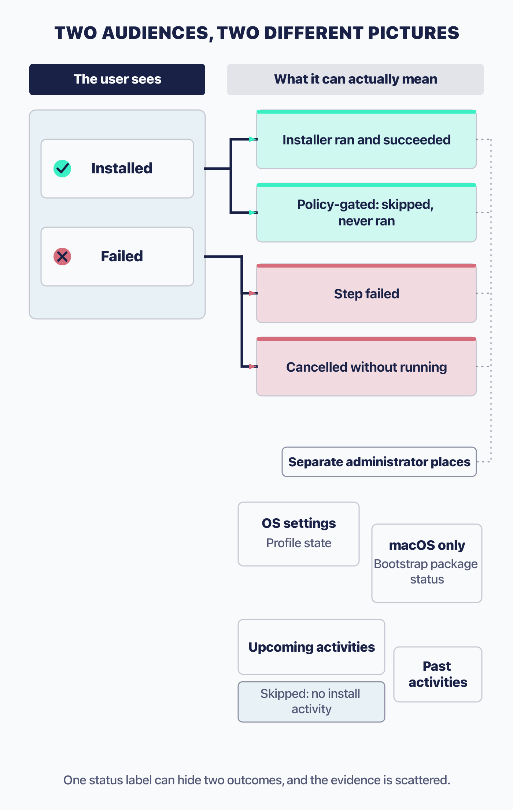

# Design setup and self-service experiences

 A good first day starts with a device that is ready for work. Fleet's **setup experience** helps you deliver essential software and configuration during or immediately after a qualifying enrollment. **Self-service** gives people a catalog of approved applications they can choose throughout the device's working life. Together, these features let you prepare a useful baseline and give employees more independence when their needs change.

Start with the enrollment path you plan to use. The platform determines what triggers setup, which components it supports, whether setup blocks first use, and what releases the device. macOS and Windows can hold a person at a progress screen; other paths apply work in the background or use the operating system's own setup flow. Self-service remains available without holding up the user.

Setup and self-service are Fleet Premium. The Fleet Desktop and My Device surface that self-service runs on ships on every edition, with individual features on the page gated separately; the section on that surface sets out which need Premium.

## Choose setup-time enforcement or ongoing self-service

 Use setup for the essentials a person needs before starting work, such as required security software or a core business application. Keep that list focused: on platforms that block first use, a failed setup item can delay someone's first login. Self-service is a good home for optional tools, where the user can request an installation when they need it and return to work while it runs.

**The blocking paths, macOS and Windows in OOBE, share one shape:**

1. An enrollment event triggers setup.
2. Fleet decides which configuration applies, by fleet and platform.
3. The end-user experience initialises, where the platform has one.
4. **Two lanes run at once**: the configuration lane (profiles, bootstrap package, account settings) and the setup-item lane (software, and on macOS a script).
5. The platform's coordinator joins the terminal states it cares about.
6. The device continues, blocks, offers an override, or is released.

Configuration work and setup items progress independently. Software installs run one at a time within the setup-item lane while profile delivery continues alongside them. The release decision brings the relevant results together later.

The remaining platforms use different flows. Linux runs agent-delivered setup items without holding the device. Android applies apps as a policy batch. iOS and iPadOS can block during ADE but show Apple's setup interface. The platform sections below explain the delivery and release rules for each path.

<!-- IMAGE-TODO: assets/5.5-two-lanes-and-the-join.webp
     PROMPT WRITTEN 2026-08-28 by the independent reviewer, against the chapter as
     corrected after its review round rather than as first drafted. Do not hand-edit;
     a hand-edited prompt is a new claim and needs checking like any other.
     PROMPT: DIAGRAM: A landscape 16:9 process diagram for a technical manual.
     Title the diagram exactly "BLOCKING SETUP: macOS and Windows in OOBE".
     Directly beneath the title, add the small qualifier "Windows also requires
     automatic enrollment". This scope is essential. Do not present the diagram as
     a universal setup model.

     Begin at the left with a rounded card labelled "Qualifying enrollment", with
     the smaller line "macOS ADE or automatic Windows enrollment in OOBE". Connect
     it to a smaller selector card labelled "Choose configuration", with the
     subtitle "fleet + platform". From that selector, split immediately into two
     parallel horizontal lanes that begin at the same x-position and run
     rightward at the same time.

     The upper lane is labelled "Configuration lane". It contains three cards:
     "Profiles", "macOS only: bootstrap package", and "macOS only: account
     configuration". Make the macOS-only qualifiers visually clear and subordinate.
     Do not imply that Windows has a bootstrap package or account-configuration
     step.

     The lower lane is labelled "Setup-item lane". Its first card reads "Software"
     with the smaller line "one at a time". A right-pointing connector then leads
     to "macOS only: setup script". Make the serial ordering inside this lane clear,
     while keeping the whole lane visibly concurrent with the configuration lane.
     Do not draw the setup-item lane as beginning after the configuration lane.

     Do not align the cards in the two lanes as synchronous stages. Stagger their
     positions and spacing so the lanes visibly progress independently and need
     not finish together. Give each lane its own continuous connector into one
     large solid join shape at centre-right. Label that shape with two lines:
     "JOIN" and "Release decision".

     Do not label the join "Success", "All successful", "Terminal", or "Completion".
     Do not place success checkmarks at the ends of the lanes. For macOS,
     release-ready configuration can include failed work. For Windows, unfinished
     profiles can hold the status page, but profile failure does not decide the
     failure outcome; software failure or timeout does. Do not collapse those two
     Windows questions into one success gate.

     From the join, draw one short heavy connector to a group headed
     "Platform-specific outcomes". Show exactly four separate compact outcome
     chips: "Continue", "Block", "Override: Continue anyway", and "Release".
     Do not imply that every platform offers every outcome. Use Fleet Green
     #009A7D for small marks on Continue and Release, #D66C7B rose for the small
     mark on Block, and #FAA669 apricot for the small mark on Override. Keep the
     chip bodies neutral or lightly tinted rather than fully saturated.

     Below the complete blocking flow, leave generous whitespace and add a dashed
     #C5C7D1 divider headed "Outside this flow". Place two small exception cards
     under it with no connector to the join. The first reads "Linux", with the
     smaller lines "Setup-item lane only" and "No release hold". The second reads
     "Android", with the smaller lines "Apps applied as a policy batch" and "No
     step flow". These cards must be visibly separate exceptions, not additional
     branches or later stages.

     Use a roughly 20 to 25 percent tint of #5CABDF for the configuration-lane
     cards and a roughly 20 to 25 percent tint of #3AEFC4 for the setup-item-lane
     cards. Use each colour consistently and at full strength only for small top
     rules or arrowheads. Keep the main flow connectors #192147, with the split
     and join heavier than secondary scaffolding. Make the solid #192147 join,
     with #F9FAFC text, the visual anchor.

     Use large crisp sans-serif typography, short wrapped lines, and generous
     gutters. Render only the listed title, qualifier, lane labels, card labels,
     outcome labels, exception labels, and caption. Add no platform icons, device
     screens, interface chrome, clocks, percentages, legends, or extra states.
     Caption: "Concurrent lanes meet at a release decision, not a success check."
     PALETTE. Two sets, doing different jobs.
     STRUCTURE, the Fleet Black ramp and neutrals: #192147 for the most important marks,
     #515774 for ordinary labels, #8B8FA2 and #C5C7D1 for secondary structure, #E2E4EA for
     grouping bands, #F9FAFC background, #D3E8F3 and #E8F1F6 for quiet fills. All text stays
     in this set; do not tint type.
     THE FLEET DOTS, the six accent colours taken from Fleet's own logo mark: #5CABDF sky
     blue, #3AEFC4 mint, #63C740 green, #C98DEF lavender, #FAA669 apricot, #D66C7B rose.
     Fleet Green #009A7D sits alongside them. These are soft and pastel, so they work as
     fills with #192147 text on top.
     STRENGTH. Use a dot colour at full strength only for small marks: an arrow, a chip, a
     single filled icon, a rule. Over any large area, use it at roughly a 20 to 25 percent
     tint, so a panel reads as tinted rather than painted. Five large panels at full
     saturation looks like a children's infographic, not a technical manual. And do not
     colour a panel that has no content in it; colour has to carry meaning, and an empty
     coloured box is just noise.
     HOW TO USE THE DOTS. One colour per category, used consistently within the image, to
     fill or stroke the things a reader genuinely has to tell apart. Take only as many as
     there are categories; do not spread all six across four items to look lively. If nothing
     in the picture needs distinguishing, use none of them and let the structure set carry it.
     GIVE IT WEIGHT. At least one element should be a solid filled shape rather than an
     outline, so the composition has an anchor. Vary stroke weight so the primary flow is
     visibly heavier than the scaffolding around it.
     Never invent a colour outside these two sets. Flat vector, generous whitespace, no
     gradients, no drop shadows, no 3D or photorealistic icons, no logo, no watermark.
     Legible at half page width.
     NOTE: "Fleet" here is a software product for managing computers. Never draw vehicles,
     cars, vans, trucks, ships or aircraft. Never use an em-dash in rendered text.
-->

### Setup capabilities by platform

| | macOS | Windows | Linux | iOS and iPadOS | Android |
|---|---|---|---|---|---|
| **Trigger** | **ADE, except MDM migration** | Enrollment | Agent enrollment | Enrollment, chiefly ADE | Enrollment |
| **Blocks first use** | Yes | **Only in OOBE** | No | Yes, on ADE | No |
| **End-user surface** | Fleet's setup dialog | Windows' own status page | A browser page | Setup Assistant only | None |
| **Profiles** | Yes | Yes | No | Yes | Policy |
| **Software** | Packages, store apps | Packages | Packages | Store apps only | Play apps |
| **Setup script** | **Yes** | No | No | No | No |
| **Overall timeout** | Depends, see below | **3 hours** | None | Worker-bounded | None |

**Only macOS has a setup script.** On Windows and Linux, a script-only package is ordinary setup software instead. The blocking row decides how much risk you are taking: a failure on macOS or an ADE iPhone happens in front of a waiting person, while a failure on Linux is a background inconvenience.

## Compose and govern the setup contract

### Prerequisites

Prepare the management channel for the platform first: Apple Business and Apple MDM for Apple ADE setup, Windows MDM for the Windows blocking experience, or Android Enterprise for Android ([2.10](../02-administer-and-deploy-fleet/2.10-apple-mdm-configuration.md), [2.11](../02-administer-and-deploy-fleet/2.11-configure-windows-management.md), [2.12](../02-administer-and-deploy-fleet/2.12-bind-android-enterprise.md)). Linux setup uses the agent. Agent-delivered software needs fleetd with scripts enabled. Desktop self-service needs Fleet Desktop; iOS and iPadOS use an administrator-deployed web clip, and Android uses managed Google Play.

### Target setup software by fleet and platform

Select setup software **per fleet and per platform**. Think of that selection as the baseline for newly enrolling devices in the fleet; ordinary package labels do not narrow its audience.

> **Labels do not filter setup software.** A package's label scope governs ordinary installation. It does **not** narrow what setup installs, on any platform, and the same is true of App Store and Play apps. An item you select for setup goes to **every** otherwise-eligible device enrolling into that fleet.

Use separate fleets when groups of new devices need different setup software. This makes the enrollment destination part of your setup design.

Two related points, so the rule does not get over-applied:

- **Linux distribution compatibility still filters.** A `.deb` does not go to an RPM host.
- **Policy labels are honoured.** The Windows and Linux policy gate described below resolves each policy's platform and label scope. This can determine whether a setup item is needed, even though labels on the software package itself do not filter setup delivery.

When a title has several packages selected for setup, Fleet ignores the variants and takes the **first-added** one ([5.4](5.4-manage-software-and-applications.md)).

### End-user authentication

Setup can ask people to authenticate with your identity provider before continuing. Configure this separately from administrator SSO, using its own callback ([2.5](../02-administer-and-deploy-fleet/2.5-identity-providers-sso-scim-and-role-sync.md)). A separate IdP application is recommended, though not required: it lets you change administrator sign-in settings without affecting device enrollment.

Enable it per fleet. What comes back is an identity Fleet attaches to the host, which is what makes a device's owner known from the moment it is set up rather than from whenever someone gets round to recording it.

> **On Windows and Linux, authentication fails open in three situations**: the agent's capability header cannot be read, the agent is older than 1.50.0, or the host is re-enrolling and Fleet still has a record of it. Each is permitted, and enrollment proceeds without any failure appearing in the interface: only the server logs distinguish a bypass from an authentication. **Do not treat setup authentication as a guarantee that every enrolled device has an authenticated owner.** An estate with older agents has holes in it you will not find by looking at Fleet's screens.

The end-user licence agreement is shown only during macOS ADE with end-user authentication enabled. Fleet advances the page when the user accepts, but stores no acceptance event or server-side record. Use it to present information during setup; a requirement to retain evidence of acceptance needs a separate recording process.

### Failure and escape, decided before rollout

 Before rollout, agree on the essential setup items, the response to a failed installation, and the recovery steps your support staff will use. These decisions are easier to test before someone is waiting for a new device.

**Which items are mandatory.** Keep the list short, and test each dependency outside the setup flow before making it part of a user's first login.

**What happens when software fails.** Where supported, stopping setup on a failed installation cancels Fleet's records for all remaining setup work, including the macOS setup script. It does not reverse completed changes or stop a script already running on the device.

**How you get a stuck device out.** The answer differs per platform and is covered in each section below. Have it written down before you need it.

## Build the macOS setup experience

<!-- SCREENSHOT: SS-5.5-02 | macOS setup progress
     PURPOSE: Help support staff recognize the screen an employee sees while a new Mac is prepared.
     PREPARE: Enroll a disposable ADE Mac into a test fleet with two small, tested setup apps and, if used, a harmless final script.
     CAPTURE: Capture the actual Fleet setup progress screen while one item is complete and another is underway, if that state occurs. Preserve the real item names and statuses.
     FRAME: Crop to the full setup panel, including its title, progress, and any available action. Record macOS and fleetd versions with the capture.
     EDITION: 4.91; reuse for 4.90 only when the visible controls and wording match
     PRIVACY: Use demo names and non-sensitive data; exclude tokens, passwords, keys, and personal identifiers.
     FILENAME: ss-5.5-02.png
-->

 macOS offers the broadest setup experience: accounts, configuration, software, and a final script can prepare an ADE device before the user starts work. Plan recovery carefully for this path, because a capable agent coordinating setup has no overall timeout.

Once an ADE device enrolls, Fleet queues the work: the enrollment profile and configuration profiles, fleetd, the bootstrap package, and account configuration. These are delivered asynchronously rather than in a fixed order. Alongside them the setup-item lane works through software, one at a time, in **alphabetical order by display name, fixed when the work is queued**, and then runs the setup script.

**Only macOS orders software this way**, and only macOS has that script. Note the trigger too: setup runs on ADE enrollment, and MDM migration does not start it.

### Release, which has two paths

 A Mac is released by a `DeviceConfigured` command, and which machinery sends it depends on the machine:

| Situation | Release path | Timeout |
|---|---|---|
| No setup items at all | The worker | **15 minutes**, 10 to 30 attempts |
| Setup items, current capable agent | The agent's status poll | **None** |
| Setup items, older or incapable agent | The worker | 15 minutes |

A Mac with setup software and a capable coordinating agent can wait indefinitely for work to reach a terminal state. There is no ordinary administrator control to force release in that path. A Mac without setup items uses the fifteen-minute release cutoff described in the table. Include this difference when testing your setup and recovery procedure.

Manual release disables both automatic release paths. Use it when your deployment process will take responsibility for releasing the device.

### Check configuration results after release

 The release check determines when the Mac can leave setup. Some unsuccessful configuration results count as ready to release, so review the individual results as part of your validation.

A failed bootstrap package, an errored account configuration, and a **Failed** profile all count as ready to release. A profile in **Verifying** also qualifies: Fleet has acknowledged it but has not independently confirmed the result, and its status can change later ([5.2](5.2-manage-configuration-profiles-and-declarative-settings.md)).

The user can therefore reach the desktop with a failed profile even when the setup screen showed no profile failure. Check the host's OS settings for the profile's own status; the user-facing progress screen does not provide that detail.

For Platform SSO, verify the supporting profiles and extension app before treating release as success. Platform SSO has no setup-item status of its own. Fleet delivers its configuration profile, sometimes installs the extension app as setup software, and waits for those prerequisites to become release-ready. Apple presents the sign-on pane after release. A failed certificate profile or extension app in a Simplified Platform SSO deployment can leave the user at that pane. Review the ordinary profile and software-delivery results before wiping the device; [8.8](../08-troubleshooting/8.8-apple-mdm-diagnostics.md#887-profile-status-values) explains Apple profile status values.

The Setup Assistant sign-on pane needs macOS 26 or later. The inspected upload and assignment paths contain no Fleet-side version check, so an older fleet receives the profile without ever seeing the pane.

### Accounts

Fleet can create the user's local account with the full name, username, and account type you choose. The three account-type options support different approaches to local administrator access:

| Choice | Meaning |
|---|---|
| `admin` | The user's account is a local administrator |
| `standard` | The user's account is not an administrator |
| `none` | **No end-user account is created at all** |

**Both `standard` and `none` require the managed local administrator account**, because otherwise the Mac would have no administrator on it. Fleet enforces that: if the account type needs the managed account and it is not enabled, the configuration is rejected.

The managed local administrator account is Fleet's macOS-only answer to Windows LAPS: a local admin account, username `_fleetadmin`, whose password Fleet holds, rotates and audits, so a Mac keeps an administrator even when the end user has none. Enable it with the setup-experience setting `enable_managed_local_account` (renamed to `enable_create_local_admin_account`, with the old key still accepted), which is off by default. Creating, enabling and disabling the account are Premium, and Fleet records each as an activity. It exists only on macOS at this release, so do not plan on it for Windows or Linux hosts.

> End-user authentication locks the name fields by default. You can override that setting if people should be able to edit their names during setup; otherwise, explain that the values come from their authenticated identity.

For macOS setup software or a setup script, use the setup flow's fleetd installation. Installing fleetd manually conflicts with those features.

### Provision and sync the local account with Platform SSO

Fleet can use Apple's Platform SSO Password mode to create the local macOS account a person uses to sign in and unlock the screen, then keep its password in sync with your identity provider. This helps people use a familiar work identity on their Mac. Configure it under **Settings > Integrations > Account provisioning**; Fleet's settings search recognizes `fpsso`. Administrator access to the Fleet console uses the separate SSO and JIT provisioning settings covered in [2.5](../02-administer-and-deploy-fleet/2.5-identity-providers-sso-scim-and-role-sync.md).

Account provisioning and password sync require Fleet Premium and macOS 26 or later. Apple's Platform SSO framework predates that requirement, and older code paths in Fleet's extension support macOS 14, but Fleet's password-sync implementation targets macOS 26. Setting any of the feature's configuration fields without a Premium licence is rejected.

**Three fields describe the upstream OAuth application:**

| Field | What it holds |
|---|---|
| Token URL | The identity provider's OAuth token endpoint, one that supports the Resource Owner Password Grant (ROPG), for example `https://your-okta-domain.okta.com/oauth2/v1/token` |
| Client ID | The application's client ID, registered with the identity provider |
| Client secret | The application's client secret |

Supply all three fields together, or leave all three empty to disable the configuration. Before configuring them, set [Fleet's server private key](../01-foundations/1.6-the-fleet-server.md), which encrypts the client secret in storage. Fleet stores the token URL and client ID openly and masks the secret when returning configuration. Changing the token URL requires you to supply the secret again, even when its value is unchanged, so a stored credential cannot silently be sent to a new endpoint.

Configure it through the **Account provisioning** UI page, the REST API's `mdm.apple_account_provisioning` configuration keys, or GitOps's `apple_account_provisioning` key. In GitOps, that key lives in your default, all-fleets file: it cannot be scoped to one fleet, matching the fact that it is macOS-only rather than fleet-specific. **GitOps applies your file as the whole configuration on every run, not as a diff**, so the secret has to be present in the section on every apply; a secret already stored from a previous run does not satisfy that requirement, and leaving the section out of the file entirely clears the configuration and deletes the stored secret rather than leaving it untouched.

Register a device by delivering one configuration profile: the same `com.apple.extensiblesso` profile and registration token [5.2](5.2-manage-configuration-profiles-and-declarative-settings.md#variables-and-secrets) introduces as the value designed never to be stored. The profile has to be Fleet's own. Its `ExtensionIdentifier` starts `com.fleetdm`, naming the Platform SSO extension bundled inside Fleet Desktop rather than a third-party IdP extension such as Okta Verify or Company Portal, and its `PlatformSSO` dictionary sets `UseSharedDeviceKeys` to `true`. Fleet rejects the registration-token variable anywhere else in a profile, so it cannot leak into a payload that isn't this one. The profile's `ExtensionData.BaseURL` has to be an HTTPS URL for your Fleet server, and every endpoint that URL implies needs a publicly trusted TLS certificate, including the `apple-app-site-association` document Apple fetches to associate the extension with that domain. Apple silently rejects a self-signed certificate, so check that first when a registration never happens.

Deliver the profile the way you deliver any other. Once it lands, the Mac's Platform SSO extension generates a signing and an encryption key pair in the Secure Enclave and registers the public halves with Fleet, authenticated by that registration token rather than by anything the device merely claims about itself. Registering again after a key rotation adds new keys without invalidating the old ones. During the same setup, Fleet also issues and certifies a key pair for the device to hold, so the two sides can derive a shared secret the Mac keeps locally. That shared secret is Apple's mechanism for letting the account unlock without Fleet or the identity provider needing to be reachable at that exact moment.

Whether the Mac is released to its user before or after these prerequisites finish is a setup-timing question, and it is covered where setup release is covered: [Check configuration results after release](#check-configuration-results-after-release) above.

**macOS does not check in with Fleet at every sign-in or unlock.** It validates the local password against the identity provider only when its existing token is missing, expired, or more than four hours old, at whichever login or unlock comes next. Logging out and back in inside that window does not force a check. So a password changed at the identity provider can lag on the Mac by up to that four-hour window plus however long the screen stays locked, and what catches it up is someone entering the new password, not the passage of time.

When the check does run, the extension encrypts the password to Fleet's own published encryption key before it leaves the device, so the network path never carries it in the clear. Fleet decrypts it and relays the plaintext to your identity provider using the OAuth ROPG grant, with username and password posted as form fields. That grant is a lower bar than an interactive sign-in, and your identity provider may restrict or refuse it. Okta requires Resource Owner Password to be explicitly enabled on the application. Entra rejects it outright for users subject to MFA or federated through AD FS, and for those users the feature cannot authenticate them at all.

Your users' local-account passwords pass through Fleet on their way to the identity provider, and Fleet does not keep them. Each password is used once, for that one validation request, and then discarded.

After accepting a password, the identity provider returns an OIDC `id_token` directly to Fleet over TLS. Fleet requires a `sub` claim, but does not verify the token's signature, issuer, audience, expiry, or other registered claims. This makes the configured token endpoint a trust boundary: Fleet accepts the identity values it supplies. Email, name, and preferred username can be empty even after successful password validation.

Configure the local account's short-name and full-name mappings in the profile's `TokenToUserMapping`. For example, map Apple's `AccountName` key to the claim your IdP uses for the person's username. Fleet forwards standard identity claims unchanged, along with custom claims whose names start with `account`, such as `accountName`.

Fleet sets the issuer, audience, nonce, timestamps, and expiry on the token it signs for the device, overriding any conflicting upstream values. Those protocol fields do not independently validate the person's identity: the subject and other identity claims still come from the configured IdP endpoint. A compromised endpoint could supply a different identity.

Your identity provider also controls the response to a rejected password. Fleet relays that response and adds no separate lockout, retry limit, or cooldown, so configure those protections at the IdP. For a broken Platform SSO registration, follow the re-enrollment guidance under [Recovery](#recovery), including revoking both Okta registrations when that guidance applies.

### Retrieve and rotate the managed local administrator password

 The password is a privileged credential with its own reveal-and-rotate lifecycle, closer to Recovery Lock and the disk-encryption key in [5.8](5.8-enforce-disk-encryption-and-manage-recovery-credentials.md) than to anything else in setup.

**Who can read it:** anyone who can read the host, the same permission that reveals a disk-encryption key. Reading is per host and macOS-only, and it works only once the account exists and its password is available, which is not immediate on a freshly enrolled Mac. **Fleet records each read as an activity**, so a reveal leaves a trace with a name on it.

On macOS, the first eligible password reveal schedules an automatic rotation about 65 minutes later. Further reads during that window keep the same deadline. Recovery Lock behaves differently: each reveal resets its rotation clock. A background job checks for due managed-account rotations every few minutes and sends the Mac a command to change the password. Completion depends on the device receiving and processing that command.

**Forcing a rotation is a separate, more restricted action.** Anyone who can read the host can reveal the password, but forcing a rotation needs the narrower permission to send MDM commands, which administrators and maintainers hold and observers do not. A forced rotation is refused while another rotation is already in flight for that host. Fleet records both a rotation and any failure to rotate as activities, attributing an automatic rotation to itself.

Enabling and disabling the account both log an activity, and disabling uses the same setup-experience setting that turned it on. Because the reveal-and-rotate mechanics mirror the disk-encryption key, the handle-it-as-a-secret guidance and the reveal path in [5.8](5.8-enforce-disk-encryption-and-manage-recovery-credentials.md#reveal-validate-and-repair-disk-recovery-credentials-safely) apply to this credential too.

## Hold and release Windows at the Enrollment Status Page

<!-- SCREENSHOT: SS-5.5-03 | Windows Enrollment Status Page
     PURPOSE: Identify the blocking OOBE experience before troubleshooting its hold or failure.
     PREPARE: Use a disposable Windows device or VM undergoing automatic enrollment during OOBE with a tested setup application.
     CAPTURE: Capture the genuine Windows Enrollment Status Page while setup is running. An optional second capture may show a controlled failure and its actual Reset or Continue anyway choices; record the stop-on-failure setting used.
     FRAME: Show the Windows panel at readable size. Keep separate states as separate images; do not reset or enroll a Dogfood device just for the screenshot.
     EDITION: 4.91; reuse for 4.90 only when the visible controls and wording match
     PRIVACY: Use demo names and non-sensitive data; exclude tokens, passwords, keys, and personal identifiers.
     FILENAME: ss-5.5-03.png
-->

 Windows can prepare a device before its first desktop session or install setup software in the background on an already usable device. The enrollment path determines which experience the user sees, even though you configure both from the same settings page.

**The Enrollment Status Page runs only when two things are true**: enrollment is automatic, and the device is in the out-of-box experience. Automatic enrollment includes a user enrolling through Settings later, so **it is being in OOBE that decides**, not the enrollment type.

**When those conditions are not both met, Windows takes the same path Linux does**: a background, non-blocking browser experience with no status page and no hold.

> Windows stop-on-failure applies only to the blocking OOBE path. Devices enrolled later, including through Settings, ignore it even when the option appears enabled in Fleet. Test with the enrollment path your users will actually follow.

For devices already in use, plan follow-up verification of the background work rather than relying on setup to prevent access.

### The three-hour timeout is Fleet's

Fleet holds the status page for **three hours**, then gives up and cancels the remaining work. It sends that value to Windows as well, so both clocks agree, but the choice is Fleet's: Windows accepts anything from one hour to twenty-four. **It is not configurable**, and the two clocks start from slightly different moments, so treat three hours as approximate rather than exact.

Fleet requests a timeout below Microsoft's documented minimum to bring up the failure page promptly. That behavior works on the Windows builds Fleet has tested. If a later build ignores the request, the failure page could be delayed by about an hour; consider that compatibility issue when investigating such a delay.

### What holds the page, and what decides the outcome

Windows waits for unfinished work before releasing the page. The criteria for showing a failure screen are more specific:

**What holds the page:** work that has not finished. Pending profiles and in-flight software both keep the status page waiting.

**What decides how it ends:** a software failure, or the timeout. Profile *failure* does not produce the failure screen, because a failed profile is release-ready in the same way it is on macOS: Windows waits until a profile is verified or failed, then stops caring about it.

The failure outcome then depends on your stop-on-failure setting:

| Setting | What the user gets |
|---|---|
| **Enabled** | Remaining setup work is cancelled, and the failure page offers **reset only** |
| **Disabled** | Fleet waits for the other work to finish, then shows a **continuable** failure page offering reset or **Continue anyway** |

Collect logs is available either way. Neither reset nor log collection is a Fleet operation, and a reset means the device enrolls again from the beginning.

There is **no setup script on Windows.** A script-only package is setup software like any other.

## Run the Linux setup flow

 Linux setup uses fleetd to install the selected software in the background. It gives employees visibility into progress while leaving the device available for use.

The user can follow progress in a browser page. Closing that page leaves the work running, and the person can continue using the device during installation. There is no overall timeout because setup does not hold the device.

Setup software must be compatible with the distribution: `.deb` to Debian-based hosts, `.rpm` to RHEL-based hosts, and `.tar.gz`, `.sh` and `.py` anywhere. **This filtering does apply even though label scoping does not.**

### The policy gate

 Windows and Linux share one capability macOS does not have: a setup software item can be gated on policies, so Fleet installs it only if the device needs it.

Fleet waits until it has fresh label membership for this enrollment, works out which of the item's policies actually apply to this host by platform and label, and then decides:

| State of the applicable policies | What Fleet does |
|---|---|
| None applies to this host | **Install** |
| Any one of them is failing | **Install**, immediately, without waiting for the others |
| All of them are passing | **Skip**, and record the item as successful |
| None failing, but some results missing | **Wait**, then install anyway |

On that last row, Fleet waits up to **30 minutes**, measured from when the host enrolled rather than from when Fleet first looked at the item, and then **fails open and installs**. A result counts as missing if Fleet has no definitive answer recorded since this enrollment.

The thirty-minute window is measured from enrollment, but Fleet evaluates it only after label membership is fresh. If that freshness never arrives, the item has no independent timeout that releases it; Fleet expects the first check-in to supply the membership. A database error also does not count as a missing result and does not trigger fail-open installation.

**A skipped item is recorded as successful.** There is no separate skipped state, which matters when you read the results.

## Finish iOS and iPadOS setup

 On iOS and iPadOS, setup prepares the device with configuration profiles and App Store apps through Apple's management channel.

Setup here can deliver configuration profiles and **App Store apps only**. No packages, no scripts, no Fleet dialog, and no agent, so there is nothing polling on the device's behalf. The user sees Apple's Setup Assistant and nothing of Fleet's.

The distinction that matters is the enrollment path. **On ADE, setup blocks**: the device waits before the user reaches the home screen, and release is bounded by the worker's fifteen-minute cutoff, **unless you have turned manual Apple release on**, which suppresses the automatic release entirely. **On manual or account-driven enrollment the same work happens in the background** afterwards, holding nothing.

App installs consume App and Book licences and are verified by asking the device what it holds ([5.4](5.4-manage-software-and-applications.md)). A licence shortage during setup fails the item rather than blocking indefinitely.

## Provision Android during enrollment

 Android setup lets you have essential apps installed during enrollment by including them in the device's policy. This gives administrators a delivery option beyond the ordinary managed Google Play catalog described in [5.4](5.4-manage-software-and-applications.md).

Ordinarily Fleet does not install an Android app: it makes the app available in managed Google Play for the user to install. **Setup is the one path that pushes.** An app selected for setup is marked for installation in the device's policy, and the device installs it as it applies that policy.

There is no Fleet setup interface on Android, no progress list, and **no ordering guarantee**. Work is expressed as policy and applied as a batch. Fleet learns the outcome when the device reports the application's state, and this is the only Android path where an install is recorded and verified at all.

Both company-owned and personal work-profile enrollments can carry setup apps. Nothing here blocks the user.

## Publish and operate self-service

 Self-service gives people a convenient way to install approved tools when they need them. You choose the available applications and their audience; the user chooses when to install, without a setup hold or a support request for each application.

### Choose who can use self-service software

An item appears in self-service when it is marked self-service **and** the host is in its label scope. Those two together are the entitlement model, and it is the model setup does not use ([5.4](5.4-manage-software-and-applications.md) owns the flag itself).

Use categories to make a larger catalog easier to browse. Fleet provides seven categories, organized separately in each fleet, so each group can present software in a useful way. Categories affect navigation only; moving an item leaves its installation entitlement and targeting unchanged.

**Outside the setup experience, ordinary Android catalog apps are always offered** through managed Google Play for the user to install, rather than pushed. Setup is the one exception, and it pushes.

> Publishing and label scope govern self-service installation entitlement. They should not be treated as a general authorization boundary for every device-authenticated management action.

Who can do what splits the way it does elsewhere: administrators, maintainers and GitOps can publish and shape the catalog; administrators, maintainers and technicians can act on a host. GitOps can define the catalog and cannot use the device actions ([5.7](5.7-control-devices-and-send-mdm-commands.md)); a technician is the reverse ([2.6](../02-administer-and-deploy-fleet/2.6-user-accounts-roles-and-service-identities.md)).

### Where people find it

<!-- SCREENSHOT: SS-5.5-04 | The employee self-service catalog
     PURPOSE: Show how employees browse and request approved software.
     PREPARE: Publish several harmless test applications to a demo fleet, assign categories and self-service entitlement, and open the entitled host's My Device page.
     CAPTURE: Open Self-service. Show category navigation, several app entries, and their real Install or installed-state controls. Include Uninstall only for an installer-backed title where Fleet actually offers it.
     FRAME: Crop the catalog and navigation together. Exclude the device-token URL; avoid an oversized full-screen image with tiny app labels.
     EDITION: 4.91; reuse for 4.90 only when the visible controls and wording match
     PRIVACY: Use demo names and non-sensitive data; exclude tokens, passwords, keys, and personal identifiers.
     FILENAME: ss-5.5-04.png
-->

| Platform | Surface |
|---|---|
| macOS, Windows, Linux | Fleet Desktop, the My device page |
| iOS and iPadOS | A web clip pointing at the device's self-service page |
| Android | Managed Google Play |

Deploy a managed web clip to give iOS and iPadOS users a route to self-service. Its URL is `https://{YOUR_SERVER_URL}/device/$FLEET_VAR_HOST_UUID/self-service`; Fleet substitutes the host UUID when delivering the profile ([5.2](5.2-manage-configuration-profiles-and-declarative-settings.md)). These platforms use that UUID-bearing route and refuse an ordinary desktop device-token address. The My Device section below explains authentication on this path.

Adapt the ready-made self-service web-clip profile in Fleet's iOS and iPadOS solution documentation, then deliver it with the intended host scope. Fleet does not create the clip automatically. Confirm that its icon appears on the home screen and opens the catalog before announcing self-service to users.

### User actions and installation results

Users can install individual titles or choose **Install all**. Fleet queues titles independently in name order, so some requests may be accepted while others are not. The overall response reports acceptance even when nothing was queued. In that case, Fleet writes no activity and the attempt is visible only in server logs. If a user reports that nothing happened, check the individual requests and those logs.

**Uninstall availability differs by source.** Installer-backed titles can be uninstalled. App Store and in-house apps have no per-host uninstall action.

The install status and output a user sees is the same output an administrator sees, unredacted. That is the reason for the warning in [5.4](5.4-manage-software-and-applications.md) about what install scripts print.

## The Fleet Desktop and My Device surface

 My Device gives employees a view of their device information, setup progress, and available self-service software without needing a Fleet account. On desktops, they open it from Fleet Desktop's menu-bar or tray item. Knowing what this page shows helps support staff explain device management and guide users through common tasks.

Fleet Desktop is the optional fleetd component that gives the end user the menu-bar item and the My Device page. [1.2](../01-foundations/1.2-how-fleet-reaches-a-device.md#the-five-channels) places it among Fleet's channels; it is packaged with `--fleet-desktop`, described per platform in [3.2](../03-connect-devices/3.2-enroll-macos-devices.md#build-a-fleetd-package), [3.3](../03-connect-devices/3.3-enroll-windows-devices.md#installing-fleetd) and [3.4](../03-connect-devices/3.4-enroll-linux-devices.md#choose-an-enrollment-approach).

<!-- SCREENSHOT: SS-5.5-01 | My Device and the transparency link
     PURPOSE: Show the employee view and the route to information about device management.
     PREPARE: Use a demo desktop host with Fleet Desktop installed. Open My Device from its menu-bar or tray item.
     CAPTURE: Capture the device summary with the page navigation visible. As a small second frame, capture the Fleet Desktop menu with About Fleet visible. Include a recovery-key availability banner only if naturally present; it must contain no key.
     FRAME: Two separate crops: the readable My Device content and the actual menu. Exclude browser chrome and the complete device-token URL.
     EDITION: 4.91; reuse for 4.90 only when the visible controls and wording match
     PRIVACY: Use demo names and non-sensitive data; exclude tokens, passwords, keys, and personal identifiers.
     FILENAME: ss-5.5-01.png
-->

### How a person reaches it without a Fleet account

The My Device page authenticates with a per-host device token carried in the URL, not a Fleet login. The token identifies one host, and it is what lets someone open their own device page while holding no Fleet account and no role. This is the device-authenticated surface [1.2](../01-foundations/1.2-how-fleet-reaches-a-device.md#the-five-channels) sets apart from Fleet's management channels, and [a.8](../09-appendices/a.8-api-action-and-endpoint-reference.md#who-calls-fleet-and-what-they-present) catalogues its endpoints as the Device auth class.

**The token has a one-hour freshness window, measured from the last time it changed.** Fleet accepts the current token, or the one immediately before it, only while the stored token was written within the last hour. A genuine token change resets that window; an agent check-in does not, and re-submitting the same token does not either, because presenting the existing value again does not refresh its timestamp. Keeping the one previous token valid makes rotation graceful, so a link does not break the instant the token turns over. If a host goes quiet long enough that no fresh token is written, its My Device link stops authenticating until a new token is written, whether by the agent's next rotation or by one of the server-side paths below.

**Three things can write that token.**

- **Orbit** normally provisions and rotates it on the host, whether or not Fleet Desktop was included in the package. This is the ordinary path.
- **A global administrator requesting the host's My Device URL** makes Fleet reuse a still-fresh token or mint a new one and store it the way Orbit does, which is what hands the administrator a working link. That request is restricted to global administrators, more tightly than the host-read permission that reveals most host detail, and Fleet audits it as a distinct my-device-URL retrieval activity.
- **Conditional-access remediation** mints and stores a token when a host with failing policies is sent through remediation and its existing token is missing or expired, so the remediation redirect resolves to a working device page.

Treat a My Device URL as a credential for that host, because for its freshness window it is one.

iOS and iPadOS do not use the device token, because those platforms carry no fleetd to hold one. When the device presents a client certificate Fleet authenticates on that, and the certificate takes precedence; where none is presented, Fleet falls back to the UUID-bearing self-service URL, so the host identifier in that address identifies the device rather than standing in as a second, separate credential.

### Explain management through the transparency link

**The menu bar's About Fleet link points at a transparency page, chosen by a fixed precedence.** By default it is Fleet's own transparency page. A deployment with Fleet's Secureframe partnership configured gets that partner destination instead. On Premium, a custom transparency URL you set takes precedence over both, so you can point users at your own account of what device management can and cannot see. The custom URL is the Premium step; the default and the partner destination are not something you choose.

**The end user sees summaries and banners, never key values.** Disk encryption is the sharp example: My Device can tell a user that a recovery key is available for their device, as a banner, but the decrypted key is never returned to the device-authenticated page. Reading the actual value is an operator action on the user-authenticated host endpoint, covered in [5.8](5.8-enforce-disk-encryption-and-manage-recovery-credentials.md#reveal-validate-and-repair-disk-recovery-credentials-safely). The same shape holds across the page: the user gets enough to see state and to act, not the underlying secrets.

### The feature family is gated member by member

 Fleet Desktop and the basic My Device page are available on every edition. Individual features, including self-service, have their own licence requirements:

| Feature | Edition |
|---|---|
| Fleet Desktop packaging (`--fleet-desktop`) and the menu-bar item | Every edition |
| Opening the My Device page | Every edition |
| The Fleet Desktop summary the menu-bar item reads | Premium |
| Self-service install and uninstall | Premium |
| Custom transparency URL | Premium |
| Conditional-access bypass from My Device | Premium |
| User-initiated Linux LUKS escrow from My Device | Premium |

Fleet's own Fleet Desktop client is not part of this manual's source, so this describes the server's contract rather than the client's behaviour: the server designates one endpoint, `/desktop`, as the summary the menu-bar item is meant to read. Whether that summary returns, and what it carries, is where the Premium line falls for the menu-bar item. Self-service composition and entitlement are covered above in this chapter; the Linux LUKS escrow the page can trigger is a device-initiated action covered with disk encryption in [5.8](5.8-enforce-disk-encryption-and-manage-recovery-credentials.md).

## Read status, verify outcomes, and recover

### Two audiences, two different pictures

The user's setup screen provides progress and a route forward. For administration and troubleshooting, compare it with the underlying delivery results:

| The user sees | What it can actually mean |
|---|---|
| **Installed** | The requirement reached terminal success. **It does not prove Fleet ran an installer**: a policy-gated item that was skipped shows as installed |
| **Failed** | The step failed, **or** it was cancelled without ever running |

To tell those apart, use the activity record. A skipped item has no install activity at all. A cancelled item produces a cancellation activity, and when a failure stopped setup there is a separate activity saying so.

To review setup as an administrator, combine the host's OS settings, macOS bootstrap-package status, upcoming activities, and past activities. Fleet provides no administrator checklist that mirrors the user's progress screen. Pay particular attention to profile status, which can show a failure that did not prevent the device from leaving setup.

### Verify before you roll out

 Test each enrollment path your organization supports. Windows in OOBE and Windows enrolled through Settings have different blocking behavior, as do ADE and manual enrollment on Apple devices. Testing those paths separately helps you predict what people will experience.

For each path, confirm: the user was asked to authenticate if you required it, the account was created as intended, profiles are in the state you expect rather than merely done with delivery, the software you selected actually arrived, the script ran on macOS, and the device released.

On a disposable test device, introduce a controlled failure and follow the recovery procedure. Confirm what the user sees, whether the device releases, and where support staff can find the failure details.

For self-service, test with an entitled device and an excluded one, and confirm the excluded device cannot see the item.

### Recovery

Start recovery by repairing or removing the blocking item. If re-enrollment is needed, account for its effect on previous results and authentication:

- **A fresh setup enqueue deletes the previous results and rebuilds the contract.** Re-enrolling does **not** preserve steps that already succeeded. Only the explicit retry-failed-steps operation does that.
- **On Windows and Linux, a host Fleet already knows about can re-enroll without end-user authentication.** If you are wiping a device specifically to enforce authentication again, delete it from Fleet first, or it will skip the step you wiped it for.
- **Apple re-enrollment cancels queued work and clears Fleet's Platform SSO registration** so fresh device keys are issued. Whether past activities stay attached to the host depends on your settings. For **Okta** Simplified Platform SSO specifically, Fleet's guidance is to revoke both the host's and the user's Okta Verify registrations before re-enrolling. Other identity providers will have their own equivalent, and it is worth finding out what it is before you need it.

<!-- IMAGE-TODO: assets/5.5-what-the-user-sees-vs-you.webp
     PROMPT WRITTEN 2026-08-28 by the independent reviewer, against the chapter as
     corrected after its review round rather than as first drafted. Do not hand-edit;
     a hand-edited prompt is a new claim and needs checking like any other.
     PROMPT: DIAGRAM: A landscape 16:9 two-column comparison diagram for a
     technical manual. Title it exactly "TWO AUDIENCES, TWO DIFFERENT PICTURES".
     The diagram compares an end-user summary with the separate evidence available
     to an administrator. It is not a screenshot and must not reproduce Fleet,
     Windows, or macOS interface chrome.

     The left column is headed "The user sees". Make this heading a solid #192147
     filled shape with #F9FAFC text so it anchors the composition. Beneath it, show
     a simplified setup-progress surface containing exactly two large status rows:
     "Installed" and "Failed". Give Installed a small #3AEFC4 success mark and
     Failed a small #D66C7B failure mark. Keep the row bodies quiet and lightly
     tinted. Do not show package names, percentages, timestamps, buttons, or a
     complete setup checklist.

     The right column is headed "What it can actually mean". From "Installed", draw
     one connector that forks cleanly to two separate meaning cards:
     "Installer ran and succeeded" and "Policy-gated: skipped, never ran". From
     "Failed", draw a second connector that forks to two separate meaning cards:
     "Step failed" and "Cancelled without running". Keep all four cards equal in
     size and emphasis. The point is ambiguity, so do not draw one branch as the
     normal or preferred interpretation.

     Use a roughly 20 to 25 percent tint of #3AEFC4 for both Installed meaning
     cards, and a roughly 20 to 25 percent tint of #D66C7B for both Failed meaning
     cards. Use the accent colours at full strength only for the small status marks,
     top rules, and arrowheads. Keep the main fork connectors #192147.

     Within the lower half of the right column, add the small heading "Separate
     administrator places". Beneath it, place four detached cards with visibly
     different offsets and generous gaps: "OS settings" with the smaller line
     "Profile state"; "macOS only" with the smaller line "Bootstrap package status";
     "Upcoming activities"; and "Past activities". Add a small subordinate note
     beside Past activities reading "Skipped: no install activity". Use thin
     #8B8FA2 dotted connectors from the four meaning cards toward this scattered
     evidence area, without claiming a one-to-one mapping between a meaning and a
     single screen.

     Do not enclose the four administrator-place cards in one panel, table, window,
     or checklist. Do not align them as rows of one interface. Do not add an
     "Administrator setup status" heading, a consolidated result, checkboxes, or
     an administrator setup checklist. The right side must look deliberately
     partial and distributed across several places.

     Use large crisp sans-serif typography, short wrapped lines, and generous
     gutters. Render only the listed title, column headings, status labels, meaning
     labels, administrator-place labels, note, and caption. Add no device mockups,
     people, logos, platform mascots, decorative illustrations, or extra statuses.
     Caption: "One status label can hide two outcomes, and the evidence is scattered."
     PALETTE. Two sets, doing different jobs.
     STRUCTURE, the Fleet Black ramp and neutrals: #192147 for the most important marks,
     #515774 for ordinary labels, #8B8FA2 and #C5C7D1 for secondary structure, #E2E4EA for
     grouping bands, #F9FAFC background, #D3E8F3 and #E8F1F6 for quiet fills. All text stays
     in this set; do not tint type.
     THE FLEET DOTS, the six accent colours taken from Fleet's own logo mark: #5CABDF sky
     blue, #3AEFC4 mint, #63C740 green, #C98DEF lavender, #FAA669 apricot, #D66C7B rose.
     Fleet Green #009A7D sits alongside them. These are soft and pastel, so they work as
     fills with #192147 text on top.
     STRENGTH. Use a dot colour at full strength only for small marks: an arrow, a chip, a
     single filled icon, a rule. Over any large area, use it at roughly a 20 to 25 percent
     tint, so a panel reads as tinted rather than painted. Five large panels at full
     saturation looks like a children's infographic, not a technical manual. And do not
     colour a panel that has no content in it; colour has to carry meaning, and an empty
     coloured box is just noise.
     HOW TO USE THE DOTS. One colour per category, used consistently within the image, to
     fill or stroke the things a reader genuinely has to tell apart. Take only as many as
     there are categories; do not spread all six across four items to look lively. If nothing
     in the picture needs distinguishing, use none of them and let the structure set carry it.
     GIVE IT WEIGHT. At least one element should be a solid filled shape rather than an
     outline, so the composition has an anchor. Vary stroke weight so the primary flow is
     visibly heavier than the scaffolding around it.
     Never invent a colour outside these two sets. Flat vector, generous whitespace, no
     gradients, no drop shadows, no 3D or photorealistic icons, no logo, no watermark.
     Legible at half page width.
     NOTE: "Fleet" here is a software product for managing computers. Never draw vehicles,
     cars, vans, trucks, ships or aircraft. Never use an em-dash in rendered text.
-->

