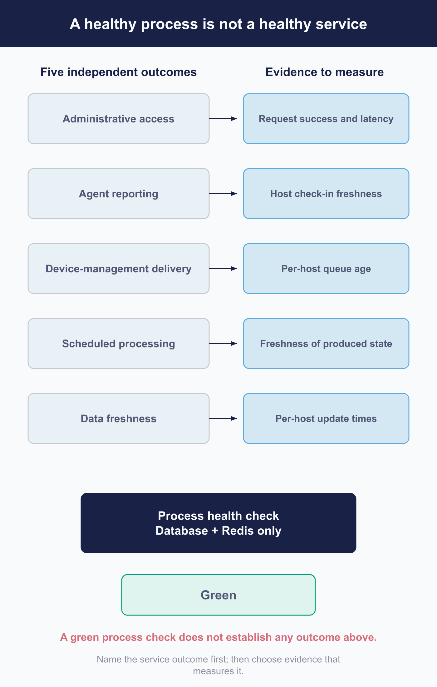

# Define the service operating model

 Running Fleet gives administrators a shared place to understand and manage devices. Keeping that service dependable takes a few agreements beyond the installation: what it should deliver, who maintains each dependency, how changes are approved, and who responds when something stops working.

This chapter helps you make those agreements. The operating model described here is a recommendation you can adapt to your organization. Fleet supplies health checks, metrics, and status data, but their coverage varies. Choose service outcomes that matter to your users, then establish which signals can tell you whether you are meeting them.

## Name the service outcomes

 Start with the work people depend on Fleet to do. Administrative access, device reporting, and delivery can fail independently, so give each outcome its own checks.

The following grouping is a useful starting point for an operating model; Fleet does not define these categories itself.

| Outcome | The question it answers |
|---|---|
| **Administrative access** | Can administrators and operators use Fleet? |
| **Agent reporting** | Are hosts continuing to report inventory and status? |
| **Device-management delivery** | Is requested work reaching devices? |
| **Scheduled processing** | Is Fleet's background work advancing? |
| **Data freshness** | Is the information current enough to act on? |

Fleet's health check tests the database and Redis. It does not verify any of the five outcomes above, so it can pass while an important service function is failing. [7.4](7.4-observe-progress-and-service-health.md) explains which additional signals you can use.

For each outcome, identify a useful indicator and the action someone should take when it crosses a threshold. This gives an alert both a purpose and an owner.

<!-- IMAGE-TODO: assets/7.1-outcomes-and-what-can-be-measured.webp
     PROMPT WRITTEN 2026-08-28 by the independent reviewer, against the chapter as corrected
     after its review round. Do not hand-edit; a hand-edited prompt is a new claim.
     DIAGRAM: Landscape 16:9 flat-vector outcome-and-measurement matrix titled "A healthy
     process is not a healthy service" for a technical operations manual.

     Divide the composition into two unequal vertical areas.

     LEFT AREA, headed "Five independent service outcomes":
     Draw exactly five separate horizontal rows:

     - "Administrative access"
     - "Agent reporting"
     - "Device-management delivery"
     - "Scheduled processing"
     - "Data freshness"

     Keep the rows independent, with no enclosing health-check boundary and no single line joining
     them into one status.

     Beside the five rows, but visibly disconnected from all of them, draw a much smaller neutral
     box headed "Fleet health check". Inside it place exactly two dependency chips:
     "Database"
     and
     "Redis".
     The health-check box may enclose these two chips only. It must not touch, overlap, point to,
     bracket, cover, or visually govern any of the five service outcomes.

     RIGHT AREA, headed "Cost of a usable measurement":
     Build four equal-width vertical cost bands, aligned against the five outcome rows:

     - "Cheap and direct"
     - "Cheap but partial"
     - "Expensive"
     - "Not available"

     These are cost categories, not sequential stages. Do not number them, connect them with arrows,
     graduate their colours from bad to good, or arrange them as a maturity ladder.

     Place the available measurements as follows:

     - Administrative access, under "Cheap and direct":
       "Request success and latency"

     - Agent reporting, under "Cheap but partial":
       "Oldest host check-in in a population you can already filter"

     - Device-management delivery, under "Cheap but partial":
       "Queue age from one host's view"
       Also place under "Expensive":
       "Estate-wide condition requires enumeration"

     - Scheduled processing, under "Not available":
       "No supported current schedule-status surface"

     - Data freshness, under "Cheap but partial":
       "Maximum staleness: one ordered read in a population you can already filter"
       Also place under "Expensive":
       "Share of the estate past an age: enumerate the population"

     Preserve empty cells. Do not invent a metric or proxy merely to make the matrix look complete.
     An empty "Not available" or other cost-band cell is intentional content.

     Make the contrast between the two data-freshness measurements visually explicit with a thin
     bracket reading:
     "Maximum is cheap; share is expensive because there is no staleness filter."

     Add a small footer note:
     "Objectives must match measurements that can actually be evaluated."

     Caption: "Five outcomes require different evidence, and some evidence costs more than the
     objective is worth."

     Use a clean humanist sans-serif with sentence case throughout. Keep the title, five outcome
     labels, and cost-band headings strong. Use smaller but fully legible type for measurement
     details and notes. Render every specified label exactly once. Avoid decorative lettering,
     condensed type, all-caps labels, and tiny text. Maintain generous whitespace and make the
     matrix legible at half-page width.

     PALETTE. Use Fleet Black #192147 for the strongest marks and outcome labels; #515774 for
     ordinary text; #8B8FA2 and #C5C7D1 for secondary structure; #E2E4EA, #D3E8F3, and #E8F1F6
     for grouping; #F9FAFC background. Use #5CABDF for cheap and direct, #3AEFC4 for cheap but
     partial, #FAA669 for expensive, and #D66C7B for not available. Apply these as light tints over
     cells, with text remaining neutral.

     Use accent colours at full strength only for small rules, chips, and bracket strokes; use
     roughly 20 to 25 percent tints over larger areas. Make the five-outcome label column the solid
     #192147 visual anchor. Keep the disconnected health-check box small and visually secondary.

     Use geometry and typography only. No security clip-art: no padlocks, shields, keys, vaults,
     or fingerprints. Never invent a colour outside the specified sets. Flat vector, generous
     whitespace, no gradients, no drop shadows, no 3D or photorealistic elements, no faux
     application screenshot, no logo, and no watermark. "Fleet" is software for managing
     computers. Never draw vehicles, cars, vans, trucks, ships, or aircraft. Never use an em dash
     in rendered text.
-->
## Set service levels and recovery objectives

 Set objectives that reflect what your users need and what your deployment can measure. Fleet does not publish an availability target, recovery-time objective, or data-loss target for you to adopt.

The cost and completeness of a measurement affect how useful it will be in regular operations:

| Measurement | What you can establish |
|---|---|
| **Request success and latency** | Direct, relatively inexpensive measurements when you collect Fleet's request metrics ([7.4](7.4-observe-progress-and-service-health.md)) |
| **Maximum staleness in a population you can already filter to** | One ordered query finds the oldest record. It does not tell you how many records are stale |
| **Share of a population older than an arbitrary age** | Requires enumeration because there is no staleness-threshold filter; this costs more to collect |
| **Whether a scheduled job is currently up to date** | Not available from the exposed signals; [7.4](7.4-observe-progress-and-service-health.md) explains the limits |
| **Attribution to a persistent server node** | Not available because Fleet's instance identifier changes after a restart |

Record measurement gaps alongside your objectives. If you cannot yet evaluate a desired target, document the missing capability so it can be addressed and does not become an unsupported service promise.

Give each objective five fields:

| Field | What to record |
|---|---|
| **Target** | The number and the population it applies to |
| **Measurement** | The specific source and the cost of collecting it |
| **Planned maintenance** | Whether maintenance is excluded, budgeted, or counted |
| **Owner** | Who is accountable when the objective is missed |
| **Gap** | Where the measured capability falls short of the target |

For recovery, set both the time you can afford to be unavailable and the amount of data you can afford to lose. Those objectives are related, but each needs its own value. Use a [restore rehearsal](7.2-back-up-and-restore-service-state.md) to establish your current capability. If the rehearsal falls short of a declared target, record the difference and agree on how to close it or revise the target.

## Assign operational ownership

 Fleet depends on services that may belong to different groups. Record a named owner and an escalation contact for each dependency, including responsibilities shared with the Fleet operator.

This table suggests where to start; use the owners that fit your organization.

| Component or relationship | Possible owner |
|---|---|
| Fleet itself | Fleet service owner and operators |
| MySQL, Redis, and object storage | Platform or database group |
| TLS certificates and name resolution | Platform group |
| Apple, Windows, and Android provider relationships | Fleet operators, with procurement where needed |
| Identity provider | Identity or security group |
| Observability platform | Platform or observability group |
| Fleet MCP server, if deployed | A named service owner responsible for its API-only identity, client bearer token, and operation ([6.6](../06-automate-fleet/6.6-connect-fleet-to-an-ai-assistant.md)) |

Include the effect of a dependency failure in that agreement. For example, a configured read replica participates in Fleet's health check. If it becomes unavailable, the check fails on every Fleet instance, even though the replica may have been introduced to improve performance ([7.5](7.5-maintain-capacity-and-availability.md)).

The database group may own the replica, while Fleet operators own the resulting service disruption. Both need to understand the failure behavior and know when to involve the other. Writing down that relationship makes incident response easier to coordinate.

## Build the operating calendar

 Maintain a calendar for renewals and recurring service work. Include preparation time and an owner for each item so work can begin before the deadline.

Fleet exposes some dates: licence expiry is available through the configuration endpoint, and a few provider credentials show their expiry in the interface. Other deadlines live in external consoles or certificate and key material. Apple, Windows, Android, and integration credentials can expire without a warning inside Fleet ([7.6](7.6-maintain-credentials-certificates-and-access.md)).

Use your credential inventory to build the renewal calendar. Allow time for provider access, approvals, validation, and recovery if a renewal fails. An Apple certificate renewal, for example, needs preparation beyond the expiry date itself.

Include these recurring activities:

- Credential and certificate expiry, with an owner and lead time for each item.
- [Release review](7.3-upgrade-fleet-and-fleetd.md) at your chosen cadence.
- [Access review](7.6-maintain-credentials-certificates-and-access.md).
- [Recovery rehearsal](7.2-back-up-and-restore-service-state.md).
- [Capacity review](7.5-maintain-capacity-and-availability.md).
- Change windows, if your organization uses them.

## Define change gates and evidence

 Before a significant change, record the current baseline, the acceptance criteria, the conditions that would make you stop, and the person authorized to make that decision. Use the same approach for [automated changes](../06-automate-fleet/6.1-automation-design-and-change-control.md) so operators have one consistent process to follow.

Fleet does not provide a supported way to run a server canary against an isolated schema within the same deployment. All instances share one database schema. A rolling replacement therefore exposes every instance to the migrated schema, including any still running the older binary.

You can evaluate a release in a separate Fleet deployment with its own database, or rehearse against an isolated restore of production-shaped data. The first checks the release in a separate environment; the second also checks its behavior with your data. Neither reproduces production traffic by itself. [7.3](7.3-upgrade-fleet-and-fleetd.md) describes these options and the limits of a rolling replacement.

For device-facing changes, use a small group of devices as the pilot: a deployment ring, a bounded fleet, or a label with a manageable target population ([5.1](../05-manage-devices/5.1-plan-target-and-govern-device-changes.md)).

After the change, work through the acceptance checks and record the results. The ordered checks in [7.3](7.3-upgrade-fleet-and-fleetd.md) provide a model you can adapt.

## Maintain the runbook portfolio

 Give each continuity risk a runbook with an owner, recovery steps, and a rehearsal schedule. Choose the ones that apply to your deployment; a service with no read replica, for example, does not need a replica-loss procedure.

| Runbook | Guidance | When it applies |
|---|---|---|
| **Upgrade and recovery** | [7.3](7.3-upgrade-fleet-and-fleetd.md) | Every deployment |
| **Restore, including isolation rules** | [7.2](7.2-back-up-and-restore-service-state.md) | Every deployment |
| **Database primary failure and promotion** | [7.5](7.5-maintain-capacity-and-availability.md) | Every deployment |
| **Read-replica loss and degraded operation** | [7.5](7.5-maintain-capacity-and-availability.md) | A read replica is configured |
| **Redis loss** | [7.2](7.2-back-up-and-restore-service-state.md) | Every deployment |
| **Object storage unavailable** | [7.5](7.5-maintain-capacity-and-availability.md) | You deliver software |
| **HTTPS certificate renewal** | [7.6](7.6-maintain-credentials-certificates-and-access.md) | Every deployment |
| **Apple certificate and token renewal** | [7.6](7.6-maintain-credentials-certificates-and-access.md) | You manage Apple devices |
| **Windows enrolment certificate renewal** | [7.6](7.6-maintain-credentials-certificates-and-access.md) | You manage Windows devices |
| **Credential compromise** | [7.6](7.6-maintain-credentials-certificates-and-access.md) | Every deployment |
| **Identity-provider outage and break-glass access** | [7.6](7.6-maintain-credentials-certificates-and-access.md) | You use an identity provider; verify that a local administrator can still sign in |
| **Log delivery stopped** | [7.4](7.4-observe-progress-and-service-health.md) | You ship logs to another destination |
| **Regional recovery** | [7.5](7.5-maintain-capacity-and-availability.md) | You have a second region |
| **Handoff to a new operator** | [7.7](7.7-production-readiness-checklist-and-handoff.md) | The service changes hands |
| **Retiring the deployment** | [7.8](7.8-retire-a-fleet-deployment.md) | Every deployment |

Keep Apple and Windows renewal procedures separate. Their consequences differ: Apple provides a safe rollover path, while the Windows enrolment certificate does not have an equivalent path in this release. [7.6](7.6-maintain-credentials-certificates-and-access.md) explains what each procedure must account for.

Exercise the runbooks and update them from the results. Restore and certificate-renewal rehearsals are especially useful for finding missing access, dependencies, and steps before a deadline or outage. Assign someone to maintain each procedure as the deployment changes.

When an outcome fails without an explained change, use the diagnostic process in [Part VIII](../08-troubleshooting/8.1-diagnostic-method.md). The owners, objectives, and evidence you have established here give that investigation a clear starting point.
