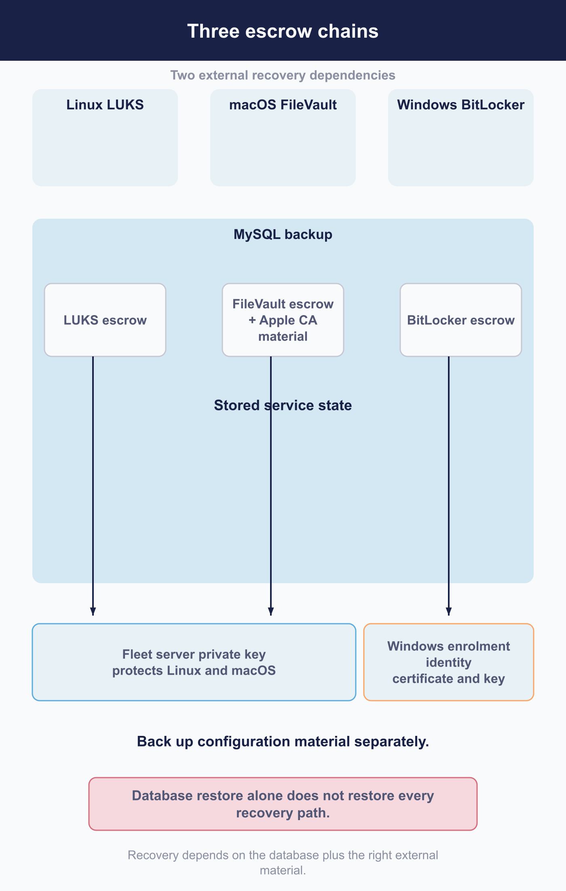

# Back up and restore service state

 A useful Fleet backup lets you recover the service, its stored information, and the credentials needed to use that information. Fleet does not include backup tooling, restore verification, or point-in-time recovery. You assemble those capabilities with your database and storage providers and a recovery procedure suited to your deployment.

Two details deserve attention as you plan. Some stored assets depend on encryption keys held outside MySQL, so a database backup alone cannot recover them. A restored Fleet can also resume work against external services. Restore rehearsals need network isolation before the process starts.

This chapter maps the state you need to protect and the checks that establish whether you can use it after a restore.

## Define the recovery objective and failure scope

 Begin with the failures you need to recover from. Accidental deletion, database corruption, a lost region, and a compromised deployment can each require a different procedure.

Record three decisions:

1. Which failures the procedure covers.
2. How long Fleet may remain unavailable after a failure.
3. How much data you can afford to lose.

Fleet does not supply recovery-time or data-loss targets. Set these with your service users, then use the recovery set and rehearsals below to establish what your deployment can achieve. Account for state outside the database when estimating both the work and the recovery time.

## Inventory the complete recovery set

 Fleet's recovery set spans four locations. Resolve each one against your deployment, including the storage backend, configuration sources, and any database replica you use.

| Location | State to account for | Recovery role |
|---|---|---|
| **MySQL** | Configuration, hosts, policies, activity, escrowed credentials, and encrypted Apple certificate authority material | The system of record |
| **File or object storage** | Installer bytes, icons, and bootstrap packages referenced by MySQL | Supplies the bytes needed to use those database records; the location depends on your deployment |
| **Redis** | Live query results, counters, pending notification sets, and transient coordination state | Preserves some work in flight; see the Redis decision below |
| **Configuration and external secret storage** | Server private key, Windows enrolment identity and key, other certificates, and server configuration | Supplies credentials and settings needed to make the restored state usable |

### The server private key, and what it does not cover

Fleet encrypts some stored assets with a server private key held in your configuration. MySQL contains the encrypted data, but recovering it requires that external key.

Disk-encryption escrow uses a different chain on each platform:

- **Linux** recovery material is encrypted directly under the server private key.
- **macOS** FileVault escrow uses the Apple certificate authority key. That key material is stored in MySQL, encrypted under the server private key. Recovery therefore needs the database and the external server private key.
- **Windows** BitLocker escrow uses the Windows enrolment identity certificate and its key, both held in server configuration. It does not use the server private key.

A database restore with the correct server private key can recover Linux and macOS escrow. To recover BitLocker escrow as well, preserve the Windows enrolment identity and key separately. [5.8](../05-manage-devices/5.8-enforce-disk-encryption-and-manage-recovery-credentials.md) explains how these credentials are used.

Back up the actual configuration and secret material, along with the references and infrastructure definitions needed to restore them. Include the server private key, Windows enrolment identity and key, and other certificates. The Apple certificate authority material is already part of the database backup.

<!-- IMAGE-TODO: assets/7.2-three-escrow-chains.webp
     PROMPT WRITTEN 2026-08-28 by the independent reviewer, against the chapter as corrected
     after its review round. The first brief placed the Apple certificate authority material
     outside the database, which is wrong and which the reviewer flagged as likely to be
     reproduced by any brief that did not say so explicitly. Do not hand-edit this prompt.
     PROMPT: Landscape 16:9 flat-vector dependency diagram titled "Three escrow chains, two external
     recovery dependencies". Use three equal vertical columns labelled "Linux LUKS", "macOS FileVault",
     and "Windows BitLocker".

     Draw one large boundary across the lower two-thirds labelled "MySQL backup". Inside it place
     exactly three stored-escrow boxes, one per platform. In the macOS column, also place a separate
     box labelled "Apple CA material, encrypted". Make it unmistakable that this Apple CA box is
     inside the MySQL backup.

     Above the database boundary, draw a narrow band labelled "Configuration material backed up
     separately". It contains exactly two items: "Fleet server private key" spanning the Linux and
     macOS columns, and "Windows enrolment identity certificate and key" above Windows only.

     Draw the dependency arrows: Linux escrow up to the server private key directly. macOS escrow up
     to the Apple CA material box, and from that box up to the server private key, so the two hops are
     visible and the first hop stays inside the database boundary. Windows escrow up to the Windows
     enrolment identity, with NO connection of any kind to the server private key.

     Add a caption: "A database restore plus the server private key recovers two of the three."

     ACCURACY: the Apple CA material must be inside the database boundary. The Windows chain must have
     no link to the server private key. Do not draw a single shared root. Do not show any key value,
     storage location, table name or retrieval path; this is a dependency shape, not a map.

     PALETTE: Fleet Black #192147 for the strongest marks and the boundary label; #515774 for ordinary
     text; #8B8FA2 and #C5C7D1 for secondary structure; #E2E4EA and #E8F1F6 for grouping; #F9FAFC
     background. Use #5CABDF for the server private key and its dependency arrows, and #D66C7B for the
     Windows enrolment identity and its arrow, so the reader can see at a glance that one column is
     served by different material. Keep text in the neutral set. No gradients, shadows, 3D, logos,
     watermark, vehicles, ships or aircraft. Generous whitespace, legible at half-page width. Never use
     an em dash in rendered text. NOTE: "Fleet" here is software for managing computers.
-->

### Missing and incorrect keys

A wrong key causes a failure when Fleet tries to use an encrypted asset. Depending on the feature, that may happen at startup or later during use.

A missing key can be less obvious. Depending on the remaining configuration, Fleet may start, serve requests, and persist a disabled Apple MDM status into the database. A test process connected to production without the production key can therefore change production state. Confirming whether that happened may require reading the tables directly ([8.6](../08-troubleshooting/8.6-server-state.md)).

Always supply the correct production key before connecting a Fleet binary to the production database. The health endpoint does not test that key or verify that encrypted assets are readable, so a passing health check cannot establish that the configuration is complete.

## Account for the Fleet MCP server, if you run one

 The [Fleet MCP server](../06-automate-fleet/6.6-connect-fleet-to-an-ai-assistant.md) stores no Fleet data of its own. It does not need a separate database or object-storage backup, but you do need to preserve enough configuration to rebuild and reconnect it.

Record the Fleet source tag used for the build. `cmd/fleet-mcp` has no release tag of its own; rebuild it from the tag matching the Fleet server you are restoring. Back up its deployment definition, including the systemd unit or equivalent and the TLS proxy configuration for SSE.

Account for its two tokens separately:

- **`FLEET_API_KEY`** belongs to the API-only user and is stored as a session key in MySQL. A database restore brings back the stored token, but Fleet's UI and API cannot display it again after creation ([2.6](../02-administer-and-deploy-fleet/2.6-user-accounts-roles-and-service-identities.md)). Keep the captured value in your secret store for normal use. MySQL stores these tokens without hashing, so protect the backup as credential material.
- **`MCP_AUTH_TOKEN`** is generated outside Fleet, which has no record of it. The MCP server requires it at startup on both transports. If it is lost, generate a replacement, update the server environment, and restart. SSE clients also need the new bearer value in their `Authorization` header. Stdio clients supply it through their launch configuration. Replacing this token does not lose Fleet data.

## Protect MySQL and object storage coherently

 Use your database and storage providers' backup procedures, and document how the two captures relate in time. Fleet provides no tooling to coordinate them.

Encrypt MySQL backups at rest and restrict access to them. Session keys, including non-expiring API-only tokens, are stored without hashing. A backup therefore contains working credentials for sessions that remain live. Handle it with the same care as other service secrets.

Because the database and storage are captured separately, a restore can produce either of these mismatches:

| Mismatch | Effect |
|---|---|
| A database row references missing bytes | Fleet has a record of an installer or other asset it cannot retrieve |
| An object has no corresponding database row | The bytes exist in storage, but Fleet does not know about them |

Fleet does not detect and repair these mismatches. Choose the capture order deliberately and record the consistency gap your procedure allows.

Also account for cleanup after a restore. Fleet removes stale, unreferenced installer, icon, and bootstrap objects. If you restore an older database against newer storage, objects absent from that database can become deletion candidates. Verify whether your storage keeps recoverable versions before relying on it to protect those objects.

## Plan Redis loss and restart

 Decide whether your recovery procedure restores Redis or starts it empty. Both approaches can be reasonable, provided you account for the work that an empty restart loses.

Redis holds live query results as messages, along with counters, pending notification sets, and other transient state. Losing it discards live query results in flight and pending notification sets, so those pending deliveries do not happen ([6.5](../06-automate-fleet/6.5-integrations-webhooks-and-external-workflows.md)). Rate-limit and error counters also reset.

Scheduler locks are stored in MySQL's `locks` table. Their bookkeeping survives a Redis loss ([7.3](7.3-upgrade-fleet-and-fleetd.md)).

Persisting Redis can reduce disruption to work in flight. Starting empty can simplify and speed recovery, while preserving MySQL as the system of record. Document your choice and its consequences in the runbook so the recovering operator has a clear procedure.

## Restore into an isolated environment

 Deny external egress before starting a restored Fleet instance. Fleet has no read-only mode, global schedule-stop switch, or automatic way to recognize that it is running from a copy of production.

Schedules have individual gates and timings, but a restored instance can resume external work whenever the relevant feature, credentials, and triggering state are present. Without any device checking in, it can:

- Drain a restored job queue into your ticketing system.
- Reconcile Apple enrolment assignments with Apple.
- Create or delete calendar events.
- Send webhooks to configured destinations.

Network isolation provides a boundary across all of those paths. Configuration alone does not, because the restored database also contains the production settings.

Before startup, block outbound access to device push services, enterprise mobility and business-manager services, the identity provider, ticketing and calendar providers, and every configured webhook destination. Allow only the isolated dependencies required for the rehearsal, such as its database and storage. Maintain that isolation for the lifetime of the copy.

## Verify semantic recovery

 Check that the restored service can use its state. Work through these checks in order and record the result of each:

1. Confirm the expected version and migration state ([7.3](7.3-upgrade-fleet-and-fleetd.md)).
2. Sign in to verify database access and session handling.
3. Find representative records, including a fleet, hosts, a policy, and a configuration profile.
4. Retrieve an object to test storage and its database reference.
5. Retrieve an encrypted credential to test decryption.

For the final check, retrieve one credential from each platform you manage in the isolated environment. Linux, macOS, and Windows use different key chains, so success on one does not verify the others. Confirm that a value was returned without displaying or using it.

The existing decryptability counts are not sufficient evidence. Fleet's verification job does not re-test rows already marked with a result, so a restored database retains the flags from before the backup. Retrieving a credential exercises the current key chain.

A successful retrieval proves that the service can decrypt that stored value. It does not prove that every credential is readable or that the returned credential will unlock its device. Unlocking requires a check on a real machine, covered in [5.8](../05-manage-devices/5.8-enforce-disk-encryption-and-manage-recovery-credentials.md).

## Set retention and deletion order

 Coordinate retention across Fleet, the database, object storage, and external log destinations. Each policy governs its own copy of the data; a short retention period in one system does not remove copies elsewhere.

Fleet's activity expiry excludes host-linked activities. Policy-automation activities are host-linked by construction, so they can remain indefinitely even with a thirty-day activity window. They become eligible for expiry once deleting the host removes the link ([5.9](../05-manage-devices/5.9-automate-remediation-with-policies.md)).

Host deletion also has several forms of cleanup: some rows are removed immediately, some remain marked as deleted, and others become orphaned for a later sweep. Where complete deletion is required, verify the resulting state and the remaining copies against that requirement.

## Rehearse disaster recovery

 Run a timed restore from an actual backup and record any data loss. Those results establish your measured recovery capability and show whether you can meet the objectives set in [7.1](7.1-define-the-service-operating-model.md).

A useful rehearsal covers the database and object storage together. Supply the private key and certificates from their separate recovery source to confirm that they are available. Keep external egress denied throughout, and complete all five verification steps above, including credential retrieval for each platform.

Record missing instructions, access, or dependencies as you encounter them, then update the runbook. If the measured recovery time or data loss exceeds the target, agree on the investment needed to close the gap or revise the objective.

For writer promotion, traffic failover, and regional recovery, continue to [7.5](7.5-maintain-capacity-and-availability.md). This rehearsal establishes whether the state you preserved is sufficient to recover the service.

## Reference and troubleshooting

 [A.3](../09-appendices/a.3-configuration-model-and-precedence.md) lists configuration keys for storage backends, retention, and credentials. [7.6](7.6-maintain-credentials-certificates-and-access.md) covers the rotation limits and procedures for private keys and certificates.

## Version notes

 The state relationships described here were verified against Fleet 4.90.0, including the escrow key chains, object cleanup, and the verification job's treatment of existing results. Fleet supplies no backup tooling, but releases can change the state your backup procedure needs to protect. Review that recovery set when upgrading.
