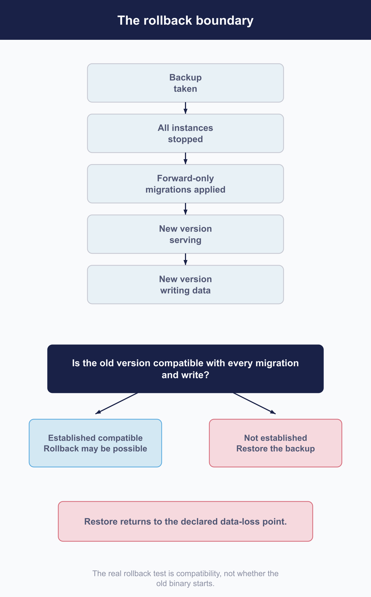

# Upgrade Fleet server and coordinate fleetd releases

 A planned upgrade lets you adopt Fleet improvements while keeping device reporting and management work dependable. Prepare a recovery point, rehearse the migration, and agree on the checks that will show the service has resumed.

Starting the new binary is the first check. Host check-ins, scheduled work, and a representative read and write establish that the upgraded service is ready for use.

Before choosing a deployment procedure, account for three limits: database migrations are forward-only, the bundled Helm chart handles migration differently from Fleet's documented offline procedure, and an older binary can start against an incompatible newer schema. The sections below explain how each affects the change window and recovery plan.

## Coordinate server, fleetctl, and fleetd versions

 The server and `fleetctl` share a release train and version together. You can deploy them separately, but a version mismatch produces a warning rather than a refusal ([6.4](../06-automate-fleet/6.4-use-fleetctl.md)).

fleetd has its own versions and update channels. [3.8](../03-connect-devices/3.8-manage-fleetd-orbit-and-updates.md) explains how devices discover and apply updates. For upgrade planning, record the server, CLI, and agent versions you have actually tested together, along with the conditions for promoting or stopping an update.

If you run the [Fleet MCP server](../06-automate-fleet/6.6-connect-fleet-to-an-ai-assistant.md), rebuild it from the target Fleet tag as part of the upgrade. `cmd/fleet-mcp` has no separate release tag. Redeploy and restart it, then make one authenticated read from the assistant. This checks tool discovery and the Fleet token, plus the client bearer token over SSE, without running work on a device.

## Assess migrations and measure the window

 Fleet migrations move the database forward. At this version, down-migrations do nothing, so plan recovery without assuming the preparation command can reverse its changes.

A binary rollback is safe only when you have established that the current database state remains compatible with the older release. Consider both the migrations and any data the new release has written. If that compatibility is unknown, plan to restore the database.

### Measure migration time in a rehearsal

Fleet has no model that predicts migration duration. Query plans, database configuration, and statistics affect the work, so row counts alone cannot give you a reliable window. Fleet 4.90.0, for example, included a migration that could take hours on deployments with many host certificates. Version 4.90.1 fixes that migration, but other upgrade paths still need their own estimates.

Rehearse the exact migration set for your source and target versions against restored production-sized data. Use the same database version, configuration, and statistics. Add time for draining instances, replication catch-up, startup, and acceptance checks to the measured migration time.

Fleet's published typical duration can provide context, but it does not bound the time required for your deployment.

### Ensure there is one migration runner

Fleet has no advisory migration lock and no uniqueness constraint on the applied-migration record. Your deployment procedure must ensure that exactly one runner performs the migration. Make that requirement explicit in both the runbook and any automation.

Also check for an incomplete migration history. If a lower-numbered migration is missing while a higher-numbered migration is recorded as applied, the runner skips the missing entry on every attempt. Preparation can report success while the server repeatedly refuses to start. In that situation, inspect the applied-migration record; rerunning preparation will skip the same entry again.

If migration status reports either of the two known-bad states Fleet identifies for a historical fix, stop and seek support or restore. Do not continue merely because preparation can proceed past its warning.

## Prepare the change and the recovery point

 Complete the preparation while the service is stable and the people responsible for the change are available.

1. Read the release notes for every version between your current release and the target. Check upgrade-specific steps, minimum agent versions, and ordering requirements.
2. Take a backup and verify that it can be restored, using the checks in [7.2](7.2-back-up-and-restore-service-state.md).
3. Record current values for the service indicators defined in [7.1](7.1-define-the-service-operating-model.md). These are the baselines for acceptance.
4. Count the work in flight, as described below.
5. Pause high-risk or irreversible work that should not be interrupted by the upgrade.
6. Record when recovery will require a database restore and the resulting data-loss window.

A restore loses writes made after the selected backup. Agree on that consequence before starting the change, including the point at which a binary rollback alone would no longer be safe.

## Account for work in flight

 Much of Fleet's work is pull-based. An agent that misses a check-in can return later, and an undelivered queued item can be collected on a later connection. Other work needs closer attention during a restart.

| Work | Restart behavior |
|---|---|
| **Live query results** | Results are messages rather than durable records. A lost subscriber discards them. An arriving result may close an orphaned campaign a minute later; otherwise the campaign waits for cleanup |
| **Worker jobs** | Jobs restart from the beginning. If a job already created an external ticket, retrying it can create a duplicate |
| **Scheduled jobs** | A graceful stop records pending runs as cancelled, but a surviving lock can delay another runner for the schedule's interval. After an ungraceful stop, stale pending state can delay work longer |

Record queued activities, pending MDM commands, and worker jobs before and after the upgrade. The counts need not match exactly; use their movement to establish whether processing has resumed.

Inspect a host queue that stops advancing. An activated activity without a result survives a restart and can be fetched again. If it never receives a result or cancellation, it blocks later work on that host indefinitely. Fleet has no age-based reaper for that state ([5.1](../05-manage-devices/5.1-plan-target-and-govern-device-changes.md)).

## Upgrade every instance and migrate offline

 Fleet's documented procedure stops all instances before changing the database: stop every instance, replace the release, run database preparation once, then start the new version.

The bundled Helm chart uses a different sequence. In its default configuration with an external database and automatic migrations enabled, a pre-upgrade hook runs the migration while existing pods can continue serving. After the hook succeeds, the Deployment updates. Because the chart specifies no strategy, Kubernetes supplies its default rolling replacement, allowing old and new pods to overlap.

Account for both periods: older pods may serve during migration, and different binary versions may serve after migration. Helm and Kubernetes provide those lifecycle behaviors; they do not establish Fleet compatibility or a zero-downtime guarantee. All pods still share the migrated schema, so the rolling replacement does not provide the isolated server canary discussed in [7.1](7.1-define-the-service-operating-model.md).

Other deployment examples need the same review. The DigitalOcean example declares a pre-deploy migration job, but Fleet's source does not establish what that platform does with serving instances. The AWS example calls an external migration module whose lifecycle is outside this repository.

If you retain a deployment example's behavior, make it an explicit operational choice supported by your testing. Whichever procedure you choose, ensure that preparation runs exactly once.

<!-- IMAGE-TODO: assets/7.3-rollback-boundary.webp
     PROMPT WRITTEN 2026-08-28 by the independent reviewer, against the chapter as corrected
     after its review round. Do not hand-edit; a hand-edited prompt is a new claim.
     DIAGRAM: Landscape 16:9 flat-vector upgrade and rollback-boundary diagram for a
     technical operations manual.

     Across the upper third, draw a strong left-to-right upgrade timeline with these stages:

     1. "Backup taken"
     2. "All instances stopped"
     3. "Forward-only migrations applied"
     4. "New version serving"
     5. "New version writing data"

     Draw the migration arrow in one direction only. Add a small annotation directly beneath it:
     "Down-migrations do nothing."
     Do not draw any reverse arrow through the migration stage.

     At "Backup taken", place a vertical rose rule labelled "Declared data-loss point for restore".
     Extend a light rose band from that rule beneath the rest of the timeline and label it:
     "If recovery restores this backup, every write after this point is lost."

     At the migration stage, add a smaller dashed marker labelled:
     "Naive test: Did any migration run?"
     Cross this marker with a thin diagonal rule and add "Insufficient rollback test". It is an
     assumption people use, not the actual rollback boundary.

     Beneath the two current-state stages, create one large solid #192147 decision card:
     "Is the whole current database state backward-compatible with the old binary?"
     Feed exactly two distinct inputs into it:

     - From the migration stage:
       "A migration removed, narrowed, or transformed something the old binary expects"

     - From the new-version writing stage:
       "The new release wrote data the old binary cannot interpret"

     The two inputs must remain separate until they enter the decision card. This question applies
     to the whole current database state, not merely to the migration ledger.

     From the decision card show two legitimate recovery paths:

     - "Compatibility established for this upgrade"
       arrow to
       "Binary rollback may be used"

     - "Compatibility false or not established"
       arrow downward to
       "Restore the pre-migration database"

     The restore path must be drawn as a separate recovery operation below the timeline, not as an
     arrow travelling backward through migrations.

     On the lower right, show a cautionary inset headed "Starting the old binary anyway". Draw:

     "Old binary starts against newer schema"
     arrow to a small warning strip
     "Generic unknown-migrations warning"
     with the note
     "Warning only; no compatibility verdict"
     arrow to a two-lane service card:

     - "Most service paths keep serving"
     - "One incompatible subsystem fails"

     Make only the second lane go dark with a rose failure treatment. The old binary starts and the
     service fails partially; do not depict a startup refusal, total crash, or whole-server outage.
     Fleet does emit the generic warning, so do not omit it, but the warning must not appear to know
     or signal the real compatibility boundary.

     Caption: "Rollback depends on the current database state, including migrations and new writes,
     not on whether a migration merely ran."

     Use a clean humanist sans-serif with sentence case throughout. Keep the timeline stages and
     central compatibility question strong, with warnings and recovery notes smaller but fully
     legible. Render every specified label exactly once. Avoid decorative lettering, condensed type,
     all-caps labels, and tiny text. Maintain generous whitespace and make the diagram legible at
     half-page width.

     PALETTE. Use Fleet Black #192147 for the central decision and strongest marks; #515774 for
     ordinary text; #8B8FA2 and #C5C7D1 for secondary structure; #E2E4EA, #D3E8F3, and #E8F1F6
     for grouping; #F9FAFC background. Use #009A7D for the normal forward upgrade path, #FAA669
     for the naive-test marker and generic warning, #5CABDF for the established-compatible branch,
     and #D66C7B for the restore boundary, data-loss band, and failed subsystem. Keep text neutral
     except white text on the solid #192147 decision card.

     Use accent colours at full strength only for small rules, warning strokes, and arrowheads; use
     roughly 20 to 25 percent tints over larger areas. Make the compatibility question the visual
     anchor. Keep the naive boundary visibly weaker than the real test.

     Use geometry and typography only. No security clip-art: no padlocks, shields, keys, vaults,
     or fingerprints. Never invent a colour outside the specified sets. Flat vector, generous
     whitespace, no gradients, no drop shadows, no 3D or photorealistic elements, no faux
     application screenshot, no logo, and no watermark. "Fleet" is software for managing
     computers. Never draw vehicles, cars, vans, trucks, ships, or aircraft. Never use an em dash
     in rendered text.
-->
## Prove the service resumed

 Work through these acceptance checks in order. Each adds evidence beyond a process that starts successfully.

| Order | Check | Evidence |
|---|---|---|
| 1 | **Every serving node runs the intended release** | Check each instance's reported version directly, rather than relying on the load balancer |
| 2 | **Migrations are current** | Run the migration status check against an authenticated, serving server |
| 3 | **Health and dependencies pass** | Check the health endpoint, with the coverage limits described in [7.4](7.4-observe-progress-and-service-health.md) |
| 4 | **A bounded read and a reversible write succeed** | Use operations chosen before the change |
| 5 | **Agent check-ins resume** | Confirm that host counts and last-seen times move |
| 6 | **Scheduled work resumes** | Check completion, recorded errors, and the state the job should advance |
| 7 | **Queue processing resumes** | Compare the earlier counts and confirm that work progresses |
| 8 | **Service indicators return to baseline** | Compare the indicators from 7.1 with the values recorded before the upgrade |

For scheduled work, a completion record alone is insufficient. Read the recorded errors and check the result the job was meant to produce. A job can finish without advancing that state.

`fleetctl debug migrations` and its HTTP equivalent require an authenticated, serving server. They cannot inspect a server that refuses to start. Database preparation also changes state, so do not use it as a read-only status check.

If an acceptance check fails, record which one and continue with the diagnostic process in [Part VIII](../08-troubleshooting/8.1-diagnostic-method.md).

## Roll out fleetd through established channels

 Plan the fleetd rollout separately from the server upgrade window. This keeps the effect of each change easier to assess and gives each its own stop conditions. [3.8](../03-connect-devices/3.8-manage-fleetd-orbit-and-updates.md) covers the update-channel mechanics.

Promote the agent through a pilot group, a broader group, and then the estate. At each stage, watch the versions hosts actually report and the service indicators you chose. Agree beforehand on who may stop promotion and what would trigger that decision.

Allow for devices that are powered off, travelling, or rarely used. Their delayed updates will leave a long tail in the version distribution. Account for that population when judging rollout progress rather than expecting every host to update within the server's change window.

## Recover from a failed upgrade

 Choose recovery based on the database's current compatibility with the previous release. Fleet can start an older binary against a newer schema without establishing that it will work correctly.

### Check compatibility before a binary rollback

An older binary emits a generic warning about unknown migrations and then serves requests. Incompatible paths can fail while other requests continue to succeed.

The migration leading into 4.90 provides a concrete example. It copies retained content out of a Windows configuration-profile table and drops the table. The preceding release still inserts into, reads from, and cleans that table during Windows profile removal and reconciliation. Those operations can fail after a binary rollback even while the service responds to other traffic.

Before relying on a rollback, review the migration set and any writes made by the new release. Dropped tables, transformed data, or changed assumptions can each break compatibility. Fleet's unknown-migrations warning does not provide a compatibility verdict.

### Choose the recovery procedure

Before any migration has applied, restoring the old binary is a quick recovery without migration-related data loss.

After a migration has applied, return to the old binary only if you have established that it can use the current database state, including data written by the new release. Otherwise, restore the pre-migration database and accept the loss of later writes identified in your recovery plan.

After either procedure, repeat all eight acceptance checks. Use the same evidence to confirm recovery that you used to judge the upgrade.
